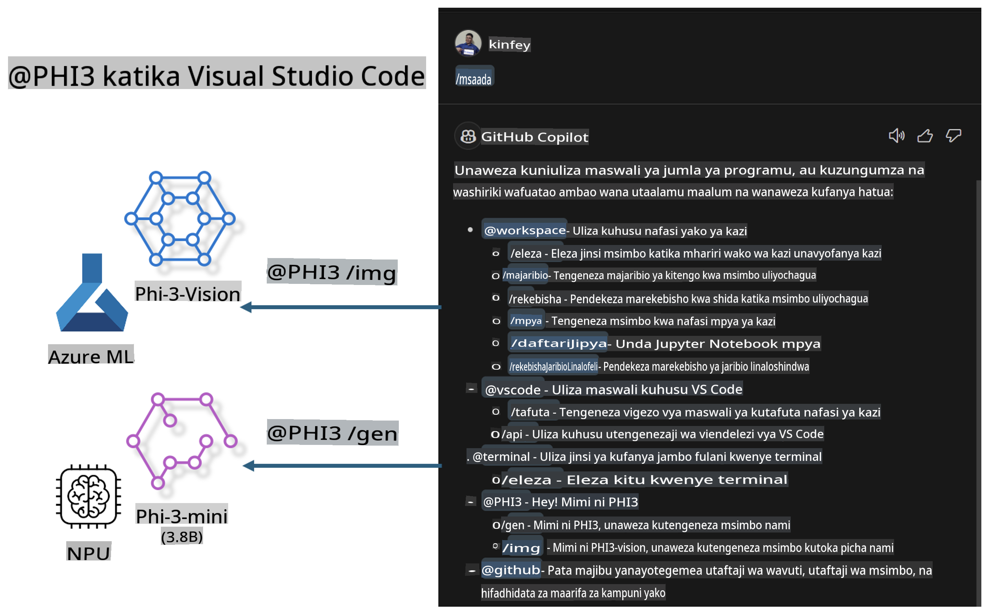

# **Jenga Chat yako ya GitHub Copilot kwenye Visual Studio Code kwa Microsoft Phi-3 Family**

Je, umewahi kutumia wakala wa workspace kwenye GitHub Copilot Chat? Unataka kujenga wakala wa timu yako mwenyewe kwa msimbo? Maabara hii ya vitendo inalenga kuchanganya mfano wa chanzo wazi ili kujenga wakala wa biashara ya msimbo wa kiwango cha shirika.

## **Msingi**

### **Kwa nini uchague Microsoft Phi-3**

Phi-3 ni familia ya mfululizo, ikiwa ni pamoja na phi-3-mini, phi-3-small, na phi-3-medium kulingana na vigezo tofauti vya mafunzo kwa ajili ya uzalishaji wa maandishi, kukamilisha mazungumzo, na uzalishaji wa msimbo. Pia kuna phi-3-vision inayotegemea Vision. Inafaa kwa mashirika au timu tofauti kuunda suluhisho za AI za kizazi cha nje ya mtandao.

Inapendekezwa kusoma kiungo hiki [https://github.com/microsoft/PhiCookBook/blob/main/md/01.Introduction/01/01.PhiFamily.md](https://github.com/microsoft/PhiCookBook/blob/main/md/01.Introduction/01/01.PhiFamily.md)

### **Microsoft GitHub Copilot Chat**

Kiendelezi cha GitHub Copilot Chat hukupa kiolesura cha mazungumzo kinachokuwezesha kuwasiliana na GitHub Copilot na kupokea majibu ya maswali yanayohusiana na msimbo moja kwa moja ndani ya VS Code, bila kulazimika kutafuta nyaraka au vikao vya mtandaoni.

Copilot Chat inaweza kutumia uonyeshaji wa sintaksia, uingizaji, na vipengele vingine vya upangaji ili kuongeza uwazi wa jibu lililotolewa. Kulingana na aina ya swali kutoka kwa mtumiaji, matokeo yanaweza kuwa na viungo kwa muktadha ambao Copilot ilitumia kutoa jibu, kama faili za msimbo wa chanzo au nyaraka, au vitufe vya kufikia utendakazi wa VS Code.

- Copilot Chat inaunganishwa na mtiririko wako wa maendeleo na hukupa msaada mahali unapohitaji:

- Anzisha mazungumzo ya papo hapo moja kwa moja kutoka kwa mhariri au terminal ili kupata msaada unapokuwa unaandika msimbo

- Tumia mtazamo wa Mazungumzo kuwa na msaidizi wa AI kando kukusaidia wakati wowote

- Zindua Quick Chat kuuliza swali la haraka na kurudi kwenye kile unachofanya

Unaweza kutumia GitHub Copilot Chat katika hali mbalimbali, kama vile:

- Kujibu maswali ya msimbo kuhusu jinsi ya kutatua tatizo vyema

- Kuelezea msimbo wa mtu mwingine na kupendekeza maboresho

- Kupendekeza marekebisho ya msimbo

- Kutoa kesi za majaribio ya kitengo

- Kutoa nyaraka za msimbo

Inapendekezwa kusoma kiungo hiki [https://code.visualstudio.com/docs/copilot/copilot-chat](https://code.visualstudio.com/docs/copilot/copilot-chat?WT.mc_id=aiml-137032-kinfeylo)

### **Microsoft GitHub Copilot Chat @workspace**

Kutaja **@workspace** kwenye Copilot Chat hukuwezesha kuuliza maswali kuhusu msimbo mzima wa msingi wako. Kulingana na swali, Copilot hurejesha kwa akili faili na alama husika, ambazo kisha huzitaja katika jibu lake kama viungo na mifano ya msimbo.

Ili kujibu swali lako, **@workspace** hutafuta kupitia vyanzo sawa ambavyo msanidi programu angevitumia wakati wa kuvinjari msimbo wa msingi katika VS Code:

- Faili zote katika workspace, isipokuwa faili ambazo zimepuuzwa na faili ya .gitignore

- Muundo wa saraka na majina ya folda na faili zilizopachikwa

- Kielezo cha utafutaji wa msimbo wa GitHub, ikiwa workspace ni hazina ya GitHub na imewekwa kwenye utafutaji wa msimbo

- Alama na ufafanuzi katika workspace

- Maandishi yaliyochaguliwa kwa sasa au maandishi yanayoonekana katika mhariri wa kazi

Kumbuka: .gitignore inapuuzwa ikiwa una faili wazi au maandishi yaliyochaguliwa ndani ya faili iliyopuuzwa.

Inapendekezwa kusoma kiungo hiki [[https://code.visualstudio.com/docs/copilot/copilot-chat](https://code.visualstudio.com/docs/copilot/workspace-context?WT.mc_id=aiml-137032-kinfeylo)]

## **Jifunze zaidi kuhusu Maabara hii**

GitHub Copilot imeboresha kwa kiasi kikubwa ufanisi wa upangaji wa programu wa mashirika, na kila shirika linatamani kubinafsisha vipengele vinavyohusiana na GitHub Copilot. Mashirika mengi yamebinafsisha Viendelezi vinavyofanana na GitHub Copilot kulingana na hali zao za biashara na mifano ya chanzo wazi. Kwa mashirika, Viendelezi vilivyobinafsishwa ni rahisi kudhibiti, lakini hii pia huathiri uzoefu wa mtumiaji. Baada ya yote, GitHub Copilot ina uwezo mkubwa wa kushughulikia hali za jumla na taaluma. Ikiwa uzoefu unaweza kubaki sawa, ingekuwa bora kubinafsisha Kiendelezi cha shirika mwenyewe. GitHub Copilot Chat hutoa API zinazohusiana kwa mashirika kupanua uzoefu wa Mazungumzo. Kudumisha uzoefu thabiti na kuwa na vipengele vilivyobinafsishwa ni uzoefu bora wa mtumiaji.

Maabara haya hutumia kwa kiasi kikubwa mfano wa Phi-3 uliounganishwa na NPU ya ndani na mseto wa Azure kujenga Wakala wa kawaida kwenye GitHub Copilot Chat ***@PHI3*** kusaidia wasanidi programu wa mashirika kukamilisha uzalishaji wa msimbo ***(@PHI3 /gen)*** na kutoa msimbo kulingana na picha ***(@PHI3 /img)***.

### ***Kumbuka:*** 

Maabara haya kwa sasa yameundwa kwenye AIPC ya Intel CPU na Apple Silicon. Tutaendelea kusasisha toleo la NPU ya Qualcomm.

## **Maabara**

| Jina | Maelezo | AIPC | Apple |
| ------------ | ----------- | -------- |-------- |
| Lab0 - Usakinishaji (✅) | Sanidi na sakinisha mazingira yanayohusiana na zana za usakinishaji | [Go](./HOL/AIPC/01.Installations.md) |[Go](./HOL/Apple/01.Installations.md) |
| Lab1 - Endesha Prompt flow na Phi-3-mini (✅) | Imeunganishwa na AIPC / Apple Silicon, kutumia NPU ya ndani kuunda uzalishaji wa msimbo kupitia Phi-3-mini | [Go](./HOL/AIPC/02.PromptflowWithNPU.md) |  [Go](./HOL/Apple/02.PromptflowWithMLX.md) |
| Lab2 - Peleka Phi-3-vision kwenye Azure Machine Learning Service (✅) | Toa msimbo kwa kutumia Model Catalog ya Azure Machine Learning Service - picha ya Phi-3-vision | [Go](./HOL/AIPC/03.DeployPhi3VisionOnAzure.md) |[Go](./HOL/Apple/03.DeployPhi3VisionOnAzure.md) |
| Lab3 - Unda wakala @phi-3 kwenye GitHub Copilot Chat (✅)  | Unda wakala wa kawaida wa Phi-3 kwenye GitHub Copilot Chat kukamilisha uzalishaji wa msimbo, msimbo wa picha, RAG, n.k. | [Go](./HOL/AIPC/04.CreatePhi3AgentInVSCode.md) | [Go](./HOL/Apple/04.CreatePhi3AgentInVSCode.md) |
| Msimbo wa Mfano (✅)  | Pakua msimbo wa mfano | [Go](../../../../../../../code/07.Lab/01/AIPC) | [Go](../../../../../../../code/07.Lab/01/Apple) |

## **Rasilimali**

1. Phi-3 Cookbook [https://github.com/microsoft/Phi-3CookBook](https://github.com/microsoft/Phi-3CookBook)

2. Jifunze zaidi kuhusu GitHub Copilot [https://learn.microsoft.com/training/paths/copilot/](https://learn.microsoft.com/training/paths/copilot/?WT.mc_id=aiml-137032-kinfeylo)

3. Jifunze zaidi kuhusu GitHub Copilot Chat [https://learn.microsoft.com/training/paths/accelerate-app-development-using-github-copilot/](https://learn.microsoft.com/training/paths/accelerate-app-development-using-github-copilot/?WT.mc_id=aiml-137032-kinfeylo)

4. Jifunze zaidi kuhusu GitHub Copilot Chat API [https://code.visualstudio.com/api/extension-guides/chat](https://code.visualstudio.com/api/extension-guides/chat?WT.mc_id=aiml-137032-kinfeylo)

5. Jifunze zaidi kuhusu Azure AI Foundry [https://learn.microsoft.com/training/paths/create-custom-copilots-ai-studio/](https://learn.microsoft.com/training/paths/create-custom-copilots-ai-studio/?WT.mc_id=aiml-137032-kinfeylo)

6. Jifunze zaidi kuhusu Katalogi ya Modeli ya Azure AI Foundry [https://learn.microsoft.com/azure/ai-studio/how-to/model-catalog-overview](https://learn.microsoft.com/azure/ai-studio/how-to/model-catalog-overview)

**Kanusho**:  
Hati hii imetafsiriwa kwa kutumia huduma za tafsiri za AI zinazotegemea mashine. Ingawa tunajitahidi kwa usahihi, tafadhali fahamu kuwa tafsiri za kiotomatiki zinaweza kuwa na makosa au kutokuwa sahihi. Hati ya asili katika lugha yake ya awali inapaswa kuzingatiwa kama chanzo cha mamlaka. Kwa habari muhimu, inashauriwa kutumia huduma za wataalamu wa tafsiri ya kibinadamu. Hatutawajibika kwa kutoelewana au tafsiri zisizo sahihi zinazotokana na matumizi ya tafsiri hii.