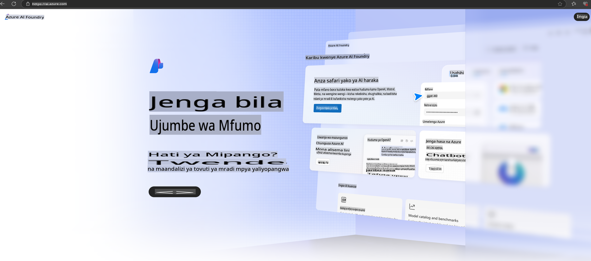

# **Kutumia Phi-3 katika Azure AI Foundry**

Kwa maendeleo ya AI ya Kizazi, tunalenga kutumia jukwaa moja linalounganisha LLM na SLM tofauti, ujumuishaji wa data za shirika, shughuli za kurekebisha/kuchota (RAG), na tathmini ya biashara za shirika baada ya kuunganisha LLM na SLM, ili matumizi ya AI ya Kizazi yafanyike kwa ufanisi zaidi. [Azure AI Foundry](https://ai.azure.com) ni jukwaa la kiwango cha shirika kwa matumizi ya AI ya Kizazi.

Kwa kutumia Azure AI Foundry, unaweza kutathmini majibu ya mifano mikubwa ya lugha (LLM) na kupanga vipengele vya programu ya maelekezo kwa utendaji bora. Jukwaa hili linawezesha upanuzi wa miradi kutoka majaribio hadi uzalishaji kamili kwa urahisi. Ufuatiliaji na uboreshaji endelevu huimarisha mafanikio ya muda mrefu.

Tunaweza kupeleka haraka mfano wa Phi-3 kwenye Azure AI Foundry kwa hatua rahisi, kisha kutumia Azure AI Foundry kukamilisha kazi zinazohusiana na Phi-3 kama vile Playground/Chat, kurekebisha, tathmini, na mengineyo.

## **1. Maandalizi**

Ikiwa tayari umeweka [Azure Developer CLI](https://learn.microsoft.com/azure/developer/azure-developer-cli/overview?WT.mc_id=aiml-138114-kinfeylo) kwenye kompyuta yako, kutumia kiolezo hiki ni rahisi kama kukimbia amri hii kwenye saraka mpya.

## Uundaji wa Kawaida

Kuunda mradi na hub ya Microsoft Azure AI Foundry ni njia nzuri ya kupanga na kudhibiti kazi zako za AI. Hapa kuna mwongozo wa hatua kwa hatua wa kuanza:

### Kuunda Mradi katika Azure AI Foundry

1. **Nenda kwenye Azure AI Foundry**: Ingia kwenye portal ya Azure AI Foundry.
2. **Unda Mradi**:
   - Ikiwa uko ndani ya mradi, chagua "Azure AI Foundry" juu kushoto ili kurudi kwenye ukurasa wa Mwanzo.
   - Chagua "+ Unda mradi".
   - Weka jina la mradi.
   - Ikiwa tayari una hub, itachaguliwa moja kwa moja. Ikiwa una zaidi ya hub moja, unaweza kuchagua nyingine kutoka kwenye orodha. Ikiwa unataka kuunda hub mpya, chagua "Unda hub mpya" na weka jina.
   - Chagua "Unda".

### Kuunda Hub katika Azure AI Foundry

1. **Nenda kwenye Azure AI Foundry**: Ingia kwa kutumia akaunti yako ya Azure.
2. **Unda Hub**:
   - Chagua Kituo cha Usimamizi kutoka kwenye menyu ya kushoto.
   - Chagua "Rasilimali zote", kisha mshale chini karibu na "+ Mradi mpya" na uchague "+ Hub mpya".
   - Katika kidirisha cha "Unda hub mpya", weka jina la hub yako (mfano, contoso-hub) na badilisha sehemu nyingine kama unavyotaka.
   - Chagua "Inayofuata", kagua taarifa, kisha chagua "Unda".

Kwa maelekezo ya kina zaidi, unaweza kutembelea [nyaraka rasmi za Microsoft](https://learn.microsoft.com/azure/ai-studio/how-to/create-projects).

Baada ya kuunda kwa mafanikio, unaweza kufikia studio uliyoanzisha kupitia [ai.azure.com](https://ai.azure.com/)

Hub moja inaweza kuwa na miradi mingi. Unda mradi ndani ya AI Foundry kama maandalizi.

Tumia Azure AI Foundry [QuickStarts](https://learn.microsoft.com/azure/ai-studio/quickstarts/get-started-code)

## **2. Peleka Mfano wa Phi kwenye Azure AI Foundry**

Bonyeza chaguo la "Explore" kwenye mradi ili kuingia kwenye Katalogi ya Mifano na uchague Phi-3.

Chagua Phi-3-mini-4k-instruct.

Bonyeza 'Deploy' ili kupeleka mfano wa Phi-3-mini-4k-instruct.

> [!NOTE]
>
> Unaweza kuchagua nguvu ya kompyuta wakati wa kupeleka.

## **3. Chat ya Playground na Phi katika Azure AI Foundry**

Nenda kwenye ukurasa wa kupeleka, chagua Playground, na zungumza na Phi-3 ya Azure AI Foundry.

## **4. Kupeleka Mfano kutoka Azure AI Foundry**

Ili kupeleka mfano kutoka Katalogi ya Mifano ya Azure, unaweza kufuata hatua hizi:

- Ingia kwenye Azure AI Foundry.
- Chagua mfano unaotaka kupeleka kutoka katalogi ya mifano ya Azure AI Foundry.
- Kwenye ukurasa wa Maelezo ya mfano, chagua Deploy kisha uchague Serverless API na Azure AI Content Safety.
- Chagua mradi ambamo unataka kupeleka mifano yako. Ili kutumia huduma ya Serverless API, workspace yako lazima iwe katika kanda ya East US 2 au Sweden Central. Unaweza kubinafsisha jina la Upelekaji.
- Kwenye mwongozo wa upelekaji, chagua Bei na masharti ili kujifunza kuhusu gharama na masharti ya matumizi.
- Chagua Deploy. Subiri hadi upelekaji ukamilike na uelekezwe kwenye ukurasa wa Deployments.
- Chagua Open in playground ili kuanza kuingiliana na mfano.
- Unaweza kurudi kwenye ukurasa wa Deployments, chagua upelekaji, na uone URL ya lengo na Kitufe cha Siri, ambacho unaweza kutumia kuita upelekaji na kutoa majibu.
- Wakati wowote unaweza kupata maelezo ya URL ya lengo na funguo za ufikiaji kwa kwenda kwenye kichupo cha Build na kuchagua Deployments kutoka sehemu ya Components.

> [!NOTE]
> Tafadhali kumbuka kuwa akaunti yako lazima iwe na ruhusa za Azure AI Developer role kwenye Resource Group ili kufanya hatua hizi.

## **5. Kutumia API ya Phi katika Azure AI Foundry**

Unaweza kufikia https://{Jina la mradi wako}.region.inference.ml.azure.com/swagger.json kupitia Postman GET na kuunganisha na Key ili kujifunza kuhusu interface zinazotolewa.

Unaweza kupata vigezo vya ombi kwa urahisi, pamoja na vigezo vya majibu.

**Kanusho**:  
Hati hii imetafsiriwa kwa kutumia huduma za tafsiri za kiakili za mashine. Ingawa tunajitahidi kwa usahihi, tafadhali fahamu kuwa tafsiri za kiotomatiki zinaweza kuwa na makosa au kutokuwepo kwa usahihi. Hati ya asili katika lugha yake ya awali inapaswa kuchukuliwa kama chanzo cha mamlaka. Kwa taarifa muhimu, inashauriwa kutumia tafsiri ya kitaalamu ya binadamu. Hatutawajibika kwa kutoelewana au tafsiri potofu zinazotokana na matumizi ya tafsiri hii.