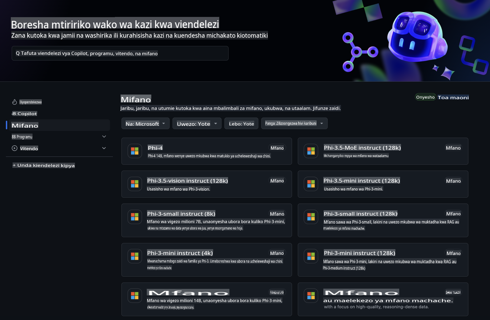
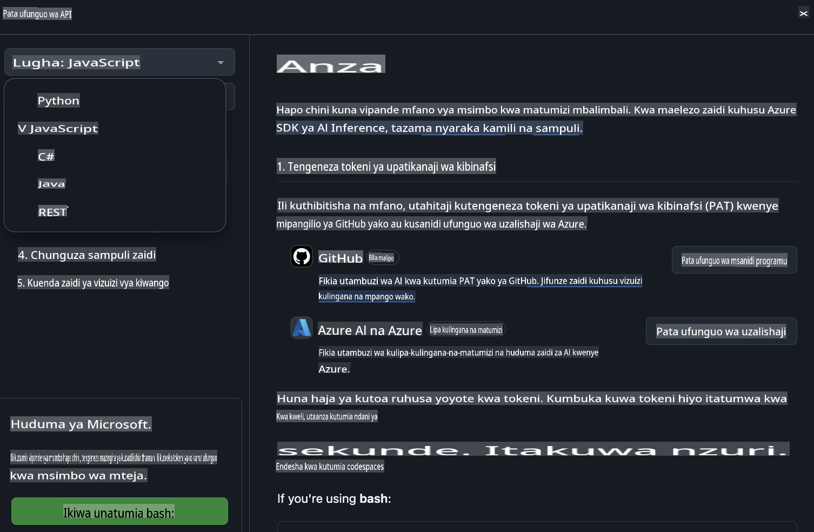
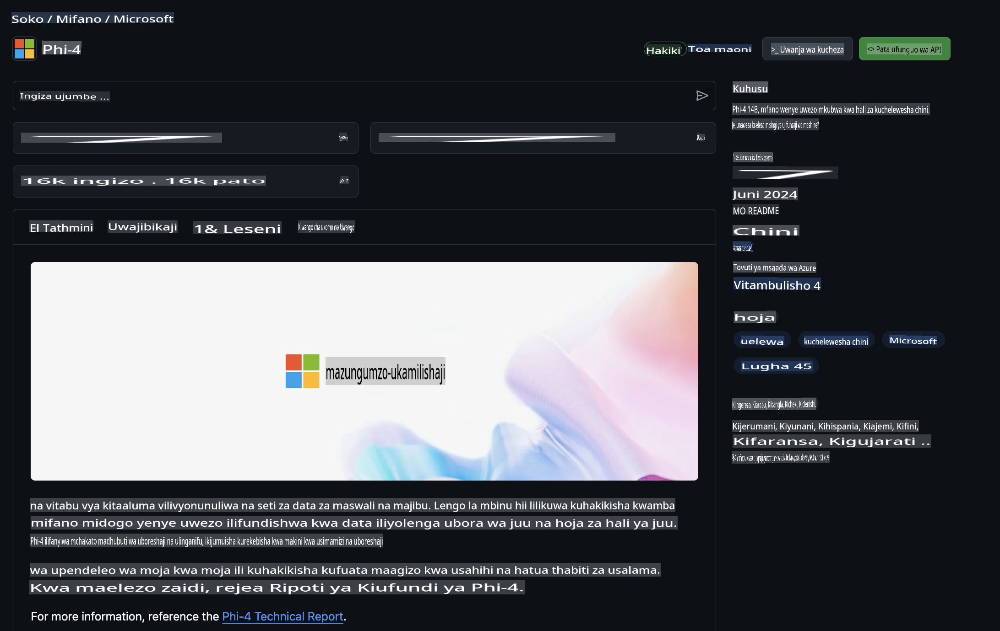

## GitHub Models - Beta ya Umma Iliyopunguzwa

Karibu kwenye [GitHub Models](https://github.com/marketplace/models)! Tumeandaa kila kitu tayari ili uweze kuchunguza Miundo ya AI inayohifadhiwa kwenye Azure AI.



Kwa maelezo zaidi kuhusu Miundo inayopatikana kwenye GitHub Models, tembelea [GitHub Model Marketplace](https://github.com/marketplace/models)

## Miundo Inayopatikana

Kila muundo una sehemu yake ya majaribio na mifano ya msimbo.


### Miundo ya Phi-3 katika Katalogi ya Miundo ya GitHub

[Phi-3-Medium-128k-Instruct](https://github.com/marketplace/models/azureml/Phi-3-medium-128k-instruct)

[Phi-3-medium-4k-instruct](https://github.com/marketplace/models/azureml/Phi-3-medium-4k-instruct)

[Phi-3-mini-128k-instruct](https://github.com/marketplace/models/azureml/Phi-3-mini-128k-instruct)

[Phi-3-mini-4k-instruct](https://github.com/marketplace/models/azureml/Phi-3-mini-4k-instruct)

[Phi-3-small-128k-instruct](https://github.com/marketplace/models/azureml/Phi-3-small-128k-instruct)

[Phi-3-small-8k-instruct](https://github.com/marketplace/models/azureml/Phi-3-small-8k-instruct)

## Kuanzia

Kuna mifano michache ya msingi tayari kwa ajili yako kujaribu. Unaweza kuipata kwenye saraka ya mifano. Ikiwa unataka kuanza moja kwa moja na lugha unayoipenda, mifano inapatikana katika Lugha zifuatazo:

- Python
- JavaScript
- cURL

Pia kuna Mazingira Maalum ya Codespaces kwa ajili ya kuendesha mifano na miundo.



## Mfano wa Msimbo

Hapa chini kuna vipande vya msimbo wa mfano kwa matumizi machache. Kwa maelezo zaidi kuhusu Azure AI Inference SDK, angalia nyaraka kamili na mifano.

## Usanidi

1. Tengeneza tokeni ya ufikiaji wa kibinafsi  
Huna haja ya kutoa ruhusa yoyote kwa tokeni. Kumbuka kuwa tokeni hiyo itatumwa kwa huduma ya Microsoft.

Ili kutumia vipande vya msimbo vilivyo hapa chini, tengeneza mabadiliko ya mazingira kuweka tokeni yako kama ufunguo wa msimbo wa mteja.

Ikiwa unatumia bash:  
```
export GITHUB_TOKEN="<your-github-token-goes-here>"
```  
Ikiwa uko kwenye powershell:  

```
$Env:GITHUB_TOKEN="<your-github-token-goes-here>"
```  

Ikiwa unatumia Windows command prompt:  

```
set GITHUB_TOKEN=<your-github-token-goes-here>
```  

## Mfano wa Python

### Sakinisha mahitaji  
Sakinisha Azure AI Inference SDK kwa kutumia pip (Inahitaji: Python >=3.8):  

```
pip install azure-ai-inference
```  

### Endesha mfano wa msingi wa msimbo  

Mfano huu unaonyesha wito wa msingi kwa API ya kukamilisha mazungumzo. Inatumia kituo cha GitHub AI model inference na tokeni yako ya GitHub. Wito huu ni wa moja kwa moja.

```
import os
from azure.ai.inference import ChatCompletionsClient
from azure.ai.inference.models import SystemMessage, UserMessage
from azure.core.credentials import AzureKeyCredential

endpoint = "https://models.inference.ai.azure.com"
# Replace Model_Name 
model_name = "Phi-3-small-8k-instruct"
token = os.environ["GITHUB_TOKEN"]

client = ChatCompletionsClient(
    endpoint=endpoint,
    credential=AzureKeyCredential(token),
)

response = client.complete(
    messages=[
        SystemMessage(content="You are a helpful assistant."),
        UserMessage(content="What is the capital of France?"),
    ],
    model=model_name,
    temperature=1.,
    max_tokens=1000,
    top_p=1.
)

print(response.choices[0].message.content)
```  

### Endesha mazungumzo ya mizunguko mingi  

Mfano huu unaonyesha mazungumzo ya mizunguko mingi na API ya kukamilisha mazungumzo. Unapotumia muundo kwa programu ya mazungumzo, utahitaji kusimamia historia ya mazungumzo hayo na kutuma ujumbe wa hivi karibuni kwa muundo.

```
import os
from azure.ai.inference import ChatCompletionsClient
from azure.ai.inference.models import AssistantMessage, SystemMessage, UserMessage
from azure.core.credentials import AzureKeyCredential

token = os.environ["GITHUB_TOKEN"]
endpoint = "https://models.inference.ai.azure.com"
# Replace Model_Name
model_name = "Phi-3-small-8k-instruct"

client = ChatCompletionsClient(
    endpoint=endpoint,
    credential=AzureKeyCredential(token),
)

messages = [
    SystemMessage(content="You are a helpful assistant."),
    UserMessage(content="What is the capital of France?"),
    AssistantMessage(content="The capital of France is Paris."),
    UserMessage(content="What about Spain?"),
]

response = client.complete(messages=messages, model=model_name)

print(response.choices[0].message.content)
```  

### Tiririsha matokeo  

Kwa uzoefu bora wa mtumiaji, utataka kutiririsha majibu ya muundo ili tokeni ya kwanza ionekane mapema na kuepuka kusubiri majibu marefu.

```
import os
from azure.ai.inference import ChatCompletionsClient
from azure.ai.inference.models import SystemMessage, UserMessage
from azure.core.credentials import AzureKeyCredential

token = os.environ["GITHUB_TOKEN"]
endpoint = "https://models.inference.ai.azure.com"
# Replace Model_Name
model_name = "Phi-3-small-8k-instruct"

client = ChatCompletionsClient(
    endpoint=endpoint,
    credential=AzureKeyCredential(token),
)

response = client.complete(
    stream=True,
    messages=[
        SystemMessage(content="You are a helpful assistant."),
        UserMessage(content="Give me 5 good reasons why I should exercise every day."),
    ],
    model=model_name,
)

for update in response:
    if update.choices:
        print(update.choices[0].delta.content or "", end="")

client.close()
```  

## JavaScript  

### Sakinisha mahitaji  

Sakinisha Node.js.  

Nakili mistari ifuatayo ya maandishi na uhifadhi kama faili package.json ndani ya folda yako.  

```
{
  "type": "module",
  "dependencies": {
    "@azure-rest/ai-inference": "latest",
    "@azure/core-auth": "latest",
    "@azure/core-sse": "latest"
  }
}
```  

Kumbuka: @azure/core-sse inahitajika tu unapopokea majibu ya kukamilisha mazungumzo kwa mtiririko.  

Fungua dirisha la terminal ndani ya folda hii na endesha npm install.  

Kwa kila kipande cha msimbo kilicho hapa chini, nakili maudhui ndani ya faili sample.js na endesha kwa node sample.js.  

### Endesha mfano wa msingi wa msimbo  

Mfano huu unaonyesha wito wa msingi kwa API ya kukamilisha mazungumzo. Inatumia kituo cha GitHub AI model inference na tokeni yako ya GitHub. Wito huu ni wa moja kwa moja.  

```
import ModelClient from "@azure-rest/ai-inference";
import { AzureKeyCredential } from "@azure/core-auth";

const token = process.env["GITHUB_TOKEN"];
const endpoint = "https://models.inference.ai.azure.com";
// Update your modelname
const modelName = "Phi-3-small-8k-instruct";

export async function main() {

  const client = new ModelClient(endpoint, new AzureKeyCredential(token));

  const response = await client.path("/chat/completions").post({
    body: {
      messages: [
        { role:"system", content: "You are a helpful assistant." },
        { role:"user", content: "What is the capital of France?" }
      ],
      model: modelName,
      temperature: 1.,
      max_tokens: 1000,
      top_p: 1.
    }
  });

  if (response.status !== "200") {
    throw response.body.error;
  }
  console.log(response.body.choices[0].message.content);
}

main().catch((err) => {
  console.error("The sample encountered an error:", err);
});
```  

### Endesha mazungumzo ya mizunguko mingi  

Mfano huu unaonyesha mazungumzo ya mizunguko mingi na API ya kukamilisha mazungumzo. Unapotumia muundo kwa programu ya mazungumzo, utahitaji kusimamia historia ya mazungumzo hayo na kutuma ujumbe wa hivi karibuni kwa muundo.  

```
import ModelClient from "@azure-rest/ai-inference";
import { AzureKeyCredential } from "@azure/core-auth";

const token = process.env["GITHUB_TOKEN"];
const endpoint = "https://models.inference.ai.azure.com";
// Update your modelname
const modelName = "Phi-3-small-8k-instruct";

export async function main() {

  const client = new ModelClient(endpoint, new AzureKeyCredential(token));

  const response = await client.path("/chat/completions").post({
    body: {
      messages: [
        { role: "system", content: "You are a helpful assistant." },
        { role: "user", content: "What is the capital of France?" },
        { role: "assistant", content: "The capital of France is Paris." },
        { role: "user", content: "What about Spain?" },
      ],
      model: modelName,
    }
  });

  if (response.status !== "200") {
    throw response.body.error;
  }

  for (const choice of response.body.choices) {
    console.log(choice.message.content);
  }
}

main().catch((err) => {
  console.error("The sample encountered an error:", err);
});
```  

### Tiririsha matokeo  
Kwa uzoefu bora wa mtumiaji, utataka kutiririsha majibu ya muundo ili tokeni ya kwanza ionekane mapema na kuepuka kusubiri majibu marefu.  

```
import ModelClient from "@azure-rest/ai-inference";
import { AzureKeyCredential } from "@azure/core-auth";
import { createSseStream } from "@azure/core-sse";

const token = process.env["GITHUB_TOKEN"];
const endpoint = "https://models.inference.ai.azure.com";
// Update your modelname
const modelName = "Phi-3-small-8k-instruct";

export async function main() {

  const client = new ModelClient(endpoint, new AzureKeyCredential(token));

  const response = await client.path("/chat/completions").post({
    body: {
      messages: [
        { role: "system", content: "You are a helpful assistant." },
        { role: "user", content: "Give me 5 good reasons why I should exercise every day." },
      ],
      model: modelName,
      stream: true
    }
  }).asNodeStream();

  const stream = response.body;
  if (!stream) {
    throw new Error("The response stream is undefined");
  }

  if (response.status !== "200") {
    stream.destroy();
    throw new Error(`Failed to get chat completions, http operation failed with ${response.status} code`);
  }

  const sseStream = createSseStream(stream);

  for await (const event of sseStream) {
    if (event.data === "[DONE]") {
      return;
    }
    for (const choice of (JSON.parse(event.data)).choices) {
        process.stdout.write(choice.delta?.content ?? ``);
    }
  }
}

main().catch((err) => {
  console.error("The sample encountered an error:", err);
});
```  

## REST  

### Endesha mfano wa msingi wa msimbo  

Bandika yafuatayo kwenye shell:  

```
curl -X POST "https://models.inference.ai.azure.com/chat/completions" \
    -H "Content-Type: application/json" \
    -H "Authorization: Bearer $GITHUB_TOKEN" \
    -d '{
        "messages": [
            {
                "role": "system",
                "content": "You are a helpful assistant."
            },
            {
                "role": "user",
                "content": "What is the capital of France?"
            }
        ],
        "model": "Phi-3-small-8k-instruct"
    }'
```  

### Endesha mazungumzo ya mizunguko mingi  

Piga API ya kukamilisha mazungumzo na pitisha historia ya mazungumzo:  

```
curl -X POST "https://models.inference.ai.azure.com/chat/completions" \
    -H "Content-Type: application/json" \
    -H "Authorization: Bearer $GITHUB_TOKEN" \
    -d '{
        "messages": [
            {
                "role": "system",
                "content": "You are a helpful assistant."
            },
            {
                "role": "user",
                "content": "What is the capital of France?"
            },
            {
                "role": "assistant",
                "content": "The capital of France is Paris."
            },
            {
                "role": "user",
                "content": "What about Spain?"
            }
        ],
        "model": "Phi-3-small-8k-instruct"
    }'
```  

### Tiririsha matokeo  

Huu ni mfano wa kupiga kituo na kutiririsha majibu.  

```
curl -X POST "https://models.inference.ai.azure.com/chat/completions" \
    -H "Content-Type: application/json" \
    -H "Authorization: Bearer $GITHUB_TOKEN" \
    -d '{
        "messages": [
            {
                "role": "system",
                "content": "You are a helpful assistant."
            },
            {
                "role": "user",
                "content": "Give me 5 good reasons why I should exercise every day."
            }
        ],
        "stream": true,
        "model": "Phi-3-small-8k-instruct"
    }'
```  

## Matumizi BURE na Mipaka ya Kiwango kwa GitHub Models  

  

[Viwango vya matumizi vya sehemu ya majaribio na API ya bure](https://docs.github.com/en/github-models/prototyping-with-ai-models#rate-limits) vimeundwa kukusaidia kujaribu miundo na kuunda programu yako ya AI. Kwa matumizi zaidi ya mipaka hiyo, na kuleta programu yako kwenye kiwango kikubwa, lazima uweke rasilimali kutoka akaunti ya Azure, na uthibitishe kutoka huko badala ya tokeni yako ya kibinafsi ya GitHub. Huna haja ya kubadilisha chochote kingine kwenye msimbo wako. Tumia kiungo hiki kugundua jinsi ya kwenda zaidi ya mipaka ya kiwango cha bure kwenye Azure AI.  

### Taarifa  

Kumbuka unaposhirikiana na muundo unajaribu AI, kwa hivyo makosa ya maudhui yanaweza kutokea.  

Kipengele hiki kina mipaka mbalimbali (ikiwemo maombi kwa dakika, maombi kwa siku, tokeni kwa ombi, na maombi ya wakati mmoja) na hakijaundwa kwa matumizi ya uzalishaji.  

GitHub Models hutumia Azure AI Content Safety. Vichujio hivi haviwezi kuzimwa kama sehemu ya uzoefu wa GitHub Models. Ukichagua kutumia miundo kupitia huduma ya kulipia, tafadhali sanidi vichujio vyako vya maudhui ili kukidhi mahitaji yako.  

Huduma hii iko chini ya Masharti ya Awali ya GitHub.  

**Kanusho**:  
Hati hii imetafsiriwa kwa kutumia huduma za tafsiri za mashine zinazotumia AI. Ingawa tunajitahidi kwa usahihi, tafadhali fahamu kuwa tafsiri za kiotomatiki zinaweza kuwa na makosa au kutokuwa sahihi. Hati ya asili katika lugha yake ya kiasili inapaswa kuzingatiwa kuwa chanzo cha mamlaka. Kwa taarifa muhimu, inashauriwa kutumia huduma za mtafsiri wa kibinadamu mtaalamu. Hatutawajibika kwa maelewano mabaya au tafsiri zisizo sahihi zinazotokana na matumizi ya tafsiri hii.