# Kuboresha Phi-3 kwa Azure AI Foundry

Hebu tuangalie jinsi ya kuboresha mfano wa lugha wa Microsoft Phi-3 Mini kwa kutumia Azure AI Foundry. Kuboresha kunakuruhusu kubadilisha Phi-3 Mini kwa kazi maalum, na kuufanya uwe wenye nguvu zaidi na unaoelewa muktadha vizuri.

## Mambo ya Kuzingatia

- **Uwezo:** Ni mifano gani inaweza kuboreshwa? Mfano wa msingi unaweza kuboreshwa kufanya nini?
- **Gharama:** Mfano wa bei wa kuboresha ni upi?
- **Ubadilikaji:** Ninaweza kubadilisha mfano wa msingi kwa kiwango gani – na kwa njia gani?
- **Urahisi:** Mchakato wa kuboresha hufanyika vipi – je, ninahitaji kuandika msimbo maalum? Je, ninahitaji kuwa na kompyuta yangu mwenyewe?
- **Usalama:** Mifano iliyoboreshwa inajulikana kuwa na hatari za kiusalama – kuna hatua zozote za kulinda dhidi ya madhara yasiyotarajiwa?

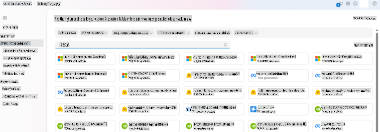

## Maandalizi ya Kuboresha

### Mahitaji ya Awali

> [!NOTE]  
> Kwa mifano ya familia ya Phi-3, toleo la kuboresha kwa kulipia kulingana na matumizi linapatikana tu kwa hubs zilizoundwa katika maeneo ya **East US 2**.

- Akaunti ya Azure. Ikiwa huna akaunti ya Azure, unda [akaunti ya kulipia Azure](https://azure.microsoft.com/pricing/purchase-options/pay-as-you-go) kuanza.

- [Mradi wa AI Foundry](https://ai.azure.com?WT.mc_id=aiml-138114-kinfeylo).
- Udhibiti wa ufikiaji wa Azure unaotegemea majukumu (Azure RBAC) hutumika kutoa ruhusa kwa operesheni katika Azure AI Foundry. Ili kutekeleza hatua zilizo katika makala hii, akaunti yako ya mtumiaji lazima iwe na __jukumu la Azure AI Developer__ kwenye kikundi cha rasilimali.

### Usajili wa Mtoa Huduma wa Usajili

Hakikisha usajili umesajiliwa kwa mtoa huduma wa rasilimali `Microsoft.Network`.

1. Ingia kwenye [Azure portal](https://portal.azure.com).
1. Chagua **Subscriptions** kutoka kwenye menyu ya kushoto.
1. Chagua usajili unaotaka kutumia.
1. Chagua **AI project settings** > **Resource providers** kutoka kwenye menyu ya kushoto.
1. Thibitisha kwamba **Microsoft.Network** ipo kwenye orodha ya watoa huduma wa rasilimali. Ikiwa haipo, iongeze.

### Maandalizi ya Data

Andaa data yako ya mafunzo na uthibitishaji ili kuboresha mfano wako. Seti zako za data za mafunzo na uthibitishaji zinapaswa kuwa na mifano ya pembejeo na matokeo ya jinsi unavyotaka mfano ufanye kazi.

Hakikisha mifano yote ya mafunzo inafuata muundo unaotarajiwa kwa utabiri. Ili kuboresha mifano kwa ufanisi, hakikisha dataset iliyo na usawa na utofauti.

Hii inahusisha kudumisha usawa wa data, kujumuisha hali mbalimbali, na mara kwa mara kurekebisha data ya mafunzo ili kuendana na matarajio ya ulimwengu halisi, ambayo mwishowe husababisha majibu sahihi na yenye usawa zaidi ya mfano.

Aina tofauti za mifano zinahitaji muundo tofauti wa data ya mafunzo.

### Ukamilishaji wa Mazungumzo

Data ya mafunzo na uthibitishaji unayotumia **lazima** iwe katika muundo wa JSON Lines (JSONL). Kwa `Phi-3-mini-128k-instruct` dataset ya kuboresha lazima iwe katika muundo wa mazungumzo unaotumika na Chat completions API.

### Mfano wa Muundo wa Faili

```json
    {"messages": [{"role": "system", "content": "You are an Xbox customer support agent whose primary goal is to help users with issues they are experiencing with their Xbox devices. You are friendly and concise. You only provide factual answers to queries, and do not provide answers that are not related to Xbox."}, {"role": "user", "content": "Is Xbox better than PlayStation?"}, {"role": "assistant", "content": "I apologize, but I cannot provide personal opinions. My primary job is to assist you with any issues related to your Xbox device. Do you have any Xbox-related issues that need addressing?"}]}
    {"messages": [{"role": "system", "content": "You are an Xbox customer support agent whose primary goal is to help users with issues they are experiencing with their Xbox devices. You are friendly and concise. You only provide factual answers to queries, and do not provide answers that are not related to Xbox."}, {"role": "user", "content": "Can I play PC games on my Xbox?"}, {"role": "assistant", "content": "While Xbox consoles don't natively support PC games, they can play an array of Xbox games, many of which are also available on PC. Can I assist you with finding games compatible with your Xbox device?"}]}
    {"messages": [{"role": "system", "content": "You are an Xbox customer support agent whose primary goal is to help users with issues they are experiencing with their Xbox devices. You are friendly and concise. You only provide factual answers to queries, and do not provide answers that are not related to Xbox."}, {"role": "user", "content": "I'm having trouble connecting my Xbox to the Wi-Fi."}, {"role": "assistant", "content": "No worries, let's go through the network settings on your Xbox. Can you please tell me what happens when you try to connect it to the Wi-Fi?"}]}
```

Aina ya faili inayoungwa mkono ni JSON Lines. Faili hupakiwa kwenye datastore chaguo-msingi na kupatikana katika mradi wako.

## Kuboresha Phi-3 kwa Azure AI Foundry

Azure AI Foundry inakuruhusu kubadilisha mifano mikubwa ya lugha kwa seti zako za data binafsi kwa kutumia mchakato unaoitwa kuboresha. Kuboresha kuna thamani kubwa kwa kuwezesha ubinafsishaji na uboreshaji kwa kazi na matumizi maalum. Hii husababisha utendaji bora, ufanisi wa gharama, kupungua kwa ucheleweshaji, na matokeo yaliyobinafsishwa.

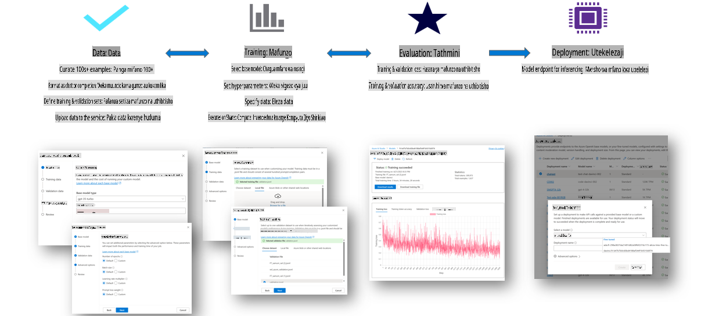

### Kuunda Mradi Mpya

1. Ingia kwenye [Azure AI Foundry](https://ai.azure.com).

1. Chagua **+New project** ili kuunda mradi mpya katika Azure AI Foundry.

    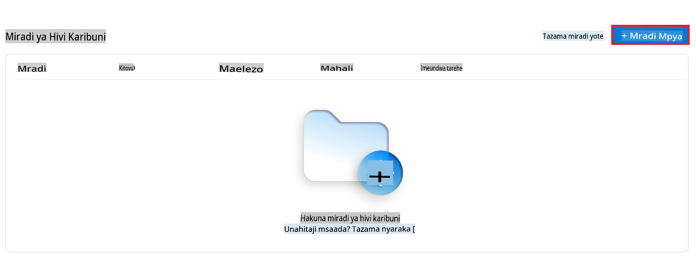

1. Fanya yafuatayo:

    - Jina la **Hub** la mradi. Lazima liwe thamani ya kipekee.
    - Chagua **Hub** ya kutumia (unda mpya ikiwa inahitajika).

    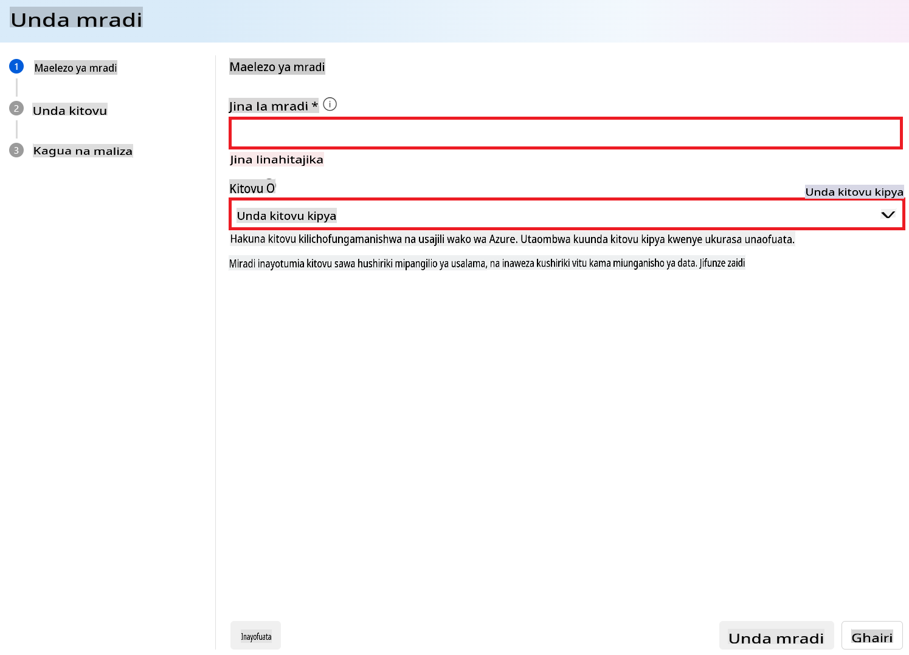

1. Fanya yafuatayo ili kuunda hub mpya:

    - Weka **Jina la Hub**. Lazima liwe thamani ya kipekee.
    - Chagua **Usajili wa Azure**.
    - Chagua **Kikundi cha Rasilimali** cha kutumia (unda kipya ikiwa inahitajika).
    - Chagua **Eneo** unalotaka kutumia.
    - Chagua **Unganisha Huduma za Azure AI** za kutumia (unda mpya ikiwa inahitajika).
    - Chagua **Unganisha Azure AI Search** hadi **Ruka kuunganisha**.

    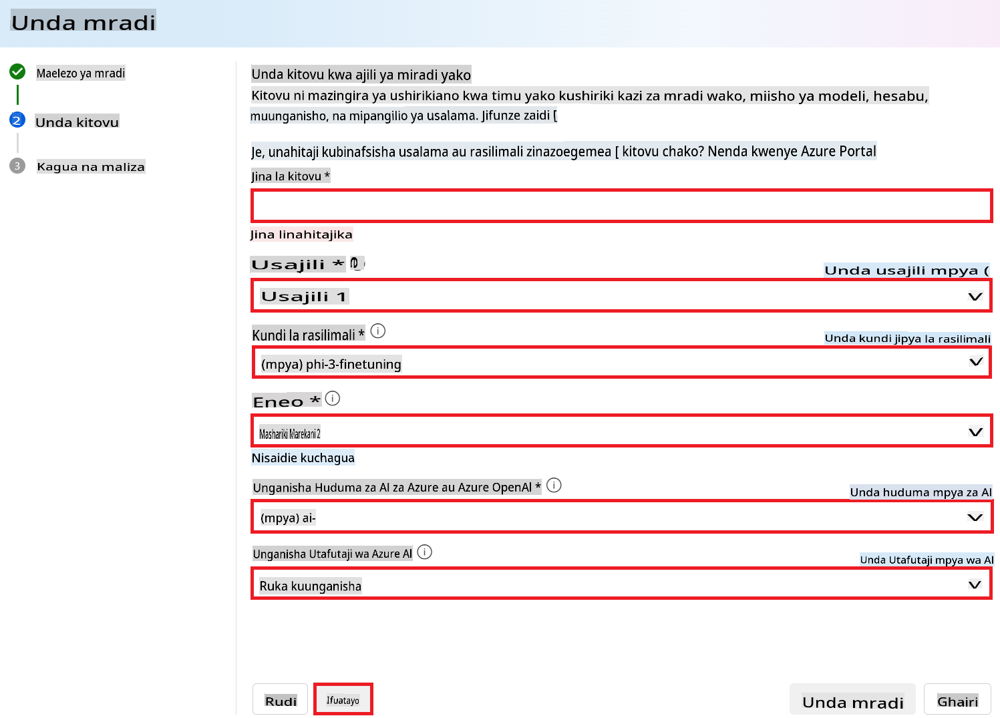

1. Chagua **Next**.
1. Chagua **Create a project**.

### Maandalizi ya Data

Kabla ya kuboresha, kusanya au tengeneza dataset inayohusiana na kazi yako, kama maagizo ya mazungumzo, jozi za maswali-majibu, au maandishi mengine yanayofaa. Safisha na uchakata data hii kwa kuondoa kelele, kushughulikia thamani zilizokosekana, na kugawa maandishi.

### Kuboresha Mifano ya Phi-3 katika Azure AI Foundry

> [!NOTE]  
> Kuboresha mifano ya Phi-3 kwa sasa kunasaidiwa katika miradi iliyo katika East US 2.

1. Chagua **Model catalog** kutoka kwenye kichupo cha upande wa kushoto.

1. Andika *phi-3* kwenye **search bar** na uchague mfano wa phi-3 unaotaka kutumia.

    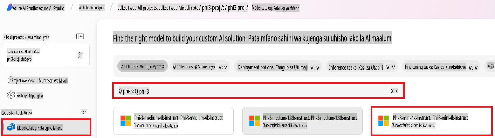

1. Chagua **Fine-tune**.

    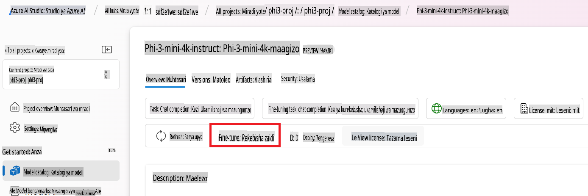

1. Weka **Jina la mfano ulioboreshwa**.

    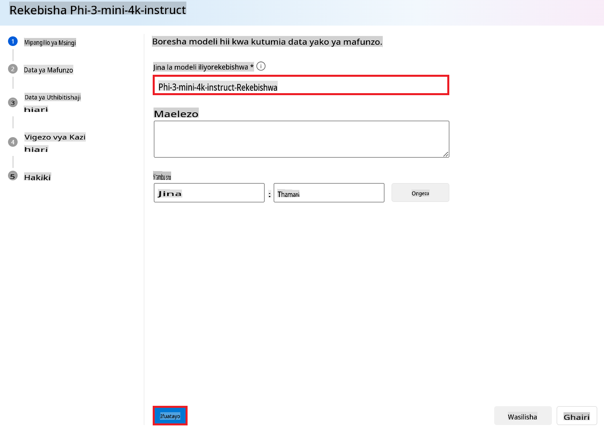

1. Chagua **Next**.

1. Fanya yafuatayo:

    - Chagua **aina ya kazi** hadi **Chat completion**.
    - Chagua **Data ya Mafunzo** unayotaka kutumia. Unaweza kuipakia kupitia data ya Azure AI Foundry au kutoka kwenye mazingira yako ya ndani.

    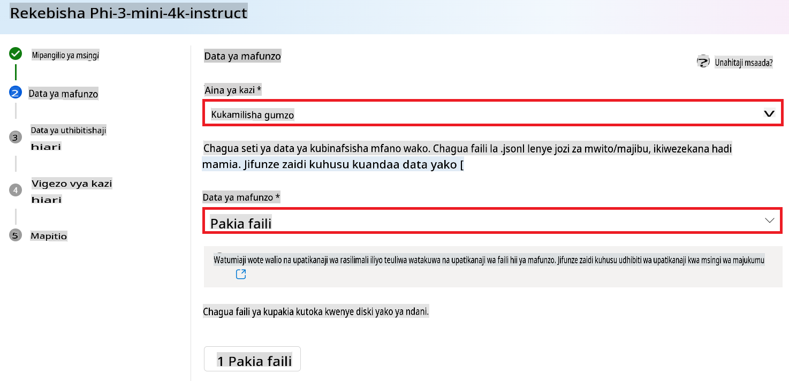

1. Chagua **Next**.

1. Pakia **Data ya Uthibitishaji** unayotaka kutumia, au unaweza kuchagua **Mgawanyo wa moja kwa moja wa data ya mafunzo**.

    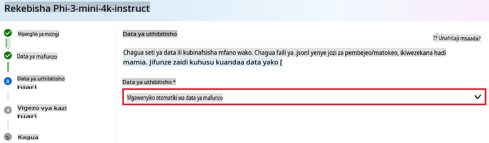

1. Chagua **Next**.

1. Fanya yafuatayo:

    - Chagua **Kizidishi cha ukubwa wa kundi** unachotaka kutumia.
    - Chagua **Kiwango cha kujifunza** unachotaka kutumia.
    - Chagua **Epochs** unazotaka kutumia.

    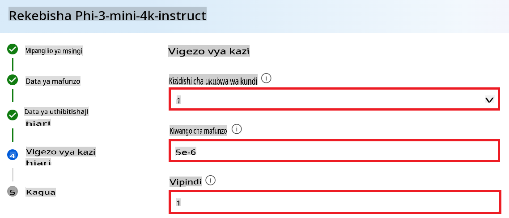

1. Chagua **Submit** kuanza mchakato wa kuboresha.

    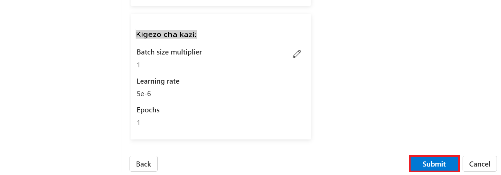

1. Mara tu mfano wako unapoboreshwa, hali itaonyeshwa kama **Completed**, kama inavyoonyeshwa kwenye picha hapa chini. Sasa unaweza kupeleka mfano huo na kuutumia katika programu yako mwenyewe, kwenye playground, au kwenye prompt flow. Kwa maelezo zaidi, angalia [Jinsi ya kupeleka familia ya mifano midogo ya lugha ya Phi-3 na Azure AI Foundry](https://learn.microsoft.com/azure/ai-studio/how-to/deploy-models-phi-3?tabs=phi-3-5&pivots=programming-language-python).

    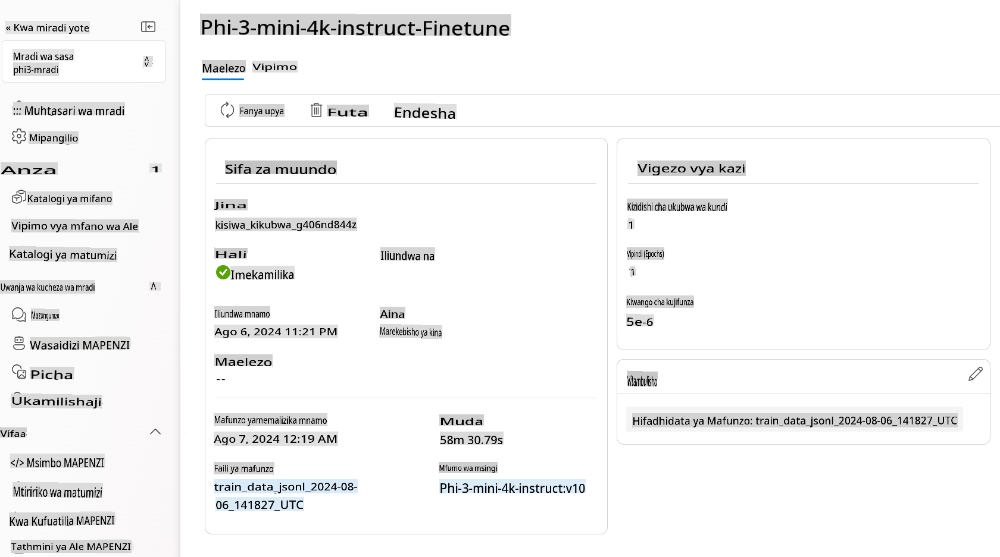

> [!NOTE]  
> Kwa maelezo zaidi kuhusu kuboresha Phi-3, tafadhali tembelea [Kuboresha mifano ya Phi-3 katika Azure AI Foundry](https://learn.microsoft.com/azure/ai-studio/how-to/fine-tune-phi-3?tabs=phi-3-mini).

## Kusafisha Mifano Yako Uliyoboreshwa

Unaweza kufuta mfano ulioboreshwa kutoka kwenye orodha ya mifano ya kuboresha katika [Azure AI Foundry](https://ai.azure.com) au kutoka kwenye ukurasa wa maelezo ya mfano. Chagua mfano ulioboreshwa kufuta kutoka kwenye ukurasa wa Kuboresha, kisha chagua kitufe cha Futa ili kufuta mfano ulioboreshwa.

> [!NOTE]  
> Huwezi kufuta mfano maalum ikiwa una utekelezaji uliopo. Lazima uondoe utekelezaji wa mfano wako kwanza kabla ya kufuta mfano wako maalum.

## Gharama na Viwango

### Mazingatio ya Gharama na Viwango kwa Mifano ya Phi-3 Iliyoboreshwa kama Huduma

Mifano ya Phi iliyoboreshwa kama huduma hutolewa na Microsoft na kuunganishwa na Azure AI Foundry kwa matumizi. Unaweza kupata bei wakati wa [kupeleka](https://learn.microsoft.com/azure/ai-studio/how-to/deploy-models-phi-3?tabs=phi-3-5&pivots=programming-language-python) au kuboresha mifano chini ya kichupo cha Bei na masharti kwenye mwongozo wa utekelezaji.

## Kuchuja Maudhui

Mifano iliyotekelezwa kama huduma na kulipia kulingana na matumizi inalindwa na Azure AI Content Safety. Wakati wa kupelekwa kwenye vituo vya wakati halisi, unaweza kuchagua kuacha kipengele hiki. Kwa kuwezeshwa kwa usalama wa maudhui wa Azure AI, maelezo ya awali na matokeo hupitia mkusanyiko wa mifano ya uainishaji inayolenga kugundua na kuzuia uzalishaji wa maudhui hatarishi. Mfumo wa kuchuja maudhui hugundua na kuchukua hatua kwa kategoria maalum za maudhui yanayoweza kuwa hatarishi katika maelezo ya pembejeo na matokeo ya utabiri. Jifunze zaidi kuhusu [Usalama wa Maudhui wa Azure AI](https://learn.microsoft.com/azure/ai-studio/concepts/content-filtering).

**Usanidi wa Kuboresha**

Vigezo vya Hyper: Eleza vigezo vya hyper kama kiwango cha kujifunza, ukubwa wa kundi, na idadi ya vipindi vya mafunzo.

**Kazi ya Hasara**

Chagua kazi ya hasara inayofaa kwa kazi yako (mfano, cross-entropy).

**Optimiza**

Chagua optimiza (mfano, Adam) kwa sasisho za mwinuko wakati wa mafunzo.

**Mchakato wa Kuboresha**

- Pakia Mfano Uliokwisha Funzwa: Pakia checkpoint ya Phi-3 Mini.
- Ongeza Tabaka Maalum: Ongeza tabaka maalum za kazi (mfano, kichwa cha uainishaji kwa maagizo ya mazungumzo).

**Fanya Mafunzo ya Mfano**  
Boresha mfano kwa kutumia dataset yako iliyoandaliwa. Fuata maendeleo ya mafunzo na rekebisha vigezo vya hyper inapohitajika.

**Tathmini na Uthibitishe**

Seti ya Uthibitishaji: Gawanya data yako katika seti za mafunzo na uthibitishaji.

**Tathmini Utendaji**

Tumia vipimo kama usahihi, alama ya F1, au perplexity kutathmini utendaji wa mfano.

## Hifadhi Mfano Ulioboreshwa

**Checkpoint**  
Hifadhi checkpoint ya mfano ulioboreshwa kwa matumizi ya baadaye.

## Utekelezaji

- Peleka kama Huduma ya Wavuti: Peleka mfano wako ulioboreshwa kama huduma ya wavuti katika Azure AI Foundry.
- Jaribu Endpoint: Tuma maswali ya majaribio kwenye endpoint iliyotekelezwa ili kuthibitisha utendakazi wake.

## Rudia na Boresha

Rudia: Ikiwa utendaji haujaridhisha, rudia kwa kurekebisha vigezo vya hyper, kuongeza data zaidi, au kuboresha kwa vipindi vya ziada.

## Fuata na Rekebisha

Fuata kwa karibu tabia ya mfano na rekebisha inapohitajika.

## Badilisha na Panua

Kazi Maalum: Phi-3 Mini inaweza kuboreshwa kwa kazi mbalimbali zaidi ya maagizo ya mazungumzo. Chunguza matumizi mengine!  
Jaribio: Jaribu usanifu tofauti, mchanganyiko wa tabaka, na mbinu za kuboresha utendaji.

> [!NOTE]  
> Kuboresha ni mchakato wa kurudia. Jaribu, jifunze, na rekebisha mfano wako ili kufanikisha matokeo bora kwa kazi yako maalum!

**Kanusho**:  
Hati hii imetafsiriwa kwa kutumia huduma za kutafsiri za AI zinazotegemea mashine. Ingawa tunajitahidi kwa usahihi, tafadhali fahamu kuwa tafsiri za kiotomatiki zinaweza kuwa na makosa au kutokuwa sahihi. Hati ya asili katika lugha yake ya awali inapaswa kuzingatiwa kama chanzo cha mamlaka. Kwa taarifa muhimu, inashauriwa kutumia huduma za utafsiri wa kibinadamu wa kitaalamu. Hatutawajibika kwa kutoelewana au tafsiri zisizo sahihi zinazotokana na matumizi ya tafsiri hii.