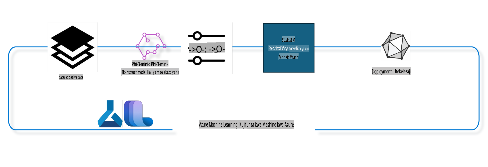

## Jinsi ya kutumia vipengele vya chat-completion kutoka kwenye Azure ML system registry kuboresha mfano

Katika mfano huu, tutafanya maboresho ya mfano wa Phi-3-mini-4k-instruct ili kukamilisha mazungumzo kati ya watu wawili kwa kutumia seti ya data ya ultrachat_200k.



Mfano huu utaonyesha jinsi ya kufanya maboresho kwa kutumia Azure ML SDK na Python, kisha kupeleka mfano ulioboreshwa kwenye endpoint ya mtandaoni kwa utabiri wa wakati halisi.

### Data ya Mafunzo

Tutatumia seti ya data ya ultrachat_200k. Hii ni toleo lililochujwa sana la seti ya data ya UltraChat na lilitumika kufundisha Zephyr-7B-β, mfano wa hali ya juu wa mazungumzo wa 7b.

### Mfano

Tutatumia mfano wa Phi-3-mini-4k-instruct kuonyesha jinsi mtumiaji anaweza kuboresha mfano kwa kazi ya chat-completion. Ikiwa umefungua daftari hili kutoka kwenye kadi ya mfano maalum, kumbuka kubadilisha jina la mfano husika.

### Majukumu

- Chagua mfano wa kuboresha.
- Chagua na chunguza data ya mafunzo.
- Sanidi kazi ya maboresho.
- Endesha kazi ya maboresho.
- Pitia vipimo vya mafunzo na tathmini.
- Sajili mfano ulioboreshwa.
- Peleka mfano ulioboreshwa kwa utabiri wa wakati halisi.
- Safisha rasilimali.

## 1. Sanidi mahitaji ya awali

- Sakinisha utegemezi.
- Unganisha na AzureML Workspace. Jifunze zaidi katika set up SDK authentication. Badilisha <WORKSPACE_NAME>, <RESOURCE_GROUP>, na <SUBSCRIPTION_ID> hapa chini.
- Unganisha na azureml system registry.
- Weka jina la majaribio kwa hiari.
- Angalia au unda compute.

> [!NOTE]
> Mahitaji: node moja ya GPU inaweza kuwa na kadi nyingi za GPU. Kwa mfano, kwenye node moja ya Standard_NC24rs_v3 kuna NVIDIA V100 GPUs 4, wakati kwenye Standard_NC12s_v3 kuna NVIDIA V100 GPUs 2. Rejelea nyaraka kwa taarifa hii. Idadi ya kadi za GPU kwa kila node imewekwa katika parameta gpus_per_node hapa chini. Kuweka thamani hii kwa usahihi kutahakikisha matumizi ya GPU zote kwenye node. SKU zilizopendekezwa za GPU compute zinaweza kupatikana hapa na hapa.

### Maktaba za Python

Sakinisha utegemezi kwa kuendesha seli hapa chini. Hili si hatua ya hiari ikiwa unatumia mazingira mapya.

```bash
pip install azure-ai-ml
pip install azure-identity
pip install datasets==2.9.0
pip install mlflow
pip install azureml-mlflow
```

### Kuingiliana na Azure ML

1. Hii ni script ya Python inayotumika kuingiliana na huduma ya Azure Machine Learning (Azure ML). Hii ni muhtasari wa kile inachofanya:

    - Inaingiza moduli muhimu kutoka kwenye azure.ai.ml, azure.identity, na azure.ai.ml.entities. Pia inaingiza moduli ya time.

    - Inajaribu kuidhinisha kwa kutumia DefaultAzureCredential(), ambayo hutoa uzoefu rahisi wa kuidhinisha kuanza haraka kuunda programu zinazokimbia kwenye wingu la Azure. Ikiwa hii itashindwa, inarudi kwa InteractiveBrowserCredential(), ambayo hutoa mwongozo wa kuingia kwa njia ya maingiliano.

    - Kisha inajaribu kuunda MLClient instance kwa kutumia njia ya from_config, ambayo inasoma usanidi kutoka kwenye faili ya chaguo-msingi ya config.json. Ikiwa hii itashindwa, inaunda MLClient instance kwa kutoa manually subscription_id, resource_group_name, na workspace_name.

    - Inaunda MLClient instance nyingine, wakati huu kwa ajili ya Azure ML registry inayoitwa "azureml". Hii registry ni mahali ambapo mifano, maboresho ya pipelines, na mazingira yanahifadhiwa.

    - Inaweka experiment_name kuwa "chat_completion_Phi-3-mini-4k-instruct".

    - Inazalisha timestamp ya kipekee kwa kubadilisha muda wa sasa (katika sekunde tangu epoch, kama namba ya pointi ya kuelea) kuwa namba ya integer na kisha kuwa string. Hii timestamp inaweza kutumika kuunda majina na matoleo ya kipekee.

    ```python
    # Import necessary modules from Azure ML and Azure Identity
    from azure.ai.ml import MLClient
    from azure.identity import (
        DefaultAzureCredential,
        InteractiveBrowserCredential,
    )
    from azure.ai.ml.entities import AmlCompute
    import time  # Import time module
    
    # Try to authenticate using DefaultAzureCredential
    try:
        credential = DefaultAzureCredential()
        credential.get_token("https://management.azure.com/.default")
    except Exception as ex:  # If DefaultAzureCredential fails, use InteractiveBrowserCredential
        credential = InteractiveBrowserCredential()
    
    # Try to create an MLClient instance using the default config file
    try:
        workspace_ml_client = MLClient.from_config(credential=credential)
    except:  # If that fails, create an MLClient instance by manually providing the details
        workspace_ml_client = MLClient(
            credential,
            subscription_id="<SUBSCRIPTION_ID>",
            resource_group_name="<RESOURCE_GROUP>",
            workspace_name="<WORKSPACE_NAME>",
        )
    
    # Create another MLClient instance for the Azure ML registry named "azureml"
    # This registry is where models, fine-tuning pipelines, and environments are stored
    registry_ml_client = MLClient(credential, registry_name="azureml")
    
    # Set the experiment name
    experiment_name = "chat_completion_Phi-3-mini-4k-instruct"
    
    # Generate a unique timestamp that can be used for names and versions that need to be unique
    timestamp = str(int(time.time()))
    ```

## 2. Chagua mfano wa msingi wa kuboresha

1. Phi-3-mini-4k-instruct ni mfano wa hali ya juu wenye vigezo bilioni 3.8, mwepesi, na wazi uliotengenezwa kwa kutumia seti za data zilizotumika kwa Phi-2. Mfano huu ni sehemu ya familia ya Phi-3, na toleo la Mini linakuja katika aina mbili 4K na 128K, ambazo ni urefu wa muktadha (kwa tokens) linaweza kushughulikia. Tunahitaji kuboresha mfano kwa madhumuni yetu maalum ili kuutumia. Unaweza kuvinjari mifano hii katika Model Catalog kwenye AzureML Studio, ukichuja kwa kazi ya chat-completion. Katika mfano huu, tunatumia mfano wa Phi-3-mini-4k-instruct. Ikiwa umefungua daftari hili kwa mfano tofauti, badilisha jina la mfano na toleo ipasavyo.

    > [!NOTE]
    > mali ya model id ya mfano. Hii itapita kama ingizo kwa kazi ya maboresho. Hii pia inapatikana kama uwanja wa Asset ID kwenye ukurasa wa maelezo ya mfano katika AzureML Studio Model Catalog.

2. Hii ni script ya Python inayotumika kuingiliana na huduma ya Azure Machine Learning (Azure ML). Hii ni muhtasari wa kile inachofanya:

    - Inaweka model_name kuwa "Phi-3-mini-4k-instruct".

    - Inatumia njia ya get ya models property ya registry_ml_client object kurejesha toleo la hivi karibuni la mfano lenye jina lililotajwa kutoka kwenye Azure ML registry. Njia ya get inaitwa na hoja mbili: jina la mfano na lebo inayobainisha kwamba toleo la hivi karibuni la mfano linapaswa kurejeshwa.

    - Inachapisha ujumbe kwenye console unaoonyesha jina, toleo, na id ya mfano utakaotumika kwa maboresho. Njia ya format ya string inatumika kuingiza jina, toleo, na id ya mfano kwenye ujumbe. Jina, toleo, na id ya mfano yanapatikana kama mali za foundation_model object.

    ```python
    # Set the model name
    model_name = "Phi-3-mini-4k-instruct"
    
    # Get the latest version of the model from the Azure ML registry
    foundation_model = registry_ml_client.models.get(model_name, label="latest")
    
    # Print the model name, version, and id
    # This information is useful for tracking and debugging
    print(
        "\n\nUsing model name: {0}, version: {1}, id: {2} for fine tuning".format(
            foundation_model.name, foundation_model.version, foundation_model.id
        )
    )
    ```

## 3. Unda compute itakayotumika na kazi

Kazi ya maboresho inafanya kazi TU na GPU compute. Ukubwa wa compute unategemea ukubwa wa mfano, na katika hali nyingi huwa ni changamoto kutambua compute sahihi kwa kazi hiyo. Katika seli hii, tunamuongoza mtumiaji kuchagua compute sahihi kwa kazi hiyo.

> [!NOTE]
> Computations zilizoorodheshwa hapa chini zinafanya kazi na usanidi ulioboreshwa zaidi. Mabadiliko yoyote kwa usanidi yanaweza kusababisha hitilafu ya Cuda Out Of Memory. Katika hali kama hizo, jaribu kuboresha compute hadi saizi kubwa zaidi.

> [!NOTE]
> Wakati wa kuchagua compute_cluster_size hapa chini, hakikisha compute inapatikana katika resource group yako. Ikiwa compute fulani haipatikani, unaweza kufanya ombi la kupata rasilimali za compute.

### Kukagua Mfano kwa Msaada wa Maboresho

1. Hii ni script ya Python inayotumika kuingiliana na mfano wa Azure Machine Learning (Azure ML). Hii ni muhtasari wa kile inachofanya:

    - Inaingiza moduli ya ast, ambayo hutoa kazi za kushughulikia miti ya sarufi ya sintaksia ya Python.

    - Inakagua kama foundation_model object (inayowakilisha mfano katika Azure ML) ina tag inayoitwa finetune_compute_allow_list. Tags katika Azure ML ni jozi za funguo na thamani ambazo unaweza kuunda na kutumia kuchuja na kupanga mifano.

    - Ikiwa tag ya finetune_compute_allow_list ipo, inatumia ast.literal_eval function kubadilisha thamani ya tag (string) kuwa orodha ya Python. Orodha hii kisha inahifadhiwa katika variable ya computes_allow_list. Kisha inachapisha ujumbe unaoonyesha kuwa compute inapaswa kuundwa kutoka kwenye orodha.

    - Ikiwa tag ya finetune_compute_allow_list haipo, inaunda computes_allow_list kuwa None na kuchapisha ujumbe unaoonyesha kuwa tag ya finetune_compute_allow_list si sehemu ya tags za mfano.

    - Kwa muhtasari, script hii inakagua tag maalum kwenye metadata ya mfano, inabadilisha thamani ya tag kuwa orodha ikiwa ipo, na kutoa maoni kwa mtumiaji ipasavyo.

    ```python
    # Import the ast module, which provides functions to process trees of the Python abstract syntax grammar
    import ast
    
    # Check if the 'finetune_compute_allow_list' tag is present in the model's tags
    if "finetune_compute_allow_list" in foundation_model.tags:
        # If the tag is present, use ast.literal_eval to safely parse the tag's value (a string) into a Python list
        computes_allow_list = ast.literal_eval(
            foundation_model.tags["finetune_compute_allow_list"]
        )  # convert string to python list
        # Print a message indicating that a compute should be created from the list
        print(f"Please create a compute from the above list - {computes_allow_list}")
    else:
        # If the tag is not present, set computes_allow_list to None
        computes_allow_list = None
        # Print a message indicating that the 'finetune_compute_allow_list' tag is not part of the model's tags
        print("`finetune_compute_allow_list` is not part of model tags")
    ```

### Kukagua Compute Instance

1. Hii ni script ya Python inayotumika kuingiliana na huduma ya Azure Machine Learning (Azure ML) na kufanya ukaguzi kadhaa kwenye compute instance. Hii ni muhtasari wa kile inachofanya:

    - Inajaribu kurejesha compute instance yenye jina lililohifadhiwa kwenye compute_cluster kutoka kwenye Azure ML workspace. Ikiwa hali ya provisioning ya compute instance ni "failed", inarudisha ValueError.

    - Inakagua ikiwa computes_allow_list si None. Ikiwa si None, inabadilisha ukubwa wote wa compute kwenye orodha kuwa herufi ndogo na inakagua ikiwa ukubwa wa compute instance ya sasa upo kwenye orodha. Ikiwa haupo, inarudisha ValueError.

    - Ikiwa computes_allow_list ni None, inakagua ikiwa ukubwa wa compute instance upo kwenye orodha ya saizi za GPU VM ambazo hazijaungwa mkono. Ikiwa ipo, inarudisha ValueError.

    - Inarejesha orodha ya ukubwa wote wa compute unaopatikana kwenye workspace. Kisha inarudia kwenye orodha hii, na kwa kila ukubwa wa compute, inakagua ikiwa jina lake linashabihiana na ukubwa wa compute instance ya sasa. Ikiwa linashabihiana, inarejesha idadi ya GPUs kwa ukubwa huo wa compute na kuweka gpu_count_found kuwa True.

    - Ikiwa gpu_count_found ni True, inachapisha idadi ya GPUs kwenye compute instance. Ikiwa gpu_count_found ni False, inarudisha ValueError.

    - Kwa muhtasari, script hii inafanya ukaguzi kadhaa kwenye compute instance katika Azure ML workspace, ikiwa ni pamoja na kukagua hali ya provisioning, ukubwa wake dhidi ya orodha ya kuruhusu au kukataa, na idadi ya GPUs iliyonayo.

    ```python
    # Print the exception message
    print(e)
    # Raise a ValueError if the compute size is not available in the workspace
    raise ValueError(
        f"WARNING! Compute size {compute_cluster_size} not available in workspace"
    )
    
    # Retrieve the compute instance from the Azure ML workspace
    compute = workspace_ml_client.compute.get(compute_cluster)
    # Check if the provisioning state of the compute instance is "failed"
    if compute.provisioning_state.lower() == "failed":
        # Raise a ValueError if the provisioning state is "failed"
        raise ValueError(
            f"Provisioning failed, Compute '{compute_cluster}' is in failed state. "
            f"please try creating a different compute"
        )
    
    # Check if computes_allow_list is not None
    if computes_allow_list is not None:
        # Convert all compute sizes in computes_allow_list to lowercase
        computes_allow_list_lower_case = [x.lower() for x in computes_allow_list]
        # Check if the size of the compute instance is in computes_allow_list_lower_case
        if compute.size.lower() not in computes_allow_list_lower_case:
            # Raise a ValueError if the size of the compute instance is not in computes_allow_list_lower_case
            raise ValueError(
                f"VM size {compute.size} is not in the allow-listed computes for finetuning"
            )
    else:
        # Define a list of unsupported GPU VM sizes
        unsupported_gpu_vm_list = [
            "standard_nc6",
            "standard_nc12",
            "standard_nc24",
            "standard_nc24r",
        ]
        # Check if the size of the compute instance is in unsupported_gpu_vm_list
        if compute.size.lower() in unsupported_gpu_vm_list:
            # Raise a ValueError if the size of the compute instance is in unsupported_gpu_vm_list
            raise ValueError(
                f"VM size {compute.size} is currently not supported for finetuning"
            )
    
    # Initialize a flag to check if the number of GPUs in the compute instance has been found
    gpu_count_found = False
    # Retrieve a list of all available compute sizes in the workspace
    workspace_compute_sku_list = workspace_ml_client.compute.list_sizes()
    available_sku_sizes = []
    # Iterate over the list of available compute sizes
    for compute_sku in workspace_compute_sku_list:
        available_sku_sizes.append(compute_sku.name)
        # Check if the name of the compute size matches the size of the compute instance
        if compute_sku.name.lower() == compute.size.lower():
            # If it does, retrieve the number of GPUs for that compute size and set gpu_count_found to True
            gpus_per_node = compute_sku.gpus
            gpu_count_found = True
    # If gpu_count_found is True, print the number of GPUs in the compute instance
    if gpu_count_found:
        print(f"Number of GPU's in compute {compute.size}: {gpus_per_node}")
    else:
        # If gpu_count_found is False, raise a ValueError
        raise ValueError(
            f"Number of GPU's in compute {compute.size} not found. Available skus are: {available_sku_sizes}."
            f"This should not happen. Please check the selected compute cluster: {compute_cluster} and try again."
        )
    ```
## Mafunzo ya Pipeline

Kulingana na vigezo mbalimbali, tunaweza kutengeneza pipeline ya mafunzo na kuchapisha jina lake la kuonyesha. ```python
    # Define a function to generate a display name for the training pipeline
    def get_pipeline_display_name():
        # Calculate the total batch size by multiplying the per-device batch size, the number of gradient accumulation steps, the number of GPUs per node, and the number of nodes used for fine-tuning
        batch_size = (
            int(finetune_parameters.get("per_device_train_batch_size", 1))
            * int(finetune_parameters.get("gradient_accumulation_steps", 1))
            * int(gpus_per_node)
            * int(finetune_parameters.get("num_nodes_finetune", 1))
        )
        # Retrieve the learning rate scheduler type
        scheduler = finetune_parameters.get("lr_scheduler_type", "linear")
        # Retrieve whether DeepSpeed is applied
        deepspeed = finetune_parameters.get("apply_deepspeed", "false")
        # Retrieve the DeepSpeed stage
        ds_stage = finetune_parameters.get("deepspeed_stage", "2")
        # If DeepSpeed is applied, include "ds" followed by the DeepSpeed stage in the display name; if not, include "nods"
        if deepspeed == "true":
            ds_string = f"ds{ds_stage}"
        else:
            ds_string = "nods"
        # Retrieve whether Layer-wise Relevance Propagation (LoRa) is applied
        lora = finetune_parameters.get("apply_lora", "false")
        # If LoRa is applied, include "lora" in the display name; if not, include "nolora"
        if lora == "true":
            lora_string = "lora"
        else:
            lora_string = "nolora"
        # Retrieve the limit on the number of model checkpoints to keep
        save_limit = finetune_parameters.get("save_total_limit", -1)
        # Retrieve the maximum sequence length
        seq_len = finetune_parameters.get("max_seq_length", -1)
        # Construct the display name by concatenating all these parameters, separated by hyphens
        return (
            model_name
            + "-"
            + "ultrachat"
            + "-"
            + f"bs{batch_size}"
            + "-"
            + f"{scheduler}"
            + "-"
            + ds_string
            + "-"
            + lora_string
            + f"-save_limit{save_limit}"
            + f"-seqlen{seq_len}"
        )
    
    # Call the function to generate the display name
    pipeline_display_name = get_pipeline_display_name()
    # Print the display name
    print(f"Display name used for the run: {pipeline_display_name}")
    ```  

### Kuseti Pipeline  

Hii ni script ya Python inayofafanua na kuseti pipeline ya kujifunza kwa mashine kwa kutumia Azure Machine Learning SDK. Hivi ndivyo inavyofanya kazi:  

1. Inaingiza moduli muhimu kutoka Azure AI ML SDK.  
2. Inapata kipengele cha pipeline kinachoitwa "chat_completion_pipeline" kutoka kwenye rejista.  
3. Inafafanua kazi ya pipeline kwa kutumia `@pipeline` decorator and the function `create_pipeline`. The name of the pipeline is set to `pipeline_display_name`.

1. Inside the `create_pipeline` function, it initializes the fetched pipeline component with various parameters, including the model path, compute clusters for different stages, dataset splits for training and testing, the number of GPUs to use for fine-tuning, and other fine-tuning parameters.

1. It maps the output of the fine-tuning job to the output of the pipeline job. This is done so that the fine-tuned model can be easily registered, which is required to deploy the model to an online or batch endpoint.

1. It creates an instance of the pipeline by calling the `create_pipeline` function.

1. It sets the `force_rerun` setting of the pipeline to `True`, meaning that cached results from previous jobs will not be used.

1. It sets the `continue_on_step_failure` setting of the pipeline to `False`, kumaanisha kwamba pipeline itasimama ikiwa hatua yoyote itashindwa.  
4. Kwa ufupi, script hii inafafanua na kuseti pipeline ya mafunzo ya kazi ya "chat completion" kwa kutumia Azure Machine Learning SDK.  

```python
    # Import necessary modules from the Azure AI ML SDK
    from azure.ai.ml.dsl import pipeline
    from azure.ai.ml import Input
    
    # Fetch the pipeline component named "chat_completion_pipeline" from the registry
    pipeline_component_func = registry_ml_client.components.get(
        name="chat_completion_pipeline", label="latest"
    )
    
    # Define the pipeline job using the @pipeline decorator and the function create_pipeline
    # The name of the pipeline is set to pipeline_display_name
    @pipeline(name=pipeline_display_name)
    def create_pipeline():
        # Initialize the fetched pipeline component with various parameters
        # These include the model path, compute clusters for different stages, dataset splits for training and testing, the number of GPUs to use for fine-tuning, and other fine-tuning parameters
        chat_completion_pipeline = pipeline_component_func(
            mlflow_model_path=foundation_model.id,
            compute_model_import=compute_cluster,
            compute_preprocess=compute_cluster,
            compute_finetune=compute_cluster,
            compute_model_evaluation=compute_cluster,
            # Map the dataset splits to parameters
            train_file_path=Input(
                type="uri_file", path="./ultrachat_200k_dataset/train_sft.jsonl"
            ),
            test_file_path=Input(
                type="uri_file", path="./ultrachat_200k_dataset/test_sft.jsonl"
            ),
            # Training settings
            number_of_gpu_to_use_finetuning=gpus_per_node,  # Set to the number of GPUs available in the compute
            **finetune_parameters
        )
        return {
            # Map the output of the fine tuning job to the output of pipeline job
            # This is done so that we can easily register the fine tuned model
            # Registering the model is required to deploy the model to an online or batch endpoint
            "trained_model": chat_completion_pipeline.outputs.mlflow_model_folder
        }
    
    # Create an instance of the pipeline by calling the create_pipeline function
    pipeline_object = create_pipeline()
    
    # Don't use cached results from previous jobs
    pipeline_object.settings.force_rerun = True
    
    # Set continue on step failure to False
    # This means that the pipeline will stop if any step fails
    pipeline_object.settings.continue_on_step_failure = False
    ```  

### Kuendesha Kazi  

1. Hii ni script ya Python inayowasilisha kazi ya pipeline ya kujifunza kwa mashine kwenye mazingira ya kazi ya Azure Machine Learning na kisha kusubiri kazi hiyo ikamilike. Hivi ndivyo inavyofanya kazi:  

   - Inaita njia ya `create_or_update` ya kitu cha kazi (jobs object) kwenye `workspace_ml_client` ili kuwasilisha kazi ya pipeline. Pipeline inayopaswa kuendeshwa imetajwa na `pipeline_object`, na jaribio ambalo kazi hiyo inaendeshwa imetajwa na `experiment_name`.  
   - Kisha inaita njia ya `stream` ya kitu cha kazi kwenye `workspace_ml_client` kusubiri kazi ya pipeline ikamilike. Kazi inayosubiriwa imetajwa na sifa ya `name` ya kitu cha `pipeline_job`.  
   - Kwa ufupi, script hii inawasilisha kazi ya pipeline ya kujifunza kwa mashine kwenye mazingira ya kazi ya Azure Machine Learning na kisha kusubiri kazi hiyo ikamilike.  

```python
    # Submit the pipeline job to the Azure Machine Learning workspace
    # The pipeline to be run is specified by pipeline_object
    # The experiment under which the job is run is specified by experiment_name
    pipeline_job = workspace_ml_client.jobs.create_or_update(
        pipeline_object, experiment_name=experiment_name
    )
    
    # Wait for the pipeline job to complete
    # The job to wait for is specified by the name attribute of the pipeline_job object
    workspace_ml_client.jobs.stream(pipeline_job.name)
    ```  

## 6. Sajili Model Iliyoimarishwa Katika Mazingira ya Kazi  

Tutaisajili model kutoka matokeo ya kazi ya mafunzo ya kuboresha. Hii itafuatilia uhusiano kati ya model iliyoboreshwa na kazi ya mafunzo ya kuboresha. Kazi ya mafunzo ya kuboresha pia inafuatilia uhusiano na model ya msingi, data, na msimbo wa mafunzo.  

### Kusajili Model ya ML  

1. Hii ni script ya Python inayosajili model ya kujifunza kwa mashine iliyofunzwa kwenye pipeline ya Azure Machine Learning. Hivi ndivyo inavyofanya kazi:  

   - Inaingiza moduli muhimu kutoka Azure AI ML SDK.  
   - Inahakikisha kuwa matokeo ya `trained_model` yanapatikana kutoka kwenye kazi ya pipeline kwa kuita njia ya `get` ya kitu cha kazi kwenye `workspace_ml_client` na kufikia sifa yake ya `outputs`.  
   - Inajenga njia ya model iliyofunzwa kwa kuunda muundo wa kamba na jina la kazi ya pipeline na jina la matokeo ("trained_model").  
   - Inafafanua jina la model iliyoboreshwa kwa kuongeza "-ultrachat-200k" kwenye jina la model ya awali na kubadilisha slashes kuwa hyphens.  
   - Inajiandaa kusajili model kwa kuunda kitu cha Model chenye vigezo mbalimbali, ikijumuisha njia ya model, aina ya model (MLflow model), jina na toleo la model, na maelezo ya model.  
   - Inasajili model kwa kuita njia ya `create_or_update` ya kitu cha models kwenye `workspace_ml_client` na kitu cha Model kama hoja.  
   - Inachapisha model iliyosajiliwa.  

1. Kwa ufupi, script hii inasajili model ya kujifunza kwa mashine iliyofunzwa kwenye pipeline ya Azure Machine Learning.  

```python
    # Import necessary modules from the Azure AI ML SDK
    from azure.ai.ml.entities import Model
    from azure.ai.ml.constants import AssetTypes
    
    # Check if the `trained_model` output is available from the pipeline job
    print("pipeline job outputs: ", workspace_ml_client.jobs.get(pipeline_job.name).outputs)
    
    # Construct a path to the trained model by formatting a string with the name of the pipeline job and the name of the output ("trained_model")
    model_path_from_job = "azureml://jobs/{0}/outputs/{1}".format(
        pipeline_job.name, "trained_model"
    )
    
    # Define a name for the fine-tuned model by appending "-ultrachat-200k" to the original model name and replacing any slashes with hyphens
    finetuned_model_name = model_name + "-ultrachat-200k"
    finetuned_model_name = finetuned_model_name.replace("/", "-")
    
    print("path to register model: ", model_path_from_job)
    
    # Prepare to register the model by creating a Model object with various parameters
    # These include the path to the model, the type of the model (MLflow model), the name and version of the model, and a description of the model
    prepare_to_register_model = Model(
        path=model_path_from_job,
        type=AssetTypes.MLFLOW_MODEL,
        name=finetuned_model_name,
        version=timestamp,  # Use timestamp as version to avoid version conflict
        description=model_name + " fine tuned model for ultrachat 200k chat-completion",
    )
    
    print("prepare to register model: \n", prepare_to_register_model)
    
    # Register the model by calling the create_or_update method of the models object in the workspace_ml_client with the Model object as the argument
    registered_model = workspace_ml_client.models.create_or_update(
        prepare_to_register_model
    )
    
    # Print the registered model
    print("registered model: \n", registered_model)
    ```  

## 7. Peleka Model Iliyoimarishwa Kwenye Endpoint ya Mtandaoni  

Endpoints za mtandaoni zinatoa API ya REST inayodumu ambayo inaweza kutumika kuunganishwa na programu zinazohitaji kutumia model.  

### Kusimamia Endpoint  

1. Hii ni script ya Python inayounda endpoint ya mtandaoni inayosimamiwa kwenye Azure Machine Learning kwa model iliyosajiliwa. Hivi ndivyo inavyofanya kazi:  

   - Inaingiza moduli muhimu kutoka Azure AI ML SDK.  
   - Inafafanua jina la kipekee kwa endpoint ya mtandaoni kwa kuongeza timestamp kwenye kamba "ultrachat-completion-".  
   - Inajiandaa kuunda endpoint ya mtandaoni kwa kuunda kitu cha `ManagedOnlineEndpoint` chenye vigezo mbalimbali, ikijumuisha jina la endpoint, maelezo ya endpoint, na hali ya uthibitishaji ("key").  
   - Inaunda endpoint ya mtandaoni kwa kuita njia ya `begin_create_or_update` ya `workspace_ml_client` na kitu cha `ManagedOnlineEndpoint` kama hoja. Kisha inasubiri operesheni ya uundaji ikamilike kwa kuita njia ya `wait`.  

1. Kwa ufupi, script hii inaunda endpoint ya mtandaoni inayosimamiwa kwenye Azure Machine Learning kwa model iliyosajiliwa.  

```python
    # Import necessary modules from the Azure AI ML SDK
    from azure.ai.ml.entities import (
        ManagedOnlineEndpoint,
        ManagedOnlineDeployment,
        ProbeSettings,
        OnlineRequestSettings,
    )
    
    # Define a unique name for the online endpoint by appending a timestamp to the string "ultrachat-completion-"
    online_endpoint_name = "ultrachat-completion-" + timestamp
    
    # Prepare to create the online endpoint by creating a ManagedOnlineEndpoint object with various parameters
    # These include the name of the endpoint, a description of the endpoint, and the authentication mode ("key")
    endpoint = ManagedOnlineEndpoint(
        name=online_endpoint_name,
        description="Online endpoint for "
        + registered_model.name
        + ", fine tuned model for ultrachat-200k-chat-completion",
        auth_mode="key",
    )
    
    # Create the online endpoint by calling the begin_create_or_update method of the workspace_ml_client with the ManagedOnlineEndpoint object as the argument
    # Then wait for the creation operation to complete by calling the wait method
    workspace_ml_client.begin_create_or_update(endpoint).wait()
    ```  

> [!NOTE]  
> Unaweza kupata orodha ya SKU zinazosaidiwa kwa ajili ya utoaji hapa - [Managed online endpoints SKU list](https://learn.microsoft.com/azure/machine-learning/reference-managed-online-endpoints-vm-sku-list)  

### Kutoa Model ya ML  

1. Hii ni script ya Python inayotoa model ya kujifunza kwa mashine iliyosajiliwa kwenye endpoint ya mtandaoni inayosimamiwa kwenye Azure Machine Learning. Hivi ndivyo inavyofanya kazi:  

   - Inaingiza moduli ya `ast`, inayotoa kazi za kuchakata miti ya sarufi ya sintaksia ya Python.  
   - Inaweka aina ya mfano wa matumizi kwa utoaji kuwa "Standard_NC6s_v3".  
   - Inakagua kama tagi ya `inference_compute_allow_list` ipo kwenye model ya msingi. Ikiwa ipo, inabadilisha thamani ya tagi kutoka kamba hadi orodha ya Python na kuipangia `inference_computes_allow_list`. Ikiwa haipo, inaiweka kuwa None.  
   - Inakagua kama aina maalum ya mfano wa matumizi ipo kwenye orodha ya ruhusa. Ikiwa haipo, inachapisha ujumbe wa kumwomba mtumiaji achague aina ya mfano kutoka kwenye orodha ya ruhusa.  
   - Inajiandaa kuunda utoaji kwa kuunda kitu cha `ManagedOnlineDeployment` chenye vigezo mbalimbali, ikijumuisha jina la utoaji, jina la endpoint, ID ya model, aina ya mfano wa matumizi na hesabu, mipangilio ya liveness probe, na mipangilio ya ombi.  
   - Inaunda utoaji kwa kuita njia ya `begin_create_or_update` ya `workspace_ml_client` na kitu cha `ManagedOnlineDeployment` kama hoja. Kisha inasubiri operesheni ya uundaji ikamilike kwa kuita njia ya `wait`.  
   - Inaweka trafiki ya endpoint kuelekeza asilimia 100 ya trafiki kwa utoaji wa "demo".  
   - Inasasisha endpoint kwa kuita njia ya `begin_create_or_update` ya `workspace_ml_client` na kitu cha endpoint kama hoja. Kisha inasubiri operesheni ya kusasisha ikamilike kwa kuita njia ya `result`.  

1. Kwa ufupi, script hii inatoa model ya kujifunza kwa mashine iliyosajiliwa kwenye endpoint ya mtandaoni inayosimamiwa kwenye Azure Machine Learning.  

```python
    # Import the ast module, which provides functions to process trees of the Python abstract syntax grammar
    import ast
    
    # Set the instance type for the deployment
    instance_type = "Standard_NC6s_v3"
    
    # Check if the `inference_compute_allow_list` tag is present in the foundation model
    if "inference_compute_allow_list" in foundation_model.tags:
        # If it is, convert the tag value from a string to a Python list and assign it to `inference_computes_allow_list`
        inference_computes_allow_list = ast.literal_eval(
            foundation_model.tags["inference_compute_allow_list"]
        )
        print(f"Please create a compute from the above list - {computes_allow_list}")
    else:
        # If it's not, set `inference_computes_allow_list` to `None`
        inference_computes_allow_list = None
        print("`inference_compute_allow_list` is not part of model tags")
    
    # Check if the specified instance type is in the allow list
    if (
        inference_computes_allow_list is not None
        and instance_type not in inference_computes_allow_list
    ):
        print(
            f"`instance_type` is not in the allow listed compute. Please select a value from {inference_computes_allow_list}"
        )
    
    # Prepare to create the deployment by creating a `ManagedOnlineDeployment` object with various parameters
    demo_deployment = ManagedOnlineDeployment(
        name="demo",
        endpoint_name=online_endpoint_name,
        model=registered_model.id,
        instance_type=instance_type,
        instance_count=1,
        liveness_probe=ProbeSettings(initial_delay=600),
        request_settings=OnlineRequestSettings(request_timeout_ms=90000),
    )
    
    # Create the deployment by calling the `begin_create_or_update` method of the `workspace_ml_client` with the `ManagedOnlineDeployment` object as the argument
    # Then wait for the creation operation to complete by calling the `wait` method
    workspace_ml_client.online_deployments.begin_create_or_update(demo_deployment).wait()
    
    # Set the traffic of the endpoint to direct 100% of the traffic to the "demo" deployment
    endpoint.traffic = {"demo": 100}
    
    # Update the endpoint by calling the `begin_create_or_update` method of the `workspace_ml_client` with the `endpoint` object as the argument
    # Then wait for the update operation to complete by calling the `result` method
    workspace_ml_client.begin_create_or_update(endpoint).result()
    ```  

## 8. Jaribu Endpoint Kwa Data ya Mfano  

Tutapata data ya mfano kutoka kwenye dataset ya majaribio na kuiwasilisha kwa endpoint ya mtandaoni kwa ajili ya inference. Kisha tutaonyesha lebo zilizopimwa pamoja na lebo za ukweli wa msingi.  

### Kusoma Matokeo  

1. Hii ni script ya Python inayosoma faili ya JSON Lines kwenye pandas DataFrame, kuchukua sampuli ya bahati nasibu, na kuweka upya index. Hivi ndivyo inavyofanya kazi:  

   - Inasoma faili `./ultrachat_200k_dataset/test_gen.jsonl` kwenye pandas DataFrame. Njia ya `read_json` inatumika na hoja ya `lines=True` kwa sababu faili iko katika muundo wa JSON Lines, ambapo kila mstari ni kitu tofauti cha JSON.  
   - Inachukua sampuli ya bahati nasibu ya safu 1 kutoka kwenye DataFrame. Njia ya `sample` inatumika na hoja ya `n=1` ili kubainisha idadi ya safu za bahati nasibu kuchagua.  
   - Inaweka upya index ya DataFrame. Njia ya `reset_index` inatumika na hoja ya `drop=True` ili kuondoa index ya awali na kuibadilisha na index mpya ya thamani za nambari za kawaida.  
   - Inaonyesha safu 2 za kwanza za DataFrame kwa kutumia njia ya `head` na hoja ya 2. Hata hivyo, kwa kuwa DataFrame ina safu moja tu baada ya sampuli, hii itaonyesha safu hiyo moja tu.  

1. Kwa ufupi, script hii inasoma faili ya JSON Lines kwenye pandas DataFrame, kuchukua sampuli ya bahati nasibu ya safu 1, kuweka upya index, na kuonyesha safu ya kwanza.  

```python
    # Import pandas library
    import pandas as pd
    
    # Read the JSON Lines file './ultrachat_200k_dataset/test_gen.jsonl' into a pandas DataFrame
    # The 'lines=True' argument indicates that the file is in JSON Lines format, where each line is a separate JSON object
    test_df = pd.read_json("./ultrachat_200k_dataset/test_gen.jsonl", lines=True)
    
    # Take a random sample of 1 row from the DataFrame
    # The 'n=1' argument specifies the number of random rows to select
    test_df = test_df.sample(n=1)
    
    # Reset the index of the DataFrame
    # The 'drop=True' argument indicates that the original index should be dropped and replaced with a new index of default integer values
    # The 'inplace=True' argument indicates that the DataFrame should be modified in place (without creating a new object)
    test_df.reset_index(drop=True, inplace=True)
    
    # Display the first 2 rows of the DataFrame
    # However, since the DataFrame only contains one row after the sampling, this will only display that one row
    test_df.head(2)
    ```  

### Unda Kitu cha JSON  

1. Hii ni script ya Python inayounda kitu cha JSON chenye vigezo maalum na kukihifadhi kwenye faili. Hivi ndivyo inavyofanya kazi:  

   - Inaingiza moduli ya `json`, inayotoa kazi za kufanya kazi na data ya JSON.  
   - Inaunda kamusi `parameters` yenye funguo na thamani zinazowakilisha vigezo vya model ya kujifunza kwa mashine. Funguo ni "temperature", "top_p", "do_sample", na "max_new_tokens", na thamani zake zinazolingana ni 0.6, 0.9, True, na 200 mtawalia.  
   - Inaunda kamusi nyingine `test_json` yenye funguo mbili: "input_data" na "params". Thamani ya "input_data" ni kamusi nyingine yenye funguo "input_string" na "parameters". Thamani ya "input_string" ni orodha inayojumuisha ujumbe wa kwanza kutoka kwenye DataFrame ya `test_df`. Thamani ya "parameters" ni kamusi ya `parameters` iliyoundwa hapo awali. Thamani ya "params" ni kamusi tupu.  
   - Inafungua faili iliyopewa jina `sample_score.json`.  

```python
    # Import the json module, which provides functions to work with JSON data
    import json
    
    # Create a dictionary `parameters` with keys and values that represent parameters for a machine learning model
    # The keys are "temperature", "top_p", "do_sample", and "max_new_tokens", and their corresponding values are 0.6, 0.9, True, and 200 respectively
    parameters = {
        "temperature": 0.6,
        "top_p": 0.9,
        "do_sample": True,
        "max_new_tokens": 200,
    }
    
    # Create another dictionary `test_json` with two keys: "input_data" and "params"
    # The value of "input_data" is another dictionary with keys "input_string" and "parameters"
    # The value of "input_string" is a list containing the first message from the `test_df` DataFrame
    # The value of "parameters" is the `parameters` dictionary created earlier
    # The value of "params" is an empty dictionary
    test_json = {
        "input_data": {
            "input_string": [test_df["messages"][0]],
            "parameters": parameters,
        },
        "params": {},
    }
    
    # Open a file named `sample_score.json` in the `./ultrachat_200k_dataset` directory in write mode
    with open("./ultrachat_200k_dataset/sample_score.json", "w") as f:
        # Write the `test_json` dictionary to the file in JSON format using the `json.dump` function
        json.dump(test_json, f)
    ```  

### Kuitisha Endpoint  

1. Hii ni script ya Python inayotuma ombi kwa endpoint ya mtandaoni kwenye Azure Machine Learning ili kupima faili ya JSON. Hivi ndivyo inavyofanya kazi:  

   - Inaita njia ya `invoke` ya mali ya `online_endpoints` ya kitu cha `workspace_ml_client`. Njia hii inatumika kutuma ombi kwa endpoint ya mtandaoni na kupata majibu.  
   - Inabainisha jina la endpoint na utoaji kwa hoja za `endpoint_name` na `deployment_name`. Katika kesi hii, jina la endpoint limehifadhiwa kwenye kigezo `online_endpoint_name` na jina la utoaji ni "demo".  
   - Inabainisha njia ya faili ya JSON inayopaswa kupimwa kwa hoja ya `request_file`. Katika kesi hii, faili ni `./ultrachat_200k_dataset/sample_score.json`.  
   - Inahifadhi majibu kutoka kwenye endpoint kwenye kigezo `response`.  
   - Inachapisha majibu ghafi.  

1. Kwa ufupi, script hii inatuma ombi kwa endpoint ya mtandaoni kwenye Azure Machine Learning ili kupima faili ya JSON na kuchapisha majibu.  

```python
    # Invoke the online endpoint in Azure Machine Learning to score the `sample_score.json` file
    # The `invoke` method of the `online_endpoints` property of the `workspace_ml_client` object is used to send a request to an online endpoint and get a response
    # The `endpoint_name` argument specifies the name of the endpoint, which is stored in the `online_endpoint_name` variable
    # The `deployment_name` argument specifies the name of the deployment, which is "demo"
    # The `request_file` argument specifies the path to the JSON file to be scored, which is `./ultrachat_200k_dataset/sample_score.json`
    response = workspace_ml_client.online_endpoints.invoke(
        endpoint_name=online_endpoint_name,
        deployment_name="demo",
        request_file="./ultrachat_200k_dataset/sample_score.json",
    )
    
    # Print the raw response from the endpoint
    print("raw response: \n", response, "\n")
    ```  

## 9. Futa Endpoint ya Mtandaoni  

1. Usisahau kufuta endpoint ya mtandaoni, vinginevyo utaacha mita ya bili ikifanya kazi kwa hesabu inayotumika na endpoint. Mstari huu wa msimbo wa Python unafuta endpoint ya mtandaoni kwenye Azure Machine Learning. Hivi ndivyo inavyofanya kazi:  

   - Inaita njia ya `begin_delete` ya mali ya `online_endpoints` ya kitu cha `workspace_ml_client`. Njia hii inatumika kuanzisha ufutaji wa endpoint ya mtandaoni.  
   - Inabainisha jina la endpoint inayopaswa kufutwa kwa hoja ya `name`. Katika kesi hii, jina la endpoint limehifadhiwa kwenye kigezo `online_endpoint_name`.  
   - Inaita njia ya `wait` kusubiri operesheni ya ufutaji ikamilike. Hii ni operesheni inayozuia, kumaanisha kuwa itazuia script kuendelea hadi ufutaji ukamilike.  

1. Kwa ufupi, mstari huu wa msimbo unaanzisha ufutaji wa endpoint ya mtandaoni kwenye Azure Machine Learning na kusubiri operesheni hiyo ikamilike.  

```python
    # Delete the online endpoint in Azure Machine Learning
    # The `begin_delete` method of the `online_endpoints` property of the `workspace_ml_client` object is used to start the deletion of an online endpoint
    # The `name` argument specifies the name of the endpoint to be deleted, which is stored in the `online_endpoint_name` variable
    # The `wait` method is called to wait for the deletion operation to complete. This is a blocking operation, meaning that it will prevent the script from continuing until the deletion is finished
    workspace_ml_client.online_endpoints.begin_delete(name=online_endpoint_name).wait()
    ```  

**Kanusho**:  
Hati hii imetafsiriwa kwa kutumia huduma za kutafsiri za kiakili za mashine. Ingawa tunajitahidi kwa usahihi, tafadhali fahamu kuwa tafsiri za kiotomatiki zinaweza kuwa na makosa au kutokuwa sahihi. Hati ya asili katika lugha yake ya awali inapaswa kuzingatiwa kama chanzo rasmi. Kwa taarifa muhimu, inashauriwa kutumia huduma za utafsiri wa kibinadamu wa kitaalamu. Hatutawajibika kwa maelewano mabaya au tafsiri zisizo sahihi zinazotokana na matumizi ya tafsiri hii.