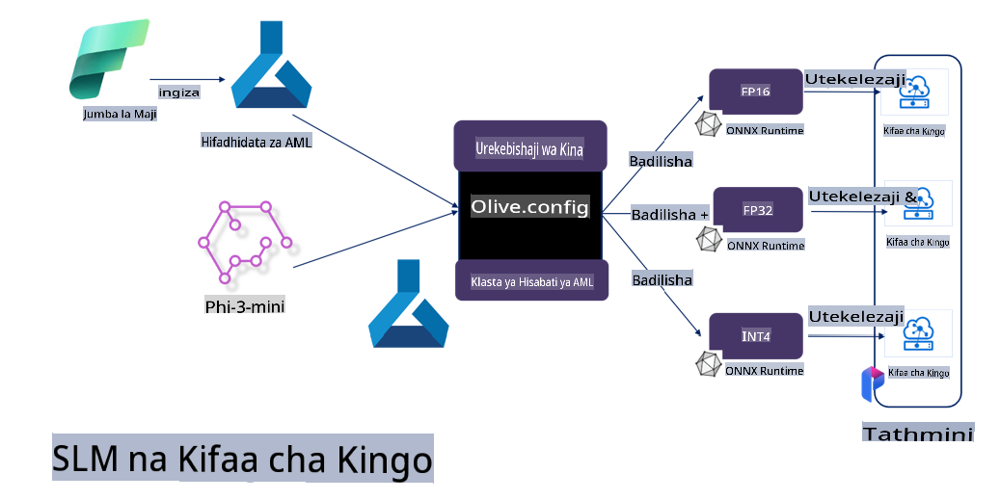

# **Kurekebisha Phi-3 kwa Microsoft Olive**

[Olive](https://github.com/microsoft/OLive?WT.mc_id=aiml-138114-kinfeylo) ni zana rahisi ya uboreshaji wa mifano inayozingatia vifaa, ambayo inajumuisha mbinu bora za tasnia katika kubana, kuboresha, na kutafsiri mifano.

Imeundwa kurahisisha mchakato wa kuboresha mifano ya ujifunzaji wa mashine, kuhakikisha inatumia miundombinu ya vifaa kwa ufanisi zaidi.

Ikiwa unafanya kazi kwenye programu za wingu au vifaa vya kingo, Olive hukuwezesha kuboresha mifano yako kwa urahisi na kwa ufanisi.

## Sifa Muhimu:
- Olive inakusanya na kuboresha mbinu za uboreshaji kwa malengo maalum ya vifaa.
- Hakuna mbinu moja ya uboreshaji inayofaa kila hali, hivyo Olive inaruhusu upanuzi kwa kuwezesha wataalamu wa tasnia kuongeza ubunifu wao wa uboreshaji.

## Punguza Juhudi za Uhandisi:
- Waendelezaji mara nyingi wanahitaji kujifunza na kutumia mnyororo wa zana maalum za wauzaji wa vifaa ili kuandaa na kuboresha mifano iliyofunzwa kwa ajili ya utekelezaji.
- Olive hurahisisha uzoefu huu kwa kuboresha mbinu za uboreshaji kwa vifaa vinavyotakiwa.

## Suluhisho la Uboreshaji wa Mwisho kwa Mwisho Tayari Kutumika:

Kwa kuunganisha na kurekebisha mbinu zilizojumuishwa, Olive inatoa suluhisho moja kwa moja kwa uboreshaji wa mwisho kwa mwisho.
Inazingatia vikwazo kama usahihi na ucheleweshaji wakati wa kuboresha mifano.

## Kutumia Microsoft Olive kwa Kurekebisha

Microsoft Olive ni zana ya wazi ya kuboresha mifano ambayo ni rahisi kutumia na inaweza kufunika kurekebisha na marejeleo katika uwanja wa akili bandia ya kizazi. Inahitaji tu usanidi rahisi, pamoja na matumizi ya mifano midogo ya lugha ya chanzo wazi na mazingira ya utekelezaji yanayohusiana (AzureML / GPU ya ndani, CPU, DirectML), unaweza kukamilisha kurekebisha au marejeleo ya mfano kupitia uboreshaji wa kiotomatiki, na kupata mfano bora wa kutekeleza kwenye wingu au kwenye vifaa vya kingo. Hii inaruhusu mashirika kujenga mifano yao ya sekta maalum kwenye mazingira ya ndani na wingu.


## Kurekebisha Phi-3 kwa Olive ya Microsoft 



## Mfano wa Nambari na Sampuli ya Phi-3 Olive
Katika mfano huu utatumia Olive kufanya:

- Kurekebisha adapta ya LoRA ili kuainisha misemo katika Huzuni, Furaha, Hofu, Mshangao.
- Kuunganisha uzito wa adapta kwenye mfano wa msingi.
- Kuboresha na kubana mfano hadi int4.

[Sampuli ya Nambari](../../code/03.Finetuning/olive-ort-example/README.md)

### Kusakinisha Microsoft Olive

Usakinishaji wa Microsoft Olive ni rahisi sana, na unaweza kusakinishwa kwa CPU, GPU, DirectML, na Azure ML

```bash
pip install olive-ai
```

Ikiwa unataka kuendesha mfano wa ONNX kwa CPU, unaweza kutumia

```bash
pip install olive-ai[cpu]
```

Ikiwa unataka kuendesha mfano wa ONNX kwa GPU, unaweza kutumia

```python
pip install olive-ai[gpu]
```

Ikiwa unataka kutumia Azure ML, tumia

```python
pip install git+https://github.com/microsoft/Olive#egg=olive-ai[azureml]
```

**Tahadhari**
Mahitaji ya OS: Ubuntu 20.04 / 22.04 

### **Config.json ya Microsoft Olive**

Baada ya usakinishaji, unaweza kusanidi mipangilio maalum ya mfano kupitia faili ya Config, ikiwa ni pamoja na data, hesabu, mafunzo, utekelezaji, na kizazi cha mfano.

**1. Data**

Kwa Microsoft Olive, mafunzo kwenye data ya ndani na data ya wingu yanaweza kuungwa mkono, na yanaweza kusanidiwa kwenye mipangilio.

*Mipangilio ya data ya ndani*

Unaweza tu kusanidi seti ya data inayohitajika kwa kurekebisha, kwa kawaida katika muundo wa json, na kuibadilisha na kiolezo cha data. Hii inahitaji kurekebishwa kulingana na mahitaji ya mfano (kwa mfano, kuibadilisha na muundo unaohitajika na Microsoft Phi-3-mini. Ikiwa una mifano mingine, tafadhali rejelea miundo inayohitajika ya kurekebisha kwa mifano mingine).

```json

    "data_configs": [
        {
            "name": "dataset_default_train",
            "type": "HuggingfaceContainer",
            "load_dataset_config": {
                "params": {
                    "data_name": "json", 
                    "data_files":"dataset/dataset-classification.json",
                    "split": "train"
                }
            },
            "pre_process_data_config": {
                "params": {
                    "dataset_type": "corpus",
                    "text_cols": [
                            "phrase",
                            "tone"
                    ],
                    "text_template": "### Text: {phrase}\n### The tone is:\n{tone}",
                    "corpus_strategy": "join",
                    "source_max_len": 2048,
                    "pad_to_max_len": false,
                    "use_attention_mask": false
                }
            }
        }
    ],
```

**Mipangilio ya chanzo cha data ya wingu**

Kwa kuunganisha hifadhi ya data ya Azure AI Studio / Huduma ya Kujifunza Mashine ya Azure ili kuunganisha data kwenye wingu, unaweza kuchagua kuanzisha vyanzo tofauti vya data kwenye Azure AI Studio / Huduma ya Kujifunza Mashine ya Azure kupitia Microsoft Fabric na Azure Data kama msaada wa kurekebisha data.

```json

    "data_configs": [
        {
            "name": "dataset_default_train",
            "type": "HuggingfaceContainer",
            "load_dataset_config": {
                "params": {
                    "data_name": "json", 
                    "data_files": {
                        "type": "azureml_datastore",
                        "config": {
                            "azureml_client": {
                                "subscription_id": "Your Azure Subscrition ID",
                                "resource_group": "Your Azure Resource Group",
                                "workspace_name": "Your Azure ML Workspaces name"
                            },
                            "datastore_name": "workspaceblobstore",
                            "relative_path": "Your train_data.json Azure ML Location"
                        }
                    },
                    "split": "train"
                }
            },
            "pre_process_data_config": {
                "params": {
                    "dataset_type": "corpus",
                    "text_cols": [
                            "Question",
                            "Best Answer"
                    ],
                    "text_template": "<|user|>\n{Question}<|end|>\n<|assistant|>\n{Best Answer}\n<|end|>",
                    "corpus_strategy": "join",
                    "source_max_len": 2048,
                    "pad_to_max_len": false,
                    "use_attention_mask": false
                }
            }
        }
    ],
    
```

**2. Usanidi wa hesabu**

Ikiwa unahitaji kuwa wa ndani, unaweza kutumia moja kwa moja rasilimali za data za ndani. Unahitaji kutumia rasilimali za Azure AI Studio / Huduma ya Kujifunza Mashine ya Azure. Unahitaji kusanidi vigezo husika vya Azure, jina la uwezo wa kompyuta, nk.

```json

    "systems": {
        "aml": {
            "type": "AzureML",
            "config": {
                "accelerators": ["gpu"],
                "hf_token": true,
                "aml_compute": "Your Azure AI Studio / Azure Machine Learning Service Compute Name",
                "aml_docker_config": {
                    "base_image": "Your Azure AI Studio / Azure Machine Learning Service docker",
                    "conda_file_path": "conda.yaml"
                }
            }
        },
        "azure_arc": {
            "type": "AzureML",
            "config": {
                "accelerators": ["gpu"],
                "aml_compute": "Your Azure AI Studio / Azure Machine Learning Service Compute Name",
                "aml_docker_config": {
                    "base_image": "Your Azure AI Studio / Azure Machine Learning Service docker",
                    "conda_file_path": "conda.yaml"
                }
            }
        }
    },
```

***Tahadhari***

Kwa sababu inatekelezwa kupitia kontena kwenye Azure AI Studio / Huduma ya Kujifunza Mashine ya Azure, mazingira yanayohitajika yanapaswa kusanidiwa. Hii inasanidiwa kwenye mazingira ya conda.yaml.

```yaml

name: project_environment
channels:
  - defaults
dependencies:
  - python=3.8.13
  - pip=22.3.1
  - pip:
      - einops
      - accelerate
      - azure-keyvault-secrets
      - azure-identity
      - bitsandbytes
      - datasets
      - huggingface_hub
      - peft
      - scipy
      - sentencepiece
      - torch>=2.2.0
      - transformers
      - git+https://github.com/microsoft/Olive@jiapli/mlflow_loading_fix#egg=olive-ai[gpu]
      - --extra-index-url https://aiinfra.pkgs.visualstudio.com/PublicPackages/_packaging/ORT-Nightly/pypi/simple/ 
      - ort-nightly-gpu==1.18.0.dev20240307004
      - --extra-index-url https://aiinfra.pkgs.visualstudio.com/PublicPackages/_packaging/onnxruntime-genai/pypi/simple/
      - onnxruntime-genai-cuda

    

```

**3. Chagua SLM yako**

Unaweza kutumia mfano moja kwa moja kutoka Hugging Face, au unaweza kuunganisha moja kwa moja na Katalogi ya Mifano ya Azure AI Studio / Huduma ya Kujifunza Mashine ya Azure kuchagua mfano wa kutumia. Katika mfano wa nambari hapa chini tutatumia Microsoft Phi-3-mini kama mfano.

Ikiwa una mfano wa ndani, unaweza kutumia njia hii

```json

    "input_model":{
        "type": "PyTorchModel",
        "config": {
            "hf_config": {
                "model_name": "model-cache/microsoft/phi-3-mini",
                "task": "text-generation",
                "model_loading_args": {
                    "trust_remote_code": true
                }
            }
        }
    },
```

Ikiwa unataka kutumia mfano kutoka Azure AI Studio / Huduma ya Kujifunza Mashine ya Azure, unaweza kutumia njia hii

```json

    "input_model":{
        "type": "PyTorchModel",
        "config": {
            "model_path": {
                "type": "azureml_registry_model",
                "config": {
                    "name": "microsoft/Phi-3-mini-4k-instruct",
                    "registry_name": "azureml-msr",
                    "version": "11"
                }
            },
             "model_file_format": "PyTorch.MLflow",
             "hf_config": {
                "model_name": "microsoft/Phi-3-mini-4k-instruct",
                "task": "text-generation",
                "from_pretrained_args": {
                    "trust_remote_code": true
                }
            }
        }
    },
```

**Tahadhari:**
Tunapaswa kuunganisha na Azure AI Studio / Huduma ya Kujifunza Mashine ya Azure, hivyo wakati wa kusanidi mfano, tafadhali rejelea namba ya toleo na majina yanayohusiana.

Mifano yote kwenye Azure inapaswa kuwekwa kwa PyTorch.MLflow

Unahitaji kuwa na akaunti ya Hugging Face na kuiunganisha na thamani ya Kifunguo cha Azure AI Studio / Huduma ya Kujifunza Mashine.

**4. Algorithm**

Microsoft Olive imefungasha vizuri algorithmi za kurekebisha Lora na QLora. Unachohitaji kufanya ni kusanidi vigezo husika. Hapa nitachukua QLora kama mfano.

```json
        "lora": {
            "type": "LoRA",
            "config": {
                "target_modules": [
                    "o_proj",
                    "qkv_proj"
                ],
                "double_quant": true,
                "lora_r": 64,
                "lora_alpha": 64,
                "lora_dropout": 0.1,
                "train_data_config": "dataset_default_train",
                "eval_dataset_size": 0.3,
                "training_args": {
                    "seed": 0,
                    "data_seed": 42,
                    "per_device_train_batch_size": 1,
                    "per_device_eval_batch_size": 1,
                    "gradient_accumulation_steps": 4,
                    "gradient_checkpointing": false,
                    "learning_rate": 0.0001,
                    "num_train_epochs": 3,
                    "max_steps": 10,
                    "logging_steps": 10,
                    "evaluation_strategy": "steps",
                    "eval_steps": 187,
                    "group_by_length": true,
                    "adam_beta2": 0.999,
                    "max_grad_norm": 0.3
                }
            }
        },
```

Ikiwa unataka ubadilishaji wa ubora, tawi kuu la Microsoft Olive tayari linaunga mkono njia ya onnxruntime-genai. Unaweza kusanidi kulingana na mahitaji yako:

1. Unganisha uzito wa adapta kwenye mfano wa msingi.
2. Badilisha mfano kuwa mfano wa onnx na usahihi unaohitajika kupitia ModelBuilder.

Kwa mfano, kubadilisha kuwa INT4 iliyobanwa.

```json

        "merge_adapter_weights": {
            "type": "MergeAdapterWeights"
        },
        "builder": {
            "type": "ModelBuilder",
            "config": {
                "precision": "int4"
            }
        }
```

**Tahadhari** 
- Ikiwa unatumia QLoRA, ubadilishaji wa ubora wa ONNXRuntime-genai haujaungwa mkono kwa sasa.

- Inapaswa kusemwa hapa kwamba unaweza kusanidi hatua zilizo hapo juu kulingana na mahitaji yako. Sio lazima kusanidi hatua zote hapo juu. Kulingana na mahitaji yako, unaweza kutumia hatua za algorithmi moja kwa moja bila kurekebisha. Hatimaye unahitaji kusanidi injini husika.

```json

    "engine": {
        "log_severity_level": 0,
        "host": "aml",
        "target": "aml",
        "search_strategy": false,
        "execution_providers": ["CUDAExecutionProvider"],
        "cache_dir": "../model-cache/models/phi3-finetuned/cache",
        "output_dir" : "../model-cache/models/phi3-finetuned"
    }
```

**5. Kumaliza kurekebisha**

Kwenye mstari wa amri, tekeleza kwenye saraka ya olive-config.json

```bash
olive run --config olive-config.json  
```

**Kanusho**:  
Hati hii imetafsiriwa kwa kutumia huduma za kutafsiri za AI zinazotegemea mashine. Ingawa tunajitahidi kwa usahihi, tafadhali fahamu kuwa tafsiri za kiotomatiki zinaweza kuwa na makosa au kutokuwa sahihi. Hati ya asili katika lugha yake ya awali inapaswa kuzingatiwa kama chanzo cha mamlaka. Kwa taarifa muhimu, inashauriwa kutumia huduma za wataalamu wa tafsiri ya kibinadamu. Hatutawajibika kwa kutoelewana au tafsiri zisizo sahihi zinazotokana na matumizi ya tafsiri hii.