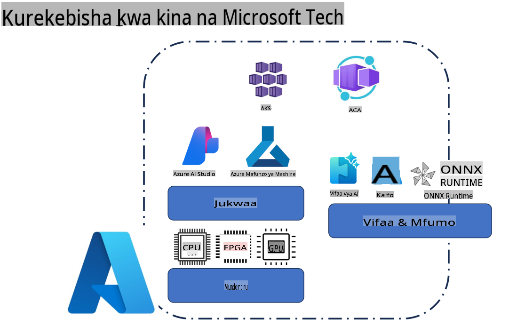
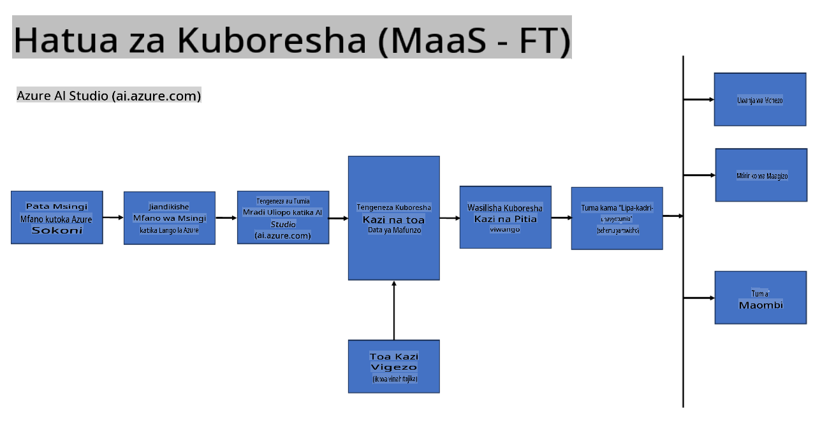
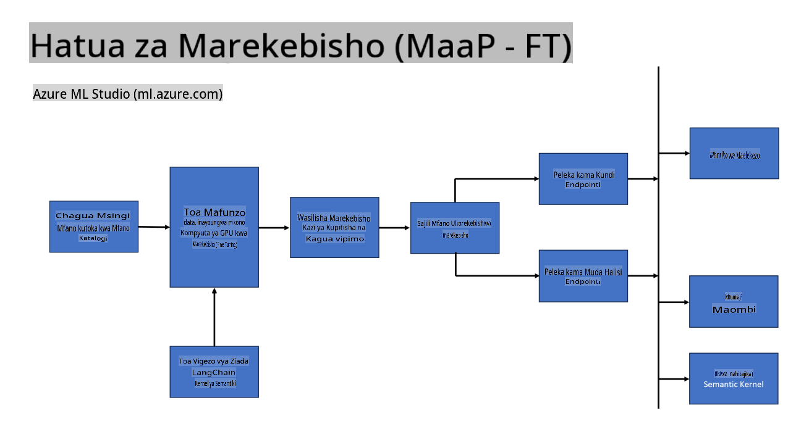
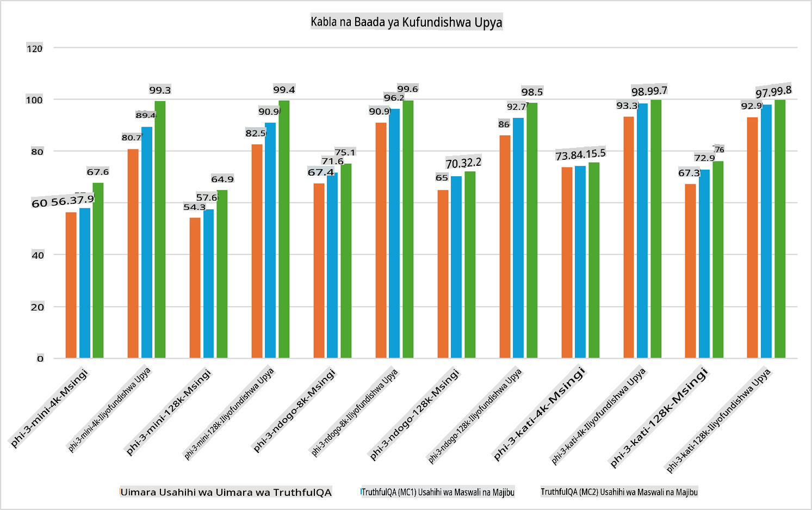

## Matukio ya Kurekebisha

**Jukwaa** Hii inajumuisha teknolojia mbalimbali kama Azure AI Foundry, Azure Machine Learning, AI Tools, Kaito, na ONNX Runtime.

**Miundombinu** Hii inajumuisha CPU na FPGA, ambazo ni muhimu kwa mchakato wa kurekebisha. Hebu nikuonyeshe alama za kila moja ya teknolojia hizi.

**Zana & Mfumo** Hii inajumuisha ONNX Runtime na ONNX Runtime. Hebu nikuonyeshe alama za kila moja ya teknolojia hizi.  
[Ongeza alama za ONNX Runtime na ONNX Runtime]

Mchakato wa kurekebisha kwa kutumia teknolojia za Microsoft unahusisha vipengele na zana mbalimbali. Kwa kuelewa na kutumia teknolojia hizi, tunaweza kurekebisha programu zetu kwa ufanisi na kuunda suluhisho bora.

## Modeli kama Huduma

Rekebisha modeli kwa kutumia huduma za kurekebisha zilizoandaliwa, bila haja ya kuunda na kusimamia kompyuta.

Kurekebisha bila seva kunapatikana kwa modeli za Phi-3-mini na Phi-3-medium, kuwezesha watengenezaji kubinafsisha modeli kwa haraka na kwa urahisi kwa mazingira ya wingu na kingo bila kupanga kompyuta. Tumetangaza pia kuwa, Phi-3-small, sasa inapatikana kupitia huduma yetu ya Models-as-a-Service, hivyo watengenezaji wanaweza kuanza haraka na kwa urahisi katika maendeleo ya AI bila kusimamia miundombinu ya msingi.

## Modeli kama Jukwaa

Watumiaji wanasimamia kompyuta zao wenyewe ili kurekebisha modeli zao.

[Kifani cha Kurekebisha](https://github.com/Azure/azureml-examples/blob/main/sdk/python/foundation-models/system/finetune/chat-completion/chat-completion.ipynb)

## Matukio ya Kurekebisha 

| | | | | | | |
|-|-|-|-|-|-|-|
|Matukio|LoRA|QLoRA|PEFT|DeepSpeed|ZeRO|DORA|
|Kubadilisha LLM zilizofundishwa awali kwa kazi au nyanja maalum|Ndiyo|Ndiyo|Ndiyo|Ndiyo|Ndiyo|Ndiyo|
|Kurekebisha kwa kazi za NLP kama uainishaji wa maandishi, kutambua huluki majina, na tafsiri ya maandishi|Ndiyo|Ndiyo|Ndiyo|Ndiyo|Ndiyo|Ndiyo|
|Kurekebisha kwa kazi za Maswali na Majibu|Ndiyo|Ndiyo|Ndiyo|Ndiyo|Ndiyo|Ndiyo|
|Kurekebisha kwa kuzalisha majibu yanayofanana na ya binadamu katika roboti za mazungumzo|Ndiyo|Ndiyo|Ndiyo|Ndiyo|Ndiyo|Ndiyo|
|Kurekebisha kwa kuzalisha muziki, sanaa, au aina nyingine za ubunifu|Ndiyo|Ndiyo|Ndiyo|Ndiyo|Ndiyo|Ndiyo|
|Kupunguza gharama za kihesabu na kifedha|Ndiyo|Ndiyo|Hapana|Ndiyo|Ndiyo|Hapana|
|Kupunguza matumizi ya kumbukumbu|Hapana|Ndiyo|Hapana|Ndiyo|Ndiyo|Ndiyo|
|Kutumia vigezo vichache kwa ufanisi wa kurekebisha|Hapana|Ndiyo|Ndiyo|Hapana|Hapana|Ndiyo|
|Njia ya sambamba inayotumia kumbukumbu ya GPU zote zinazopatikana|Hapana|Hapana|Hapana|Ndiyo|Ndiyo|Ndiyo|

## Mifano ya Utendaji wa Kurekebisha

**Kanusho**:  
Hati hii imetafsiriwa kwa kutumia huduma za tafsiri za AI zinazotumia mashine. Ingawa tunajitahidi kwa usahihi, tafadhali fahamu kuwa tafsiri za kiotomatiki zinaweza kuwa na makosa au kutokamilika. Hati ya asili katika lugha yake ya kiasili inapaswa kuzingatiwa kama chanzo cha mamlaka. Kwa taarifa muhimu, tafsiri ya kitaalamu ya binadamu inapendekezwa. Hatutawajibika kwa maelewano mabaya au tafsiri zisizo sahihi zinazotokana na matumizi ya tafsiri hii.