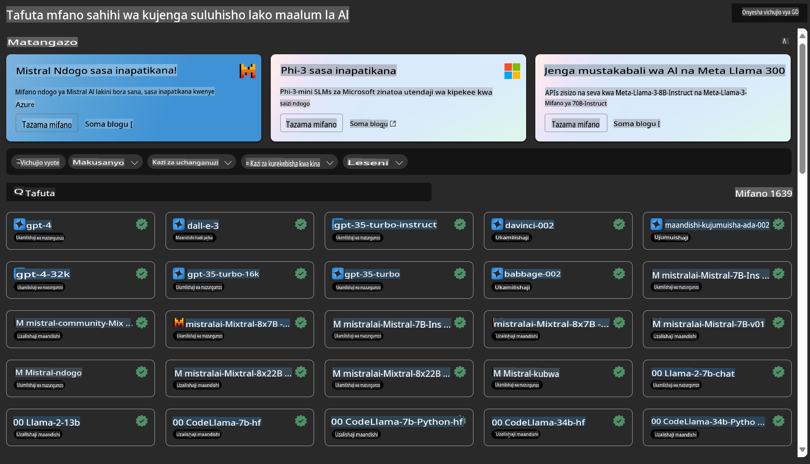

# **Tambulisha Huduma ya Azure Machine Learning**

[Azure Machine Learning](https://ml.azure.com?WT.mc_id=aiml-138114-kinfeylo) ni huduma ya wingu inayoharakisha na kusimamia mzunguko wa maisha wa mradi wa kujifunza kwa mashine (ML).

Wataalamu wa ML, wanasayansi wa data, na wahandisi wanaweza kuitumia katika kazi zao za kila siku kwa:

- Kufundisha na kuweka mifano.
- Kusimamia shughuli za kujifunza kwa mashine (MLOps).
- Unaweza kuunda mfano katika Azure Machine Learning au kutumia mfano uliotengenezwa kutoka kwenye jukwaa la chanzo huria, kama PyTorch, TensorFlow, au scikit-learn.
- Zana za MLOps hukusaidia kufuatilia, kufundisha upya, na kuweka tena mifano.

## Azure Machine Learning ni kwa nani?

**Wanasayansi wa Data na Wahandisi wa ML**

Wanaweza kutumia zana kuharakisha na kuendesha kazi zao za kila siku.
Azure ML inatoa vipengele vya usawa, kuelezeka, kufuatilia, na kufuatilia nyayo.

**Watengenezaji wa Maombi**

Wanaweza kuunganisha mifano katika maombi au huduma kwa urahisi.

**Watengenezaji wa Majukwaa**

Wanapata seti thabiti ya zana zinazoungwa mkono na API za kudumu za Azure Resource Manager.
Zana hizi huruhusu kujenga zana za hali ya juu za ML.

**Makampuni**

Kwa kufanya kazi katika wingu la Microsoft Azure, makampuni yanapata faida ya usalama wa kawaida na udhibiti wa ufikiaji unaotegemea majukumu.
Sanidi miradi ili kudhibiti ufikiaji wa data iliyolindwa na shughuli maalum.

## Ufanisi kwa Kila Mtu Katika Timu

Miradi ya ML mara nyingi huhitaji timu yenye ujuzi tofauti kujenga na kudumisha.

Azure ML inatoa zana zinazokuwezesha:
- Kushirikiana na timu yako kupitia daftari zinazoshirikiwa, rasilimali za kompyuta, kompyuta zisizo na seva, data, na mazingira.
- Kuendeleza mifano yenye usawa, kuelezeka, kufuatilia, na kufuatilia nyayo ili kufikia mahitaji ya kufuatilia na kufuata kanuni.
- Kuweka mifano ya ML kwa haraka na kwa urahisi kwa kiwango kikubwa, na kuisimamia kwa ufanisi na MLOps.
- Kuendesha kazi za ML mahali popote kwa kutumia usimamizi wa ndani, usalama, na kufuata kanuni.

## Zana za Jukwaa Zilizolingana

Mtu yeyote katika timu ya ML anaweza kutumia zana wanazopendelea kumaliza kazi.

Ikiwa unafanya majaribio ya haraka, kurekebisha vigezo, kujenga mabomba, au kusimamia makisio, unaweza kutumia miingiliano inayojulikana ikiwa ni pamoja na:
- Azure Machine Learning Studio
- Python SDK (v2)
- Azure CLI (v2)
- Azure Resource Manager REST APIs

Unapoboreshwa mifano na kushirikiana katika mzunguko wa maendeleo, unaweza kushiriki na kupata mali, rasilimali, na vipimo ndani ya UI ya Azure Machine Learning studio.

## **LLM/SLM katika Azure ML**

Azure ML imeongeza kazi nyingi zinazohusiana na LLM/SLM, ikichanganya LLMOps na SLMOps ili kuunda jukwaa la teknolojia ya akili bandia ya kizazi kwa kiwango cha shirika.

### **Katalogi ya Mifano**

Watumiaji wa mashirika wanaweza kuweka mifano tofauti kulingana na hali tofauti za biashara kupitia Katalogi ya Mifano, na kutoa huduma kama Model as Service kwa watengenezaji au watumiaji wa mashirika kufikia.

Katalogi ya Mifano katika Azure Machine Learning studio ni kitovu cha kugundua na kutumia aina mbalimbali za mifano inayokuwezesha kujenga maombi ya Generative AI. Katalogi ya mifano ina vipengele vya mamia ya mifano kutoka kwa watoa huduma wa mifano kama Azure OpenAI service, Mistral, Meta, Cohere, Nvidia, Hugging Face, ikijumuisha mifano iliyofundishwa na Microsoft. Mifano kutoka kwa watoa huduma wengine isipokuwa Microsoft ni Bidhaa Zisizo za Microsoft, kama ilivyoelezwa katika Masharti ya Bidhaa ya Microsoft, na ziko chini ya masharti yaliyotolewa na mfano.

### **Mabomba ya Kazi**

Kiini cha bomba la kujifunza kwa mashine ni kugawanya kazi kamili ya kujifunza kwa mashine katika mchakato wa hatua nyingi. Kila hatua ni sehemu inayoweza kudhibitiwa ambayo inaweza kuendelezwa, kuboreshwa, kusanidiwa, na kuendeshwa kiotomatiki kwa uhuru. Hatua zimeunganishwa kupitia miingiliano iliyoelezwa vizuri. Huduma ya bomba la Azure Machine Learning huendesha kiotomatiki utegemezi wote kati ya hatua za bomba.

Katika kufundisha kwa kina SLM / LLM, tunaweza kusimamia data yetu, mafunzo, na michakato ya kizazi kupitia Pipeline.

### **Mtiririko wa Prompt**

Manufaa ya kutumia mtiririko wa prompt wa Azure Machine Learning  
Azure Machine Learning prompt flow inatoa manufaa mbalimbali ambayo husaidia watumiaji kutoka kwenye mawazo hadi majaribio na hatimaye maombi ya LLM yaliyotayari kwa uzalishaji:

**Uwezo wa uhandisi wa prompt**

Uzoefu wa uandishi wa maingiliano: Mtiririko wa prompt wa Azure Machine Learning unatoa uwakilishi wa kuona wa muundo wa mtiririko, ukiruhusu watumiaji kuelewa na kuvinjari miradi yao kwa urahisi. Pia inatoa uzoefu wa uandishi wa msimbo kama daftari kwa maendeleo ya mtiririko na urekebishaji wa haraka.  
Tofauti za kurekebisha prompt: Watumiaji wanaweza kuunda na kulinganisha tofauti nyingi za prompt, kuwezesha mchakato wa kurekebisha iteratively.  

Tathmini: Mtiririko wa tathmini uliojengwa ndani unawawezesha watumiaji kutathmini ubora na ufanisi wa prompt na mtiririko wao.  

Rasilimali kamili: Mtiririko wa prompt wa Azure Machine Learning unajumuisha maktaba ya zana zilizojengwa ndani, sampuli, na violezo vinavyotumika kama sehemu ya kuanzia kwa maendeleo, kuhamasisha ubunifu na kuharakisha mchakato.  

**Utayari wa shirika kwa maombi yanayotegemea LLM**

Ushirikiano: Mtiririko wa prompt wa Azure Machine Learning unasaidia ushirikiano wa timu, ukiruhusu watumiaji wengi kufanya kazi pamoja kwenye miradi ya uhandisi wa prompt, kushiriki maarifa, na kudumisha udhibiti wa matoleo.  

Jukwaa la kila kitu: Mtiririko wa prompt wa Azure Machine Learning hurahisisha mchakato mzima wa uhandisi wa prompt, kutoka maendeleo na tathmini hadi kupelekwa na ufuatiliaji. Watumiaji wanaweza kupeleka mtiririko wao kwa urahisi kama endpoints za Azure Machine Learning na kufuatilia utendaji wao kwa wakati halisi, kuhakikisha operesheni bora na uboreshaji endelevu.  

Suluhisho za Utayari wa Shirika la Azure Machine Learning: Mtiririko wa prompt hutumia suluhisho thabiti za utayari wa shirika la Azure Machine Learning, zinazotoa msingi salama, unaoweza kupanuka, na wa kuaminika kwa maendeleo, majaribio, na kupelekwa kwa mtiririko.  

Kwa kutumia mtiririko wa prompt wa Azure Machine Learning, watumiaji wanaweza kuimarisha uwezo wao wa uhandisi wa prompt, kushirikiana kwa ufanisi, na kutumia suluhisho za kiwango cha shirika kwa maendeleo na upelekaji wa mafanikio wa maombi yanayotegemea LLM.

Kwa kuchanganya nguvu ya kompyuta, data, na vipengele mbalimbali vya Azure ML, watengenezaji wa mashirika wanaweza kwa urahisi kujenga maombi yao ya akili bandia.

**Kanusho**:  
Hati hii imetafsiriwa kwa kutumia huduma za kutafsiri zinazotegemea AI. Ingawa tunajitahidi kwa usahihi, tafadhali fahamu kuwa tafsiri za kiotomatiki zinaweza kuwa na makosa au kutokuwa sahihi. Hati ya asili katika lugha yake ya awali inapaswa kuchukuliwa kuwa chanzo cha mamlaka. Kwa taarifa muhimu, inashauriwa kutumia huduma za kitaalamu za kutafsiri binadamu. Hatutawajibika kwa kutoelewana au tafsiri zisizo sahihi zinazotokana na matumizi ya tafsiri hii.