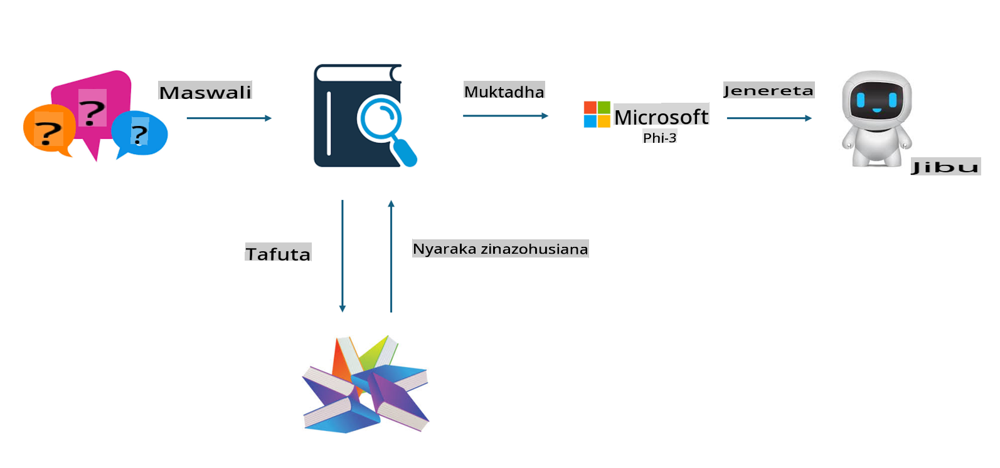
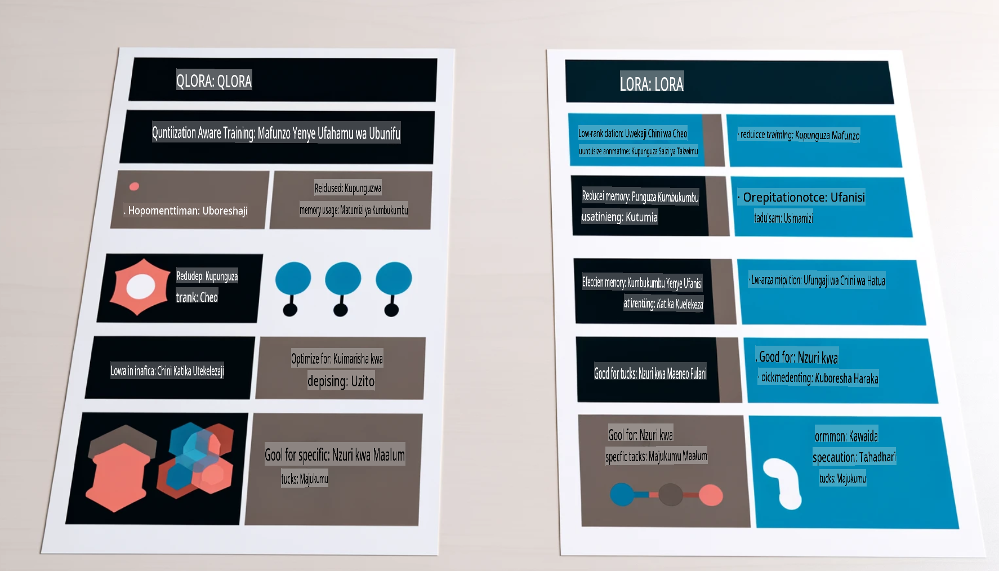

# **Mruhusu Phi-3 Kuwa Mtaalamu wa Sekta**

Ili kuweka mfano wa Phi-3 kwenye sekta fulani, unahitaji kuongeza data ya biashara ya sekta hiyo kwenye mfano wa Phi-3. Tuna chaguo mbili tofauti, ya kwanza ni RAG (Retrieval Augmented Generation) na ya pili ni Fine Tuning.

## **RAG dhidi ya Fine-Tuning**

### **Retrieval Augmented Generation**

RAG ni mchanganyiko wa urejeshaji wa data na uzalishaji wa maandishi. Data iliyopangiliwa na isiyopangiliwa ya shirika huhifadhiwa kwenye hifadhidata ya vekta. Wakati wa kutafuta maudhui husika, muhtasari na maudhui yanayohusiana hupatikana ili kuunda muktadha, na uwezo wa kukamilisha maandishi wa LLM/SLM unachanganywa ili kuzalisha maudhui.

### **Fine-tuning**

Fine-tuning ni uboreshaji wa mfano fulani. Haihitaji kuanzia na algorithimu ya mfano, lakini data inahitaji kukusanywa mara kwa mara. Ikiwa unahitaji istilahi sahihi zaidi na maelezo ya lugha katika matumizi ya sekta, fine-tuning ni chaguo bora. Lakini ikiwa data yako hubadilika mara kwa mara, fine-tuning inaweza kuwa changamoto.

### **Jinsi ya kuchagua**

1. Ikiwa jibu letu linahitaji kuingiza data ya nje, RAG ni chaguo bora.

2. Ikiwa unahitaji kutoa maarifa thabiti na sahihi ya sekta, fine-tuning itakuwa chaguo zuri. RAG inatanguliza kuvuta maudhui yanayohusiana lakini huenda isiwe sahihi katika mambo ya kitaalamu.

3. Fine-tuning inahitaji seti ya data ya ubora wa juu, na ikiwa ni data ndogo tu, haitakuwa na tofauti kubwa. RAG ni rahisi zaidi.

4. Fine-tuning ni kama "sanduku jeusi," na ni vigumu kuelewa utaratibu wa ndani. Lakini RAG inaweza kurahisisha kupata chanzo cha data, hivyo kupunguza makosa au maudhui ya kufikirika na kutoa uwazi bora.

### **Matukio**

1. Sekta wima zinazohitaji istilahi na maelezo maalum ya kitaalamu, ***Fine-tuning*** litakuwa chaguo bora.

2. Mfumo wa maswali na majibu, unaojumuisha mchanganyiko wa vidokezo tofauti vya maarifa, ***RAG*** litakuwa chaguo bora.

3. Mchanganyiko wa mtiririko wa biashara ulioboreshwa kiotomatiki ***RAG + Fine-tuning*** ni chaguo bora.

## **Jinsi ya kutumia RAG**

Hifadhidata ya vekta ni mkusanyiko wa data iliyohifadhiwa kwa mfumo wa kihisabati. Hifadhidata za vekta hufanya iwe rahisi kwa mifano ya kujifunza kwa mashine kukumbuka pembejeo za awali, kuwezesha matumizi ya kujifunza kwa mashine kusaidia kesi za matumizi kama utafutaji, mapendekezo, na uzalishaji wa maandishi. Data inaweza kutambuliwa kwa msingi wa vipimo vya kufanana badala ya kufanana kamili, kuruhusu mifano ya kompyuta kuelewa muktadha wa data.

Hifadhidata ya vekta ni ufunguo wa kutekeleza RAG. Tunaweza kubadilisha data kuwa hifadhi ya vekta kupitia mifano ya vekta kama vile text-embedding-3, jina-ai-embedding, n.k.

Jifunze zaidi kuhusu kuunda programu ya RAG [https://github.com/microsoft/Phi-3CookBook](https://github.com/microsoft/Phi-3CookBook?WT.mc_id=aiml-138114-kinfeylo)

## **Jinsi ya kutumia Fine-tuning**

Algorithimu zinazotumika sana katika Fine-tuning ni Lora na QLora. Jinsi ya kuchagua?  
- [Jifunze Zaidi na daftari hili la mfano](../../../../code/04.Finetuning/Phi_3_Inference_Finetuning.ipynb)  
- [Mfano wa Python FineTuning](../../../../code/04.Finetuning/FineTrainingScript.py)

### **Lora na QLora**

LoRA (Low-Rank Adaptation) na QLoRA (Quantized Low-Rank Adaptation) ni mbinu zote mbili zinazotumika kurekebisha mifano mikubwa ya lugha (LLMs) kwa kutumia Parameter Efficient Fine Tuning (PEFT). Mbinu za PEFT zimeundwa kufundisha mifano kwa ufanisi zaidi kuliko mbinu za jadi.  
LoRA ni mbinu ya kujitegemea ya fine-tuning ambayo inapunguza mahitaji ya kumbukumbu kwa kutumia makadirio ya kiwango cha chini kwenye matrix ya masasisho ya uzito. Inatoa nyakati za mafunzo za haraka na inahifadhi utendaji karibu na mbinu za jadi za fine-tuning.

QLoRA ni toleo lililopanuliwa la LoRA ambalo linajumuisha mbinu za kupunguza ukubwa wa kumbukumbu zaidi. QLoRA hupunguza usahihi wa vigezo vya uzito katika LLM iliyofunzwa awali hadi usahihi wa biti 4, ambayo ni bora zaidi kwa kumbukumbu kuliko LoRA. Hata hivyo, mafunzo ya QLoRA ni polepole kwa takriban 30% ikilinganishwa na LoRA kutokana na hatua za kupunguza na kurejesha usahihi.

QLoRA hutumia LoRA kama nyongeza kurekebisha makosa yanayotokana na kupunguza ukubwa. QLoRA inaruhusu fine-tuning ya mifano mikubwa yenye mabilioni ya vigezo kwa kutumia GPU ndogo, inayopatikana kwa urahisi. Kwa mfano, QLoRA inaweza kufanya fine-tuning ya mfano wa vigezo bilioni 70 ambao unahitaji GPU 36 kwa kutumia GPU 2 tu.

**Kanusho:**  
Hati hii imetafsiriwa kwa kutumia huduma za tafsiri za mashine zinazotumia AI. Ingawa tunajitahidi kuhakikisha usahihi, tafadhali fahamu kuwa tafsiri za kiotomatiki zinaweza kuwa na makosa au kutokuwa sahihi. Hati asili katika lugha yake ya awali inapaswa kuzingatiwa kama chanzo cha mamlaka. Kwa taarifa muhimu, inashauriwa kutumia huduma za wataalamu wa tafsiri ya kibinadamu. Hatutawajibika kwa maelewano mabaya au tafsiri zisizo sahihi zitokanazo na matumizi ya tafsiri hii.