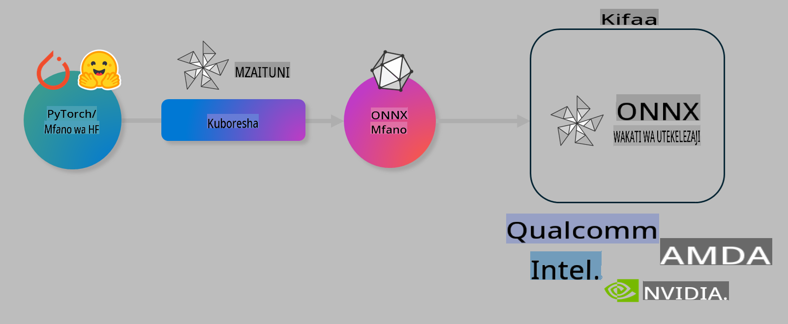

# Maabara: Boresha mifano ya AI kwa utabiri kwenye kifaa

## Utangulizi 

> [!IMPORTANT]
> Maabara hii inahitaji **GPU ya Nvidia A10 au A100** pamoja na madereva husika na zana ya CUDA (toleo la 12+).

> [!NOTE]
> Hii ni maabara ya **dakika 35** ambayo itakupa utangulizi wa vitendo wa dhana kuu za kuboresha mifano kwa utabiri kwenye kifaa kwa kutumia OLIVE.

## Malengo ya Kujifunza

Mwisho wa maabara hii, utaweza kutumia OLIVE ili:

- Kupunguza ukubwa wa mfano wa AI kwa kutumia mbinu ya AWQ.
- Kufanya marekebisho ya mfano wa AI kwa kazi maalum.
- Kuzalisha adapta za LoRA (mfano uliorekebishwa) kwa utabiri wa ufanisi kwenye kifaa kwa kutumia ONNX Runtime.

### Olive ni nini

Olive (*O*NNX *live*) ni zana ya kuboresha mifano yenye CLI inayosaidia ambayo inakuwezesha kusafirisha mifano kwa ONNX runtime +++https://onnxruntime.ai+++ kwa ubora na utendaji bora.



Ingizo la Olive kawaida ni mfano wa PyTorch au Hugging Face, na matokeo yake ni mfano wa ONNX ulioboreshwa unaotekelezwa kwenye kifaa (lengo la kupeleka) linaloendesha ONNX runtime. Olive itaboresha mfano kwa lengo la kupeleka kulingana na kasi ya AI ya kifaa (NPU, GPU, CPU) iliyotolewa na muuzaji wa vifaa kama Qualcomm, AMD, Nvidia, au Intel.

Olive hutekeleza *workflow*, ambayo ni mlolongo uliopangwa wa kazi za kibinafsi za kuboresha mifano zinazojulikana kama *passes* - mfano wa passes ni pamoja na: kubana mfano, kunasa grafu, kupunguza ukubwa, na kuboresha grafu. Kila pass ina seti ya vigezo vinavyoweza kubadilishwa ili kufanikisha viwango bora vya usahihi na ucheleweshaji, ambavyo vinatathminiwa na mkadiriaji husika. Olive hutumia mkakati wa utafutaji unaotumia algorithimu ya utafutaji kuboresha pass moja moja au seti ya passes pamoja.

#### Faida za Olive

- **Kupunguza kuchanganyikiwa na muda** wa majaribio ya mikono kwa kutumia mbinu tofauti za kuboresha grafu, kubana, na kupunguza ukubwa. Eleza vigezo vyako vya ubora na utendaji na uiruhusu Olive ikupatie mfano bora moja kwa moja.
- **Vipengele zaidi ya 40 vya kuboresha mifano vilivyojengwa ndani** vinavyoshughulikia mbinu za kisasa za kupunguza ukubwa, kubana, kuboresha grafu, na kurekebisha mifano.
- **CLI rahisi kutumia** kwa kazi za kawaida za kuboresha mifano. Kwa mfano, olive quantize, olive auto-opt, olive finetune.
- Ufungaji wa mifano na kupeleka kumejengwa ndani.
- Inasaidia kuzalisha mifano kwa **Multi LoRA serving**.
- Jenga workflows kwa kutumia YAML/JSON ili kuratibu kazi za kuboresha mifano na kupeleka.
- Ushirikiano na **Hugging Face** na **Azure AI**.
- Mfumo wa **caching** uliojengwa ndani ili **kuokoa gharama**.

## Maelekezo ya Maabara
> [!NOTE]
> Tafadhali hakikisha umeandaa Azure AI Hub yako na Mradi na kuweka A100 compute yako kama ilivyoelezwa kwenye Maabara 1.

### Hatua ya 0: Unganisha kwenye Azure AI Compute yako

Utaunganisha kwenye Azure AI compute kwa kutumia kipengele cha mbali kwenye **VS Code.** 

1. Fungua programu yako ya mezani ya **VS Code**:
1. Fungua **command palette** kwa kutumia **Shift+Ctrl+P**
1. Katika command palette tafuta **AzureML - remote: Connect to compute instance in New Window**.
1. Fuata maelekezo yanayoonekana kwenye skrini ili kuunganisha Compute. Hii itahusisha kuchagua Usajili wako wa Azure, Kikundi cha Rasilimali, Mradi, na Jina la Compute uliloweka kwenye Maabara 1.
1. Mara umeunganishwa kwenye nodi yako ya Azure ML Compute, hii itaonyeshwa kwenye **kushoto chini ya Visual Code** `><Azure ML: Compute Name`

### Hatua ya 1: Clone repo hii

Katika VS Code, unaweza kufungua terminal mpya kwa kutumia **Ctrl+J** na kunakili repo hii:

Katika terminal utaona prompt

```
azureuser@computername:~/cloudfiles/code$ 
```
Nakili suluhisho 

```bash
cd ~/localfiles
git clone https://github.com/microsoft/phi-3cookbook.git
```

### Hatua ya 2: Fungua Folda kwenye VS Code

Ili kufungua VS Code kwenye folda husika, tekeleza amri ifuatayo kwenye terminal, ambayo itafungua dirisha jipya:

```bash
code phi-3cookbook/code/04.Finetuning/Olive-lab
```

Vinginevyo, unaweza kufungua folda kwa kuchagua **File** > **Open Folder**. 

### Hatua ya 3: Vitegemezi

Fungua dirisha la terminal kwenye VS Code kwenye Azure AI Compute Instance yako (kidokezo: **Ctrl+J**) na tekeleza amri zifuatazo ili kusakinisha vitegemezi:

```bash
conda create -n olive-ai python=3.11 -y
conda activate olive-ai
pip install -r requirements.txt
az extension remove -n azure-cli-ml
az extension add -n ml
```

> [!NOTE]
> Itachukua ~dakika 5 kusakinisha vitegemezi vyote.

Katika maabara hii utapakua na kupakia mifano kwenye katalogi ya mifano ya Azure AI. Ili uweze kufikia katalogi ya mifano, utahitaji kuingia kwenye Azure kwa kutumia:

```bash
az login
```

> [!NOTE]
> Wakati wa kuingia, utaombwa kuchagua usajili wako. Hakikisha umeweka usajili kwenye ule uliotolewa kwa maabara hii.

### Hatua ya 4: Tekeleza amri za Olive 

Fungua dirisha la terminal kwenye VS Code kwenye Azure AI Compute Instance yako (kidokezo: **Ctrl+J**) na hakikisha mazingira ya conda `olive-ai` yamewashwa:

```bash
conda activate olive-ai
```

Kisha, tekeleza amri zifuatazo za Olive kwenye mstari wa amri.

1. **Kagua data:** Katika mfano huu, utarekebisha mfano wa Phi-3.5-Mini ili uwe maalum katika kujibu maswali yanayohusiana na safari. Nambari iliyo hapa chini inaonyesha rekodi chache za kwanza za dataset, ambazo ziko katika muundo wa JSON lines:

    ```bash
    head data/data_sample_travel.jsonl
    ```
1. **Punguza ukubwa wa mfano:** Kabla ya kufundisha mfano, unapaswa kupunguza ukubwa wake kwa kutumia amri ifuatayo inayotumia mbinu inayoitwa Active Aware Quantization (AWQ) +++https://arxiv.org/abs/2306.00978+++. AWQ inapunguza ukubwa wa uzito wa mfano kwa kuzingatia mawasiliano yanayotokea wakati wa utabiri. Hii inamaanisha kuwa mchakato wa kupunguza ukubwa huzingatia usambazaji wa data halisi kwenye mawasiliano, na hivyo kuhifadhi usahihi wa mfano vizuri zaidi ikilinganishwa na mbinu za kawaida za kupunguza ukubwa wa uzito.

    ```bash
    olive quantize \
       --model_name_or_path microsoft/Phi-3.5-mini-instruct \
       --trust_remote_code \
       --algorithm awq \
       --output_path models/phi/awq \
       --log_level 1
    ```
    
    Inachukua **~dakika 8** kukamilisha AWQ quantization, ambayo itapunguza ukubwa wa mfano kutoka ~7.5GB hadi ~2.5GB.
   
   Katika maabara hii, tunakuonyesha jinsi ya kuweka mifano kutoka Hugging Face (kwa mfano: `microsoft/Phi-3.5-mini-instruct`). However, Olive also allows you to input models from the Azure AI catalog by updating the `model_name_or_path` argument to an Azure AI asset ID (for example:  `azureml://registries/azureml/models/Phi-3.5-mini-instruct/versions/4`). 

1. **Train the model:** Next, the `olive finetune` amri inarekebisha mfano uliopunguzwa ukubwa. Kupunguza ukubwa wa mfano *kabla* ya kuurekebisha badala ya baada ya hapo hutoa usahihi bora kwa kuwa mchakato wa kurekebisha unarejesha baadhi ya upotevu uliotokana na kupunguza ukubwa.

    ```bash
    olive finetune \
        --method lora \
        --model_name_or_path models/phi/awq \
        --data_files "data/data_sample_travel.jsonl" \
        --data_name "json" \
        --text_template "<|user|>\n{prompt}<|end|>\n<|assistant|>\n{response}<|end|>" \
        --max_steps 100 \
        --output_path ./models/phi/ft \
        --log_level 1
    ```
    
    Inachukua **~dakika 6** kukamilisha Marekebisho (kwa hatua 100).

1. **Boresha:** Baada ya mfano kufundishwa, sasa unaweza kuboresha mfano kwa kutumia amri ya Olive `auto-opt` command, which will capture the ONNX graph and automatically perform a number of optimizations to improve the model performance for CPU by compressing the model and doing fusions. It should be noted, that you can also optimize for other devices such as NPU or GPU by just updating the `--device` and `--provider` - lakini kwa madhumuni ya maabara hii tutatumia CPU.

    ```bash
    olive auto-opt \
       --model_name_or_path models/phi/ft/model \
       --adapter_path models/phi/ft/adapter \
       --device cpu \
       --provider CPUExecutionProvider \
       --use_ort_genai \
       --output_path models/phi/onnx-ao \
       --log_level 1
    ```
    
    Inachukua **~dakika 5** kukamilisha uboreshaji.

### Hatua ya 5: Jaribio la haraka la utabiri wa mfano

Ili kujaribu utabiri wa mfano, unda faili ya Python kwenye folda yako iitwayo **app.py** na nakili na ubandike msimbo ufuatao:

```python
import onnxruntime_genai as og
import numpy as np

print("loading model and adapters...", end="", flush=True)
model = og.Model("models/phi/onnx-ao/model")
adapters = og.Adapters(model)
adapters.load("models/phi/onnx-ao/model/adapter_weights.onnx_adapter", "travel")
print("DONE!")

tokenizer = og.Tokenizer(model)
tokenizer_stream = tokenizer.create_stream()

params = og.GeneratorParams(model)
params.set_search_options(max_length=100, past_present_share_buffer=False)
user_input = "what is the best thing to see in chicago"
params.input_ids = tokenizer.encode(f"<|user|>\n{user_input}<|end|>\n<|assistant|>\n")

generator = og.Generator(model, params)

generator.set_active_adapter(adapters, "travel")

print(f"{user_input}")

while not generator.is_done():
    generator.compute_logits()
    generator.generate_next_token()

    new_token = generator.get_next_tokens()[0]
    print(tokenizer_stream.decode(new_token), end='', flush=True)

print("\n")
```

Tekeleza msimbo kwa kutumia:

```bash
python app.py
```

### Hatua ya 6: Pakia mfano kwenye Azure AI

Kupakia mfano kwenye hifadhi ya mifano ya Azure AI kunafanya mfano uweze kushirikiwa na wanachama wengine wa timu yako ya maendeleo na pia hushughulikia udhibiti wa matoleo ya mfano. Ili kupakia mfano, tekeleza amri ifuatayo:

> [!NOTE]
> Sasisha `{}` placeholders with the name of your resource group and Azure AI Project Name. 

To find your resource group `"resourceGroup" na jina la Mradi wa Azure AI, kisha tekeleza amri ifuatayo 

```
az ml workspace show
```

Au kwa kwenda kwenye +++ai.azure.com+++ na kuchagua **management center** **project** **overview**

Sasisha `{}` nafasi za maandishi na jina la kikundi chako cha rasilimali na Jina la Mradi wa Azure AI.

```bash
az ml model create \
    --name ft-for-travel \
    --version 1 \
    --path ./models/phi/onnx-ao \
    --resource-group {RESOURCE_GROUP_NAME} \
    --workspace-name {PROJECT_NAME}
```
Kisha utaweza kuona mfano uliopakiwa na kupeleka mfano wako kwenye https://ml.azure.com/model/list

**Kanusho**:  
Hati hii imetafsiriwa kwa kutumia huduma za kutafsiri za AI zinazotegemea mashine. Ingawa tunajitahidi kuhakikisha usahihi, tafadhali fahamu kuwa tafsiri za kiotomatiki zinaweza kuwa na makosa au kutokuwa sahihi. Hati asili katika lugha yake ya awali inapaswa kuzingatiwa kama chanzo cha mamlaka. Kwa taarifa muhimu, inashauriwa kutumia huduma za watafsiri wa kitaalamu wa kibinadamu. Hatutawajibika kwa kutoelewana au tafsiri zisizo sahihi zinazotokana na matumizi ya tafsiri hii.