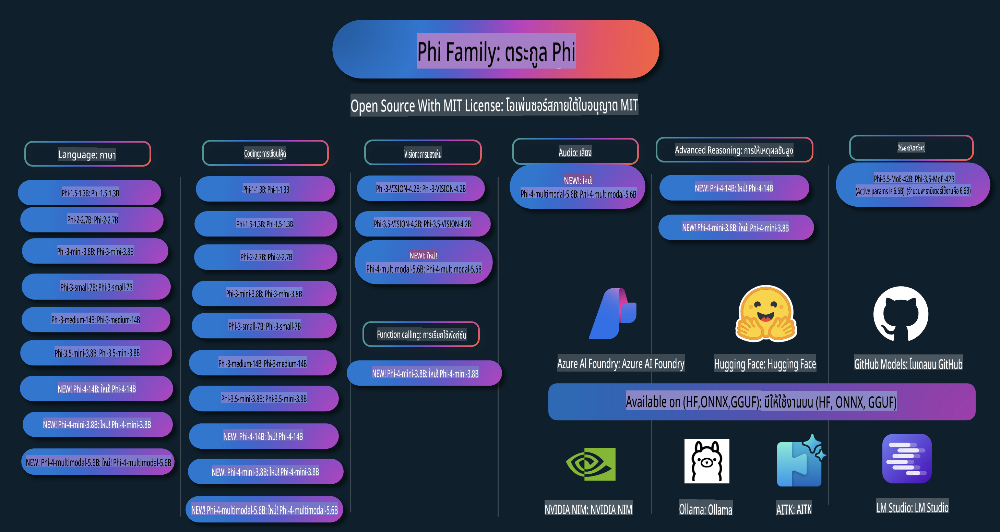

# คู่มือ Phi: ตัวอย่างปฏิบัติการกับโมเดล Phi ของ Microsoft

  

  
  
  

  
  

Phi คือชุดโมเดล AI แบบโอเพนซอร์สที่พัฒนาโดย Microsoft  

Phi เป็นโมเดลภาษาขนาดเล็ก (SLM) ที่ทรงพลังและคุ้มค่าที่สุดในปัจจุบัน โดยมีผลลัพธ์ที่ดีเยี่ยมในหลายภาษา การให้เหตุผล การสร้างข้อความ/แชท การเขียนโค้ด รูปภาพ เสียง และสถานการณ์อื่น ๆ  

คุณสามารถปรับใช้ Phi บนคลาวด์หรืออุปกรณ์ปลายทาง และสามารถสร้างแอปพลิเคชัน AI สร้างสรรค์ได้ง่าย ๆ ด้วยพลังการประมวลผลที่จำกัด  

ทำตามขั้นตอนเหล่านี้เพื่อเริ่มต้นใช้งานทรัพยากรเหล่านี้:  
1. **Fork Repository**: คลิก   
2. **Clone Repository**: `git clone https://github.com/microsoft/PhiCookBook.git`  
3. [**เข้าร่วมชุมชน Microsoft AI Discord เพื่อพบกับผู้เชี่ยวชาญและนักพัฒนาคนอื่น ๆ**](https://discord.com/invite/ByRwuEEgH4?WT.mc_id=aiml-137032-kinfeylo)

## สารบัญ  

- บทนำ  
  - [ยินดีต้อนรับสู่ครอบครัว Phi](./md/01.Introduction/01/01.PhiFamily.md)  
  - [การตั้งค่าสภาพแวดล้อมของคุณ](./md/01.Introduction/01/01.EnvironmentSetup.md)  
  - [ทำความเข้าใจเทคโนโลยีสำคัญ](./md/01.Introduction/01/01.Understandingtech.md)  
  - [ความปลอดภัยของ AI สำหรับโมเดล Phi](./md/01.Introduction/01/01.AISafety.md)  
  - [การสนับสนุนฮาร์ดแวร์ของ Phi](./md/01.Introduction/01/01.Hardwaresupport.md)  
  - [โมเดล Phi และความพร้อมใช้งานบนแพลตฟอร์มต่าง ๆ](./md/01.Introduction/01/01.Edgeandcloud.md)  
  - [การใช้ Guidance-ai และ Phi](./md/01.Introduction/01/01.Guidance.md)  
  - [โมเดลใน GitHub Marketplace](https://github.com/marketplace/models)  
  - [แคตตาล็อกโมเดล Azure AI](https://ai.azure.com)  

- การใช้งาน Phi ในสภาพแวดล้อมต่าง ๆ  
    -  [Hugging Face](./md/01.Introduction/02/01.HF.md)  
    -  [โมเดลใน GitHub](./md/01.Introduction/02/02.GitHubModel.md)  
    -  [แคตตาล็อกโมเดล Azure AI Foundry](./md/01.Introduction/02/03.AzureAIFoundry.md)  
    -  [Ollama](./md/01.Introduction/02/04.Ollama.md)  
    -  [AI Toolkit VSCode (AITK)](./md/01.Introduction/02/05.AITK.md)  
    -  [NVIDIA NIM](./md/01.Introduction/02/06.NVIDIA.md)  

- การใช้งานโมเดลในครอบครัว Phi  
    - [การใช้งาน Phi ใน iOS](./md/01.Introduction/03/iOS_Inference.md)  
    - [การใช้งาน Phi ใน Android](./md/01.Introduction/03/Android_Inference.md)  
- [Inference Phi ใน Jetson](./md/01.Introduction/03/Jetson_Inference.md)  
    - [Inference Phi ใน AI PC](./md/01.Introduction/03/AIPC_Inference.md)  
    - [Inference Phi ด้วย Apple MLX Framework](./md/01.Introduction/03/MLX_Inference.md)  
    - [Inference Phi ใน Local Server](./md/01.Introduction/03/Local_Server_Inference.md)  
    - [Inference Phi ใน Remote Server โดยใช้ AI Toolkit](./md/01.Introduction/03/Remote_Interence.md)  
    - [Inference Phi ด้วย Rust](./md/01.Introduction/03/Rust_Inference.md)  
    - [Inference Phi--Vision ใน Local](./md/01.Introduction/03/Vision_Inference.md)  
    - [Inference Phi ด้วย Kaito AKS, Azure Containers (รองรับอย่างเป็นทางการ)](./md/01.Introduction/03/Kaito_Inference.md)  

- [การ Quantifying Phi Family](./md/01.Introduction/04/QuantifyingPhi.md)  
    - [Quantizing Phi-3.5 / 4 ด้วย llama.cpp](./md/01.Introduction/04/UsingLlamacppQuantifyingPhi.md)  
    - [Quantizing Phi-3.5 / 4 ด้วย Generative AI extensions สำหรับ onnxruntime](./md/01.Introduction/04/UsingORTGenAIQuantifyingPhi.md)  
    - [Quantizing Phi-3.5 / 4 ด้วย Intel OpenVINO](./md/01.Introduction/04/UsingIntelOpenVINOQuantifyingPhi.md)  
    - [Quantizing Phi-3.5 / 4 ด้วย Apple MLX Framework](./md/01.Introduction/04/UsingAppleMLXQuantifyingPhi.md)  

- การประเมิน Phi  
    - [Responsible AI](./md/01.Introduction/05/ResponsibleAI.md)  
    - [Azure AI Foundry สำหรับการประเมิน](./md/01.Introduction/05/AIFoundry.md)  
    - [การใช้ Promptflow สำหรับการประเมิน](./md/01.Introduction/05/Promptflow.md)  

- RAG กับ Azure AI Search  
    - [วิธีใช้ Phi-4-mini และ Phi-4-multimodal (RAG) กับ Azure AI Search](https://github.com/microsoft/PhiCookBook/blob/main/code/06.E2E/E2E_Phi-4-RAG-Azure-AI-Search.ipynb)  

- ตัวอย่างการพัฒนาแอปพลิเคชัน Phi  
  - แอปพลิเคชันข้อความและแชท  
    - ตัวอย่าง Phi-4 🆕  
      - [📓] [แชทกับ Phi-4-mini ONNX Model](./md/02.Application/01.TextAndChat/Phi4/ChatWithPhi4ONNX/README.md)  
      - [แชทกับ Phi-4 Local ONNX Model บน .NET](../../md/04.HOL/dotnet/src/LabsPhi4-Chat-01OnnxRuntime)  
      - [แชท .NET Console App กับ Phi-4 ONNX โดยใช้ Semantic Kernel](../../md/04.HOL/dotnet/src/LabsPhi4-Chat-02SK)  
    - ตัวอย่าง Phi-3 / 3.5  
      - [Local Chatbot ในเบราว์เซอร์โดยใช้ Phi3, ONNX Runtime Web และ WebGPU](https://github.com/microsoft/onnxruntime-inference-examples/tree/main/js/chat)  
      - [OpenVino Chat](./md/02.Application/01.TextAndChat/Phi3/E2E_OpenVino_Chat.md)  
      - [Multi Model - โต้ตอบกับ Phi-3-mini และ OpenAI Whisper](./md/02.Application/01.TextAndChat/Phi3/E2E_Phi-3-mini_with_whisper.md)  
      - [MLFlow - การสร้าง wrapper และการใช้ Phi-3 กับ MLFlow](./md//02.Application/01.TextAndChat/Phi3/E2E_Phi-3-MLflow.md)  
      - [การปรับแต่งโมเดล - วิธีการปรับแต่ง Phi-3-min สำหรับ ONNX Runtime Web ด้วย Olive](https://github.com/microsoft/Olive/tree/main/examples/phi3)  
      - [WinUI3 App กับ Phi-3 mini-4k-instruct-onnx](https://github.com/microsoft/Phi3-Chat-WinUI3-Sample/)  
      - [ตัวอย่างแอปบันทึก AI ขับเคลื่อนด้วย WinUI3 Multi Model](https://github.com/microsoft/ai-powered-notes-winui3-sample)  
      - [Fine-tune และรวม Phi-3 models แบบกำหนดเองด้วย Prompt Flow](./md/02.Application/01.TextAndChat/Phi3/E2E_Phi-3-FineTuning_PromptFlow_Integration.md)  
      - [Fine-tune และรวม Phi-3 models แบบกำหนดเองด้วย Prompt Flow ใน Azure AI Foundry](./md/02.Application/01.TextAndChat/Phi3/E2E_Phi-3-FineTuning_PromptFlow_Integration_AIFoundry.md)  
      - [ประเมิน Phi-3 / Phi-3.5 Model ที่ปรับแต่งแล้วใน Azure AI Foundry โดยเน้นหลักการ Responsible AI ของ Microsoft](./md/02.Application/01.TextAndChat/Phi3/E2E_Phi-3-Evaluation_AIFoundry.md)  
- [📓] [ตัวอย่างการคาดการณ์ภาษา Phi-3.5-mini-instruct (ภาษาจีน/อังกฤษ)](../../md/02.Application/01.TextAndChat/Phi3/phi3-instruct-demo.ipynb)
      - [Phi-3.5-Instruct WebGPU RAG Chatbot](./md/02.Application/01.TextAndChat/Phi3/WebGPUWithPhi35Readme.md)
      - [การใช้ Windows GPU เพื่อสร้างโซลูชัน Prompt flow ด้วย Phi-3.5-Instruct ONNX](./md/02.Application/01.TextAndChat/Phi3/UsingPromptFlowWithONNX.md)
      - [การใช้ Microsoft Phi-3.5 tflite เพื่อสร้างแอป Android](./md/02.Application/01.TextAndChat/Phi3/UsingPhi35TFLiteCreateAndroidApp.md)
      - [ตัวอย่าง Q&A .NET โดยใช้โมเดล Phi-3 แบบ ONNX บนเครื่อง พร้อมกับ Microsoft.ML.OnnxRuntime](../../md/04.HOL/dotnet/src/LabsPhi301)
      - [แอปแชทคอนโซล .NET พร้อม Semantic Kernel และ Phi-3](../../md/04.HOL/dotnet/src/LabsPhi302)

  - ตัวอย่างโค้ด Azure AI Inference SDK 
    - ตัวอย่าง Phi-4 🆕
      - [📓] [สร้างโค้ดโปรเจกต์ด้วย Phi-4-multimodal](./md/02.Application/02.Code/Phi4/GenProjectCode/README.md)
    - ตัวอย่าง Phi-3 / 3.5
      - [สร้าง Visual Studio Code GitHub Copilot Chat ของคุณเองด้วย Microsoft Phi-3 Family](./md/02.Application/02.Code/Phi3/VSCodeExt/README.md)
      - [สร้าง Visual Studio Code Chat Copilot Agent ของคุณเองด้วย Phi-3.5 โดยใช้ GitHub Models](/md/02.Application/02.Code/Phi3/CreateVSCodeChatAgentWithGitHubModels.md)

  - ตัวอย่างการให้เหตุผลขั้นสูง
    - ตัวอย่าง Phi-4 🆕
      - [📓] [ตัวอย่างการให้เหตุผล Phi-4-mini](./md/02.Application/03.AdvancedReasoning/Phi4/AdvancedResoningPhi4mini/README.md)
  
  - เดโม
      - [เดโม Phi-4-mini ที่โฮสต์บน Hugging Face Spaces](https://huggingface.co/spaces/microsoft/phi-4-mini?WT.mc_id=aiml-137032-kinfeylo)
      - [เดโม Phi-4-multimodal ที่โฮสต์บน Hugging Face Spaces](https://huggingface.co/spaces/microsoft/phi-4-multimodal?WT.mc_id=aiml-137032-kinfeylo)
  - ตัวอย่าง Vision
    - ตัวอย่าง Phi-4 🆕
      - [📓] [ใช้ Phi-4-multimodal เพื่ออ่านภาพและสร้างโค้ด](./md/02.Application/04.Vision/Phi4/CreateFrontend/README.md) 
    - ตัวอย่าง Phi-3 / 3.5
      -  [📓][Phi-3-vision-Image text to text](../../md/02.Application/04.Vision/Phi3/E2E_Phi-3-vision-image-text-to-text-online-endpoint.ipynb)
      - [Phi-3-vision-ONNX](https://onnxruntime.ai/docs/genai/tutorials/phi3-v.html)
      - [📓][Phi-3-vision CLIP Embedding](../../md/02.Application/04.Vision/Phi3/E2E_Phi-3-vision-image-text-to-text-online-endpoint.ipynb)
      - [เดโม: Phi-3 Recycling](https://github.com/jennifermarsman/PhiRecycling/)
      - [Phi-3-vision - ผู้ช่วยด้านภาษาภาพ - ด้วย Phi3-Vision และ OpenVINO](https://docs.openvino.ai/nightly/notebooks/phi-3-vision-with-output.html)
      - [Phi-3 Vision Nvidia NIM](./md/02.Application/04.Vision/Phi3/E2E_Nvidia_NIM_Vision.md)
      - [Phi-3 Vision OpenVino](./md/02.Application/04.Vision/Phi3/E2E_OpenVino_Phi3Vision.md)
      - [📓][Phi-3.5 Vision ตัวอย่างหลายเฟรมหรือหลายภาพ](../../md/02.Application/04.Vision/Phi3/phi3-vision-demo.ipynb)
      - [Phi-3 Vision โมเดล ONNX บนเครื่องโดยใช้ Microsoft.ML.OnnxRuntime .NET](../../md/04.HOL/dotnet/src/LabsPhi303)
      - [เมนู Phi-3 Vision โมเดล ONNX บนเครื่องโดยใช้ Microsoft.ML.OnnxRuntime .NET](../../md/04.HOL/dotnet/src/LabsPhi304)

  - ตัวอย่างเสียง
    - ตัวอย่าง Phi-4 🆕
      - [📓] [การแยกถอดเสียงออกจากเสียงด้วย Phi-4-multimodal](./md/02.Application/05.Audio/Phi4/Transciption/README.md)
      - [📓] [ตัวอย่างเสียง Phi-4-multimodal](../../md/02.Application/05.Audio/Phi4/Siri/demo.ipynb)
      - [📓] [ตัวอย่างการแปลเสียง Phi-4-multimodal](../../md/02.Application/05.Audio/Phi4/Translate/demo.ipynb)
      - [แอปคอนโซล .NET โดยใช้ Phi-4-multimodal Audio เพื่อวิเคราะห์ไฟล์เสียงและสร้างถอดเสียง](../../md/04.HOL/dotnet/src/LabsPhi4-MultiModal-02Audio)

  - ตัวอย่าง MOE
    - ตัวอย่าง Phi-3 / 3.5
      - [📓] [Phi-3.5 Mixture of Experts Models (MoEs) ตัวอย่างสื่อสังคม](../../md/02.Application/06.MoE/Phi3/phi3_moe_demo.ipynb)
      - [📓] [สร้าง Retrieval-Augmented Generation (RAG) Pipeline ด้วย NVIDIA NIM Phi-3 MOE, Azure AI Search, และ LlamaIndex](../../md/02.Application/06.MoE/Phi3/azure-ai-search-nvidia-rag.ipynb)
  - ตัวอย่างการเรียกใช้ฟังก์ชัน
    - ตัวอย่าง Phi-4 🆕
      -  [📓] [การใช้ Function Calling กับ Phi-4-mini](./md/02.Application/07.FunctionCalling/Phi4/FunctionCallingBasic/README.md)
  - ตัวอย่างการผสมผสานแบบ Multimodal
    - ตัวอย่าง Phi-4 🆕
- [📓] [การใช้งาน Phi-4-multimodal สำหรับนักข่าวสายเทคโนโลยี](../../md/02.Application/08.Multimodel/Phi4/TechJournalist/phi_4_mm_audio_text_publish_news.ipynb)  
  - [.NET console application ที่ใช้ Phi-4-multimodal วิเคราะห์ภาพ](../../md/04.HOL/dotnet/src/LabsPhi4-MultiModal-01Images)

- การปรับแต่ง Phi Samples  
  - [สถานการณ์การปรับแต่ง](./md/03.FineTuning/FineTuning_Scenarios.md)  
  - [การปรับแต่งกับ RAG](./md/03.FineTuning/FineTuning_vs_RAG.md)  
  - [การปรับแต่งให้ Phi-3 กลายเป็นผู้เชี่ยวชาญในอุตสาหกรรม](./md/03.FineTuning/LetPhi3gotoIndustriy.md)  
  - [การปรับแต่ง Phi-3 ด้วย AI Toolkit สำหรับ VS Code](./md/03.FineTuning/Finetuning_VSCodeaitoolkit.md)  
  - [การปรับแต่ง Phi-3 ด้วย Azure Machine Learning Service](./md/03.FineTuning/Introduce_AzureML.md)  
  - [การปรับแต่ง Phi-3 ด้วย Lora](./md/03.FineTuning/FineTuning_Lora.md)  
  - [การปรับแต่ง Phi-3 ด้วย QLora](./md/03.FineTuning/FineTuning_Qlora.md)  
  - [การปรับแต่ง Phi-3 ด้วย Azure AI Foundry](./md/03.FineTuning/FineTuning_AIFoundry.md)  
  - [การปรับแต่ง Phi-3 ด้วย Azure ML CLI/SDK](./md/03.FineTuning/FineTuning_MLSDK.md)  
  - [การปรับแต่งด้วย Microsoft Olive](./md/03.FineTuning/FineTuning_MicrosoftOlive.md)  
  - [การปรับแต่งด้วย Microsoft Olive Hands-On Lab](./md/03.FineTuning/olive-lab/readme.md)  
  - [การปรับแต่ง Phi-3-vision ด้วย Weights and Bias](./md/03.FineTuning/FineTuning_Phi-3-visionWandB.md)  
  - [การปรับแต่ง Phi-3 ด้วย Apple MLX Framework](./md/03.FineTuning/FineTuning_MLX.md)  
  - [การปรับแต่ง Phi-3-vision (การสนับสนุนอย่างเป็นทางการ)](./md/03.FineTuning/FineTuning_Vision.md)  
  - [การปรับแต่ง Phi-3 ด้วย Kaito AKS และ Azure Containers (การสนับสนุนอย่างเป็นทางการ)](./md/03.FineTuning/FineTuning_Kaito.md)  
  - [การปรับแต่ง Phi-3 และ 3.5 Vision](https://github.com/2U1/Phi3-Vision-Finetune)  

- Hands on Lab  
  - [สำรวจโมเดลล้ำสมัย: LLMs, SLMs, การพัฒนาท้องถิ่น และอื่น ๆ](https://github.com/microsoft/aitour-exploring-cutting-edge-models)  
  - [การปลดล็อกศักยภาพ NLP: การปรับแต่งด้วย Microsoft Olive](https://github.com/azure/Ignite_FineTuning_workshop)  

- งานวิจัยและสิ่งพิมพ์ทางวิชาการ  
  - [Textbooks Are All You Need II: phi-1.5 technical report](https://arxiv.org/abs/2309.05463)  
  - [Phi-3 Technical Report: โมเดลภาษาอันทรงพลังที่ทำงานได้บนโทรศัพท์ของคุณ](https://arxiv.org/abs/2404.14219)  
  - [Phi-4 Technical Report](https://arxiv.org/abs/2412.08905)  
  - [การปรับแต่ง Small Language Models เพื่อการเรียกใช้ฟังก์ชันในรถยนต์](https://arxiv.org/abs/2501.02342)  
  - [(WhyPHI) การปรับแต่ง PHI-3 สำหรับการตอบคำถามแบบปรนัย: วิธีการ, ผลลัพธ์, และความท้าทาย](https://arxiv.org/abs/2501.01588)  

## การใช้งานโมเดล Phi  

### Phi บน Azure AI Foundry  

คุณสามารถเรียนรู้วิธีการใช้งาน Microsoft Phi และการสร้างโซลูชันแบบ E2E บนอุปกรณ์ฮาร์ดแวร์ต่าง ๆ ของคุณได้ หากต้องการสัมผัสประสบการณ์ Phi ด้วยตัวคุณเอง ให้เริ่มต้นทดลองใช้งานโมเดลและปรับแต่ง Phi สำหรับสถานการณ์ของคุณโดยใช้ [Azure AI Foundry Azure AI Model Catalog](https://aka.ms/phi3-azure-ai) สามารถเรียนรู้เพิ่มเติมได้ที่ Getting Started with [Azure AI Foundry](/md/02.QuickStart/AzureAIFoundry_QuickStart.md)  

**Playground**  
แต่ละโมเดลมีพื้นที่ Playground สำหรับทดลองใช้งาน [Azure AI Playground](https://aka.ms/try-phi3)  

### Phi บน GitHub Models  

คุณสามารถเรียนรู้วิธีการใช้งาน Microsoft Phi และการสร้างโซลูชันแบบ E2E บนอุปกรณ์ฮาร์ดแวร์ต่าง ๆ ของคุณได้ หากต้องการสัมผัสประสบการณ์ Phi ด้วยตัวคุณเอง ให้เริ่มต้นทดลองใช้งานโมเดลและปรับแต่ง Phi สำหรับสถานการณ์ของคุณโดยใช้ [GitHub Model Catalog](https://github.com/marketplace/models?WT.mc_id=aiml-137032-kinfeylo) สามารถเรียนรู้เพิ่มเติมได้ที่ Getting Started with [GitHub Model Catalog](/md/02.QuickStart/GitHubModel_QuickStart.md)  

**Playground**  
แต่ละโมเดลมี [พื้นที่ทดลองสำหรับทดสอบโมเดล](/md/02.QuickStart/GitHubModel_QuickStart.md) ที่เฉพาะเจาะจง

### Phi บน Hugging Face

คุณสามารถค้นหาโมเดลนี้ได้ที่ [Hugging Face](https://huggingface.co/microsoft)

**พื้นที่ทดลอง**
 [Hugging Chat playground](https://huggingface.co/chat/models/microsoft/Phi-3-mini-4k-instruct)

## AI อย่างรับผิดชอบ

Microsoft มุ่งมั่นที่จะช่วยลูกค้าใช้งานผลิตภัณฑ์ AI ของเราอย่างมีความรับผิดชอบ พร้อมทั้งแบ่งปันประสบการณ์และสร้างความเชื่อมั่นผ่านเครื่องมือต่างๆ เช่น Transparency Notes และ Impact Assessments ทรัพยากรเหล่านี้สามารถพบได้ที่ [https://aka.ms/RAI](https://aka.ms/RAI)  
แนวทางของ Microsoft ในการสร้าง AI อย่างรับผิดชอบมีพื้นฐานมาจากหลักการ AI ของเรา ได้แก่ ความเป็นธรรม ความน่าเชื่อถือและความปลอดภัย ความเป็นส่วนตัวและความมั่นคง การมีส่วนร่วม ความโปร่งใส และความรับผิดชอบ

โมเดลขนาดใหญ่ที่เกี่ยวข้องกับภาษาธรรมชาติ ภาพ และเสียง เช่นตัวอย่างที่ใช้งานในนี้ อาจมีพฤติกรรมที่ไม่เป็นธรรม ไม่น่าเชื่อถือ หรือก่อให้เกิดความไม่เหมาะสม ซึ่งอาจนำไปสู่ผลกระทบที่ไม่พึงประสงค์ได้ กรุณาศึกษา [Azure OpenAI service Transparency note](https://learn.microsoft.com/legal/cognitive-services/openai/transparency-note?tabs=text) เพื่อรับทราบถึงความเสี่ยงและข้อจำกัด

แนวทางที่แนะนำในการลดความเสี่ยงเหล่านี้คือการรวมระบบความปลอดภัยไว้ในสถาปัตยกรรมของคุณ เพื่อช่วยตรวจจับและป้องกันพฤติกรรมที่เป็นอันตราย [Azure AI Content Safety](https://learn.microsoft.com/azure/ai-services/content-safety/overview) ให้บริการชั้นความปลอดภัยเพิ่มเติมที่สามารถตรวจจับเนื้อหาที่เป็นอันตรายที่สร้างขึ้นโดยผู้ใช้หรือ AI ในแอปพลิเคชันและบริการต่างๆ Azure AI Content Safety มี API สำหรับข้อความและภาพที่ช่วยตรวจจับเนื้อหาที่เป็นอันตราย ภายใน Azure AI Foundry บริการ Content Safety ช่วยให้คุณสามารถดู สำรวจ และทดลองใช้โค้ดตัวอย่างสำหรับการตรวจจับเนื้อหาที่เป็นอันตรายในรูปแบบต่างๆ [เอกสารเริ่มต้นอย่างรวดเร็ว](https://learn.microsoft.com/azure/ai-services/content-safety/quickstart-text?tabs=visual-studio%2Clinux&pivots=programming-language-rest) จะนำคุณผ่านขั้นตอนการส่งคำขอไปยังบริการนี้

อีกประเด็นที่ควรพิจารณาคือประสิทธิภาพโดยรวมของแอปพลิเคชัน ด้วยแอปพลิเคชันที่ใช้โมเดลหลายรูปแบบและหลายโมเดล เรานิยามประสิทธิภาพว่าเป็นความสามารถของระบบที่จะทำงานตามที่คุณและผู้ใช้คาดหวัง รวมถึงการไม่สร้างผลลัพธ์ที่เป็นอันตราย สิ่งสำคัญคือต้องประเมินประสิทธิภาพของแอปพลิเคชันโดยรวมของคุณโดยใช้ [ตัวประเมินประสิทธิภาพและคุณภาพ และตัวประเมินความเสี่ยงและความปลอดภัย](https://learn.microsoft.com/azure/ai-studio/concepts/evaluation-metrics-built-in) นอกจากนี้ คุณยังสามารถสร้างและประเมินด้วย [ตัวประเมินแบบกำหนดเอง](https://learn.microsoft.com/azure/ai-studio/how-to/develop/evaluate-sdk#custom-evaluators)

คุณสามารถประเมินแอปพลิเคชัน AI ของคุณในสภาพแวดล้อมการพัฒนาได้โดยใช้ [Azure AI Evaluation SDK](https://microsoft.github.io/promptflow/index.html) โดยใช้ชุดข้อมูลทดสอบหรือเป้าหมายที่กำหนด แอปพลิเคชัน AI เชิงสร้างสรรค์ของคุณจะถูกวัดผลเชิงปริมาณด้วยตัวประเมินที่มีอยู่ในระบบหรือแบบกำหนดเองตามที่คุณเลือก เพื่อเริ่มต้นใช้งาน Azure AI Evaluation SDK ในการประเมินระบบของคุณ คุณสามารถทำตาม [คู่มือเริ่มต้นอย่างรวดเร็ว](https://learn.microsoft.com/azure/ai-studio/how-to/develop/flow-evaluate-sdk) หลังจากที่คุณดำเนินการประเมินเสร็จสิ้น คุณสามารถ [ดูผลลัพธ์ใน Azure AI Foundry](https://learn.microsoft.com/azure/ai-studio/how-to/evaluate-flow-results)

## เครื่องหมายการค้า

โครงการนี้อาจมีเครื่องหมายการค้าหรือโลโก้สำหรับโครงการ ผลิตภัณฑ์ หรือบริการ การใช้งานเครื่องหมายการค้าหรือโลโก้ของ Microsoft อย่างถูกต้องต้องเป็นไปตาม [แนวทางการใช้เครื่องหมายการค้าและแบรนด์ของ Microsoft](https://www.microsoft.com/legal/intellectualproperty/trademarks/usage/general)  
การใช้เครื่องหมายการค้าหรือโลโก้ของ Microsoft ในเวอร์ชันที่แก้ไขของโครงการนี้ต้องไม่ก่อให้เกิดความสับสนหรือบ่งบอกถึงการสนับสนุนจาก Microsoft การใช้เครื่องหมายการค้าหรือโลโก้ของบุคคลที่สามใดๆ จะต้องเป็นไปตามนโยบายของบุคคลที่สามนั้นๆ

**ข้อจำกัดความรับผิดชอบ**:  
เอกสารฉบับนี้ได้รับการแปลโดยใช้บริการแปลภาษาด้วย AI อัตโนมัติ แม้ว่าเราจะพยายามอย่างเต็มที่เพื่อให้การแปลมีความถูกต้อง แต่โปรดทราบว่าการแปลอัตโนมัติอาจมีข้อผิดพลาดหรือความไม่แม่นยำ เอกสารต้นฉบับในภาษาต้นทางควรถือเป็นแหล่งข้อมูลที่เชื่อถือได้ สำหรับข้อมูลที่มีความสำคัญ แนะนำให้ใช้บริการแปลภาษาจากผู้เชี่ยวชาญที่เป็นมนุษย์ เราจะไม่รับผิดชอบต่อความเข้าใจผิดหรือการตีความที่คลาดเคลื่อนซึ่งเกิดจากการใช้การแปลนี้