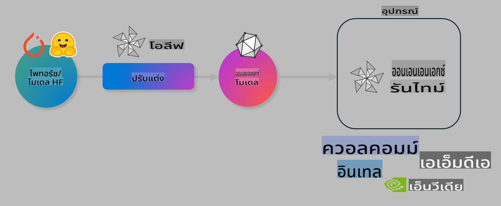

# Lab. ปรับแต่ง AI Models สำหรับการประมวลผลบนอุปกรณ์

## บทนำ

> [!IMPORTANT]
> Lab นี้ต้องการ **Nvidia A10 หรือ A100 GPU** พร้อมไดรเวอร์และ CUDA toolkit (เวอร์ชัน 12+) ที่ติดตั้งไว้

> [!NOTE]
> นี่คือ Lab ความยาว **35 นาที** ที่จะช่วยให้คุณได้เรียนรู้แนวคิดพื้นฐานของการปรับแต่งโมเดลสำหรับการประมวลผลบนอุปกรณ์โดยใช้ OLIVE

## วัตถุประสงค์การเรียนรู้

เมื่อจบ Lab นี้ คุณจะสามารถใช้ OLIVE เพื่อ:

- ปรับขนาดโมเดล AI ด้วยวิธีการ Quantization แบบ AWQ
- ปรับแต่งโมเดล AI ให้เหมาะสมกับงานเฉพาะ
- สร้าง LoRA adapters (โมเดลที่ปรับแต่งแล้ว) สำหรับการประมวลผลบนอุปกรณ์อย่างมีประสิทธิภาพบน ONNX Runtime

### Olive คืออะไร

Olive (*O*NNX *live*) เป็นเครื่องมือสำหรับการปรับแต่งโมเดล พร้อม CLI ที่ช่วยให้คุณสามารถนำโมเดลไปใช้งานกับ ONNX runtime +++https://onnxruntime.ai+++ โดยมีคุณภาพและประสิทธิภาพสูง



อินพุตของ Olive มักจะเป็นโมเดลจาก PyTorch หรือ Hugging Face และเอาต์พุตจะเป็นโมเดล ONNX ที่ปรับแต่งแล้วซึ่งสามารถทำงานบนอุปกรณ์ (เป้าหมายการใช้งาน) ที่รองรับ ONNX runtime Olive จะปรับแต่งโมเดลให้เหมาะสมกับ AI accelerator (NPU, GPU, CPU) ที่อุปกรณ์เป้าหมายใช้ ซึ่งผลิตโดยผู้ผลิตฮาร์ดแวร์ เช่น Qualcomm, AMD, Nvidia หรือ Intel

Olive ทำงานผ่าน *workflow* ซึ่งเป็นลำดับของงานปรับแต่งโมเดลที่เรียกว่า *passes* - ตัวอย่างของ passes ได้แก่ การบีบอัดโมเดล การจับกราฟ การทำ Quantization และการปรับแต่งกราฟ แต่ละ pass จะมีพารามิเตอร์ที่สามารถปรับแต่งได้เพื่อให้ได้ค่าที่ดีที่สุด เช่น ความแม่นยำและความหน่วงต่ำ โดย Olive ใช้กลยุทธ์การค้นหาเพื่อปรับแต่ง pass ทีละตัวหรือหลายตัวพร้อมกันโดยอัตโนมัติ

#### ข้อดีของ Olive

- **ลดความยุ่งยากและเวลา** ในการทดลองด้วยตนเองกับเทคนิคต่างๆ เช่น การปรับแต่งกราฟ การบีบอัด และการทำ Quantization เพียงกำหนดข้อจำกัดด้านคุณภาพและประสิทธิภาพ แล้ว Olive จะค้นหาโมเดลที่ดีที่สุดให้คุณโดยอัตโนมัติ
- **ส่วนประกอบปรับแต่งโมเดลในตัวกว่า 40+ ชิ้น** ครอบคลุมเทคนิคใหม่ๆ ในการทำ Quantization, การบีบอัด, การปรับแต่งกราฟ และการปรับแต่งโมเดล
- **CLI ใช้งานง่าย** สำหรับงานปรับแต่งโมเดลทั่วไป เช่น olive quantize, olive auto-opt, olive finetune
- มีการบรรจุและการปรับใช้โมเดลในตัว
- รองรับการสร้างโมเดลสำหรับ **Multi LoRA serving**
- สร้าง workflows ด้วย YAML/JSON เพื่อจัดการงานปรับแต่งและปรับใช้โมเดล
- การผสานรวมกับ **Hugging Face** และ **Azure AI**
- มีระบบ **caching** ในตัวเพื่อ **ลดต้นทุน**

## คำแนะนำใน Lab
> [!NOTE]
> โปรดตรวจสอบว่าคุณได้จัดเตรียม Azure AI Hub และ Project รวมถึงตั้งค่าการใช้งาน A100 compute ตาม Lab 1 แล้ว

### ขั้นตอนที่ 0: เชื่อมต่อกับ Azure AI Compute

คุณจะเชื่อมต่อกับ Azure AI Compute โดยใช้ฟีเจอร์ remote ใน **VS Code**

1. เปิดแอปพลิเคชัน **VS Code** บนเดสก์ท็อปของคุณ:
1. เปิด **command palette** โดยกด **Shift+Ctrl+P**
1. ใน command palette ค้นหา **AzureML - remote: Connect to compute instance in New Window**
1. ทำตามคำแนะนำบนหน้าจอเพื่อเชื่อมต่อกับ Compute ซึ่งจะรวมถึงการเลือก Azure Subscription, Resource Group, Project และ Compute name ที่คุณตั้งค่าไว้ใน Lab 1
1. เมื่อเชื่อมต่อกับ Azure ML Compute node แล้ว จะมีการแสดงผลใน **มุมล่างซ้ายของ Visual Code** `><Azure ML: Compute Name`

### ขั้นตอนที่ 1: Clone repo นี้

ใน VS Code คุณสามารถเปิด terminal ใหม่ได้ด้วย **Ctrl+J** และ clone repo นี้:

ใน terminal คุณควรเห็น prompt

```
azureuser@computername:~/cloudfiles/code$ 
```
Clone โค้ดดังนี้ 

```bash
cd ~/localfiles
git clone https://github.com/microsoft/phi-3cookbook.git
```

### ขั้นตอนที่ 2: เปิดโฟลเดอร์ใน VS Code

เพื่อเปิด VS Code ในโฟลเดอร์ที่เกี่ยวข้อง ให้รันคำสั่งต่อไปนี้ใน terminal ซึ่งจะเปิดหน้าต่างใหม่:

```bash
code phi-3cookbook/code/04.Finetuning/Olive-lab
```

หรือคุณสามารถเปิดโฟลเดอร์โดยเลือก **File** > **Open Folder**

### ขั้นตอนที่ 3: ติดตั้ง Dependencies

เปิดหน้าต่าง terminal ใน VS Code บน Azure AI Compute Instance (เคล็ดลับ: **Ctrl+J**) และรันคำสั่งต่อไปนี้เพื่อติดตั้ง dependencies:

```bash
conda create -n olive-ai python=3.11 -y
conda activate olive-ai
pip install -r requirements.txt
az extension remove -n azure-cli-ml
az extension add -n ml
```

> [!NOTE]
> การติดตั้ง dependencies ทั้งหมดจะใช้เวลาประมาณ ~5 นาที

ใน Lab นี้ คุณจะดาวน์โหลดและอัปโหลดโมเดลไปยัง Azure AI Model catalog เพื่อให้สามารถเข้าถึง model catalog ได้ คุณจะต้องล็อกอินเข้าสู่ Azure โดยใช้คำสั่ง:

```bash
az login
```

> [!NOTE]
> ในขั้นตอนล็อกอิน คุณจะถูกถามให้เลือก subscription โปรดตรวจสอบว่าคุณตั้งค่า subscription ให้ตรงกับที่ใช้ใน Lab นี้

### ขั้นตอนที่ 4: รันคำสั่ง Olive

เปิดหน้าต่าง terminal ใน VS Code บน Azure AI Compute Instance (เคล็ดลับ: **Ctrl+J**) และตรวจสอบว่าได้เปิดใช้งาน `olive-ai` conda environment:

```bash
conda activate olive-ai
```

จากนั้น รันคำสั่ง Olive ต่อไปนี้ใน command line

1. **ตรวจสอบข้อมูล:** ในตัวอย่างนี้ คุณจะปรับแต่ง Phi-3.5-Mini model ให้สามารถตอบคำถามที่เกี่ยวข้องกับการเดินทางได้ โค้ดด้านล่างจะแสดงข้อมูลบางส่วนของ dataset ซึ่งอยู่ในรูปแบบ JSON lines:

    ```bash
    head data/data_sample_travel.jsonl
    ```
1. **Quantize โมเดล:** ก่อนการฝึกโมเดล คุณจะทำการ quantize ด้วยคำสั่งด้านล่างซึ่งใช้เทคนิคที่เรียกว่า Active Aware Quantization (AWQ) +++https://arxiv.org/abs/2306.00978+++ AWQ จะทำการ quantize ค่าน้ำหนักของโมเดลโดยพิจารณาจาก activation ที่เกิดขึ้นระหว่างการประมวลผล ซึ่งช่วยรักษาความแม่นยำของโมเดลได้ดีกว่าวิธีการ quantization แบบเดิม

    ```bash
    olive quantize \
       --model_name_or_path microsoft/Phi-3.5-mini-instruct \
       --trust_remote_code \
       --algorithm awq \
       --output_path models/phi/awq \
       --log_level 1
    ```
    
    การทำ AWQ quantization ใช้เวลาประมาณ **~8 นาที** และจะ **ลดขนาดโมเดลจาก ~7.5GB เหลือ ~2.5GB**

   ใน Lab นี้ เราจะแสดงวิธีนำโมเดลจาก Hugging Face มาใช้ (ตัวอย่าง: `microsoft/Phi-3.5-mini-instruct`). However, Olive also allows you to input models from the Azure AI catalog by updating the `model_name_or_path` argument to an Azure AI asset ID (for example:  `azureml://registries/azureml/models/Phi-3.5-mini-instruct/versions/4`). 

1. **Train the model:** Next, the `olive finetune` คำสั่งนี้จะปรับแต่งโมเดลที่ผ่านการ quantize แล้ว การทำ quantization *ก่อน* การปรับแต่งโมเดลจะช่วยให้ได้ความแม่นยำที่ดีกว่า เพราะกระบวนการปรับแต่งจะช่วยกู้คืนความสูญเสียจากการ quantization

    ```bash
    olive finetune \
        --method lora \
        --model_name_or_path models/phi/awq \
        --data_files "data/data_sample_travel.jsonl" \
        --data_name "json" \
        --text_template "<|user|>\n{prompt}<|end|>\n<|assistant|>\n{response}<|end|>" \
        --max_steps 100 \
        --output_path ./models/phi/ft \
        --log_level 1
    ```
    
    การปรับแต่งใช้เวลาประมาณ **~6 นาที** (100 steps)

1. **ปรับแต่งเพิ่มเติม:** เมื่อโมเดลได้รับการฝึกแล้ว คุณสามารถปรับแต่งโมเดลเพิ่มเติมโดยใช้คำสั่ง `auto-opt` command, which will capture the ONNX graph and automatically perform a number of optimizations to improve the model performance for CPU by compressing the model and doing fusions. It should be noted, that you can also optimize for other devices such as NPU or GPU by just updating the `--device` and `--provider` ของ Olive - แต่ใน Lab นี้เราจะใช้ CPU

    ```bash
    olive auto-opt \
       --model_name_or_path models/phi/ft/model \
       --adapter_path models/phi/ft/adapter \
       --device cpu \
       --provider CPUExecutionProvider \
       --use_ort_genai \
       --output_path models/phi/onnx-ao \
       --log_level 1
    ```
    
    การปรับแต่งใช้เวลาประมาณ **~5 นาที**

### ขั้นตอนที่ 5: ทดสอบการใช้งานโมเดลอย่างรวดเร็ว

เพื่อทดสอบการใช้งานโมเดล ให้สร้างไฟล์ Python ในโฟลเดอร์ของคุณชื่อ **app.py** และคัดลอกโค้ดด้านล่างนี้:

```python
import onnxruntime_genai as og
import numpy as np

print("loading model and adapters...", end="", flush=True)
model = og.Model("models/phi/onnx-ao/model")
adapters = og.Adapters(model)
adapters.load("models/phi/onnx-ao/model/adapter_weights.onnx_adapter", "travel")
print("DONE!")

tokenizer = og.Tokenizer(model)
tokenizer_stream = tokenizer.create_stream()

params = og.GeneratorParams(model)
params.set_search_options(max_length=100, past_present_share_buffer=False)
user_input = "what is the best thing to see in chicago"
params.input_ids = tokenizer.encode(f"<|user|>\n{user_input}<|end|>\n<|assistant|>\n")

generator = og.Generator(model, params)

generator.set_active_adapter(adapters, "travel")

print(f"{user_input}")

while not generator.is_done():
    generator.compute_logits()
    generator.generate_next_token()

    new_token = generator.get_next_tokens()[0]
    print(tokenizer_stream.decode(new_token), end='', flush=True)

print("\n")
```

รันโค้ดโดยใช้คำสั่ง:

```bash
python app.py
```

### ขั้นตอนที่ 6: อัปโหลดโมเดลไปยัง Azure AI

การอัปโหลดโมเดลไปยัง Azure AI model repository ช่วยให้โมเดลสามารถแชร์กับสมาชิกในทีมพัฒนาและจัดการเวอร์ชันของโมเดลได้ เพื่ออัปโหลดโมเดลให้รันคำสั่งต่อไปนี้:

> [!NOTE]
> อัปเดต `{}` placeholders with the name of your resource group and Azure AI Project Name. 

To find your resource group `"resourceGroup"` และชื่อ Azure AI Project จากนั้นรันคำสั่งด้านล่าง 

```
az ml workspace show
```

หรือโดยการไปที่ +++ai.azure.com+++ และเลือก **management center** **project** **overview**

อัปเดต `{}` placeholders ด้วยชื่อ resource group และ Azure AI Project Name ของคุณ

```bash
az ml model create \
    --name ft-for-travel \
    --version 1 \
    --path ./models/phi/onnx-ao \
    --resource-group {RESOURCE_GROUP_NAME} \
    --workspace-name {PROJECT_NAME}
```
จากนั้นคุณจะสามารถดูโมเดลที่อัปโหลดและปรับใช้โมเดลได้ที่ https://ml.azure.com/model/list

**ข้อจำกัดความรับผิดชอบ**:  
เอกสารนี้ได้รับการแปลโดยใช้บริการแปลภาษาอัตโนมัติที่ขับเคลื่อนด้วย AI แม้ว่าเราจะพยายามอย่างเต็มที่เพื่อความถูกต้อง แต่โปรดทราบว่าการแปลอัตโนมัติอาจมีข้อผิดพลาดหรือความไม่แม่นยำ เอกสารต้นฉบับในภาษาต้นฉบับควรถูกพิจารณาเป็นแหล่งข้อมูลที่เชื่อถือได้ สำหรับข้อมูลที่สำคัญ แนะนำให้ใช้บริการแปลภาษาจากผู้เชี่ยวชาญ เราจะไม่รับผิดชอบต่อความเข้าใจผิดหรือการตีความที่ผิดพลาดที่เกิดจากการใช้การแปลนี้