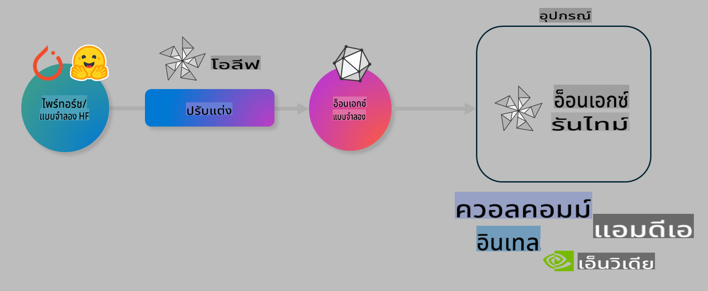

# ห้องปฏิบัติการ: เพิ่มประสิทธิภาพ AI Models สำหรับการใช้งานบนอุปกรณ์

## บทนำ

> [!IMPORTANT]
> ห้องปฏิบัติการนี้ต้องการ **Nvidia A10 หรือ A100 GPU** พร้อมไดรเวอร์และ CUDA toolkit (เวอร์ชัน 12+) ที่ติดตั้งไว้แล้ว

> [!NOTE]
> ห้องปฏิบัติการนี้ใช้เวลา **35 นาที** และจะให้คุณได้สัมผัสกับแนวคิดหลักของการเพิ่มประสิทธิภาพโมเดลสำหรับการใช้งานบนอุปกรณ์ด้วย OLIVE

## วัตถุประสงค์การเรียนรู้

เมื่อจบห้องปฏิบัติการนี้ คุณจะสามารถใช้ OLIVE เพื่อ:

- ทำการ Quantize โมเดล AI ด้วยวิธี AWQ quantization
- ปรับแต่งโมเดล AI สำหรับงานเฉพาะทาง
- สร้าง LoRA adapters (โมเดลที่ปรับแต่งแล้ว) สำหรับการใช้งานบนอุปกรณ์อย่างมีประสิทธิภาพด้วย ONNX Runtime

### Olive คืออะไร

Olive (*O*NNX *live*) เป็นเครื่องมือเพิ่มประสิทธิภาพโมเดลที่มาพร้อม CLI ซึ่งช่วยให้คุณสามารถส่งมอบโมเดลสำหรับ ONNX runtime +++https://onnxruntime.ai+++ ด้วยคุณภาพและประสิทธิภาพ



อินพุตของ Olive มักจะเป็นโมเดล PyTorch หรือ Hugging Face และเอาต์พุตคือโมเดล ONNX ที่เพิ่มประสิทธิภาพแล้วซึ่งสามารถใช้งานบนอุปกรณ์ (เป้าหมายการปรับใช้งาน) ที่รัน ONNX runtime Olive จะเพิ่มประสิทธิภาพโมเดลสำหรับ AI accelerator (NPU, GPU, CPU) ของเป้าหมายการปรับใช้งานที่จัดทำโดยผู้ผลิตฮาร์ดแวร์ เช่น Qualcomm, AMD, Nvidia หรือ Intel

Olive ทำงานผ่าน *workflow* ซึ่งเป็นลำดับการทำงานของงานเพิ่มประสิทธิภาพโมเดลแต่ละงานที่เรียกว่า *passes* ตัวอย่างของ passes ได้แก่: การบีบอัดโมเดล, การจับกราฟ, การ quantization, การเพิ่มประสิทธิภาพกราฟ แต่ละ pass มีชุดพารามิเตอร์ที่สามารถปรับแต่งเพื่อให้ได้เมตริกที่ดีที่สุด เช่น ความแม่นยำและเวลา Olive ใช้กลยุทธ์การค้นหาโดยใช้อัลกอริทึมการค้นหาเพื่อปรับแต่งแต่ละ pass หรือกลุ่มของ passes โดยอัตโนมัติ

#### ประโยชน์ของ Olive

- **ลดความยุ่งยากและเวลา** จากการทดลองด้วยตนเองซ้ำๆ กับเทคนิคต่างๆ เช่น การเพิ่มประสิทธิภาพกราฟ, การบีบอัด และการ quantization กำหนดข้อจำกัดด้านคุณภาพและประสิทธิภาพของคุณ แล้วให้ Olive หาวิธีที่ดีที่สุดให้คุณโดยอัตโนมัติ
- **มีส่วนประกอบการเพิ่มประสิทธิภาพโมเดลมากกว่า 40+** ครอบคลุมเทคนิคที่ล้ำสมัยในด้านการ quantization, การบีบอัด, การเพิ่มประสิทธิภาพกราฟ และการปรับแต่ง
- **CLI ที่ใช้งานง่าย** สำหรับงานเพิ่มประสิทธิภาพโมเดลทั่วไป เช่น olive quantize, olive auto-opt, olive finetune
- มีการบรรจุและปรับใช้โมเดลในตัว
- รองรับการสร้างโมเดลสำหรับ **Multi LoRA serving**
- สร้าง workflows ด้วย YAML/JSON เพื่อจัดการงานเพิ่มประสิทธิภาพโมเดลและการปรับใช้
- การผสานรวมกับ **Hugging Face** และ **Azure AI**
- กลไก **caching** ในตัวเพื่อ **ประหยัดต้นทุน**

## คำแนะนำในการทำห้องปฏิบัติการ
> [!NOTE]
> โปรดตรวจสอบให้แน่ใจว่าคุณได้ตั้งค่า Azure AI Hub และโปรเจกต์ของคุณ รวมถึงตั้งค่าการใช้งาน A100 compute ตามที่ระบุในห้องปฏิบัติการที่ 1

### ขั้นตอนที่ 0: เชื่อมต่อกับ Azure AI Compute

คุณจะเชื่อมต่อกับ Azure AI Compute โดยใช้ฟีเจอร์รีโมตใน **VS Code**

1. เปิดแอปพลิเคชัน **VS Code** บนเดสก์ท็อปของคุณ:
2. เปิด **command palette** โดยใช้ **Shift+Ctrl+P**
3. ใน command palette ค้นหา **AzureML - remote: Connect to compute instance in New Window**
4. ทำตามคำแนะนำบนหน้าจอเพื่อเชื่อมต่อกับ Compute โดยจะเกี่ยวข้องกับการเลือก Subscription, Resource Group, Project และ Compute name ที่คุณตั้งค่าไว้ในห้องปฏิบัติการที่ 1
5. เมื่อเชื่อมต่อกับ Azure ML Compute node แล้ว จะปรากฏที่มุมล่างซ้ายของ **Visual Code** `><Azure ML: Compute Name`

### ขั้นตอนที่ 1: Clone repo นี้

ใน VS Code คุณสามารถเปิด terminal ใหม่ได้ด้วย **Ctrl+J** และ clone repo นี้:

ใน terminal คุณควรเห็น prompt

```
azureuser@computername:~/cloudfiles/code$ 
```
Clone solution

```bash
cd ~/localfiles
git clone https://github.com/microsoft/phi-3cookbook.git
```

### ขั้นตอนที่ 2: เปิดโฟลเดอร์ใน VS Code

เพื่อเปิด VS Code ในโฟลเดอร์ที่เกี่ยวข้อง ให้รันคำสั่งต่อไปนี้ใน terminal ซึ่งจะเปิดหน้าต่างใหม่:

```bash
code phi-3cookbook/code/04.Finetuning/Olive-lab
```

หรือคุณสามารถเปิดโฟลเดอร์โดยเลือก **File** > **Open Folder**

### ขั้นตอนที่ 3: ติดตั้ง Dependencies

เปิดหน้าต่าง terminal ใน VS Code บน Azure AI Compute Instance (เคล็ดลับ: **Ctrl+J**) และรันคำสั่งต่อไปนี้เพื่อติดตั้ง dependencies:

```bash
conda create -n olive-ai python=3.11 -y
conda activate olive-ai
pip install -r requirements.txt
az extension remove -n azure-cli-ml
az extension add -n ml
```

> [!NOTE]
> จะใช้เวลาประมาณ ~5 นาทีในการติดตั้ง dependencies ทั้งหมด

ในห้องปฏิบัติการนี้ คุณจะดาวน์โหลดและอัปโหลดโมเดลไปยัง Azure AI Model catalog เพื่อให้สามารถเข้าถึง catalog ได้ คุณจะต้องล็อกอินเข้าสู่ Azure โดยใช้:

```bash
az login
```

> [!NOTE]
> ระหว่างล็อกอิน คุณจะถูกขอให้เลือก Subscription ตรวจสอบให้แน่ใจว่าคุณได้ตั้งค่า Subscription เป็น Subscription ที่จัดเตรียมไว้สำหรับห้องปฏิบัติการนี้

### ขั้นตอนที่ 4: รันคำสั่ง Olive

เปิดหน้าต่าง terminal ใน VS Code บน Azure AI Compute Instance (เคล็ดลับ: **Ctrl+J**) และตรวจสอบว่าได้เปิดใช้งาน `olive-ai` conda environment:

```bash
conda activate olive-ai
```

จากนั้น รันคำสั่ง Olive ต่อไปนี้ใน command line

1. **ตรวจสอบข้อมูล:** ในตัวอย่างนี้ คุณจะปรับแต่ง Phi-3.5-Mini model เพื่อให้เชี่ยวชาญในการตอบคำถามที่เกี่ยวกับการเดินทาง โค้ดด้านล่างจะแสดงรายการแรกๆ ของชุดข้อมูลที่อยู่ในรูปแบบ JSON lines:

    ```bash
    head data/data_sample_travel.jsonl
    ```
    
2. **Quantize โมเดล:** ก่อนการฝึกโมเดล คุณจะ quantize ด้วยคำสั่งต่อไปนี้ที่ใช้เทคนิคที่เรียกว่า Active Aware Quantization (AWQ) +++https://arxiv.org/abs/2306.00978+++ AWQ จะ quantize weights ของโมเดลโดยพิจารณาจาก activations ที่สร้างขึ้นระหว่าง inference ซึ่งหมายความว่ากระบวนการ quantization จะคำนึงถึงการกระจายข้อมูลจริงใน activations ทำให้สามารถรักษาความแม่นยำของโมเดลได้ดีกว่าเมื่อเทียบกับวิธีการ quantization weights แบบดั้งเดิม

    ```bash
    olive quantize \
       --model_name_or_path microsoft/Phi-3.5-mini-instruct \
       --trust_remote_code \
       --algorithm awq \
       --output_path models/phi/awq \
       --log_level 1
    ```
    
    จะใช้เวลาประมาณ **~8 นาที** เพื่อทำ AWQ quantization ซึ่งจะ **ลดขนาดโมเดลจาก ~7.5GB เหลือ ~2.5GB**
   
    ในห้องปฏิบัติการนี้ เราจะแสดงวิธีป้อนโมเดลจาก Hugging Face (ตัวอย่าง: `microsoft/Phi-3.5-mini-instruct`). However, Olive also allows you to input models from the Azure AI catalog by updating the `model_name_or_path` argument to an Azure AI asset ID (for example:  `azureml://registries/azureml/models/Phi-3.5-mini-instruct/versions/4`). 

1. **Train the model:** Next, the `olive finetune` คำสั่งนี้จะปรับแต่งโมเดลที่ quantized แล้ว การ quantize โมเดล *ก่อน* การปรับแต่งแทนที่จะทำหลังจากนั้นจะให้ความแม่นยำที่ดีกว่า เนื่องจากกระบวนการปรับแต่งจะช่วยกู้คืนบางส่วนของความสูญเสียจากการ quantization

    ```bash
    olive finetune \
        --method lora \
        --model_name_or_path models/phi/awq \
        --data_files "data/data_sample_travel.jsonl" \
        --data_name "json" \
        --text_template "<|user|>\n{prompt}<|end|>\n<|assistant|>\n{response}<|end|>" \
        --max_steps 100 \
        --output_path ./models/phi/ft \
        --log_level 1
    ```
    
    จะใช้เวลาประมาณ **~6 นาที** ในการปรับแต่ง (100 steps)

3. **เพิ่มประสิทธิภาพ:** เมื่อโมเดลได้รับการฝึกแล้ว คุณจะเพิ่มประสิทธิภาพโมเดลโดยใช้คำสั่ง `auto-opt` command, which will capture the ONNX graph and automatically perform a number of optimizations to improve the model performance for CPU by compressing the model and doing fusions. It should be noted, that you can also optimize for other devices such as NPU or GPU by just updating the `--device` and `--provider` ของ Olive แต่สำหรับห้องปฏิบัติการนี้ เราจะใช้ CPU

    ```bash
    olive auto-opt \
       --model_name_or_path models/phi/ft/model \
       --adapter_path models/phi/ft/adapter \
       --device cpu \
       --provider CPUExecutionProvider \
       --use_ort_genai \
       --output_path models/phi/onnx-ao \
       --log_level 1
    ```
    
    จะใช้เวลาประมาณ **~5 นาที** ในการเพิ่มประสิทธิภาพ

### ขั้นตอนที่ 5: ทดสอบการอนุมานโมเดลอย่างรวดเร็ว

เพื่อทดสอบการอนุมานโมเดล ให้สร้างไฟล์ Python ในโฟลเดอร์ของคุณชื่อ **app.py** และคัดลอก-วางโค้ดต่อไปนี้:

```python
import onnxruntime_genai as og
import numpy as np

print("loading model and adapters...", end="", flush=True)
model = og.Model("models/phi/onnx-ao/model")
adapters = og.Adapters(model)
adapters.load("models/phi/onnx-ao/model/adapter_weights.onnx_adapter", "travel")
print("DONE!")

tokenizer = og.Tokenizer(model)
tokenizer_stream = tokenizer.create_stream()

params = og.GeneratorParams(model)
params.set_search_options(max_length=100, past_present_share_buffer=False)
user_input = "what is the best thing to see in chicago"
params.input_ids = tokenizer.encode(f"<|user|>\n{user_input}<|end|>\n<|assistant|>\n")

generator = og.Generator(model, params)

generator.set_active_adapter(adapters, "travel")

print(f"{user_input}")

while not generator.is_done():
    generator.compute_logits()
    generator.generate_next_token()

    new_token = generator.get_next_tokens()[0]
    print(tokenizer_stream.decode(new_token), end='', flush=True)

print("\n")
```

รันโค้ดด้วยคำสั่ง:

```bash
python app.py
```

### ขั้นตอนที่ 6: อัปโหลดโมเดลไปยัง Azure AI

การอัปโหลดโมเดลไปยัง Azure AI model repository ช่วยให้สามารถแชร์โมเดลกับสมาชิกในทีมพัฒนาอื่นๆ ได้ และยังจัดการเรื่องการควบคุมเวอร์ชันของโมเดลด้วย ในการอัปโหลดโมเดล ให้รันคำสั่งต่อไปนี้:

> [!NOTE]
> อัปเดต `{}` placeholders with the name of your resource group and Azure AI Project Name. 

To find your resource group `"resourceGroup" และชื่อโปรเจกต์ Azure AI จากนั้นรันคำสั่งต่อไปนี้

```
az ml workspace show
```

หรือไปที่ +++ai.azure.com+++ และเลือก **management center** > **project** > **overview**

อัปเดต `{}` placeholders ด้วยชื่อ resource group และชื่อโปรเจกต์ Azure AI ของคุณ

```bash
az ml model create \
    --name ft-for-travel \
    --version 1 \
    --path ./models/phi/onnx-ao \
    --resource-group {RESOURCE_GROUP_NAME} \
    --workspace-name {PROJECT_NAME}
```

คุณสามารถดูโมเดลที่อัปโหลดและปรับใช้โมเดลของคุณได้ที่ https://ml.azure.com/model/list

**คำปฏิเสธความรับผิดชอบ**:  
เอกสารนี้ได้รับการแปลโดยใช้บริการแปลภาษา AI อัตโนมัติ แม้ว่าเราจะพยายามอย่างเต็มที่เพื่อความถูกต้อง แต่โปรดทราบว่าการแปลอัตโนมัติอาจมีข้อผิดพลาดหรือความไม่แม่นยำ เอกสารต้นฉบับในภาษาต้นทางควรถือเป็นแหล่งข้อมูลที่เชื่อถือได้ สำหรับข้อมูลสำคัญ แนะนำให้ใช้บริการแปลภาษามนุษย์ที่เป็นมืออาชีพ เราจะไม่รับผิดชอบต่อความเข้าใจผิดหรือการตีความที่ผิดพลาดซึ่งเกิดจากการใช้การแปลนี้