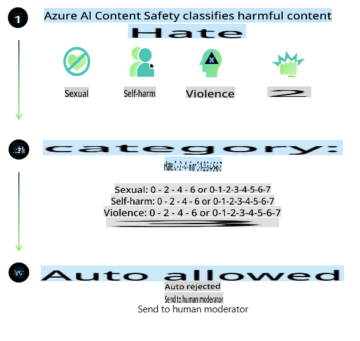
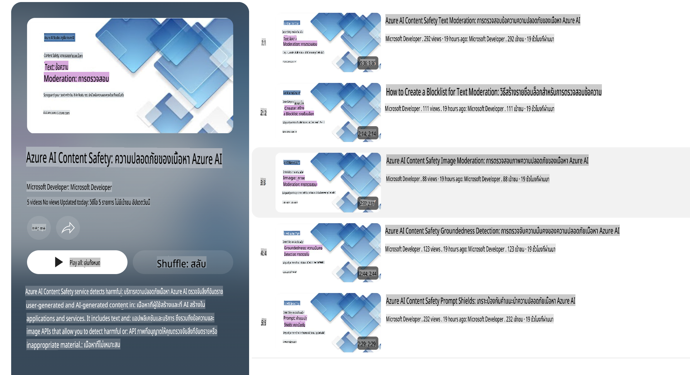

# ความปลอดภัยของ AI สำหรับโมเดล Phi  
กลุ่มโมเดล Phi ถูกพัฒนาขึ้นตาม [มาตรฐาน AI ที่รับผิดชอบของ Microsoft](https://query.prod.cms.rt.microsoft.com/cms/api/am/binary/RE5cmFl) ซึ่งเป็นข้อกำหนดทั่วทั้งบริษัทที่อิงตามหลักการหกข้อ ได้แก่ ความรับผิดชอบ ความโปร่งใส ความยุติธรรม ความน่าเชื่อถือและความปลอดภัย ความเป็นส่วนตัวและความปลอดภัย และการมีส่วนร่วม ซึ่งเป็นรากฐานของ [หลักการ AI ที่รับผิดชอบของ Microsoft](https://www.microsoft.com/ai/responsible-ai)

เช่นเดียวกับโมเดล Phi รุ่นก่อนๆ การประเมินความปลอดภัยหลายมิติและแนวทางการฝึกอบรมหลังการพัฒนาที่เน้นความปลอดภัยถูกนำมาใช้ โดยมีมาตรการเพิ่มเติมเพื่อรองรับความสามารถหลายภาษาในเวอร์ชันนี้ แนวทางของเราในการฝึกอบรมและประเมินความปลอดภัย รวมถึงการทดสอบในหลายภาษาและหมวดหมู่ความเสี่ยง ได้ถูกอธิบายไว้ใน [เอกสาร Phi Safety Post-Training](https://arxiv.org/abs/2407.13833) แม้ว่าโมเดล Phi จะได้รับประโยชน์จากแนวทางนี้ นักพัฒนาควรปฏิบัติตามแนวทางปฏิบัติที่ดีที่สุดสำหรับ AI ที่รับผิดชอบ รวมถึงการทำแผนที่ การวัดผล และการลดความเสี่ยงที่เกี่ยวข้องกับกรณีการใช้งานเฉพาะและบริบททางวัฒนธรรมและภาษา  

## แนวทางปฏิบัติที่ดีที่สุด  

เช่นเดียวกับโมเดลอื่นๆ กลุ่มโมเดล Phi อาจแสดงพฤติกรรมที่ไม่ยุติธรรม ไม่น่าเชื่อถือ หรือไม่เหมาะสมได้  

พฤติกรรมที่จำกัดของ SLM และ LLM ที่ควรทราบ ได้แก่:  

- **คุณภาพของบริการ:** โมเดล Phi ถูกฝึกอบรมโดยใช้ข้อความภาษาอังกฤษเป็นหลัก ภาษาอื่นที่ไม่ใช่ภาษาอังกฤษอาจมีประสิทธิภาพต่ำกว่า และสำเนียงหรือรูปแบบของภาษาอังกฤษที่มีตัวอย่างในข้อมูลฝึกอบรมน้อยอาจมีประสิทธิภาพต่ำกว่าภาษาอังกฤษมาตรฐานแบบอเมริกัน  
- **การแสดงออกถึงอันตรายและการส่งเสริมภาพลักษณ์ที่เป็นอคติ:** โมเดลเหล่านี้อาจแสดงกลุ่มคนบางกลุ่มมากหรือน้อยเกินไป ลบการแสดงตัวตนของบางกลุ่ม หรือเสริมสร้างภาพลักษณ์ที่ไม่เหมาะสมหรือเชิงลบ แม้จะมีการฝึกอบรมเพื่อความปลอดภัย แต่ข้อจำกัดเหล่านี้ยังคงมีอยู่เนื่องจากระดับการแสดงตัวตนของกลุ่มต่างๆ ที่แตกต่างกัน หรือความแพร่หลายของตัวอย่างภาพลักษณ์เชิงลบในข้อมูลฝึกอบรมที่สะท้อนถึงรูปแบบในโลกจริงและอคติในสังคม  
- **เนื้อหาที่ไม่เหมาะสมหรือก้าวร้าว:** โมเดลเหล่านี้อาจสร้างเนื้อหาประเภทอื่นๆ ที่ไม่เหมาะสมหรือก้าวร้าว ซึ่งอาจทำให้ไม่เหมาะสมสำหรับการใช้งานในบริบทที่อ่อนไหวหากไม่มีมาตรการลดความเสี่ยงเพิ่มเติมที่เจาะจงกับกรณีการใช้งาน  
- **ความน่าเชื่อถือของข้อมูล:** โมเดลภาษาอาจสร้างเนื้อหาที่ไม่มีเหตุผลหรือข้อมูลที่อาจฟังดูสมเหตุสมผลแต่ไม่ถูกต้องหรือล้าสมัย  
- **ขอบเขตจำกัดสำหรับการเขียนโค้ด:** ข้อมูลการฝึกอบรมส่วนใหญ่ของ Phi-3 อิงตาม Python และใช้แพ็คเกจที่พบบ่อย เช่น "typing, math, random, collections, datetime, itertools" หากโมเดลสร้างสคริปต์ Python ที่ใช้แพ็คเกจอื่นหรือเขียนในภาษาอื่น เราขอแนะนำอย่างยิ่งให้ผู้ใช้งานตรวจสอบการใช้งาน API ทั้งหมดด้วยตนเอง  

นักพัฒนาควรปฏิบัติตามแนวทางปฏิบัติที่ดีที่สุดสำหรับ AI ที่รับผิดชอบ และมีหน้าที่รับผิดชอบในการตรวจสอบให้แน่ใจว่ากรณีการใช้งานเฉพาะสอดคล้องกับกฎหมายและข้อบังคับที่เกี่ยวข้อง (เช่น ความเป็นส่วนตัว การค้า ฯลฯ)  

## การพิจารณา AI ที่รับผิดชอบ  

เช่นเดียวกับโมเดลภาษาอื่นๆ โมเดลในกลุ่ม Phi อาจแสดงพฤติกรรมที่ไม่ยุติธรรม ไม่น่าเชื่อถือ หรือไม่เหมาะสมได้ พฤติกรรมที่จำกัดที่ควรทราบ ได้แก่:  

**คุณภาพของบริการ:** โมเดล Phi ถูกฝึกอบรมโดยใช้ข้อความภาษาอังกฤษเป็นหลัก ภาษาอื่นที่ไม่ใช่ภาษาอังกฤษอาจมีประสิทธิภาพต่ำกว่า สำเนียงหรือรูปแบบของภาษาอังกฤษที่มีตัวอย่างในข้อมูลฝึกอบรมน้อยอาจมีประสิทธิภาพต่ำกว่าภาษาอังกฤษมาตรฐานแบบอเมริกัน  

**การแสดงออกถึงอันตรายและการส่งเสริมภาพลักษณ์ที่เป็นอคติ:** โมเดลเหล่านี้อาจแสดงกลุ่มคนบางกลุ่มมากหรือน้อยเกินไป ลบการแสดงตัวตนของบางกลุ่ม หรือเสริมสร้างภาพลักษณ์ที่ไม่เหมาะสมหรือเชิงลบ แม้จะมีการฝึกอบรมเพื่อความปลอดภัย แต่ข้อจำกัดเหล่านี้ยังคงมีอยู่เนื่องจากระดับการแสดงตัวตนของกลุ่มต่างๆ ที่แตกต่างกัน หรือความแพร่หลายของตัวอย่างภาพลักษณ์เชิงลบในข้อมูลฝึกอบรมที่สะท้อนถึงรูปแบบในโลกจริงและอคติในสังคม  

**เนื้อหาที่ไม่เหมาะสมหรือก้าวร้าว:** โมเดลเหล่านี้อาจสร้างเนื้อหาประเภทอื่นๆ ที่ไม่เหมาะสมหรือก้าวร้าว ซึ่งอาจทำให้ไม่เหมาะสมสำหรับการใช้งานในบริบทที่อ่อนไหวหากไม่มีมาตรการลดความเสี่ยงเพิ่มเติมที่เจาะจงกับกรณีการใช้งาน  

**ความน่าเชื่อถือของข้อมูล:** โมเดลภาษาอาจสร้างเนื้อหาที่ไม่มีเหตุผลหรือข้อมูลที่อาจฟังดูสมเหตุสมผลแต่ไม่ถูกต้องหรือล้าสมัย  

**ขอบเขตจำกัดสำหรับการเขียนโค้ด:** ข้อมูลการฝึกอบรมส่วนใหญ่ของ Phi-3 อิงตาม Python และใช้แพ็คเกจที่พบบ่อย เช่น "typing, math, random, collections, datetime, itertools" หากโมเดลสร้างสคริปต์ Python ที่ใช้แพ็คเกจอื่นหรือเขียนในภาษาอื่น เราขอแนะนำอย่างยิ่งให้ผู้ใช้งานตรวจสอบการใช้งาน API ทั้งหมดด้วยตนเอง  

นักพัฒนาควรปฏิบัติตามแนวทางปฏิบัติที่ดีที่สุดสำหรับ AI ที่รับผิดชอบ และมีหน้าที่รับผิดชอบในการตรวจสอบให้แน่ใจว่ากรณีการใช้งานเฉพาะสอดคล้องกับกฎหมายและข้อบังคับที่เกี่ยวข้อง (เช่น ความเป็นส่วนตัว การค้า ฯลฯ) พื้นที่สำคัญที่ควรพิจารณา ได้แก่:  

**การจัดสรร:** โมเดลอาจไม่เหมาะสมสำหรับสถานการณ์ที่มีผลกระทบอย่างมากต่อสถานะทางกฎหมายหรือการจัดสรรทรัพยากรหรือโอกาสในชีวิต (เช่น ที่อยู่อาศัย การจ้างงาน เครดิต ฯลฯ) หากไม่มีการประเมินเพิ่มเติมและเทคนิคการลดอคติ  

**สถานการณ์ที่มีความเสี่ยงสูง:** นักพัฒนาควรประเมินความเหมาะสมของการใช้โมเดลในสถานการณ์ที่มีความเสี่ยงสูง ซึ่งผลลัพธ์ที่ไม่ยุติธรรม ไม่น่าเชื่อถือ หรือไม่เหมาะสมอาจส่งผลเสียอย่างมากหรือก่อให้เกิดอันตราย ซึ่งรวมถึงการให้คำแนะนำในโดเมนที่อ่อนไหวหรือเชี่ยวชาญซึ่งความถูกต้องและความน่าเชื่อถือมีความสำคัญอย่างยิ่ง (เช่น คำแนะนำทางกฎหมายหรือสุขภาพ) ควรมีการใช้มาตรการป้องกันเพิ่มเติมในระดับแอปพลิเคชันตามบริบทของการใช้งาน  

**ข้อมูลที่ผิด:** โมเดลอาจสร้างข้อมูลที่ไม่ถูกต้อง นักพัฒนาควรปฏิบัติตามแนวทางปฏิบัติที่ดีที่สุดเกี่ยวกับความโปร่งใสและแจ้งให้ผู้ใช้งานทราบว่าพวกเขากำลังโต้ตอบกับระบบ AI ในระดับแอปพลิเคชัน นักพัฒนาสามารถสร้างกลไกข้อเสนอแนะและกระบวนการเพื่อนำเสนอคำตอบที่อิงตามข้อมูลเฉพาะบริบทของกรณีการใช้งาน เทคนิคนี้เรียกว่าการสร้างคำตอบที่ปรับปรุงด้วยการดึงข้อมูล (Retrieval Augmented Generation หรือ RAG)  

**การสร้างเนื้อหาที่เป็นอันตราย:** นักพัฒนาควรประเมินผลลัพธ์ตามบริบทและใช้ตัวจัดประเภทความปลอดภัยหรือโซลูชันที่ปรับแต่งตามกรณีการใช้งาน  

**การใช้งานในทางที่ผิด:** การใช้งานในทางที่ผิดรูปแบบอื่นๆ เช่น การหลอกลวง สแปม หรือการสร้างมัลแวร์อาจเกิดขึ้นได้ และนักพัฒนาควรตรวจสอบให้แน่ใจว่าแอปพลิเคชันของพวกเขาไม่ละเมิดกฎหมายและข้อบังคับที่เกี่ยวข้อง  

### การปรับแต่งและความปลอดภัยของเนื้อหา AI  

หลังจากการปรับแต่งโมเดล เราขอแนะนำอย่างยิ่งให้ใช้มาตรการ [Azure AI Content Safety](https://learn.microsoft.com/azure/ai-services/content-safety/overview) เพื่อตรวจสอบเนื้อหาที่สร้างโดยโมเดล ระบุและบล็อกความเสี่ยง ภัยคุกคาม และปัญหาคุณภาพที่อาจเกิดขึ้น  

  

[Azure AI Content Safety](https://learn.microsoft.com/azure/ai-services/content-safety/overview) รองรับทั้งเนื้อหาข้อความและภาพ สามารถใช้งานได้ทั้งในระบบคลาวด์ คอนเทนเนอร์แบบแยก และบนอุปกรณ์ปลายทางหรือฝังตัว  

## ภาพรวมของ Azure AI Content Safety  

Azure AI Content Safety ไม่ใช่โซลูชันแบบเดียวที่เหมาะกับทุกกรณี แต่สามารถปรับแต่งให้สอดคล้องกับนโยบายเฉพาะของธุรกิจได้ นอกจากนี้ โมเดลหลายภาษาของมันยังช่วยให้สามารถเข้าใจหลายภาษาได้พร้อมกัน  

  

- **Azure AI Content Safety**  
- **Microsoft Developer**  
- **5 วิดีโอ**  

บริการ Azure AI Content Safety ตรวจจับเนื้อหาที่เป็นอันตรายที่สร้างโดยผู้ใช้งานและ AI ในแอปพลิเคชันและบริการ รวมถึง API สำหรับข้อความและภาพที่ช่วยให้สามารถตรวจจับเนื้อหาที่เป็นอันตรายหรือไม่เหมาะสมได้  

[AI Content Safety Playlist](https://www.youtube.com/playlist?list=PLlrxD0HtieHjaQ9bJjyp1T7FeCbmVcPkQ)  

**ข้อจำกัดความรับผิดชอบ**:  
เอกสารฉบับนี้ได้รับการแปลโดยใช้บริการแปลภาษาอัตโนมัติด้วย AI แม้ว่าเราจะพยายามอย่างเต็มที่เพื่อความถูกต้อง แต่โปรดทราบว่าการแปลโดยอัตโนมัติอาจมีข้อผิดพลาดหรือความไม่ถูกต้อง เอกสารต้นฉบับในภาษาต้นทางควรถือเป็นแหล่งข้อมูลที่เชื่อถือได้ สำหรับข้อมูลที่สำคัญ แนะนำให้ใช้บริการแปลภาษาจากผู้เชี่ยวชาญที่เป็นมนุษย์ เราจะไม่รับผิดชอบต่อความเข้าใจผิดหรือการตีความที่ผิดพลาดซึ่งเกิดจากการใช้การแปลนี้