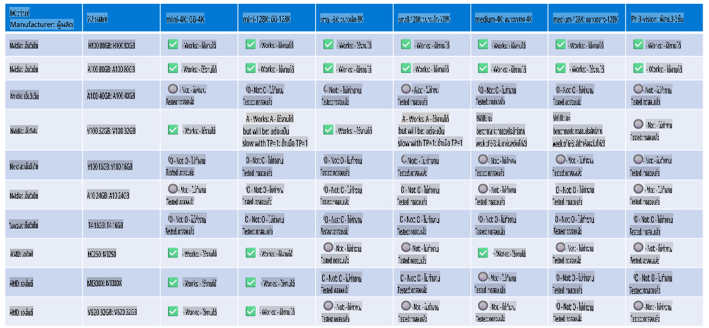

# การสนับสนุนฮาร์ดแวร์ Phi

Microsoft Phi ได้รับการปรับแต่งให้เหมาะสมสำหรับ ONNX Runtime และรองรับ Windows DirectML โดยสามารถทำงานได้ดีบนฮาร์ดแวร์หลากหลายประเภท รวมถึง GPU, CPU และแม้แต่บนอุปกรณ์พกพา

## ฮาร์ดแวร์ที่รองรับ
ฮาร์ดแวร์ที่รองรับประกอบด้วย:

- GPU SKU: RTX 4090 (DirectML)
- GPU SKU: 1 A100 80GB (CUDA)
- CPU SKU: Standard F64s v2 (64 vCPUs, 128 GiB memory)

## SKU สำหรับอุปกรณ์พกพา

- Android - Samsung Galaxy S21
- Apple iPhone 14 หรือสูงกว่า พร้อมโปรเซสเซอร์ A16/A17

## สเปกฮาร์ดแวร์ของ Phi

- การกำหนดค่าขั้นต่ำที่ต้องการ
- Windows: GPU ที่รองรับ DirectX 12 และ RAM รวมอย่างน้อย 4GB

CUDA: NVIDIA GPU ที่มี Compute Capability >= 7.02



## การรัน onnxruntime บนหลาย GPU

ปัจจุบัน โมเดล Phi ONNX ที่มีอยู่รองรับเพียง 1 GPU เท่านั้น แม้ว่าจะสามารถรองรับหลาย GPU สำหรับโมเดล Phi ได้ แต่ ORT ที่ใช้ 2 GPU ไม่ได้รับประกันว่าจะให้ปริมาณงานที่มากกว่าการใช้ ORT 2 อินสแตนซ์ โปรดดู [ONNX Runtime](https://onnxruntime.ai/) สำหรับข้อมูลอัปเดตล่าสุด

ในงาน [Build 2024 ทีม GenAI ONNX](https://youtu.be/WLW4SE8M9i8?si=EtG04UwDvcjunyfC) ได้ประกาศว่าพวกเขาได้เปิดใช้งานการใช้หลายอินสแตนซ์แทนการใช้หลาย GPU สำหรับโมเดล Phi

ในปัจจุบัน คุณสามารถรันอินสแตนซ์ onnxruntime หรือ onnxruntime-genai หนึ่งอินสแตนซ์โดยใช้ตัวแปรสภาพแวดล้อม CUDA_VISIBLE_DEVICES ได้ดังนี้:

```Python
CUDA_VISIBLE_DEVICES=0 python infer.py
CUDA_VISIBLE_DEVICES=1 python infer.py
```

สามารถสำรวจ Phi เพิ่มเติมได้ที่ [Azure AI Foundry](https://ai.azure.com)

**ข้อจำกัดความรับผิดชอบ**:  
เอกสารนี้ได้รับการแปลโดยใช้บริการแปลภาษาอัตโนมัติที่ใช้ปัญญาประดิษฐ์ (AI) แม้ว่าเราจะพยายามอย่างเต็มที่เพื่อให้การแปลถูกต้อง แต่โปรดทราบว่าการแปลอัตโนมัติอาจมีข้อผิดพลาดหรือความไม่ถูกต้องเกิดขึ้น เอกสารต้นฉบับในภาษาต้นทางควรถูกพิจารณาเป็นแหล่งข้อมูลที่เชื่อถือได้ สำหรับข้อมูลสำคัญ แนะนำให้ใช้บริการแปลภาษาจากมนุษย์มืออาชีพ เราไม่รับผิดชอบต่อความเข้าใจผิดหรือการตีความผิดที่เกิดจากการใช้การแปลนี้