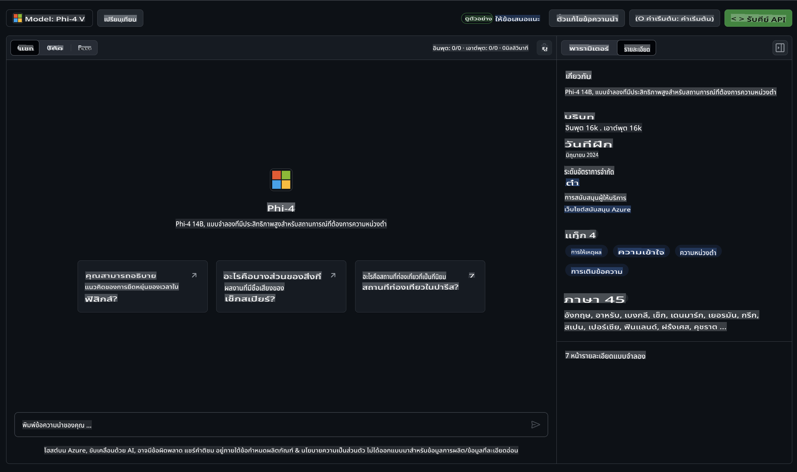

## ตระกูล Phi ใน GitHub Models

ยินดีต้อนรับสู่ [GitHub Models](https://github.com/marketplace/models)! เราได้เตรียมทุกอย่างไว้พร้อมแล้วสำหรับคุณในการสำรวจโมเดล AI ที่โฮสต์อยู่บน Azure AI


สำหรับข้อมูลเพิ่มเติมเกี่ยวกับโมเดลที่มีใน GitHub Models สามารถดูได้ที่ [GitHub Model Marketplace](https://github.com/marketplace/models)

## โมเดลที่มีให้ใช้งาน

แต่ละโมเดลมีพื้นที่ทดลองและโค้ดตัวอย่างเฉพาะของตัวเอง



### ตระกูล Phi ใน GitHub Model Catalog

- [Phi-4](https://github.com/marketplace/models/azureml/Phi-4)

- [Phi-3.5-MoE instruct (128k)](https://github.com/marketplace/models/azureml/Phi-3-5-MoE-instruct)

- [Phi-3.5-vision instruct (128k)](https://github.com/marketplace/models/azureml/Phi-3-5-vision-instruct)

- [Phi-3.5-mini instruct (128k)](https://github.com/marketplace/models/azureml/Phi-3-5-mini-instruct)

- [Phi-3-Medium-128k-Instruct](https://github.com/marketplace/models/azureml/Phi-3-medium-128k-instruct)

- [Phi-3-medium-4k-instruct](https://github.com/marketplace/models/azureml/Phi-3-medium-4k-instruct)

- [Phi-3-mini-128k-instruct](https://github.com/marketplace/models/azureml/Phi-3-mini-128k-instruct)

- [Phi-3-mini-4k-instruct](https://github.com/marketplace/models/azureml/Phi-3-mini-4k-instruct)

- [Phi-3-small-128k-instruct](https://github.com/marketplace/models/azureml/Phi-3-small-128k-instruct)

- [Phi-3-small-8k-instruct](https://github.com/marketplace/models/azureml/Phi-3-small-8k-instruct)

## เริ่มต้นใช้งาน

เรามีตัวอย่างพื้นฐานที่พร้อมให้คุณลองใช้งาน คุณสามารถค้นหาได้ในไดเรกทอรีตัวอย่าง หากคุณต้องการเริ่มต้นในภาษาที่คุณชื่นชอบ คุณสามารถค้นหาตัวอย่างได้ในภาษาต่อไปนี้:

- Python
- JavaScript
- C#
- Java
- cURL

นอกจากนี้ยังมีสภาพแวดล้อม Codespaces ที่เตรียมไว้สำหรับการรันตัวอย่างและโมเดลต่างๆ 


## โค้ดตัวอย่าง 

ด้านล่างนี้เป็นตัวอย่างโค้ดสำหรับบางกรณีการใช้งาน สำหรับข้อมูลเพิ่มเติมเกี่ยวกับ Azure AI Inference SDK ดูเอกสารและตัวอย่างฉบับเต็ม

## การตั้งค่า 

1. สร้าง personal access token  
คุณไม่จำเป็นต้องให้สิทธิ์ใดๆ กับ token โปรดทราบว่า token จะถูกส่งไปยังบริการของ Microsoft

เพื่อใช้โค้ดตัวอย่างด้านล่าง ให้สร้างตัวแปรสภาพแวดล้อมเพื่อตั้งค่า token ของคุณเป็นคีย์สำหรับโค้ดไคลเอนต์

หากคุณใช้ bash:
```
export GITHUB_TOKEN="<your-github-token-goes-here>"
```  
หากคุณใช้ powershell:  

```
$Env:GITHUB_TOKEN="<your-github-token-goes-here>"
```  

หากคุณใช้ Windows command prompt:  

```
set GITHUB_TOKEN=<your-github-token-goes-here>
```  

## ตัวอย่าง Python

### ติดตั้ง dependencies  
ติดตั้ง Azure AI Inference SDK ด้วย pip (ต้องการ: Python >=3.8):  

```
pip install azure-ai-inference
```  

### รันโค้ดตัวอย่างพื้นฐาน  

ตัวอย่างนี้แสดงการเรียกใช้งาน API chat completion แบบพื้นฐาน โดยใช้ GitHub AI model inference endpoint และ GitHub token ของคุณ การเรียกใช้งานนี้เป็นแบบ synchronous  

```python
import os
from azure.ai.inference import ChatCompletionsClient
from azure.ai.inference.models import SystemMessage, UserMessage
from azure.core.credentials import AzureKeyCredential

endpoint = "https://models.inference.ai.azure.com"
model_name = "Phi-4"
token = os.environ["GITHUB_TOKEN"]

client = ChatCompletionsClient(
    endpoint=endpoint,
    credential=AzureKeyCredential(token),
)

response = client.complete(
    messages=[
        UserMessage(content="I have $20,000 in my savings account, where I receive a 4% profit per year and payments twice a year. Can you please tell me how long it will take for me to become a millionaire? Also, can you please explain the math step by step as if you were explaining it to an uneducated person?"),
    ],
    temperature=0.4,
    top_p=1.0,
    max_tokens=2048,
    model=model_name
)

print(response.choices[0].message.content)
```  

### รันการสนทนาแบบหลายรอบ  

ตัวอย่างนี้แสดงการสนทนาแบบหลายรอบกับ API chat completion เมื่อใช้โมเดลสำหรับแอปพลิเคชันสนทนา คุณจะต้องจัดการประวัติของการสนทนาและส่งข้อความล่าสุดไปยังโมเดล  

```
import os
from azure.ai.inference import ChatCompletionsClient
from azure.ai.inference.models import AssistantMessage, SystemMessage, UserMessage
from azure.core.credentials import AzureKeyCredential

token = os.environ["GITHUB_TOKEN"]
endpoint = "https://models.inference.ai.azure.com"
# Replace Model_Name
model_name = "Phi-4"

client = ChatCompletionsClient(
    endpoint=endpoint,
    credential=AzureKeyCredential(token),
)

messages = [
    SystemMessage(content="You are a helpful assistant."),
    UserMessage(content="What is the capital of France?"),
    AssistantMessage(content="The capital of France is Paris."),
    UserMessage(content="What about Spain?"),
]

response = client.complete(messages=messages, model=model_name)

print(response.choices[0].message.content)
```  

### สตรีมผลลัพธ์  

เพื่อประสบการณ์ผู้ใช้ที่ดีขึ้น คุณควรสตรีมผลลัพธ์ของโมเดลเพื่อให้โทเค็นแรกปรากฏขึ้นเร็วขึ้น และหลีกเลี่ยงการรอคำตอบที่ยาวนาน  

```
import os
from azure.ai.inference import ChatCompletionsClient
from azure.ai.inference.models import SystemMessage, UserMessage
from azure.core.credentials import AzureKeyCredential

token = os.environ["GITHUB_TOKEN"]
endpoint = "https://models.inference.ai.azure.com"
# Replace Model_Name
model_name = "Phi-4"

client = ChatCompletionsClient(
    endpoint=endpoint,
    credential=AzureKeyCredential(token),
)

response = client.complete(
    stream=True,
    messages=[
        SystemMessage(content="You are a helpful assistant."),
        UserMessage(content="Give me 5 good reasons why I should exercise every day."),
    ],
    model=model_name,
)

for update in response:
    if update.choices:
        print(update.choices[0].delta.content or "", end="")

client.close()
```  

## การใช้งานฟรีและข้อจำกัดการใช้งานสำหรับ GitHub Models  


[ข้อจำกัดการใช้งาน playground และ API ฟรี](https://docs.github.com/en/github-models/prototyping-with-ai-models#rate-limits) ถูกออกแบบมาเพื่อช่วยให้คุณทดลองใช้งานโมเดลและสร้างต้นแบบแอปพลิเคชัน AI ของคุณ หากต้องการใช้งานเกินข้อจำกัดเหล่านี้ และเพื่อขยายการใช้งานแอปพลิเคชันของคุณ คุณต้องจัดเตรียมทรัพยากรจากบัญชี Azure และทำการยืนยันตัวตนจากที่นั่นแทน GitHub personal access token ของคุณ โดยไม่ต้องเปลี่ยนแปลงอะไรในโค้ดของคุณ ดูลิงก์นี้เพื่อเรียนรู้วิธีการใช้งานเกินข้อจำกัดใน Azure AI  

### การเปิดเผยข้อมูล  

โปรดจำไว้ว่าเมื่อคุณโต้ตอบกับโมเดล คุณกำลังทดลองใช้งาน AI ดังนั้นจึงมีความเป็นไปได้ที่จะเกิดข้อผิดพลาดในเนื้อหา  

ฟีเจอร์นี้อยู่ภายใต้ข้อจำกัดต่างๆ (รวมถึงจำนวนคำขอต่อนาที คำขอต่อวัน โทเค็นต่อคำขอ และคำขอพร้อมกัน) และไม่ได้ออกแบบมาสำหรับการใช้งานในกรณีที่ต้องการประสิทธิภาพสูง  

GitHub Models ใช้ Azure AI Content Safety ซึ่งตัวกรองเหล่านี้ไม่สามารถปิดได้ในประสบการณ์ใช้งาน GitHub Models หากคุณตัดสินใจใช้โมเดลผ่านบริการแบบชำระเงิน โปรดกำหนดค่าตัวกรองเนื้อหาให้ตรงกับความต้องการของคุณ  

บริการนี้อยู่ภายใต้เงื่อนไขการใช้งานล่วงหน้าของ GitHub

**ข้อจำกัดความรับผิดชอบ**:  
เอกสารนี้ได้รับการแปลโดยใช้บริการแปลภาษาอัตโนมัติด้วย AI แม้ว่าเราจะพยายามอย่างเต็มที่เพื่อให้การแปลมีความถูกต้อง แต่โปรดทราบว่าการแปลอัตโนมัติอาจมีข้อผิดพลาดหรือความไม่แม่นยำ เอกสารต้นฉบับในภาษาต้นทางควรถือเป็นแหล่งข้อมูลที่เชื่อถือได้ สำหรับข้อมูลที่มีความสำคัญ ขอแนะนำให้ใช้บริการแปลภาษาจากผู้เชี่ยวชาญที่เป็นมนุษย์ เราจะไม่รับผิดชอบต่อความเข้าใจผิดหรือการตีความที่ผิดพลาดซึ่งเกิดจากการใช้การแปลนี้