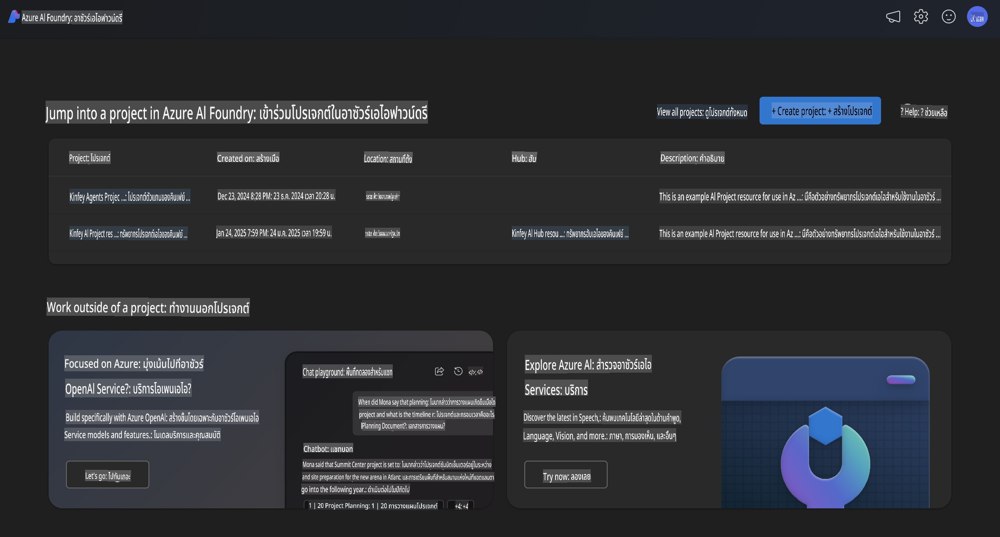
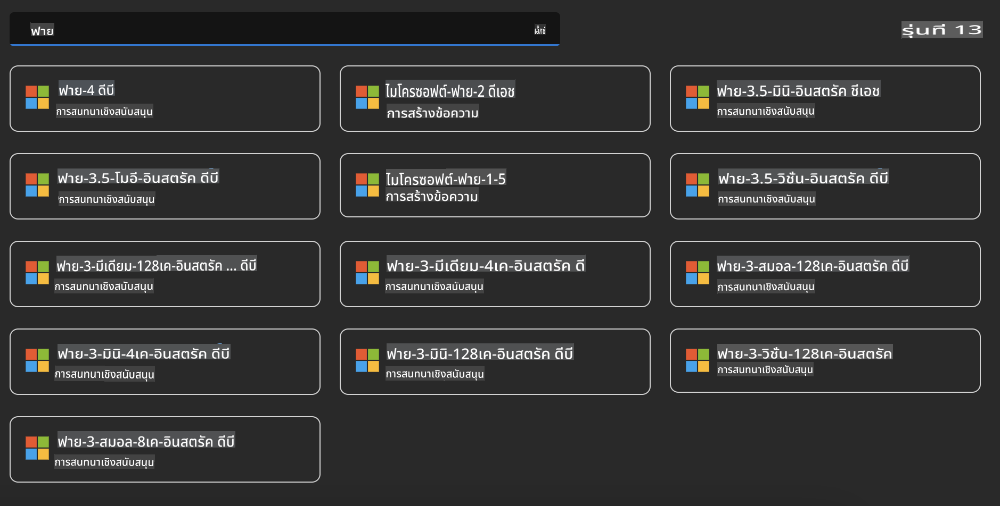
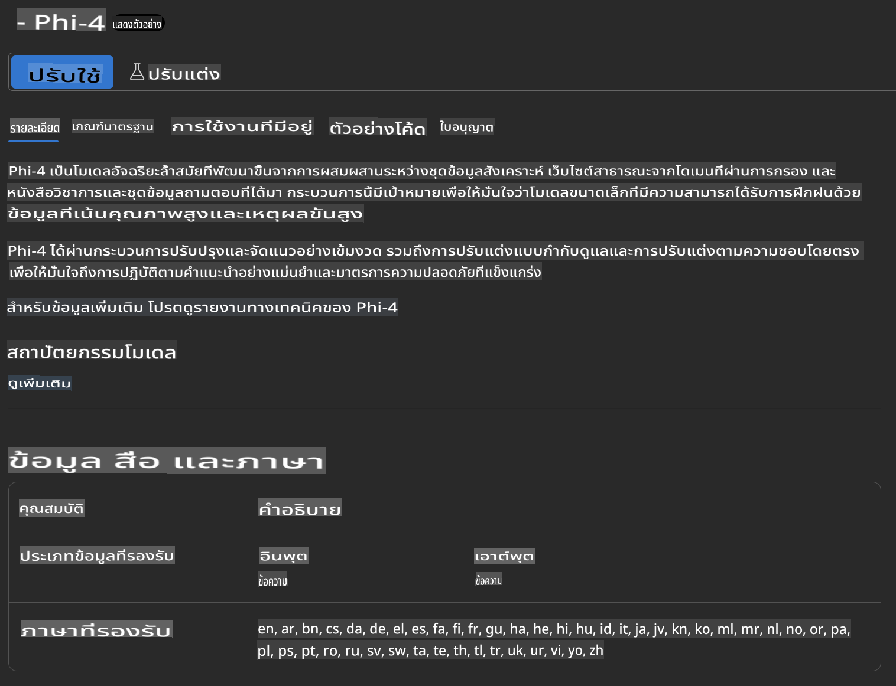
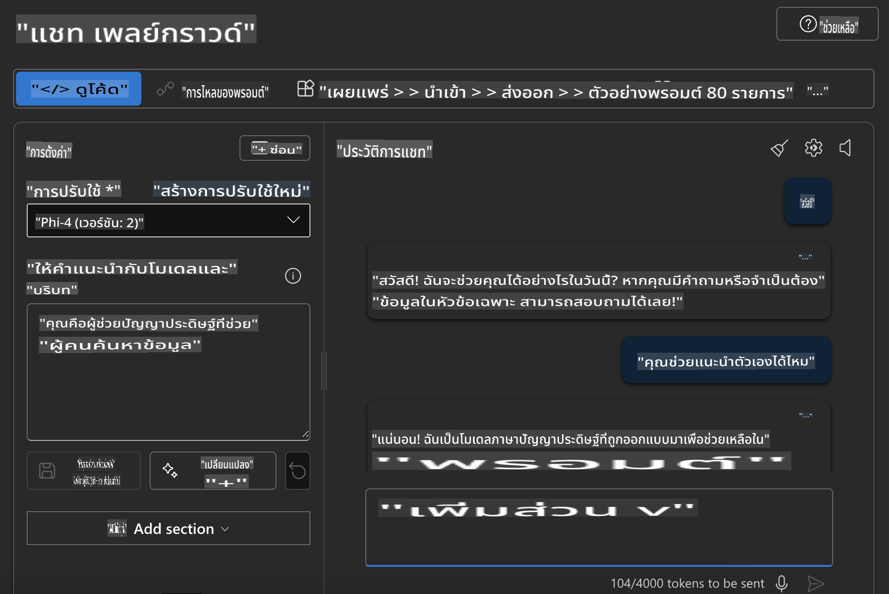

## Phi Family ใน Azure AI Foundry

[Azure AI Foundry](https://ai.azure.com) เป็นแพลตฟอร์มที่เชื่อถือได้ ช่วยให้นักพัฒนาสามารถสร้างนวัตกรรมและกำหนดอนาคตด้วย AI ในรูปแบบที่ปลอดภัย มั่นคง และมีความรับผิดชอบ


[Azure AI Foundry](https://ai.azure.com) ถูกออกแบบมาเพื่อให้นักพัฒนาสามารถ:

- สร้างแอปพลิเคชัน Generative AI บนแพลตฟอร์มระดับองค์กร
- สำรวจ สร้าง ทดสอบ และปรับใช้ด้วยเครื่องมือ AI และโมเดล ML ที่ทันสมัย โดยยึดมั่นในหลักปฏิบัติ AI ที่มีความรับผิดชอบ
- ทำงานร่วมกันในทีมสำหรับทุกขั้นตอนของการพัฒนาแอปพลิเคชัน

ด้วย Azure AI Foundry คุณสามารถสำรวจโมเดล บริการ และความสามารถที่หลากหลาย และเริ่มสร้างแอปพลิเคชัน AI ที่ตอบโจทย์เป้าหมายของคุณ แพลตฟอร์ม Azure AI Foundry ช่วยอำนวยความสะดวกในการขยายขนาดจากแนวคิดต้นแบบไปสู่แอปพลิเคชันที่ใช้งานได้จริงอย่างง่ายดาย การติดตามและปรับปรุงอย่างต่อเนื่องยังช่วยสนับสนุนความสำเร็จในระยะยาว



นอกเหนือจากการใช้บริการ Azure AOAI ใน Azure AI Foundry คุณยังสามารถใช้โมเดลของบุคคลที่สามใน Azure AI Foundry Model Catalog ได้อีกด้วย นี่เป็นตัวเลือกที่ดีหากคุณต้องการใช้ Azure AI Foundry เป็นแพลตฟอร์มโซลูชัน AI ของคุณ

เราสามารถปรับใช้โมเดล Phi Family ได้อย่างรวดเร็วผ่าน Model Catalog ใน Azure AI Foundry



### **ปรับใช้ Phi-4 ใน Azure AI Foundry**




### **ทดสอบ Phi-4 ใน Azure AI Foundry Playground**



### **รันโค้ด Python เพื่อเรียกใช้งาน Azure AI Foundry Phi-4**


```python

import os  
import base64
from openai import AzureOpenAI  
from azure.identity import DefaultAzureCredential, get_bearer_token_provider  
        
endpoint = os.getenv("ENDPOINT_URL", "Your Azure AOAI Service Endpoint")  
deployment = os.getenv("DEPLOYMENT_NAME", "Phi-4")  
      
token_provider = get_bearer_token_provider(  
    DefaultAzureCredential(),  
    "https://cognitiveservices.azure.com/.default"  
)  
  
client = AzureOpenAI(  
    azure_endpoint=endpoint,  
    azure_ad_token_provider=token_provider,  
    api_version="2024-05-01-preview",  
)  
  

chat_prompt = [
    {
        "role": "system",
        "content": "You are an AI assistant that helps people find information."
    },
    {
        "role": "user",
        "content": "can you introduce yourself"
    }
] 
    
# Include speech result if speech is enabled  
messages = chat_prompt 

completion = client.chat.completions.create(  
    model=deployment,  
    messages=messages,
    max_tokens=800,  
    temperature=0.7,  
    top_p=0.95,  
    frequency_penalty=0,  
    presence_penalty=0,
    stop=None,  
    stream=False  
)  
  
print(completion.to_json())  

```

**ข้อจำกัดความรับผิดชอบ**:  
เอกสารนี้ได้รับการแปลโดยใช้บริการแปลภาษาด้วยปัญญาประดิษฐ์ (AI) แม้ว่าเราจะพยายามอย่างเต็มที่เพื่อความถูกต้อง แต่โปรดทราบว่าการแปลอัตโนมัติอาจมีข้อผิดพลาดหรือความไม่ถูกต้อง เอกสารต้นฉบับในภาษาต้นทางควรถือเป็นแหล่งข้อมูลที่เชื่อถือได้ สำหรับข้อมูลสำคัญ ขอแนะนำให้ใช้บริการแปลภาษามนุษย์ที่เป็นมืออาชีพ เราไม่รับผิดชอบต่อความเข้าใจผิดหรือการตีความผิดที่เกิดจากการใช้การแปลนี้