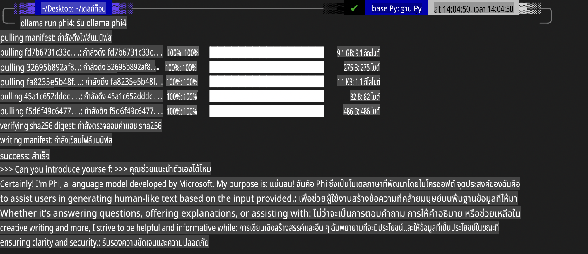
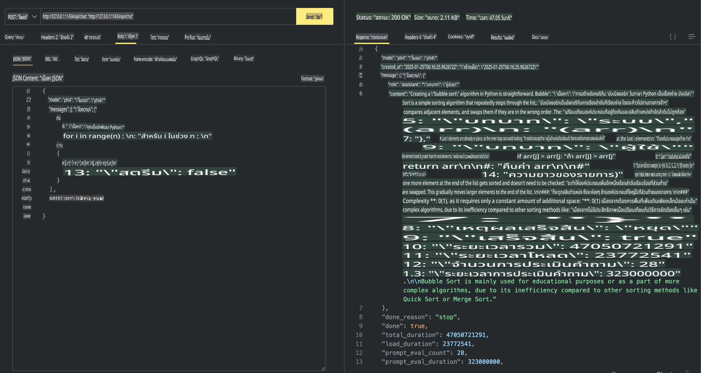

## Phi Family ใน Ollama

[Ollama](https://ollama.com) ช่วยให้ผู้คนจำนวนมากสามารถใช้งาน LLM หรือ SLM แบบโอเพ่นซอร์สได้โดยตรงผ่านสคริปต์ง่ายๆ และยังสามารถสร้าง API เพื่อช่วยในสถานการณ์การใช้งาน Copilot ในเครื่องได้อีกด้วย

## **1. การติดตั้ง**

Ollama รองรับการใช้งานบน Windows, macOS และ Linux คุณสามารถติดตั้ง Ollama ได้จากลิงก์นี้ ([https://ollama.com/download](https://ollama.com/download)) หลังจากติดตั้งเสร็จเรียบร้อย คุณสามารถใช้สคริปต์ Ollama เพื่อเรียกใช้งาน Phi-3 ผ่านหน้าต่างเทอร์มินัลได้โดยตรง คุณสามารถดู [ไลบรารีทั้งหมดที่มีใน Ollama](https://ollama.com/library) ได้ หากคุณเปิด repository นี้ใน Codespace ระบบจะติดตั้ง Ollama ไว้ให้แล้ว

```bash

ollama run phi4

```

> [!NOTE]
> โมเดลจะถูกดาวน์โหลดในครั้งแรกที่คุณรัน แน่นอนว่าคุณสามารถระบุโมเดล Phi-4 ที่ดาวน์โหลดไว้แล้วได้โดยตรง เราจะยกตัวอย่างการใช้งานคำสั่งใน WSL เมื่อโมเดลดาวน์โหลดเสร็จสมบูรณ์ คุณสามารถโต้ตอบกับระบบได้ทันทีผ่านเทอร์มินัล



## **2. เรียกใช้ API ของ phi-4 จาก Ollama**

หากคุณต้องการเรียกใช้ API ของ Phi-4 ที่สร้างโดย Ollama คุณสามารถใช้คำสั่งนี้ในเทอร์มินัลเพื่อเริ่มต้นเซิร์ฟเวอร์ Ollama

```bash

ollama serve

```

> [!NOTE]
> หากคุณใช้งาน macOS หรือ Linux โปรดทราบว่าคุณอาจพบข้อผิดพลาดต่อไปนี้ **"Error: listen tcp 127.0.0.1:11434: bind: address already in use"** ซึ่งอาจเกิดขึ้นเมื่อคุณรันคำสั่ง คุณสามารถเพิกเฉยข้อผิดพลาดนี้ได้ เนื่องจากมักหมายความว่าเซิร์ฟเวอร์กำลังทำงานอยู่แล้ว หรือคุณสามารถหยุดและเริ่มต้น Ollama ใหม่ได้:

**macOS**

```bash

brew services restart ollama

```

**Linux**

```bash

sudo systemctl stop ollama

```

Ollama รองรับ API สองประเภท: generate และ chat คุณสามารถเรียกใช้ API โมเดลที่ Ollama ให้บริการตามความต้องการของคุณ โดยการส่งคำขอไปยังเซิร์ฟเวอร์ที่รันอยู่ในพอร์ต 11434

**Chat**

```bash

curl http://127.0.0.1:11434/api/chat -d '{
  "model": "phi3",
  "messages": [
    {
      "role": "system",
      "content": "Your are a python developer."
    },
    {
      "role": "user",
      "content": "Help me generate a bubble algorithm"
    }
  ],
  "stream": false
  
}'

This is the result in Postman



## Additional Resources

Check the list of available models in Ollama in [their library](https://ollama.com/library).

Pull your model from the Ollama server using this command

```bash
ollama pull phi4
```

Run the model using this command

```bash
ollama run phi4
```

***Note:*** Visit this link [https://github.com/ollama/ollama/blob/main/docs/api.md](https://github.com/ollama/ollama/blob/main/docs/api.md) to learn more

## Calling Ollama from Python

You can use `requests` or `urllib3` to make requests to the local server endpoints used above. However, a popular way to use Ollama in Python is via the [openai](https://pypi.org/project/openai/) SDK, since Ollama provides OpenAI-compatible server endpoints as well.

Here is an example for phi3-mini:

```python
import openai

client = openai.OpenAI(
    base_url="http://localhost:11434/v1",
    api_key="nokeyneeded",
)

response = client.chat.completions.create(
    model="phi4",
    temperature=0.7,
    n=1,
    messages=[
        {"role": "system", "content": "You are a helpful assistant."},
        {"role": "user", "content": "Write a haiku about a hungry cat"},
    ],
)

print("Response:")
print(response.choices[0].message.content)
```

## Calling Ollama from JavaScript 

```javascript
// ตัวอย่างการสรุปไฟล์ด้วย Phi-4
script({
    model: "ollama:phi4",
    title: "Summarize with Phi-4",
    system: ["system"],
})

// ตัวอย่างการสรุป
const file = def("FILE", env.files)
$`Summarize ${file} in a single paragraph.`
```

## Calling Ollama from C#

Create a new C# Console application and add the following NuGet package:

```bash
dotnet add package Microsoft.SemanticKernel --version 1.34.0
```

Then replace this code in the `Program.cs` file

```csharp
using Microsoft.SemanticKernel;
using Microsoft.SemanticKernel.ChatCompletion;

// เพิ่มบริการ chat completion โดยใช้ endpoint ของเซิร์ฟเวอร์ Ollama ในเครื่อง
#pragma warning disable SKEXP0001, SKEXP0003, SKEXP0010, SKEXP0011, SKEXP0050, SKEXP0052
builder.AddOpenAIChatCompletion(
    modelId: "phi4",
    endpoint: new Uri("http://localhost:11434/"),
    apiKey: "non required");

// รัน prompt ง่ายๆ ไปยังบริการแชท
string prompt = "Write a joke about kittens";
var response = await kernel.InvokePromptAsync(prompt);
Console.WriteLine(response.GetValue<string>());
```

Run the app with the command:

```bash
dotnet run

**ข้อจำกัดความรับผิดชอบ**:  
เอกสารนี้ได้รับการแปลโดยใช้บริการแปลภาษาด้วย AI อัตโนมัติ แม้ว่าเราจะพยายามอย่างเต็มที่เพื่อความถูกต้อง แต่โปรดทราบว่าการแปลอัตโนมัติอาจมีข้อผิดพลาดหรือความไม่แม่นยำ เอกสารต้นฉบับในภาษาดั้งเดิมควรถือเป็นแหล่งข้อมูลที่เชื่อถือได้ สำหรับข้อมูลสำคัญ แนะนำให้ใช้บริการแปลภาษามนุษย์ที่เป็นมืออาชีพ เราไม่รับผิดชอบต่อความเข้าใจผิดหรือการตีความผิดที่เกิดจากการใช้การแปลนี้