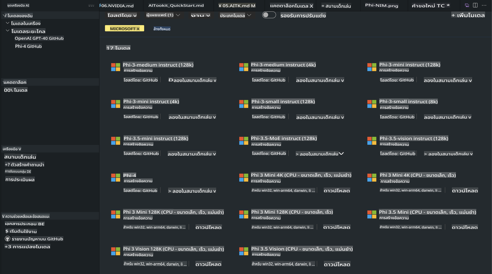
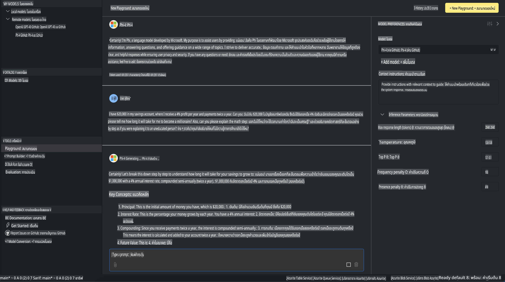

# Phi Family ใน AITK

[AI Toolkit for VS Code](https://marketplace.visualstudio.com/items?itemName=ms-windows-ai-studio.windows-ai-studio) ช่วยให้งานพัฒนาแอปพลิเคชัน Generative AI ง่ายขึ้นด้วยการรวมเครื่องมือและโมเดล AI ขั้นสูงจาก Azure AI Foundry Catalog และแหล่งอื่นๆ เช่น Hugging Face คุณสามารถเรียกดูโมเดล AI ที่มีใน GitHub Models และ Azure AI Foundry Model Catalogs ดาวน์โหลดมาใช้งานทั้งแบบในเครื่องหรือแบบรีโมต ปรับแต่ง ทดลอง และใช้งานในแอปพลิเคชันของคุณได้

AI Toolkit Preview ทำงานในเครื่อง โดยการทดสอบหรือปรับแต่งโมเดลนั้นขึ้นอยู่กับโมเดลที่คุณเลือก บางกรณีอาจต้องใช้ GPU เช่น NVIDIA CUDA GPU นอกจากนี้ คุณยังสามารถใช้งาน GitHub Models โดยตรงผ่าน AITK ได้ด้วย

## เริ่มต้นใช้งาน

[เรียนรู้เพิ่มเติมเกี่ยวกับการติดตั้ง Windows Subsystem for Linux](https://learn.microsoft.com/windows/wsl/install?WT.mc_id=aiml-137032-kinfeylo)

และ [การเปลี่ยนค่า distribution เริ่มต้น](https://learn.microsoft.com/windows/wsl/install#change-the-default-linux-distribution-installed)

[AI Toolkit GitHub Repo](https://github.com/microsoft/vscode-ai-toolkit/)

- Windows, Linux, macOS
  
- สำหรับการปรับแต่งโมเดล (finetuning) บน Windows และ Linux คุณจำเป็นต้องมี Nvidia GPU สำหรับ **Windows** จะต้องใช้ Subsystem for Linux พร้อม Ubuntu distro เวอร์ชัน 18.4 หรือสูงกว่า [เรียนรู้เพิ่มเติมเกี่ยวกับการติดตั้ง Windows Subsystem for Linux](https://learn.microsoft.com/windows/wsl/install) และ [การเปลี่ยนค่า distribution เริ่มต้น](https://learn.microsoft.com/windows/wsl/install#change-the-default-linux-distribution-installed)

### การติดตั้ง AI Toolkit

AI Toolkit มาพร้อมในรูปแบบ [Visual Studio Code Extension](https://code.visualstudio.com/docs/setup/additional-components#_vs-code-extensions) ดังนั้นคุณต้องติดตั้ง [VS Code](https://code.visualstudio.com/docs/setup/windows?WT.mc_id=aiml-137032-kinfeylo) ก่อน แล้วดาวน์โหลด AI Toolkit จาก [VS Marketplace](https://marketplace.visualstudio.com/items?itemName=ms-windows-ai-studio.windows-ai-studio)  
[AI Toolkit มีให้ดาวน์โหลดใน Visual Studio Marketplace](https://marketplace.visualstudio.com/items?itemName=ms-windows-ai-studio.windows-ai-studio) และสามารถติดตั้งได้เหมือนกับส่วนขยาย VS Code อื่นๆ

หากคุณไม่คุ้นเคยกับการติดตั้งส่วนขยาย VS Code ทำตามขั้นตอนเหล่านี้:

### ลงชื่อเข้าใช้

1. ใน Activity Bar ของ VS Code ให้เลือก **Extensions**
2. ในช่องค้นหาส่วนขยาย พิมพ์ "AI Toolkit"
3. เลือก "AI Toolkit for Visual Studio Code"
4. เลือก **Install**

ตอนนี้คุณพร้อมใช้งานส่วนขยายแล้ว!

ระบบจะขอให้คุณลงชื่อเข้าใช้ GitHub ให้คลิก "Allow" เพื่อดำเนินการต่อ คุณจะถูกเปลี่ยนเส้นทางไปยังหน้าลงชื่อเข้าใช้ GitHub  

กรุณาลงชื่อเข้าใช้และทำตามขั้นตอนที่กำหนด หลังจากเสร็จสิ้น คุณจะถูกเปลี่ยนเส้นทางกลับมายัง VS Code  

เมื่อส่วนขยายติดตั้งเสร็จแล้ว คุณจะเห็นไอคอน AI Toolkit ปรากฏใน Activity Bar  

มาสำรวจฟีเจอร์ที่มีให้ใช้งานกันเถอะ!

### ฟีเจอร์ที่มีให้ใช้งาน

Sidebar หลักของ AI Toolkit ถูกจัดเรียงเป็น  

- **Models**
- **Resources**
- **Playground**  
- **Fine-tuning**
- **Evaluation**

ทั้งหมดนี้สามารถเข้าถึงได้ในส่วน Resources เพื่อเริ่มต้นใช้งาน ให้เลือก **Model Catalog**

### ดาวน์โหลดโมเดลจาก Catalog

เมื่อเปิด AI Toolkit จาก Sidebar ของ VS Code คุณสามารถเลือกตัวเลือกดังต่อไปนี้:



- ค้นหาโมเดลที่รองรับจาก **Model Catalog** และดาวน์โหลดมาไว้ในเครื่อง
- ทดสอบการคาดการณ์ของโมเดลใน **Model Playground**
- ปรับแต่งโมเดลในเครื่องหรือแบบรีโมตใน **Model Fine-tuning**
- นำโมเดลที่ปรับแต่งแล้วขึ้นคลาวด์ผ่าน Command Palette ของ AI Toolkit
- ประเมินผลโมเดล

> [!NOTE]
>
> **GPU Vs CPU**
>
> คุณจะเห็นข้อมูลใน Model Card เช่น ขนาดของโมเดล แพลตฟอร์ม และประเภท Accelerator (CPU, GPU) เพื่อประสิทธิภาพสูงสุดบน **Windows ที่มี GPU อย่างน้อยหนึ่งตัว** ให้เลือกโมเดลที่รองรับ Windows เท่านั้น  
>
> สิ่งนี้ช่วยให้มั่นใจว่าโมเดลถูกปรับแต่งให้เหมาะสมกับ DirectML Accelerator  
>
> ชื่อของโมเดลจะอยู่ในรูปแบบ
>
> - `{model_name}-{accelerator}-{quantization}-{format}`  
>
>หากต้องการตรวจสอบว่าคุณมี GPU ในเครื่อง Windows หรือไม่ ให้เปิด **Task Manager** แล้วเลือกแท็บ **Performance** หากมี GPU จะปรากฏในชื่อเช่น "GPU 0" หรือ "GPU 1"

### รันโมเดลใน Playground

หลังจากตั้งค่าพารามิเตอร์ทั้งหมดแล้ว ให้คลิก **Generate Project**

เมื่อดาวน์โหลดโมเดลเสร็จแล้ว ให้เลือก **Load in Playground** บน Model Card ใน Catalog:

- เริ่มต้นการดาวน์โหลดโมเดล
- ติดตั้งทุกอย่างที่จำเป็นและ Dependencies
- สร้าง VS Code Workspace



### ใช้ REST API ในแอปพลิเคชันของคุณ

AI Toolkit มาพร้อมกับเซิร์ฟเวอร์ REST API แบบโลคัล **บนพอร์ต 5272** ซึ่งใช้ [OpenAI chat completions format](https://platform.openai.com/docs/api-reference/chat/create)

สิ่งนี้ช่วยให้คุณทดสอบแอปพลิเคชันในเครื่องได้โดยไม่ต้องพึ่งพาบริการ AI โมเดลบนคลาวด์ ตัวอย่างเช่น JSON ไฟล์ด้านล่างแสดงวิธีการตั้งค่าบอดี้ของคำขอ:

```json
{
    "model": "Phi-4",
    "messages": [
        {
            "role": "user",
            "content": "what is the golden ratio?"
        }
    ],
    "temperature": 0.7,
    "top_p": 1,
    "top_k": 10,
    "max_tokens": 100,
    "stream": true
}
```

คุณสามารถทดสอบ REST API ได้โดยใช้ (เช่น) [Postman](https://www.postman.com/) หรือยูทิลิตี้ CURL (Client URL):

```bash
curl -vX POST http://127.0.0.1:5272/v1/chat/completions -H 'Content-Type: application/json' -d @body.json
```

### ใช้ OpenAI Client Library สำหรับ Python

```python
from openai import OpenAI

client = OpenAI(
    base_url="http://127.0.0.1:5272/v1/", 
    api_key="x" # required for the API but not used
)

chat_completion = client.chat.completions.create(
    messages=[
        {
            "role": "user",
            "content": "what is the golden ratio?",
        }
    ],
    model="Phi-4",
)

print(chat_completion.choices[0].message.content)
```

### ใช้ Azure OpenAI Client Library สำหรับ .NET

เพิ่ม [Azure OpenAI Client Library สำหรับ .NET](https://www.nuget.org/packages/Azure.AI.OpenAI/) ในโปรเจกต์ของคุณผ่าน NuGet:

```bash
dotnet add {project_name} package Azure.AI.OpenAI --version 1.0.0-beta.17
```

เพิ่มไฟล์ C# ชื่อ **OverridePolicy.cs** ในโปรเจกต์ของคุณและวางโค้ดต่อไปนี้:

```csharp
// OverridePolicy.cs
using Azure.Core.Pipeline;
using Azure.Core;

internal partial class OverrideRequestUriPolicy(Uri overrideUri)
    : HttpPipelineSynchronousPolicy
{
    private readonly Uri _overrideUri = overrideUri;

    public override void OnSendingRequest(HttpMessage message)
    {
        message.Request.Uri.Reset(_overrideUri);
    }
}
```

ถัดไป วางโค้ดต่อไปนี้ในไฟล์ **Program.cs** ของคุณ:

```csharp
// Program.cs
using Azure.AI.OpenAI;

Uri localhostUri = new("http://localhost:5272/v1/chat/completions");

OpenAIClientOptions clientOptions = new();
clientOptions.AddPolicy(
    new OverrideRequestUriPolicy(localhostUri),
    Azure.Core.HttpPipelinePosition.BeforeTransport);
OpenAIClient client = new(openAIApiKey: "unused", clientOptions);

ChatCompletionsOptions options = new()
{
    DeploymentName = "Phi-4",
    Messages =
    {
        new ChatRequestSystemMessage("You are a helpful assistant. Be brief and succinct."),
        new ChatRequestUserMessage("What is the golden ratio?"),
    }
};

StreamingResponse<StreamingChatCompletionsUpdate> streamingChatResponse
    = await client.GetChatCompletionsStreamingAsync(options);

await foreach (StreamingChatCompletionsUpdate chatChunk in streamingChatResponse)
{
    Console.Write(chatChunk.ContentUpdate);
}
```

## การปรับแต่งโมเดลด้วย AI Toolkit

- เริ่มต้นด้วยการค้นหาโมเดลและ Playground
- การปรับแต่งและการคาดการณ์โมเดลโดยใช้ทรัพยากรคอมพิวเตอร์ในเครื่อง
- การปรับแต่งและการคาดการณ์โมเดลแบบรีโมตโดยใช้ทรัพยากร Azure  

[การปรับแต่งโมเดลด้วย AI Toolkit](../../03.FineTuning/Finetuning_VSCodeaitoolkit.md)

## ทรัพยากร Q&A ของ AI Toolkit

โปรดดูที่ [หน้า Q&A](https://github.com/microsoft/vscode-ai-toolkit/blob/main/archive/QA.md) ของเรา สำหรับปัญหาทั่วไปและวิธีแก้ไข

**ข้อจำกัดความรับผิดชอบ**:  
เอกสารนี้ได้รับการแปลโดยใช้บริการแปลภาษาอัตโนมัติที่ขับเคลื่อนด้วยปัญญาประดิษฐ์ (AI) แม้ว่าเราจะพยายามอย่างเต็มที่เพื่อความถูกต้อง โปรดทราบว่าการแปลอัตโนมัติอาจมีข้อผิดพลาดหรือความไม่ถูกต้องเกิดขึ้น เอกสารต้นฉบับในภาษาต้นฉบับควรถือเป็นแหล่งข้อมูลที่เชื่อถือได้ สำหรับข้อมูลสำคัญ แนะนำให้ใช้บริการแปลภาษามนุษย์มืออาชีพ เราจะไม่รับผิดชอบต่อความเข้าใจผิดหรือการตีความผิดที่เกิดจากการใช้การแปลนี้