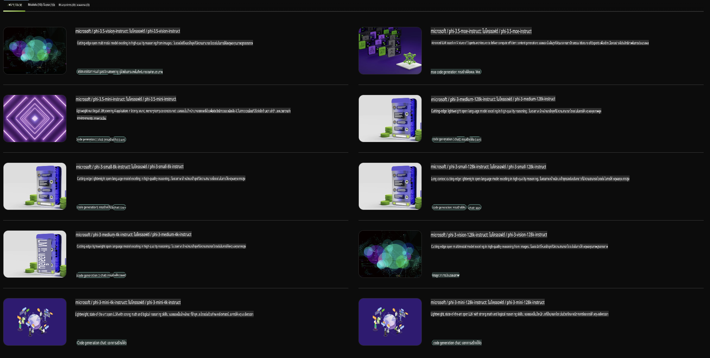

## ตระกูล Phi ใน NVIDIA NIM

NVIDIA NIM คือชุดไมโครเซอร์วิสที่ใช้งานง่าย ออกแบบมาเพื่อเร่งการใช้งานโมเดล AI เชิงสร้างสรรค์ในระบบคลาวด์ ศูนย์ข้อมูล และเวิร์กสเตชัน NIM ถูกจัดกลุ่มตามตระกูลโมเดลและโมเดลแต่ละตัว ตัวอย่างเช่น NVIDIA NIM สำหรับโมเดลภาษาขนาดใหญ่ (LLMs) นำพลังของ LLMs ที่ล้ำสมัยมาใช้กับแอปพลิเคชันสำหรับองค์กร โดยมอบความสามารถด้านการประมวลผลและความเข้าใจภาษาธรรมชาติที่ยอดเยี่ยม

NIM ทำให้ทีม IT และ DevOps สามารถโฮสต์โมเดลภาษาขนาดใหญ่ (LLMs) ได้ในสภาพแวดล้อมที่พวกเขาจัดการเอง ในขณะเดียวกันก็ยังมอบ API มาตรฐานอุตสาหกรรมให้กับนักพัฒนา เพื่อสร้างโคไพลอต แชทบอท และผู้ช่วย AI ที่สามารถเปลี่ยนแปลงธุรกิจของพวกเขาได้ ด้วยการใช้ประโยชน์จากการเร่งความเร็วด้วย GPU ของ NVIDIA และการปรับใช้งานที่สามารถขยายได้ NIM เสนอเส้นทางที่เร็วที่สุดสำหรับการอนุมานด้วยประสิทธิภาพที่เหนือชั้น

คุณสามารถใช้ NVIDIA NIM เพื่ออนุมานโมเดลในตระกูล Phi



### **ตัวอย่าง - Phi-3-Vision ใน NVIDIA NIM**

ลองจินตนาการว่าคุณมีภาพ (`demo.png`) และคุณต้องการสร้างโค้ด Python เพื่อประมวลผลภาพนี้และบันทึกเวอร์ชันใหม่ของมัน (`phi-3-vision.jpg`)

โค้ดข้างต้นทำงานโดยอัตโนมัติในกระบวนการนี้:

1. ตั้งค่าสภาพแวดล้อมและการกำหนดค่าที่จำเป็น
2. สร้างพรอมต์ที่สั่งให้โมเดลสร้างโค้ด Python ที่ต้องการ
3. ส่งพรอมต์ไปยังโมเดลและรวบรวมโค้ดที่สร้างขึ้น
4. ดึงและรันโค้ดที่สร้างขึ้น
5. แสดงภาพต้นฉบับและภาพที่ประมวลผลแล้ว

วิธีนี้ใช้พลังของ AI ในการทำให้งานประมวลผลภาพเป็นอัตโนมัติ ทำให้คุณสามารถบรรลุเป้าหมายได้ง่ายและรวดเร็วยิ่งขึ้น

[ตัวอย่างโค้ด](../../../../../code/06.E2E/E2E_Nvidia_NIM_Phi3_Vision.ipynb)

เรามาดูรายละเอียดของโค้ดทั้งหมดทีละขั้นตอน:

1. **ติดตั้งแพ็คเกจที่จำเป็น**:
    ```python
    !pip install langchain_nvidia_ai_endpoints -U
    ```
    คำสั่งนี้ติดตั้งแพ็คเกจ `langchain_nvidia_ai_endpoints` เพื่อให้แน่ใจว่าเป็นเวอร์ชันล่าสุด

2. **นำเข้าโมดูลที่จำเป็น**:
    ```python
    from langchain_nvidia_ai_endpoints import ChatNVIDIA
    import getpass
    import os
    import base64
    ```
    การนำเข้านี้นำโมดูลที่จำเป็นสำหรับการโต้ตอบกับ NVIDIA AI endpoints, การจัดการรหัสผ่านอย่างปลอดภัย, การโต้ตอบกับระบบปฏิบัติการ และการเข้ารหัส/ถอดรหัสข้อมูลในรูปแบบ base64

3. **ตั้งค่า API Key**:
    ```python
    if not os.getenv("NVIDIA_API_KEY"):
        os.environ["NVIDIA_API_KEY"] = getpass.getpass("Enter your NVIDIA API key: ")
    ```
    โค้ดนี้ตรวจสอบว่าได้ตั้งค่าตัวแปรสภาพแวดล้อม `NVIDIA_API_KEY` แล้วหรือไม่ หากไม่เป็นเช่นนั้น จะขอให้ผู้ใช้ป้อน API key อย่างปลอดภัย

4. **กำหนดโมเดลและเส้นทางของภาพ**:
    ```python
    model = 'microsoft/phi-3-vision-128k-instruct'
    chat = ChatNVIDIA(model=model)
    img_path = './imgs/demo.png'
    ```
    กำหนดโมเดลที่จะใช้ สร้างอินสแตนซ์ของ `ChatNVIDIA` พร้อมโมเดลที่ระบุ และกำหนดเส้นทางไปยังไฟล์ภาพ

5. **สร้างพรอมต์ข้อความ**:
    ```python
    text = "Please create Python code for image, and use plt to save the new picture under imgs/ and name it phi-3-vision.jpg."
    ```
    กำหนดพรอมต์ข้อความที่สั่งให้โมเดลสร้างโค้ด Python สำหรับประมวลผลภาพ

6. **เข้ารหัสภาพในรูปแบบ Base64**:
    ```python
    with open(img_path, "rb") as f:
        image_b64 = base64.b64encode(f.read()).decode()
    image = f''
    ```
    โค้ดนี้อ่านไฟล์ภาพ เข้ารหัสในรูปแบบ base64 และสร้างแท็ก HTML สำหรับภาพที่มีข้อมูลที่เข้ารหัส

7. **รวมข้อความและภาพเข้าด้วยกันในพรอมต์**:
    ```python
    prompt = f"{text} {image}"
    ```
    รวมข้อความพรอมต์และแท็ก HTML ของภาพเข้าด้วยกันในสตริงเดียว

8. **สร้างโค้ดโดยใช้ ChatNVIDIA**:
    ```python
    code = ""
    for chunk in chat.stream(prompt):
        print(chunk.content, end="")
        code += chunk.content
    ```
    โค้ดนี้ส่งพรอมต์ไปยัง `ChatNVIDIA` model and collects the generated code in chunks, printing and appending each chunk to the `code` สตริง

9. **ดึงโค้ด Python จากเนื้อหาที่สร้างขึ้น**:
    ```python
    begin = code.index('```python') + 9
    code = code[begin:]
    end = code.index('```')
    code = code[:end]
    ```
    ดึงโค้ด Python จริงจากเนื้อหาที่สร้างขึ้นโดยลบรูปแบบ markdown ออก

10. **รันโค้ดที่สร้างขึ้น**:
    ```python
    import subprocess
    result = subprocess.run(["python", "-c", code], capture_output=True)
    ```
    รันโค้ด Python ที่ดึงมาเป็น subprocess และจับผลลัพธ์

11. **แสดงภาพ**:
    ```python
    from IPython.display import Image, display
    display(Image(filename='./imgs/phi-3-vision.jpg'))
    display(Image(filename='./imgs/demo.png'))
    ```
    บรรทัดเหล่านี้แสดงภาพโดยใช้โมดูล `IPython.display`

**ข้อจำกัดความรับผิดชอบ**:  
เอกสารนี้ได้รับการแปลโดยใช้บริการแปลภาษาอัตโนมัติด้วย AI แม้ว่าเราจะพยายามอย่างเต็มที่เพื่อให้การแปลมีความถูกต้อง แต่โปรดทราบว่าการแปลอัตโนมัติอาจมีข้อผิดพลาดหรือความไม่แม่นยำ เอกสารต้นฉบับในภาษาต้นทางควรถือเป็นแหล่งข้อมูลที่เชื่อถือได้ สำหรับข้อมูลที่สำคัญ ขอแนะนำให้ใช้บริการแปลภาษามนุษย์ที่เป็นมืออาชีพ เราไม่รับผิดชอบต่อความเข้าใจผิดหรือการตีความที่ผิดพลาดซึ่งเกิดจากการใช้การแปลนี้