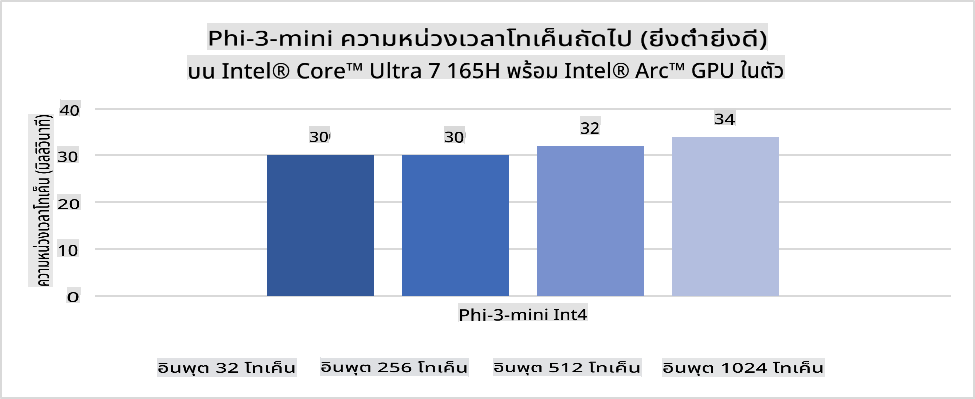
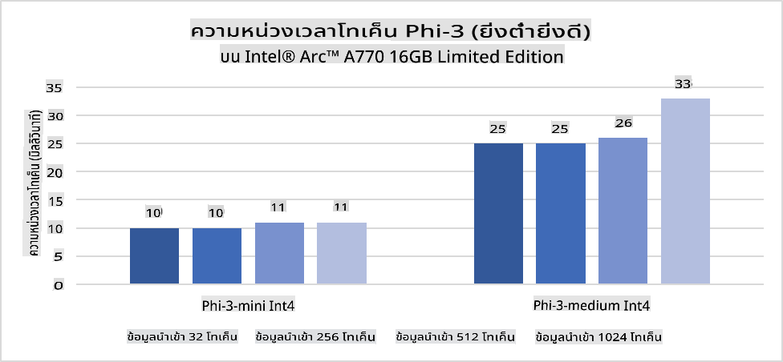
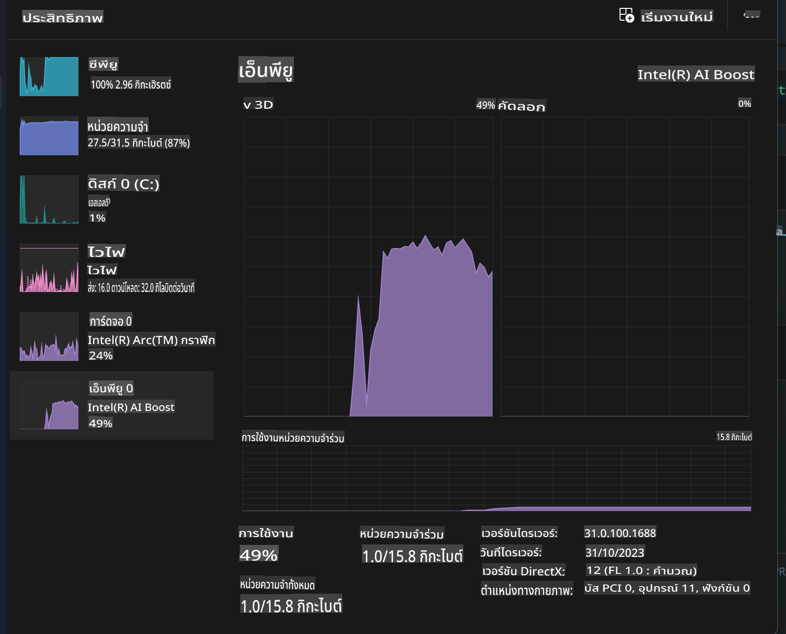
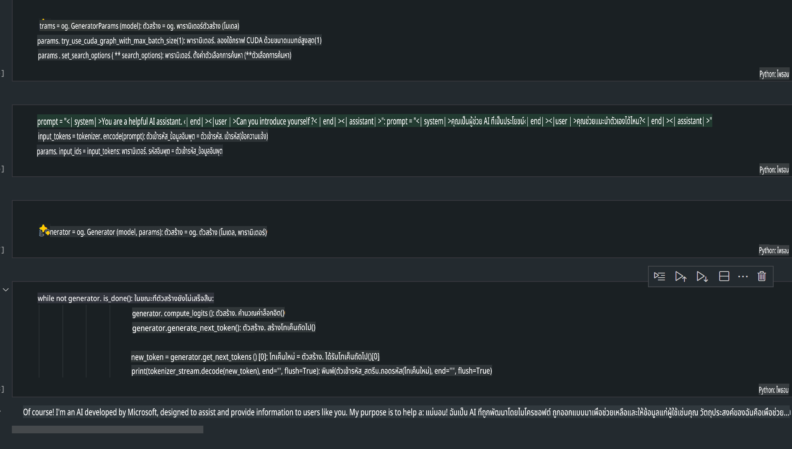
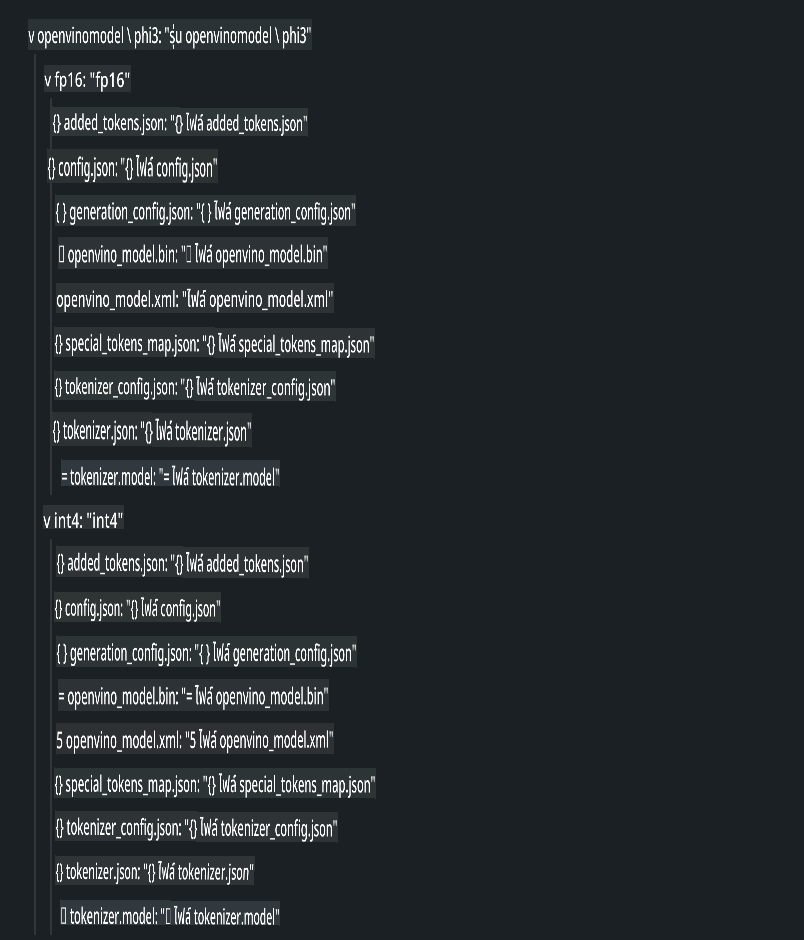
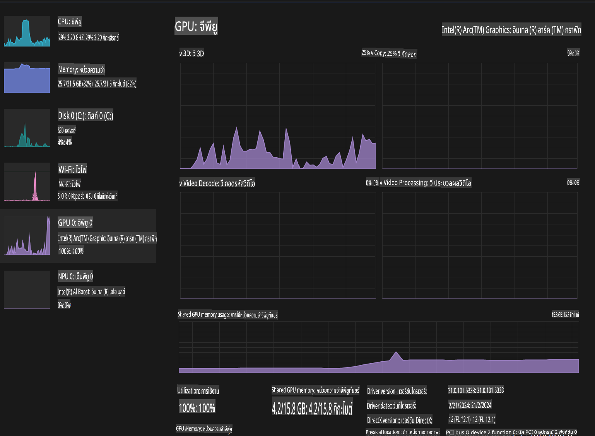

# **การใช้งาน Phi-3 บน AI PC**

ด้วยความก้าวหน้าของ Generative AI และการพัฒนาความสามารถของฮาร์ดแวร์ในอุปกรณ์ Edge ทำให้โมเดล Generative AI จำนวนมากสามารถถูกรวมเข้ากับอุปกรณ์ BYOD (Bring Your Own Device) ของผู้ใช้งานได้มากขึ้น AI PC เป็นหนึ่งในโมเดลเหล่านี้ ตั้งแต่ปี 2024 เป็นต้นไป Intel, AMD และ Qualcomm ได้ร่วมมือกับผู้ผลิต PC เพื่อเปิดตัว AI PC ที่สามารถใช้งานโมเดล Generative AI แบบโลคัลผ่านการปรับแต่งฮาร์ดแวร์ ในบทความนี้เราจะมุ่งเน้นไปที่ Intel AI PC และสำรวจวิธีการใช้งาน Phi-3 บน Intel AI PC

### NPU คืออะไร

NPU (Neural Processing Unit) เป็นโปรเซสเซอร์หรือหน่วยประมวลผลเฉพาะที่ออกแบบมาเพื่อเร่งการประมวลผลงานที่เกี่ยวข้องกับ Neural Network และ AI โดยเฉพาะ แตกต่างจาก CPU และ GPU ทั่วไป NPU ถูกออกแบบมาให้เหมาะสมกับการประมวลผลแบบขนานที่ขับเคลื่อนด้วยข้อมูล ทำให้มีประสิทธิภาพสูงในการจัดการข้อมูลมัลติมีเดียขนาดใหญ่ เช่น วิดีโอและภาพ รวมถึงการประมวลผลข้อมูลสำหรับ Neural Network โดยเฉพาะ NPU เหมาะสำหรับงานที่เกี่ยวข้องกับ AI เช่น การรู้จำเสียง การเบลอพื้นหลังในการสนทนาวิดีโอ และกระบวนการแก้ไขภาพหรือวิดีโอ เช่น การตรวจจับวัตถุ

## ความแตกต่างระหว่าง NPU และ GPU

แม้ว่างาน AI และ Machine Learning จำนวนมากจะรันบน GPU แต่ก็มีความแตกต่างสำคัญระหว่าง GPU และ NPU
GPU เป็นที่รู้จักในเรื่องความสามารถในการประมวลผลแบบขนาน แต่ไม่ใช่ GPU ทุกตัวจะมีประสิทธิภาพเท่าเทียมกันในงานที่นอกเหนือจากการประมวลผลกราฟิก ในขณะที่ NPU ถูกออกแบบมาเฉพาะสำหรับการคำนวณที่ซับซ้อนในงาน Neural Network ทำให้มีประสิทธิภาพสูงมากสำหรับงาน AI

สรุปได้ว่า NPU เปรียบเสมือนอัจฉริยะด้านคณิตศาสตร์ที่ช่วยเร่งการคำนวณ AI และมีบทบาทสำคัญในยุคใหม่ของ AI PC!

***ตัวอย่างนี้อ้างอิงจาก Intel Core Ultra Processor รุ่นล่าสุดของ Intel***

## **1. ใช้ NPU เพื่อรันโมเดล Phi-3**

Intel® NPU เป็นตัวเร่งการอนุมาน AI ที่ถูกรวมเข้ากับ CPU ของ Intel เริ่มตั้งแต่รุ่น Intel® Core™ Ultra (หรือที่รู้จักในชื่อ Meteor Lake) ช่วยให้การประมวลผลงาน Neural Network มีประสิทธิภาพด้านพลังงานมากขึ้น





**Intel NPU Acceleration Library**

Intel NPU Acceleration Library [https://github.com/intel/intel-npu-acceleration-library](https://github.com/intel/intel-npu-acceleration-library) เป็นไลบรารี Python ที่ออกแบบมาเพื่อเพิ่มประสิทธิภาพของแอปพลิเคชันโดยใช้พลังของ Intel NPU เพื่อเร่งการคำนวณบนฮาร์ดแวร์ที่รองรับ

ตัวอย่างการใช้งาน Phi-3-mini บน AI PC ที่ใช้ Intel® Core™ Ultra processors


ติดตั้งไลบรารี Python ด้วย pip

```bash

   pip install intel-npu-acceleration-library

```

***หมายเหตุ*** โครงการนี้ยังอยู่ระหว่างการพัฒนา แต่โมเดลอ้างอิงมีความสมบูรณ์ในระดับสูงแล้ว

### **การรัน Phi-3 ด้วย Intel NPU Acceleration Library**

การใช้การเร่งด้วย Intel NPU ไลบรารีนี้จะไม่ส่งผลกระทบต่อกระบวนการเข้ารหัสแบบดั้งเดิม คุณเพียงแค่ใช้ไลบรารีนี้เพื่อทำการ Quantize โมเดล Phi-3 ดั้งเดิม เช่น FP16, INT8, INT4 เช่น 

```python
from transformers import AutoTokenizer, pipeline,TextStreamer
from intel_npu_acceleration_library import NPUModelForCausalLM, int4
from intel_npu_acceleration_library.compiler import CompilerConfig
import warnings

model_id = "microsoft/Phi-3-mini-4k-instruct"

compiler_conf = CompilerConfig(dtype=int4)
model = NPUModelForCausalLM.from_pretrained(
    model_id, use_cache=True, config=compiler_conf, attn_implementation="sdpa"
).eval()

tokenizer = AutoTokenizer.from_pretrained(model_id)

text_streamer = TextStreamer(tokenizer, skip_prompt=True)
```

หลังจากการ Quantize สำเร็จ ให้ดำเนินการเรียกใช้ NPU เพื่อรันโมเดล Phi-3

```python
generation_args = {
   "max_new_tokens": 1024,
   "return_full_text": False,
   "temperature": 0.3,
   "do_sample": False,
   "streamer": text_streamer,
}

pipe = pipeline(
   "text-generation",
   model=model,
   tokenizer=tokenizer,
)

query = "<|system|>You are a helpful AI assistant.<|end|><|user|>Can you introduce yourself?<|end|><|assistant|>"

with warnings.catch_warnings():
    warnings.simplefilter("ignore")
    pipe(query, **generation_args)
```

เมื่อรันโค้ด คุณสามารถดูสถานะการทำงานของ NPU ผ่าน Task Manager



***ตัวอย่าง*** : [AIPC_NPU_DEMO.ipynb](../../../../../code/03.Inference/AIPC/AIPC_NPU_DEMO.ipynb)

## **2. ใช้ DirectML + ONNX Runtime เพื่อรันโมเดล Phi-3**

### **DirectML คืออะไร**

[DirectML](https://github.com/microsoft/DirectML) เป็นไลบรารี DirectX 12 ที่เร่งประสิทธิภาพและฮาร์ดแวร์สำหรับ Machine Learning DirectML ให้การเร่ง GPU สำหรับงาน Machine Learning ทั่วไปบนฮาร์ดแวร์และไดรเวอร์ที่รองรับอย่างกว้างขวาง รวมถึง GPU ที่รองรับ DirectX 12 จากผู้ผลิต เช่น AMD, Intel, NVIDIA และ Qualcomm

เมื่อใช้งานแยกกัน DirectML API เป็นไลบรารี DirectX 12 ระดับต่ำที่เหมาะสำหรับแอปพลิเคชันที่ต้องการประสิทธิภาพสูงและความหน่วงต่ำ เช่น เฟรมเวิร์ก เกม และแอปพลิเคชันแบบเรียลไทม์อื่น ๆ การทำงานร่วมกันอย่างไร้รอยต่อของ DirectML กับ Direct3D 12 รวมถึงค่าใช้จ่ายต่ำและความสอดคล้องระหว่างฮาร์ดแวร์ทำให้ DirectML เหมาะสำหรับการเร่ง Machine Learning เมื่อทั้งประสิทธิภาพสูงและความน่าเชื่อถือของผลลัพธ์ข้ามฮาร์ดแวร์มีความสำคัญ

***หมายเหตุ*** : DirectML รุ่นล่าสุดรองรับ NPU แล้ว (https://devblogs.microsoft.com/directx/introducing-neural-processor-unit-npu-support-in-directml-developer-preview/)

### เปรียบเทียบ DirectML และ CUDA ในแง่ของความสามารถและประสิทธิภาพ:

**DirectML** เป็นไลบรารี Machine Learning ที่พัฒนาโดย Microsoft ออกแบบมาเพื่อเร่งงาน Machine Learning บนอุปกรณ์ Windows เช่น เดสก์ท็อป แล็ปท็อป และอุปกรณ์ Edge
- พื้นฐาน DX12: DirectML ถูกสร้างขึ้นบน DirectX 12 (DX12) ซึ่งรองรับฮาร์ดแวร์ GPU ที่หลากหลาย รวมถึง NVIDIA และ AMD
- รองรับกว้างขวาง: เนื่องจากใช้ DX12 ทำให้ DirectML สามารถทำงานร่วมกับ GPU ใด ๆ ที่รองรับ DX12 แม้แต่ GPU แบบรวม
- การประมวลผลภาพ: DirectML ใช้ Neural Network ในการประมวลผลภาพและข้อมูลอื่น ๆ เหมาะสำหรับงาน เช่น การรู้จำภาพ การตรวจจับวัตถุ และอื่น ๆ
- ติดตั้งง่าย: การตั้งค่า DirectML เป็นเรื่องง่าย และไม่จำเป็นต้องใช้ SDK หรือไลบรารีเฉพาะจากผู้ผลิต GPU
- ประสิทธิภาพ: ในบางกรณี DirectML มีประสิทธิภาพดีและอาจเร็วกว่า CUDA โดยเฉพาะในงานบางประเภท
- ข้อจำกัด: อย่างไรก็ตาม มีบางกรณีที่ DirectML อาจช้ากว่า โดยเฉพาะงานที่ใช้ float16 ขนาดชุดข้อมูลใหญ่

**CUDA** เป็นแพลตฟอร์มการประมวลผลแบบขนานและโมเดลการเขียนโปรแกรมของ NVIDIA ช่วยให้นักพัฒนาสามารถใช้พลังของ GPU ของ NVIDIA ในการคำนวณทั่วไป รวมถึง Machine Learning และการจำลองทางวิทยาศาสตร์
- เฉพาะ NVIDIA: CUDA ถูกรวมเข้ากับ GPU ของ NVIDIA และออกแบบมาเพื่อฮาร์ดแวร์นี้โดยเฉพาะ
- ประสิทธิภาพสูง: ให้ประสิทธิภาพที่ยอดเยี่ยมสำหรับงานที่เร่งด้วย GPU โดยเฉพาะเมื่อใช้ GPU ของ NVIDIA
- ใช้กันอย่างแพร่หลาย: เฟรมเวิร์กและไลบรารี Machine Learning จำนวนมาก (เช่น TensorFlow และ PyTorch) รองรับ CUDA
- การปรับแต่ง: นักพัฒนาสามารถปรับแต่งการตั้งค่า CUDA ให้เหมาะสมกับงานเฉพาะเพื่อให้ได้ประสิทธิภาพสูงสุด
- ข้อจำกัด: อย่างไรก็ตาม การพึ่งพาฮาร์ดแวร์ NVIDIA อาจเป็นข้อจำกัดหากต้องการความเข้ากันได้ที่กว้างขึ้นกับ GPU อื่น ๆ

### การเลือกใช้ระหว่าง DirectML และ CUDA

การเลือกใช้งานระหว่าง DirectML และ CUDA ขึ้นอยู่กับกรณีการใช้งาน ฮาร์ดแวร์ที่มีอยู่ และความชอบส่วนตัว
หากคุณต้องการความเข้ากันได้ที่กว้างขึ้นและการตั้งค่าที่ง่าย DirectML อาจเป็นตัวเลือกที่ดี แต่ถ้าคุณมี GPU ของ NVIDIA และต้องการประสิทธิภาพที่ปรับแต่งได้ CUDA ยังคงเป็นตัวเลือกที่แข็งแกร่ง สรุปแล้ว ทั้ง DirectML และ CUDA มีจุดเด่นและจุดด้อยของตัวเอง ดังนั้นควรพิจารณาข้อกำหนดและฮาร์ดแวร์ที่มีอยู่ก่อนตัดสินใจ

### **Generative AI กับ ONNX Runtime**

ในยุคของ AI ความสามารถในการพกพาของโมเดล AI เป็นสิ่งสำคัญ ONNX Runtime สามารถช่วยให้โมเดลที่ได้รับการฝึกฝนแล้วถูก deploy ไปยังอุปกรณ์ต่าง ๆ ได้อย่างง่ายดาย นักพัฒนาไม่จำเป็นต้องใส่ใจกับเฟรมเวิร์กอนุมาน แต่สามารถใช้ API ที่เป็นเอกภาพเพื่อทำการอนุมานโมเดลได้ ในยุคของ Generative AI ONNX Runtime ได้รับการปรับปรุงโค้ด (https://onnxruntime.ai/docs/genai/) โมเดล Generative AI ที่ผ่านการ Quantize สามารถถูกอนุมานบนอุปกรณ์ต่าง ๆ ได้ผ่าน ONNX Runtime ที่ปรับแต่งแล้ว ใน Generative AI กับ ONNX Runtime คุณสามารถเรียกใช้ API โมเดล AI ผ่าน Python, C#, C / C++ และยังสามารถ deploy บน iPhone ได้โดยใช้ API ของ C++ กับ ONNX Runtime

[ตัวอย่างโค้ด](https://github.com/Azure-Samples/Phi-3MiniSamples/tree/main/onnx)

***คอมไพล์ Generative AI ด้วย ONNX Runtime ไลบรารี***

```bash

winget install --id=Kitware.CMake  -e

git clone https://github.com/microsoft/onnxruntime.git

cd .\onnxruntime\

./build.bat --build_shared_lib --skip_tests --parallel --use_dml --config Release

cd ../

git clone https://github.com/microsoft/onnxruntime-genai.git

cd .\onnxruntime-genai\

mkdir ort

cd ort

mkdir include

mkdir lib

copy ..\onnxruntime\include\onnxruntime\core\providers\dml\dml_provider_factory.h ort\include

copy ..\onnxruntime\include\onnxruntime\core\session\onnxruntime_c_api.h ort\include

copy ..\onnxruntime\build\Windows\Release\Release\*.dll ort\lib

copy ..\onnxruntime\build\Windows\Release\Release\onnxruntime.lib ort\lib

python build.py --use_dml


```

**ติดตั้งไลบรารี**

```bash

pip install .\onnxruntime_genai_directml-0.3.0.dev0-cp310-cp310-win_amd64.whl

```

นี่คือผลลัพธ์ที่ได้จากการรัน



***ตัวอย่าง*** : [AIPC_DirectML_DEMO.ipynb](../../../../../code/03.Inference/AIPC/AIPC_DirectML_DEMO.ipynb)

## **3. ใช้ Intel OpenVINO เพื่อรันโมเดล Phi-3**

### **OpenVINO คืออะไร**

[OpenVINO](https://github.com/openvinotoolkit/openvino) เป็นเครื่องมือโอเพ่นซอร์สสำหรับการปรับแต่งและ deploy โมเดล Deep Learning มันช่วยเพิ่มประสิทธิภาพของโมเดล Deep Learning สำหรับงานด้านภาพ เสียง และภาษา จากเฟรมเวิร์กยอดนิยม เช่น TensorFlow, PyTorch และอื่น ๆ เริ่มต้นใช้งาน OpenVINO ได้เลย OpenVINO ยังสามารถใช้ร่วมกับ CPU และ GPU เพื่อรันโมเดล Phi-3 ได้

***หมายเหตุ***: ปัจจุบัน OpenVINO ยังไม่รองรับ NPU

### **ติดตั้ง OpenVINO ไลบรารี**

```bash

 pip install git+https://github.com/huggingface/optimum-intel.git

 pip install git+https://github.com/openvinotoolkit/nncf.git

 pip install openvino-nightly

```

### **การรัน Phi-3 ด้วย OpenVINO**

เช่นเดียวกับ NPU OpenVINO ใช้โมเดลที่ผ่านการ Quantize เพื่อเรียกใช้งาน Generative AI เราจำเป็นต้องทำการ Quantize โมเดล Phi-3 ก่อน โดยใช้คำสั่งบน command line ผ่าน optimum-cli

**INT4**

```bash

optimum-cli export openvino --model "microsoft/Phi-3-mini-4k-instruct" --task text-generation-with-past --weight-format int4 --group-size 128 --ratio 0.6  --sym  --trust-remote-code ./openvinomodel/phi3/int4

```

**FP16**

```bash

optimum-cli export openvino --model "microsoft/Phi-3-mini-4k-instruct" --task text-generation-with-past --weight-format fp16 --trust-remote-code ./openvinomodel/phi3/fp16

```

รูปแบบที่แปลงแล้วจะมีลักษณะดังนี้



โหลด path ของโมเดล (model_dir) การตั้งค่าที่เกี่ยวข้อง (ov_config = {"PERFORMANCE_HINT": "LATENCY", "NUM_STREAMS": "1", "CACHE_DIR": ""}) และอุปกรณ์เร่งฮาร์ดแวร์ (GPU.0) ผ่าน OVModelForCausalLM

```python

ov_model = OVModelForCausalLM.from_pretrained(
     model_dir,
     device='GPU.0',
     ov_config=ov_config,
     config=AutoConfig.from_pretrained(model_dir, trust_remote_code=True),
     trust_remote_code=True,
)

```

เมื่อรันโค้ด คุณสามารถดูสถานะการทำงานของ GPU ผ่าน Task Manager



***ตัวอย่าง*** : [AIPC_OpenVino_Demo.ipynb](../../../../../code/03.Inference/AIPC/AIPC_OpenVino_Demo.ipynb)

### ***หมายเหตุ*** : วิธีการทั้งสามนี้มีข้อดีของตัวเอง แต่แนะนำให้ใช้ NPU acceleration สำหรับการอนุมานบน AI PC

**ข้อจำกัดความรับผิดชอบ**:  
เอกสารนี้ได้รับการแปลโดยใช้บริการแปลภาษาอัตโนมัติด้วย AI แม้ว่าเราจะพยายามอย่างเต็มที่เพื่อให้การแปลมีความถูกต้อง แต่โปรดทราบว่าการแปลอัตโนมัติอาจมีข้อผิดพลาดหรือความไม่ถูกต้อง เอกสารต้นฉบับในภาษาต้นทางควรถือเป็นแหล่งข้อมูลที่เชื่อถือได้ สำหรับข้อมูลที่สำคัญ แนะนำให้ใช้บริการแปลภาษามนุษย์มืออาชีพ เราจะไม่รับผิดชอบต่อความเข้าใจผิดหรือการตีความที่ผิดพลาดซึ่งเกิดจากการใช้การแปลนี้