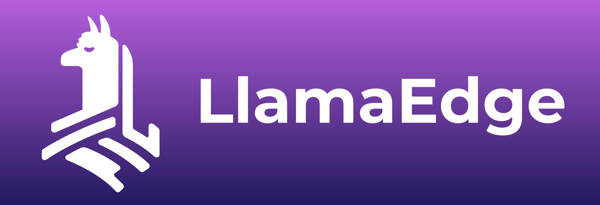
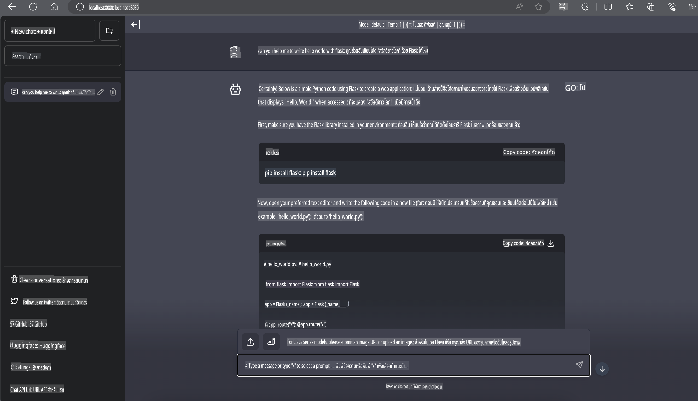

# **Inference Phi-3 บน Nvidia Jetson**

Nvidia Jetson เป็นซีรีส์ของบอร์ดคอมพิวเตอร์ฝังตัวจาก Nvidia โดย Jetson TK1, TX1 และ TX2 มาพร้อมกับโปรเซสเซอร์ Tegra (หรือ SoC) จาก Nvidia ที่รวม CPU สถาปัตยกรรม ARM ไว้ด้วย Jetson เป็นระบบที่ใช้พลังงานต่ำและถูกออกแบบมาเพื่อเร่งการทำงานของแอปพลิเคชันแมชชีนเลิร์นนิง Nvidia Jetson ถูกใช้โดยนักพัฒนามืออาชีพในการสร้างผลิตภัณฑ์ AI ที่ล้ำสมัยในทุกอุตสาหกรรม รวมถึงนักเรียนและผู้ที่สนใจสำหรับการเรียนรู้ AI เชิงปฏิบัติและการสร้างโปรเจกต์ที่น่าทึ่ง SLM ถูกใช้งานในอุปกรณ์ Edge เช่น Jetson ซึ่งช่วยให้การใช้งานแอปพลิเคชัน AI เชิงสร้างสรรค์ในอุตสาหกรรมเป็นไปได้ดียิ่งขึ้น

## การปรับใช้บน NVIDIA Jetson:
นักพัฒนาที่ทำงานเกี่ยวกับหุ่นยนต์อัตโนมัติและอุปกรณ์ฝังตัวสามารถใช้ Phi-3 Mini ได้ ขนาดที่เล็กของ Phi-3 ทำให้เหมาะสำหรับการใช้งานบนอุปกรณ์ Edge พารามิเตอร์ได้รับการปรับแต่งอย่างพิถีพิถันในระหว่างการฝึกอบรมเพื่อให้มั่นใจถึงความแม่นยำสูงในผลลัพธ์

### การปรับแต่ง TensorRT-LLM:
[Tensorrt-LLM library](https://github.com/NVIDIA/TensorRT-LLM?WT.mc_id=aiml-138114-kinfeylo) ของ NVIDIA ช่วยเพิ่มประสิทธิภาพการอนุมานโมเดลภาษาใหญ่ รองรับหน้าต่างบริบทที่ยาวของ Phi-3 Mini ซึ่งช่วยเพิ่มทั้งประสิทธิภาพและลดความหน่วงเวลา การปรับแต่งรวมถึงเทคนิคต่างๆ เช่น LongRoPE, FP8 และ inflight batching

### ความพร้อมใช้งานและการปรับใช้:
นักพัฒนาสามารถทดลองใช้ Phi-3 Mini พร้อมหน้าต่างบริบท 128K ได้ที่ [NVIDIA's AI](https://www.nvidia.com/en-us/ai-data-science/generative-ai/) ซึ่งมีในรูปแบบ NVIDIA NIM ไมโครเซอร์วิสพร้อม API มาตรฐานที่สามารถปรับใช้ได้ทุกที่ นอกจากนี้ยังสามารถดู [TensorRT-LLM implementations บน GitHub](https://github.com/NVIDIA/TensorRT-LLM)

## **1. การเตรียมตัว**

a. Jetson Orin NX / Jetson NX

b. JetPack 5.1.2+

c. Cuda 11.8

d. Python 3.8+

## **2. การรัน Phi-3 บน Jetson**

เราสามารถเลือกใช้ [Ollama](https://ollama.com) หรือ [LlamaEdge](https://llamaedge.com)

หากคุณต้องการใช้ gguf ทั้งในคลาวด์และอุปกรณ์ Edge พร้อมกัน LlamaEdge สามารถเข้าใจได้ว่าเป็น WasmEdge (WasmEdge เป็น runtime WebAssembly ที่เบา ประสิทธิภาพสูง และปรับขนาดได้ เหมาะสำหรับแอปพลิเคชันคลาวด์เนทีฟ, Edge และแอปพลิเคชันแบบกระจายตัว รองรับแอปพลิเคชัน Serverless, ฟังก์ชันฝังตัว, ไมโครเซอร์วิส, สมาร์ทคอนแทร็กต์ และอุปกรณ์ IoT คุณสามารถปรับใช้โมเดลเชิงปริมาณของ gguf ไปยังอุปกรณ์ Edge และคลาวด์ผ่าน LlamaEdge)



ขั้นตอนการใช้งานมีดังนี้

1. ติดตั้งและดาวน์โหลดไลบรารีและไฟล์ที่เกี่ยวข้อง

```bash

curl -sSf https://raw.githubusercontent.com/WasmEdge/WasmEdge/master/utils/install.sh | bash -s -- --plugin wasi_nn-ggml

curl -LO https://github.com/LlamaEdge/LlamaEdge/releases/latest/download/llama-api-server.wasm

curl -LO https://github.com/LlamaEdge/chatbot-ui/releases/latest/download/chatbot-ui.tar.gz

tar xzf chatbot-ui.tar.gz

```

**หมายเหตุ**: llama-api-server.wasm และ chatbot-ui ต้องอยู่ในไดเรกทอรีเดียวกัน

2. รันสคริปต์ในเทอร์มินัล

```bash

wasmedge --dir .:. --nn-preload default:GGML:AUTO:{Your gguf path} llama-api-server.wasm -p phi-3-chat

```

นี่คือตัวอย่างผลลัพธ์ที่ได้



***โค้ดตัวอย่าง*** [Phi-3 mini WASM Notebook Sample](https://github.com/Azure-Samples/Phi-3MiniSamples/tree/main/wasm)

สรุปได้ว่า Phi-3 Mini เป็นก้าวกระโดดสำคัญในด้านการสร้างโมเดลภาษา โดยผสมผสานประสิทธิภาพ การรับรู้บริบท และความเชี่ยวชาญด้านการปรับแต่งของ NVIDIA ไม่ว่าคุณจะสร้างหุ่นยนต์หรือแอปพลิเคชัน Edge Phi-3 Mini คือเครื่องมือที่ทรงพลังที่คุณควรรู้จัก

**ข้อจำกัดความรับผิดชอบ**:  
เอกสารนี้ได้รับการแปลโดยใช้บริการแปลภาษาอัตโนมัติที่ขับเคลื่อนด้วย AI แม้ว่าเราจะพยายามอย่างเต็มที่เพื่อความถูกต้อง โปรดทราบว่าการแปลอัตโนมัติอาจมีข้อผิดพลาดหรือความไม่ถูกต้องเกิดขึ้น เอกสารต้นฉบับในภาษาต้นทางควรถือเป็นแหล่งข้อมูลที่ถูกต้องที่สุด สำหรับข้อมูลที่สำคัญ แนะนำให้ใช้บริการแปลภาษาจากมนุษย์มืออาชีพ เราจะไม่รับผิดชอบต่อความเข้าใจผิดหรือการตีความผิดที่เกิดจากการใช้การแปลนี้