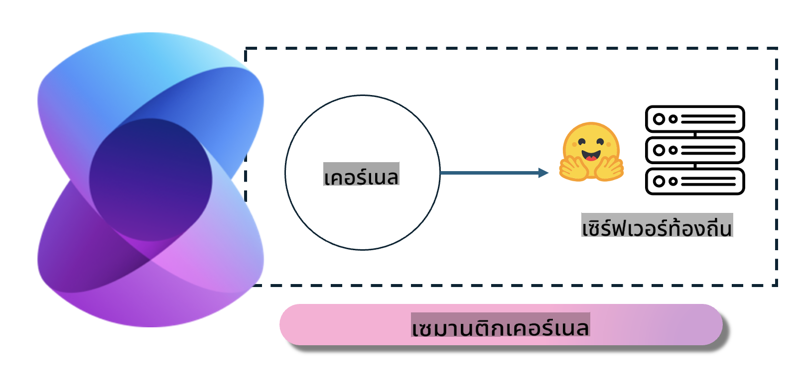
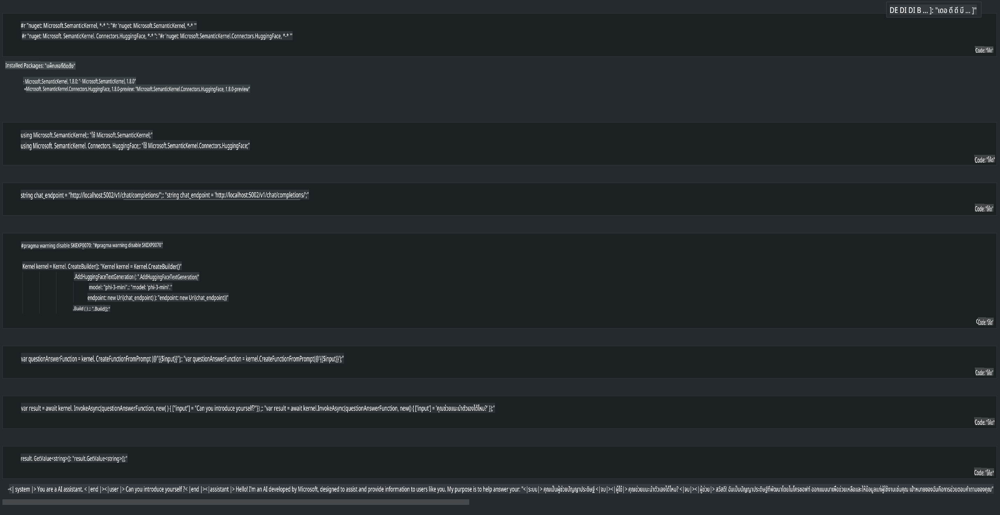

# **การใช้งาน Phi-3 บนเซิร์ฟเวอร์ในเครื่อง**

เราสามารถติดตั้ง Phi-3 บนเซิร์ฟเวอร์ในเครื่องได้ โดยผู้ใช้สามารถเลือกใช้ [Ollama](https://ollama.com) หรือ [LM Studio](https://llamaedge.com) หรือเขียนโค้ดของตนเองก็ได้ คุณสามารถเชื่อมต่อบริการ Phi-3 ในเครื่องผ่าน [Semantic Kernel](https://github.com/microsoft/semantic-kernel?WT.mc_id=aiml-138114-kinfeylo) หรือ [Langchain](https://www.langchain.com/) เพื่อสร้างแอปพลิเคชัน Copilot

## **การใช้ Semantic Kernel เพื่อเข้าถึง Phi-3-mini**

ในแอปพลิเคชัน Copilot เราสร้างแอปพลิเคชันผ่าน Semantic Kernel หรือ LangChain โดยกรอบการทำงานของแอปพลิเคชันประเภทนี้สามารถใช้งานร่วมกับ Azure OpenAI Service / OpenAI models ได้อย่างดี และยังรองรับโมเดลโอเพนซอร์สบน Hugging Face และโมเดลในเครื่องอีกด้วย แล้วเราจะทำอย่างไรหากต้องการใช้ Semantic Kernel เพื่อเข้าถึง Phi-3-mini? 

โดยใช้ .NET เป็นตัวอย่าง เราสามารถผสานรวมกับ Hugging Face Connector ใน Semantic Kernel ได้ โดยค่าเริ่มต้นสามารถเชื่อมต่อกับ model id บน Hugging Face (ครั้งแรกที่ใช้งานจะมีการดาวน์โหลดโมเดลจาก Hugging Face ซึ่งจะใช้เวลานาน) หรือสามารถเชื่อมต่อกับบริการในเครื่องที่ตั้งค่าไว้แล้วได้ เมื่อเปรียบเทียบทั้งสองวิธี เราแนะนำให้ใช้วิธีหลัง เพราะมีความยืดหยุ่นสูงกว่า โดยเฉพาะในกรณีการใช้งานในองค์กร

จากภาพ การเข้าถึงบริการในเครื่องผ่าน Semantic Kernel สามารถเชื่อมต่อกับเซิร์ฟเวอร์โมเดล Phi-3-mini ที่เราสร้างขึ้นเองได้อย่างง่ายดาย และนี่คือตัวอย่างผลลัพธ์ที่ได้

***โค้ดตัวอย่าง*** https://github.com/kinfey/Phi3MiniSamples/tree/main/semantickernel

**ข้อจำกัดความรับผิดชอบ**:  
เอกสารนี้ได้รับการแปลโดยใช้บริการแปลภาษาอัตโนมัติที่ขับเคลื่อนด้วย AI แม้ว่าเราจะพยายามให้การแปลมีความถูกต้อง แต่โปรดทราบว่าการแปลอัตโนมัติอาจมีข้อผิดพลาดหรือความไม่ถูกต้องเกิดขึ้น เอกสารต้นฉบับในภาษาต้นทางควรถูกพิจารณาเป็นแหล่งข้อมูลที่น่าเชื่อถือที่สุด สำหรับข้อมูลที่สำคัญ ขอแนะนำให้ใช้บริการแปลภาษามนุษย์ที่มีความเชี่ยวชาญ เราจะไม่รับผิดชอบต่อความเข้าใจผิดหรือการตีความที่ผิดพลาดซึ่งเกิดจากการใช้การแปลนี้