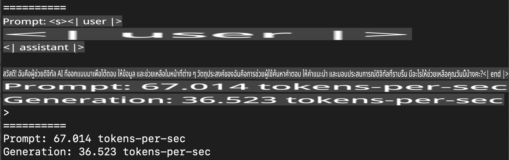
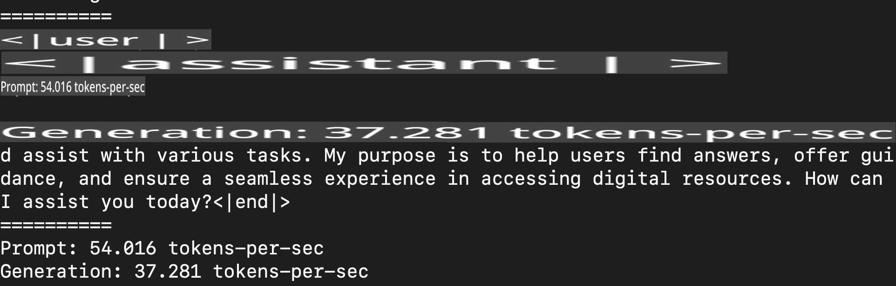
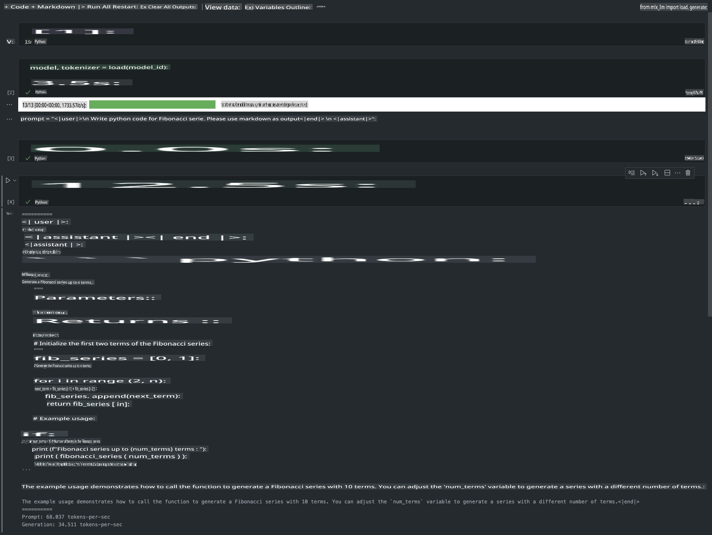

# **การใช้งาน Phi-3 กับ Apple MLX Framework**

## **MLX Framework คืออะไร**

MLX เป็นเฟรมเวิร์กสำหรับการวิจัยด้าน Machine Learning บน Apple Silicon ที่พัฒนาโดยทีมวิจัย Machine Learning ของ Apple

MLX ถูกออกแบบมาโดยนักวิจัยด้าน Machine Learning เพื่อให้นักวิจัยใช้งานได้อย่างสะดวก ตัวเฟรมเวิร์กมีเป้าหมายที่จะใช้งานง่ายแต่ยังคงประสิทธิภาพในการฝึกและใช้งานโมเดล และการออกแบบของ MLX เองก็มีความเรียบง่ายในเชิงแนวคิด เราต้องการให้นักวิจัยสามารถขยายและปรับปรุง MLX ได้ง่าย เพื่อทดลองแนวคิดใหม่ๆ ได้อย่างรวดเร็ว

LLMs สามารถถูกเร่งความเร็วบนอุปกรณ์ Apple Silicon ผ่าน MLX และสามารถรันโมเดลในเครื่องได้อย่างสะดวกมาก

## **การใช้งาน MLX เพื่อรัน Phi-3-mini**

### **1. ตั้งค่า MLX Environment**

1. Python 3.11.x  
2. ติดตั้ง MLX Library  

```bash

pip install mlx-lm

```

### **2. รัน Phi-3-mini บน Terminal ด้วย MLX**

```bash

python -m mlx_lm.generate --model microsoft/Phi-3-mini-4k-instruct --max-token 2048 --prompt  "<|user|>\nCan you introduce yourself<|end|>\n<|assistant|>"

```

ผลลัพธ์ (ในสภาพแวดล้อมของฉัน: Apple M1 Max, 64GB) คือ



### **3. การ Quantize Phi-3-mini ด้วย MLX บน Terminal**

```bash

python -m mlx_lm.convert --hf-path microsoft/Phi-3-mini-4k-instruct

```

***หมายเหตุ:*** สามารถทำการ Quantize โมเดลได้ผ่าน mlx_lm.convert โดยค่าเริ่มต้นจะเป็น INT4 ตัวอย่างนี้ทำการ Quantize Phi-3-mini เป็น INT4

โมเดลสามารถถูก Quantize ผ่าน mlx_lm.convert และค่าเริ่มต้นของการ Quantize คือ INT4 ตัวอย่างนี้เป็นการ Quantize Phi-3-mini เป็น INT4 หลังจากทำการ Quantize แล้ว โมเดลจะถูกเก็บไว้ในไดเรกทอรีเริ่มต้น ./mlx_model  

เราสามารถทดสอบโมเดลที่ถูก Quantize ด้วย MLX จาก Terminal ได้  

```bash

python -m mlx_lm.generate --model ./mlx_model/ --max-token 2048 --prompt  "<|user|>\nCan you introduce yourself<|end|>\n<|assistant|>"

```

ผลลัพธ์คือ



### **4. รัน Phi-3-mini ด้วย MLX บน Jupyter Notebook**



***หมายเหตุ:*** โปรดอ่านตัวอย่างนี้ [คลิกที่ลิงก์นี้](../../../../../code/03.Inference/MLX/MLX_DEMO.ipynb)

## **แหล่งข้อมูล**

1. เรียนรู้เกี่ยวกับ Apple MLX Framework [https://ml-explore.github.io](https://ml-explore.github.io/mlx/build/html/index.html)

2. Apple MLX GitHub Repo [https://github.com/ml-explore](https://github.com/ml-explore)

**ข้อจำกัดความรับผิดชอบ**:  
เอกสารนี้ได้รับการแปลโดยใช้บริการแปลภาษาอัตโนมัติด้วย AI แม้ว่าเราจะพยายามอย่างเต็มที่เพื่อความถูกต้อง แต่โปรดทราบว่าการแปลโดยระบบอัตโนมัติอาจมีข้อผิดพลาดหรือความไม่ถูกต้อง เอกสารต้นฉบับในภาษาต้นฉบับควรถูกพิจารณาว่าเป็นแหล่งข้อมูลที่เชื่อถือได้ที่สุด สำหรับข้อมูลที่มีความสำคัญ ขอแนะนำให้ใช้บริการแปลภาษาจากมนุษย์ที่เป็นมืออาชีพ เราไม่รับผิดชอบต่อความเข้าใจผิดหรือการตีความที่ผิดพลาดซึ่งเกิดจากการใช้การแปลนี้