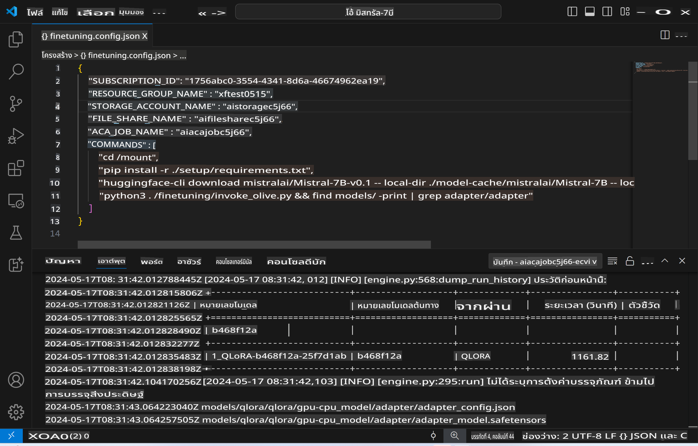
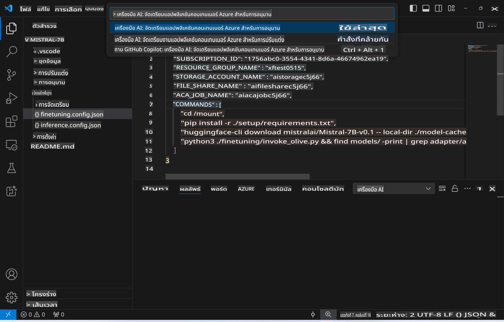
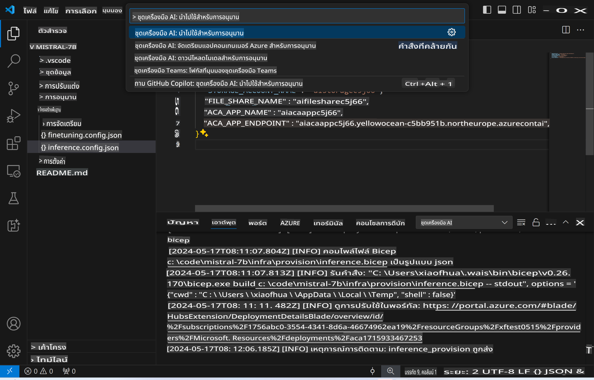
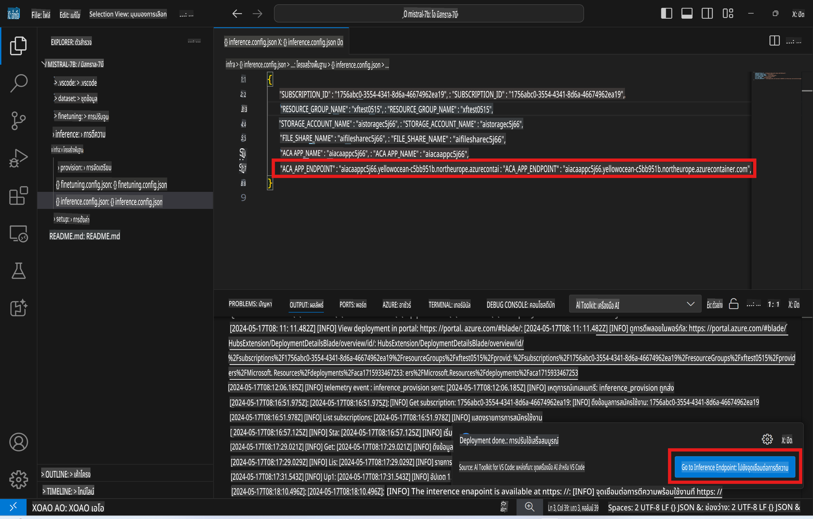

# การประมวลผลระยะไกลด้วยโมเดลที่ผ่านการปรับแต่ง

หลังจากที่ตัวปรับแต่ง (adapters) ถูกฝึกในสภาพแวดล้อมระยะไกลแล้ว คุณสามารถใช้แอปพลิเคชัน Gradio แบบง่ายเพื่อโต้ตอบกับโมเดลได้



### การจัดเตรียมทรัพยากรบน Azure
คุณต้องตั้งค่าทรัพยากรบน Azure สำหรับการประมวลผลระยะไกล โดยการเรียกใช้คำสั่ง `AI Toolkit: Provision Azure Container Apps for inference` จาก command palette ระหว่างการตั้งค่านี้ คุณจะถูกขอให้เลือก Subscription และ resource group บน Azure  

   
ตามค่าเริ่มต้น Subscription และ resource group ที่ใช้สำหรับการประมวลผลควรตรงกับที่ใช้ในการปรับแต่งโมเดล การประมวลผลจะใช้ Azure Container App Environment เดียวกัน และเข้าถึงโมเดลและตัวปรับแต่งโมเดลที่ถูกจัดเก็บใน Azure Files ซึ่งถูกสร้างขึ้นในขั้นตอนการปรับแต่ง

## การใช้งาน AI Toolkit 

### การปรับใช้สำหรับการประมวลผล  
หากคุณต้องการแก้ไขโค้ดการประมวลผลหรือโหลดโมเดลใหม่อีกครั้ง ให้เรียกใช้คำสั่ง `AI Toolkit: Deploy for inference` ซึ่งจะทำการซิงโครไนซ์โค้ดล่าสุดของคุณกับ ACA และรีสตาร์ท replica  



เมื่อการปรับใช้เสร็จสมบูรณ์ โมเดลก็พร้อมสำหรับการประเมินผลผ่าน endpoint นี้

### การเข้าถึง Inference API

คุณสามารถเข้าถึง Inference API ได้โดยการคลิกปุ่ม "*Go to Inference Endpoint*" ที่แสดงในการแจ้งเตือนของ VSCode หรือค้นหา web API endpoint ได้ที่ `ACA_APP_ENDPOINT` ใน `./infra/inference.config.json` และใน output panel



> **หมายเหตุ:** Endpoint สำหรับการประมวลผลอาจใช้เวลาสักครู่ก่อนที่จะพร้อมใช้งานเต็มที่

## ส่วนประกอบของการประมวลผลที่รวมอยู่ในเทมเพลต
 
| โฟลเดอร์ | เนื้อหา |
| ------ |--------- |
| `infra` | รวมการตั้งค่าทั้งหมดที่จำเป็นสำหรับการทำงานระยะไกล |
| `infra/provision/inference.parameters.json` | เก็บพารามิเตอร์สำหรับ bicep templates ที่ใช้สำหรับการจัดเตรียมทรัพยากร Azure สำหรับการประมวลผล |
| `infra/provision/inference.bicep` | รวมเทมเพลตสำหรับการจัดเตรียมทรัพยากร Azure สำหรับการประมวลผล |
| `infra/inference.config.json` | ไฟล์การตั้งค่าที่ถูกสร้างโดยคำสั่ง `AI Toolkit: Provision Azure Container Apps for inference` ใช้เป็นอินพุตสำหรับ command palette อื่น ๆ ที่เกี่ยวข้องกับการทำงานระยะไกล |

### การใช้ AI Toolkit ในการตั้งค่าการจัดเตรียมทรัพยากร Azure
ตั้งค่า [AI Toolkit](https://marketplace.visualstudio.com/items?itemName=ms-windows-ai-studio.windows-ai-studio)

จัดเตรียม Azure Container Apps สำหรับการประมวลผล ` command.

You can find configuration parameters in `./infra/provision/inference.parameters.json` file. Here are the details:
| Parameter | Description |
| --------- |------------ |
| `defaultCommands` | This is the commands to initiate a web API. |
| `maximumInstanceCount` | This parameter sets the maximum capacity of GPU instances. |
| `location` | This is the location where Azure resources are provisioned. The default value is the same as the chosen resource group's location. |
| `storageAccountName`, `fileShareName` `acaEnvironmentName`, `acaEnvironmentStorageName`, `acaAppName`,  `acaLogAnalyticsName` | These parameters are used to name the Azure resources for provision. By default, they will be same to the fine-tuning resource name. You can input a new, unused resource name to create your own custom-named resources, or you can input the name of an already existing Azure resource if you'd prefer to use that. For details, refer to the section [Using existing Azure Resources](../../../../../md/01.Introduction/03). |

### Using Existing Azure Resources

By default, the inference provision use the same Azure Container App Environment, Storage Account, Azure File Share, and Azure Log Analytics that were used for fine-tuning. A separate Azure Container App is created solely for the inference API. 

If you have customized the Azure resources during the fine-tuning step or want to use your own existing Azure resources for inference, specify their names in the `./infra/inference.parameters.json` file จากนั้นเรียกใช้คำสั่ง `AI Toolkit: Provision Azure Container Apps for inference` จาก command palette การดำเนินการนี้จะอัปเดตทรัพยากรที่ระบุและสร้างทรัพยากรที่ยังไม่มี

ตัวอย่างเช่น หากคุณมี Azure container environment อยู่แล้ว ไฟล์ `./infra/finetuning.parameters.json` ของคุณควรมีลักษณะดังนี้:

```json
{
    "$schema": "https://schema.management.azure.com/schemas/2019-04-01/deploymentParameters.json#",
    "contentVersion": "1.0.0.0",
    "parameters": {
      ...
      "acaEnvironmentName": {
        "value": "<your-aca-env-name>"
      },
      "acaEnvironmentStorageName": {
        "value": null
      },
      ...
    }
  }
```

### การจัดเตรียมแบบ Manual  
หากคุณต้องการตั้งค่าทรัพยากร Azure ด้วยตัวเอง คุณสามารถใช้ไฟล์ bicep ที่ให้มาใน `./infra/provision` folders. If you have already set up and configured all the Azure resources without using the AI Toolkit command palette, you can simply enter the resource names in the `inference.config.json` file

ตัวอย่างเช่น:

```json
{
  "SUBSCRIPTION_ID": "<your-subscription-id>",
  "RESOURCE_GROUP_NAME": "<your-resource-group-name>",
  "STORAGE_ACCOUNT_NAME": "<your-storage-account-name>",
  "FILE_SHARE_NAME": "<your-file-share-name>",
  "ACA_APP_NAME": "<your-aca-name>",
  "ACA_APP_ENDPOINT": "<your-aca-endpoint>"
}
```

**ข้อจำกัดความรับผิดชอบ**:  
เอกสารฉบับนี้ได้รับการแปลโดยใช้บริการแปลภาษาอัตโนมัติด้วย AI แม้ว่าเราจะพยายามอย่างเต็มที่เพื่อความถูกต้อง แต่โปรดทราบว่าการแปลอัตโนมัติอาจมีข้อผิดพลาดหรือความไม่ถูกต้อง เอกสารต้นฉบับในภาษาต้นทางควรถือเป็นแหล่งข้อมูลที่ถูกต้องที่สุด สำหรับข้อมูลที่สำคัญ ขอแนะนำให้ใช้บริการแปลภาษามนุษย์ที่เป็นมืออาชีพ เราจะไม่รับผิดชอบต่อความเข้าใจผิดหรือการตีความที่คลาดเคลื่อนอันเกิดจากการใช้การแปลนี้