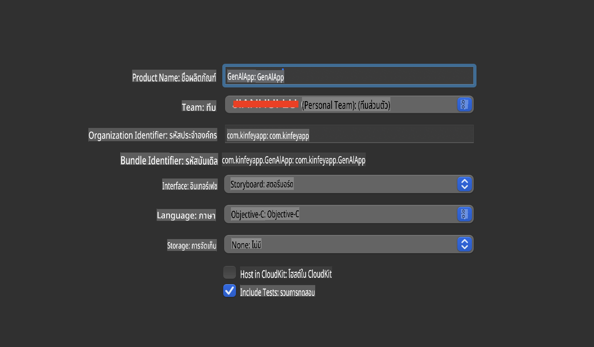
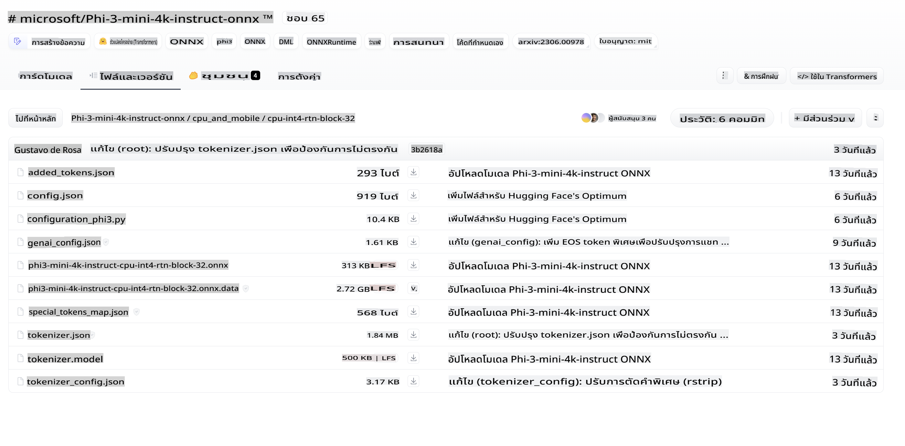
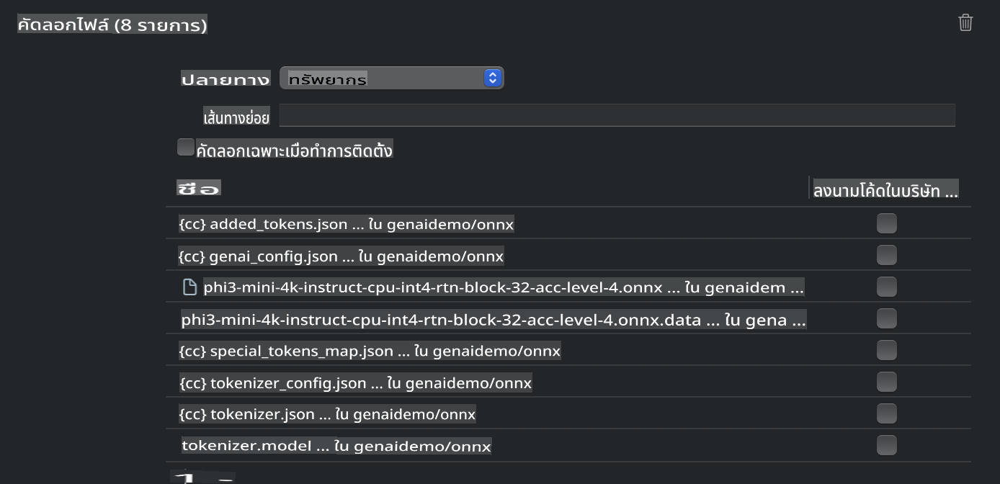
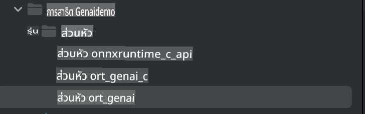
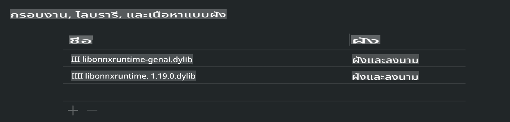
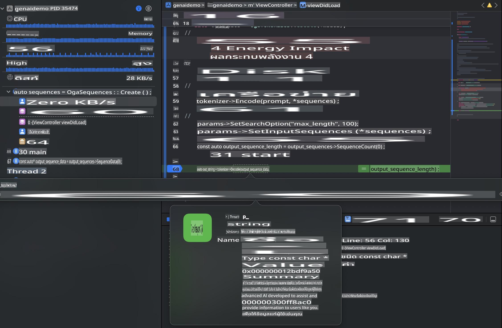

# **Inference Phi-3 บน iOS**

Phi-3-mini เป็นซีรีส์ใหม่ของโมเดลจาก Microsoft ที่ช่วยให้สามารถใช้งานโมเดลภาษาใหญ่ (LLMs) บนอุปกรณ์ปลายทางและอุปกรณ์ IoT ได้ Phi-3-mini รองรับการใช้งานบน iOS, Android และอุปกรณ์ Edge ช่วยให้สามารถใช้งาน AI สร้างสรรค์ในสภาพแวดล้อม BYOD ตัวอย่างต่อไปนี้จะแสดงวิธีการใช้งาน Phi-3-mini บน iOS

## **1. การเตรียมตัว**

- **a.** macOS 14 ขึ้นไป  
- **b.** Xcode 15 ขึ้นไป  
- **c.** iOS SDK 17.x (iPhone 14 A16 หรือสูงกว่า)  
- **d.** ติดตั้ง Python 3.10 ขึ้นไป (แนะนำให้ใช้ Conda)  
- **e.** ติดตั้งไลบรารี Python: `python-flatbuffers`  
- **f.** ติดตั้ง CMake  

### Semantic Kernel และการ Inference

Semantic Kernel เป็นเฟรมเวิร์กสำหรับสร้างแอปพลิเคชันที่รองรับ Azure OpenAI Service, โมเดลของ OpenAI และแม้แต่โมเดลที่รันในเครื่อง การเข้าถึงบริการในเครื่องผ่าน Semantic Kernel ช่วยให้สามารถผสานรวมกับเซิร์ฟเวอร์ Phi-3-mini ที่คุณโฮสต์เองได้อย่างง่ายดาย

### การเรียกใช้งานโมเดลที่ถูก Quantized ด้วย Ollama หรือ LlamaEdge

ผู้ใช้งานหลายคนชอบใช้โมเดลที่ถูก Quantized เพื่อรันในเครื่อง [Ollama](https://ollama.com) และ [LlamaEdge](https://llamaedge.com) ช่วยให้คุณสามารถเรียกใช้โมเดล Quantized ต่างๆ ได้:

#### **Ollama**

คุณสามารถรัน `ollama run phi3` โดยตรงหรือกำหนดค่าแบบออฟไลน์ สร้าง Modelfile พร้อมเส้นทางไปยังไฟล์ `gguf` ตัวอย่างโค้ดสำหรับการรันโมเดล Phi-3-mini แบบ Quantized:

```gguf
FROM {Add your gguf file path}
TEMPLATE \"\"\"<|user|> .Prompt<|end|> <|assistant|>\"\"\"
PARAMETER stop <|end|>
PARAMETER num_ctx 4096
```

#### **LlamaEdge**

หากคุณต้องการใช้ `gguf` ทั้งบนคลาวด์และอุปกรณ์ปลายทางพร้อมกัน LlamaEdge เป็นตัวเลือกที่ดี

## **2. การคอมไพล์ ONNX Runtime สำหรับ iOS**

```bash

git clone https://github.com/microsoft/onnxruntime.git

cd onnxruntime

./build.sh --build_shared_lib --ios --skip_tests --parallel --build_dir ./build_ios --ios --apple_sysroot iphoneos --osx_arch arm64 --apple_deploy_target 17.5 --cmake_generator Xcode --config Release

cd ../

```

### **ข้อควรทราบ**

- **a.** ก่อนการคอมไพล์ ตรวจสอบให้แน่ใจว่าได้ตั้งค่า Xcode อย่างถูกต้อง และตั้งให้เป็น active developer directory ในเทอร์มินัล:

    ```bash
    sudo xcode-select -switch /Applications/Xcode.app/Contents/Developer
    ```

- **b.** ONNX Runtime จำเป็นต้องถูกคอมไพล์สำหรับแพลตฟอร์มที่แตกต่างกัน สำหรับ iOS คุณสามารถคอมไพล์สำหรับ `arm64` or `x86_64`

- **c.** แนะนำให้ใช้ iOS SDK เวอร์ชันล่าสุดสำหรับการคอมไพล์ อย่างไรก็ตาม คุณสามารถใช้เวอร์ชันเก่ากว่าได้หากต้องการความเข้ากันได้กับ SDK ก่อนหน้า

## **3. การคอมไพล์ Generative AI ด้วย ONNX Runtime สำหรับ iOS**

> **Note:** เนื่องจาก Generative AI ด้วย ONNX Runtime ยังอยู่ในช่วงพรีวิว โปรดทราบถึงความเปลี่ยนแปลงที่อาจเกิดขึ้น

```bash

git clone https://github.com/microsoft/onnxruntime-genai
 
cd onnxruntime-genai
 
mkdir ort
 
cd ort
 
mkdir include
 
mkdir lib
 
cd ../
 
cp ../onnxruntime/include/onnxruntime/core/session/onnxruntime_c_api.h ort/include
 
cp ../onnxruntime/build_ios/Release/Release-iphoneos/libonnxruntime*.dylib* ort/lib
 
export OPENCV_SKIP_XCODEBUILD_FORCE_TRYCOMPILE_DEBUG=1
 
python3 build.py --parallel --build_dir ./build_ios --ios --ios_sysroot iphoneos --ios_arch arm64 --ios_deployment_target 17.5 --cmake_generator Xcode --cmake_extra_defines CMAKE_XCODE_ATTRIBUTE_CODE_SIGNING_ALLOWED=NO

```

## **4. สร้างแอปพลิเคชันใน Xcode**

ฉันเลือก Objective-C เป็นวิธีการพัฒนาแอป เพราะการใช้ Generative AI กับ ONNX Runtime C++ API นั้น Objective-C เข้ากันได้ดีกว่า แน่นอนว่าคุณสามารถทำการเรียกใช้งานที่เกี่ยวข้องผ่าน Swift bridging ได้เช่นกัน



## **5. คัดลอกโมเดล ONNX แบบ Quantized INT4 ไปยังโปรเจกต์แอปพลิเคชัน**

เราจำเป็นต้องนำเข้าโมเดลแบบ Quantization INT4 ในรูปแบบ ONNX ซึ่งต้องดาวน์โหลดมาก่อน



หลังจากดาวน์โหลดแล้ว คุณต้องเพิ่มมันไปยังไดเรกทอรี Resources ของโปรเจกต์ใน Xcode



## **6. การเพิ่ม C++ API ใน ViewControllers**

> **ข้อควรทราบ:**

- **a.** เพิ่มไฟล์เฮดเดอร์ C++ ที่เกี่ยวข้องลงในโปรเจกต์

  

- **b.** รวม `onnxruntime-genai` dynamic library in Xcode.

  

- **c.** Use the C Samples code for testing. You can also add additional features like ChatUI for more functionality.

- **d.** Since you need to use C++ in your project, rename `ViewController.m` to `ViewController.mm` เพื่อเปิดใช้งาน Objective-C++

```objc

    NSString *llmPath = [[NSBundle mainBundle] resourcePath];
    char const *modelPath = llmPath.cString;

    auto model =  OgaModel::Create(modelPath);

    auto tokenizer = OgaTokenizer::Create(*model);

    const char* prompt = "<|system|>You are a helpful AI assistant.<|end|><|user|>Can you introduce yourself?<|end|><|assistant|>";

    auto sequences = OgaSequences::Create();
    tokenizer->Encode(prompt, *sequences);

    auto params = OgaGeneratorParams::Create(*model);
    params->SetSearchOption("max_length", 100);
    params->SetInputSequences(*sequences);

    auto output_sequences = model->Generate(*params);
    const auto output_sequence_length = output_sequences->SequenceCount(0);
    const auto* output_sequence_data = output_sequences->SequenceData(0);
    auto out_string = tokenizer->Decode(output_sequence_data, output_sequence_length);
    
    auto tmp = out_string;

```

## **7. การรันแอปพลิเคชัน**

เมื่อการตั้งค่าทั้งหมดเสร็จสมบูรณ์ คุณสามารถรันแอปพลิเคชันเพื่อดูผลลัพธ์ของการ Inference โมเดล Phi-3-mini



สำหรับตัวอย่างโค้ดเพิ่มเติมและคำแนะนำอย่างละเอียด โปรดเยี่ยมชม [Phi-3 Mini Samples repository](https://github.com/Azure-Samples/Phi-3MiniSamples/tree/main/ios)

**ข้อจำกัดความรับผิดชอบ**:  
เอกสารฉบับนี้ได้รับการแปลโดยใช้บริการแปลภาษาโดยปัญญาประดิษฐ์ แม้ว่าเราจะพยายามให้การแปลมีความถูกต้อง แต่โปรดทราบว่าการแปลโดยอัตโนมัติอาจมีข้อผิดพลาดหรือความไม่ถูกต้องเกิดขึ้น เอกสารต้นฉบับในภาษาต้นทางควรถูกพิจารณาเป็นแหล่งข้อมูลที่เชื่อถือได้ สำหรับข้อมูลสำคัญ แนะนำให้ใช้บริการแปลภาษามนุษย์ที่เป็นมืออาชีพ เราจะไม่รับผิดชอบต่อความเข้าใจผิดหรือการตีความที่คลาดเคลื่อนซึ่งเกิดจากการใช้การแปลนี้