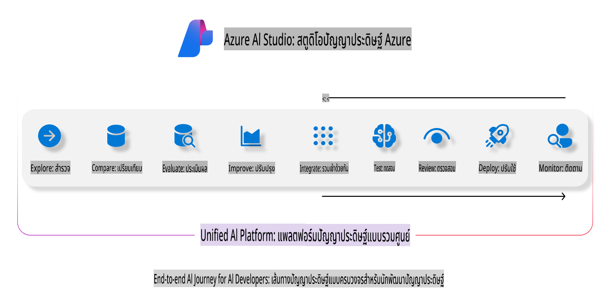
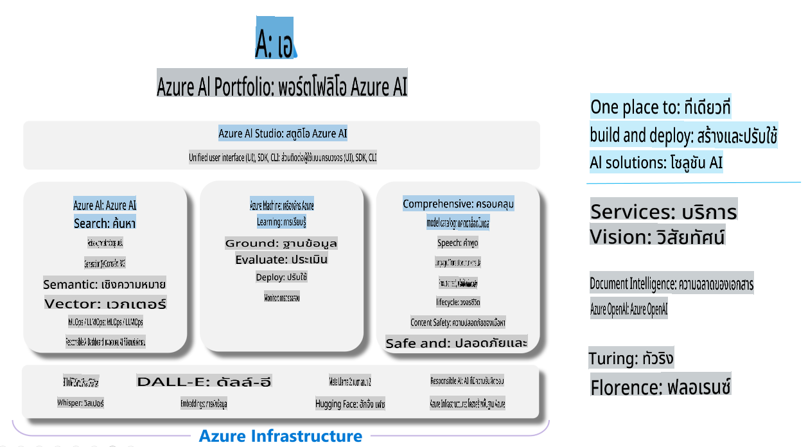

# **การใช้ Azure AI Foundry เพื่อการประเมินผล**

วิธีประเมินผลแอปพลิเคชัน AI เชิงสร้างสรรค์ของคุณด้วย [Azure AI Foundry](https://ai.azure.com?WT.mc_id=aiml-138114-kinfeylo) ไม่ว่าคุณจะประเมินการสนทนาแบบครั้งเดียวหรือหลายครั้ง Azure AI Foundry มีเครื่องมือสำหรับประเมินประสิทธิภาพและความปลอดภัยของโมเดล

## วิธีประเมินแอป AI เชิงสร้างสรรค์ด้วย Azure AI Foundry
สำหรับคำแนะนำโดยละเอียดเพิ่มเติม ดูที่ [Azure AI Foundry Documentation](https://learn.microsoft.com/azure/ai-studio/how-to/evaluate-generative-ai-app?WT.mc_id=aiml-138114-kinfeylo)

นี่คือขั้นตอนเริ่มต้น:

## การประเมินโมเดล AI เชิงสร้างสรรค์ใน Azure AI Foundry

**ข้อกำหนดเบื้องต้น**

- ชุดข้อมูลทดสอบในรูปแบบ CSV หรือ JSON
- โมเดล AI เชิงสร้างสรรค์ที่ได้ถูกปรับใช้แล้ว (เช่น Phi-3, GPT 3.5, GPT 4 หรือ Davinci models)
- Runtime พร้อมอินสแตนซ์การประมวลผลสำหรับการรันการประเมินผล

## ตัวชี้วัดการประเมินที่มีอยู่ในตัว

Azure AI Foundry ช่วยให้คุณสามารถประเมินทั้งการสนทนาแบบครั้งเดียวและแบบซับซ้อนที่มีหลายครั้ง  
สำหรับสถานการณ์ Retrieval Augmented Generation (RAG) ซึ่งโมเดลอิงข้อมูลเฉพาะ คุณสามารถประเมินประสิทธิภาพได้ด้วยตัวชี้วัดการประเมินที่มีอยู่ในตัว  
นอกจากนี้ คุณยังสามารถประเมินสถานการณ์ตอบคำถามแบบครั้งเดียวทั่วไป (ที่ไม่ใช่ RAG) ได้อีกด้วย

## การสร้างการรันการประเมิน

จาก UI ของ Azure AI Foundry ไปที่หน้า Evaluate หรือ Prompt Flow  
ทำตามขั้นตอนในตัวช่วยสร้างการสร้างการประเมินเพื่อเริ่มการรันการประเมิน ตั้งชื่อการประเมินของคุณ (ถ้าต้องการ)  
เลือกสถานการณ์ที่สอดคล้องกับเป้าหมายของแอปพลิเคชันของคุณ  
เลือกตัวชี้วัดการประเมินหนึ่งรายการหรือมากกว่านั้นเพื่อประเมินผลลัพธ์ของโมเดล

## กระบวนการประเมินแบบกำหนดเอง (ตัวเลือกเสริม)

หากต้องการความยืดหยุ่นมากขึ้น คุณสามารถตั้งค่ากระบวนการประเมินแบบกำหนดเองได้  
ปรับแต่งกระบวนการประเมินให้ตรงกับความต้องการเฉพาะของคุณ

## การดูผลลัพธ์

หลังจากรันการประเมินแล้ว คุณสามารถบันทึก ดู และวิเคราะห์ตัวชี้วัดการประเมินโดยละเอียดใน Azure AI Foundry  
รับข้อมูลเชิงลึกเกี่ยวกับความสามารถและข้อจำกัดของแอปพลิเคชันของคุณ

**Note** Azure AI Foundry ขณะนี้อยู่ในสถานะ Public Preview ดังนั้นจึงควรใช้เพื่อการทดลองและการพัฒนาเท่านั้น  
สำหรับการใช้งานในระดับการผลิต ให้พิจารณาตัวเลือกอื่น ดู [AI Foundry documentation](https://learn.microsoft.com/azure/ai-studio/?WT.mc_id=aiml-138114-kinfeylo) อย่างเป็นทางการเพื่อข้อมูลเพิ่มเติมและคำแนะนำทีละขั้นตอน

**ข้อจำกัดความรับผิดชอบ**:  
เอกสารนี้ได้รับการแปลโดยใช้บริการแปลภาษาอัตโนมัติที่ขับเคลื่อนด้วยปัญญาประดิษฐ์ (AI) แม้ว่าเราจะพยายามอย่างเต็มที่เพื่อความถูกต้อง แต่โปรดทราบว่าการแปลโดยอัตโนมัติอาจมีข้อผิดพลาดหรือความไม่ถูกต้อง เอกสารต้นฉบับในภาษาต้นฉบับควรถือเป็นแหล่งข้อมูลที่เชื่อถือได้ สำหรับข้อมูลที่สำคัญ ขอแนะนำให้ใช้บริการแปลภาษามนุษย์ที่มีความเชี่ยวชาญ เราจะไม่รับผิดชอบต่อความเข้าใจผิดหรือการตีความที่ผิดพลาดซึ่งเกิดจากการใช้การแปลนี้