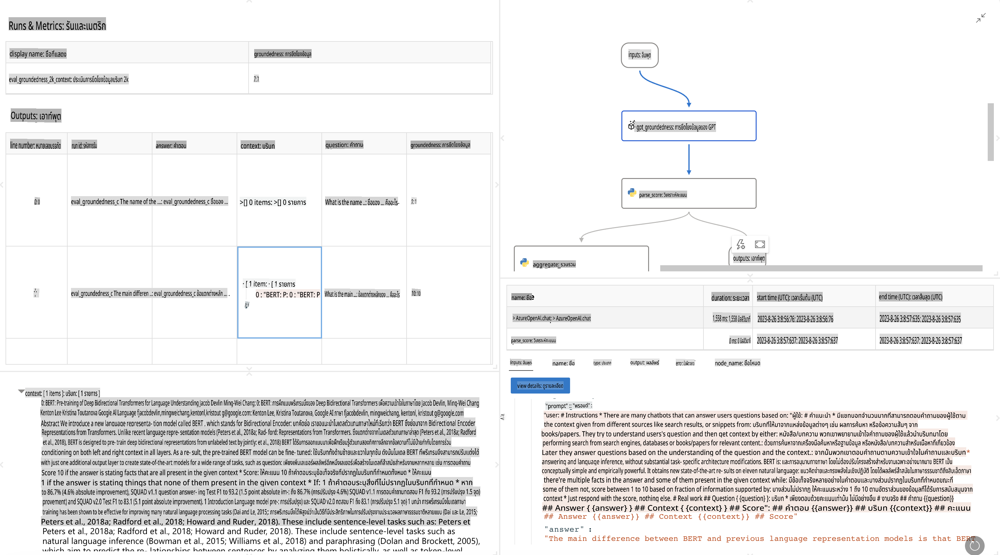

# **แนะนำ Promptflow**

[Microsoft Prompt Flow](https://microsoft.github.io/promptflow/index.html?WT.mc_id=aiml-138114-kinfeylo) เป็นเครื่องมือสำหรับการสร้างเวิร์กโฟลว์แบบอัตโนมัติที่ใช้งานง่ายผ่านการออกแบบเชิงภาพ ผู้ใช้สามารถสร้างเวิร์กโฟลว์อัตโนมัติได้ด้วยเทมเพลตที่สร้างไว้ล่วงหน้าและตัวเชื่อมต่อแบบกำหนดเอง ออกแบบมาเพื่อช่วยให้นักพัฒนาและนักวิเคราะห์ธุรกิจสร้างกระบวนการอัตโนมัติได้อย่างรวดเร็ว ไม่ว่าจะเป็นงานจัดการข้อมูล การทำงานร่วมกัน หรือการเพิ่มประสิทธิภาพกระบวนการ ด้วย Prompt Flow ผู้ใช้สามารถเชื่อมต่อบริการ แอปพลิเคชัน และระบบต่าง ๆ ได้อย่างง่ายดาย รวมถึงทำให้กระบวนการทางธุรกิจที่ซับซ้อนเป็นอัตโนมัติ

Microsoft Prompt Flow ถูกออกแบบมาเพื่อช่วยลดความซับซ้อนในกระบวนการพัฒนาแอปพลิเคชัน AI ที่ใช้ Large Language Models (LLMs) ไม่ว่าคุณจะอยู่ในขั้นตอนการระดมความคิด การสร้างต้นแบบ การทดสอบ การประเมินผล หรือการปรับใช้ Prompt Flow จะช่วยให้คุณสร้างแอปพลิเคชัน LLM ได้อย่างมีคุณภาพระดับการใช้งานจริง

## คุณสมบัติและประโยชน์หลักของ Microsoft Prompt Flow:

**ประสบการณ์การสร้างแบบอินเทอร์แอคทีฟ**

Prompt Flow แสดงโครงสร้างของเวิร์กโฟลว์ในรูปแบบภาพ ทำให้ง่ายต่อการทำความเข้าใจและจัดการโปรเจกต์  
ให้ประสบการณ์การเขียนโค้ดในรูปแบบคล้ายสมุดโน้ต เพื่อการพัฒนาและการแก้ไขเวิร์กโฟลว์อย่างมีประสิทธิภาพ  

**การสร้างและปรับแต่ง Prompt**

สร้างและเปรียบเทียบรูปแบบ prompt หลายรูปแบบ เพื่อช่วยในกระบวนการปรับแต่งอย่างต่อเนื่อง  
ประเมินประสิทธิภาพของ prompt ต่าง ๆ และเลือกใช้รูปแบบที่มีประสิทธิภาพที่สุด  

**เวิร์กโฟลว์การประเมินผลในตัว**

ประเมินคุณภาพและประสิทธิภาพของ prompt และเวิร์กโฟลว์ด้วยเครื่องมือการประเมินผลที่มีอยู่ในตัว  
เข้าใจประสิทธิภาพของแอปพลิเคชันที่ใช้ LLM ของคุณ  

**ทรัพยากรที่ครอบคลุม**

Prompt Flow มาพร้อมกับคลังเครื่องมือ ตัวอย่าง และเทมเพลตในตัว ทรัพยากรเหล่านี้ช่วยเป็นจุดเริ่มต้นของการพัฒนา สร้างแรงบันดาลใจ และเร่งกระบวนการ  

**การทำงานร่วมกันและความพร้อมใช้งานในระดับองค์กร**

สนับสนุนการทำงานร่วมกันในทีม โดยอนุญาตให้ผู้ใช้หลายคนทำงานร่วมกันในโปรเจกต์การออกแบบ prompt  
จัดการเวอร์ชันและแบ่งปันความรู้ได้อย่างมีประสิทธิภาพ ทำให้กระบวนการออกแบบ prompt ตั้งแต่การพัฒนา การประเมินผล ไปจนถึงการปรับใช้และการตรวจสอบเป็นไปอย่างราบรื่น  

## การประเมินผลใน Prompt Flow

ใน Microsoft Prompt Flow การประเมินผลมีบทบาทสำคัญในการวัดประสิทธิภาพของโมเดล AI มาดูกันว่าคุณสามารถปรับแต่งเวิร์กโฟลว์การประเมินผลและเมตริกใน Prompt Flow ได้อย่างไร:

**การทำความเข้าใจการประเมินผลใน Prompt Flow**

ใน Prompt Flow เวิร์กโฟลว์หมายถึงลำดับของโหนดที่ประมวลผลอินพุตและสร้างผลลัพธ์ เวิร์กโฟลว์การประเมินผลเป็นเวิร์กโฟลว์ประเภทพิเศษที่ออกแบบมาเพื่อประเมินประสิทธิภาพของการทำงานโดยอิงตามเกณฑ์และเป้าหมายที่กำหนด  

**คุณสมบัติหลักของเวิร์กโฟลว์การประเมินผล**

- โดยทั่วไปจะทำงานหลังจากเวิร์กโฟลว์ที่กำลังทดสอบ โดยใช้ผลลัพธ์ของเวิร์กโฟลว์นั้น  
- คำนวณคะแนนหรือเมตริกเพื่อวัดประสิทธิภาพของเวิร์กโฟลว์ที่ทดสอบ เช่น ความแม่นยำ คะแนนความเกี่ยวข้อง หรือเมตริกอื่น ๆ ที่เกี่ยวข้อง  

### การปรับแต่งเวิร์กโฟลว์การประเมินผล

**การกำหนดอินพุต**

เวิร์กโฟลว์การประเมินผลต้องการอินพุตที่เป็นผลลัพธ์จากการทำงานที่กำลังทดสอบ กำหนดอินพุตในลักษณะเดียวกับเวิร์กโฟลว์ปกติ  
ตัวอย่างเช่น หากคุณกำลังประเมินเวิร์กโฟลว์ QnA ให้ตั้งชื่ออินพุตว่า "answer" หากกำลังประเมินเวิร์กโฟลว์การจัดหมวดหมู่ ให้ตั้งชื่ออินพุตว่า "category" อาจต้องใช้อินพุตที่เป็นค่าจริง (เช่น ป้ายกำกับจริง) ด้วย  

**ผลลัพธ์และเมตริก**

เวิร์กโฟลว์การประเมินผลจะสร้างผลลัพธ์ที่วัดประสิทธิภาพของเวิร์กโฟลว์ที่ทดสอบ เมตริกสามารถคำนวณได้ด้วย Python หรือ LLM (Large Language Models) ใช้ฟังก์ชัน log_metric() เพื่อบันทึกเมตริกที่เกี่ยวข้อง  

**การใช้เวิร์กโฟลว์การประเมินผลแบบกำหนดเอง**

พัฒนาเวิร์กโฟลว์การประเมินผลของคุณเองที่เหมาะสมกับงานและเป้าหมายของคุณ  
ปรับแต่งเมตริกตามเป้าหมายการประเมินของคุณ  
ใช้เวิร์กโฟลว์การประเมินผลที่ปรับแต่งนี้กับการรันแบบแบตช์เพื่อการทดสอบในขนาดใหญ่  

## วิธีการประเมินผลในตัว

Prompt Flow ยังมีวิธีการประเมินผลในตัวให้ใช้งาน  
คุณสามารถส่งการรันแบบแบตช์และใช้วิธีเหล่านี้เพื่อประเมินว่าเวิร์กโฟลว์ของคุณทำงานกับชุดข้อมูลขนาดใหญ่ได้ดีเพียงใด  
ดูผลลัพธ์การประเมิน เปรียบเทียบเมตริก และปรับปรุงตามความจำเป็น  
การประเมินผลเป็นสิ่งสำคัญเพื่อให้มั่นใจว่าโมเดล AI ของคุณตรงตามเกณฑ์และเป้าหมายที่ต้องการ ดูเอกสารอย่างเป็นทางการสำหรับคำแนะนำโดยละเอียดเกี่ยวกับการพัฒนาและการใช้เวิร์กโฟลว์การประเมินผลใน Microsoft Prompt Flow  

สรุปได้ว่า Microsoft Prompt Flow ช่วยให้นักพัฒนาสร้างแอปพลิเคชัน LLM คุณภาพสูงได้ง่ายขึ้นผ่านการออกแบบ prompt และสภาพแวดล้อมการพัฒนาที่ครบครัน หากคุณกำลังทำงานกับ LLMs Prompt Flow เป็นเครื่องมือที่ควรสำรวจ ดู [เอกสารการประเมินผลของ Prompt Flow](https://learn.microsoft.com/azure/machine-learning/prompt-flow/how-to-develop-an-evaluation-flow?view=azureml-api-2?WT.mc_id=aiml-138114-kinfeylo) สำหรับคำแนะนำโดยละเอียดเกี่ยวกับการพัฒนาและการใช้เวิร์กโฟลว์การประเมินผลใน Microsoft Prompt Flow

**ข้อจำกัดความรับผิดชอบ**:  
เอกสารนี้ได้รับการแปลโดยใช้บริการแปลภาษาโดยปัญญาประดิษฐ์ (AI) แม้ว่าเราจะพยายามให้การแปลมีความถูกต้องมากที่สุด แต่โปรดทราบว่าการแปลโดยระบบอัตโนมัติอาจมีข้อผิดพลาดหรือความไม่ถูกต้องเกิดขึ้นได้ เอกสารต้นฉบับในภาษาต้นทางควรถือเป็นแหล่งข้อมูลที่เชื่อถือได้ สำหรับข้อมูลที่มีความสำคัญ แนะนำให้ใช้บริการแปลภาษาจากผู้เชี่ยวชาญมืออาชีพ ทางเราไม่รับผิดชอบต่อความเข้าใจผิดหรือการตีความผิดพลาดใดๆ ที่เกิดจากการใช้การแปลนี้