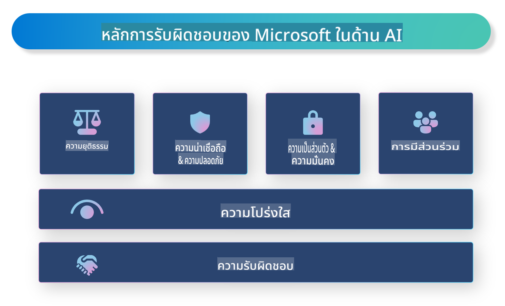

# **แนะนำ Responsible AI**

[Microsoft Responsible AI](https://www.microsoft.com/ai/responsible-ai?WT.mc_id=aiml-138114-kinfeylo) เป็นโครงการที่มุ่งช่วยนักพัฒนาและองค์กรสร้างระบบ AI ที่มีความโปร่งใส น่าเชื่อถือ และมีความรับผิดชอบ โครงการนี้ให้คำแนะนำและทรัพยากรสำหรับการพัฒนาโซลูชัน AI ที่สอดคล้องกับหลักจริยธรรม เช่น ความเป็นส่วนตัว ความยุติธรรม และความโปร่งใส นอกจากนี้ยังสำรวจความท้าทายและแนวปฏิบัติที่ดีที่สุดในการสร้างระบบ AI ที่มีความรับผิดชอบ

## ภาพรวมของ Microsoft Responsible AI

**หลักจริยธรรม**

Microsoft Responsible AI ยึดหลักจริยธรรม เช่น ความเป็นส่วนตัว ความยุติธรรม ความโปร่งใส ความรับผิดชอบ และความปลอดภัย หลักการเหล่านี้ถูกออกแบบมาเพื่อให้แน่ใจว่าระบบ AI ได้รับการพัฒนาอย่างมีจริยธรรมและมีความรับผิดชอบ

**AI ที่โปร่งใส**

Microsoft Responsible AI เน้นความสำคัญของความโปร่งใสในระบบ AI ซึ่งรวมถึงการให้คำอธิบายที่ชัดเจนเกี่ยวกับการทำงานของโมเดล AI และการทำให้แหล่งข้อมูลและอัลกอริทึมสามารถเข้าถึงได้โดยสาธารณะ

**AI ที่มีความรับผิดชอบ**

[Microsoft Responsible AI](https://www.microsoft.com/ai/responsible-ai?WT.mc_id=aiml-138114-kinfeylo) สนับสนุนการพัฒนาระบบ AI ที่มีความรับผิดชอบ ซึ่งสามารถให้ข้อมูลเชิงลึกเกี่ยวกับวิธีที่โมเดล AI ตัดสินใจได้ เพื่อช่วยให้ผู้ใช้งานเข้าใจและไว้วางใจผลลัพธ์ของระบบ AI

**การมีส่วนร่วมที่ครอบคลุม**

ระบบ AI ควรถูกออกแบบมาเพื่อประโยชน์ของทุกคน Microsoft ตั้งเป้าสร้าง AI ที่คำนึงถึงมุมมองที่หลากหลายและหลีกเลี่ยงอคติหรือการเลือกปฏิบัติ

**ความน่าเชื่อถือและความปลอดภัย**

การรับประกันว่าระบบ AI มีความน่าเชื่อถือและปลอดภัยเป็นสิ่งสำคัญ Microsoft มุ่งเน้นการสร้างโมเดลที่แข็งแกร่ง ทำงานได้อย่างสม่ำเสมอ และหลีกเลี่ยงผลลัพธ์ที่เป็นอันตราย

**ความยุติธรรมใน AI**

Microsoft Responsible AI ตระหนักว่าระบบ AI อาจสะท้อนอคติหากได้รับการฝึกอบรมจากข้อมูลหรืออัลกอริทึมที่มีอคติ โครงการนี้ให้คำแนะนำในการพัฒนาระบบ AI ที่ยุติธรรมและไม่เลือกปฏิบัติตามปัจจัย เช่น เชื้อชาติ เพศ หรืออายุ

**ความเป็นส่วนตัวและความปลอดภัย**

Microsoft Responsible AI เน้นความสำคัญของการปกป้องความเป็นส่วนตัวและความปลอดภัยของข้อมูลผู้ใช้ในระบบ AI ซึ่งรวมถึงการใช้การเข้ารหัสข้อมูลที่แข็งแกร่งและการควบคุมการเข้าถึง รวมถึงการตรวจสอบระบบ AI อย่างสม่ำเสมอเพื่อหาช่องโหว่

**ความรับผิดชอบและความตระหนัก**

Microsoft Responsible AI ส่งเสริมความรับผิดชอบและความตระหนักในกระบวนการพัฒนาและใช้งาน AI ซึ่งรวมถึงการทำให้นักพัฒนาและองค์กรตระหนักถึงความเสี่ยงที่อาจเกิดขึ้นจากระบบ AI และดำเนินการลดความเสี่ยงเหล่านั้น

## แนวปฏิบัติที่ดีที่สุดในการสร้างระบบ AI ที่มีความรับผิดชอบ

**พัฒนาโมเดล AI ด้วยชุดข้อมูลที่หลากหลาย**

เพื่อหลีกเลี่ยงอคติในระบบ AI การใช้ชุดข้อมูลที่หลากหลายซึ่งสะท้อนมุมมองและประสบการณ์ที่แตกต่างกันเป็นสิ่งสำคัญ

**ใช้เทคนิค AI ที่สามารถอธิบายได้**

เทคนิค AI ที่สามารถอธิบายได้ช่วยให้ผู้ใช้เข้าใจวิธีการตัดสินใจของโมเดล AI ซึ่งสามารถเพิ่มความไว้วางใจในระบบได้

**ตรวจสอบระบบ AI อย่างสม่ำเสมอเพื่อหาช่องโหว่**

การตรวจสอบระบบ AI อย่างต่อเนื่องช่วยระบุความเสี่ยงและช่องโหว่ที่ต้องแก้ไข

**ใช้การเข้ารหัสข้อมูลและการควบคุมการเข้าถึงที่แข็งแกร่ง**

การเข้ารหัสข้อมูลและการควบคุมการเข้าถึงช่วยปกป้องความเป็นส่วนตัวและความปลอดภัยของผู้ใช้ในระบบ AI

**ปฏิบัติตามหลักจริยธรรมในการพัฒนา AI**

การปฏิบัติตามหลักจริยธรรม เช่น ความยุติธรรม ความโปร่งใส และความรับผิดชอบ ช่วยสร้างความไว้วางใจในระบบ AI และทำให้แน่ใจว่าระบบถูกพัฒนาอย่างมีความรับผิดชอบ

## การใช้ AI Foundry สำหรับ Responsible AI

[Azure AI Foundry](https://ai.azure.com?WT.mc_id=aiml-138114-kinfeylo) เป็นแพลตฟอร์มที่ทรงพลังซึ่งช่วยให้นักพัฒนาและองค์กรสามารถสร้างแอปพลิเคชันที่ชาญฉลาด ทันสมัย พร้อมใช้งานในตลาด และมีความรับผิดชอบได้อย่างรวดเร็ว คุณสมบัติและความสามารถสำคัญของ Azure AI Foundry มีดังนี้:

**API และโมเดลที่พร้อมใช้งาน**

Azure AI Foundry มี API และโมเดลที่สร้างไว้ล่วงหน้าและปรับแต่งได้ ครอบคลุมงาน AI หลากหลาย เช่น AI เชิงสร้างสรรค์ การประมวลผลภาษาธรรมชาติสำหรับการสนทนา การค้นหา การตรวจสอบ การแปลภาษา การพูด การมองเห็น และการตัดสินใจ

**Prompt Flow**

Prompt flow ใน Azure AI Foundry ช่วยให้คุณสร้างประสบการณ์ AI เชิงสนทนาได้ง่ายขึ้น โดยสามารถออกแบบและจัดการลำดับการสนทนา เช่น การสร้างแชทบอท ผู้ช่วยเสมือน และแอปพลิเคชันเชิงโต้ตอบอื่นๆ

**Retrieval Augmented Generation (RAG)**

RAG เป็นเทคนิคที่ผสมผสานการดึงข้อมูลที่มีอยู่และการสร้างเนื้อหาใหม่เข้าด้วยกัน เพื่อปรับปรุงคุณภาพของคำตอบที่สร้างขึ้นโดยใช้ทั้งความรู้ที่มีอยู่และการสร้างสรรค์ใหม่

**การประเมินและติดตามโมเดล AI เชิงสร้างสรรค์**

Azure AI Foundry มีเครื่องมือสำหรับการประเมินและติดตามโมเดล AI เชิงสร้างสรรค์ คุณสามารถวัดประสิทธิภาพ ความยุติธรรม และตัวชี้วัดสำคัญอื่นๆ เพื่อให้แน่ใจว่าการใช้งานเป็นไปอย่างมีความรับผิดชอบ นอกจากนี้ หากคุณสร้างแดชบอร์ด คุณสามารถใช้ UI แบบ no-code ใน Azure Machine Learning Studio เพื่อปรับแต่งและสร้าง Responsible AI Dashboard และ scorecard ที่เกี่ยวข้องโดยอิงจาก [Responsible AI Toolbox](https://responsibleaitoolbox.ai/?WT.mc_id=aiml-138114-kinfeylo) ไลบรารี Python ซึ่งช่วยให้คุณแบ่งปันข้อมูลเชิงลึกสำคัญ เช่น ความยุติธรรม ความสำคัญของคุณลักษณะ และข้อพิจารณาอื่นๆ กับทั้งผู้ที่มีความรู้ทางเทคนิคและไม่มีความรู้ทางเทคนิค

เพื่อใช้ AI Foundry กับ Responsible AI คุณสามารถปฏิบัติตามแนวปฏิบัติดังนี้:

**กำหนดปัญหาและวัตถุประสงค์ของระบบ AI**

ก่อนเริ่มกระบวนการพัฒนา ควรกำหนดปัญหาหรือวัตถุประสงค์ของระบบ AI อย่างชัดเจน เพื่อช่วยระบุข้อมูล อัลกอริทึม และทรัพยากรที่จำเป็นสำหรับการสร้างโมเดลที่มีประสิทธิภาพ

**รวบรวมและเตรียมข้อมูลที่เกี่ยวข้อง**

คุณภาพและปริมาณของข้อมูลที่ใช้ในการฝึกระบบ AI มีผลกระทบอย่างมากต่อประสิทธิภาพ ดังนั้นควรรวบรวมข้อมูลที่เกี่ยวข้อง ทำความสะอาด เตรียมข้อมูล และทำให้แน่ใจว่าข้อมูลนั้นสะท้อนถึงประชากรหรือปัญหาที่คุณพยายามแก้ไข

**เลือกวิธีการประเมินที่เหมาะสม**

มีอัลกอริทึมการประเมินหลากหลายรูปแบบ ควรเลือกวิธีที่เหมาะสมที่สุดตามข้อมูลและปัญหาของคุณ

**ประเมินและตีความโมเดล**

เมื่อสร้างโมเดล AI แล้ว ควรประเมินประสิทธิภาพด้วยตัวชี้วัดที่เหมาะสมและตีความผลลัพธ์อย่างโปร่งใส เพื่อช่วยระบุอคติหรือข้อจำกัดในโมเดลและปรับปรุงตามความจำเป็น

**สร้างความโปร่งใสและความสามารถในการอธิบาย**

ระบบ AI ควรมีความโปร่งใสและสามารถอธิบายได้ เพื่อให้ผู้ใช้เข้าใจการทำงานและการตัดสินใจของระบบ โดยเฉพาะในแอปพลิเคชันที่ส่งผลกระทบต่อชีวิตมนุษย์ เช่น ด้านสุขภาพ การเงิน และกฎหมาย

**ติดตามและอัปเดตโมเดล**

ระบบ AI ควรได้รับการติดตามและอัปเดตอย่างต่อเนื่อง เพื่อให้แน่ใจว่ายังคงแม่นยำและมีประสิทธิภาพ ซึ่งต้องการการบำรุงรักษา การทดสอบ และการฝึกอบรมซ้ำอย่างต่อเนื่อง

สรุปได้ว่า Microsoft Responsible AI เป็นโครงการที่มุ่งช่วยนักพัฒนาและองค์กรสร้างระบบ AI ที่มีความโปร่งใส น่าเชื่อถือ และมีความรับผิดชอบ การนำ AI ไปใช้อย่างมีความรับผิดชอบเป็นสิ่งสำคัญ และ Azure AI Foundry มุ่งทำให้สิ่งนี้เป็นจริงสำหรับองค์กรต่างๆ ด้วยการปฏิบัติตามหลักจริยธรรมและแนวปฏิบัติที่ดีที่สุด เราสามารถมั่นใจได้ว่าระบบ AI ถูกพัฒนาและนำไปใช้อย่างมีความรับผิดชอบเพื่อประโยชน์ของสังคมโดยรวม

**ข้อจำกัดความรับผิดชอบ**:  
เอกสารนี้ได้รับการแปลโดยใช้บริการแปลภาษาอัตโนมัติที่ขับเคลื่อนด้วย AI แม้ว่าเราจะพยายามอย่างเต็มที่เพื่อให้การแปลมีความถูกต้อง โปรดทราบว่าการแปลอัตโนมัติอาจมีข้อผิดพลาดหรือความไม่ถูกต้อง เอกสารต้นฉบับในภาษาต้นทางควรถูกพิจารณาว่าเป็นแหล่งข้อมูลที่ถูกต้องที่สุด สำหรับข้อมูลที่มีความสำคัญ แนะนำให้ใช้บริการแปลภาษาจากผู้เชี่ยวชาญที่เป็นมนุษย์ เราจะไม่รับผิดชอบต่อความเข้าใจผิดหรือการตีความที่ผิดพลาดซึ่งเกิดจากการใช้การแปลนี้