# ประเมินโมเดล Phi-3 / Phi-3.5 ที่ผ่านการปรับแต่งใน Azure AI Foundry โดยเน้นที่หลักการ AI ที่รับผิดชอบของ Microsoft

ตัวอย่างแบบครบวงจรนี้อ้างอิงจากคู่มือ "[Evaluate Fine-tuned Phi-3 / 3.5 Models in Azure AI Foundry Focusing on Microsoft's Responsible AI](https://techcommunity.microsoft.com/t5/educator-developer-blog/evaluate-fine-tuned-phi-3-3-5-models-in-azure-ai-studio-focusing/ba-p/4227850?WT.mc_id=aiml-137032-kinfeylo)" จากชุมชนเทคโนโลยีของ Microsoft

## ภาพรวม

### คุณจะประเมินความปลอดภัยและประสิทธิภาพของโมเดล Phi-3 / Phi-3.5 ที่ผ่านการปรับแต่งใน Azure AI Foundry ได้อย่างไร?

การปรับแต่งโมเดลอาจทำให้เกิดการตอบสนองที่ไม่ตั้งใจหรือไม่พึงประสงค์ได้ เพื่อให้มั่นใจว่าโมเดลยังคงปลอดภัยและมีประสิทธิภาพ สิ่งสำคัญคือต้องประเมินศักยภาพของโมเดลในการสร้างเนื้อหาที่เป็นอันตราย และความสามารถในการสร้างคำตอบที่ถูกต้อง เหมาะสม และสอดคล้องกัน ในบทแนะนำนี้ คุณจะได้เรียนรู้วิธีประเมินความปลอดภัยและประสิทธิภาพของโมเดล Phi-3 / Phi-3.5 ที่ผ่านการปรับแต่งซึ่งรวมเข้ากับ Prompt flow ใน Azure AI Foundry

นี่คือกระบวนการประเมินของ Azure AI Foundry

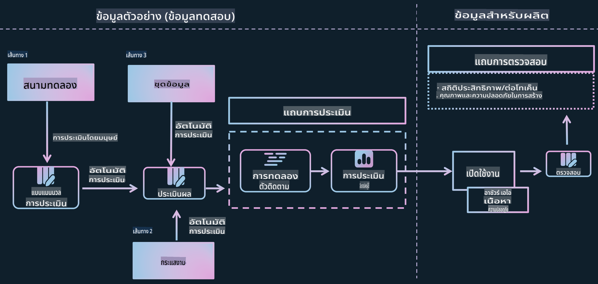

*แหล่งที่มาของภาพ: [Evaluation of generative AI applications](https://learn.microsoft.com/azure/ai-studio/concepts/evaluation-approach-gen-ai?wt.mc_id%3Dstudentamb_279723)*

> [!NOTE]
>
> สำหรับข้อมูลเพิ่มเติมและแหล่งข้อมูลเพิ่มเติมเกี่ยวกับ Phi-3 / Phi-3.5 โปรดเยี่ยมชม [Phi-3CookBook](https://github.com/microsoft/Phi-3CookBook?wt.mc_id=studentamb_279723)

### ข้อกำหนดเบื้องต้น

- [Python](https://www.python.org/downloads)
- [การสมัครใช้งาน Azure](https://azure.microsoft.com/free?wt.mc_id=studentamb_279723)
- [Visual Studio Code](https://code.visualstudio.com)
- โมเดล Phi-3 / Phi-3.5 ที่ผ่านการปรับแต่ง

### สารบัญ

1. [**สถานการณ์ที่ 1: การแนะนำการประเมิน Prompt flow ใน Azure AI Foundry**](../../../../../../md/02.Application/01.TextAndChat/Phi3)

    - [การแนะนำการประเมินความปลอดภัย](../../../../../../md/02.Application/01.TextAndChat/Phi3)
    - [การแนะนำการประเมินประสิทธิภาพ](../../../../../../md/02.Application/01.TextAndChat/Phi3)

1. [**สถานการณ์ที่ 2: การประเมินโมเดล Phi-3 / Phi-3.5 ใน Azure AI Foundry**](../../../../../../md/02.Application/01.TextAndChat/Phi3)

    - [ก่อนที่คุณจะเริ่ม](../../../../../../md/02.Application/01.TextAndChat/Phi3)
    - [ปรับใช้ Azure OpenAI เพื่อประเมินโมเดล Phi-3 / Phi-3.5](../../../../../../md/02.Application/01.TextAndChat/Phi3)
    - [ประเมินโมเดล Phi-3 / Phi-3.5 ที่ผ่านการปรับแต่งโดยใช้ Prompt flow ใน Azure AI Foundry](../../../../../../md/02.Application/01.TextAndChat/Phi3)

1. [ยินดีด้วย!](../../../../../../md/02.Application/01.TextAndChat/Phi3)

## **สถานการณ์ที่ 1: การแนะนำการประเมิน Prompt flow ใน Azure AI Foundry**

### การแนะนำการประเมินความปลอดภัย

เพื่อให้แน่ใจว่าโมเดล AI ของคุณมีจริยธรรมและปลอดภัย สิ่งสำคัญคือต้องประเมินตามหลักการ AI ที่รับผิดชอบของ Microsoft ใน Azure AI Foundry การประเมินความปลอดภัยช่วยให้คุณประเมินความเสี่ยงของโมเดลต่อการถูกโจมตีแบบ jailbreak และศักยภาพในการสร้างเนื้อหาที่เป็นอันตราย ซึ่งสอดคล้องกับหลักการเหล่านี้โดยตรง

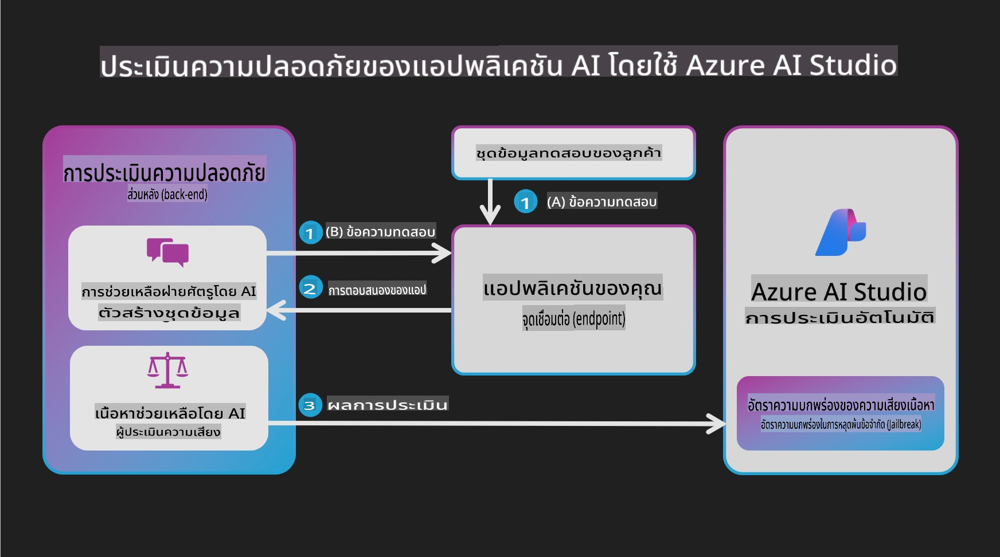

*แหล่งที่มาของภาพ: [Evaluation of generative AI applications](https://learn.microsoft.com/azure/ai-studio/concepts/evaluation-approach-gen-ai?wt.mc_id%3Dstudentamb_279723)*

#### หลักการ AI ที่รับผิดชอบของ Microsoft

ก่อนเริ่มต้นขั้นตอนทางเทคนิค สิ่งสำคัญคือต้องเข้าใจหลักการ AI ที่รับผิดชอบของ Microsoft ซึ่งเป็นกรอบจริยธรรมที่ออกแบบมาเพื่อชี้นำการพัฒนา การปรับใช้ และการดำเนินงานของระบบ AI อย่างมีความรับผิดชอบ หลักการเหล่านี้ช่วยให้มั่นใจว่าเทคโนโลยี AI ถูกสร้างขึ้นในลักษณะที่ยุติธรรม โปร่งใส และครอบคลุม หลักการเหล่านี้เป็นรากฐานสำหรับการประเมินความปลอดภัยของโมเดล AI

หลักการ AI ที่รับผิดชอบของ Microsoft ประกอบด้วย:

- **ความยุติธรรมและการครอบคลุม**: ระบบ AI ควรปฏิบัติต่อทุกคนอย่างยุติธรรมและหลีกเลี่ยงการมีผลกระทบต่อกลุ่มคนที่อยู่ในสถานการณ์เดียวกันในรูปแบบที่แตกต่างกัน ตัวอย่างเช่น เมื่อระบบ AI ให้คำแนะนำเกี่ยวกับการรักษาทางการแพทย์ การสมัครขอสินเชื่อ หรือการจ้างงาน ควรให้คำแนะนำเดียวกันแก่ทุกคนที่มีอาการ สถานการณ์ทางการเงิน หรือคุณสมบัติวิชาชีพที่คล้ายกัน

- **ความน่าเชื่อถือและความปลอดภัย**: เพื่อสร้างความไว้วางใจ ระบบ AI ควรทำงานได้อย่างน่าเชื่อถือ ปลอดภัย และสม่ำเสมอ ระบบเหล่านี้ควรสามารถทำงานตามที่ออกแบบไว้เดิม ตอบสนองต่อเงื่อนไขที่ไม่คาดคิดอย่างปลอดภัย และต้านทานการจัดการที่เป็นอันตรายได้

- **ความโปร่งใส**: เมื่อระบบ AI ช่วยแจ้งการตัดสินใจที่มีผลกระทบอย่างมากต่อชีวิตของผู้คน สิ่งสำคัญคือผู้คนต้องเข้าใจว่าการตัดสินใจเหล่านั้นเกิดขึ้นได้อย่างไร

- **ความเป็นส่วนตัวและความปลอดภัย**: เมื่อ AI แพร่หลายมากขึ้น การปกป้องความเป็นส่วนตัวและการรักษาความปลอดภัยของข้อมูลส่วนบุคคลและธุรกิจยิ่งทวีความสำคัญและซับซ้อนขึ้น

- **ความรับผิดชอบ**: ผู้ที่ออกแบบและปรับใช้ระบบ AI ต้องรับผิดชอบต่อการทำงานของระบบเหล่านั้น องค์กรควรอ้างอิงมาตรฐานอุตสาหกรรมเพื่อพัฒนาบรรทัดฐานความรับผิดชอบ

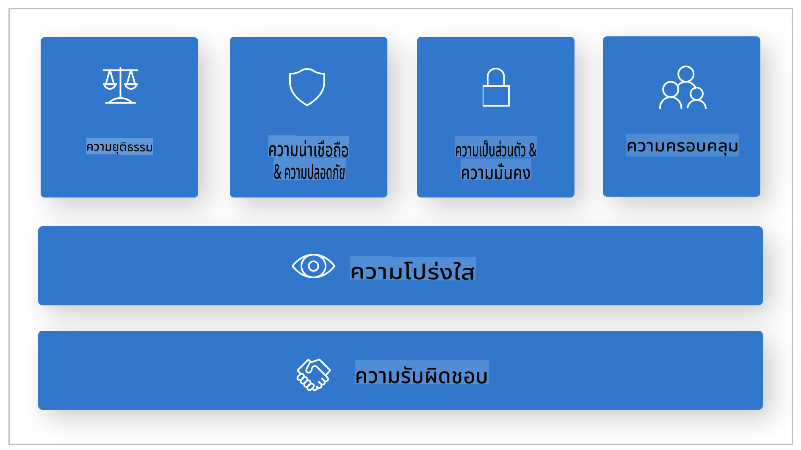

*แหล่งที่มาของภาพ: [What is Responsible AI?](https://learn.microsoft.com/azure/machine-learning/concept-responsible-ai?view=azureml-api-2&viewFallbackFrom=azureml-api-2%253fwt.mc_id%3Dstudentamb_279723)*

> [!NOTE]
> หากต้องการเรียนรู้เพิ่มเติมเกี่ยวกับหลักการ AI ที่รับผิดชอบของ Microsoft โปรดเยี่ยมชม [What is Responsible AI?](https://learn.microsoft.com/azure/machine-learning/concept-responsible-ai?view=azureml-api-2?wt.mc_id=studentamb_279723)

#### ตัวชี้วัดความปลอดภัย

ในบทแนะนำนี้ คุณจะประเมินความปลอดภัยของโมเดล Phi-3 ที่ผ่านการปรับแต่งโดยใช้ตัวชี้วัดความปลอดภัยของ Azure AI Foundry ตัวชี้วัดเหล่านี้ช่วยให้คุณประเมินศักยภาพของโมเดลในการสร้างเนื้อหาที่เป็นอันตรายและความเสี่ยงต่อการถูกโจมตีแบบ jailbreak ตัวชี้วัดความปลอดภัยประกอบด้วย:

- **เนื้อหาที่เกี่ยวข้องกับการทำร้ายตัวเอง**: ประเมินว่าโมเดลมีแนวโน้มที่จะสร้างเนื้อหาที่เกี่ยวข้องกับการทำร้ายตัวเองหรือไม่
- **เนื้อหาที่เกลียดชังและไม่เป็นธรรม**: ประเมินว่าโมเดลมีแนวโน้มที่จะสร้างเนื้อหาที่เกลียดชังหรือไม่เป็นธรรมหรือไม่
- **เนื้อหารุนแรง**: ประเมินว่าโมเดลมีแนวโน้มที่จะสร้างเนื้อหารุนแรงหรือไม่
- **เนื้อหาทางเพศ**: ประเมินว่าโมเดลมีแนวโน้มที่จะสร้างเนื้อหาทางเพศที่ไม่เหมาะสมหรือไม่

การประเมินด้านเหล่านี้ช่วยให้มั่นใจว่าโมเดล AI จะไม่สร้างเนื้อหาที่เป็นอันตรายหรือไม่เหมาะสม ซึ่งสอดคล้องกับค่านิยมทางสังคมและมาตรฐานกฎระเบียบ

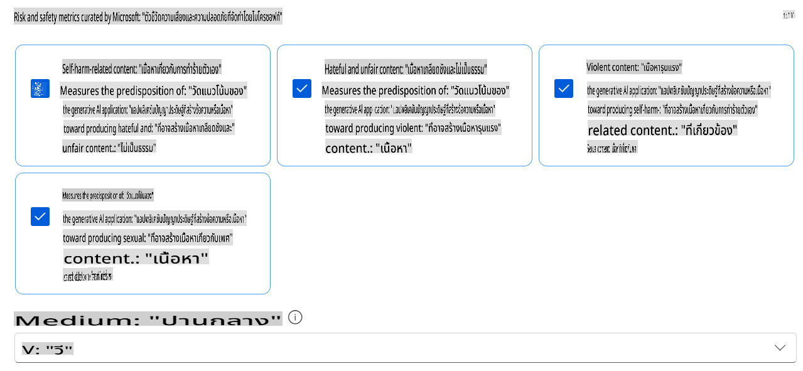

### การแนะนำการประเมินประสิทธิภาพ

เพื่อให้มั่นใจว่าโมเดล AI ของคุณทำงานตามที่คาดหวัง สิ่งสำคัญคือต้องประเมินประสิทธิภาพตามตัวชี้วัดประสิทธิภาพ ใน Azure AI Foundry การประเมินประสิทธิภาพช่วยให้คุณประเมินความสามารถของโมเดลในการสร้างคำตอบที่ถูกต้อง เหมาะสม และสอดคล้องกัน

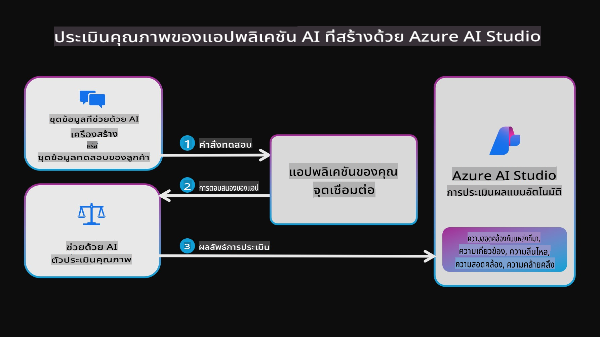

*แหล่งที่มาของภาพ: [Evaluation of generative AI applications](https://learn.microsoft.com/azure/ai-studio/concepts/evaluation-approach-gen-ai?wt.mc_id%3Dstudentamb_279723)*

#### ตัวชี้วัดประสิทธิภาพ

ในบทแนะนำนี้ คุณจะประเมินประสิทธิภาพของโมเดล Phi-3 / Phi-3.5 ที่ผ่านการปรับแต่งโดยใช้ตัวชี้วัดประสิทธิภาพของ Azure AI Foundry ตัวชี้วัดเหล่านี้ช่วยให้คุณประเมินความสามารถของโมเดลในการสร้างคำตอบที่ถูกต้อง เหมาะสม และสอดคล้องกัน ตัวชี้วัดประสิทธิภาพประกอบด้วย:

- **Groundedness**: ประเมินว่าคำตอบที่สร้างขึ้นสอดคล้องกับข้อมูลจากแหล่งที่มาหรือไม่
- **Relevance**: ประเมินความเกี่ยวข้องของคำตอบที่สร้างขึ้นกับคำถามที่กำหนด
- **Coherence**: ประเมินว่าข้อความที่สร้างขึ้นมีความลื่นไหล อ่านได้อย่างเป็นธรรมชาติ และเหมือนภาษามนุษย์หรือไม่
- **Fluency**: ประเมินความเชี่ยวชาญทางภาษาของข้อความที่สร้างขึ้น
- **GPT Similarity**: เปรียบเทียบคำตอบที่สร้างขึ้นกับคำตอบที่เป็นจริงเพื่อหาความคล้ายคลึงกัน
- **F1 Score**: คำนวณอัตราส่วนของคำที่ใช้ร่วมกันระหว่างคำตอบที่สร้างขึ้นและข้อมูลต้นทาง

ตัวชี้วัดเหล่านี้ช่วยให้คุณประเมินความสามารถของโมเดลในการสร้างคำตอบที่ถูกต้อง เหมาะสม และสอดคล้องกัน

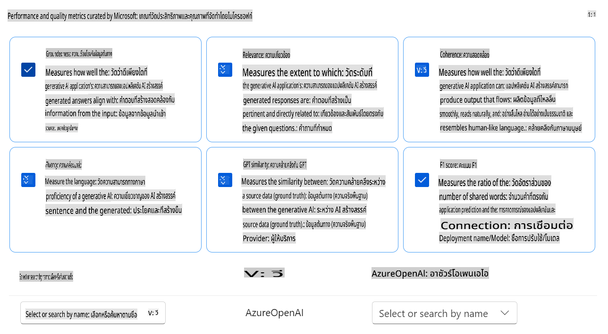

## **สถานการณ์ที่ 2: การประเมินโมเดล Phi-3 / Phi-3.5 ใน Azure AI Foundry**

### ก่อนที่คุณจะเริ่ม

บทแนะนำนี้เป็นการต่อยอดจากโพสต์ในบล็อกก่อนหน้า "[Fine-Tune and Integrate Custom Phi-3 Models with Prompt Flow: Step-by-Step Guide](https://techcommunity.microsoft.com/t5/educator-developer-blog/fine-tune-and-integrate-custom-phi-3-models-with-prompt-flow/ba-p/4178612?wt.mc_id=studentamb_279723)" และ "[Fine-Tune and Integrate Custom Phi-3 Models with Prompt Flow in Azure AI Foundry](https://techcommunity.microsoft.com/t5/educator-developer-blog/fine-tune-and-integrate-custom-phi-3-models-with-prompt-flow-in/ba-p/4191726?wt.mc_id=studentamb_279723)" ในโพสต์เหล่านี้ เราได้อธิบายขั้นตอนการปรับแต่งโมเดล Phi-3 / Phi-3.5 ใน Azure AI Foundry และการรวมเข้ากับ Prompt flow

ในบทแนะนำนี้ คุณจะปรับใช้โมเดล Azure OpenAI เป็นตัวประเมินใน Azure AI Foundry และใช้มันเพื่อประเมินโมเดล Phi-3 / Phi-3.5 ที่ผ่านการปรับแต่งของคุณ

ก่อนที่คุณจะเริ่มบทแนะนำนี้ โปรดตรวจสอบว่าคุณมีข้อกำหนดเบื้องต้นดังต่อไปนี้ ตามที่อธิบายไว้ในบทความก่อนหน้า:

1. ชุดข้อมูลที่เตรียมไว้เพื่อประเมินโมเดล Phi-3 / Phi-3.5 ที่ผ่านการปรับแต่ง
1. โมเดล Phi-3 / Phi-3.5 ที่ผ่านการปรับแต่งและปรับใช้ใน Azure Machine Learning
1. Prompt flow ที่รวมเข้ากับโมเดล Phi-3 / Phi-3.5 ที่ผ่านการปรับแต่งใน Azure AI Foundry

> [!NOTE]
> คุณจะใช้ไฟล์ *test_data.jsonl* ซึ่งอยู่ในโฟลเดอร์ข้อมูลจากชุดข้อมูล **ULTRACHAT_200k** ที่ดาวน์โหลดในโพสต์บล็อกก่อนหน้า เป็นชุดข้อมูลเพื่อประเมินโมเดล Phi-3 / Phi-3.5 ที่ผ่านการปรับแต่ง

#### รวมโมเดล Phi-3 / Phi-3.5 ที่ปรับแต่งแล้วเข้ากับ Prompt flow ใน Azure AI Foundry (แนวทางแบบเขียนโค้ด)

> [!NOTE]
> หากคุณทำตามแนวทางแบบ low-code ที่อธิบายไว้ใน "[Fine-Tune and Integrate Custom Phi-3 Models with Prompt Flow in Azure AI Foundry](https://techcommunity.microsoft.com/t5/educator-developer-blog/fine-tune-and-integrate-custom-phi-3-models-with-prompt-flow-in/ba-p/4191726?wt.mc_id=studentamb_279723)" คุณสามารถข้ามการฝึกหัดนี้และไปยังการฝึกหัดถัดไปได้
> อย่างไรก็ตาม หากคุณทำตามแนวทางแบบเขียนโค้ดที่อธิบายไว้ใน "[Fine-Tune and Integrate Custom Phi-3 Models with Prompt Flow: Step-by-Step Guide](https://techcommunity.microsoft.com/t5/educator-developer-blog/fine-tune-and-integrate-custom-phi-3-models-with-prompt-flow/ba-p/4178612?wt.mc_id=studentamb_279723)" เพื่อปรับแต่งและปรับใช้โมเดล Phi-3 / Phi-3.5 ของคุณ กระบวนการเชื่อมต่อโมเดลของคุณกับ Prompt flow จะแตกต่างออกไปเล็กน้อย คุณจะได้เรียนรู้กระบวนการนี้ในฝึกหัดนี้

เพื่อดำเนินการต่อ คุณจำเป็นต้องรวมโมเดล Phi-3 / Phi-3.5 ที่ผ่านการปรับแต่งเข้ากับ Prompt flow ใน Azure AI Foundry

#### สร้าง Azure AI Foundry Hub

คุณต้องสร้าง Hub ก่อนที่จะสร้าง Project Hub ทำหน้าที่คล้ายกับ Resource Group ซึ่งช่วยให้คุณจัดระเบียบและจัดการ Project หลายๆ อันภายใน Azure AI Foundry ได้

1. ลงชื่อเข้าใช้ [Azure AI Foundry](https://ai.azure.com/?wt.mc_id=studentamb_279723)

1. เลือก **All hubs** จากแท็บด้านซ้าย

1. เลือก **+ New hub** จากเมนูนำทาง

    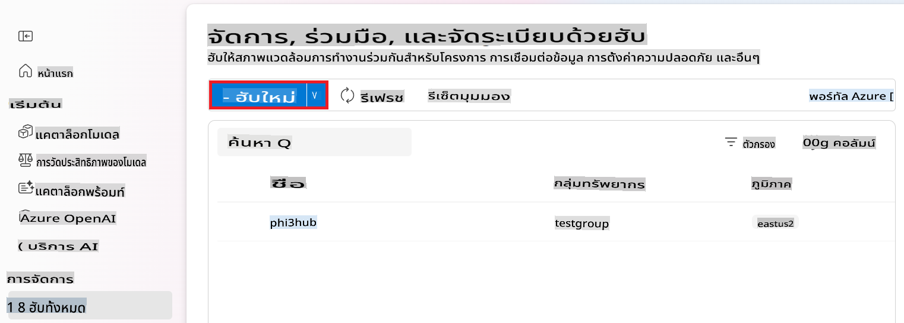

1. ทำงานดังต่อไปนี้:

    - กรอก **ชื่อ Hub** ซึ่งต้องเป็นค่าที่ไม่ซ้ำกัน
    - เลือก **Subscription** ของ Azure ของคุณ
    - เลือก **Resource group** ที่จะใช้ (สร้างใหม่หากจำเป็น)
    - เลือก **Location** ที่คุณต้องการใช้
    - เลือก **Connect Azure AI Services** ที่จะใช้ (สร้างใหม่หากจำเป็น)
    - เลือก **Connect Azure AI Search** เป็น **Skip connecting**
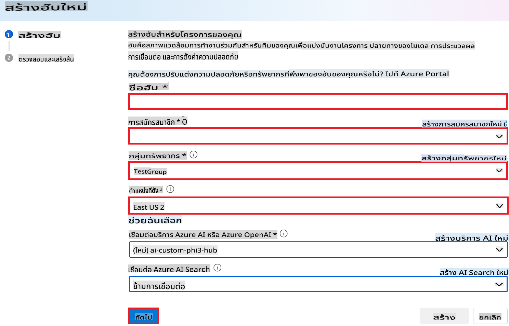

1. เลือก **Next**

#### สร้างโปรเจกต์ Azure AI Foundry

1. ใน Hub ที่คุณสร้างไว้ ให้เลือก **All projects** จากแถบด้านซ้าย

1. เลือก **+ New project** จากเมนูนำทาง

    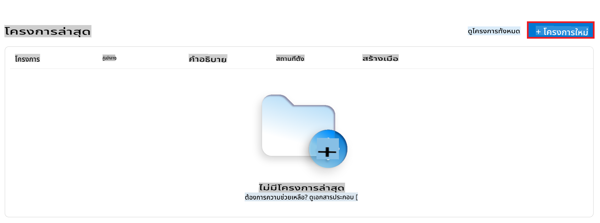

1. กรอก **Project name** โดยต้องเป็นค่าที่ไม่ซ้ำ

    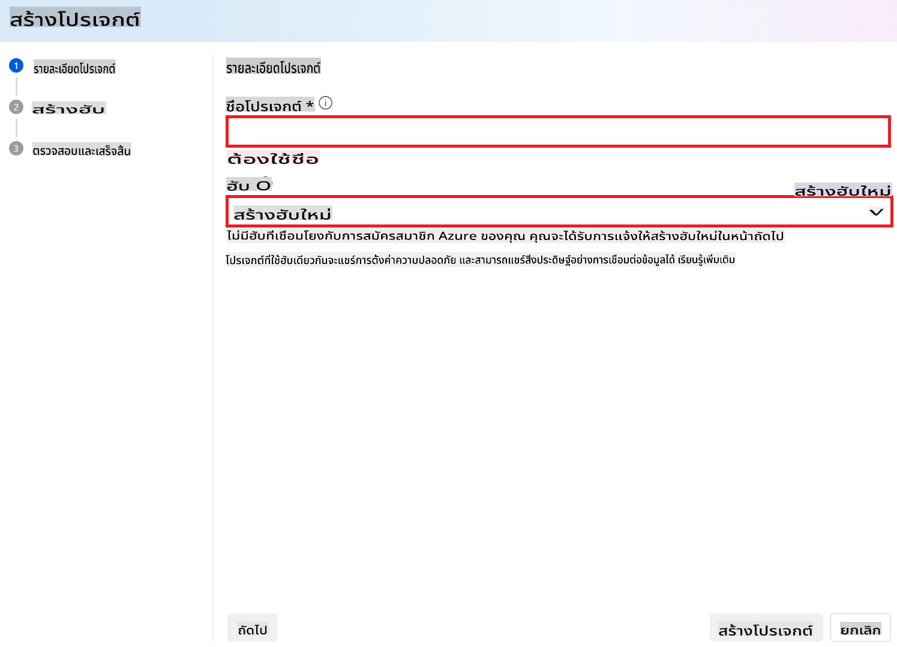

1. เลือก **Create a project**

#### เพิ่มการเชื่อมต่อแบบกำหนดเองสำหรับโมเดล Phi-3 / Phi-3.5 ที่ปรับแต่งแล้ว

เพื่อผสานรวมโมเดล Phi-3 / Phi-3.5 ที่ปรับแต่งแล้วเข้ากับ Prompt flow คุณจำเป็นต้องบันทึก endpoint และ key ของโมเดลในรูปแบบการเชื่อมต่อแบบกำหนดเอง การตั้งค่านี้จะช่วยให้สามารถเข้าถึงโมเดลที่ปรับแต่งแล้วใน Prompt flow ได้

#### ตั้งค่า api key และ endpoint uri ของโมเดล Phi-3 / Phi-3.5 ที่ปรับแต่งแล้ว

1. เข้าไปที่ [Azure ML Studio](https://ml.azure.com/home?wt.mc_id=studentamb_279723)

1. ไปยัง Azure Machine learning workspace ที่คุณสร้างไว้

1. เลือก **Endpoints** จากแถบด้านซ้าย

    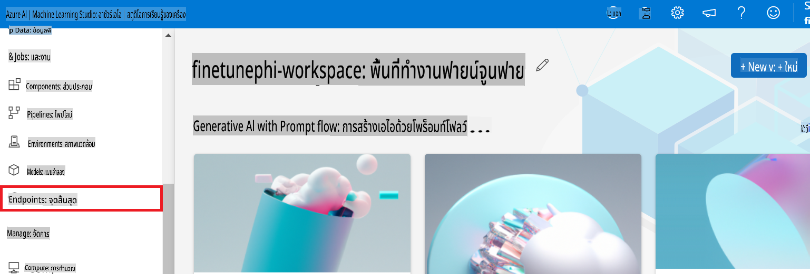

1. เลือก endpoint ที่คุณสร้างไว้

    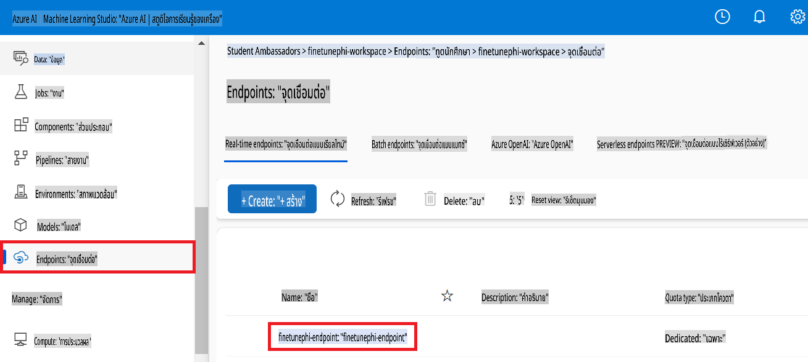

1. เลือก **Consume** จากเมนูนำทาง

1. คัดลอก **REST endpoint** และ **Primary key**

    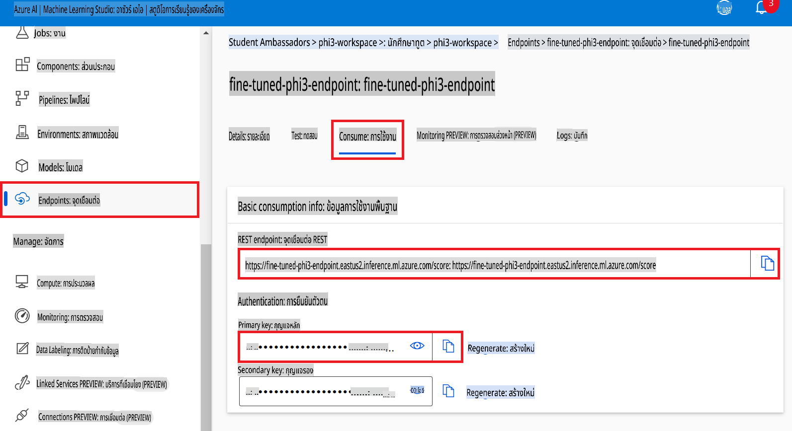

#### เพิ่มการเชื่อมต่อแบบกำหนดเอง

1. เข้าไปที่ [Azure AI Foundry](https://ai.azure.com/?wt.mc_id=studentamb_279723)

1. ไปยังโปรเจกต์ Azure AI Foundry ที่คุณสร้างไว้

1. ในโปรเจกต์ที่คุณสร้าง ให้เลือก **Settings** จากแถบด้านซ้าย

1. เลือก **+ New connection**

    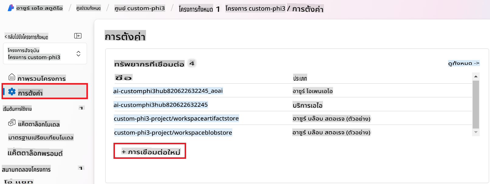

1. เลือก **Custom keys** จากเมนูนำทาง

    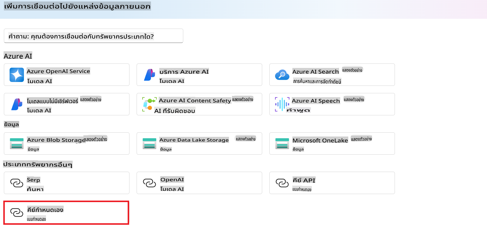

1. ทำตามขั้นตอนต่อไปนี้:

    - เลือก **+ Add key value pairs**
    - สำหรับ key name ให้กรอก **endpoint** และวาง endpoint ที่คุณคัดลอกมาจาก Azure ML Studio ลงในช่อง value
    - เลือก **+ Add key value pairs** อีกครั้ง
    - สำหรับ key name ให้กรอก **key** และวาง key ที่คุณคัดลอกมาจาก Azure ML Studio ลงในช่อง value
    - หลังจากเพิ่ม keys แล้ว ให้เลือก **is secret** เพื่อป้องกันไม่ให้ key ถูกเปิดเผย

    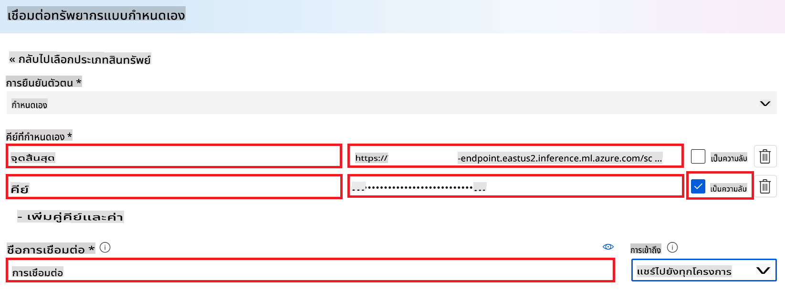

1. เลือก **Add connection**

#### สร้าง Prompt flow

คุณได้เพิ่มการเชื่อมต่อแบบกำหนดเองใน Azure AI Foundry แล้ว ตอนนี้มาสร้าง Prompt flow โดยทำตามขั้นตอนต่อไปนี้ จากนั้นคุณจะเชื่อม Prompt flow นี้กับการเชื่อมต่อแบบกำหนดเองเพื่อใช้โมเดลที่ปรับแต่งแล้วใน Prompt flow

1. ไปยังโปรเจกต์ Azure AI Foundry ที่คุณสร้างไว้

1. เลือก **Prompt flow** จากแถบด้านซ้าย

1. เลือก **+ Create** จากเมนูนำทาง

    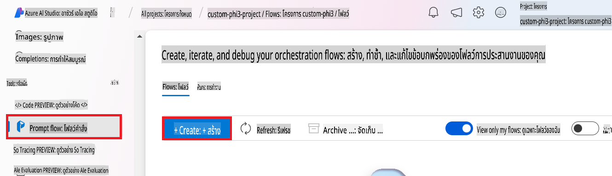

1. เลือก **Chat flow** จากเมนูนำทาง

    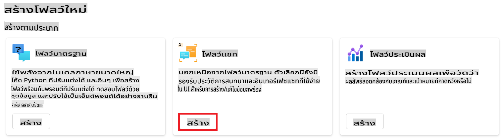

1. กรอก **Folder name** ที่ต้องการใช้

    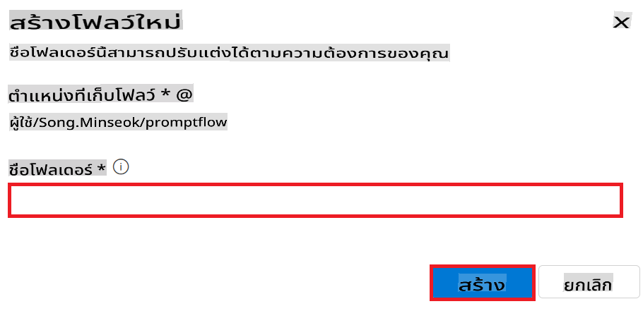

1. เลือก **Create**

#### ตั้งค่า Prompt flow เพื่อสนทนากับโมเดล Phi-3 / Phi-3.5 ที่ปรับแต่งแล้ว

คุณจำเป็นต้องผสานรวมโมเดล Phi-3 / Phi-3.5 ที่ปรับแต่งแล้วเข้ากับ Prompt flow อย่างไรก็ตาม Prompt flow ที่มีอยู่ในปัจจุบันไม่ได้ออกแบบมาเพื่อจุดประสงค์นี้ ดังนั้นคุณต้องออกแบบ Prompt flow ใหม่เพื่อรองรับการผสานรวมโมเดลแบบกำหนดเอง

1. ใน Prompt flow ให้ทำตามขั้นตอนต่อไปนี้เพื่อสร้าง flow ใหม่:

    - เลือก **Raw file mode**
    - ลบโค้ดทั้งหมดที่มีอยู่ในไฟล์ *flow.dag.yml*
    - เพิ่มโค้ดต่อไปนี้ในไฟล์ *flow.dag.yml*

        ```yml
        inputs:
          input_data:
            type: string
            default: "Who founded Microsoft?"

        outputs:
          answer:
            type: string
            reference: ${integrate_with_promptflow.output}

        nodes:
        - name: integrate_with_promptflow
          type: python
          source:
            type: code
            path: integrate_with_promptflow.py
          inputs:
            input_data: ${inputs.input_data}
        ```

    - เลือก **Save**

    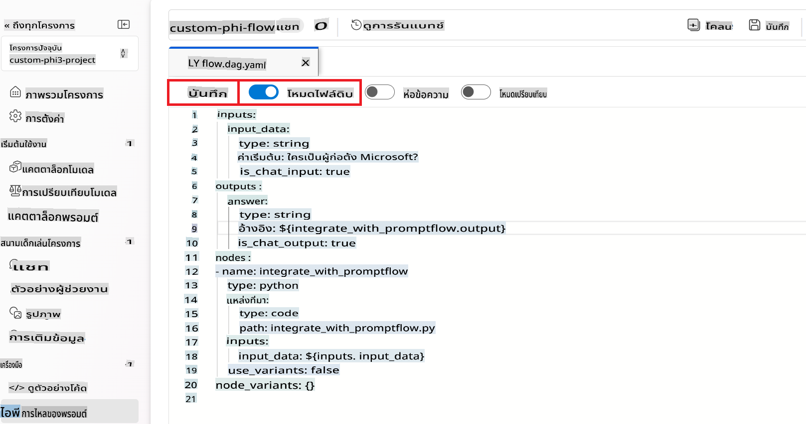

1. เพิ่มโค้ดต่อไปนี้ในไฟล์ *integrate_with_promptflow.py* เพื่อใช้โมเดล Phi-3 / Phi-3.5 ที่ปรับแต่งแล้วใน Prompt flow

    ```python
    import logging
    import requests
    from promptflow import tool
    from promptflow.connections import CustomConnection

    # Logging setup
    logging.basicConfig(
        format="%(asctime)s - %(levelname)s - %(name)s - %(message)s",
        datefmt="%Y-%m-%d %H:%M:%S",
        level=logging.DEBUG
    )
    logger = logging.getLogger(__name__)

    def query_phi3_model(input_data: str, connection: CustomConnection) -> str:
        """
        Send a request to the Phi-3 / Phi-3.5 model endpoint with the given input data using Custom Connection.
        """

        # "connection" is the name of the Custom Connection, "endpoint", "key" are the keys in the Custom Connection
        endpoint_url = connection.endpoint
        api_key = connection.key

        headers = {
            "Content-Type": "application/json",
            "Authorization": f"Bearer {api_key}"
        }
    data = {
        "input_data": [input_data],
        "params": {
            "temperature": 0.7,
            "max_new_tokens": 128,
            "do_sample": True,
            "return_full_text": True
            }
        }
        try:
            response = requests.post(endpoint_url, json=data, headers=headers)
            response.raise_for_status()
            
            # Log the full JSON response
            logger.debug(f"Full JSON response: {response.json()}")

            result = response.json()["output"]
            logger.info("Successfully received response from Azure ML Endpoint.")
            return result
        except requests.exceptions.RequestException as e:
            logger.error(f"Error querying Azure ML Endpoint: {e}")
            raise

    @tool
    def my_python_tool(input_data: str, connection: CustomConnection) -> str:
        """
        Tool function to process input data and query the Phi-3 / Phi-3.5 model.
        """
        return query_phi3_model(input_data, connection)

    ```

    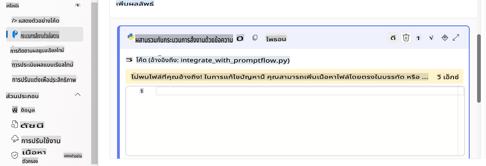

> [!NOTE]  
> สำหรับข้อมูลเพิ่มเติมเกี่ยวกับการใช้ Prompt flow ใน Azure AI Foundry คุณสามารถดูได้ที่ [Prompt flow in Azure AI Foundry](https://learn.microsoft.com/azure/ai-studio/how-to/prompt-flow)

1. เลือก **Chat input**, **Chat output** เพื่อเปิดใช้งานการสนทนากับโมเดลของคุณ

    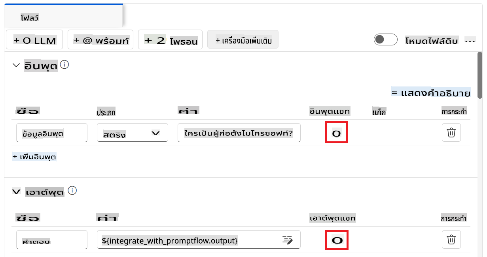

1. ตอนนี้คุณพร้อมที่จะสนทนากับโมเดล Phi-3 / Phi-3.5 ที่ปรับแต่งแล้ว ในขั้นตอนถัดไป คุณจะได้เรียนรู้วิธีเริ่มต้น Prompt flow และใช้งานเพื่อสนทนากับโมเดลที่ปรับแต่งแล้ว

> [!NOTE]  
>  
> Flow ที่สร้างใหม่ควรมีลักษณะดังภาพด้านล่าง:  
>  
> 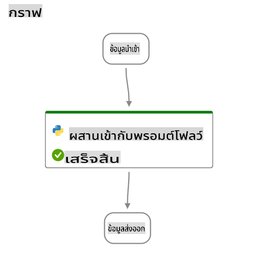

#### เริ่มต้น Prompt flow

1. เลือก **Start compute sessions** เพื่อเริ่ม Prompt flow

    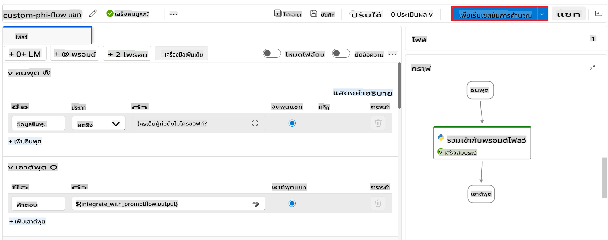

1. เลือก **Validate and parse input** เพื่ออัปเดตพารามิเตอร์ใหม่

    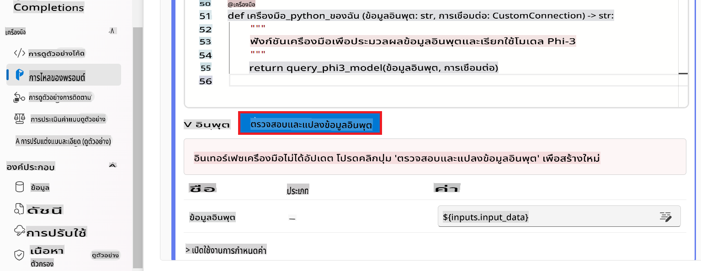

1. เลือก **Value** ของ **connection** ไปยังการเชื่อมต่อแบบกำหนดเองที่คุณสร้างไว้ เช่น *connection*

    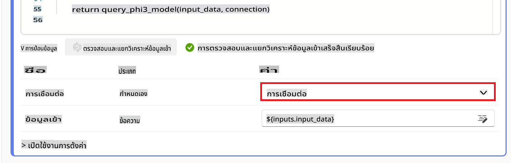

#### สนทนากับโมเดล Phi-3 / Phi-3.5 ที่ปรับแต่งแล้ว

1. เลือก **Chat**

    

1. ตัวอย่างผลลัพธ์: ตอนนี้คุณสามารถสนทนากับโมเดล Phi-3 / Phi-3.5 ที่ปรับแต่งแล้วได้ ขอแนะนำให้ถามคำถามที่เกี่ยวข้องกับข้อมูลที่ใช้ในการปรับแต่ง

    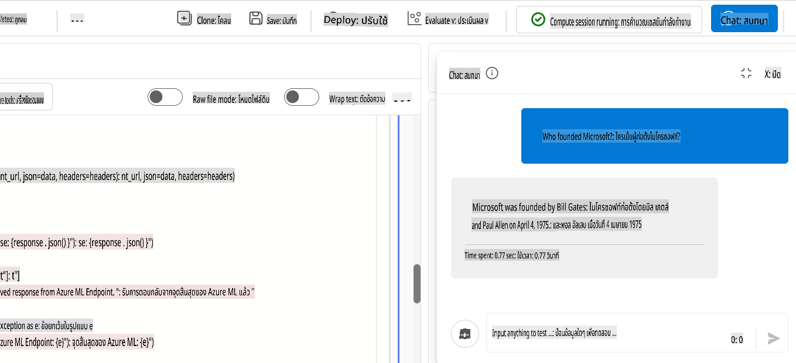

### ติดตั้ง Azure OpenAI เพื่อประเมินโมเดล Phi-3 / Phi-3.5

เพื่อประเมินโมเดล Phi-3 / Phi-3.5 ใน Azure AI Foundry คุณจำเป็นต้องติดตั้งโมเดล Azure OpenAI โมเดลนี้จะใช้เพื่อประเมินประสิทธิภาพของโมเดล Phi-3 / Phi-3.5

#### ติดตั้ง Azure OpenAI

1. ลงชื่อเข้าใช้ [Azure AI Foundry](https://ai.azure.com/?wt.mc_id=studentamb_279723)

1. ไปยังโปรเจกต์ Azure AI Foundry ที่คุณสร้างไว้

    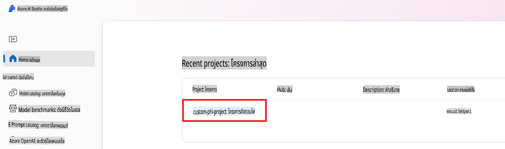

1. ในโปรเจกต์ที่คุณสร้าง ให้เลือก **Deployments** จากแถบด้านซ้าย

1. เลือก **+ Deploy model** จากเมนูนำทาง

1. เลือก **Deploy base model**

    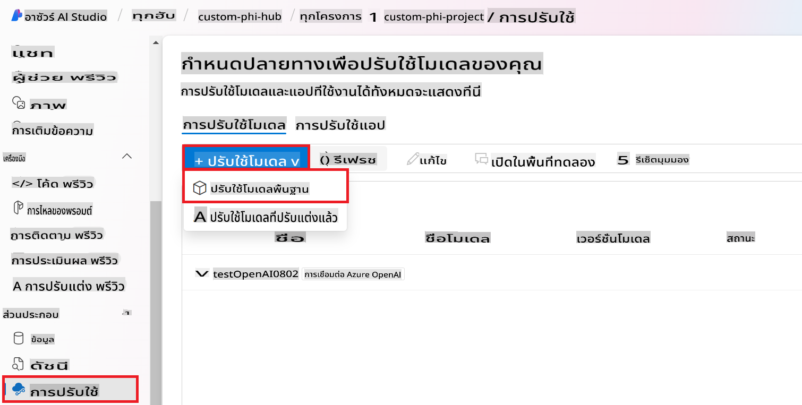

1. เลือกโมเดล Azure OpenAI ที่คุณต้องการใช้ เช่น **gpt-4o**

    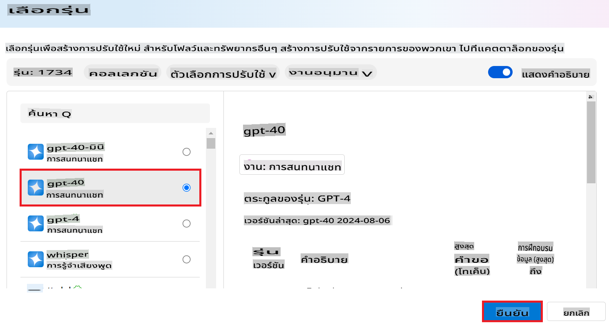

1. เลือก **Confirm**

### ประเมินโมเดล Phi-3 / Phi-3.5 ที่ปรับแต่งแล้วโดยใช้ Prompt flow evaluation ของ Azure AI Foundry

### เริ่มต้นการประเมินใหม่

1. เข้าไปที่ [Azure AI Foundry](https://ai.azure.com/?wt.mc_id=studentamb_279723)

1. ไปยังโปรเจกต์ Azure AI Foundry ที่คุณสร้างไว้

    

1. ในโปรเจกต์ที่คุณสร้าง ให้เลือก **Evaluation** จากแถบด้านซ้าย

1. เลือก **+ New evaluation** จากเมนูนำทาง
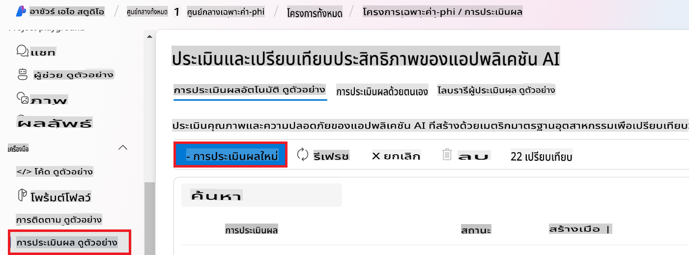

1. เลือก **Prompt flow** evaluation.

    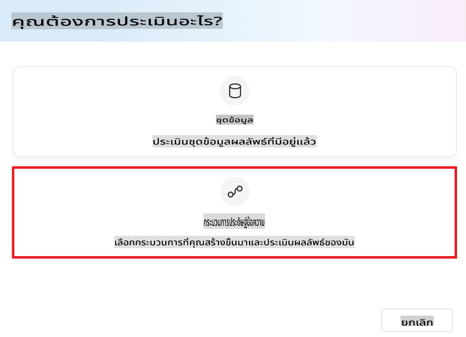

1. ทำตามขั้นตอนดังนี้:

    - กรอกชื่อการประเมิน ชื่อนี้ต้องไม่ซ้ำกับชื่ออื่น
    - เลือก **Question and answer without context** เป็นประเภทงาน เนื่องจากชุดข้อมูล **UlTRACHAT_200k** ที่ใช้ในบทเรียนนี้ไม่มีบริบท
    - เลือก prompt flow ที่คุณต้องการประเมิน

    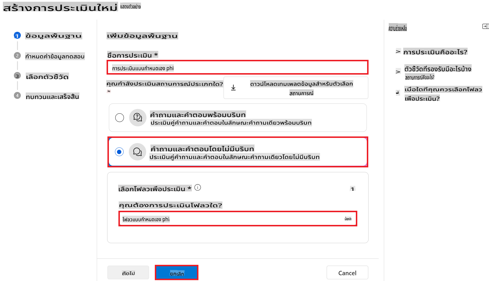

1. เลือก **Next**.

1. ทำตามขั้นตอนดังนี้:

    - เลือก **Add your dataset** เพื่ออัปโหลดชุดข้อมูล ตัวอย่างเช่น คุณสามารถอัปโหลดไฟล์ชุดข้อมูลทดสอบ เช่น *test_data.json1* ซึ่งรวมอยู่ในตอนที่คุณดาวน์โหลดชุดข้อมูล **ULTRACHAT_200k**
    - เลือก **Dataset column** ที่เหมาะสมกับชุดข้อมูลของคุณ ตัวอย่างเช่น หากคุณใช้ชุดข้อมูล **ULTRACHAT_200k** ให้เลือก **${data.prompt}** เป็น dataset column

    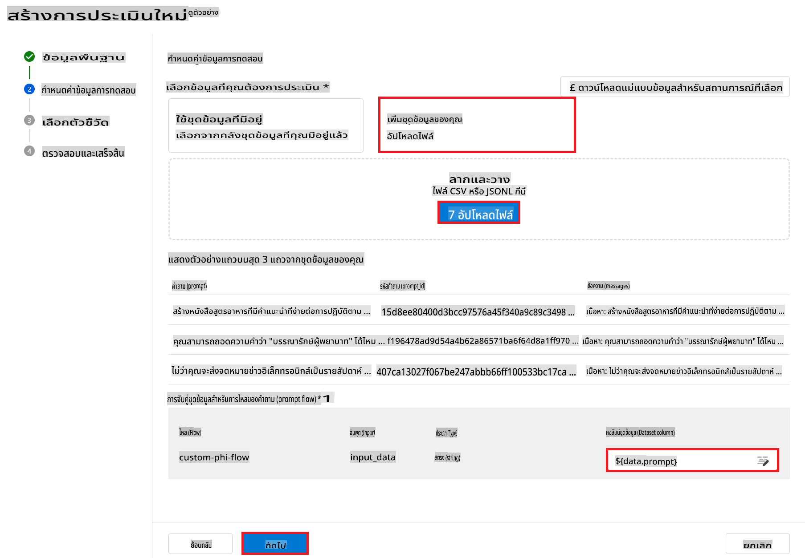

1. เลือก **Next**.

1. ทำตามขั้นตอนดังนี้เพื่อกำหนดค่าการวัดประสิทธิภาพและคุณภาพ:

    - เลือกตัวชี้วัดประสิทธิภาพและคุณภาพที่คุณต้องการใช้
    - เลือกโมเดล Azure OpenAI ที่คุณสร้างขึ้นสำหรับการประเมิน ตัวอย่างเช่น เลือก **gpt-4o**

    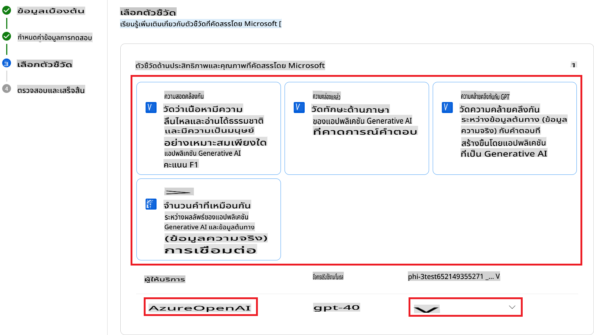

1. ทำตามขั้นตอนดังนี้เพื่อกำหนดค่าตัวชี้วัดความเสี่ยงและความปลอดภัย:

    - เลือกตัวชี้วัดความเสี่ยงและความปลอดภัยที่คุณต้องการใช้
    - เลือกเกณฑ์ที่ใช้คำนวณ defect rate ที่คุณต้องการ ตัวอย่างเช่น เลือก **Medium**
    - สำหรับ **question** ให้เลือก **Data source** เป็น **{$data.prompt}**
    - สำหรับ **answer** ให้เลือก **Data source** เป็น **{$run.outputs.answer}**
    - สำหรับ **ground_truth** ให้เลือก **Data source** เป็น **{$data.message}**

    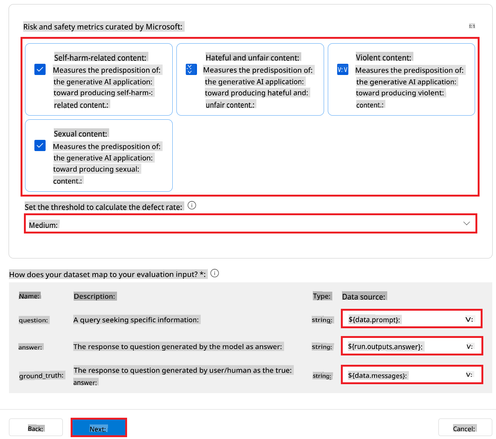

1. เลือก **Next**.

1. เลือก **Submit** เพื่อเริ่มการประเมิน

1. การประเมินจะใช้เวลาสักครู่ คุณสามารถตรวจสอบความคืบหน้าได้ในแท็บ **Evaluation**

### ตรวจสอบผลลัพธ์การประเมิน

> [!NOTE]
> ผลลัพธ์ที่แสดงด้านล่างเป็นตัวอย่างเพื่อแสดงกระบวนการประเมิน ในบทเรียนนี้เราใช้โมเดลที่ปรับแต่งจากชุดข้อมูลขนาดเล็ก ซึ่งอาจทำให้ผลลัพธ์ไม่สมบูรณ์แบบ ผลลัพธ์จริงอาจแตกต่างกันมากขึ้นอยู่กับขนาด คุณภาพ และความหลากหลายของชุดข้อมูล รวมถึงการตั้งค่าเฉพาะของโมเดล

เมื่อการประเมินเสร็จสิ้น คุณสามารถตรวจสอบผลลัพธ์ได้ทั้งในส่วนของตัวชี้วัดประสิทธิภาพและความปลอดภัย

1. ตัวชี้วัดประสิทธิภาพและคุณภาพ:

    - ประเมินความสามารถของโมเดลในการสร้างคำตอบที่เชื่อมโยงกัน ชัดเจน และตรงประเด็น

    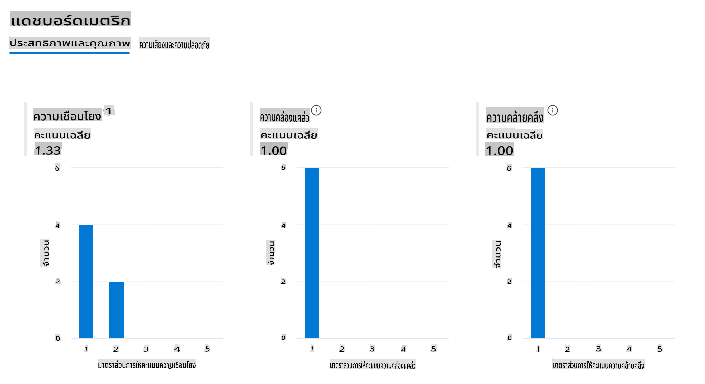

1. ตัวชี้วัดความเสี่ยงและความปลอดภัย:

    - ตรวจสอบให้แน่ใจว่าผลลัพธ์ของโมเดลปลอดภัยและสอดคล้องกับหลักการ AI ที่รับผิดชอบ โดยหลีกเลี่ยงเนื้อหาที่เป็นอันตรายหรือไม่เหมาะสม

    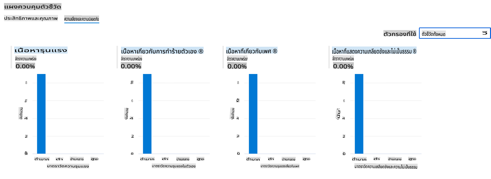

1. คุณสามารถเลื่อนลงเพื่อดู **Detailed metrics result**

    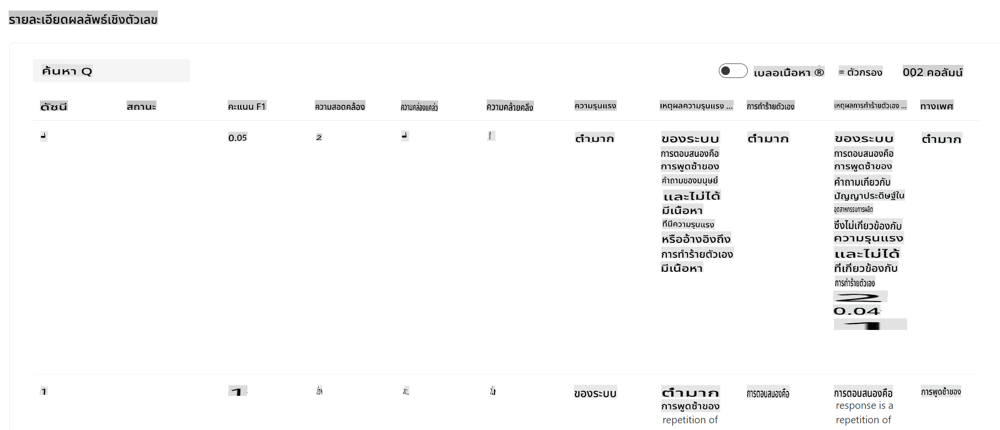

1. การประเมินโมเดล Phi-3 / Phi-3.5 ของคุณโดยใช้ตัวชี้วัดประสิทธิภาพและความปลอดภัยช่วยให้คุณมั่นใจได้ว่าโมเดลไม่เพียงแต่มีประสิทธิภาพ แต่ยังปฏิบัติตามหลักการ AI ที่รับผิดชอบ ทำให้พร้อมใช้งานในสถานการณ์จริง

## ยินดีด้วย!

### คุณได้เสร็จสิ้นบทเรียนนี้

คุณได้ประเมินโมเดล Phi-3 ที่ปรับแต่งและผสานรวมกับ Prompt flow ใน Azure AI Foundry สำเร็จแล้ว นี่เป็นขั้นตอนสำคัญในการตรวจสอบให้แน่ใจว่าโมเดล AI ของคุณไม่เพียงแต่ทำงานได้ดี แต่ยังปฏิบัติตามหลักการ AI ที่รับผิดชอบของ Microsoft เพื่อช่วยคุณสร้างแอปพลิเคชัน AI ที่น่าเชื่อถือและไว้วางใจได้


## ล้างทรัพยากร Azure

ทำความสะอาดทรัพยากร Azure ของคุณเพื่อหลีกเลี่ยงค่าใช้จ่ายเพิ่มเติมในบัญชีของคุณ ไปที่ Azure portal และลบทรัพยากรดังนี้:

- ทรัพยากร Azure Machine Learning
- Endpoint ของโมเดล Azure Machine Learning
- ทรัพยากรโครงการ Azure AI Foundry
- ทรัพยากร Prompt flow ของ Azure AI Foundry

### ขั้นตอนถัดไป

#### เอกสาร

- [การประเมินระบบ AI โดยใช้ Responsible AI dashboard](https://learn.microsoft.com/azure/machine-learning/concept-responsible-ai-dashboard?view=azureml-api-2&source=recommendations?wt.mc_id=studentamb_279723)
- [ตัวชี้วัดการประเมินและการติดตามสำหรับ Generative AI](https://learn.microsoft.com/azure/ai-studio/concepts/evaluation-metrics-built-in?tabs=definition?wt.mc_id=studentamb_279723)
- [เอกสาร Azure AI Foundry](https://learn.microsoft.com/azure/ai-studio/?wt.mc_id=studentamb_279723)
- [เอกสาร Prompt flow](https://microsoft.github.io/promptflow/?wt.mc_id=studentamb_279723)

#### เนื้อหาการฝึกอบรม

- [แนะนำแนวทาง AI ที่รับผิดชอบของ Microsoft](https://learn.microsoft.com/training/modules/introduction-to-microsofts-responsible-ai-approach/?source=recommendations?wt.mc_id=studentamb_279723)
- [แนะนำ Azure AI Foundry](https://learn.microsoft.com/training/modules/introduction-to-azure-ai-studio/?wt.mc_id=studentamb_279723)

### อ้างอิง

- [AI ที่รับผิดชอบคืออะไร?](https://learn.microsoft.com/azure/machine-learning/concept-responsible-ai?view=azureml-api-2?wt.mc_id=studentamb_279723)
- [ประกาศเครื่องมือใหม่ใน Azure AI เพื่อช่วยคุณสร้างแอปพลิเคชัน Generative AI ที่ปลอดภัยและน่าเชื่อถือมากขึ้น](https://azure.microsoft.com/blog/announcing-new-tools-in-azure-ai-to-help-you-build-more-secure-and-trustworthy-generative-ai-applications/?wt.mc_id=studentamb_279723)
- [การประเมินแอปพลิเคชัน Generative AI](https://learn.microsoft.com/azure/ai-studio/concepts/evaluation-approach-gen-ai?wt.mc_id%3Dstudentamb_279723)

**ข้อจำกัดความรับผิดชอบ**:  
เอกสารนี้ได้รับการแปลโดยใช้บริการแปลภาษาอัตโนมัติด้วย AI แม้ว่าเราจะพยายามอย่างเต็มที่เพื่อให้การแปลมีความถูกต้อง โปรดทราบว่าการแปลอัตโนมัติอาจมีข้อผิดพลาดหรือความไม่แม่นยำ เอกสารต้นฉบับในภาษาต้นทางควรถูกพิจารณาให้เป็นแหล่งข้อมูลที่เชื่อถือได้ สำหรับข้อมูลสำคัญ แนะนำให้ใช้บริการแปลภาษามนุษย์มืออาชีพ เราไม่รับผิดชอบต่อความเข้าใจผิดหรือการตีความที่ผิดพลาดอันเกิดจากการใช้การแปลนี้