# ปรับแต่งและผสานรวมโมเดล Phi-3 แบบกำหนดเองกับ Prompt flow

ตัวอย่างแบบครบวงจร (E2E) นี้อ้างอิงจากคู่มือ "[ปรับแต่งและผสานรวมโมเดล Phi-3 แบบกำหนดเองกับ Prompt Flow: คู่มือทีละขั้นตอน](https://techcommunity.microsoft.com/t5/educator-developer-blog/fine-tune-and-integrate-custom-phi-3-models-with-prompt-flow/ba-p/4178612?WT.mc_id=aiml-137032-kinfeylo)" จาก Microsoft Tech Community ซึ่งจะแนะนำกระบวนการปรับแต่ง การปรับใช้ และการผสานรวมโมเดล Phi-3 แบบกำหนดเองกับ Prompt flow

## ภาพรวม

ในตัวอย่าง E2E นี้ คุณจะได้เรียนรู้วิธีการปรับแต่งโมเดล Phi-3 และผสานรวมกับ Prompt flow โดยใช้ Azure Machine Learning และ Prompt flow เพื่อสร้างเวิร์กโฟลว์สำหรับการปรับใช้และใช้งานโมเดล AI แบบกำหนดเอง ตัวอย่าง E2E นี้แบ่งออกเป็น 3 สถานการณ์:

**สถานการณ์ที่ 1: ตั้งค่าทรัพยากร Azure และเตรียมการปรับแต่ง**

**สถานการณ์ที่ 2: ปรับแต่งโมเดล Phi-3 และปรับใช้ใน Azure Machine Learning Studio**

**สถานการณ์ที่ 3: ผสานรวมกับ Prompt flow และสนทนากับโมเดลของคุณ**

นี่คือภาพรวมของตัวอย่าง E2E นี้:

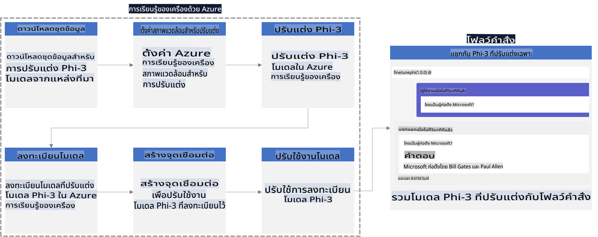

### สารบัญ

1. **[สถานการณ์ที่ 1: ตั้งค่าทรัพยากร Azure และเตรียมการปรับแต่ง](../../../../../../md/02.Application/01.TextAndChat/Phi3)**
    - [สร้าง Azure Machine Learning Workspace](../../../../../../md/02.Application/01.TextAndChat/Phi3)
    - [ร้องขอ GPU quotas ใน Azure Subscription](../../../../../../md/02.Application/01.TextAndChat/Phi3)
    - [เพิ่มการกำหนดบทบาท (Role Assignment)](../../../../../../md/02.Application/01.TextAndChat/Phi3)
    - [ตั้งค่าโปรเจกต์](../../../../../../md/02.Application/01.TextAndChat/Phi3)
    - [เตรียมชุดข้อมูลสำหรับการปรับแต่ง](../../../../../../md/02.Application/01.TextAndChat/Phi3)

1. **[สถานการณ์ที่ 2: ปรับแต่งโมเดล Phi-3 และปรับใช้ใน Azure Machine Learning Studio](../../../../../../md/02.Application/01.TextAndChat/Phi3)**
    - [ตั้งค่า Azure CLI](../../../../../../md/02.Application/01.TextAndChat/Phi3)
    - [ปรับแต่งโมเดล Phi-3](../../../../../../md/02.Application/01.TextAndChat/Phi3)
    - [ปรับใช้โมเดลที่ปรับแต่งแล้ว](../../../../../../md/02.Application/01.TextAndChat/Phi3)

1. **[สถานการณ์ที่ 3: ผสานรวมกับ Prompt flow และสนทนากับโมเดลของคุณ](../../../../../../md/02.Application/01.TextAndChat/Phi3)**
    - [ผสานรวมโมเดล Phi-3 แบบกำหนดเองกับ Prompt flow](../../../../../../md/02.Application/01.TextAndChat/Phi3)
    - [สนทนากับโมเดลของคุณ](../../../../../../md/02.Application/01.TextAndChat/Phi3)

## สถานการณ์ที่ 1: ตั้งค่าทรัพยากร Azure และเตรียมการปรับแต่ง

### สร้าง Azure Machine Learning Workspace

1. พิมพ์ *azure machine learning* ใน **แถบค้นหา** ที่ด้านบนของหน้าเว็บพอร์ทัลและเลือก **Azure Machine Learning** จากตัวเลือกที่ปรากฏ

    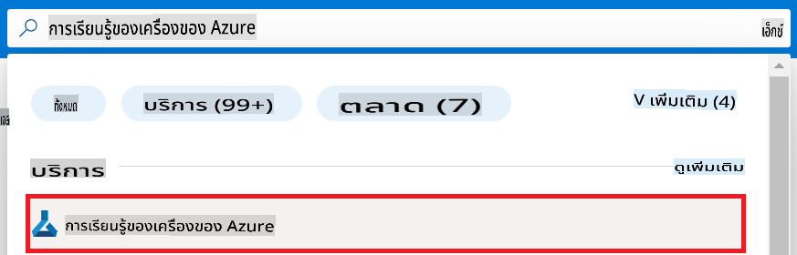

1. เลือก **+ Create** จากเมนูนำทาง

1. เลือก **New workspace** จากเมนูนำทาง

    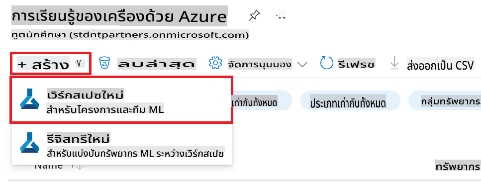

1. ทำตามขั้นตอนดังนี้:

    - เลือก **Subscription** ของ Azure ของคุณ
    - เลือก **Resource group** ที่ต้องการใช้ (สร้างใหม่หากจำเป็น)
    - ป้อน **Workspace Name** ซึ่งต้องไม่ซ้ำกัน
    - เลือก **Region** ที่ต้องการใช้
    - เลือก **Storage account** ที่ต้องการใช้ (สร้างใหม่หากจำเป็น)
    - เลือก **Key vault** ที่ต้องการใช้ (สร้างใหม่หากจำเป็น)
    - เลือก **Application insights** ที่ต้องการใช้ (สร้างใหม่หากจำเป็น)
    - เลือก **Container registry** ที่ต้องการใช้ (สร้างใหม่หากจำเป็น)

    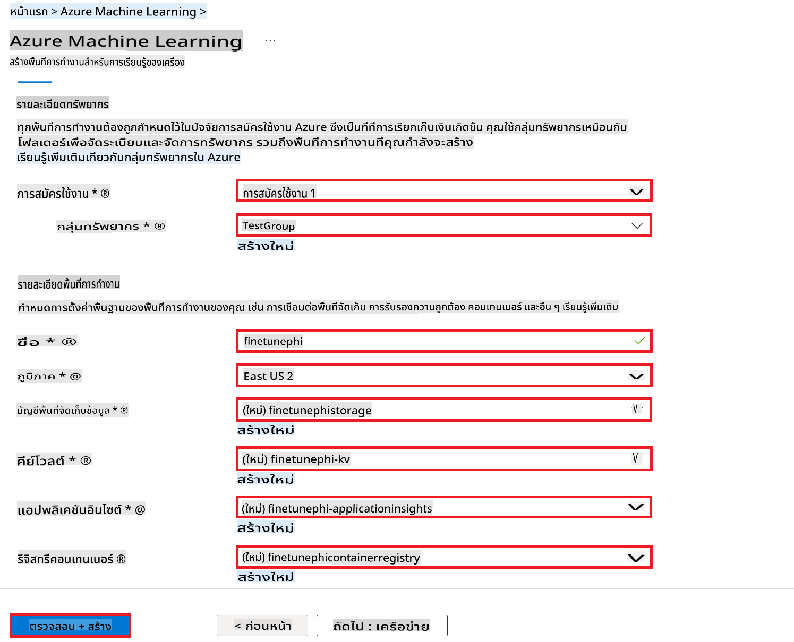

1. เลือก **Review + Create**

1. เลือก **Create**

### ร้องขอ GPU quotas ใน Azure Subscription

ในตัวอย่าง E2E นี้ คุณจะใช้ *Standard_NC24ads_A100_v4 GPU* สำหรับการปรับแต่ง ซึ่งต้องมีการร้องขอโควตา และใช้ *Standard_E4s_v3* CPU สำหรับการปรับใช้ ซึ่งไม่ต้องร้องขอโควตา

> [!NOTE]
>
> เฉพาะ Subscription แบบ Pay-As-You-Go (ประเภท Subscription มาตรฐาน) เท่านั้นที่สามารถขอโควตา GPU ได้; Subscription แบบสิทธิประโยชน์ไม่รองรับในขณะนี้
>
> สำหรับผู้ที่ใช้ Subscription แบบสิทธิประโยชน์ (เช่น Visual Studio Enterprise Subscription) หรือผู้ที่ต้องการทดสอบกระบวนการปรับแต่งและปรับใช้อย่างรวดเร็ว บทแนะนำนี้ยังมีคำแนะนำสำหรับการปรับแต่งด้วยชุดข้อมูลขนาดเล็กโดยใช้ CPU อย่างไรก็ตาม ผลลัพธ์ของการปรับแต่งจะดีกว่ามากเมื่อใช้ GPU กับชุดข้อมูลขนาดใหญ่

1. ไปที่ [Azure ML Studio](https://ml.azure.com/home?wt.mc_id=studentamb_279723)

1. ทำตามขั้นตอนดังนี้เพื่อร้องขอโควตา *Standard NCADSA100v4 Family*:

    - เลือก **Quota** จากแท็บด้านซ้าย
    - เลือก **Virtual machine family** ที่ต้องการใช้ เช่น **Standard NCADSA100v4 Family Cluster Dedicated vCPUs** ซึ่งรวมถึง *Standard_NC24ads_A100_v4* GPU
    - เลือก **Request quota** จากเมนูนำทาง

        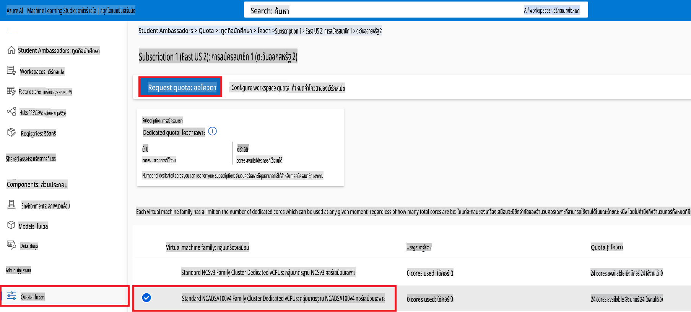

    - ในหน้าร้องขอโควตา ให้ป้อน **New cores limit** ที่ต้องการใช้ เช่น 24
    - ในหน้าร้องขอโควตา เลือก **Submit** เพื่อร้องขอโควตา GPU

> [!NOTE]
> คุณสามารถเลือก GPU หรือ CPU ที่เหมาะสมกับความต้องการของคุณได้โดยอ้างอิงจากเอกสาร [Sizes for Virtual Machines in Azure](https://learn.microsoft.com/azure/virtual-machines/sizes/overview?tabs=breakdownseries%2Cgeneralsizelist%2Ccomputesizelist%2Cmemorysizelist%2Cstoragesizelist%2Cgpusizelist%2Cfpgasizelist%2Chpcsizelist)

### เพิ่มการกำหนดบทบาท (Role Assignment)

เพื่อปรับแต่งและปรับใช้โมเดลของคุณ คุณต้องสร้าง User Assigned Managed Identity (UAI) และกำหนดสิทธิ์ที่เหมาะสมให้กับมัน UAI นี้จะถูกใช้สำหรับการยืนยันตัวตนระหว่างการปรับใช้

#### สร้าง User Assigned Managed Identity (UAI)

1. พิมพ์ *managed identities* ใน **แถบค้นหา** ที่ด้านบนของหน้าเว็บพอร์ทัลและเลือก **Managed Identities** จากตัวเลือกที่ปรากฏ

    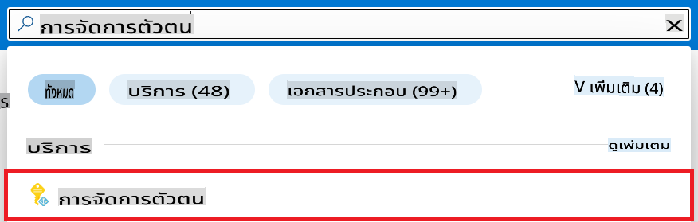

1. เลือก **+ Create**

    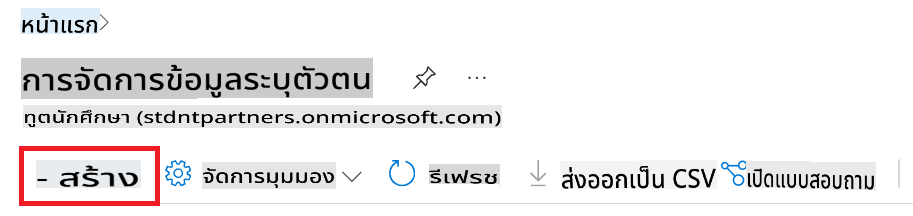

1. ทำตามขั้นตอนดังนี้:

    - เลือก **Subscription** ของ Azure ของคุณ
    - เลือก **Resource group** ที่ต้องการใช้ (สร้างใหม่หากจำเป็น)
    - เลือก **Region** ที่ต้องการใช้
    - ป้อน **Name** ซึ่งต้องไม่ซ้ำกัน

1. เลือก **Review + create**

1. เลือก **+ Create**

... (คำแปลเพิ่มเติมจะดำเนินการในลักษณะเดียวกันตามคำร้องขอ)
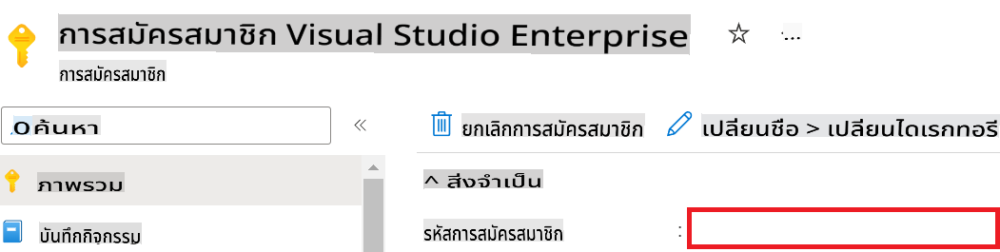

1. ทำตามขั้นตอนด้านล่างเพื่อเพิ่ม Azure Workspace Name:

    - ไปที่ทรัพยากร Azure Machine Learning ที่คุณสร้างไว้
    - คัดลอกและวางชื่อบัญชีของคุณลงในไฟล์ *config.py*

    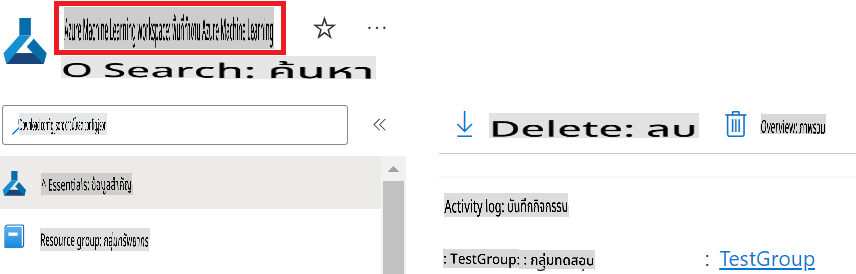

1. ทำตามขั้นตอนด้านล่างเพื่อเพิ่ม Azure Resource Group Name:

    - ไปที่ทรัพยากร Azure Machine Learning ที่คุณสร้างไว้
    - คัดลอกและวาง Azure Resource Group Name ของคุณลงในไฟล์ *config.py*

    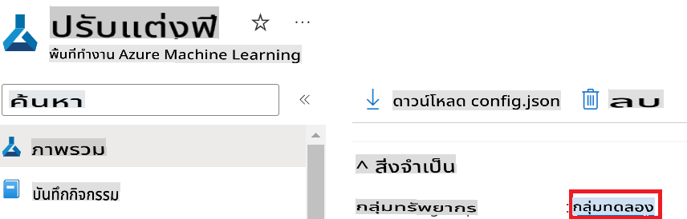

2. ทำตามขั้นตอนด้านล่างเพื่อเพิ่ม Azure Managed Identity name:

    - ไปที่ทรัพยากร Managed Identities ที่คุณสร้างไว้
    - คัดลอกและวางชื่อ Azure Managed Identity ของคุณลงในไฟล์ *config.py*

    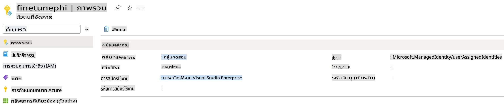

### เตรียมชุดข้อมูลสำหรับการ fine-tuning

ในแบบฝึกหัดนี้ คุณจะรันไฟล์ *download_dataset.py* เพื่อดาวน์โหลดชุดข้อมูล *ULTRACHAT_200k* ลงในสภาพแวดล้อมของคุณ จากนั้นคุณจะใช้ชุดข้อมูลนี้ในการ fine-tune โมเดล Phi-3 ใน Azure Machine Learning

#### ดาวน์โหลดชุดข้อมูลของคุณโดยใช้ *download_dataset.py*

1. เปิดไฟล์ *download_dataset.py* ใน Visual Studio Code

1. เพิ่มโค้ดต่อไปนี้ลงใน *download_dataset.py*

    ```python
    import json
    import os
    from datasets import load_dataset
    from config import (
        TRAIN_DATA_PATH,
        TEST_DATA_PATH)

    def load_and_split_dataset(dataset_name, config_name, split_ratio):
        """
        Load and split a dataset.
        """
        # Load the dataset with the specified name, configuration, and split ratio
        dataset = load_dataset(dataset_name, config_name, split=split_ratio)
        print(f"Original dataset size: {len(dataset)}")
        
        # Split the dataset into train and test sets (80% train, 20% test)
        split_dataset = dataset.train_test_split(test_size=0.2)
        print(f"Train dataset size: {len(split_dataset['train'])}")
        print(f"Test dataset size: {len(split_dataset['test'])}")
        
        return split_dataset

    def save_dataset_to_jsonl(dataset, filepath):
        """
        Save a dataset to a JSONL file.
        """
        # Create the directory if it does not exist
        os.makedirs(os.path.dirname(filepath), exist_ok=True)
        
        # Open the file in write mode
        with open(filepath, 'w', encoding='utf-8') as f:
            # Iterate over each record in the dataset
            for record in dataset:
                # Dump the record as a JSON object and write it to the file
                json.dump(record, f)
                # Write a newline character to separate records
                f.write('\n')
        
        print(f"Dataset saved to {filepath}")

    def main():
        """
        Main function to load, split, and save the dataset.
        """
        # Load and split the ULTRACHAT_200k dataset with a specific configuration and split ratio
        dataset = load_and_split_dataset("HuggingFaceH4/ultrachat_200k", 'default', 'train_sft[:1%]')
        
        # Extract the train and test datasets from the split
        train_dataset = dataset['train']
        test_dataset = dataset['test']

        # Save the train dataset to a JSONL file
        save_dataset_to_jsonl(train_dataset, TRAIN_DATA_PATH)
        
        # Save the test dataset to a separate JSONL file
        save_dataset_to_jsonl(test_dataset, TEST_DATA_PATH)

    if __name__ == "__main__":
        main()

    ```

> [!TIP]
>
> **คำแนะนำสำหรับการ fine-tuning ด้วยชุดข้อมูลขนาดเล็กโดยใช้ CPU**
>
> หากคุณต้องการใช้ CPU ในการ fine-tuning วิธีนี้เหมาะสำหรับผู้ที่มีสิทธิ์การสมัครสมาชิก (เช่น Visual Studio Enterprise Subscription) หรือเพื่อทดสอบกระบวนการ fine-tuning และ deployment อย่างรวดเร็ว
>
> แทนที่ `dataset = load_and_split_dataset("HuggingFaceH4/ultrachat_200k", 'default', 'train_sft[:1%]')` with `dataset = load_and_split_dataset("HuggingFaceH4/ultrachat_200k", 'default', 'train_sft[:10]')`
>

1. พิมพ์คำสั่งต่อไปนี้ใน terminal เพื่อรันสคริปต์และดาวน์โหลดชุดข้อมูลลงในสภาพแวดล้อมของคุณ

    ```console
    python download_data.py
    ```

1. ตรวจสอบว่าชุดข้อมูลถูกบันทึกลงในไดเรกทอรี *finetune-phi/data* ของคุณสำเร็จแล้ว

> [!NOTE]
>
> **ขนาดของชุดข้อมูลและเวลาในการ fine-tuning**
>
> ในตัวอย่าง E2E นี้ คุณจะใช้เพียง 1% ของชุดข้อมูล (`train_sft[:1%]`) ซึ่งช่วยลดปริมาณข้อมูลได้อย่างมาก ทำให้กระบวนการอัปโหลดและ fine-tuning เร็วขึ้น คุณสามารถปรับเปอร์เซ็นต์เพื่อหาสมดุลระหว่างเวลาในการฝึกและประสิทธิภาพของโมเดล การใช้ชุดข้อมูลย่อยที่เล็กลงช่วยลดเวลาในการ fine-tuning ทำให้กระบวนการจัดการได้ง่ายขึ้นสำหรับตัวอย่าง E2E

## สถานการณ์ที่ 2: Fine-tune โมเดล Phi-3 และ Deploy ใน Azure Machine Learning Studio

### ตั้งค่า Azure CLI

คุณต้องตั้งค่า Azure CLI เพื่อยืนยันตัวตนของสภาพแวดล้อมของคุณ Azure CLI ช่วยให้คุณจัดการทรัพยากร Azure ได้โดยตรงจาก command line และให้ข้อมูลรับรองที่จำเป็นสำหรับ Azure Machine Learning ในการเข้าถึงทรัพยากรเหล่านี้ เริ่มต้นด้วยการติดตั้ง [Azure CLI](https://learn.microsoft.com/cli/azure/install-azure-cli)

1. เปิดหน้าต่าง terminal และพิมพ์คำสั่งต่อไปนี้เพื่อลงชื่อเข้าใช้บัญชี Azure ของคุณ

    ```console
    az login
    ```

1. เลือกบัญชี Azure ที่คุณต้องการใช้

1. เลือก subscription Azure ที่คุณต้องการใช้

    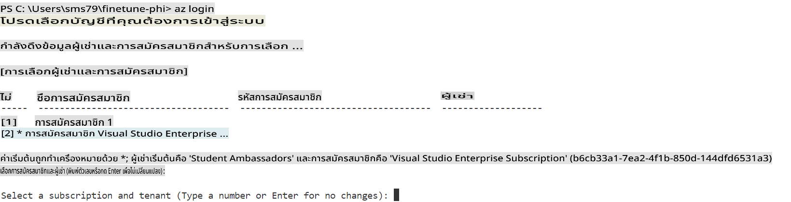

> [!TIP]
>
> หากคุณพบปัญหาในการลงชื่อเข้าใช้ Azure ให้ลองใช้รหัสอุปกรณ์ เปิดหน้าต่าง terminal และพิมพ์คำสั่งต่อไปนี้เพื่อลงชื่อเข้าใช้บัญชี Azure ของคุณ:
>
> ```console
> az login --use-device-code
> ```
>

### Fine-tune โมเดล Phi-3

ในแบบฝึกหัดนี้ คุณจะทำการ fine-tune โมเดล Phi-3 โดยใช้ชุดข้อมูลที่ให้มา เริ่มต้นด้วยการกำหนดกระบวนการ fine-tuning ในไฟล์ *fine_tune.py* จากนั้นกำหนดค่าการตั้งค่าสภาพแวดล้อม Azure Machine Learning และเริ่มกระบวนการ fine-tuning โดยการรันไฟล์ *setup_ml.py* ไฟล์นี้จะช่วยให้กระบวนการ fine-tuning เกิดขึ้นในสภาพแวดล้อม Azure Machine Learning

การรัน *setup_ml.py* จะเริ่มกระบวนการ fine-tuning ในสภาพแวดล้อม Azure Machine Learning

#### เพิ่มโค้ดลงในไฟล์ *fine_tune.py*

1. ไปที่โฟลเดอร์ *finetuning_dir* และเปิดไฟล์ *fine_tune.py* ใน Visual Studio Code

1. เพิ่มโค้ดต่อไปนี้ลงใน *fine_tune.py*

    ```python
    import argparse
    import sys
    import logging
    import os
    from datasets import load_dataset
    import torch
    import mlflow
    from transformers import AutoModelForCausalLM, AutoTokenizer, TrainingArguments
    from trl import SFTTrainer

    # To avoid the INVALID_PARAMETER_VALUE error in MLflow, disable MLflow integration
    os.environ["DISABLE_MLFLOW_INTEGRATION"] = "True"

    # Logging setup
    logging.basicConfig(
        format="%(asctime)s - %(levelname)s - %(name)s - %(message)s",
        datefmt="%Y-%m-%d %H:%M:%S",
        handlers=[logging.StreamHandler(sys.stdout)],
        level=logging.WARNING
    )
    logger = logging.getLogger(__name__)

    def initialize_model_and_tokenizer(model_name, model_kwargs):
        """
        Initialize the model and tokenizer with the given pretrained model name and arguments.
        """
        model = AutoModelForCausalLM.from_pretrained(model_name, **model_kwargs)
        tokenizer = AutoTokenizer.from_pretrained(model_name)
        tokenizer.model_max_length = 2048
        tokenizer.pad_token = tokenizer.unk_token
        tokenizer.pad_token_id = tokenizer.convert_tokens_to_ids(tokenizer.pad_token)
        tokenizer.padding_side = 'right'
        return model, tokenizer

    def apply_chat_template(example, tokenizer):
        """
        Apply a chat template to tokenize messages in the example.
        """
        messages = example["messages"]
        if messages[0]["role"] != "system":
            messages.insert(0, {"role": "system", "content": ""})
        example["text"] = tokenizer.apply_chat_template(
            messages, tokenize=False, add_generation_prompt=False
        )
        return example

    def load_and_preprocess_data(train_filepath, test_filepath, tokenizer):
        """
        Load and preprocess the dataset.
        """
        train_dataset = load_dataset('json', data_files=train_filepath, split='train')
        test_dataset = load_dataset('json', data_files=test_filepath, split='train')
        column_names = list(train_dataset.features)

        train_dataset = train_dataset.map(
            apply_chat_template,
            fn_kwargs={"tokenizer": tokenizer},
            num_proc=10,
            remove_columns=column_names,
            desc="Applying chat template to train dataset",
        )

        test_dataset = test_dataset.map(
            apply_chat_template,
            fn_kwargs={"tokenizer": tokenizer},
            num_proc=10,
            remove_columns=column_names,
            desc="Applying chat template to test dataset",
        )

        return train_dataset, test_dataset

    def train_and_evaluate_model(train_dataset, test_dataset, model, tokenizer, output_dir):
        """
        Train and evaluate the model.
        """
        training_args = TrainingArguments(
            bf16=True,
            do_eval=True,
            output_dir=output_dir,
            eval_strategy="epoch",
            learning_rate=5.0e-06,
            logging_steps=20,
            lr_scheduler_type="cosine",
            num_train_epochs=3,
            overwrite_output_dir=True,
            per_device_eval_batch_size=4,
            per_device_train_batch_size=4,
            remove_unused_columns=True,
            save_steps=500,
            seed=0,
            gradient_checkpointing=True,
            gradient_accumulation_steps=1,
            warmup_ratio=0.2,
        )

        trainer = SFTTrainer(
            model=model,
            args=training_args,
            train_dataset=train_dataset,
            eval_dataset=test_dataset,
            max_seq_length=2048,
            dataset_text_field="text",
            tokenizer=tokenizer,
            packing=True
        )

        train_result = trainer.train()
        trainer.log_metrics("train", train_result.metrics)

        mlflow.transformers.log_model(
            transformers_model={"model": trainer.model, "tokenizer": tokenizer},
            artifact_path=output_dir,
        )

        tokenizer.padding_side = 'left'
        eval_metrics = trainer.evaluate()
        eval_metrics["eval_samples"] = len(test_dataset)
        trainer.log_metrics("eval", eval_metrics)

    def main(train_file, eval_file, model_output_dir):
        """
        Main function to fine-tune the model.
        """
        model_kwargs = {
            "use_cache": False,
            "trust_remote_code": True,
            "torch_dtype": torch.bfloat16,
            "device_map": None,
            "attn_implementation": "eager"
        }

        # pretrained_model_name = "microsoft/Phi-3-mini-4k-instruct"
        pretrained_model_name = "microsoft/Phi-3.5-mini-instruct"

        with mlflow.start_run():
            model, tokenizer = initialize_model_and_tokenizer(pretrained_model_name, model_kwargs)
            train_dataset, test_dataset = load_and_preprocess_data(train_file, eval_file, tokenizer)
            train_and_evaluate_model(train_dataset, test_dataset, model, tokenizer, model_output_dir)

    if __name__ == "__main__":
        parser = argparse.ArgumentParser()
        parser.add_argument("--train-file", type=str, required=True, help="Path to the training data")
        parser.add_argument("--eval-file", type=str, required=True, help="Path to the evaluation data")
        parser.add_argument("--model_output_dir", type=str, required=True, help="Directory to save the fine-tuned model")
        args = parser.parse_args()
        main(args.train_file, args.eval_file, args.model_output_dir)

    ```

1. บันทึกและปิดไฟล์ *fine_tune.py*

> [!TIP]
> **คุณสามารถ fine-tune โมเดล Phi-3.5 ได้**
>
> ในไฟล์ *fine_tune.py* คุณสามารถเปลี่ยน `pretrained_model_name` from `"microsoft/Phi-3-mini-4k-instruct"` to any model you want to fine-tune. For example, if you change it to `"microsoft/Phi-3.5-mini-instruct"`, you'll be using the Phi-3.5-mini-instruct model for fine-tuning. To find and use the model name you prefer, visit [Hugging Face](https://huggingface.co/), search for the model you're interested in, and then copy and paste its name into the `pretrained_model_name` ในสคริปต์ของคุณ
>
> :::image type="content" source="../../imgs/03/FineTuning-PromptFlow/finetunephi3.5.png" alt-text="Fine tune Phi-3.5.":::
>

#### เพิ่มโค้ดลงในไฟล์ *setup_ml.py*

1. เปิดไฟล์ *setup_ml.py* ใน Visual Studio Code

1. เพิ่มโค้ดต่อไปนี้ลงใน *setup_ml.py*

    ```python
    import logging
    from azure.ai.ml import MLClient, command, Input
    from azure.ai.ml.entities import Environment, AmlCompute
    from azure.identity import AzureCliCredential
    from config import (
        AZURE_SUBSCRIPTION_ID,
        AZURE_RESOURCE_GROUP_NAME,
        AZURE_ML_WORKSPACE_NAME,
        TRAIN_DATA_PATH,
        TEST_DATA_PATH
    )

    # Constants

    # Uncomment the following lines to use a CPU instance for training
    # COMPUTE_INSTANCE_TYPE = "Standard_E16s_v3" # cpu
    # COMPUTE_NAME = "cpu-e16s-v3"
    # DOCKER_IMAGE_NAME = "mcr.microsoft.com/azureml/openmpi4.1.0-ubuntu20.04:latest"

    # Uncomment the following lines to use a GPU instance for training
    COMPUTE_INSTANCE_TYPE = "Standard_NC24ads_A100_v4"
    COMPUTE_NAME = "gpu-nc24s-a100-v4"
    DOCKER_IMAGE_NAME = "mcr.microsoft.com/azureml/curated/acft-hf-nlp-gpu:59"

    CONDA_FILE = "conda.yml"
    LOCATION = "eastus2" # Replace with the location of your compute cluster
    FINETUNING_DIR = "./finetuning_dir" # Path to the fine-tuning script
    TRAINING_ENV_NAME = "phi-3-training-environment" # Name of the training environment
    MODEL_OUTPUT_DIR = "./model_output" # Path to the model output directory in azure ml

    # Logging setup to track the process
    logger = logging.getLogger(__name__)
    logging.basicConfig(
        format="%(asctime)s - %(levelname)s - %(name)s - %(message)s",
        datefmt="%Y-%m-%d %H:%M:%S",
        level=logging.WARNING
    )

    def get_ml_client():
        """
        Initialize the ML Client using Azure CLI credentials.
        """
        credential = AzureCliCredential()
        return MLClient(credential, AZURE_SUBSCRIPTION_ID, AZURE_RESOURCE_GROUP_NAME, AZURE_ML_WORKSPACE_NAME)

    def create_or_get_environment(ml_client):
        """
        Create or update the training environment in Azure ML.
        """
        env = Environment(
            image=DOCKER_IMAGE_NAME,  # Docker image for the environment
            conda_file=CONDA_FILE,  # Conda environment file
            name=TRAINING_ENV_NAME,  # Name of the environment
        )
        return ml_client.environments.create_or_update(env)

    def create_or_get_compute_cluster(ml_client, compute_name, COMPUTE_INSTANCE_TYPE, location):
        """
        Create or update the compute cluster in Azure ML.
        """
        try:
            compute_cluster = ml_client.compute.get(compute_name)
            logger.info(f"Compute cluster '{compute_name}' already exists. Reusing it for the current run.")
        except Exception:
            logger.info(f"Compute cluster '{compute_name}' does not exist. Creating a new one with size {COMPUTE_INSTANCE_TYPE}.")
            compute_cluster = AmlCompute(
                name=compute_name,
                size=COMPUTE_INSTANCE_TYPE,
                location=location,
                tier="Dedicated",  # Tier of the compute cluster
                min_instances=0,  # Minimum number of instances
                max_instances=1  # Maximum number of instances
            )
            ml_client.compute.begin_create_or_update(compute_cluster).wait()  # Wait for the cluster to be created
        return compute_cluster

    def create_fine_tuning_job(env, compute_name):
        """
        Set up the fine-tuning job in Azure ML.
        """
        return command(
            code=FINETUNING_DIR,  # Path to fine_tune.py
            command=(
                "python fine_tune.py "
                "--train-file ${{inputs.train_file}} "
                "--eval-file ${{inputs.eval_file}} "
                "--model_output_dir ${{inputs.model_output}}"
            ),
            environment=env,  # Training environment
            compute=compute_name,  # Compute cluster to use
            inputs={
                "train_file": Input(type="uri_file", path=TRAIN_DATA_PATH),  # Path to the training data file
                "eval_file": Input(type="uri_file", path=TEST_DATA_PATH),  # Path to the evaluation data file
                "model_output": MODEL_OUTPUT_DIR
            }
        )

    def main():
        """
        Main function to set up and run the fine-tuning job in Azure ML.
        """
        # Initialize ML Client
        ml_client = get_ml_client()

        # Create Environment
        env = create_or_get_environment(ml_client)
        
        # Create or get existing compute cluster
        create_or_get_compute_cluster(ml_client, COMPUTE_NAME, COMPUTE_INSTANCE_TYPE, LOCATION)

        # Create and Submit Fine-Tuning Job
        job = create_fine_tuning_job(env, COMPUTE_NAME)
        returned_job = ml_client.jobs.create_or_update(job)  # Submit the job
        ml_client.jobs.stream(returned_job.name)  # Stream the job logs
        
        # Capture the job name
        job_name = returned_job.name
        print(f"Job name: {job_name}")

    if __name__ == "__main__":
        main()

    ```

1. แทนที่ `COMPUTE_INSTANCE_TYPE`, `COMPUTE_NAME`, and `LOCATION` ด้วยรายละเอียดของคุณ

    ```python
   # Uncomment the following lines to use a GPU instance for training
    COMPUTE_INSTANCE_TYPE = "Standard_NC24ads_A100_v4"
    COMPUTE_NAME = "gpu-nc24s-a100-v4"
    ...
    LOCATION = "eastus2" # Replace with the location of your compute cluster
    ```

> [!TIP]
>
> **คำแนะนำสำหรับการ fine-tuning ด้วยชุดข้อมูลขนาดเล็กโดยใช้ CPU**
>
> หากคุณต้องการใช้ CPU ในการ fine-tuning วิธีนี้เหมาะสำหรับผู้ที่มีสิทธิ์การสมัครสมาชิก (เช่น Visual Studio Enterprise Subscription) หรือเพื่อทดสอบกระบวนการ fine-tuning และ deployment อย่างรวดเร็ว
>
> 1. เปิดไฟล์ *setup_ml*
> 1. แทนที่ `COMPUTE_INSTANCE_TYPE`, `COMPUTE_NAME`, and `DOCKER_IMAGE_NAME` with the following. If you do not have access to *Standard_E16s_v3*, you can use an equivalent CPU instance or request a new quota.
> 1. Replace `LOCATION` ด้วยรายละเอียดของคุณ
>
>    ```python
>    # Uncomment the following lines to use a CPU instance for training
>    COMPUTE_INSTANCE_TYPE = "Standard_E16s_v3" # cpu
>    COMPUTE_NAME = "cpu-e16s-v3"
>    DOCKER_IMAGE_NAME = "mcr.microsoft.com/azureml/openmpi4.1.0-ubuntu20.04:latest"
>    LOCATION = "eastus2" # Replace with the location of your compute cluster
>    ```
>

1. พิมพ์คำสั่งต่อไปนี้เพื่อรันสคริปต์ *setup_ml.py* และเริ่มกระบวนการ fine-tuning ใน Azure Machine Learning

    ```python
    python setup_ml.py
    ```

1. ในแบบฝึกหัดนี้ คุณได้ทำการ fine-tune โมเดล Phi-3 โดยใช้ Azure Machine Learning สำเร็จแล้ว โดยการรันสคริปต์ *setup_ml.py* คุณได้ตั้งค่าสภาพแวดล้อม Azure Machine Learning และเริ่มกระบวนการ fine-tuning ที่กำหนดไว้ในไฟล์ *fine_tune.py* โปรดทราบว่ากระบวนการ fine-tuning อาจใช้เวลานาน หลังจากรัน `python setup_ml.py` command, you need to wait for the process to complete. You can monitor the status of the fine-tuning job by following the link provided in the terminal to the Azure Machine Learning portal.

    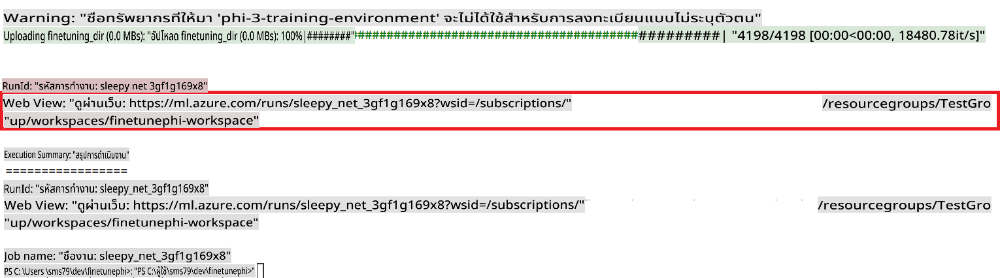

### Deploy the fine-tuned model

To integrate the fine-tuned Phi-3 model with Prompt Flow, you need to deploy the model to make it accessible for real-time inference. This process involves registering the model, creating an online endpoint, and deploying the model.

#### Set the model name, endpoint name, and deployment name for deployment

1. Open *config.py* file.

1. Replace `AZURE_MODEL_NAME = "your_fine_tuned_model_name"` with the desired name for your model.

1. Replace `AZURE_ENDPOINT_NAME = "your_fine_tuned_model_endpoint_name"` with the desired name for your endpoint.

1. Replace `AZURE_DEPLOYMENT_NAME = "your_fine_tuned_model_deployment_name"` โดยใช้ชื่อที่คุณต้องการสำหรับการ deploy

#### เพิ่มโค้ดลงในไฟล์ *deploy_model.py*

การรันไฟล์ *deploy_model.py* จะช่วยทำให้กระบวนการ deploy เป็นไปโดยอัตโนมัติทั้งหมด ไฟล์นี้จะทำการลงทะเบียนโมเดล สร้าง endpoint และดำเนินการ deploy ตามการตั้งค่าที่ระบุในไฟล์ config.py ซึ่งรวมถึงชื่อโมเดล ชื่อ endpoint และชื่อ deployment

1. เปิดไฟล์ *deploy_model.py* ใน Visual Studio Code

1. เพิ่มโค้ดต่อไปนี้ลงใน *deploy_model.py*

    ```python
    import logging
    from azure.identity import AzureCliCredential
    from azure.ai.ml import MLClient
    from azure.ai.ml.entities import Model, ProbeSettings, ManagedOnlineEndpoint, ManagedOnlineDeployment, IdentityConfiguration, ManagedIdentityConfiguration, OnlineRequestSettings
    from azure.ai.ml.constants import AssetTypes

    # Configuration imports
    from config import (
        AZURE_SUBSCRIPTION_ID,
        AZURE_RESOURCE_GROUP_NAME,
        AZURE_ML_WORKSPACE_NAME,
        AZURE_MANAGED_IDENTITY_RESOURCE_ID,
        AZURE_MANAGED_IDENTITY_CLIENT_ID,
        AZURE_MODEL_NAME,
        AZURE_ENDPOINT_NAME,
        AZURE_DEPLOYMENT_NAME
    )

    # Constants
    JOB_NAME = "your-job-name"
    COMPUTE_INSTANCE_TYPE = "Standard_E4s_v3"

    deployment_env_vars = {
        "SUBSCRIPTION_ID": AZURE_SUBSCRIPTION_ID,
        "RESOURCE_GROUP_NAME": AZURE_RESOURCE_GROUP_NAME,
        "UAI_CLIENT_ID": AZURE_MANAGED_IDENTITY_CLIENT_ID,
    }

    # Logging setup
    logging.basicConfig(
        format="%(asctime)s - %(levelname)s - %(name)s - %(message)s",
        datefmt="%Y-%m-%d %H:%M:%S",
        level=logging.DEBUG
    )
    logger = logging.getLogger(__name__)

    def get_ml_client():
        """Initialize and return the ML Client."""
        credential = AzureCliCredential()
        return MLClient(credential, AZURE_SUBSCRIPTION_ID, AZURE_RESOURCE_GROUP_NAME, AZURE_ML_WORKSPACE_NAME)

    def register_model(ml_client, model_name, job_name):
        """Register a new model."""
        model_path = f"azureml://jobs/{job_name}/outputs/artifacts/paths/model_output"
        logger.info(f"Registering model {model_name} from job {job_name} at path {model_path}.")
        run_model = Model(
            path=model_path,
            name=model_name,
            description="Model created from run.",
            type=AssetTypes.MLFLOW_MODEL,
        )
        model = ml_client.models.create_or_update(run_model)
        logger.info(f"Registered model ID: {model.id}")
        return model

    def delete_existing_endpoint(ml_client, endpoint_name):
        """Delete existing endpoint if it exists."""
        try:
            endpoint_result = ml_client.online_endpoints.get(name=endpoint_name)
            logger.info(f"Deleting existing endpoint {endpoint_name}.")
            ml_client.online_endpoints.begin_delete(name=endpoint_name).result()
            logger.info(f"Deleted existing endpoint {endpoint_name}.")
        except Exception as e:
            logger.info(f"No existing endpoint {endpoint_name} found to delete: {e}")

    def create_or_update_endpoint(ml_client, endpoint_name, description=""):
        """Create or update an endpoint."""
        delete_existing_endpoint(ml_client, endpoint_name)
        logger.info(f"Creating new endpoint {endpoint_name}.")
        endpoint = ManagedOnlineEndpoint(
            name=endpoint_name,
            description=description,
            identity=IdentityConfiguration(
                type="user_assigned",
                user_assigned_identities=[ManagedIdentityConfiguration(resource_id=AZURE_MANAGED_IDENTITY_RESOURCE_ID)]
            )
        )
        endpoint_result = ml_client.online_endpoints.begin_create_or_update(endpoint).result()
        logger.info(f"Created new endpoint {endpoint_name}.")
        return endpoint_result

    def create_or_update_deployment(ml_client, endpoint_name, deployment_name, model):
        """Create or update a deployment."""

        logger.info(f"Creating deployment {deployment_name} for endpoint {endpoint_name}.")
        deployment = ManagedOnlineDeployment(
            name=deployment_name,
            endpoint_name=endpoint_name,
            model=model.id,
            instance_type=COMPUTE_INSTANCE_TYPE,
            instance_count=1,
            environment_variables=deployment_env_vars,
            request_settings=OnlineRequestSettings(
                max_concurrent_requests_per_instance=3,
                request_timeout_ms=180000,
                max_queue_wait_ms=120000
            ),
            liveness_probe=ProbeSettings(
                failure_threshold=30,
                success_threshold=1,
                period=100,
                initial_delay=500,
            ),
            readiness_probe=ProbeSettings(
                failure_threshold=30,
                success_threshold=1,
                period=100,
                initial_delay=500,
            ),
        )
        deployment_result = ml_client.online_deployments.begin_create_or_update(deployment).result()
        logger.info(f"Created deployment {deployment.name} for endpoint {endpoint_name}.")
        return deployment_result

    def set_traffic_to_deployment(ml_client, endpoint_name, deployment_name):
        """Set traffic to the specified deployment."""
        try:
            # Fetch the current endpoint details
            endpoint = ml_client.online_endpoints.get(name=endpoint_name)
            
            # Log the current traffic allocation for debugging
            logger.info(f"Current traffic allocation: {endpoint.traffic}")
            
            # Set the traffic allocation for the deployment
            endpoint.traffic = {deployment_name: 100}
            
            # Update the endpoint with the new traffic allocation
            endpoint_poller = ml_client.online_endpoints.begin_create_or_update(endpoint)
            updated_endpoint = endpoint_poller.result()
            
            # Log the updated traffic allocation for debugging
            logger.info(f"Updated traffic allocation: {updated_endpoint.traffic}")
            logger.info(f"Set traffic to deployment {deployment_name} at endpoint {endpoint_name}.")
            return updated_endpoint
        except Exception as e:
            # Log any errors that occur during the process
            logger.error(f"Failed to set traffic to deployment: {e}")
            raise


    def main():
        ml_client = get_ml_client()

        registered_model = register_model(ml_client, AZURE_MODEL_NAME, JOB_NAME)
        logger.info(f"Registered model ID: {registered_model.id}")

        endpoint = create_or_update_endpoint(ml_client, AZURE_ENDPOINT_NAME, "Endpoint for finetuned Phi-3 model")
        logger.info(f"Endpoint {AZURE_ENDPOINT_NAME} is ready.")

        try:
            deployment = create_or_update_deployment(ml_client, AZURE_ENDPOINT_NAME, AZURE_DEPLOYMENT_NAME, registered_model)
            logger.info(f"Deployment {AZURE_DEPLOYMENT_NAME} is created for endpoint {AZURE_ENDPOINT_NAME}.")

            set_traffic_to_deployment(ml_client, AZURE_ENDPOINT_NAME, AZURE_DEPLOYMENT_NAME)
            logger.info(f"Traffic is set to deployment {AZURE_DEPLOYMENT_NAME} at endpoint {AZURE_ENDPOINT_NAME}.")
        except Exception as e:
            logger.error(f"Failed to create or update deployment: {e}")

    if __name__ == "__main__":
        main()

    ```

1. ทำตามขั้นตอนด้านล่างเพื่อรับ `JOB_NAME`:

    - Navigate to Azure Machine Learning resource that you created.
    - Select **Studio web URL** to open the Azure Machine Learning workspace.
    - Select **Jobs** from the left side tab.
    - Select the experiment for fine-tuning. For example, *finetunephi*.
    - Select the job that you created.
    - Copy and paste your job Name into the `JOB_NAME = "your-job-name"` in *deploy_model.py* file.

1. Replace `COMPUTE_INSTANCE_TYPE` ด้วยรายละเอียดของคุณ

1. พิมพ์คำสั่งต่อไปนี้เพื่อรันสคริปต์ *deploy_model.py* และเริ่มกระบวนการ deploy ใน Azure Machine Learning

    ```python
    python deploy_model.py
    ```

> [!WARNING]
> เพื่อหลีกเลี่ยงค่าใช้จ่ายเพิ่มเติมในบัญชีของคุณ อย่าลืมลบ endpoint ที่สร้างขึ้นใน Azure Machine Learning workspace
>

#### ตรวจสอบสถานะการ deploy ใน Azure Machine Learning Workspace

1. ไปที่ [Azure ML Studio](https://ml.azure.com/home?wt.mc_id=studentamb_279723)

1. ไปที่ Azure Machine Learning workspace ที่คุณสร้างไว้

1. เลือก **Studio web URL** เพื่อเปิด Azure Machine Learning workspace

1. เลือก **Endpoints** จากแถบด้านซ้าย

    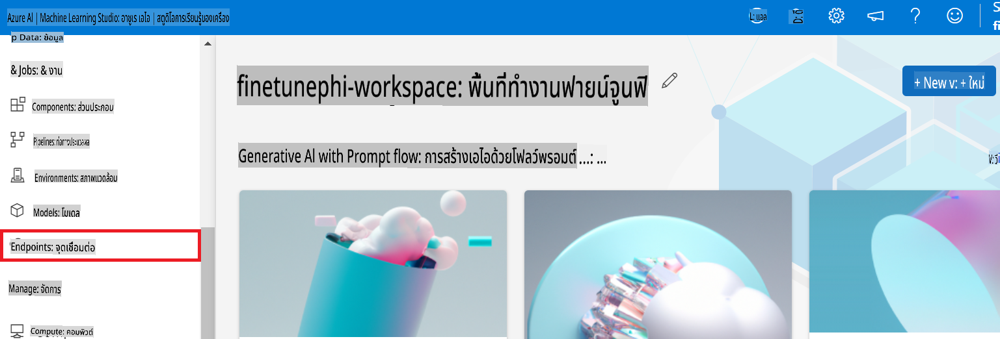

2. เลือก endpoint ที่คุณสร้างขึ้น

    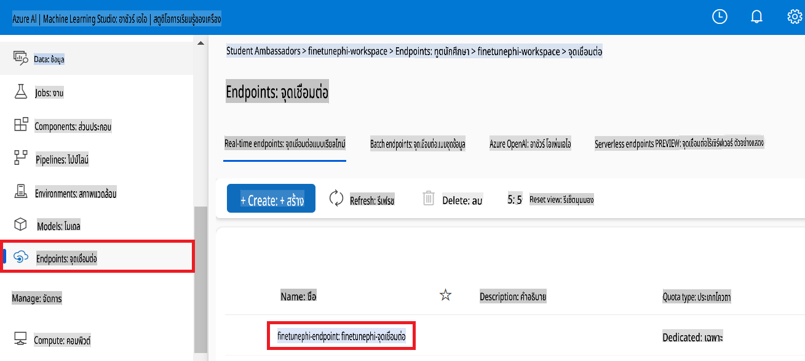

3. ในหน้านี้ คุณสามารถจัดการ endpoints ที่สร้างขึ้นระหว่างกระบวนการ deploy ได้

## สถานการณ์ที่ 3: รวมเข้ากับ Prompt flow และแชทกับโมเดลที่คุณปรับแต่งเอง

### รวมโมเดล Phi-3 ที่ปรับแต่งเองเข้ากับ Prompt flow

หลังจาก deploy โมเดลที่คุณปรับแต่งเองเสร็จสิ้นแล้ว คุณสามารถรวมเข้ากับ Prompt flow เพื่อใช้งานโมเดลของคุณในแอปพลิเคชันแบบเรียลไทม์ ทำให้สามารถทำงานแบบโต้ตอบกับโมเดล Phi-3 ของคุณได้หลากหลาย

#### ตั้งค่า api key และ endpoint uri ของโมเดล Phi-3 ที่ปรับแต่งเอง

1. ไปที่ Azure Machine Learning workspace ที่คุณสร้างไว้
1. เลือก **Endpoints** จากแถบด้านซ้าย
1. เลือก endpoint ที่คุณสร้างไว้
1. เลือก **Consume** จากเมนูนำทาง
1. คัดลอกและวาง **REST endpoint** ของคุณลงในไฟล์ *config.py* โดยแทนที่ `AZURE_ML_ENDPOINT = "your_fine_tuned_model_endpoint_uri"` with your **REST endpoint**.
1. Copy and paste your **Primary key** into the *config.py* file, replacing `AZURE_ML_API_KEY = "your_fine_tuned_model_api_key"` ด้วย **Primary key** ของคุณ

    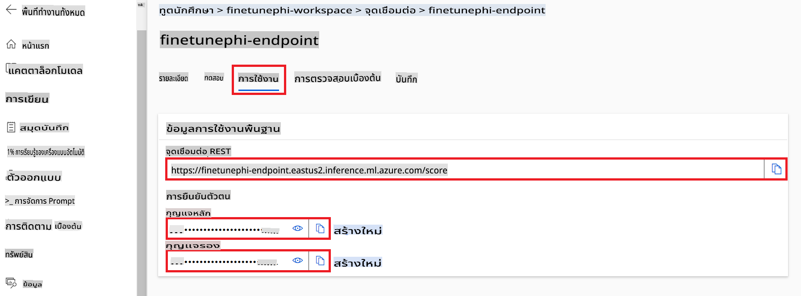

#### เพิ่มโค้ดลงในไฟล์ *flow.dag.yml*

1. เปิดไฟล์ *flow.dag.yml* ใน Visual Studio Code

1. เพิ่มโค้ดต่อไปนี้ลงใน *flow.dag.yml*

    ```yml
    inputs:
      input_data:
        type: string
        default: "Who founded Microsoft?"

    outputs:
      answer:
        type: string
        reference: ${integrate_with_promptflow.output}

    nodes:
    - name: integrate_with_promptflow
      type: python
      source:
        type: code
        path: integrate_with_promptflow.py
      inputs:
        input_data: ${inputs.input_data}
    ```

#### เพิ่มโค้ดลงในไฟล์ *integrate_with_promptflow.py*

1. เปิดไฟล์ *integrate_with_promptflow.py* ใน Visual Studio Code

1. เพิ่มโค้ดต่อไปนี้ลงใน *integrate_with_promptflow.py*

    ```python
    import logging
    import requests
    from promptflow.core import tool
    import asyncio
    import platform
    from config import (
        AZURE_ML_ENDPOINT,
        AZURE_ML_API_KEY
    )

    # Logging setup
    logging.basicConfig(
        format="%(asctime)s - %(levelname)s - %(name)s - %(message)s",
        datefmt="%Y-%m-%d %H:%M:%S",
        level=logging.DEBUG
    )
    logger = logging.getLogger(__name__)

    def query_azml_endpoint(input_data: list, endpoint_url: str, api_key: str) -> str:
        """
        Send a request to the Azure ML endpoint with the given input data.
        """
        headers = {
            "Content-Type": "application/json",
            "Authorization": f"Bearer {api_key}"
        }
        data = {
            "input_data": [input_data],
            "params": {
                "temperature": 0.7,
                "max_new_tokens": 128,
                "do_sample": True,
                "return_full_text": True
            }
        }
        try:
            response = requests.post(endpoint_url, json=data, headers=headers)
            response.raise_for_status()
            result = response.json()[0]
            logger.info("Successfully received response from Azure ML Endpoint.")
            return result
        except requests.exceptions.RequestException as e:
            logger.error(f"Error querying Azure ML Endpoint: {e}")
            raise

    def setup_asyncio_policy():
        """
        Setup asyncio event loop policy for Windows.
        """
        if platform.system() == 'Windows':
            asyncio.set_event_loop_policy(asyncio.WindowsSelectorEventLoopPolicy())
            logger.info("Set Windows asyncio event loop policy.")

    @tool
    def my_python_tool(input_data: str) -> str:
        """
        Tool function to process input data and query the Azure ML endpoint.
        """
        setup_asyncio_policy()
        return query_azml_endpoint(input_data, AZURE_ML_ENDPOINT, AZURE_ML_API_KEY)

    ```

### แชทกับโมเดลที่คุณปรับแต่งเอง

1. พิมพ์คำสั่งต่อไปนี้เพื่อรันสคริปต์ *deploy_model.py* และเริ่มกระบวนการ deploy ใน Azure Machine Learning

    ```python
    pf flow serve --source ./ --port 8080 --host localhost
    ```

1. ตัวอย่างผลลัพธ์: ตอนนี้คุณสามารถแชทกับโมเดล Phi-3 ที่คุณปรับแต่งเองได้ แนะนำให้ถามคำถามตามข้อมูลที่ใช้ในการ fine-tuning

    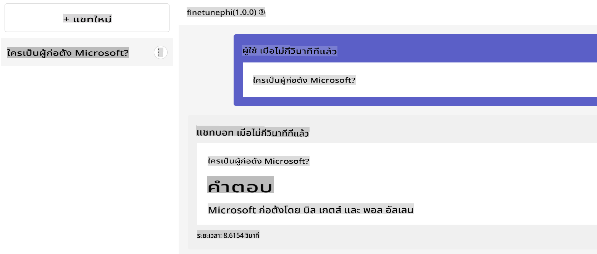

**ข้อจำกัดความรับผิดชอบ**:  
เอกสารนี้ได้รับการแปลโดยใช้บริการแปลภาษาโดย AI อัตโนมัติ แม้ว่าเราจะพยายามอย่างเต็มที่เพื่อความถูกต้อง โปรดทราบว่าการแปลอัตโนมัติอาจมีข้อผิดพลาดหรือความไม่ถูกต้องเกิดขึ้น เอกสารต้นฉบับในภาษาต้นทางควรถูกพิจารณาเป็นแหล่งข้อมูลที่เชื่อถือได้ สำหรับข้อมูลที่สำคัญ ขอแนะนำให้ใช้บริการแปลภาษาจากผู้เชี่ยวชาญที่เป็นมนุษย์ เราไม่รับผิดชอบต่อความเข้าใจผิดหรือการตีความผิดที่เกิดจากการใช้การแปลนี้