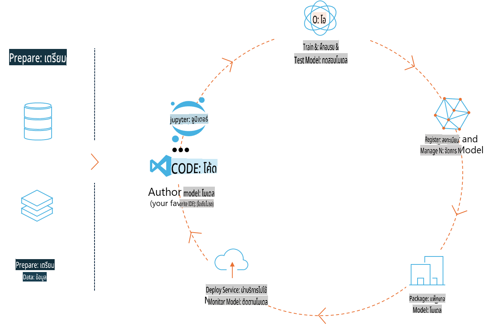
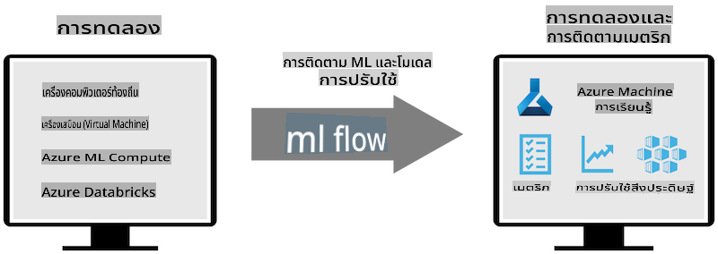
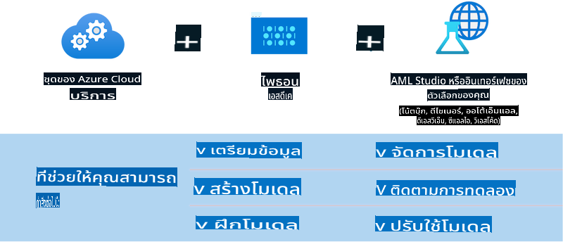

# MLflow

[MLflow](https://mlflow.org/) คือแพลตฟอร์มโอเพนซอร์สที่ออกแบบมาเพื่อจัดการวงจรชีวิตของการเรียนรู้ของเครื่องแบบครบวงจร (end-to-end).



MLFlow ถูกใช้ในการจัดการวงจรชีวิตของ ML รวมถึงการทดลอง การทำซ้ำ การปรับใช้ และการจัดการโมเดลในศูนย์กลาง ปัจจุบัน MLFlow มีองค์ประกอบหลัก 4 ส่วน ได้แก่:

- **MLflow Tracking:** บันทึกและค้นหาการทดลอง โค้ด การตั้งค่าข้อมูล และผลลัพธ์
- **MLflow Projects:** แพ็กเกจโค้ดด้านวิทยาศาสตร์ข้อมูลในรูปแบบที่สามารถทำซ้ำได้บนทุกแพลตฟอร์ม
- **Mlflow Models:** ปรับใช้โมเดลการเรียนรู้ของเครื่องในสภาพแวดล้อมการให้บริการที่หลากหลาย
- **Model Registry:** จัดเก็บ อธิบาย และจัดการโมเดลในคลังเก็บส่วนกลาง

MLFlow มีความสามารถในการติดตามการทดลอง บรรจุโค้ดให้สามารถทำซ้ำได้ และแบ่งปันและปรับใช้โมเดล นอกจากนี้ยังผสานรวมเข้ากับ Databricks และรองรับไลบรารี ML หลากหลายชนิด ทำให้ไม่ขึ้นอยู่กับไลบรารีใดไลบรารีหนึ่ง MLFlow สามารถใช้งานร่วมกับไลบรารีการเรียนรู้ของเครื่องใดๆ และในภาษาโปรแกรมใดๆ เนื่องจากมี REST API และ CLI เพื่อความสะดวก



คุณสมบัติสำคัญของ MLFlow ได้แก่:

- **Experiment Tracking:** บันทึกและเปรียบเทียบพารามิเตอร์และผลลัพธ์
- **Model Management:** ปรับใช้โมเดลไปยังแพลตฟอร์มการให้บริการและการอนุมานที่หลากหลาย
- **Model Registry:** จัดการวงจรชีวิตของ MLflow Models ร่วมกัน รวมถึงการจัดการเวอร์ชันและการเพิ่มคำอธิบาย
- **Projects:** แพ็กเกจโค้ด ML เพื่อการแบ่งปันหรือใช้งานในโปรดักชัน

MLFlow ยังรองรับกระบวนการ MLOps ซึ่งรวมถึงการเตรียมข้อมูล การลงทะเบียนและจัดการโมเดล การแพ็กเกจโมเดลเพื่อการทำงาน การปรับใช้บริการ และการติดตามโมเดล โดยมีเป้าหมายเพื่อทำให้การเปลี่ยนจากต้นแบบไปสู่กระบวนการทำงานในโปรดักชันง่ายขึ้น โดยเฉพาะในสภาพแวดล้อมคลาวด์และเอดจ์

## ตัวอย่าง E2E - การสร้าง Wrapper และใช้ Phi-3 เป็นโมเดล MLFlow

ในตัวอย่าง E2E นี้ เราจะแสดงให้เห็นถึงสองวิธีที่แตกต่างกันในการสร้าง Wrapper รอบโมเดลภาษา Phi-3 ขนาดเล็ก (SLM) และการรันมันในรูปแบบโมเดล MLFlow ทั้งในเครื่องหรือในคลาวด์ เช่น Azure Machine Learning workspace



| Project | คำอธิบาย | ตำแหน่งที่ตั้ง |
| ------------ | ----------- | -------- |
| Transformer Pipeline | Transformer Pipeline เป็นตัวเลือกที่ง่ายที่สุดในการสร้าง Wrapper หากคุณต้องการใช้โมเดล HuggingFace กับ MLFlow ที่รองรับ experimental transformers flavour | [**TransformerPipeline.ipynb**](../../../../../../code/06.E2E/E2E_Phi-3-MLflow_TransformerPipeline.ipynb) |
| Custom Python Wrapper | ณ เวลานี้ Transformer Pipeline ยังไม่รองรับการสร้าง Wrapper MLFlow สำหรับโมเดล HuggingFace ในรูปแบบ ONNX แม้จะใช้แพ็กเกจ experimental อย่าง optimum Python ก็ตาม ในกรณีเช่นนี้ คุณสามารถสร้าง Custom Python Wrapper สำหรับโหมด MLFlow ได้ | [**CustomPythonWrapper.ipynb**](../../../../../../code/06.E2E/E2E_Phi-3-MLflow_CustomPythonWrapper.ipynb) |

## โปรเจกต์: Transformer Pipeline

1. คุณจะต้องติดตั้งแพ็กเกจ Python ที่เกี่ยวข้องจาก MLFlow และ HuggingFace:

    ``` Python
    import mlflow
    import transformers
    ```

2. จากนั้น คุณควรเริ่มต้น Transformer Pipeline โดยอ้างอิงถึงโมเดล Phi-3 เป้าหมายใน HuggingFace registry ตามที่ระบุใน model card ของ _Phi-3-mini-4k-instruct_ งานของมันคือประเภท "Text Generation":

    ``` Python
    pipeline = transformers.pipeline(
        task = "text-generation",
        model = "microsoft/Phi-3-mini-4k-instruct"
    )
    ```

3. ตอนนี้คุณสามารถบันทึก Transformer Pipeline ของโมเดล Phi-3 ในรูปแบบ MLFlow และเพิ่มรายละเอียดเพิ่มเติม เช่น เส้นทางเก็บ artifacts การตั้งค่าคอนฟิกของโมเดลเฉพาะ และประเภท API การอนุมาน:

    ``` Python
    model_info = mlflow.transformers.log_model(
        transformers_model = pipeline,
        artifact_path = "phi3-mlflow-model",
        model_config = model_config,
        task = "llm/v1/chat"
    )
    ```

## โปรเจกต์: Custom Python Wrapper

1. เราสามารถใช้ [ONNX Runtime generate() API](https://github.com/microsoft/onnxruntime-genai) ของ Microsoft เพื่อการอนุมานโมเดล ONNX และการเข้ารหัส/ถอดรหัสโทเค็น คุณต้องเลือกแพ็กเกจ _onnxruntime_genai_ สำหรับ compute เป้าหมาย โดยตัวอย่างด้านล่างมุ่งเป้าไปที่ CPU:

    ``` Python
    import mlflow
    from mlflow.models import infer_signature
    import onnxruntime_genai as og
    ```

1. คลาสที่เราสร้างเองจะมีสองเมธอด: _load_context()_ สำหรับการเริ่มต้น **โมเดล ONNX** ของ Phi-3 Mini 4K Instruct, **พารามิเตอร์การสร้าง** และ **ตัวจัดการโทเค็น**; และ _predict()_ สำหรับสร้างโทเค็นผลลัพธ์จาก prompt ที่ให้มา:

    ``` Python
    class Phi3Model(mlflow.pyfunc.PythonModel):
        def load_context(self, context):
            # Retrieving model from the artifacts
            model_path = context.artifacts["phi3-mini-onnx"]
            model_options = {
                 "max_length": 300,
                 "temperature": 0.2,         
            }
        
            # Defining the model
            self.phi3_model = og.Model(model_path)
            self.params = og.GeneratorParams(self.phi3_model)
            self.params.set_search_options(**model_options)
            
            # Defining the tokenizer
            self.tokenizer = og.Tokenizer(self.phi3_model)
    
        def predict(self, context, model_input):
            # Retrieving prompt from the input
            prompt = model_input["prompt"][0]
            self.params.input_ids = self.tokenizer.encode(prompt)
    
            # Generating the model's response
            response = self.phi3_model.generate(self.params)
    
            return self.tokenizer.decode(response[0][len(self.params.input_ids):])
    ```

1. ตอนนี้คุณสามารถใช้ฟังก์ชัน _mlflow.pyfunc.log_model()_ เพื่อสร้าง Custom Python Wrapper (ในรูปแบบ pickle) สำหรับโมเดล Phi-3 พร้อมด้วยโมเดล ONNX ดั้งเดิมและ dependencies ที่จำเป็น:

    ``` Python
    model_info = mlflow.pyfunc.log_model(
        artifact_path = artifact_path,
        python_model = Phi3Model(),
        artifacts = {
            "phi3-mini-onnx": "cpu_and_mobile/cpu-int4-rtn-block-32-acc-level-4",
        },
        input_example = input_example,
        signature = infer_signature(input_example, ["Run"]),
        extra_pip_requirements = ["torch", "onnxruntime_genai", "numpy"],
    )
    ```

## ลายเซ็นของโมเดล MLFlow ที่สร้างขึ้น

1. ในขั้นตอนที่ 3 ของโปรเจกต์ Transformer Pipeline ข้างต้น เราได้ตั้งค่างานของโมเดล MLFlow ให้เป็น "_llm/v1/chat_". คำสั่งดังกล่าวสร้าง API Wrapper ของโมเดลที่เข้ากันได้กับ OpenAI’s Chat API ดังที่แสดงด้านล่าง:

    ``` Python
    {inputs: 
      ['messages': Array({content: string (required), name: string (optional), role: string (required)}) (required), 'temperature': double (optional), 'max_tokens': long (optional), 'stop': Array(string) (optional), 'n': long (optional), 'stream': boolean (optional)],
    outputs: 
      ['id': string (required), 'object': string (required), 'created': long (required), 'model': string (required), 'choices': Array({finish_reason: string (required), index: long (required), message: {content: string (required), name: string (optional), role: string (required)} (required)}) (required), 'usage': {completion_tokens: long (required), prompt_tokens: long (required), total_tokens: long (required)} (required)],
    params: 
      None}
    ```

1. ด้วยเหตุนี้ คุณสามารถส่ง prompt ของคุณในรูปแบบดังนี้:

    ``` Python
    messages = [{"role": "user", "content": "What is the capital of Spain?"}]
    ```

1. จากนั้น ใช้ post-processing ที่เข้ากันได้กับ OpenAI API เช่น _response[0][‘choices’][0][‘message’][‘content’]_ เพื่อจัดรูปแบบผลลัพธ์ให้ดูดีขึ้น เช่นนี้:

    ``` JSON
    Question: What is the capital of Spain?
    
    Answer: The capital of Spain is Madrid. It is the largest city in Spain and serves as the political, economic, and cultural center of the country. Madrid is located in the center of the Iberian Peninsula and is known for its rich history, art, and architecture, including the Royal Palace, the Prado Museum, and the Plaza Mayor.
    
    Usage: {'prompt_tokens': 11, 'completion_tokens': 73, 'total_tokens': 84}
    ```

1. ในขั้นตอนที่ 3 ของโปรเจกต์ Custom Python Wrapper ข้างต้น เราอนุญาตให้แพ็กเกจ MLFlow สร้างลายเซ็นของโมเดลจากตัวอย่างอินพุตที่กำหนด ลายเซ็นของ Wrapper MLFlow ของเราจะมีลักษณะดังนี้:

    ``` Python
    {inputs: 
      ['prompt': string (required)],
    outputs: 
      [string (required)],
    params: 
      None}
    ```

1. ดังนั้น prompt ของเราจะต้องมี key "prompt" ในรูปแบบ dictionary เช่นนี้:

    ``` Python
    {"prompt": "<|system|>You are a stand-up comedian.<|end|><|user|>Tell me a joke about atom<|end|><|assistant|>",}
    ```

1. ผลลัพธ์ของโมเดลจะถูกส่งกลับมาในรูปแบบสตริง:

    ``` JSON
    Alright, here's a little atom-related joke for you!
    
    Why don't electrons ever play hide and seek with protons?
    
    Because good luck finding them when they're always "sharing" their electrons!
    
    Remember, this is all in good fun, and we're just having a little atomic-level humor!
    ```

**ข้อจำกัดความรับผิดชอบ**:  
เอกสารนี้ได้รับการแปลโดยใช้บริการแปลภาษาอัตโนมัติด้วย AI แม้ว่าเราจะพยายามอย่างเต็มที่เพื่อให้ได้ความถูกต้อง แต่โปรดทราบว่าการแปลโดยระบบอัตโนมัติอาจมีข้อผิดพลาดหรือความไม่ถูกต้องเกิดขึ้น เอกสารต้นฉบับในภาษาดั้งเดิมควรถือเป็นแหล่งข้อมูลที่เชื่อถือได้ สำหรับข้อมูลสำคัญ แนะนำให้ใช้บริการแปลภาษาจากผู้เชี่ยวชาญที่เป็นมนุษย์ เราจะไม่รับผิดชอบต่อความเข้าใจผิดหรือการตีความผิดที่เกิดจากการใช้การแปลนี้