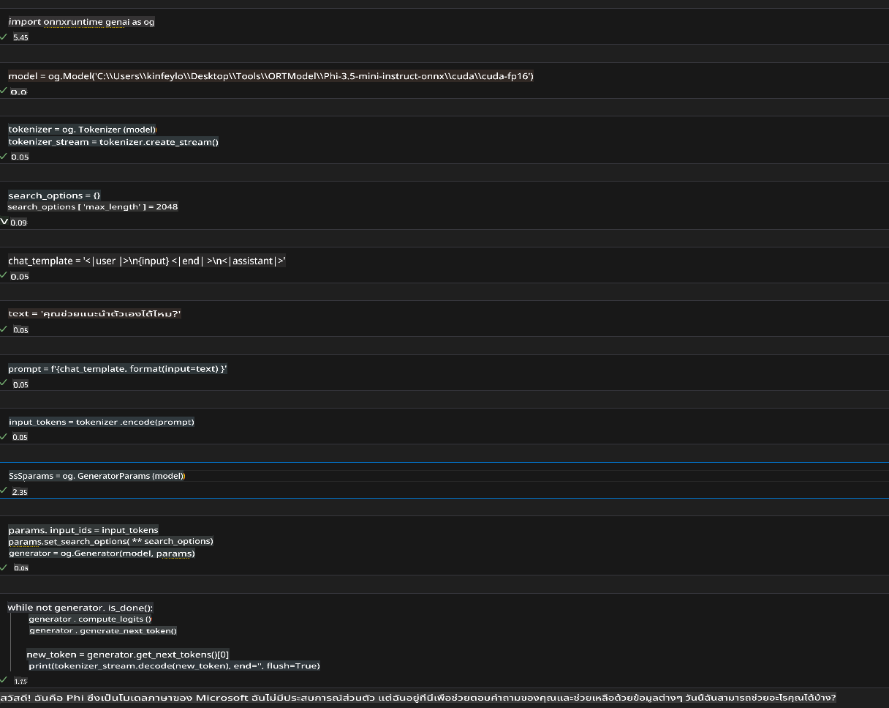
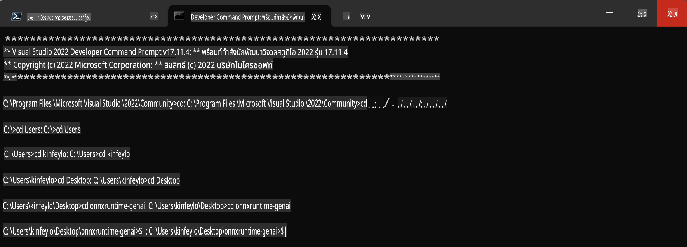

# **แนวทางการใช้งาน OnnxRuntime GenAI บน Windows GPU**

เอกสารนี้ให้คำแนะนำในการตั้งค่าและใช้งาน ONNX Runtime (ORT) กับ GPU บน Windows เพื่อช่วยให้คุณสามารถใช้ประโยชน์จาก GPU ในการเร่งประสิทธิภาพของโมเดลของคุณได้อย่างเต็มที่

เนื้อหาในเอกสารนี้ครอบคลุม:

- การตั้งค่าสภาพแวดล้อม: คำแนะนำในการติดตั้งโปรแกรมที่จำเป็น เช่น CUDA, cuDNN และ ONNX Runtime
- การตั้งค่าคอนฟิก: วิธีการตั้งค่าคอนฟิกเพื่อให้ ONNX Runtime ใช้ทรัพยากร GPU อย่างมีประสิทธิภาพ
- เคล็ดลับการปรับแต่ง: คำแนะนำในการปรับแต่ง GPU เพื่อให้ได้ประสิทธิภาพที่ดีที่สุด

### **1. Python 3.10.x / 3.11.8**

   ***หมายเหตุ*** แนะนำให้ใช้ [miniforge](https://github.com/conda-forge/miniforge/releases/latest/download/Miniforge3-Windows-x86_64.exe) เป็นสภาพแวดล้อม Python ของคุณ

   ```bash

   conda create -n pydev python==3.11.8

   conda activate pydev

   ```

   ***เตือนความจำ*** หากคุณติดตั้งไลบรารี Python เกี่ยวกับ ONNX ไว้แล้ว กรุณาถอนการติดตั้งก่อน

### **2. ติดตั้ง CMake ด้วย winget**

   ```bash

   winget install -e --id Kitware.CMake

   ```

### **3. ติดตั้ง Visual Studio 2022 - Desktop Development with C++**

   ***หมายเหตุ*** หากคุณไม่ต้องการคอมไพล์ สามารถข้ามขั้นตอนนี้ได้


### **4. ติดตั้งไดรเวอร์ NVIDIA**

1. **NVIDIA GPU Driver**  [https://www.nvidia.com/en-us/drivers/](https://www.nvidia.com/en-us/drivers/)

2. **NVIDIA CUDA 12.4** [https://developer.nvidia.com/cuda-12-4-0-download-archive](https://developer.nvidia.com/cuda-12-4-0-download-archive)

3. **NVIDIA CUDNN 9.4**  [https://developer.nvidia.com/cudnn-downloads](https://developer.nvidia.com/cudnn-downloads)

***เตือนความจำ*** กรุณาใช้การตั้งค่าดีฟอลต์ในขั้นตอนการติดตั้ง

### **5. ตั้งค่าสภาพแวดล้อม NVIDIA**

คัดลอกไฟล์จาก NVIDIA CUDNN 9.4 ไปยัง NVIDIA CUDA 12.4 ตามเส้นทางที่กำหนด

- คัดลอกไฟล์จาก *'C:\Program Files\NVIDIA\CUDNN\v9.4\bin\12.6'* ไปยัง *'C:\Program Files\NVIDIA GPU Computing Toolkit\CUDA\v12.4\bin*

- คัดลอกไฟล์จาก *'C:\Program Files\NVIDIA\CUDNN\v9.4\include\12.6'* ไปยัง *'C:\Program Files\NVIDIA GPU Computing Toolkit\CUDA\v12.4\include*

- คัดลอกไฟล์จาก *'C:\Program Files\NVIDIA\CUDNN\v9.4\lib\12.6'* ไปยัง *'C:\Program Files\NVIDIA GPU Computing Toolkit\CUDA\v12.4\lib\x64'*

### **6. ดาวน์โหลด Phi-3.5-mini-instruct-onnx**

   ```bash

   winget install -e --id Git.Git

   winget install -e --id GitHub.GitLFS

   git lfs install

   git clone https://huggingface.co/microsoft/Phi-3.5-mini-instruct-onnx

   ```

### **7. รัน InferencePhi35Instruct.ipynb**

   เปิด [Notebook](../../../../../../code/09.UpdateSamples/Aug/ortgpu-phi35-instruct.ipynb) และดำเนินการรัน



### **8. คอมไพล์ ORT GenAI GPU**

   ***หมายเหตุ*** 
   
   1. กรุณาถอนการติดตั้งทุกอย่างที่เกี่ยวกับ onnx, onnxruntime และ onnxruntime-genai ก่อน

   ```bash

   pip list 
   
   ```

   จากนั้นถอนการติดตั้งไลบรารี onnxruntime ทั้งหมด เช่น

   ```bash

   pip uninstall onnxruntime

   pip uninstall onnxruntime-genai

   pip uninstall onnxruntume-genai-cuda
   
   ```

   2. ตรวจสอบการสนับสนุน Visual Studio Extension 

   ตรวจสอบว่า C:\Program Files\NVIDIA GPU Computing Toolkit\CUDA\v12.4\extras มีโฟลเดอร์ visual_studio_integration หรือไม่ 
   
   หากไม่มี ให้ตรวจสอบในโฟลเดอร์ไดรเวอร์ CUDA อื่น ๆ และคัดลอกโฟลเดอร์ visual_studio_integration ไปยัง C:\Program Files\NVIDIA GPU Computing Toolkit\CUDA\v12.4\extras\visual_studio_integration

   - หากคุณไม่ต้องการคอมไพล์ สามารถข้ามขั้นตอนนี้ได้

   ```bash

   git clone https://github.com/microsoft/onnxruntime-genai

   ```

   - ดาวน์โหลด [https://github.com/microsoft/onnxruntime/releases/download/v1.19.2/onnxruntime-win-x64-gpu-1.19.2.zip](https://github.com/microsoft/onnxruntime/releases/download/v1.19.2/onnxruntime-win-x64-gpu-1.19.2.zip)

   - แตกไฟล์ onnxruntime-win-x64-gpu-1.19.2.zip และเปลี่ยนชื่อเป็น **ort** จากนั้นคัดลอกโฟลเดอร์ ort ไปยัง onnxruntime-genai

   - ใช้ Windows Terminal แล้วเปิด Developer Command Prompt for VS 2022 จากนั้นไปยังโฟลเดอร์ onnxruntime-genai



   - คอมไพล์ด้วยสภาพแวดล้อม Python ของคุณ

   ```bash

   cd onnxruntime-genai

   python build.py --use_cuda  --cuda_home "C:\Program Files\NVIDIA GPU Computing Toolkit\CUDA\v12.4" --config Release
 

   cd build/Windows/Release/Wheel

   pip install .whl

   ```

**ข้อจำกัดความรับผิดชอบ**:  
เอกสารนี้ได้รับการแปลโดยใช้บริการแปลภาษาอัตโนมัติด้วย AI แม้ว่าเราจะพยายามอย่างเต็มที่เพื่อให้การแปลถูกต้อง แต่โปรดทราบว่าการแปลอัตโนมัติอาจมีข้อผิดพลาดหรือความไม่ถูกต้อง เอกสารต้นฉบับในภาษาต้นฉบับควรถูกพิจารณาเป็นแหล่งข้อมูลที่เชื่อถือได้ สำหรับข้อมูลสำคัญ ขอแนะนำให้ใช้บริการแปลภาษาจากมนุษย์ที่เป็นมืออาชีพ เราจะไม่รับผิดชอบต่อความเข้าใจผิดหรือการตีความผิดที่เกิดจากการใช้การแปลนี้