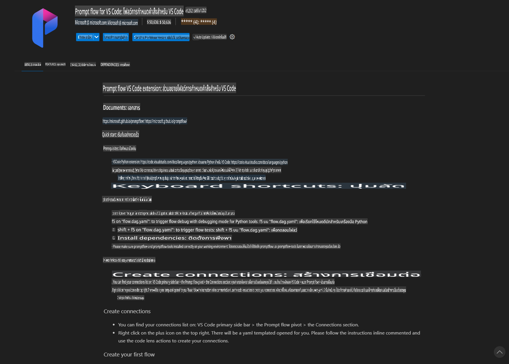
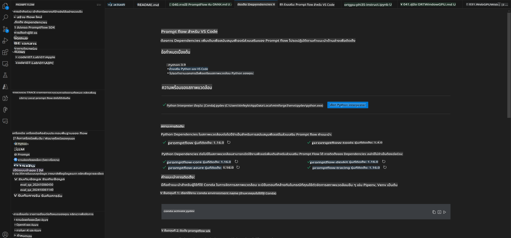
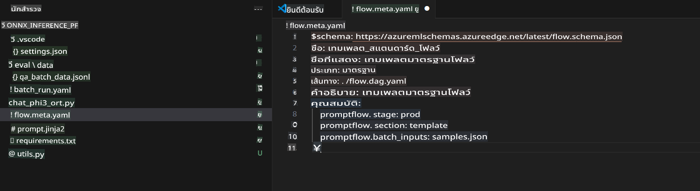
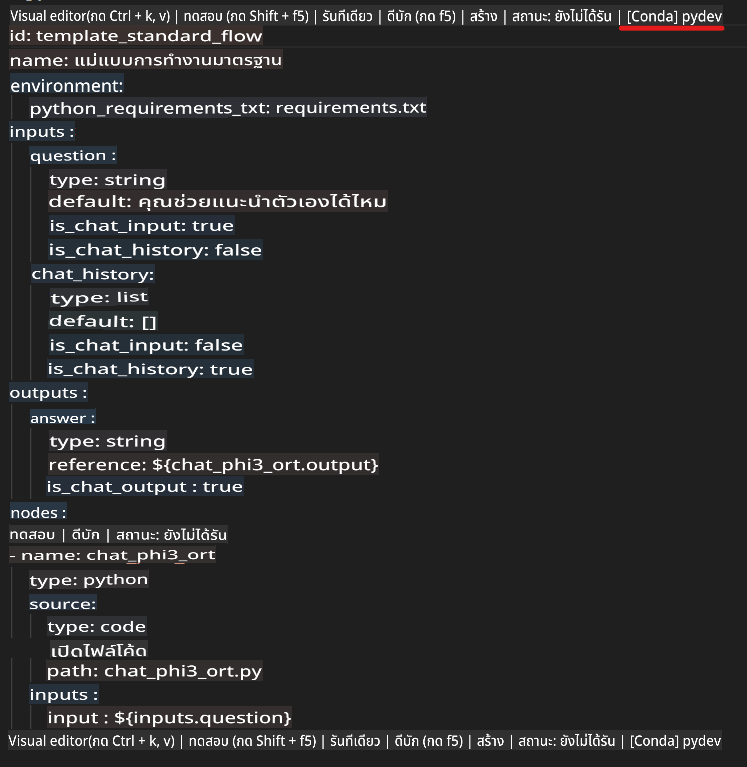
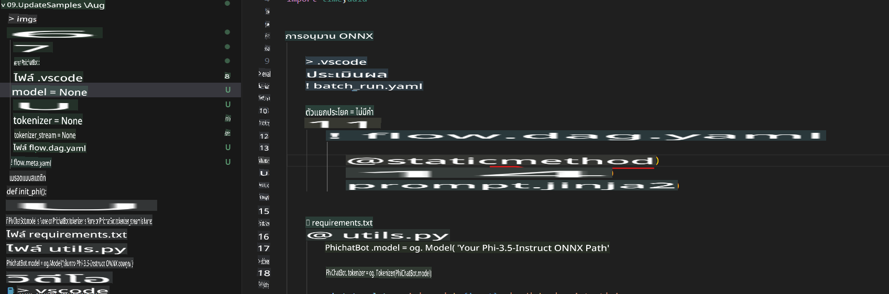
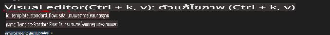
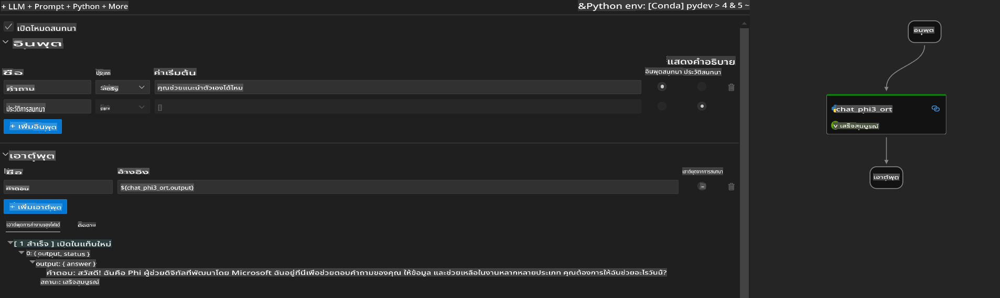
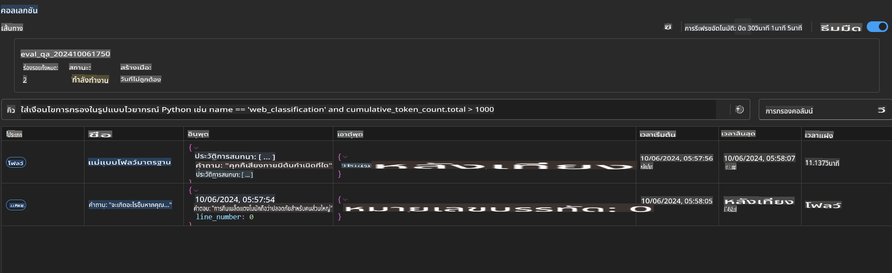

# การใช้ Windows GPU เพื่อสร้างโซลูชัน Prompt flow ด้วย Phi-3.5-Instruct ONNX

เอกสารนี้เป็นตัวอย่างวิธีการใช้ PromptFlow ร่วมกับ ONNX (Open Neural Network Exchange) ในการพัฒนาแอปพลิเคชัน AI ที่ใช้โมเดล Phi-3

PromptFlow เป็นชุดเครื่องมือสำหรับการพัฒนา ที่ออกแบบมาเพื่อช่วยลดความซับซ้อนในกระบวนการพัฒนาแอปพลิเคชัน AI ที่ใช้ LLM (Large Language Model) ตั้งแต่การสร้างไอเดีย การสร้างต้นแบบ ไปจนถึงการทดสอบและประเมินผล

การผสาน PromptFlow กับ ONNX จะช่วยให้ผู้พัฒนาสามารถ:

- **เพิ่มประสิทธิภาพของโมเดล**: ใช้ ONNX เพื่อการอนุมานและการปรับใช้โมเดลที่มีประสิทธิภาพสูง
- **ลดความซับซ้อนในการพัฒนา**: ใช้ PromptFlow ในการจัดการเวิร์กโฟลว์และลดงานที่ทำซ้ำ
- **เสริมสร้างการทำงานร่วมกัน**: สนับสนุนการทำงานร่วมกันในทีมด้วยสภาพแวดล้อมการพัฒนาที่เป็นเอกภาพ

**Prompt flow** เป็นชุดเครื่องมือพัฒนาที่ออกแบบมาเพื่อช่วยลดความซับซ้อนในกระบวนการพัฒนาแอปพลิเคชัน AI ที่ใช้ LLM ตั้งแต่การสร้างไอเดีย การสร้างต้นแบบ การทดสอบ การประเมินผล ไปจนถึงการปรับใช้ในระดับโปรดักชันและการติดตามผล มันช่วยให้งานการออกแบบ Prompt ง่ายขึ้น และช่วยให้คุณสร้างแอป LLM ที่มีคุณภาพระดับโปรดักชันได้

Prompt flow สามารถเชื่อมต่อกับ OpenAI, Azure OpenAI Service และโมเดลที่ปรับแต่งได้ (เช่น Huggingface, LLM/SLM ที่ใช้งานในเครื่อง) เราหวังที่จะปรับใช้โมเดล Phi-3.5 แบบ ONNX ที่ผ่านการปรับขนาดแล้วในแอปพลิเคชันในเครื่อง Prompt flow จะช่วยให้เราวางแผนธุรกิจได้ดีขึ้น และสร้างโซลูชันในเครื่องโดยใช้ Phi-3.5 ได้สมบูรณ์ ในตัวอย่างนี้ เราจะผสาน ONNX Runtime GenAI Library เพื่อสร้างโซลูชัน Prompt flow โดยใช้ Windows GPU

## **การติดตั้ง**

### **ONNX Runtime GenAI สำหรับ Windows GPU**

อ่านคำแนะนำการตั้งค่า ONNX Runtime GenAI สำหรับ Windows GPU [คลิกที่นี่](./ORTWindowGPUGuideline.md)

### **ตั้งค่า Prompt flow ใน VSCode**

1. ติดตั้ง Prompt flow VS Code Extension



2. หลังจากติดตั้ง Prompt flow VS Code Extension แล้ว ให้คลิกที่ส่วนขยาย และเลือก **Installation dependencies** จากนั้นทำตามคำแนะนำเพื่อติดตั้ง Prompt flow SDK ในสภาพแวดล้อมของคุณ



3. ดาวน์โหลด [Sample Code](../../../../../../code/09.UpdateSamples/Aug/pf/onnx_inference_pf) และเปิดตัวอย่างนี้ใน VS Code



4. เปิดไฟล์ **flow.dag.yaml** เพื่อเลือก Python env ของคุณ



   เปิดไฟล์ **chat_phi3_ort.py** เพื่อเปลี่ยนตำแหน่งโมเดล Phi-3.5-instruct ONNX ของคุณ



5. รัน Prompt flow เพื่อทดสอบ

เปิดไฟล์ **flow.dag.yaml** และคลิกที่ visual editor



หลังจากคลิกแล้ว ให้รันเพื่อทดสอบ



1. คุณสามารถรัน batch ใน terminal เพื่อดูผลลัพธ์เพิ่มเติม


```bash

pf run create --file batch_run.yaml --stream --name 'Your eval qa name'    

```

คุณสามารถตรวจสอบผลลัพธ์ในเบราว์เซอร์เริ่มต้นของคุณ




**ข้อจำกัดความรับผิดชอบ**:  
เอกสารนี้ได้รับการแปลโดยใช้บริการแปลภาษาด้วย AI อัตโนมัติ แม้ว่าเราจะพยายามอย่างเต็มที่เพื่อให้ได้ความถูกต้อง แต่โปรดทราบว่าการแปลอัตโนมัติอาจมีข้อผิดพลาดหรือความไม่ถูกต้องเกิดขึ้น เอกสารต้นฉบับในภาษาต้นทางควรถูกพิจารณาเป็นแหล่งข้อมูลที่เชื่อถือได้ สำหรับข้อมูลที่มีความสำคัญ ขอแนะนำให้ใช้บริการแปลภาษาจากผู้เชี่ยวชาญ เราจะไม่รับผิดชอบต่อความเข้าใจผิดหรือการตีความที่คลาดเคลื่อนอันเกิดจากการใช้การแปลนี้