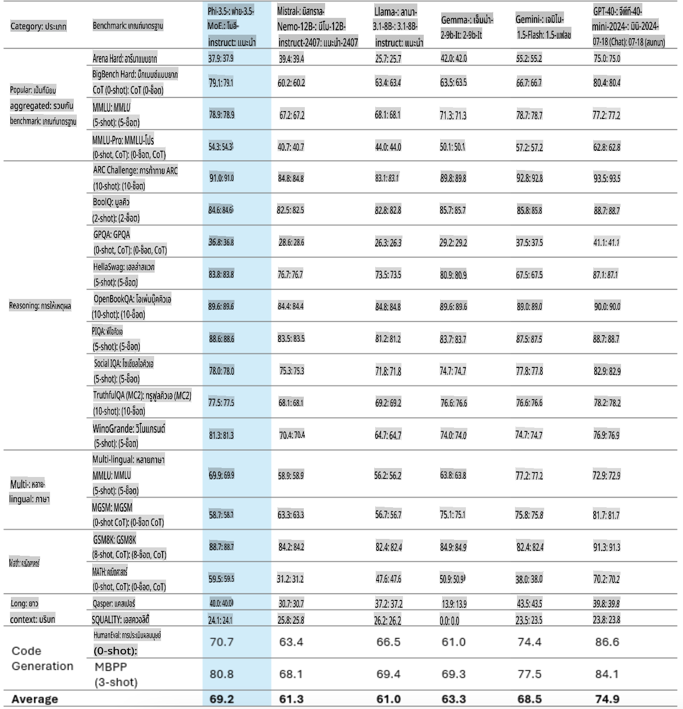
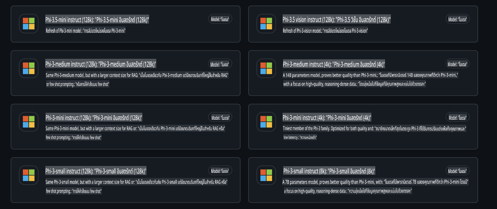
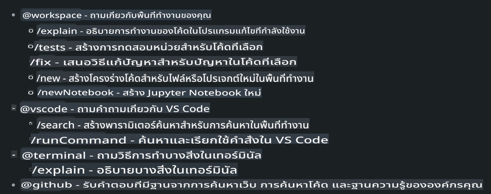
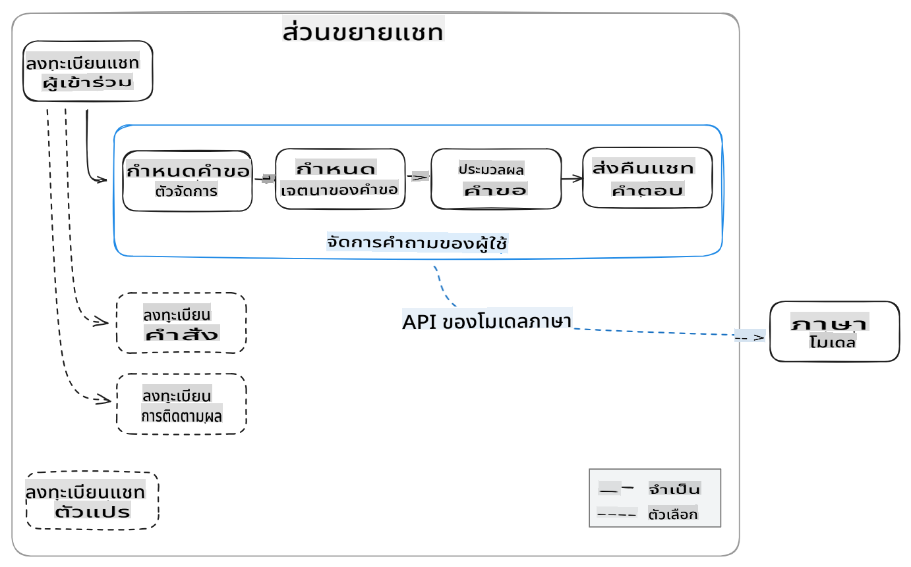
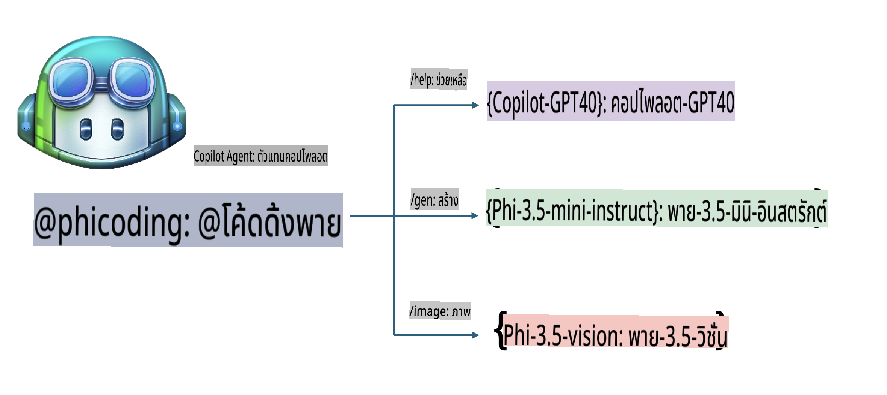
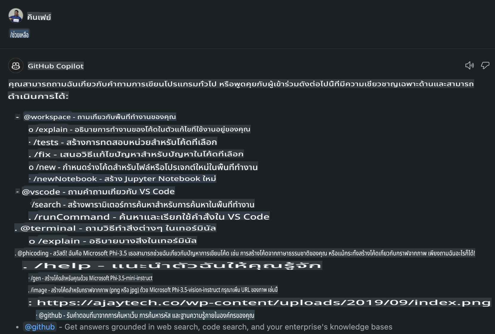
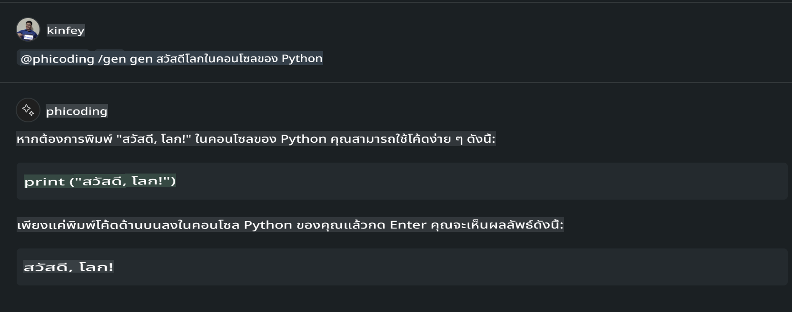
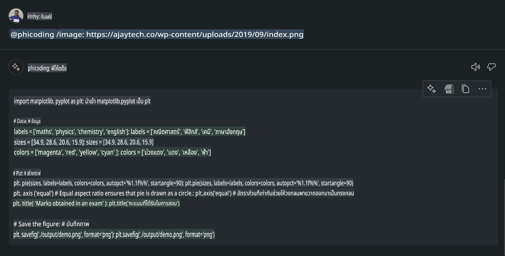

# **สร้าง Visual Studio Code Chat Copilot Agent ของคุณเองด้วย Phi-3.5 จาก GitHub Models**

คุณกำลังใช้ Visual Studio Code Copilot อยู่หรือเปล่า? โดยเฉพาะในส่วนของ Chat คุณสามารถใช้เอเจนต์ต่าง ๆ เพื่อเพิ่มความสามารถในการสร้าง เขียน และดูแลโปรเจกต์ใน Visual Studio Code ได้ Visual Studio Code มี API ที่ช่วยให้บริษัทและบุคคลสามารถสร้างเอเจนต์ที่ปรับแต่งตามธุรกิจของตนเอง เพื่อขยายขีดความสามารถในด้านต่าง ๆ ได้ ในบทความนี้ เราจะเน้นไปที่ **Phi-3.5-mini-instruct (128k)** และ **Phi-3.5-vision-instruct (128k)** ของ GitHub Models เพื่อสร้าง Visual Studio Code Agent ของคุณเอง

## **เกี่ยวกับ Phi-3.5 บน GitHub Models**

เราทราบว่า Phi-3/3.5-mini-instruct ในตระกูล Phi-3/3.5 มีความสามารถที่แข็งแกร่งในการเข้าใจและสร้างโค้ด และยังมีข้อได้เปรียบเหนือกว่า Gemma-2-9b และ Mistral-Nemo-12B-instruct-2407



GitHub Models ล่าสุดได้เปิดให้ใช้งาน Phi-3.5-mini-instruct (128k) และ Phi-3.5-vision-instruct (128k) แล้ว นักพัฒนาสามารถเข้าถึงได้ผ่าน OpenAI SDK, Azure AI Inference SDK และ REST API



***หมายเหตุ:*** แนะนำให้ใช้ Azure AI Inference SDK เนื่องจากสามารถสลับใช้งานกับ Azure Model Catalog ในสภาพแวดล้อมการผลิตได้ดียิ่งขึ้น

ด้านล่างนี้เป็นผลลัพธ์ของ **Phi-3.5-mini-instruct (128k)** และ **Phi-3.5-vision-instruct (128k)** ในสถานการณ์การสร้างโค้ดหลังจากเชื่อมต่อกับ GitHub Models และยังเป็นการเตรียมตัวสำหรับตัวอย่างด้านล่าง

**ตัวอย่าง: GitHub Models Phi-3.5-mini-instruct (128k) สร้างโค้ดจาก Prompt** ([คลิกที่นี่](../../../../../../code/09.UpdateSamples/Aug/ghmodel_phi35_instruct_demo.ipynb))

**ตัวอย่าง: GitHub Models Phi-3.5-vision-instruct (128k) สร้างโค้ดจากภาพ** ([คลิกที่นี่](../../../../../../code/09.UpdateSamples/Aug/ghmodel_phi35_vision_demo.ipynb))

## **เกี่ยวกับ GitHub Copilot Chat Agent**

GitHub Copilot Chat Agent สามารถทำงานต่าง ๆ ในสถานการณ์โปรเจกต์ที่แตกต่างกันตามโค้ดได้ ระบบมีเอเจนต์สี่ตัว: workspace, github, terminal, vscode



โดยการเพิ่มชื่อเอเจนต์พร้อมกับ ‘@’ คุณสามารถทำงานที่เกี่ยวข้องได้อย่างรวดเร็ว สำหรับองค์กร หากคุณเพิ่มเนื้อหาที่เกี่ยวข้องกับธุรกิจของคุณ เช่น ข้อกำหนด การเขียนโค้ด การทดสอบ และการปล่อยงาน คุณจะได้รับฟังก์ชันเฉพาะขององค์กรที่ทรงพลังยิ่งขึ้นโดยใช้ GitHub Copilot

Visual Studio Code Chat Agent ได้เปิดตัว API อย่างเป็นทางการแล้ว ซึ่งช่วยให้องค์กรหรือนักพัฒนาองค์กรสามารถพัฒนาเอเจนต์ตามระบบนิเวศธุรกิจซอฟต์แวร์ต่าง ๆ ได้ โดยอิงตามวิธีการพัฒนา Visual Studio Code Extension Development คุณสามารถเข้าถึงอินเทอร์เฟซของ Visual Studio Code Chat Agent API ได้อย่างง่ายดาย เราสามารถพัฒนาได้ตามกระบวนการนี้



สถานการณ์การพัฒนานี้รองรับการเข้าถึง API ของโมเดลจากบุคคลที่สาม (เช่น GitHub Models, Azure Model Catalog และบริการที่สร้างเองจากโมเดลโอเพ่นซอร์ส) และยังสามารถใช้ gpt-35-turbo, gpt-4 และ gpt-4o ที่ GitHub Copilot มีให้

## **เพิ่ม Agent @phicoding โดยใช้ Phi-3.5**

เราจะลองรวมความสามารถด้านการเขียนโปรแกรมของ Phi-3.5 เพื่อทำงานต่าง ๆ เช่น การเขียนโค้ด การสร้างโค้ดจากภาพ และอื่น ๆ โดยสร้างเอเจนต์ที่เน้น Phi-3.5 - @PHI ด้านล่างนี้คือตัวอย่างฟังก์ชันที่มี

1. สร้างคำแนะนำตัวเองโดยใช้ GPT-4o ที่ GitHub Copilot มีให้ผ่านคำสั่ง **@phicoding /help**

2. สร้างโค้ดสำหรับภาษาการเขียนโปรแกรมต่าง ๆ โดยใช้ **Phi-3.5-mini-instruct (128k)** ผ่านคำสั่ง **@phicoding /gen**

3. สร้างโค้ดจากภาพและการเติมเต็มภาพโดยใช้ **Phi-3.5-vision-instruct (128k)** ผ่านคำสั่ง **@phicoding /image**



## **ขั้นตอนที่เกี่ยวข้อง**

1. ติดตั้งการสนับสนุนการพัฒนา Visual Studio Code Extension โดยใช้ npm

```bash

npm install --global yo generator-code 

```

2. สร้างปลั๊กอิน Visual Studio Code Extension (ใช้โหมดการพัฒนา Typescript และตั้งชื่อว่า phiext)

```bash

yo code 

```

3. เปิดโปรเจกต์ที่สร้างขึ้นและแก้ไข package.json โดยเพิ่มคำอธิบายและการตั้งค่าที่เกี่ยวข้อง รวมถึงการตั้งค่า GitHub Models โปรดเพิ่ม GitHub Models token ของคุณที่นี่

```json

{
  "name": "phiext",
  "displayName": "phiext",
  "description": "",
  "version": "0.0.1",
  "engines": {
    "vscode": "^1.93.0"
  },
  "categories": [
    "AI",
    "Chat"
  ],
  "activationEvents": [],
  "enabledApiProposals": [
      "chatVariableResolver"
  ],
  "main": "./dist/extension.js",
  "contributes": {
    "chatParticipants": [
        {
            "id": "chat.phicoding",
            "name": "phicoding",
            "description": "Hey! I am Microsoft Phi-3.5, She can help me with coding problems, such as generation code with your natural language, or even generation code about chart from images. Just ask me anything!",
            "isSticky": true,
            "commands": [
                {
                    "name": "help",
                    "description": "Introduce myself to you"
                },
                {
                    "name": "gen",
                    "description": "Generate code for you with Microsoft Phi-3.5-mini-instruct"
                },
                {
                    "name": "image",
                    "description": "Generate code for chart from image(png or jpg) with Microsoft Phi-3.5-vision-instruct, please add image url like this : https://ajaytech.co/wp-content/uploads/2019/09/index.png"
                }
            ]
        }
    ],
    "commands": [
        {
            "command": "phicoding.namesInEditor",
            "title": "Use Microsoft Phi 3.5 in Editor"
        }
    ],
    "configuration": {
      "type": "object",
      "title": "githubmodels",
      "properties": {
        "githubmodels.endpoint": {
          "type": "string",
          "default": "https://models.inference.ai.azure.com",
          "description": "Your GitHub Models Endpoint",
          "order": 0
        },
        "githubmodels.api_key": {
          "type": "string",
          "default": "Your GitHub Models Token",
          "description": "Your GitHub Models Token",
          "order": 1
        },
        "githubmodels.phi35instruct": {
          "type": "string",
          "default": "Phi-3.5-mini-instruct",
          "description": "Your Phi-35-Instruct Model",
          "order": 2
        },
        "githubmodels.phi35vision": {
          "type": "string",
          "default": "Phi-3.5-vision-instruct",
          "description": "Your Phi-35-Vision Model",
          "order": 3
        }
      }
    }
  },
  "scripts": {
    "vscode:prepublish": "npm run package",
    "compile": "webpack",
    "watch": "webpack --watch",
    "package": "webpack --mode production --devtool hidden-source-map",
    "compile-tests": "tsc -p . --outDir out",
    "watch-tests": "tsc -p . -w --outDir out",
    "pretest": "npm run compile-tests && npm run compile && npm run lint",
    "lint": "eslint src",
    "test": "vscode-test"
  },
  "devDependencies": {
    "@types/vscode": "^1.93.0",
    "@types/mocha": "^10.0.7",
    "@types/node": "20.x",
    "@typescript-eslint/eslint-plugin": "^8.3.0",
    "@typescript-eslint/parser": "^8.3.0",
    "eslint": "^9.9.1",
    "typescript": "^5.5.4",
    "ts-loader": "^9.5.1",
    "webpack": "^5.94.0",
    "webpack-cli": "^5.1.4",
    "@vscode/test-cli": "^0.0.10",
    "@vscode/test-electron": "^2.4.1"
  },
  "dependencies": {
    "@types/node-fetch": "^2.6.11",
    "node-fetch": "^3.3.2",
    "@azure-rest/ai-inference": "latest",
    "@azure/core-auth": "latest",
    "@azure/core-sse": "latest"
  }
}


```

4. แก้ไข src/extension.ts

```typescript

// The module 'vscode' contains the VS Code extensibility API
// Import the module and reference it with the alias vscode in your code below
import * as vscode from 'vscode';
import ModelClient from "@azure-rest/ai-inference";
import { AzureKeyCredential } from "@azure/core-auth";


interface IPhiChatResult extends vscode.ChatResult {
    metadata: {
        command: string;
    };
}


const MODEL_SELECTOR: vscode.LanguageModelChatSelector = { vendor: 'copilot', family: 'gpt-4o' };

function isValidImageUrl(url: string): boolean {
    const regex = /^(https?:\/\/.*\.(?:png|jpg))$/i;
    return regex.test(url);
}
  

// This method is called when your extension is activated
// Your extension is activated the very first time the command is executed
export function activate(context: vscode.ExtensionContext) {

    const codinghandler: vscode.ChatRequestHandler = async (request: vscode.ChatRequest, context: vscode.ChatContext, stream: vscode.ChatResponseStream, token: vscode.CancellationToken): Promise<IPhiChatResult> => {


        const config : any = vscode.workspace.getConfiguration('githubmodels');
        const endPoint: string = config.get('endpoint');
        const apiKey: string = config.get('api_key');
        const phi35instruct: string = config.get('phi35instruct');
        const phi35vision: string = config.get('phi35vision');
        
        if (request.command === 'help') {

            const content = "Welcome to Coding assistant with Microsoft Phi-3.5"; 
            stream.progress(content);


            try {
                const [model] = await vscode.lm.selectChatModels(MODEL_SELECTOR);
                if (model) {
                    const messages = [
                        vscode.LanguageModelChatMessage.User("Please help me express this content in a humorous way: I am a programming assistant who can help you convert natural language into code and generate code based on the charts in the images. output format like this : Hey I am Phi ......")
                    ];
                    const chatResponse = await model.sendRequest(messages, {}, token);
                    for await (const fragment of chatResponse.text) {
                        stream.markdown(fragment);
                    }
                }
            } catch(err) {
                console.log(err);
            }


            return { metadata: { command: 'help' } };

        }

        
        if (request.command === 'gen') {

            const content = "Welcome to use phi-3.5 to generate code";

            stream.progress(content);

            const client = new ModelClient(endPoint, new AzureKeyCredential(apiKey));

            const response = await client.path("/chat/completions").post({
              body: {
                messages: [
                  { role:"system", content: "You are a coding assistant.Help answer all code generation questions." },
                  { role:"user", content: request.prompt }
                ],
                model: phi35instruct,
                temperature: 0.4,
                max_tokens: 1000,
                top_p: 1.
              }
            });

            stream.markdown(response.body.choices[0].message.content);

            return { metadata: { command: 'gen' } };

        }


        
        if (request.command === 'image') {


            const content = "Welcome to use phi-3.5 to generate code from image(png or jpg),image url like this:https://ajaytech.co/wp-content/uploads/2019/09/index.png";

            stream.progress(content);

            if (!isValidImageUrl(request.prompt)) {
                stream.markdown('Please provide a valid image URL');
                return { metadata: { command: 'image' } };
            }
            else
            {

                const client = new ModelClient(endPoint, new AzureKeyCredential(apiKey));
    
                const response = await client.path("/chat/completions").post({
                    body: {
                      messages: [
                        { role: "system", content: "You are a helpful assistant that describes images in details." },
                        { role: "user", content: [
                            { type: "text", text: "Please generate code according to the chart in the picture according to the following requirements\n1. Keep all information in the chart, including data and text\n2. Do not generate additional information that is not included in the chart\n3. Please extract data from the picture, do not generate it from csv\n4. Please save the regenerated chart as a chart and save it to ./output/demo.png"},
                            { type: "image_url", image_url: {url: request.prompt}
                            }
                          ]
                        }
                      ],
                      model: phi35vision,
                      temperature: 0.4,
                      max_tokens: 2048,
                      top_p: 1.
                    }
                  });
    
                
                stream.markdown(response.body.choices[0].message.content);
    
                return { metadata: { command: 'image' } };
            }


        }


        return { metadata: { command: '' } };
    };


    const phi_ext = vscode.chat.createChatParticipant("chat.phicoding", codinghandler);

    phi_ext.iconPath = new vscode.ThemeIcon('sparkle');


    phi_ext.followupProvider = {
        provideFollowups(result: IPhiChatResult, context: vscode.ChatContext, token: vscode.CancellationToken) {
            return [{
                prompt: 'Let us coding with Phi-3.5 😋😋😋😋',
                label: vscode.l10n.t('Enjoy coding with Phi-3.5'),
                command: 'help'
            } satisfies vscode.ChatFollowup];
        }
    };

    context.subscriptions.push(phi_ext);
}

// This method is called when your extension is deactivated
export function deactivate() {}


```

6. รัน

***/help***



***@phicoding /help***


***@phicoding /gen***



***@phicoding /image***



คุณสามารถดาวน์โหลดตัวอย่างโค้ดได้ที่นี่: [คลิก](../../../../../../code/09.UpdateSamples/Aug/vscode)

## **ทรัพยากร**

1. สมัครใช้งาน GitHub Models [https://gh.io/models](https://gh.io/models)

2. เรียนรู้เกี่ยวกับการพัฒนา Visual Studio Code Extension [https://code.visualstudio.com/api/get-started/your-first-extension](https://code.visualstudio.com/api/get-started/your-first-extension)

3. เรียนรู้เกี่ยวกับ Visual Studio Code Copilot Chat API [https://code.visualstudio.com/api/extension-guides/chat](https://code.visualstudio.com/api/extension-guides/chat)

**ข้อจำกัดความรับผิดชอบ**:  
เอกสารนี้ได้รับการแปลโดยใช้บริการแปลภาษาอัตโนมัติที่ขับเคลื่อนด้วยปัญญาประดิษฐ์ (AI) แม้ว่าเราจะพยายามอย่างเต็มที่เพื่อความถูกต้อง แต่โปรดทราบว่าการแปลอัตโนมัติอาจมีข้อผิดพลาดหรือความไม่ถูกต้อง เอกสารต้นฉบับในภาษาดั้งเดิมควรถูกพิจารณาเป็นแหล่งข้อมูลที่เชื่อถือได้ สำหรับข้อมูลที่มีความสำคัญ แนะนำให้ใช้บริการแปลภาษาจากผู้เชี่ยวชาญที่เป็นมนุษย์ เราจะไม่รับผิดชอบต่อความเข้าใจผิดหรือการตีความผิดที่เกิดจากการใช้การแปลนี้