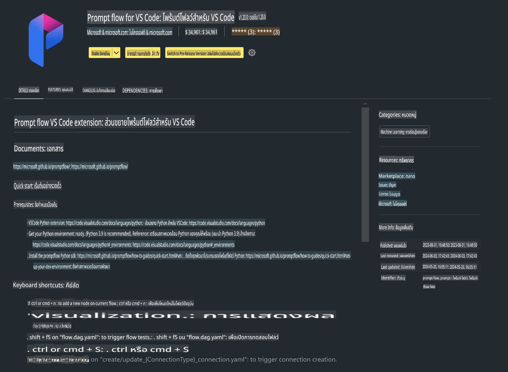

# **Lab 0 - การติดตั้ง**

เมื่อเราเข้าสู่ Lab เราจำเป็นต้องตั้งค่าสภาพแวดล้อมที่เกี่ยวข้อง:


### **1. Python 3.11+**

แนะนำให้ใช้ miniforge ในการตั้งค่าสภาพแวดล้อม Python ของคุณ 

สำหรับการตั้งค่า miniforge โปรดดูที่ [https://github.com/conda-forge/miniforge](https://github.com/conda-forge/miniforge)

หลังจากตั้งค่า miniforge แล้ว ให้รันคำสั่งต่อไปนี้ใน Power Shell

```bash

conda create -n pyenv python==3.11.8 -y

conda activate pyenv

```


### **2. ติดตั้ง Prompt flow SDK**

ใน Lab 1 เราจะใช้ Prompt flow ดังนั้นคุณจำเป็นต้องตั้งค่า Prompt flow SDK

```bash

pip install promptflow --upgrade

```

คุณสามารถตรวจสอบ promptflow sdk ด้วยคำสั่งนี้


```bash

pf --version

```

### **3. ติดตั้งส่วนขยาย Prompt flow ใน Visual Studio Code**




### **4. ไลบรารีเร่งความเร็ว Intel NPU**

โปรเซสเซอร์รุ่นใหม่ของ Intel รองรับ NPU หากคุณต้องการใช้ NPU เพื่อรัน LLMs / SLMs ในเครื่อง คุณสามารถใช้ ***Intel NPU Acceleration Library*** หากต้องการทราบข้อมูลเพิ่มเติม คุณสามารถอ่านได้ที่ [https://github.com/microsoft/PhiCookBook/blob/main/md/01.Introduction/03/AIPC_Inference.md](https://github.com/microsoft/PhiCookBook/blob/main/md/01.Introduction/03/AIPC_Inference.md)

ติดตั้ง Intel NPU Acceleration Library ใน bash


```bash

pip install intel-npu-acceleration-library

```

***หมายเหตุ***: โปรดทราบว่าไลบรารีนี้รองรับ transformers ***4.40.2*** เท่านั้น โปรดยืนยันเวอร์ชัน


### **5. ไลบรารี Python อื่น ๆ**


สร้างไฟล์ requirements.txt และเพิ่มเนื้อหานี้

```txt

notebook
numpy 
scipy 
scikit-learn 
matplotlib 
pandas 
pillow 
graphviz

```


### **6. ติดตั้ง NVM**

ติดตั้ง nvm ใน Powershell 


```bash

winget install -e --id CoreyButler.NVMforWindows

```

ติดตั้ง nodejs 18.20


```bash

nvm install 18.20.0

nvm use 18.20.0

```

### **7. ติดตั้งการสนับสนุนการพัฒนาใน Visual Studio Code**


```bash

npm install --global yo generator-code

```

ยินดีด้วย! คุณได้ตั้งค่า SDK สำเร็จแล้ว ต่อไปให้ดำเนินการในขั้นตอนปฏิบัติ

**ข้อจำกัดความรับผิดชอบ**:  
เอกสารนี้ได้รับการแปลโดยใช้บริการแปลภาษาอัตโนมัติด้วย AI แม้ว่าเราจะพยายามอย่างเต็มที่เพื่อความถูกต้อง โปรดทราบว่าการแปลอัตโนมัติอาจมีข้อผิดพลาดหรือความไม่ถูกต้อง เอกสารต้นฉบับในภาษาต้นทางควรถือเป็นแหล่งข้อมูลที่เชื่อถือได้ สำหรับข้อมูลที่สำคัญ แนะนำให้ใช้บริการแปลภาษามนุษย์มืออาชีพ เราไม่รับผิดชอบต่อความเข้าใจผิดหรือการตีความผิดที่เกิดจากการใช้การแปลนี้