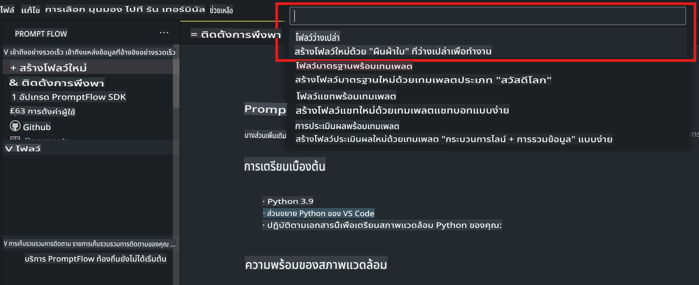
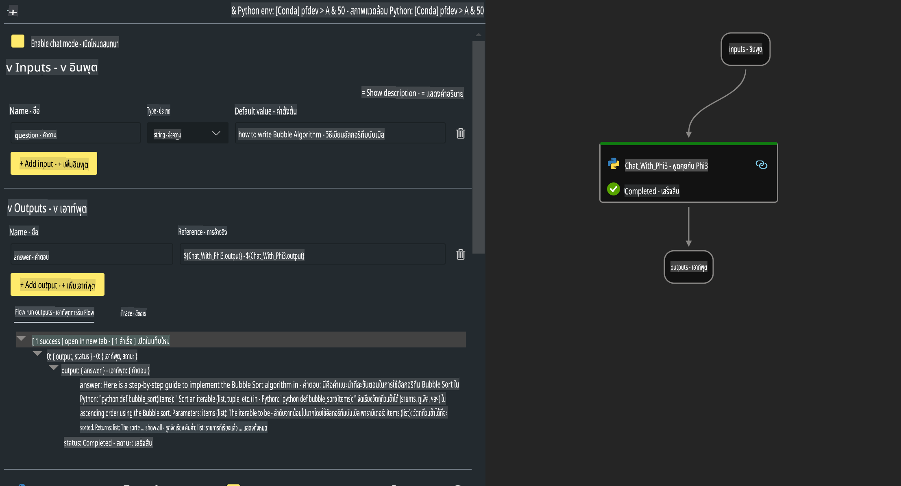

# **Lab 2 - รัน Prompt flow ด้วย Phi-3-mini ใน AIPC**

## **Prompt flow คืออะไร**

Prompt flow คือชุดเครื่องมือสำหรับพัฒนาที่ถูกออกแบบมาเพื่อช่วยให้การพัฒนาแอปพลิเคชัน AI ที่ใช้ LLM (Large Language Models) ครบวงจรเป็นเรื่องง่ายขึ้น ตั้งแต่การคิดไอเดีย การสร้างต้นแบบ การทดสอบ การประเมินผล ไปจนถึงการนำไปใช้งานจริงและการตรวจสอบประสิทธิภาพ นอกจากนี้ยังช่วยให้การออกแบบ prompt มีความสะดวกยิ่งขึ้น และช่วยสร้างแอปพลิเคชัน LLM ที่มีคุณภาพระดับการผลิตได้อย่างง่ายดาย

ด้วย Prompt flow คุณสามารถ:

- สร้าง workflow ที่เชื่อมโยง LLM, prompt, โค้ด Python และเครื่องมืออื่น ๆ เข้าด้วยกันในรูปแบบที่สามารถรันได้

- ดีบักและปรับปรุง workflow โดยเฉพาะในส่วนที่เกี่ยวข้องกับการโต้ตอบกับ LLM ได้อย่างง่ายดาย

- ประเมิน workflow และคำนวณคุณภาพและประสิทธิภาพด้วยชุดข้อมูลขนาดใหญ่

- ผสานการทดสอบและการประเมินเข้าไปในระบบ CI/CD ของคุณ เพื่อให้มั่นใจในคุณภาพของ workflow

- นำ workflow ไปใช้งานบนแพลตฟอร์มที่คุณเลือก หรือผสานเข้าไปในฐานโค้ดของแอปพลิเคชันของคุณได้อย่างง่ายดาย

- (ตัวเลือกที่แนะนำ) ทำงานร่วมกับทีมของคุณโดยใช้ Prompt flow เวอร์ชันคลาวด์ใน Azure AI

## **AIPC คืออะไร**

AIPC (AI PC) คือคอมพิวเตอร์ที่มี CPU, GPU และ NPU ซึ่งแต่ละตัวมีความสามารถเฉพาะทางในการเร่งการทำงานของ AI NPU หรือ Neural Processing Unit เป็นตัวเร่งเฉพาะที่ออกแบบมาเพื่อจัดการงานด้านปัญญาประดิษฐ์ (AI) และการเรียนรู้ของเครื่อง (ML) โดยตรงบนพีซีของคุณ แทนที่จะส่งข้อมูลไปประมวลผลบนคลาวด์ แม้ว่า GPU และ CPU จะสามารถประมวลผลงานเหล่านี้ได้ แต่ NPU มีความโดดเด่นในด้านการคำนวณ AI ที่ใช้พลังงานต่ำ AIPC จึงเป็นการเปลี่ยนแปลงที่สำคัญในวิธีการทำงานของคอมพิวเตอร์ของเรา ไม่ใช่แค่การแก้ปัญหาที่ไม่เคยมีมาก่อน แต่ยังเป็นการปรับปรุงการใช้งานพีซีในชีวิตประจำวันอย่างมหาศาล

แล้วมันทำงานอย่างไร? เมื่อเปรียบเทียบกับ AI เชิงกำเนิดและ LLM ขนาดใหญ่ที่ถูกฝึกด้วยข้อมูลสาธารณะจำนวนมาก AI ที่ทำงานบนพีซีของคุณนั้นเข้าถึงได้ง่ายกว่าในทุกระดับ แนวคิดเข้าใจง่ายกว่า และเนื่องจากมันถูกฝึกด้วยข้อมูลของคุณเอง โดยไม่ต้องเข้าถึงคลาวด์ ประโยชน์ที่ได้จึงน่าสนใจมากยิ่งขึ้นสำหรับผู้ใช้งานทั่วไป

ในระยะสั้น โลกของ AIPC จะเกี่ยวข้องกับผู้ช่วยส่วนตัวและโมเดล AI ขนาดเล็กที่ทำงานโดยตรงบนพีซีของคุณ โดยใช้ข้อมูลของคุณเพื่อให้ AI มีความเป็นส่วนตัว ปลอดภัย และช่วยเพิ่มประสิทธิภาพในการทำสิ่งที่คุณทำอยู่ทุกวัน เช่น การจดบันทึกการประชุม การจัดการทีมแฟนตาซีฟุตบอล การปรับแต่งภาพถ่ายและวิดีโอโดยอัตโนมัติ หรือการวางแผนการเดินทางสำหรับครอบครัวโดยคำนึงถึงเวลามาถึงและออกเดินทางของทุกคน

## **การสร้าง workflow สำหรับการสร้างโค้ดบน AIPC**

***Note***: หากคุณยังไม่ได้ติดตั้งสภาพแวดล้อม โปรดไปที่ [Lab 0 - Installations](./01.Installations.md)

1. เปิด Prompt flow Extension ใน Visual Studio Code และสร้างโปรเจกต์ workflow เปล่า



2. เพิ่มพารามิเตอร์ Inputs และ Outputs และเพิ่มโค้ด Python เป็น flow ใหม่



คุณสามารถอ้างอิงโครงสร้างนี้ (flow.dag.yaml) เพื่อสร้าง workflow ของคุณ

```yaml

inputs:
  question:
    type: string
    default: how to write Bubble Algorithm
outputs:
  answer:
    type: string
    reference: ${Chat_With_Phi3.output}
nodes:
- name: Chat_With_Phi3
  type: python
  source:
    type: code
    path: Chat_With_Phi3.py
  inputs:
    question: ${inputs.question}


```

3. เพิ่มโค้ดในไฟล์ ***Chat_With_Phi3.py***

```python


from promptflow.core import tool

# import torch
from transformers import AutoTokenizer, pipeline,TextStreamer
import intel_npu_acceleration_library as npu_lib

import warnings

import asyncio
import platform

class Phi3CodeAgent:
    
    model = None
    tokenizer = None
    text_streamer = None
    
    model_id = "microsoft/Phi-3-mini-4k-instruct"

    @staticmethod
    def init_phi3():
        
        if Phi3CodeAgent.model is None or Phi3CodeAgent.tokenizer is None or Phi3CodeAgent.text_streamer is None:
            Phi3CodeAgent.model = npu_lib.NPUModelForCausalLM.from_pretrained(
                                    Phi3CodeAgent.model_id,
                                    torch_dtype="auto",
                                    dtype=npu_lib.int4,
                                    trust_remote_code=True
                                )
            Phi3CodeAgent.tokenizer = AutoTokenizer.from_pretrained(Phi3CodeAgent.model_id)
            Phi3CodeAgent.text_streamer = TextStreamer(Phi3CodeAgent.tokenizer, skip_prompt=True)

    

    @staticmethod
    def chat_with_phi3(prompt):
        
        Phi3CodeAgent.init_phi3()

        messages = "<|system|>You are a AI Python coding assistant. Please help me to generate code in Python.The answer only genertated Python code, but any comments and instructions do not need to be generated<|end|><|user|>" + prompt +"<|end|><|assistant|>"


        generation_args = {
            "max_new_tokens": 1024,
            "return_full_text": False,
            "temperature": 0.3,
            "do_sample": False,
            "streamer": Phi3CodeAgent.text_streamer,
        }

        pipe = pipeline(
            "text-generation",
            model=Phi3CodeAgent.model,
            tokenizer=Phi3CodeAgent.tokenizer,
            # **generation_args
        )

        result = ''

        with warnings.catch_warnings():
            warnings.simplefilter("ignore")
            response = pipe(messages, **generation_args)
            result =response[0]['generated_text']
            return result


@tool
def my_python_tool(question: str) -> str:
    if platform.system() == 'Windows':
        asyncio.set_event_loop_policy(asyncio.WindowsSelectorEventLoopPolicy())
    return Phi3CodeAgent.chat_with_phi3(question)


```

4. ทดสอบ workflow จาก Debug หรือ Run เพื่อตรวจสอบว่าโค้ดที่สร้างขึ้นใช้งานได้หรือไม่


5. รัน workflow เป็น Development API ใน terminal

```

pf flow serve --source ./ --port 8080 --host localhost   

```

คุณสามารถทดสอบได้ใน Postman หรือ Thunder Client

### **หมายเหตุ**

1. การรันครั้งแรกจะใช้เวลานาน แนะนำให้ดาวน์โหลดโมเดล phi-3 จาก Hugging Face CLI

2. เนื่องจากข้อจำกัดด้านพลังการประมวลผลของ Intel NPU แนะนำให้ใช้ Phi-3-mini-4k-instruct

3. เราใช้ Intel NPU Acceleration เพื่อแปลงเป็น INT4 แต่หากคุณต้องการรันบริการอีกครั้ง คุณจำเป็นต้องลบแคชและโฟลเดอร์ nc_workshop

## **แหล่งข้อมูล**

1. เรียนรู้เกี่ยวกับ Promptflow [https://microsoft.github.io/promptflow/](https://microsoft.github.io/promptflow/)

2. เรียนรู้เกี่ยวกับ Intel NPU Acceleration [https://github.com/intel/intel-npu-acceleration-library](https://github.com/intel/intel-npu-acceleration-library)

3. ตัวอย่างโค้ด ดาวน์โหลด [Local NPU Agent Sample Code](../../../../../../../../../code/07.Lab/01/AIPC)

**ข้อจำกัดความรับผิดชอบ**:  
เอกสารฉบับนี้ได้รับการแปลโดยใช้บริการแปลภาษาโดยปัญญาประดิษฐ์ (AI) แม้ว่าเราจะพยายามอย่างเต็มที่เพื่อความถูกต้อง แต่โปรดทราบว่าการแปลอัตโนมัติอาจมีข้อผิดพลาดหรือความไม่แม่นยำ เอกสารต้นฉบับในภาษาดั้งเดิมควรถือเป็นแหล่งข้อมูลที่เชื่อถือได้ สำหรับข้อมูลที่มีความสำคัญ แนะนำให้ใช้บริการแปลภาษาจากผู้เชี่ยวชาญที่เป็นมนุษย์ เราจะไม่รับผิดชอบต่อความเข้าใจผิดหรือการตีความที่ผิดพลาดอันเกิดจากการใช้การแปลนี้