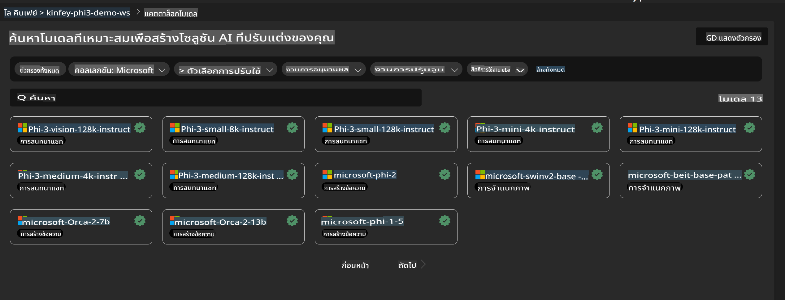
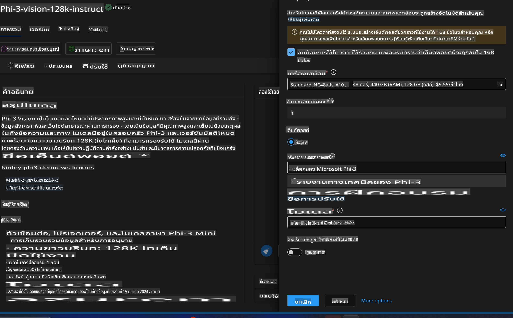
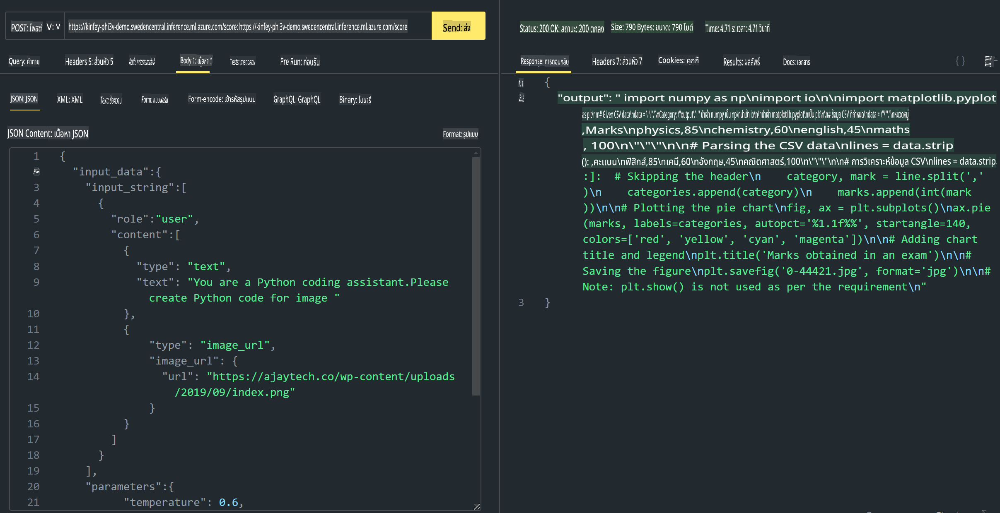

# **Lab 3 - Deploy Phi-3-vision บน Azure Machine Learning Service**

เราจะใช้ NPU เพื่อดำเนินการปรับใช้งานโค้ดในระดับการผลิต จากนั้นเราจะนำความสามารถของ PHI-3-VISION มาใช้เพื่อสร้างโค้ดจากภาพ

ในบทนำนี้ เราสามารถสร้างบริการ Model As Service สำหรับ Phi-3 Vision บน Azure Machine Learning Service ได้อย่างรวดเร็ว

***Note***: Phi-3 Vision ต้องการพลังการประมวลผลเพื่อสร้างเนื้อหาได้อย่างรวดเร็ว เราจึงต้องใช้พลังประมวลผลบนคลาวด์เพื่อช่วยให้บรรลุเป้าหมายนี้


### **1. สร้าง Azure Machine Learning Service**

เราจำเป็นต้องสร้าง Azure Machine Learning Service ใน Azure Portal หากต้องการเรียนรู้วิธีการ โปรดเยี่ยมชมลิงก์นี้ [https://learn.microsoft.com/azure/machine-learning/quickstart-create-resources?view=azureml-api-2](https://learn.microsoft.com/azure/machine-learning/quickstart-create-resources?view=azureml-api-2)


### **2. เลือก Phi-3 Vision ใน Azure Machine Learning Service**




### **3. ปรับใช้ Phi-3-Vision บน Azure**




### **4. ทดสอบ Endpoint ใน Postman**




***Note***

1. พารามิเตอร์ที่ต้องส่งต้องรวมถึง Authorization, azureml-model-deployment และ Content-Type คุณจำเป็นต้องตรวจสอบข้อมูลการปรับใช้เพื่อรับข้อมูลเหล่านี้

2. ในการส่งพารามิเตอร์ Phi-3-Vision จำเป็นต้องส่งลิงก์ของภาพ โปรดดูวิธีการส่งพารามิเตอร์จาก GPT-4-Vision เช่น

```json

{
  "input_data":{
    "input_string":[
      {
        "role":"user",
        "content":[ 
          {
            "type": "text",
            "text": "You are a Python coding assistant.Please create Python code for image "
          },
          {
              "type": "image_url",
              "image_url": {
                "url": "https://ajaytech.co/wp-content/uploads/2019/09/index.png"
              }
          }
        ]
      }
    ],
    "parameters":{
          "temperature": 0.6,
          "top_p": 0.9,
          "do_sample": false,
          "max_new_tokens": 2048
    }
  }
}

```

3. ใช้คำสั่ง Post เพื่อเรียก **/score**

**ยินดีด้วย**! คุณได้ดำเนินการปรับใช้ PHI-3-VISION อย่างรวดเร็วเสร็จสมบูรณ์แล้ว และได้ทดลองใช้งานการสร้างโค้ดจากภาพ ต่อไปเราสามารถสร้างแอปพลิเคชันโดยผสานรวม NPU และคลาวด์

**ข้อจำกัดความรับผิดชอบ**:  
เอกสารนี้ได้รับการแปลโดยใช้บริการแปลภาษาอัตโนมัติด้วย AI แม้ว่าเราจะพยายามอย่างเต็มที่เพื่อความถูกต้อง แต่โปรดทราบว่าการแปลอัตโนมัติอาจมีข้อผิดพลาดหรือความไม่ถูกต้องเกิดขึ้น เอกสารต้นฉบับในภาษาดั้งเดิมควรถูกพิจารณาให้เป็นแหล่งข้อมูลที่เชื่อถือได้มากที่สุด สำหรับข้อมูลที่สำคัญ แนะนำให้ใช้บริการแปลภาษามนุษย์ที่เป็นมืออาชีพ เราไม่รับผิดชอบต่อความเข้าใจผิดหรือการตีความที่ผิดพลาดอันเกิดจากการใช้การแปลนี้