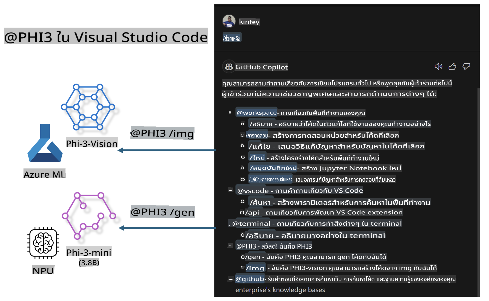

# **สร้าง Visual Studio Code GitHub Copilot Chat ของคุณเองด้วย Microsoft Phi-3 Family**

คุณเคยใช้ workspace agent ใน GitHub Copilot Chat หรือไม่? คุณอยากสร้าง code agent สำหรับทีมของคุณเองหรือเปล่า? Lab นี้มีเป้าหมายเพื่อผสานโมเดล open source เพื่อสร้างโซลูชัน code agent ระดับองค์กร

## **พื้นฐาน**

### **ทำไมต้องเลือก Microsoft Phi-3**

Phi-3 เป็นชุดโมเดลที่มีหลายขนาด เช่น phi-3-mini, phi-3-small, และ phi-3-medium ซึ่งเหมาะสำหรับการสร้างข้อความ การตอบคำถาม และการสร้างโค้ด นอกจากนี้ยังมี phi-3-vision สำหรับงานที่เกี่ยวข้องกับภาพ โมเดลนี้เหมาะสำหรับองค์กรหรือทีมที่ต้องการสร้างโซลูชัน AI แบบออฟไลน์

แนะนำให้อ่านลิงก์นี้ [https://github.com/microsoft/PhiCookBook/blob/main/md/01.Introduction/01/01.PhiFamily.md](https://github.com/microsoft/PhiCookBook/blob/main/md/01.Introduction/01/01.PhiFamily.md)

### **Microsoft GitHub Copilot Chat**

ส่วนเสริม GitHub Copilot Chat มอบอินเทอร์เฟซแบบแชทที่ช่วยให้คุณสื่อสารกับ GitHub Copilot และรับคำตอบเกี่ยวกับคำถามการเขียนโค้ดโดยตรงใน VS Code โดยไม่ต้องค้นหาข้อมูลในเอกสารหรือฟอรั่มออนไลน์

Copilot Chat ใช้การเน้นไวยากรณ์ การจัดย่อหน้า และการจัดรูปแบบอื่น ๆ เพื่อเพิ่มความชัดเจนในคำตอบที่สร้างขึ้น ขึ้นอยู่กับประเภทคำถามที่ผู้ใช้ถาม ผลลัพธ์อาจมีลิงก์ไปยังบริบท เช่น ไฟล์ซอร์สโค้ดหรือเอกสาร รวมถึงปุ่มสำหรับเข้าถึงฟังก์ชันใน VS Code

- Copilot Chat ผสานเข้ากับการทำงานของนักพัฒนาและช่วยเหลือในจุดที่คุณต้องการ:

- เริ่มแชทในตัวแก้ไขโค้ดหรือเทอร์มินัลเพื่อขอความช่วยเหลือในขณะที่คุณเขียนโค้ด

- ใช้ Chat view เพื่อมี AI assistant ที่พร้อมช่วยเหลือคุณทุกเวลา

- เปิด Quick Chat เพื่อถามคำถามสั้น ๆ และกลับไปทำสิ่งที่คุณกำลังทำอยู่

คุณสามารถใช้ GitHub Copilot Chat ในสถานการณ์ต่าง ๆ เช่น:

- ตอบคำถามเกี่ยวกับการแก้ปัญหาโค้ด

- อธิบายโค้ดของผู้อื่นและแนะนำการปรับปรุง

- เสนอการแก้ไขโค้ด

- สร้าง unit test cases

- สร้างเอกสารประกอบโค้ด

แนะนำให้อ่านลิงก์นี้ [https://code.visualstudio.com/docs/copilot/copilot-chat](https://code.visualstudio.com/docs/copilot/copilot-chat?WT.mc_id=aiml-137032-kinfeylo)

### **Microsoft GitHub Copilot Chat @workspace**

การอ้างอิง **@workspace** ใน Copilot Chat ช่วยให้คุณถามคำถามเกี่ยวกับ codebase ทั้งหมดของคุณได้ โดย Copilot จะดึงไฟล์และสัญลักษณ์ที่เกี่ยวข้องมาอย่างชาญฉลาด และนำเสนอคำตอบในรูปแบบลิงก์และตัวอย่างโค้ด

เพื่อให้ตอบคำถามได้อย่างถูกต้อง **@workspace** จะค้นหาข้อมูลจากแหล่งเดียวกับที่นักพัฒนาจะใช้เมื่อสำรวจ codebase ใน VS Code:

- ไฟล์ทั้งหมดใน workspace ยกเว้นไฟล์ที่ถูกละเว้นในไฟล์ .gitignore

- โครงสร้างไดเรกทอรีที่มีโฟลเดอร์และชื่อไฟล์ย่อย

- ดัชนีการค้นหาโค้ดของ GitHub หาก workspace เป็น repository ของ GitHub และถูกจัดทำดัชนีไว้

- สัญลักษณ์และคำจำกัดความใน workspace

- ข้อความที่เลือกหรือข้อความที่มองเห็นในตัวแก้ไขที่ใช้งานอยู่

หมายเหตุ: .gitignore จะถูกข้ามไปหากคุณเปิดไฟล์หรือเลือกข้อความในไฟล์ที่ถูกละเว้น

แนะนำให้อ่านลิงก์นี้ [https://code.visualstudio.com/docs/copilot/workspace-context](https://code.visualstudio.com/docs/copilot/workspace-context?WT.mc_id=aiml-137032-kinfeylo)

## **เรียนรู้เพิ่มเติมเกี่ยวกับ Lab นี้**

GitHub Copilot ได้ช่วยเพิ่มประสิทธิภาพการเขียนโปรแกรมขององค์กรอย่างมาก และทุกองค์กรต่างต้องการปรับแต่งฟีเจอร์ของ GitHub Copilot ให้เหมาะกับตนเอง หลายองค์กรได้สร้าง Extensions ที่คล้ายกับ GitHub Copilot โดยใช้โมเดล open source และบริบทธุรกิจของตนเอง การปรับแต่ง Extensions ทำให้ง่ายต่อการควบคุม แต่ก็อาจส่งผลต่อประสบการณ์ของผู้ใช้ เพราะ GitHub Copilot มีความสามารถที่แข็งแกร่งในการจัดการสถานการณ์ทั่วไปและความเป็นมืออาชีพ หากสามารถรักษาประสบการณ์การใช้งานให้เหมือนเดิมได้ ก็จะเป็นการปรับแต่ง Extension ที่ดียิ่งขึ้น GitHub Copilot Chat มี API ที่เกี่ยวข้องสำหรับองค์กรในการขยายประสบการณ์ Chat การรักษาประสบการณ์ที่สอดคล้องและการมีฟังก์ชันที่ปรับแต่งเองจะช่วยเพิ่มประสบการณ์การใช้งาน

Lab นี้ใช้โมเดล Phi-3 ร่วมกับ NPU ในเครื่องและ Azure hybrid เพื่อสร้าง Agent แบบกำหนดเองใน GitHub Copilot Chat ***@PHI3*** เพื่อช่วยนักพัฒนาขององค์กรในการสร้างโค้ด ***(@PHI3 /gen)*** และสร้างโค้ดจากภาพ ***(@PHI3 /img)*** 

### ***หมายเหตุ:*** 

Lab นี้ปัจจุบันรองรับ AIPC ของ Intel CPU และ Apple Silicon เราจะอัปเดตเวอร์ชัน Qualcomm NPU ในอนาคต

## **Lab**

| ชื่อ | คำอธิบาย | AIPC | Apple |
| ------------ | ----------- | -------- |-------- |
| Lab0 - การติดตั้ง (✅) | ตั้งค่าและติดตั้งสภาพแวดล้อมและเครื่องมือที่เกี่ยวข้อง | [Go](./HOL/AIPC/01.Installations.md) |[Go](./HOL/Apple/01.Installations.md) |
| Lab1 - รัน Prompt flow ด้วย Phi-3-mini (✅) | ใช้ AIPC / Apple Silicon และ NPU ในเครื่องเพื่อสร้างโค้ดด้วย Phi-3-mini | [Go](./HOL/AIPC/02.PromptflowWithNPU.md) |  [Go](./HOL/Apple/02.PromptflowWithMLX.md) |
| Lab2 - Deploy Phi-3-vision บน Azure Machine Learning Service (✅) | สร้างโค้ดโดยใช้ Azure Machine Learning Service's Model Catalog - Phi-3-vision image | [Go](./HOL/AIPC/03.DeployPhi3VisionOnAzure.md) |[Go](./HOL/Apple/03.DeployPhi3VisionOnAzure.md) |
| Lab3 - สร้าง @phi-3 agent ใน GitHub Copilot Chat (✅)  | สร้าง Phi-3 agent แบบกำหนดเองใน GitHub Copilot Chat เพื่อทำงานสร้างโค้ด สร้างโค้ดจากภาพ RAG ฯลฯ | [Go](./HOL/AIPC/04.CreatePhi3AgentInVSCode.md) | [Go](./HOL/Apple/04.CreatePhi3AgentInVSCode.md) |
| ตัวอย่างโค้ด (✅)  | ดาวน์โหลดตัวอย่างโค้ด | [Go](../../../../../../../code/07.Lab/01/AIPC) | [Go](../../../../../../../code/07.Lab/01/Apple) |

## **แหล่งข้อมูล**

1. Phi-3 Cookbook [https://github.com/microsoft/Phi-3CookBook](https://github.com/microsoft/Phi-3CookBook)

2. เรียนรู้เพิ่มเติมเกี่ยวกับ GitHub Copilot [https://learn.microsoft.com/training/paths/copilot/](https://learn.microsoft.com/training/paths/copilot/?WT.mc_id=aiml-137032-kinfeylo)

3. เรียนรู้เพิ่มเติมเกี่ยวกับ GitHub Copilot Chat [https://learn.microsoft.com/training/paths/accelerate-app-development-using-github-copilot/](https://learn.microsoft.com/training/paths/accelerate-app-development-using-github-copilot/?WT.mc_id=aiml-137032-kinfeylo)

4. เรียนรู้เพิ่มเติมเกี่ยวกับ GitHub Copilot Chat API [https://code.visualstudio.com/api/extension-guides/chat](https://code.visualstudio.com/api/extension-guides/chat?WT.mc_id=aiml-137032-kinfeylo)

5. เรียนรู้เพิ่มเติมเกี่ยวกับ Azure AI Foundry [https://learn.microsoft.com/training/paths/create-custom-copilots-ai-studio/](https://learn.microsoft.com/training/paths/create-custom-copilots-ai-studio/?WT.mc_id=aiml-137032-kinfeylo)

6. เรียนรู้เพิ่มเติมเกี่ยวกับ Azure AI Foundry's Model Catalog [https://learn.microsoft.com/azure/ai-studio/how-to/model-catalog-overview](https://learn.microsoft.com/azure/ai-studio/how-to/model-catalog-overview)

**ข้อจำกัดความรับผิดชอบ**:  
เอกสารนี้ได้รับการแปลโดยใช้บริการแปลภาษาอัตโนมัติด้วย AI แม้ว่าเราจะพยายามอย่างเต็มที่เพื่อความถูกต้อง แต่โปรดทราบว่าการแปลโดยอัตโนมัติอาจมีข้อผิดพลาดหรือความไม่ถูกต้อง เอกสารต้นฉบับในภาษาต้นฉบับควรถือเป็นแหล่งข้อมูลที่เชื่อถือได้ สำหรับข้อมูลที่สำคัญ ขอแนะนำให้ใช้บริการแปลภาษามนุษย์มืออาชีพ เราจะไม่รับผิดชอบต่อความเข้าใจผิดหรือการตีความที่คลาดเคลื่อนซึ่งเกิดจากการใช้การแปลนี้