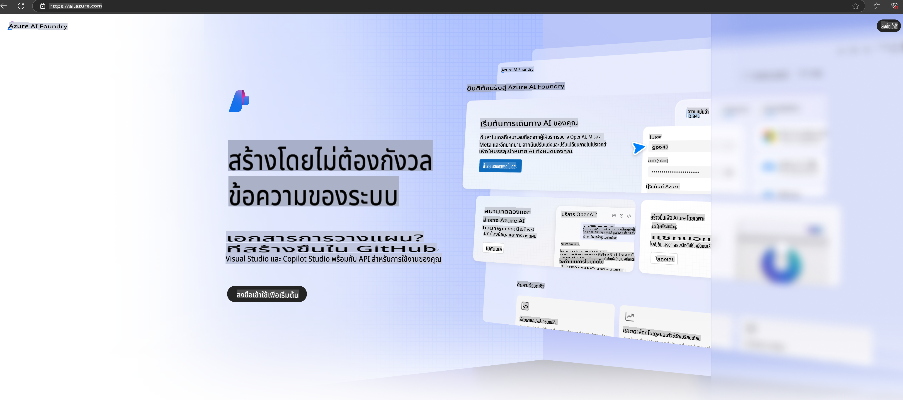

# **การใช้งาน Phi-3 ใน Azure AI Foundry**

ด้วยการพัฒนา Generative AI เราหวังที่จะใช้แพลตฟอร์มที่รวมเป็นหนึ่งเพื่อจัดการ LLM และ SLM ที่หลากหลาย การรวมข้อมูลขององค์กร การปรับแต่ง/RAG และการประเมินผลการใช้งานในธุรกิจต่าง ๆ หลังจากการรวม LLM และ SLM เพื่อให้การใช้งาน Generative AI มีประสิทธิภาพมากขึ้น [Azure AI Foundry](https://ai.azure.com) เป็นแพลตฟอร์มสำหรับการใช้งาน Generative AI ระดับองค์กร

ด้วย Azure AI Foundry คุณสามารถประเมินการตอบสนองของโมเดลภาษาขนาดใหญ่ (LLM) และจัดการองค์ประกอบของแอปพลิเคชัน prompt ด้วย prompt flow เพื่อประสิทธิภาพที่ดียิ่งขึ้น แพลตฟอร์มนี้ยังช่วยให้การขยายระบบจากแนวคิดต้นแบบไปสู่การผลิตเต็มรูปแบบเป็นเรื่องง่าย และยังมีการติดตามและปรับปรุงอย่างต่อเนื่องเพื่อความสำเร็จในระยะยาว

เราสามารถติดตั้งโมเดล Phi-3 บน Azure AI Foundry ได้อย่างรวดเร็วผ่านขั้นตอนง่าย ๆ และใช้ Azure AI Foundry สำหรับงานที่เกี่ยวข้องกับ Phi-3 เช่น Playground/Chat การปรับแต่ง การประเมินผล และอื่น ๆ

## **1. การเตรียมตัว**

หากคุณได้ติดตั้ง [Azure Developer CLI](https://learn.microsoft.com/azure/developer/azure-developer-cli/overview?WT.mc_id=aiml-138114-kinfeylo) บนเครื่องของคุณแล้ว การใช้เทมเพลตนี้สามารถทำได้ง่าย ๆ เพียงรันคำสั่งในไดเรกทอรีใหม่

## การสร้างด้วยตนเอง

การสร้างโปรเจกต์และฮับใน Microsoft Azure AI Foundry เป็นวิธีที่ดีในการจัดการและจัดระเบียบงาน AI ของคุณ นี่คือคำแนะนำทีละขั้นตอน:

### การสร้างโปรเจกต์ใน Azure AI Foundry

1. **ไปที่ Azure AI Foundry**: ลงชื่อเข้าใช้พอร์ทัล Azure AI Foundry
2. **สร้างโปรเจกต์**:
   - หากคุณอยู่ในโปรเจกต์ ให้เลือก "Azure AI Foundry" ที่มุมซ้ายบนของหน้าเพื่อกลับไปยังหน้าแรก
   - เลือก "+ Create project"
   - กรอกชื่อโปรเจกต์
   - หากคุณมีฮับอยู่แล้ว ระบบจะเลือกให้โดยอัตโนมัติ หากคุณมีสิทธิ์เข้าถึงมากกว่าหนึ่งฮับ คุณสามารถเลือกฮับอื่นจากเมนูแบบเลื่อนลงได้ หากต้องการสร้างฮับใหม่ ให้เลือก "Create new hub" และตั้งชื่อ
   - กด "Create"

### การสร้างฮับใน Azure AI Foundry

1. **ไปที่ Azure AI Foundry**: ลงชื่อเข้าใช้ด้วยบัญชี Azure ของคุณ
2. **สร้างฮับ**:
   - เลือก "Management center" จากเมนูด้านซ้าย
   - เลือก "All resources" จากนั้นคลิกที่ลูกศรถัดจาก "+ New project" และเลือก "+ New hub"
   - ในหน้าต่าง "Create a new hub" ให้กรอกชื่อฮับ (เช่น contoso-hub) และปรับแต่งข้อมูลอื่น ๆ ตามต้องการ
   - เลือก "Next" ตรวจสอบข้อมูล และกด "Create"

สำหรับคำแนะนำที่ละเอียดกว่านี้ คุณสามารถดูได้จาก [เอกสารของ Microsoft](https://learn.microsoft.com/azure/ai-studio/how-to/create-projects)

เมื่อสร้างเสร็จ คุณสามารถเข้าถึงสตูดิโอที่คุณสร้างผ่าน [ai.azure.com](https://ai.azure.com/)

ใน AI Foundry หนึ่งแห่งสามารถมีโปรเจกต์ได้หลายโปรเจกต์ สร้างโปรเจกต์ใน AI Foundry เพื่อเตรียมพร้อม

สร้าง Azure AI Foundry [QuickStarts](https://learn.microsoft.com/azure/ai-studio/quickstarts/get-started-code)

## **2. ติดตั้งโมเดล Phi ใน Azure AI Foundry**

คลิกตัวเลือก Explore ในโปรเจกต์เพื่อเข้าสู่ Model Catalog และเลือก Phi-3

เลือก Phi-3-mini-4k-instruct

คลิก 'Deploy' เพื่อติดตั้งโมเดล Phi-3-mini-4k-instruct

> [!NOTE]
>
> คุณสามารถเลือกกำลังประมวลผลได้ในขณะติดตั้ง

## **3. Playground Chat Phi ใน Azure AI Foundry**

ไปที่หน้าการติดตั้ง เลือก Playground และเริ่มแชทกับ Phi-3 บน Azure AI Foundry

## **4. การติดตั้งโมเดลจาก Azure AI Foundry**

เพื่อทำการติดตั้งโมเดลจาก Azure Model Catalog คุณสามารถทำตามขั้นตอนดังนี้:

- ลงชื่อเข้าใช้ Azure AI Foundry
- เลือกโมเดลที่คุณต้องการติดตั้งจาก Azure AI Foundry Model Catalog
- ในหน้ารายละเอียดของโมเดล เลือก Deploy และจากนั้นเลือก Serverless API with Azure AI Content Safety
- เลือกโปรเจกต์ที่คุณต้องการติดตั้งโมเดล สำหรับการใช้ Serverless API พื้นที่ทำงานของคุณต้องอยู่ในภูมิภาค East US 2 หรือ Sweden Central คุณสามารถปรับแต่งชื่อการติดตั้งได้
- ในตัวช่วยติดตั้ง เลือก Pricing and terms เพื่อดูข้อมูลราคาและเงื่อนไขการใช้งาน
- เลือก Deploy รอจนกว่าการติดตั้งจะเสร็จสมบูรณ์และคุณจะถูกนำไปยังหน้าการติดตั้ง
- เลือก Open in playground เพื่อเริ่มใช้งานโมเดล
- คุณสามารถกลับไปที่หน้าการติดตั้ง เลือกการติดตั้ง และดู URL เป้าหมายและ Secret Key ซึ่งสามารถใช้เพื่อเรียกการติดตั้งและสร้างผลลัพธ์
- คุณสามารถค้นหารายละเอียด URL และคีย์การเข้าถึงได้ตลอดเวลาผ่านแท็บ Build โดยเลือก Deployments จากส่วน Components

> [!NOTE]
> โปรดทราบว่าบัญชีของคุณต้องมีสิทธิ์ Azure AI Developer role permissions บน Resource Group เพื่อดำเนินการขั้นตอนเหล่านี้

## **5. การใช้งาน Phi API ใน Azure AI Foundry**

คุณสามารถเข้าถึง https://{Your project name}.region.inference.ml.azure.com/swagger.json ผ่าน Postman GET และใช้ร่วมกับ Key เพื่อเรียนรู้เกี่ยวกับอินเทอร์เฟซที่มีให้

คุณสามารถดูพารามิเตอร์ของคำขอและพารามิเตอร์ของคำตอบได้อย่างสะดวก

**ข้อจำกัดความรับผิดชอบ**:  
เอกสารนี้ได้รับการแปลโดยใช้บริการแปลภาษาอัตโนมัติที่ใช้ AI แม้ว่าเราจะพยายามให้การแปลมีความถูกต้อง แต่โปรดทราบว่าการแปลโดยอัตโนมัติอาจมีข้อผิดพลาดหรือความไม่แม่นยำ เอกสารต้นฉบับในภาษาต้นทางควรถือเป็นแหล่งข้อมูลที่เชื่อถือได้ สำหรับข้อมูลที่สำคัญ ขอแนะนำให้ใช้บริการแปลภาษาจากผู้เชี่ยวชาญที่เป็นมนุษย์ เราไม่รับผิดชอบต่อความเข้าใจผิดหรือการตีความผิดที่อาจเกิดขึ้นจากการใช้การแปลนี้