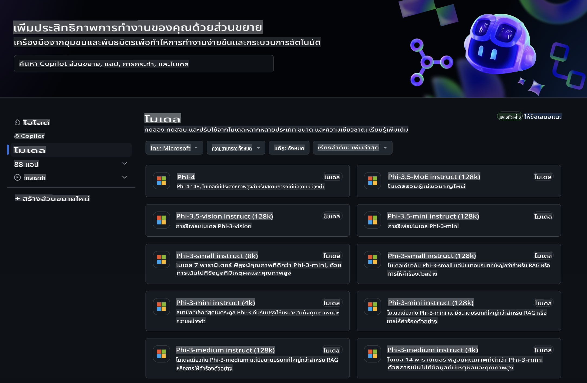
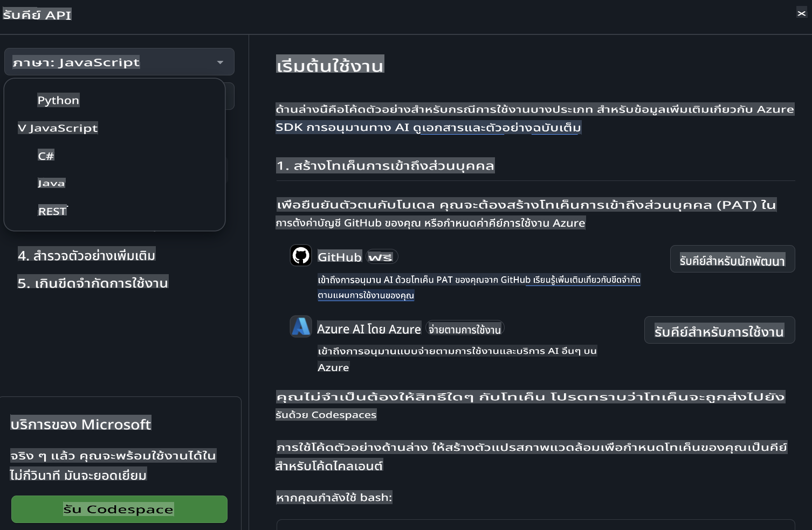
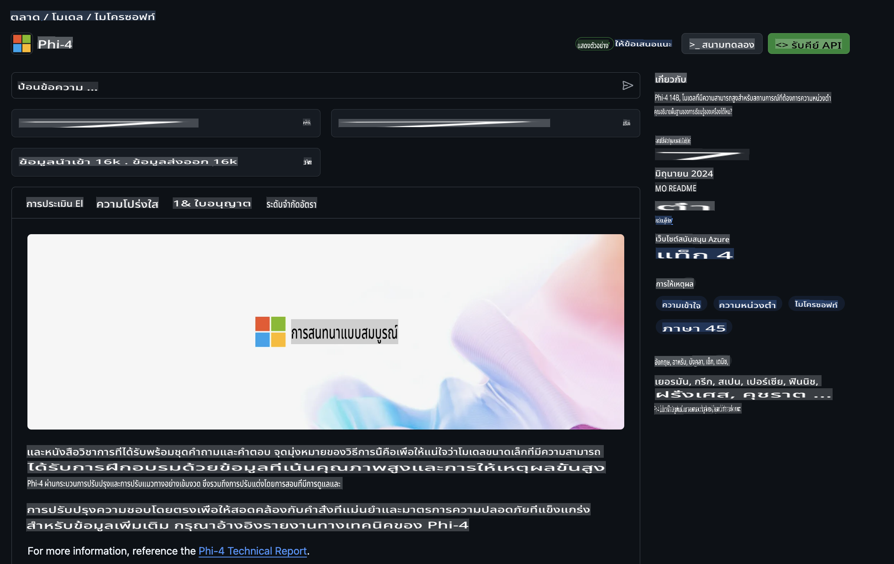

## GitHub Models - รุ่นเบต้าแบบสาธารณะจำกัด

ยินดีต้อนรับสู่ [GitHub Models](https://github.com/marketplace/models)! เราได้เตรียมทุกอย่างพร้อมแล้วสำหรับคุณในการสำรวจ AI Models ที่โฮสต์อยู่บน Azure AI



สำหรับข้อมูลเพิ่มเติมเกี่ยวกับโมเดลที่มีอยู่ใน GitHub Models โปรดดูที่ [GitHub Model Marketplace](https://github.com/marketplace/models)

## โมเดลที่มีให้ใช้งาน

แต่ละโมเดลมีพื้นที่ทดลองใช้งานและตัวอย่างโค้ดที่จัดเตรียมไว้ให้ 


### Phi-3 Models ใน GitHub Model Catalog

[Phi-3-Medium-128k-Instruct](https://github.com/marketplace/models/azureml/Phi-3-medium-128k-instruct)

[Phi-3-medium-4k-instruct](https://github.com/marketplace/models/azureml/Phi-3-medium-4k-instruct)

[Phi-3-mini-128k-instruct](https://github.com/marketplace/models/azureml/Phi-3-mini-128k-instruct)

[Phi-3-mini-4k-instruct](https://github.com/marketplace/models/azureml/Phi-3-mini-4k-instruct)

[Phi-3-small-128k-instruct](https://github.com/marketplace/models/azureml/Phi-3-small-128k-instruct)

[Phi-3-small-8k-instruct](https://github.com/marketplace/models/azureml/Phi-3-small-8k-instruct)

## เริ่มต้นใช้งาน

เรามีตัวอย่างพื้นฐานที่พร้อมให้คุณทดลองใช้งาน คุณสามารถหาตัวอย่างเหล่านี้ได้ในไดเรกทอรีตัวอย่าง หากคุณต้องการเริ่มต้นด้วยภาษาที่คุณชื่นชอบ สามารถหาตัวอย่างได้ในภาษาเหล่านี้:

- Python
- JavaScript
- cURL

นอกจากนี้ยังมีสภาพแวดล้อม Codespaces ที่เตรียมไว้สำหรับการรันตัวอย่างและโมเดล 



## ตัวอย่างโค้ด 

ด้านล่างนี้คือตัวอย่างโค้ดสำหรับการใช้งานในบางกรณี สำหรับข้อมูลเพิ่มเติมเกี่ยวกับ Azure AI Inference SDK โปรดดูเอกสารและตัวอย่างฉบับเต็ม

## การตั้งค่า 

1. สร้าง personal access token
คุณไม่จำเป็นต้องให้สิทธิ์ใด ๆ กับ token โปรดทราบว่า token จะถูกส่งไปยังบริการของ Microsoft

เพื่อใช้โค้ดตัวอย่างด้านล่างนี้ ให้สร้าง environment variable เพื่อกำหนด token ของคุณเป็น key สำหรับ client code

หากคุณใช้ bash:
```
export GITHUB_TOKEN="<your-github-token-goes-here>"
```
หากคุณใช้ powershell:

```
$Env:GITHUB_TOKEN="<your-github-token-goes-here>"
```

หากคุณใช้ Windows command prompt:

```
set GITHUB_TOKEN=<your-github-token-goes-here>
```

## ตัวอย่าง Python

### ติดตั้ง dependencies
ติดตั้ง Azure AI Inference SDK โดยใช้ pip (ต้องการ: Python >=3.8):

```
pip install azure-ai-inference
```
### รันตัวอย่างโค้ดพื้นฐาน

ตัวอย่างนี้แสดงการเรียกใช้งาน API chat completion แบบพื้นฐาน โดยใช้ GitHub AI model inference endpoint และ GitHub token ของคุณ การเรียกใช้งานนี้เป็น synchronous

```
import os
from azure.ai.inference import ChatCompletionsClient
from azure.ai.inference.models import SystemMessage, UserMessage
from azure.core.credentials import AzureKeyCredential

endpoint = "https://models.inference.ai.azure.com"
# Replace Model_Name 
model_name = "Phi-3-small-8k-instruct"
token = os.environ["GITHUB_TOKEN"]

client = ChatCompletionsClient(
    endpoint=endpoint,
    credential=AzureKeyCredential(token),
)

response = client.complete(
    messages=[
        SystemMessage(content="You are a helpful assistant."),
        UserMessage(content="What is the capital of France?"),
    ],
    model=model_name,
    temperature=1.,
    max_tokens=1000,
    top_p=1.
)

print(response.choices[0].message.content)
```

### รันการสนทนาแบบหลายรอบ

ตัวอย่างนี้แสดงการสนทนาแบบหลายรอบกับ API chat completion เมื่อใช้โมเดลในแอปพลิเคชันสนทนา คุณจะต้องจัดการประวัติการสนทนาและส่งข้อความล่าสุดไปยังโมเดล

```
import os
from azure.ai.inference import ChatCompletionsClient
from azure.ai.inference.models import AssistantMessage, SystemMessage, UserMessage
from azure.core.credentials import AzureKeyCredential

token = os.environ["GITHUB_TOKEN"]
endpoint = "https://models.inference.ai.azure.com"
# Replace Model_Name
model_name = "Phi-3-small-8k-instruct"

client = ChatCompletionsClient(
    endpoint=endpoint,
    credential=AzureKeyCredential(token),
)

messages = [
    SystemMessage(content="You are a helpful assistant."),
    UserMessage(content="What is the capital of France?"),
    AssistantMessage(content="The capital of France is Paris."),
    UserMessage(content="What about Spain?"),
]

response = client.complete(messages=messages, model=model_name)

print(response.choices[0].message.content)
```

### สตรีมผลลัพธ์

เพื่อประสบการณ์ที่ดียิ่งขึ้น คุณอาจต้องการสตรีมคำตอบจากโมเดลเพื่อให้ข้อความแรกปรากฏขึ้นเร็วขึ้นและลดเวลารอคำตอบที่ยาว

```
import os
from azure.ai.inference import ChatCompletionsClient
from azure.ai.inference.models import SystemMessage, UserMessage
from azure.core.credentials import AzureKeyCredential

token = os.environ["GITHUB_TOKEN"]
endpoint = "https://models.inference.ai.azure.com"
# Replace Model_Name
model_name = "Phi-3-small-8k-instruct"

client = ChatCompletionsClient(
    endpoint=endpoint,
    credential=AzureKeyCredential(token),
)

response = client.complete(
    stream=True,
    messages=[
        SystemMessage(content="You are a helpful assistant."),
        UserMessage(content="Give me 5 good reasons why I should exercise every day."),
    ],
    model=model_name,
)

for update in response:
    if update.choices:
        print(update.choices[0].delta.content or "", end="")

client.close()
```
## JavaScript 

### ติดตั้ง dependencies

ติดตั้ง Node.js

คัดลอกข้อความต่อไปนี้และบันทึกเป็นไฟล์ package.json ในโฟลเดอร์ของคุณ

```
{
  "type": "module",
  "dependencies": {
    "@azure-rest/ai-inference": "latest",
    "@azure/core-auth": "latest",
    "@azure/core-sse": "latest"
  }
}
```

หมายเหตุ: @azure/core-sse จำเป็นเฉพาะเมื่อคุณสตรีมคำตอบจาก chat completions

เปิดหน้าต่าง terminal ในโฟลเดอร์นี้และรัน npm install

สำหรับโค้ดตัวอย่างแต่ละตัวอย่างด้านล่างนี้ คัดลอกเนื้อหาไปยังไฟล์ sample.js และรันด้วยคำสั่ง node sample.js

### รันตัวอย่างโค้ดพื้นฐาน

ตัวอย่างนี้แสดงการเรียกใช้งาน API chat completion แบบพื้นฐาน โดยใช้ GitHub AI model inference endpoint และ GitHub token ของคุณ การเรียกใช้งานนี้เป็น synchronous

```
import ModelClient from "@azure-rest/ai-inference";
import { AzureKeyCredential } from "@azure/core-auth";

const token = process.env["GITHUB_TOKEN"];
const endpoint = "https://models.inference.ai.azure.com";
// Update your modelname
const modelName = "Phi-3-small-8k-instruct";

export async function main() {

  const client = new ModelClient(endpoint, new AzureKeyCredential(token));

  const response = await client.path("/chat/completions").post({
    body: {
      messages: [
        { role:"system", content: "You are a helpful assistant." },
        { role:"user", content: "What is the capital of France?" }
      ],
      model: modelName,
      temperature: 1.,
      max_tokens: 1000,
      top_p: 1.
    }
  });

  if (response.status !== "200") {
    throw response.body.error;
  }
  console.log(response.body.choices[0].message.content);
}

main().catch((err) => {
  console.error("The sample encountered an error:", err);
});
```

### รันการสนทนาแบบหลายรอบ

ตัวอย่างนี้แสดงการสนทนาแบบหลายรอบกับ API chat completion เมื่อใช้โมเดลในแอปพลิเคชันสนทนา คุณจะต้องจัดการประวัติการสนทนาและส่งข้อความล่าสุดไปยังโมเดล

```
import ModelClient from "@azure-rest/ai-inference";
import { AzureKeyCredential } from "@azure/core-auth";

const token = process.env["GITHUB_TOKEN"];
const endpoint = "https://models.inference.ai.azure.com";
// Update your modelname
const modelName = "Phi-3-small-8k-instruct";

export async function main() {

  const client = new ModelClient(endpoint, new AzureKeyCredential(token));

  const response = await client.path("/chat/completions").post({
    body: {
      messages: [
        { role: "system", content: "You are a helpful assistant." },
        { role: "user", content: "What is the capital of France?" },
        { role: "assistant", content: "The capital of France is Paris." },
        { role: "user", content: "What about Spain?" },
      ],
      model: modelName,
    }
  });

  if (response.status !== "200") {
    throw response.body.error;
  }

  for (const choice of response.body.choices) {
    console.log(choice.message.content);
  }
}

main().catch((err) => {
  console.error("The sample encountered an error:", err);
});
```

### สตรีมผลลัพธ์
เพื่อประสบการณ์ที่ดียิ่งขึ้น คุณอาจต้องการสตรีมคำตอบจากโมเดลเพื่อให้ข้อความแรกปรากฏขึ้นเร็วขึ้นและลดเวลารอคำตอบที่ยาว

```
import ModelClient from "@azure-rest/ai-inference";
import { AzureKeyCredential } from "@azure/core-auth";
import { createSseStream } from "@azure/core-sse";

const token = process.env["GITHUB_TOKEN"];
const endpoint = "https://models.inference.ai.azure.com";
// Update your modelname
const modelName = "Phi-3-small-8k-instruct";

export async function main() {

  const client = new ModelClient(endpoint, new AzureKeyCredential(token));

  const response = await client.path("/chat/completions").post({
    body: {
      messages: [
        { role: "system", content: "You are a helpful assistant." },
        { role: "user", content: "Give me 5 good reasons why I should exercise every day." },
      ],
      model: modelName,
      stream: true
    }
  }).asNodeStream();

  const stream = response.body;
  if (!stream) {
    throw new Error("The response stream is undefined");
  }

  if (response.status !== "200") {
    stream.destroy();
    throw new Error(`Failed to get chat completions, http operation failed with ${response.status} code`);
  }

  const sseStream = createSseStream(stream);

  for await (const event of sseStream) {
    if (event.data === "[DONE]") {
      return;
    }
    for (const choice of (JSON.parse(event.data)).choices) {
        process.stdout.write(choice.delta?.content ?? ``);
    }
  }
}

main().catch((err) => {
  console.error("The sample encountered an error:", err);
});
```

## REST 

### รันตัวอย่างโค้ดพื้นฐาน

คัดลอกข้อความต่อไปนี้ลงใน shell:

```
curl -X POST "https://models.inference.ai.azure.com/chat/completions" \
    -H "Content-Type: application/json" \
    -H "Authorization: Bearer $GITHUB_TOKEN" \
    -d '{
        "messages": [
            {
                "role": "system",
                "content": "You are a helpful assistant."
            },
            {
                "role": "user",
                "content": "What is the capital of France?"
            }
        ],
        "model": "Phi-3-small-8k-instruct"
    }'
```
### รันการสนทนาแบบหลายรอบ

เรียกใช้งาน API chat completion และส่งประวัติการสนทนา:

```
curl -X POST "https://models.inference.ai.azure.com/chat/completions" \
    -H "Content-Type: application/json" \
    -H "Authorization: Bearer $GITHUB_TOKEN" \
    -d '{
        "messages": [
            {
                "role": "system",
                "content": "You are a helpful assistant."
            },
            {
                "role": "user",
                "content": "What is the capital of France?"
            },
            {
                "role": "assistant",
                "content": "The capital of France is Paris."
            },
            {
                "role": "user",
                "content": "What about Spain?"
            }
        ],
        "model": "Phi-3-small-8k-instruct"
    }'
```
### สตรีมผลลัพธ์

นี่คือตัวอย่างการเรียก endpoint และสตรีมคำตอบ

```
curl -X POST "https://models.inference.ai.azure.com/chat/completions" \
    -H "Content-Type: application/json" \
    -H "Authorization: Bearer $GITHUB_TOKEN" \
    -d '{
        "messages": [
            {
                "role": "system",
                "content": "You are a helpful assistant."
            },
            {
                "role": "user",
                "content": "Give me 5 good reasons why I should exercise every day."
            }
        ],
        "stream": true,
        "model": "Phi-3-small-8k-instruct"
    }'
```

## การใช้งานฟรีและข้อจำกัดของ GitHub Models



[ข้อจำกัดการใช้งาน playground และ API ฟรี](https://docs.github.com/en/github-models/prototyping-with-ai-models#rate-limits) มีไว้เพื่อช่วยให้คุณทดลองใช้งานโมเดลและสร้างต้นแบบแอปพลิเคชัน AI ของคุณ สำหรับการใช้งานที่เกินข้อจำกัดเหล่านั้น และการขยายแอปพลิเคชันของคุณ คุณต้องจัดหาทรัพยากรจากบัญชี Azure และทำการยืนยันตัวตนจากที่นั่นแทนที่จะใช้ GitHub personal access token ของคุณ คุณไม่จำเป็นต้องเปลี่ยนแปลงอะไรในโค้ดของคุณ ใช้ลิงก์นี้เพื่อเรียนรู้วิธีการใช้งานที่เกินขีดจำกัดฟรีใน Azure AI

### การเปิดเผยข้อมูล

โปรดจำไว้ว่าเมื่อคุณโต้ตอบกับโมเดล คุณกำลังทดลองใช้งาน AI ดังนั้นจึงมีโอกาสเกิดข้อผิดพลาดในเนื้อหาได้

ฟีเจอร์นี้มีข้อจำกัดหลายอย่าง (รวมถึงจำนวนคำขอต่อหนึ่งนาที จำนวนคำขอต่อวัน จำนวนโทเค็นต่อคำขอ และจำนวนคำขอพร้อมกัน) และไม่ได้ออกแบบมาเพื่อใช้ในกรณีการผลิต

GitHub Models ใช้ Azure AI Content Safety ซึ่งตัวกรองเหล่านี้ไม่สามารถปิดได้เมื่อใช้งาน GitHub Models หากคุณตัดสินใจใช้โมเดลผ่านบริการแบบชำระเงิน โปรดตั้งค่าตัวกรองเนื้อหาให้ตรงกับความต้องการของคุณ

บริการนี้อยู่ภายใต้ข้อกำหนดการใช้งานล่วงหน้าของ GitHub

**ข้อจำกัดความรับผิดชอบ**:  
เอกสารนี้ได้รับการแปลโดยใช้บริการแปลภาษาอัตโนมัติด้วย AI แม้ว่าเราจะพยายามให้การแปลมีความถูกต้อง แต่โปรดทราบว่าการแปลอัตโนมัติอาจมีข้อผิดพลาดหรือความไม่ถูกต้อง เอกสารต้นฉบับในภาษาต้นฉบับควรถือเป็นแหล่งข้อมูลที่เชื่อถือได้ สำหรับข้อมูลที่สำคัญ แนะนำให้ใช้บริการแปลภาษาจากมนุษย์ที่มีความเชี่ยวชาญ เราจะไม่รับผิดชอบต่อความเข้าใจผิดหรือการตีความผิดพลาดใด ๆ ที่เกิดจากการใช้การแปลนี้