# การปรับแต่ง Phi-3 ด้วย Azure AI Foundry

มาดูกันว่าคุณสามารถปรับแต่งโมเดลภาษา Phi-3 Mini ของ Microsoft ด้วย Azure AI Foundry ได้อย่างไร การปรับแต่งช่วยให้คุณปรับ Phi-3 Mini ให้เหมาะสมกับงานเฉพาะ เพิ่มความสามารถและความเข้าใจในบริบทได้มากยิ่งขึ้น

## สิ่งที่ควรพิจารณา

- **ความสามารถ:** โมเดลใดบ้างที่สามารถปรับแต่งได้? โมเดลพื้นฐานสามารถปรับแต่งให้ทำอะไรได้บ้าง?
- **ค่าใช้จ่าย:** รูปแบบการคิดราคาสำหรับการปรับแต่งเป็นอย่างไร?
- **ความยืดหยุ่น:** สามารถปรับเปลี่ยนโมเดลพื้นฐานได้มากน้อยเพียงใด และในรูปแบบใด?
- **ความสะดวก:** กระบวนการปรับแต่งเป็นอย่างไร? ต้องเขียนโค้ดเองหรือไม่? ต้องเตรียมทรัพยากรคอมพิวต์เองหรือเปล่า?
- **ความปลอดภัย:** โมเดลที่ผ่านการปรับแต่งอาจมีความเสี่ยงด้านความปลอดภัย มีมาตรการใดบ้างที่ช่วยลดความเสี่ยงที่ไม่ตั้งใจ?

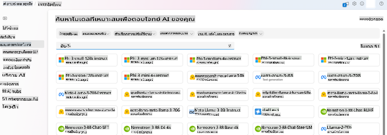

## การเตรียมตัวสำหรับการปรับแต่ง

### ข้อกำหนดเบื้องต้น

> [!NOTE]
> สำหรับโมเดลในตระกูล Phi-3 บริการปรับแต่งแบบจ่ายตามการใช้งานมีให้เฉพาะฮับที่สร้างในภูมิภาค **East US 2** เท่านั้น

- บัญชี Azure Subscription หากคุณยังไม่มีบัญชี Azure ให้สร้าง [บัญชีแบบชำระเงิน](https://azure.microsoft.com/pricing/purchase-options/pay-as-you-go) เพื่อเริ่มต้น

- โครงการ [AI Foundry](https://ai.azure.com?WT.mc_id=aiml-138114-kinfeylo)
- การควบคุมการเข้าถึงตามบทบาทของ Azure (Azure RBAC) ใช้เพื่อให้สิทธิ์ในการดำเนินการใน Azure AI Foundry บัญชีผู้ใช้ของคุณต้องได้รับการกำหนดบทบาท __Azure AI Developer__ ในกลุ่มทรัพยากร

### การลงทะเบียน Subscription Provider

ตรวจสอบให้แน่ใจว่า Subscription ของคุณลงทะเบียนกับผู้ให้บริการทรัพยากร `Microsoft.Network` แล้ว

1. ลงชื่อเข้าใช้ [Azure portal](https://portal.azure.com)
1. เลือก **Subscriptions** จากเมนูด้านซ้าย
1. เลือก Subscription ที่คุณต้องการใช้
1. เลือก **AI project settings** > **Resource providers** จากเมนูด้านซ้าย
1. ตรวจสอบให้แน่ใจว่า **Microsoft.Network** อยู่ในรายการ Resource Providers หากไม่มีก็ให้เพิ่มเข้าไป

### การเตรียมข้อมูล

เตรียมข้อมูลการฝึกและการตรวจสอบสำหรับการปรับแต่งโมเดล ชุดข้อมูลการฝึกและการตรวจสอบของคุณควรมีตัวอย่างอินพุตและเอาต์พุตตามที่คุณต้องการให้โมเดลทำงาน

ตรวจสอบให้แน่ใจว่าตัวอย่างข้อมูลการฝึกทั้งหมดมีรูปแบบที่เหมาะสมสำหรับการคาดการณ์ เพื่อการปรับแต่งโมเดลที่มีประสิทธิภาพ ควรมีชุดข้อมูลที่สมดุลและหลากหลาย

กระบวนการนี้รวมถึงการรักษาสมดุลของข้อมูล การรวมสถานการณ์ต่างๆ และการปรับปรุงข้อมูลการฝึกอย่างสม่ำเสมอเพื่อให้สอดคล้องกับความคาดหวังในโลกจริง ซึ่งจะนำไปสู่การตอบสนองของโมเดลที่แม่นยำและสมดุลมากขึ้น

โมเดลแต่ละประเภทอาจต้องการรูปแบบข้อมูลการฝึกที่แตกต่างกัน

### Chat Completion

ข้อมูลการฝึกและการตรวจสอบที่คุณใช้ **ต้อง** อยู่ในรูปแบบเอกสาร JSON Lines (JSONL) สำหรับ `Phi-3-mini-128k-instruct` ชุดข้อมูลการปรับแต่งต้องอยู่ในรูปแบบการสนทนาที่ใช้โดย Chat completions API

### ตัวอย่างรูปแบบไฟล์

```json
    {"messages": [{"role": "system", "content": "You are an Xbox customer support agent whose primary goal is to help users with issues they are experiencing with their Xbox devices. You are friendly and concise. You only provide factual answers to queries, and do not provide answers that are not related to Xbox."}, {"role": "user", "content": "Is Xbox better than PlayStation?"}, {"role": "assistant", "content": "I apologize, but I cannot provide personal opinions. My primary job is to assist you with any issues related to your Xbox device. Do you have any Xbox-related issues that need addressing?"}]}
    {"messages": [{"role": "system", "content": "You are an Xbox customer support agent whose primary goal is to help users with issues they are experiencing with their Xbox devices. You are friendly and concise. You only provide factual answers to queries, and do not provide answers that are not related to Xbox."}, {"role": "user", "content": "Can I play PC games on my Xbox?"}, {"role": "assistant", "content": "While Xbox consoles don't natively support PC games, they can play an array of Xbox games, many of which are also available on PC. Can I assist you with finding games compatible with your Xbox device?"}]}
    {"messages": [{"role": "system", "content": "You are an Xbox customer support agent whose primary goal is to help users with issues they are experiencing with their Xbox devices. You are friendly and concise. You only provide factual answers to queries, and do not provide answers that are not related to Xbox."}, {"role": "user", "content": "I'm having trouble connecting my Xbox to the Wi-Fi."}, {"role": "assistant", "content": "No worries, let's go through the network settings on your Xbox. Can you please tell me what happens when you try to connect it to the Wi-Fi?"}]}
```

ประเภทไฟล์ที่รองรับคือ JSON Lines ไฟล์จะถูกอัปโหลดไปยังพื้นที่จัดเก็บข้อมูลเริ่มต้นและพร้อมใช้งานในโครงการของคุณ

## การปรับแต่ง Phi-3 ด้วย Azure AI Foundry

Azure AI Foundry ช่วยให้คุณปรับแต่งโมเดลภาษาขนาดใหญ่ให้เข้ากับชุดข้อมูลเฉพาะของคุณผ่านกระบวนการที่เรียกว่าการปรับแต่ง การปรับแต่งนี้มีคุณค่าอย่างมากโดยช่วยให้คุณสามารถปรับแต่งและเพิ่มประสิทธิภาพสำหรับงานและการใช้งานเฉพาะด้าน นำไปสู่ประสิทธิภาพที่ดีขึ้น ความคุ้มค่า ลดความล่าช้า และผลลัพธ์ที่ตรงเป้าหมาย

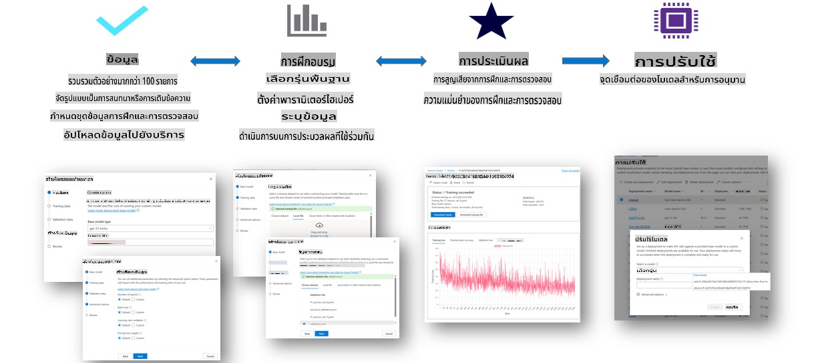

### สร้างโครงการใหม่

1. ลงชื่อเข้าใช้ [Azure AI Foundry](https://ai.azure.com)

1. เลือก **+New project** เพื่อสร้างโครงการใหม่ใน Azure AI Foundry

    

1. ดำเนินการดังนี้:

    - ระบุ **Hub name** ของโครงการ ชื่อต้องไม่ซ้ำ
    - เลือก **Hub** ที่จะใช้ (สร้างใหม่หากจำเป็น)

    

1. ทำตามขั้นตอนต่อไปนี้เพื่อสร้างฮับใหม่:

    - ระบุ **Hub name** ชื่อต้องไม่ซ้ำ
    - เลือก **Subscription** ของ Azure
    - เลือก **Resource group** ที่จะใช้ (สร้างใหม่หากจำเป็น)
    - เลือก **Location** ที่ต้องการใช้
    - เลือก **Connect Azure AI Services** ที่ต้องการใช้ (สร้างใหม่หากจำเป็น)
    - เลือก **Connect Azure AI Search** เป็น **Skip connecting**

    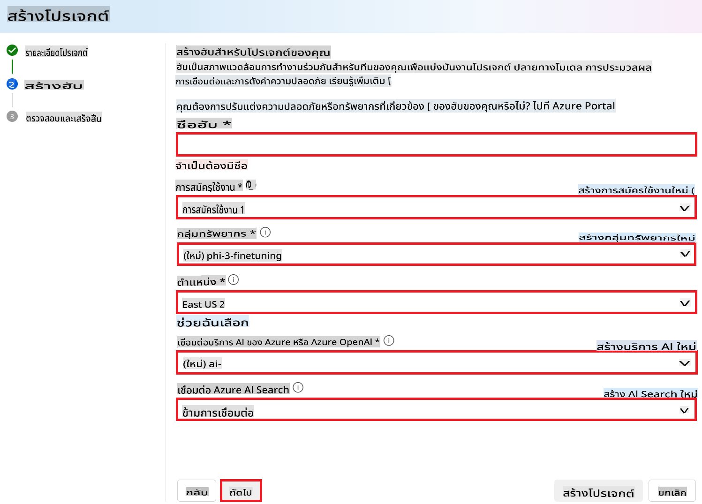

1. เลือก **Next**
1. เลือก **Create a project**

### การเตรียมข้อมูล

ก่อนการปรับแต่ง ให้รวบรวมหรือสร้างชุดข้อมูลที่เกี่ยวข้องกับงานของคุณ เช่น คำสั่งสนทนา คู่คำถาม-คำตอบ หรือข้อความอื่นๆ ที่เกี่ยวข้อง ทำความสะอาดและประมวลผลข้อมูลนี้โดยการลบสิ่งรบกวน จัดการกับค่าที่ขาดหาย และแบ่งข้อความออกเป็นหน่วยย่อย

### การปรับแต่งโมเดล Phi-3 ใน Azure AI Foundry

> [!NOTE]
> การปรับแต่งโมเดล Phi-3 รองรับเฉพาะโครงการที่ตั้งอยู่ใน East US 2

1. เลือก **Model catalog** จากแท็บด้านซ้าย

1. พิมพ์ *phi-3* ใน **แถบค้นหา** และเลือกโมเดล phi-3 ที่คุณต้องการใช้

    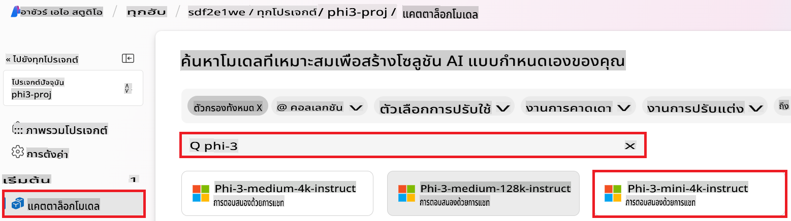

1. เลือก **Fine-tune**

    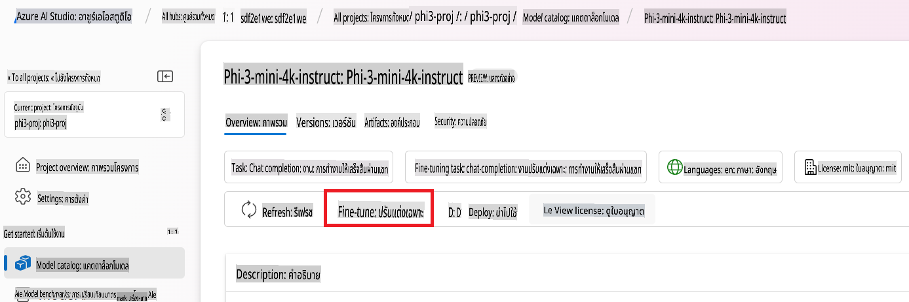

1. ระบุ **Fine-tuned model name**

    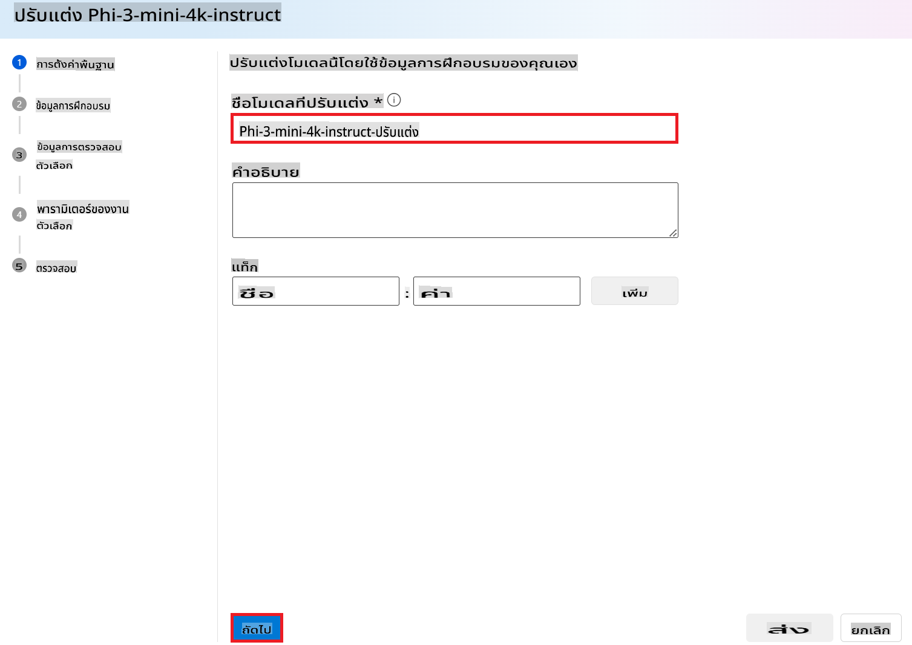

1. เลือก **Next**

1. ดำเนินการดังนี้:

    - เลือก **task type** เป็น **Chat completion**
    - เลือก **Training data** ที่คุณต้องการใช้ คุณสามารถอัปโหลดผ่าน Azure AI Foundry หรือจากสภาพแวดล้อมในเครื่องของคุณ

    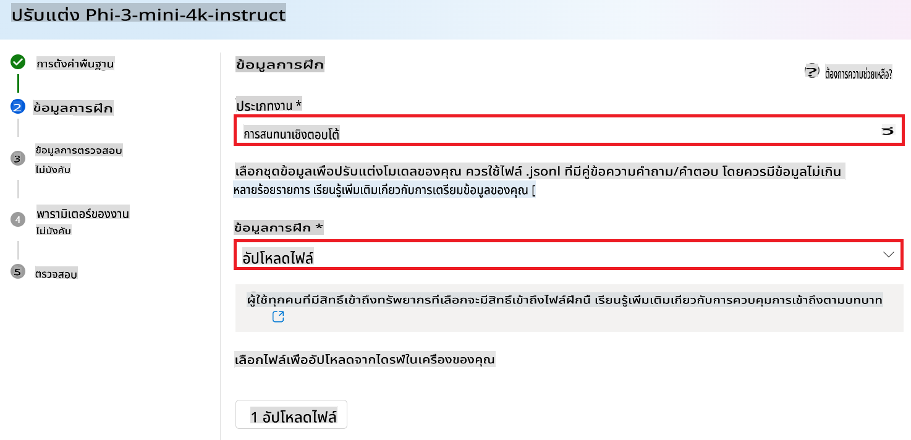

1. เลือก **Next**

1. อัปโหลด **Validation data** ที่คุณต้องการใช้ หรือเลือก **Automatic split of training data**

    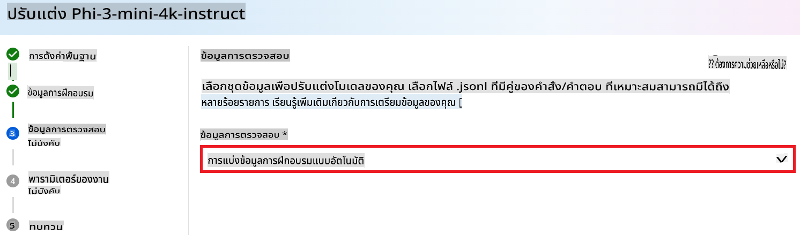

1. เลือก **Next**

1. ดำเนินการดังนี้:

    - เลือก **Batch size multiplier** ที่คุณต้องการใช้
    - เลือก **Learning rate** ที่คุณต้องการใช้
    - เลือก **Epochs** ที่คุณต้องการใช้

    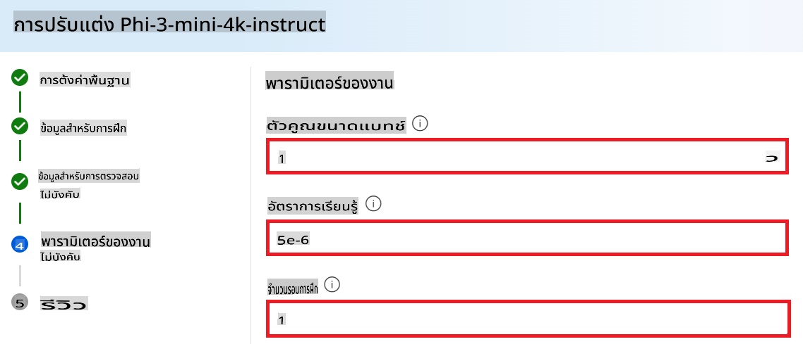

1. เลือก **Submit** เพื่อเริ่มกระบวนการปรับแต่ง

    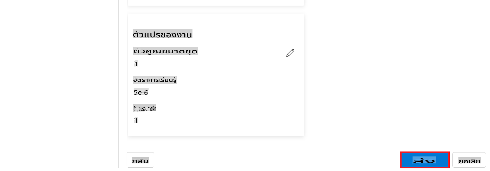

1. เมื่อโมเดลของคุณได้รับการปรับแต่ง สถานะจะเปลี่ยนเป็น **Completed** ดังที่แสดงในภาพด้านล่าง จากนั้นคุณสามารถนำโมเดลไปปรับใช้ในแอปพลิเคชันของคุณเอง ใน Playground หรือใน Prompt Flow สำหรับข้อมูลเพิ่มเติม ดู [วิธีการปรับใช้โมเดลตระกูล Phi-3 ใน Azure AI Foundry](https://learn.microsoft.com/azure/ai-studio/how-to/deploy-models-phi-3?tabs=phi-3-5&pivots=programming-language-python)

    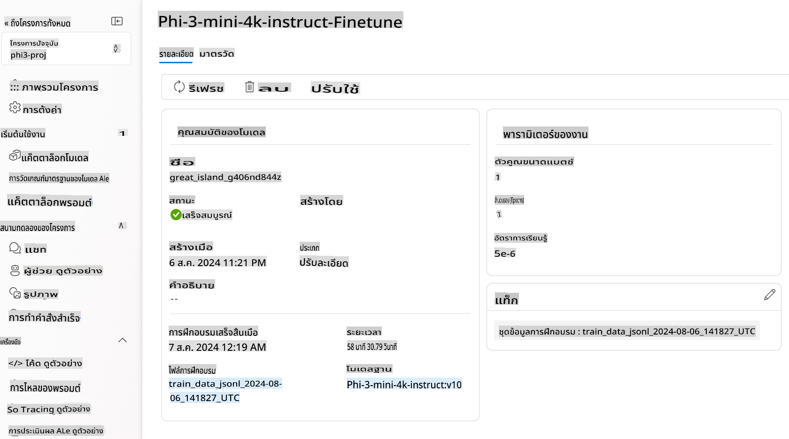

> [!NOTE]
> สำหรับข้อมูลเพิ่มเติมเกี่ยวกับการปรับแต่ง Phi-3 โปรดดู [การปรับแต่งโมเดล Phi-3 ใน Azure AI Foundry](https://learn.microsoft.com/azure/ai-studio/how-to/fine-tune-phi-3?tabs=phi-3-mini)

## การลบโมเดลที่ปรับแต่งแล้ว

คุณสามารถลบโมเดลที่ปรับแต่งแล้วจากรายการโมเดลปรับแต่งใน [Azure AI Foundry](https://ai.azure.com) หรือจากหน้ารายละเอียดของโมเดล เลือกโมเดลที่ปรับแต่งแล้วที่ต้องการลบจากหน้า Fine-tuning แล้วกดปุ่ม Delete เพื่อลบโมเดลที่ปรับแต่งแล้ว

> [!NOTE]
> คุณไม่สามารถลบโมเดลที่กำหนดเองได้หากยังมีการปรับใช้อยู่ คุณต้องลบการปรับใช้โมเดลก่อนจึงจะสามารถลบโมเดลที่กำหนดเองได้

## ค่าใช้จ่ายและโควตา

### ข้อพิจารณาเกี่ยวกับค่าใช้จ่ายและโควตาสำหรับการปรับแต่งโมเดล Phi-3

โมเดล Phi ที่ปรับแต่งเป็นบริการได้รับการจัดหาโดย Microsoft และผสานรวมกับ Azure AI Foundry เพื่อการใช้งาน คุณสามารถดูราคาขณะ [ปรับใช้](https://learn.microsoft.com/azure/ai-studio/how-to/deploy-models-phi-3?tabs=phi-3-5&pivots=programming-language-python) หรือปรับแต่งโมเดลได้ในแท็บ Pricing and terms ในตัวช่วยสร้างการปรับใช้

## การกรองเนื้อหา

โมเดลที่ปรับใช้เป็นบริการด้วยการจ่ายตามการใช้งานจะได้รับการป้องกันด้วย Azure AI Content Safety เมื่อปรับใช้ใน Endpoint แบบเรียลไทม์ คุณสามารถเลือกไม่ใช้ความสามารถนี้ได้ เมื่อเปิดใช้งาน Azure AI Content Safety ทั้งคำถามและคำตอบจะถูกตรวจสอบผ่านโมเดลการจัดประเภทเพื่อป้องกันเนื้อหาที่เป็นอันตราย ระบบกรองเนื้อหาจะตรวจจับและดำเนินการกับหมวดหมู่เฉพาะของเนื้อหาที่อาจเป็นอันตรายทั้งในคำถามและคำตอบ ดูข้อมูลเพิ่มเติมเกี่ยวกับ [Azure AI Content Safety](https://learn.microsoft.com/azure/ai-studio/concepts/content-filtering)

**การกำหนดค่าการปรับแต่ง**

Hyperparameters: กำหนดค่าพารามิเตอร์ เช่น อัตราการเรียนรู้ ขนาดแบตช์ และจำนวนรอบการฝึก

**Loss Function**

เลือก Loss Function ที่เหมาะสมกับงานของคุณ (เช่น cross-entropy)

**Optimizer**

เลือก Optimizer (เช่น Adam) สำหรับการอัปเดต Gradient ระหว่างการฝึก

**กระบวนการปรับแต่ง**

- โหลดโมเดลที่ฝึกไว้ล่วงหน้า: โหลด Checkpoint ของ Phi-3 Mini
- เพิ่มเลเยอร์ที่กำหนดเอง: เพิ่มเลเยอร์เฉพาะงาน (เช่น Classification Head สำหรับคำสั่งสนทนา)

**การฝึกโมเดล**

ปรับแต่งโมเดลโดยใช้ชุดข้อมูลที่เตรียมไว้ ตรวจสอบความคืบหน้าของการฝึกและปรับพารามิเตอร์ตามความจำเป็น

**การประเมินและตรวจสอบ**

Validation Set: แบ่งข้อมูลของคุณออกเป็นชุดการฝึกและชุดการตรวจสอบ

**ประเมินประสิทธิภาพ**

ใช้ตัวชี้วัด เช่น Accuracy, F1-score หรือ Perplexity เพื่อประเมินประสิทธิภาพของโมเดล

## บันทึกโมเดลที่ปรับแต่งแล้ว

**Checkpoint**
บันทึก Checkpoint ของโมเดลที่ปรับแต่งไว้สำหรับการใช้งานในอนาคต

## การปรับใช้

- ปรับใช้เป็น Web Service: ปรับใช้โมเดลที่ปรับแต่งแล้วของคุณเป็น Web Service ใน Azure AI Foundry
- ทดสอบ Endpoint: ส่งคำถามทดสอบไปยัง Endpoint ที่ปรับใช้เพื่อตรวจสอบการทำงาน

## ปรับปรุงและพัฒนา

ปรับปรุง: หากผลลัพธ์ไม่เป็นที่น่าพอใจ ให้ปรับปรุงโดยการปรับพารามิเตอร์ เพิ่มข้อมูล หรือปรับแต่งเพิ่มเติม

## การติดตามและปรับแต่ง

ติดตามพฤติกรรมของโมเดลอย่างต่อเนื่องและปรับแต่งตามความจำเป็น

## การปรับแต่งและขยาย

งานที่กำหนดเอง: Phi-3 Mini สามารถปรับแต่งสำหรับงานที่หลากหลายเกินกว่าคำสั่งสนทนา ลองสำรวจการใช้งานอื่นๆ!
ทดลอง: ทดลองโครงสร้าง สลับเลเยอร์ และเทคนิคต่างๆ เพื่อเพิ่มประสิทธิภาพ

> [!NOTE]
> การปรับแต่งเป็นกระบวนการที่ต้องทำซ้ำ ทดลอง เรียนรู้ และปรับโมเดลของคุณเพื่อให้ได้ผลลัพธ์ที่ดีที่สุดสำหรับงานเฉพาะของคุณ!

**ข้อจำกัดความรับผิดชอบ**:  
เอกสารนี้ได้รับการแปลโดยใช้บริการแปลภาษาอัตโนมัติที่ใช้ AI แม้ว่าเราจะพยายามอย่างเต็มที่เพื่อให้การแปลมีความถูกต้อง แต่โปรดทราบว่าการแปลอัตโนมัติอาจมีข้อผิดพลาดหรือความไม่แม่นยำ เอกสารต้นฉบับในภาษาต้นฉบับควรถือเป็นแหล่งข้อมูลที่เชื่อถือได้ สำหรับข้อมูลที่สำคัญ แนะนำให้ใช้บริการแปลภาษามนุษย์ที่เป็นมืออาชีพ เราจะไม่รับผิดชอบต่อความเข้าใจผิดหรือการตีความที่คลาดเคลื่อนซึ่งเกิดจากการใช้การแปลนี้