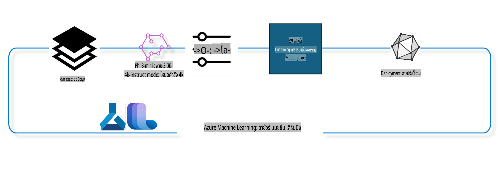

## วิธีใช้ส่วนประกอบ chat-completion จากระบบ Azure ML Registry เพื่อปรับแต่งโมเดล

ในตัวอย่างนี้ เราจะปรับแต่งโมเดล Phi-3-mini-4k-instruct เพื่อให้สามารถสร้างบทสนทนาระหว่างบุคคลสองคนได้ โดยใช้ชุดข้อมูล ultrachat_200k



ตัวอย่างนี้จะแสดงให้เห็นวิธีการปรับแต่งโมเดลด้วย Azure ML SDK และ Python จากนั้นนำโมเดลที่ปรับแต่งแล้วไปใช้งานผ่านออนไลน์เอนด์พอยต์สำหรับการคาดการณ์แบบเรียลไทม์

### ข้อมูลสำหรับการฝึก

เราจะใช้ชุดข้อมูล ultrachat_200k ซึ่งเป็นเวอร์ชันที่ถูกกรองอย่างเข้มงวดของชุดข้อมูล UltraChat และเคยถูกใช้ในการฝึก Zephyr-7B-β ซึ่งเป็นโมเดลแชทขนาด 7B ที่ล้ำสมัย

### โมเดล

เราจะใช้โมเดล Phi-3-mini-4k-instruct เพื่อแสดงให้เห็นว่าผู้ใช้งานสามารถปรับแต่งโมเดลสำหรับงาน chat-completion ได้อย่างไร หากคุณเปิดโน้ตบุ๊กนี้จากโมเดลที่เฉพาะเจาะจง อย่าลืมเปลี่ยนชื่อโมเดลให้ตรงกับที่คุณใช้

### งานที่ต้องทำ

- เลือกโมเดลที่จะปรับแต่ง
- เลือกและสำรวจข้อมูลสำหรับการฝึก
- กำหนดค่าการปรับแต่ง
- เริ่มการปรับแต่ง
- ตรวจสอบเมตริกการฝึกและการประเมินผล
- ลงทะเบียนโมเดลที่ปรับแต่งแล้ว
- นำโมเดลที่ปรับแต่งแล้วไปใช้งานสำหรับการคาดการณ์แบบเรียลไทม์
- ล้างทรัพยากรที่ใช้

## 1. ตั้งค่าขั้นต้น

- ติดตั้งไลบรารีที่จำเป็น
- เชื่อมต่อกับ AzureML Workspace เรียนรู้เพิ่มเติมที่การตั้งค่า SDK Authentication แทนที่ <WORKSPACE_NAME>, <RESOURCE_GROUP> และ <SUBSCRIPTION_ID> ด้านล่าง
- เชื่อมต่อกับ AzureML System Registry
- ตั้งชื่อการทดลอง (experiment name) ที่เป็นตัวเลือก
- ตรวจสอบหรือสร้างทรัพยากรคอมพิวต์

> [!NOTE]
> ข้อกำหนด: โหนด GPU เดี่ยวสามารถมี GPU การ์ดได้หลายตัว ตัวอย่างเช่น โหนด Standard_NC24rs_v3 มี NVIDIA V100 GPUs 4 ตัว ขณะที่ Standard_NC12s_v3 มี NVIDIA V100 GPUs 2 ตัว ดูข้อมูลเพิ่มเติมในเอกสารประกอบ จำนวนการ์ด GPU ต่อโหนดถูกตั้งค่าในพารามิเตอร์ gpus_per_node ด้านล่าง การตั้งค่านี้อย่างถูกต้องจะช่วยให้ใช้ GPU ทุกตัวในโหนดได้อย่างเต็มประสิทธิภาพ SKU คอมพิวต์ GPU ที่แนะนำสามารถดูได้ที่นี่และที่นี่

### ไลบรารี Python

ติดตั้งไลบรารีที่จำเป็นโดยรันโค้ดในเซลล์ด้านล่าง ขั้นตอนนี้ไม่สามารถข้ามได้หากรันในสภาพแวดล้อมใหม่

```bash
pip install azure-ai-ml
pip install azure-identity
pip install datasets==2.9.0
pip install mlflow
pip install azureml-mlflow
```

### การโต้ตอบกับ Azure ML

1. สคริปต์ Python นี้ใช้สำหรับโต้ตอบกับบริการ Azure Machine Learning (Azure ML) รายละเอียดมีดังนี้:

    - นำเข้าโมดูลที่จำเป็นจาก azure.ai.ml, azure.identity และ azure.ai.ml.entities รวมถึง time module
    - พยายามรับรองความถูกต้องโดยใช้ DefaultAzureCredential() หากล้มเหลวจะเปลี่ยนไปใช้ InteractiveBrowserCredential() เพื่อเข้าสู่ระบบแบบโต้ตอบ
    - พยายามสร้างอินสแตนซ์ MLClient โดยใช้เมธอด from_config ซึ่งอ่านค่าคอนฟิกจากไฟล์ config.json หากล้มเหลวจะสร้าง MLClient ด้วยการระบุ subscription_id, resource_group_name และ workspace_name ด้วยตนเอง
    - สร้างอินสแตนซ์ MLClient อีกตัวสำหรับ Azure ML Registry ชื่อ "azureml" ซึ่งเก็บโมเดล ท่อการปรับแต่ง และสภาพแวดล้อม
    - ตั้งชื่อการทดลองเป็น "chat_completion_Phi-3-mini-4k-instruct"
    - สร้าง timestamp ที่ไม่ซ้ำกันโดยแปลงเวลาปัจจุบันเป็นจำนวนเต็มและจากนั้นเป็นสตริง เพื่อใช้สำหรับสร้างชื่อและเวอร์ชันที่ไม่ซ้ำกัน

    ```python
    # Import necessary modules from Azure ML and Azure Identity
    from azure.ai.ml import MLClient
    from azure.identity import (
        DefaultAzureCredential,
        InteractiveBrowserCredential,
    )
    from azure.ai.ml.entities import AmlCompute
    import time  # Import time module
    
    # Try to authenticate using DefaultAzureCredential
    try:
        credential = DefaultAzureCredential()
        credential.get_token("https://management.azure.com/.default")
    except Exception as ex:  # If DefaultAzureCredential fails, use InteractiveBrowserCredential
        credential = InteractiveBrowserCredential()
    
    # Try to create an MLClient instance using the default config file
    try:
        workspace_ml_client = MLClient.from_config(credential=credential)
    except:  # If that fails, create an MLClient instance by manually providing the details
        workspace_ml_client = MLClient(
            credential,
            subscription_id="<SUBSCRIPTION_ID>",
            resource_group_name="<RESOURCE_GROUP>",
            workspace_name="<WORKSPACE_NAME>",
        )
    
    # Create another MLClient instance for the Azure ML registry named "azureml"
    # This registry is where models, fine-tuning pipelines, and environments are stored
    registry_ml_client = MLClient(credential, registry_name="azureml")
    
    # Set the experiment name
    experiment_name = "chat_completion_Phi-3-mini-4k-instruct"
    
    # Generate a unique timestamp that can be used for names and versions that need to be unique
    timestamp = str(int(time.time()))
    ```

## 2. เลือกโมเดลพื้นฐานสำหรับการปรับแต่ง

1. Phi-3-mini-4k-instruct เป็นโมเดลที่มีพารามิเตอร์ 3.8B มีน้ำหนักเบาและล้ำสมัย สร้างขึ้นจากชุดข้อมูลที่ใช้กับ Phi-2 โมเดลนี้อยู่ในตระกูล Phi-3 และมีสองเวอร์ชันคือ 4K และ 128K ซึ่งหมายถึงความยาวบริบท (ในโทเค็น) ที่รองรับ เราจำเป็นต้องปรับแต่งโมเดลนี้เพื่อให้เหมาะสมกับการใช้งานเฉพาะของเรา คุณสามารถเรียกดูโมเดลเหล่านี้ใน Model Catalog ใน AzureML Studio โดยกรองตามงาน chat-completion ในตัวอย่างนี้ เราใช้โมเดล Phi-3-mini-4k-instruct หากคุณเปิดโน้ตบุ๊กนี้สำหรับโมเดลอื่น โปรดเปลี่ยนชื่อและเวอร์ชันของโมเดลให้ตรงกัน

    > [!NOTE]
    > คุณสมบัติ model id ของโมเดลจะถูกส่งเป็นอินพุตในงานการปรับแต่ง ซึ่งสามารถดูได้ในฟิลด์ Asset ID ในหน้ารายละเอียดของโมเดลใน AzureML Studio Model Catalog

2. สคริปต์ Python นี้โต้ตอบกับบริการ Azure Machine Learning (Azure ML) รายละเอียดมีดังนี้:

    - ตั้งค่า model_name เป็น "Phi-3-mini-4k-instruct"
    - ใช้เมธอด get ของพร็อพเพอร์ตี้ models จากอ็อบเจ็กต์ registry_ml_client เพื่อดึงเวอร์ชันล่าสุดของโมเดลที่ระบุชื่อจาก Azure ML Registry
    - พิมพ์ข้อความในคอนโซลระบุชื่อ เวอร์ชัน และ id ของโมเดลที่จะใช้ในการปรับแต่ง โดยใช้เมธอด format เพื่อแทรกค่าลงในข้อความ

    ```python
    # Set the model name
    model_name = "Phi-3-mini-4k-instruct"
    
    # Get the latest version of the model from the Azure ML registry
    foundation_model = registry_ml_client.models.get(model_name, label="latest")
    
    # Print the model name, version, and id
    # This information is useful for tracking and debugging
    print(
        "\n\nUsing model name: {0}, version: {1}, id: {2} for fine tuning".format(
            foundation_model.name, foundation_model.version, foundation_model.id
        )
    )
    ```

## 3. สร้างทรัพยากรคอมพิวต์ที่จะใช้ในงาน

งานการปรับแต่งจะทำงานได้เฉพาะกับ GPU compute ขนาดของทรัพยากรคอมพิวต์ขึ้นอยู่กับขนาดของโมเดล และในหลายกรณีอาจต้องเลือกขนาดที่เหมาะสม

> [!NOTE]
> ทรัพยากรคอมพิวต์ที่แสดงด้านล่างทำงานได้ดีที่สุดในค่าคอนฟิกที่เหมาะสมที่สุด การเปลี่ยนค่าคอนฟิกอาจทำให้เกิดข้อผิดพลาด Cuda Out Of Memory หากเกิดปัญหา ให้ลองอัปเกรดทรัพยากรคอมพิวต์เป็นขนาดที่ใหญ่ขึ้น

> [!NOTE]
> ขณะเลือก compute_cluster_size ด้านล่าง ตรวจสอบให้แน่ใจว่าทรัพยากรคอมพิวต์นั้นมีอยู่ใน resource group ของคุณ หากไม่มีทรัพยากรคอมพิวต์ที่ต้องการ คุณสามารถส่งคำขอเพื่อขอสิทธิ์การเข้าถึงทรัพยากรคอมพิวต์ได้

### ตรวจสอบโมเดลสำหรับรองรับการปรับแต่ง

1. สคริปต์ Python นี้โต้ตอบกับโมเดลใน Azure ML รายละเอียดมีดังนี้:

    - นำเข้าโมดูล ast เพื่อประมวลผลโครงสร้างไวยากรณ์ของ Python
    - ตรวจสอบว่าอ็อบเจ็กต์ foundation_model มีแท็กชื่อ finetune_compute_allow_list หรือไม่ หากมีจะใช้ฟังก์ชัน ast.literal_eval เพื่อแปลงค่าของแท็ก (ซึ่งเป็นสตริง) เป็นลิสต์ Python และกำหนดค่าให้กับตัวแปร computes_allow_list จากนั้นพิมพ์ข้อความแจ้งให้ผู้ใช้สร้างทรัพยากรคอมพิวต์จากลิสต์นี้
    - หากไม่มีแท็ก finetune_compute_allow_list จะตั้งค่า computes_allow_list เป็น None และพิมพ์ข้อความแจ้งว่าแท็กนี้ไม่มีอยู่ในเมตาดาต้าของโมเดล

    ```python
    # Import the ast module, which provides functions to process trees of the Python abstract syntax grammar
    import ast
    
    # Check if the 'finetune_compute_allow_list' tag is present in the model's tags
    if "finetune_compute_allow_list" in foundation_model.tags:
        # If the tag is present, use ast.literal_eval to safely parse the tag's value (a string) into a Python list
        computes_allow_list = ast.literal_eval(
            foundation_model.tags["finetune_compute_allow_list"]
        )  # convert string to python list
        # Print a message indicating that a compute should be created from the list
        print(f"Please create a compute from the above list - {computes_allow_list}")
    else:
        # If the tag is not present, set computes_allow_list to None
        computes_allow_list = None
        # Print a message indicating that the 'finetune_compute_allow_list' tag is not part of the model's tags
        print("`finetune_compute_allow_list` is not part of model tags")
    ```

### ตรวจสอบอินสแตนซ์คอมพิวต์

1. สคริปต์ Python นี้โต้ตอบกับบริการ Azure ML และตรวจสอบอินสแตนซ์คอมพิวต์ รายละเอียดมีดังนี้:

    - พยายามดึงอินสแตนซ์คอมพิวต์ที่มีชื่อใน compute_cluster จาก Azure ML workspace หาก provisioning state ของอินสแตนซ์เป็น "failed" จะเกิดข้อผิดพลาด ValueError
    - ตรวจสอบว่า computes_allow_list ไม่เป็น None หากไม่เป็น จะตรวจสอบว่าขนาดของคอมพิวต์อยู่ในลิสต์หรือไม่ หากไม่อยู่ จะเกิดข้อผิดพลาด ValueError
    - หาก computes_allow_list เป็น None จะตรวจสอบว่าขนาดของคอมพิวต์อยู่ในลิสต์ของ GPU VM ที่ไม่รองรับหรือไม่ หากอยู่ จะเกิดข้อผิดพลาด ValueError
    - ดึงลิสต์ของขนาดคอมพิวต์ที่มีอยู่ทั้งหมดใน workspace จากนั้นวนลูปตรวจสอบจำนวน GPU ในแต่ละขนาด หากพบ จะพิมพ์จำนวน GPU ในอินสแตนซ์คอมพิวต์ หากไม่พบ จะเกิดข้อผิดพลาด ValueError

    ```python
    # Print the exception message
    print(e)
    # Raise a ValueError if the compute size is not available in the workspace
    raise ValueError(
        f"WARNING! Compute size {compute_cluster_size} not available in workspace"
    )
    
    # Retrieve the compute instance from the Azure ML workspace
    compute = workspace_ml_client.compute.get(compute_cluster)
    # Check if the provisioning state of the compute instance is "failed"
    if compute.provisioning_state.lower() == "failed":
        # Raise a ValueError if the provisioning state is "failed"
        raise ValueError(
            f"Provisioning failed, Compute '{compute_cluster}' is in failed state. "
            f"please try creating a different compute"
        )
    
    # Check if computes_allow_list is not None
    if computes_allow_list is not None:
        # Convert all compute sizes in computes_allow_list to lowercase
        computes_allow_list_lower_case = [x.lower() for x in computes_allow_list]
        # Check if the size of the compute instance is in computes_allow_list_lower_case
        if compute.size.lower() not in computes_allow_list_lower_case:
            # Raise a ValueError if the size of the compute instance is not in computes_allow_list_lower_case
            raise ValueError(
                f"VM size {compute.size} is not in the allow-listed computes for finetuning"
            )
    else:
        # Define a list of unsupported GPU VM sizes
        unsupported_gpu_vm_list = [
            "standard_nc6",
            "standard_nc12",
            "standard_nc24",
            "standard_nc24r",
        ]
        # Check if the size of the compute instance is in unsupported_gpu_vm_list
        if compute.size.lower() in unsupported_gpu_vm_list:
            # Raise a ValueError if the size of the compute instance is in unsupported_gpu_vm_list
            raise ValueError(
                f"VM size {compute.size} is currently not supported for finetuning"
            )
    
    # Initialize a flag to check if the number of GPUs in the compute instance has been found
    gpu_count_found = False
    # Retrieve a list of all available compute sizes in the workspace
    workspace_compute_sku_list = workspace_ml_client.compute.list_sizes()
    available_sku_sizes = []
    # Iterate over the list of available compute sizes
    for compute_sku in workspace_compute_sku_list:
        available_sku_sizes.append(compute_sku.name)
        # Check if the name of the compute size matches the size of the compute instance
        if compute_sku.name.lower() == compute.size.lower():
            # If it does, retrieve the number of GPUs for that compute size and set gpu_count_found to True
            gpus_per_node = compute_sku.gpus
            gpu_count_found = True
    # If gpu_count_found is True, print the number of GPUs in the compute instance
    if gpu_count_found:
        print(f"Number of GPU's in compute {compute.size}: {gpus_per_node}")
    else:
        # If gpu_count_found is False, raise a ValueError
        raise ValueError(
            f"Number of GPU's in compute {compute.size} not found. Available skus are: {available_sku_sizes}."
            f"This should not happen. Please check the selected compute cluster: {compute_cluster} and try again."
        )
    ```

## 4. เลือกชุดข้อมูลสำหรับปรับแต่งโมเดล

1. เราใช้ชุดข้อมูล ultrachat_200k ซึ่งมีการแบ่งข้อมูลออกเป็นสี่ส่วนเหมาะสำหรับ Supervised fine-tuning (sft) และ Generation ranking (gen) โดยจำนวนตัวอย่างในแต่ละส่วนแสดงดังนี้:

    ```bash
    train_sft test_sft  train_gen  test_gen
    207865  23110  256032  28304
    ```

1. เซลล์ถัดไปจะแสดงการเตรียมข้อมูลพื้นฐานสำหรับการปรับแต่ง:

### แสดงตัวอย่างข้อมูลบางส่วน

เราต้องการให้ตัวอย่างนี้ทำงานได้รวดเร็ว ดังนั้นจึงบันทึกไฟล์ train_sft และ test_sft ซึ่งมีเพียง 5% ของข้อมูลที่ถูกตัดแต่งแล้ว ซึ่งหมายความว่าโมเดลที่ปรับแต่งจะมีความแม่นยำน้อยกว่า และไม่ควรนำไปใช้ในสถานการณ์จริง
สคริปต์ download-dataset.py ใช้สำหรับดาวน์โหลดชุดข้อมูล ultrachat_200k และแปลงชุดข้อมูลให้อยู่ในรูปแบบที่สามารถใช้กับส่วนประกอบของท่อปรับแต่งได้ เนื่องจากชุดข้อมูลมีขนาดใหญ่ เราจึงใช้เพียงบางส่วนของชุดข้อมูลในที่นี้

1. การรันสคริปต์ด้านล่างจะดาวน์โหลดเพียง 5% ของข้อมูล คุณสามารถเพิ่มเปอร์เซ็นต์ได้โดยเปลี่ยนพารามิเตอร์ dataset_split_pc

    > [!NOTE]
    > โมเดลภาษาบางตัวมีรหัสภาษาที่ต่างกัน ดังนั้นชื่อคอลัมน์ในชุดข้อมูลควรสะท้อนถึงความแตกต่างนี้

1. ตัวอย่างของข้อมูลที่ควรมีลักษณะดังนี้:
ชุดข้อมูล chat-completion ถูกจัดเก็บในรูปแบบ parquet โดยแต่ละรายการมีโครงสร้างดังนี้:

    - "prompt": สตริงที่แสดงคำถามหรือคำสั่งที่ส่งถึง AI assistant
    - "messages": อาร์เรย์ของอ็อบเจ็กต์ ซึ่งแต่ละอ็อบเจ็กต์แสดงข้อความในบทสนทนาระหว่างผู้ใช้และ AI assistant โดยมี:
      - "content": เนื้อหาของข้อความ
      - "role": บทบาทของผู้ส่งข้อความ เช่น "user" หรือ "assistant"
    - "prompt_id": สตริงที่เป็นตัวระบุเฉพาะสำหรับ prompt นั้น

1. ตัวอย่าง JSON แสดงบทสนทนาที่ผู้ใช้ขอให้ AI assistant สร้างตัวละครเอกสำหรับเรื่องราวแนวดิสโทเปีย โดย AI assistant ตอบกลับ และผู้ใช้ขอรายละเอียดเพิ่มเติม ซึ่ง AI assistant ตกลงที่จะให้ข้อมูล

    ```python
    {
        // The task or question posed to an AI assistant
        "prompt": "Create a fully-developed protagonist who is challenged to survive within a dystopian society under the rule of a tyrant. ...",
        
        // An array of objects, each representing a message in a conversation between a user and an AI assistant
        "messages":[
            {
                // The content of the user's message
                "content": "Create a fully-developed protagonist who is challenged to survive within a dystopian society under the rule of a tyrant. ...",
                // The role of the entity that sent the message
                "role": "user"
            },
            {
                // The content of the assistant's message
                "content": "Name: Ava\n\n Ava was just 16 years old when the world as she knew it came crashing down. The government had collapsed, leaving behind a chaotic and lawless society. ...",
                // The role of the entity that sent the message
                "role": "assistant"
            },
            {
                // The content of the user's message
                "content": "Wow, Ava's story is so intense and inspiring! Can you provide me with more details.  ...",
                // The role of the entity that sent the message
                "role": "user"
            }, 
            {
                // The content of the assistant's message
                "content": "Certainly! ....",
                // The role of the entity that sent the message
                "role": "assistant"
            }
        ],
        
        // A unique identifier for the prompt
        "prompt_id": "d938b65dfe31f05f80eb8572964c6673eddbd68eff3db6bd234d7f1e3b86c2af"
    }
    ```

### ดาวน์โหลดข้อมูล

1. สคริปต์ Python นี้ใช้ดาวน์โหลดชุดข้อมูลโดยใช้สคริปต์ช่วย download-dataset.py รายละเอียดมีดังนี้:

    - นำเข้าโมดูล os ซึ่งช่วยให้สามารถใช้ฟังก์ชันที่เกี่ยวข้องกับระบบปฏิบัติการได้
    - ใช้ฟังก์ชัน os.system เพื่อรันสคริปต์ download-dataset.py พร้อมอาร์กิวเมนต์ที่ระบุชุดข้อมูล (HuggingFaceH4/ultrachat_200k) โฟลเดอร์ปลายทาง (ultrachat_200k_dataset) และเปอร์เซ็นต์ของข้อมูล (5) ฟังก์ชัน os.system จะคืนสถานะการออกจากคำสั่งที่รัน ซึ่งถูกเก็บไว้ในตัวแปร exit_status
    - หาก exit_status ไม่เท่ากับ 0 จะเกิด Exception พร้อมข้อความแจ้งว่ามีข้อผิดพลาดในการดาวน์โหลดชุดข้อมูล

    ```python
    # Import the os module, which provides a way of using operating system dependent functionality
    import os
    
    # Use the os.system function to run the download-dataset.py script in the shell with specific command-line arguments
    # The arguments specify the dataset to download (HuggingFaceH4/ultrachat_200k), the directory to download it to (ultrachat_200k_dataset), and the percentage of the dataset to split (5)
    # The os.system function returns the exit status of the command it executed; this status is stored in the exit_status variable
    exit_status = os.system(
        "python ./download-dataset.py --dataset HuggingFaceH4/ultrachat_200k --download_dir ultrachat_200k_dataset --dataset_split_pc 5"
    )
    
    # Check if exit_status is not 0
    # In Unix-like operating systems, an exit status of 0 usually indicates that a command has succeeded, while any other number indicates an error
    # If exit_status is not 0, raise an Exception with a message indicating that there was an error downloading the dataset
    if exit_status != 0:
        raise Exception("Error downloading dataset")
    ```

### โหลดข้อมูลเข้าสู่ DataFrame

1. สคริปต์ Python นี้โหลดไฟล์ JSON Lines ลงใน pandas DataFrame และแสดง 5 แถวแรก รายละเอียดมีดังนี้:

    - นำเข้าไลบรารี pandas ซึ่งเป็นไลบรารีสำหรับการจัดการและวิเคราะห์ข้อมูล
    - ตั้งค่าความกว้างสูงสุดของคอลัมน์ให้เป็น 0 เพื่อให้แสดงข้อความทั้งหมดในแต่ละคอลัมน์โดยไม่ถูกตัด
    - ใช้ฟังก์ชัน pd.read_json เพื่อโหลดไฟล์ train_sft.jsonl จากโฟลเดอร์ ultrachat_200k_dataset ลงใน DataFrame โดยตั้งค่า lines=True เพื่อระบุว่าไฟล์อยู่ในรูปแบบ JSON Lines
    - ใช้เมธอด head เพื่อแสดง 5 แถวแรกของ DataFrame หาก DataFrame มีแถวน้อยกว่า 5 จะแสดงทั้งหมด

    ```python
    # Import the pandas library, which is a powerful data manipulation and analysis library
    import pandas as pd
    
    # Set the maximum column width for pandas' display options to 0
    # This means that the full text of each column will be displayed without truncation when the DataFrame is printed
    pd.set_option("display.max_colwidth", 0)
    
    # Use the pd.read_json function to load the train_sft.jsonl file from the ultrachat_200k_dataset directory into a DataFrame
    # The lines=True argument indicates that the file is in JSON Lines format, where each line is a separate JSON object
    df = pd.read_json("./ultrachat_200k_dataset/train_sft.jsonl", lines=True)
    
    # Use the head method to display the first 5 rows of the DataFrame
    # If the DataFrame has less than 5 rows, it will display all of them
    df.head()
    ```

## 5. ส่งงานปรับแต่งโดยใช้โมเดลและข้อมูลเป็นอินพุต

สร้างงานที่ใช้ส่วนประกอบของท่อ chat-completion เรียนรู้เพิ่มเติมเกี่ยวกับพารามิเตอร์ทั้งหมดที่รองรับสำหรับการปรับแต่ง

### กำหนดพารามิเตอร์สำหรับการปรับแต่ง

1. พารามิเตอร์สำหรับการปรับแต่งสามารถแบ่งออกเป็น 2 กลุ่ม ได้แก่ พารามิเตอร์การฝึกและพารามิเตอร์การปรับแต่ง

1. พารามิเตอร์การฝึกกำหนดแง่มุมต่าง ๆ ของการฝึก เช่น:

    - ตัวเลือก optimizer และ scheduler
    - เมตริกที่ใช้ในการปรับแต่ง
    - จำนวนขั้นตอนการฝึก ขนาด batch และอื่น ๆ

1. พารามิเตอร์การปรับแต่งช่วยในการเพิ่มประสิทธิภาพการใช้หน่วยความจำ GPU และทรัพยากรคอมพิวต์ เช่น:

    - เปิดใช้งาน deepspeed และ LoRA
    - เปิดใช้งานการฝึกแบบ mixed precision
    - เปิดใช้งานการฝึกแบบ multi-node

> [!NOTE]
> การปรับแต่งแบบ Supervised อาจทำให้เกิดการสูญเสีย alignment หรือการลืมข้อมูลอย่างรุนแรง เราแนะนำให้ตรวจสอบปัญหานี้และทำการ alignment stage หลังการปรับแต่ง

### พารามิเตอร์การปรับแต่ง

1. สคริปต์ Python นี้กำหนดค่าพารามิเตอร์สำหรับการปรับแต่งโมเดล รายละเอียดมีดังนี้:

    - ตั้งค่าพารามิเตอร์การฝึกเริ่มต้น เช่น จำนวน epoch ขนาด batch สำหรับการฝึกและการประเมินผล อัตราการเรียนรู้ และประเภท scheduler
    - ตั้งค่าพารามิเตอร์การปรับแต่งเริ่มต้น เช่น การใช้ Layer-wise Relevance Propagation (LoRa) และ DeepSpeed รวมถึง DeepSpeed stage
    - รวมพารามิเตอร์ทั้งหมดลงในดิกชันนารีชื่อ finetune_parameters
    - ตรวจสอบว่า foundation_model มีพารามิเตอร์เริ่มต้นเฉพาะโมเดลหรือไม่ หากมี จะพิมพ์ข้อความเตือนและอัปเดต finetune_parameters ด้วยค่าที่กำหนดโดยโมเดล
    - พิมพ์พารามิเตอร์สุดท้ายที่ใช้สำหรับการปรับแต่ง

    ```python
    # Set up default training parameters such as the number of training epochs, batch sizes for training and evaluation, learning rate, and learning rate scheduler type
    training_parameters = dict(
        num_train_epochs=3,
        per_device_train_batch_size=1,
        per_device_eval_batch_size=1,
        learning_rate=5e-6,
        lr_scheduler_type="cosine",
    )
    
    # Set up default optimization parameters such as whether to apply Layer-wise Relevance Propagation (LoRa) and DeepSpeed, and the DeepSpeed stage
    optimization_parameters = dict(
        apply_lora="true",
        apply_deepspeed="true",
        deepspeed_stage=2,
    )
    
    # Combine the training and optimization parameters into a single dictionary called finetune_parameters
    finetune_parameters = {**training_parameters, **optimization_parameters}
    
    # Check if the foundation_model has any model-specific default parameters
    # If it does, print a warning message and update the finetune_parameters dictionary with these model-specific defaults
    # The ast.literal_eval function is used to convert the model-specific defaults from a string to a Python dictionary
    if "model_specific_defaults" in foundation_model.tags:
        print("Warning! Model specific defaults exist. The defaults could be overridden.")
        finetune_parameters.update(
            ast.literal_eval(  # convert string to python dict
                foundation_model.tags["model_specific_defaults"]
            )
        )
    
    # Print the final set of fine-tuning parameters that will be used for the run
    print(
        f"The following finetune parameters are going to be set for the run: {finetune_parameters}"
    )
    ```

### ท่อการฝึก

1. สคริปต์ Python นี้กำหนดฟังก์ชันสำหรับสร้างชื่อแสดงผลของท่อการฝึก และเรียกใช้ฟังก์ชันเพื่อสร้างและพิมพ์ชื่อดังกล่าว รายละเอียดมีดังนี้:

    - ฟังก์ชัน get_pipeline_display_name ถูกกำหนดขึ้นเพื่อสร้างชื่อแสดงผลตามพารามิเตอร์ต่าง ๆ ที่เกี่ยวข้องกับท่อการฝึก
    - คำนวณขนาด batch รวม โดยคูณขนาด batch ต่ออุปกรณ์ จำนวน gradient accumulation steps จำนวน GPU ต่อโหนด และจำนวนโหนดที่ใช้ในการปรับแต่ง
    - ดึงค่าพารามิเตอร์อื่น ๆ เช่น ประเภท scheduler อัตราการเรียนรู้ การใช้ DeepSpeed และ LoRa รวมถึงข้อจำกัดเกี่ยวกับจำนวน model checkpoints
    - สร้างสตริงที่รวมพารามิเตอร์ทั้งหมด โดยใช้ตัวคั่นเป็นเครื่องหมายขีด หากใช้ DeepSpeed หรือ LoRa สตริงจะมีคำว่า "ds" ตามด้วย stage หรือ "lora" หากไม่ใช้จะมีคำว่า "nods" หรือ "nolora"
    - ฟังก์ชันคืนค่าสตริงนี้ซึ่งใช้เป็นชื่อแสดงผลของท่อการฝึก
    - หลังจากกำหนดฟังก์ชันแล้ว จะถูกเรียกใช้เพื่อสร้างชื่อแสดงผลและพิมพ์ออกมา

    - สรุป: สคริปต์นี้สร้างชื่อแสดงผลสำหรับท่อการฝึกโมเดลแมชชีนเลิร์นนิง
### การตั้งค่าท่อการฝึกอบรม

สคริปต์นี้กำลังตั้งค่าท่อการเรียนรู้ของเครื่อง (Machine Learning Pipeline) โดยอิงตามพารามิเตอร์ต่างๆ และแสดงชื่อที่ตั้งไว้ ```python
    # Define a function to generate a display name for the training pipeline
    def get_pipeline_display_name():
        # Calculate the total batch size by multiplying the per-device batch size, the number of gradient accumulation steps, the number of GPUs per node, and the number of nodes used for fine-tuning
        batch_size = (
            int(finetune_parameters.get("per_device_train_batch_size", 1))
            * int(finetune_parameters.get("gradient_accumulation_steps", 1))
            * int(gpus_per_node)
            * int(finetune_parameters.get("num_nodes_finetune", 1))
        )
        # Retrieve the learning rate scheduler type
        scheduler = finetune_parameters.get("lr_scheduler_type", "linear")
        # Retrieve whether DeepSpeed is applied
        deepspeed = finetune_parameters.get("apply_deepspeed", "false")
        # Retrieve the DeepSpeed stage
        ds_stage = finetune_parameters.get("deepspeed_stage", "2")
        # If DeepSpeed is applied, include "ds" followed by the DeepSpeed stage in the display name; if not, include "nods"
        if deepspeed == "true":
            ds_string = f"ds{ds_stage}"
        else:
            ds_string = "nods"
        # Retrieve whether Layer-wise Relevance Propagation (LoRa) is applied
        lora = finetune_parameters.get("apply_lora", "false")
        # If LoRa is applied, include "lora" in the display name; if not, include "nolora"
        if lora == "true":
            lora_string = "lora"
        else:
            lora_string = "nolora"
        # Retrieve the limit on the number of model checkpoints to keep
        save_limit = finetune_parameters.get("save_total_limit", -1)
        # Retrieve the maximum sequence length
        seq_len = finetune_parameters.get("max_seq_length", -1)
        # Construct the display name by concatenating all these parameters, separated by hyphens
        return (
            model_name
            + "-"
            + "ultrachat"
            + "-"
            + f"bs{batch_size}"
            + "-"
            + f"{scheduler}"
            + "-"
            + ds_string
            + "-"
            + lora_string
            + f"-save_limit{save_limit}"
            + f"-seqlen{seq_len}"
        )
    
    # Call the function to generate the display name
    pipeline_display_name = get_pipeline_display_name()
    # Print the display name
    print(f"Display name used for the run: {pipeline_display_name}")
    ```

### การตั้งค่าท่อการทำงาน

สคริปต์ Python นี้กำลังนิยามและตั้งค่าท่อการเรียนรู้ของเครื่อง โดยใช้ Azure Machine Learning SDK รายละเอียดของกระบวนการมีดังนี้:

1. นำเข้ามอดูลที่จำเป็นจาก Azure AI ML SDK
2. ดึงส่วนประกอบของท่อที่ชื่อว่า "chat_completion_pipeline" จาก registry
3. นิยามงานท่อโดยใช้ `@pipeline` decorator and the function `create_pipeline`. The name of the pipeline is set to `pipeline_display_name`.

1. Inside the `create_pipeline` function, it initializes the fetched pipeline component with various parameters, including the model path, compute clusters for different stages, dataset splits for training and testing, the number of GPUs to use for fine-tuning, and other fine-tuning parameters.

1. It maps the output of the fine-tuning job to the output of the pipeline job. This is done so that the fine-tuned model can be easily registered, which is required to deploy the model to an online or batch endpoint.

1. It creates an instance of the pipeline by calling the `create_pipeline` function.

1. It sets the `force_rerun` setting of the pipeline to `True`, meaning that cached results from previous jobs will not be used.

1. It sets the `continue_on_step_failure` setting of the pipeline to `False` ซึ่งหมายความว่าท่อจะหยุดทำงานหากขั้นตอนใดล้มเหลว
4. โดยสรุป สคริปต์นี้กำลังนิยามและตั้งค่าท่อการเรียนรู้ของเครื่องสำหรับงานการเติมข้อความแชท โดยใช้ Azure Machine Learning SDK

```python
    # Import necessary modules from the Azure AI ML SDK
    from azure.ai.ml.dsl import pipeline
    from azure.ai.ml import Input
    
    # Fetch the pipeline component named "chat_completion_pipeline" from the registry
    pipeline_component_func = registry_ml_client.components.get(
        name="chat_completion_pipeline", label="latest"
    )
    
    # Define the pipeline job using the @pipeline decorator and the function create_pipeline
    # The name of the pipeline is set to pipeline_display_name
    @pipeline(name=pipeline_display_name)
    def create_pipeline():
        # Initialize the fetched pipeline component with various parameters
        # These include the model path, compute clusters for different stages, dataset splits for training and testing, the number of GPUs to use for fine-tuning, and other fine-tuning parameters
        chat_completion_pipeline = pipeline_component_func(
            mlflow_model_path=foundation_model.id,
            compute_model_import=compute_cluster,
            compute_preprocess=compute_cluster,
            compute_finetune=compute_cluster,
            compute_model_evaluation=compute_cluster,
            # Map the dataset splits to parameters
            train_file_path=Input(
                type="uri_file", path="./ultrachat_200k_dataset/train_sft.jsonl"
            ),
            test_file_path=Input(
                type="uri_file", path="./ultrachat_200k_dataset/test_sft.jsonl"
            ),
            # Training settings
            number_of_gpu_to_use_finetuning=gpus_per_node,  # Set to the number of GPUs available in the compute
            **finetune_parameters
        )
        return {
            # Map the output of the fine tuning job to the output of pipeline job
            # This is done so that we can easily register the fine tuned model
            # Registering the model is required to deploy the model to an online or batch endpoint
            "trained_model": chat_completion_pipeline.outputs.mlflow_model_folder
        }
    
    # Create an instance of the pipeline by calling the create_pipeline function
    pipeline_object = create_pipeline()
    
    # Don't use cached results from previous jobs
    pipeline_object.settings.force_rerun = True
    
    # Set continue on step failure to False
    # This means that the pipeline will stop if any step fails
    pipeline_object.settings.continue_on_step_failure = False
    ```

### ส่งงาน

1. สคริปต์ Python นี้กำลังส่งงานท่อการเรียนรู้ของเครื่องไปยังพื้นที่ทำงานของ Azure Machine Learning และรอให้งานเสร็จสิ้น รายละเอียดของกระบวนการมีดังนี้:

   - เรียกใช้เมธอด `create_or_update` ของออบเจกต์ `jobs` ใน `workspace_ml_client` เพื่อส่งงานท่อที่ระบุโดย `pipeline_object` และกำหนดการทดลองด้วย `experiment_name`
   - เรียกใช้เมธอด `stream` ของออบเจกต์ `jobs` ใน `workspace_ml_client` เพื่อรอให้งานท่อเสร็จสิ้น โดยระบุชื่องานผ่านแอตทริบิวต์ `name` ของออบเจกต์ `pipeline_job`
   - โดยสรุป สคริปต์นี้กำลังส่งงานท่อการเรียนรู้ของเครื่องไปยัง Azure Machine Learning และรอให้งานเสร็จสิ้น

```python
    # Submit the pipeline job to the Azure Machine Learning workspace
    # The pipeline to be run is specified by pipeline_object
    # The experiment under which the job is run is specified by experiment_name
    pipeline_job = workspace_ml_client.jobs.create_or_update(
        pipeline_object, experiment_name=experiment_name
    )
    
    # Wait for the pipeline job to complete
    # The job to wait for is specified by the name attribute of the pipeline_job object
    workspace_ml_client.jobs.stream(pipeline_job.name)
    ```

## 6. ลงทะเบียนโมเดลที่ปรับแต่งแล้วกับพื้นที่ทำงาน

เราจะลงทะเบียนโมเดลจากผลลัพธ์ของงานปรับแต่งโมเดล ซึ่งจะติดตามความสัมพันธ์ระหว่างโมเดลที่ปรับแต่งแล้วกับงานปรับแต่ง โมเดลต้นแบบ ข้อมูล และโค้ดการฝึกอบรม

### การลงทะเบียนโมเดล ML

1. สคริปต์ Python นี้กำลังลงทะเบียนโมเดลการเรียนรู้ของเครื่องที่ได้รับการฝึกอบรมในท่อ Azure Machine Learning รายละเอียดของกระบวนการมีดังนี้:

   - นำเข้ามอดูลที่จำเป็นจาก Azure AI ML SDK
   - ตรวจสอบว่าเอาต์พุต `trained_model` จากงานท่อพร้อมใช้งานหรือไม่ โดยเรียกใช้เมธอด `get` ของออบเจกต์ `jobs` ใน `workspace_ml_client` และเข้าถึงแอตทริบิวต์ `outputs`
   - สร้างพาธไปยังโมเดลที่ฝึกอบรมแล้วโดยใช้ชื่อของงานท่อและชื่อของเอาต์พุต ("trained_model")
   - กำหนดชื่อให้กับโมเดลที่ปรับแต่งแล้ว โดยเพิ่ม "-ultrachat-200k" ต่อท้ายชื่อโมเดลต้นแบบ และแทนที่สแลชด้วยเครื่องหมายขีดกลาง
   - เตรียมลงทะเบียนโมเดลโดยสร้างออบเจกต์ `Model` พร้อมพารามิเตอร์ต่างๆ เช่น พาธไปยังโมเดล ประเภทของโมเดล (MLflow model) ชื่อและเวอร์ชันของโมเดล และคำอธิบายของโมเดล
   - ลงทะเบียนโมเดลโดยเรียกใช้เมธอด `create_or_update` ของออบเจกต์ `models` ใน `workspace_ml_client` พร้อมออบเจกต์ `Model` เป็นอาร์กิวเมนต์
   - แสดงโมเดลที่ลงทะเบียนแล้ว

2. โดยสรุป สคริปต์นี้กำลังลงทะเบียนโมเดลการเรียนรู้ของเครื่องที่ได้รับการฝึกอบรมในท่อ Azure Machine Learning

```python
    # Import necessary modules from the Azure AI ML SDK
    from azure.ai.ml.entities import Model
    from azure.ai.ml.constants import AssetTypes
    
    # Check if the `trained_model` output is available from the pipeline job
    print("pipeline job outputs: ", workspace_ml_client.jobs.get(pipeline_job.name).outputs)
    
    # Construct a path to the trained model by formatting a string with the name of the pipeline job and the name of the output ("trained_model")
    model_path_from_job = "azureml://jobs/{0}/outputs/{1}".format(
        pipeline_job.name, "trained_model"
    )
    
    # Define a name for the fine-tuned model by appending "-ultrachat-200k" to the original model name and replacing any slashes with hyphens
    finetuned_model_name = model_name + "-ultrachat-200k"
    finetuned_model_name = finetuned_model_name.replace("/", "-")
    
    print("path to register model: ", model_path_from_job)
    
    # Prepare to register the model by creating a Model object with various parameters
    # These include the path to the model, the type of the model (MLflow model), the name and version of the model, and a description of the model
    prepare_to_register_model = Model(
        path=model_path_from_job,
        type=AssetTypes.MLFLOW_MODEL,
        name=finetuned_model_name,
        version=timestamp,  # Use timestamp as version to avoid version conflict
        description=model_name + " fine tuned model for ultrachat 200k chat-completion",
    )
    
    print("prepare to register model: \n", prepare_to_register_model)
    
    # Register the model by calling the create_or_update method of the models object in the workspace_ml_client with the Model object as the argument
    registered_model = workspace_ml_client.models.create_or_update(
        prepare_to_register_model
    )
    
    # Print the registered model
    print("registered model: \n", registered_model)
    ```

## 7. นำโมเดลที่ปรับแต่งแล้วไปใช้งานใน Online Endpoint

Online Endpoint ให้ API แบบ REST ที่สามารถใช้งานร่วมกับแอปพลิเคชันที่ต้องการใช้โมเดลได้

### การจัดการ Endpoint

1. สคริปต์ Python นี้กำลังสร้าง Online Endpoint ที่จัดการได้ใน Azure Machine Learning สำหรับโมเดลที่ลงทะเบียน รายละเอียดของกระบวนการมีดังนี้:

   - นำเข้ามอดูลที่จำเป็นจาก Azure AI ML SDK
   - กำหนดชื่อเฉพาะสำหรับ Online Endpoint โดยเพิ่ม timestamp ต่อท้ายคำว่า "ultrachat-completion-"
   - เตรียมสร้าง Online Endpoint โดยสร้างออบเจกต์ `ManagedOnlineEndpoint` พร้อมพารามิเตอร์ต่างๆ เช่น ชื่อของ Endpoint คำอธิบาย และโหมดการยืนยันตัวตน ("key")
   - สร้าง Online Endpoint โดยเรียกใช้เมธอด `begin_create_or_update` ของ `workspace_ml_client` พร้อมออบเจกต์ `ManagedOnlineEndpoint` เป็นอาร์กิวเมนต์ และรอให้การสร้างเสร็จสิ้นด้วยเมธอด `wait`

2. โดยสรุป สคริปต์นี้กำลังสร้าง Online Endpoint ที่จัดการได้ใน Azure Machine Learning สำหรับโมเดลที่ลงทะเบียน

```python
    # Import necessary modules from the Azure AI ML SDK
    from azure.ai.ml.entities import (
        ManagedOnlineEndpoint,
        ManagedOnlineDeployment,
        ProbeSettings,
        OnlineRequestSettings,
    )
    
    # Define a unique name for the online endpoint by appending a timestamp to the string "ultrachat-completion-"
    online_endpoint_name = "ultrachat-completion-" + timestamp
    
    # Prepare to create the online endpoint by creating a ManagedOnlineEndpoint object with various parameters
    # These include the name of the endpoint, a description of the endpoint, and the authentication mode ("key")
    endpoint = ManagedOnlineEndpoint(
        name=online_endpoint_name,
        description="Online endpoint for "
        + registered_model.name
        + ", fine tuned model for ultrachat-200k-chat-completion",
        auth_mode="key",
    )
    
    # Create the online endpoint by calling the begin_create_or_update method of the workspace_ml_client with the ManagedOnlineEndpoint object as the argument
    # Then wait for the creation operation to complete by calling the wait method
    workspace_ml_client.begin_create_or_update(endpoint).wait()
    ```

> [!NOTE]  
> คุณสามารถดูรายการ SKU ที่รองรับสำหรับการปรับใช้งานได้ที่นี่ - [Managed online endpoints SKU list](https://learn.microsoft.com/azure/machine-learning/reference-managed-online-endpoints-vm-sku-list)

### การปรับใช้โมเดล ML

1. สคริปต์ Python นี้กำลังปรับใช้โมเดลการเรียนรู้ของเครื่องที่ลงทะเบียนไปยัง Online Endpoint ที่จัดการได้ใน Azure Machine Learning รายละเอียดของกระบวนการมีดังนี้:

   - นำเข้าโมดูล `ast` ซึ่งมีฟังก์ชันสำหรับประมวลผลโครงสร้างไวยากรณ์ของ Python
   - ตั้งค่าประเภทของอินสแตนซ์สำหรับการปรับใช้เป็น "Standard_NC6s_v3"
   - ตรวจสอบว่าแท็ก `inference_compute_allow_list` มีอยู่ในโมเดลต้นแบบหรือไม่ หากมี จะเปลี่ยนค่าของแท็กจากสตริงเป็นลิสต์ใน Python และกำหนดให้กับ `inference_computes_allow_list` หากไม่มี จะตั้งค่าเป็น `None`
   - ตรวจสอบว่าประเภทอินสแตนซ์ที่ระบุอยู่ใน Allow List หรือไม่ หากไม่อยู่ จะพิมพ์ข้อความให้ผู้ใช้เลือกประเภทอินสแตนซ์จาก Allow List
   - เตรียมสร้างการปรับใช้โดยสร้างออบเจกต์ `ManagedOnlineDeployment` พร้อมพารามิเตอร์ต่างๆ เช่น ชื่อของการปรับใช้ ชื่อของ Endpoint ID ของโมเดล ประเภทและจำนวนของอินสแตนซ์ การตั้งค่าการตรวจสอบการทำงาน และการตั้งค่าคำขอ
   - สร้างการปรับใช้โดยเรียกใช้เมธอด `begin_create_or_update` ของ `workspace_ml_client` พร้อมออบเจกต์ `ManagedOnlineDeployment` เป็นอาร์กิวเมนต์ และรอให้การปรับใช้เสร็จสิ้นด้วยเมธอด `wait`
   - ตั้งค่าให้ Endpoint ส่งทราฟฟิก 100% ไปยังการปรับใช้ "demo"
   - อัปเดต Endpoint โดยเรียกใช้เมธอด `begin_create_or_update` ของ `workspace_ml_client` พร้อมออบเจกต์ `endpoint` เป็นอาร์กิวเมนต์ และรอให้การอัปเดตเสร็จสิ้นด้วยเมธอด `result`

2. โดยสรุป สคริปต์นี้กำลังปรับใช้โมเดลการเรียนรู้ของเครื่องที่ลงทะเบียนไปยัง Online Endpoint ที่จัดการได้ใน Azure Machine Learning

   ```python
    # Import the ast module, which provides functions to process trees of the Python abstract syntax grammar
    import ast
    
    # Set the instance type for the deployment
    instance_type = "Standard_NC6s_v3"
    
    # Check if the `inference_compute_allow_list` tag is present in the foundation model
    if "inference_compute_allow_list" in foundation_model.tags:
        # If it is, convert the tag value from a string to a Python list and assign it to `inference_computes_allow_list`
        inference_computes_allow_list = ast.literal_eval(
            foundation_model.tags["inference_compute_allow_list"]
        )
        print(f"Please create a compute from the above list - {computes_allow_list}")
    else:
        # If it's not, set `inference_computes_allow_list` to `None`
        inference_computes_allow_list = None
        print("`inference_compute_allow_list` is not part of model tags")
    
    # Check if the specified instance type is in the allow list
    if (
        inference_computes_allow_list is not None
        and instance_type not in inference_computes_allow_list
    ):
        print(
            f"`instance_type` is not in the allow listed compute. Please select a value from {inference_computes_allow_list}"
        )
    
    # Prepare to create the deployment by creating a `ManagedOnlineDeployment` object with various parameters
    demo_deployment = ManagedOnlineDeployment(
        name="demo",
        endpoint_name=online_endpoint_name,
        model=registered_model.id,
        instance_type=instance_type,
        instance_count=1,
        liveness_probe=ProbeSettings(initial_delay=600),
        request_settings=OnlineRequestSettings(request_timeout_ms=90000),
    )
    
    # Create the deployment by calling the `begin_create_or_update` method of the `workspace_ml_client` with the `ManagedOnlineDeployment` object as the argument
    # Then wait for the creation operation to complete by calling the `wait` method
    workspace_ml_client.online_deployments.begin_create_or_update(demo_deployment).wait()
    
    # Set the traffic of the endpoint to direct 100% of the traffic to the "demo" deployment
    endpoint.traffic = {"demo": 100}
    
    # Update the endpoint by calling the `begin_create_or_update` method of the `workspace_ml_client` with the `endpoint` object as the argument
    # Then wait for the update operation to complete by calling the `result` method
    workspace_ml_client.begin_create_or_update(endpoint).result()
    ```

## 8. ทดสอบ Endpoint ด้วยข้อมูลตัวอย่าง

เราจะดึงข้อมูลตัวอย่างจากชุดข้อมูลทดสอบ และส่งไปยัง Online Endpoint เพื่อทำการพยากรณ์ จากนั้นจะแสดงค่าที่พยากรณ์ควบคู่กับค่าจริง

### อ่านผลลัพธ์

1. สคริปต์ Python นี้กำลังอ่านไฟล์ JSON Lines เข้าไปใน DataFrame ของ pandas เลือกตัวอย่างแบบสุ่ม และรีเซ็ตดัชนี รายละเอียดของกระบวนการมีดังนี้:

   - อ่านไฟล์ `./ultrachat_200k_dataset/test_gen.jsonl` เข้าไปใน DataFrame โดยใช้ฟังก์ชัน `read_json` พร้อมอาร์กิวเมนต์ `lines=True` เนื่องจากไฟล์อยู่ในรูปแบบ JSON Lines ซึ่งแต่ละบรรทัดเป็นออบเจกต์ JSON แยกกัน
   - เลือกตัวอย่างแบบสุ่ม 1 แถวจาก DataFrame โดยใช้ฟังก์ชัน `sample` พร้อมอาร์กิวเมนต์ `n=1` เพื่อระบุจำนวนแถวที่ต้องการเลือก
   - รีเซ็ตดัชนีของ DataFrame โดยใช้ฟังก์ชัน `reset_index` พร้อมอาร์กิวเมนต์ `drop=True` เพื่อทิ้งดัชนีเดิมและแทนที่ด้วยดัชนีใหม่ที่เป็นค่าจำนวนเต็ม
   - แสดง 2 แถวแรกของ DataFrame โดยใช้ฟังก์ชัน `head` พร้อมอาร์กิวเมนต์ `2` อย่างไรก็ตาม เนื่องจาก DataFrame มีเพียง 1 แถวหลังจากการสุ่มเลือก ดังนั้นจะมีเพียงแถวเดียวที่แสดง

2. โดยสรุป สคริปต์นี้กำลังอ่านไฟล์ JSON Lines เข้าไปใน DataFrame ของ pandas เลือกตัวอย่างแบบสุ่ม 1 แถว รีเซ็ตดัชนี และแสดงแถวแรก

   ```python
    # Import pandas library
    import pandas as pd
    
    # Read the JSON Lines file './ultrachat_200k_dataset/test_gen.jsonl' into a pandas DataFrame
    # The 'lines=True' argument indicates that the file is in JSON Lines format, where each line is a separate JSON object
    test_df = pd.read_json("./ultrachat_200k_dataset/test_gen.jsonl", lines=True)
    
    # Take a random sample of 1 row from the DataFrame
    # The 'n=1' argument specifies the number of random rows to select
    test_df = test_df.sample(n=1)
    
    # Reset the index of the DataFrame
    # The 'drop=True' argument indicates that the original index should be dropped and replaced with a new index of default integer values
    # The 'inplace=True' argument indicates that the DataFrame should be modified in place (without creating a new object)
    test_df.reset_index(drop=True, inplace=True)
    
    # Display the first 2 rows of the DataFrame
    # However, since the DataFrame only contains one row after the sampling, this will only display that one row
    test_df.head(2)
    ```

### สร้างออบเจกต์ JSON

1. สคริปต์ Python นี้กำลังสร้างออบเจกต์ JSON พร้อมพารามิเตอร์เฉพาะ และบันทึกไว้ในไฟล์ รายละเอียดของกระบวนการมีดังนี้:

   - นำเข้าโมดูล `json` ซึ่งมีฟังก์ชันสำหรับจัดการข้อมูล JSON
   - สร้างดิกชันนารี `parameters` ที่มีคีย์และค่าที่แทนพารามิเตอร์สำหรับโมเดลการเรียนรู้ของเครื่อง โดยคีย์ประกอบด้วย "temperature", "top_p", "do_sample" และ "max_new_tokens" และค่าที่สอดคล้องคือ 0.6, 0.9, True และ 200 ตามลำดับ
   - สร้างดิกชันนารี `test_json` อีกตัวหนึ่งที่มีสองคีย์: "input_data" และ "params" ค่าใน "input_data" เป็นดิกชันนารีที่มีคีย์ "input_string" และ "parameters" โดยค่าใน "input_string" เป็นลิสต์ที่มีข้อความแรกจาก DataFrame `test_df` และค่าใน "parameters" คือดิกชันนารี `parameters` ที่สร้างขึ้นก่อนหน้านี้ ส่วนค่าใน "params" เป็นดิกชันนารีเปล่า
   - เปิดไฟล์ชื่อ `sample_score.json`

   ```python
    # Import the json module, which provides functions to work with JSON data
    import json
    
    # Create a dictionary `parameters` with keys and values that represent parameters for a machine learning model
    # The keys are "temperature", "top_p", "do_sample", and "max_new_tokens", and their corresponding values are 0.6, 0.9, True, and 200 respectively
    parameters = {
        "temperature": 0.6,
        "top_p": 0.9,
        "do_sample": True,
        "max_new_tokens": 200,
    }
    
    # Create another dictionary `test_json` with two keys: "input_data" and "params"
    # The value of "input_data" is another dictionary with keys "input_string" and "parameters"
    # The value of "input_string" is a list containing the first message from the `test_df` DataFrame
    # The value of "parameters" is the `parameters` dictionary created earlier
    # The value of "params" is an empty dictionary
    test_json = {
        "input_data": {
            "input_string": [test_df["messages"][0]],
            "parameters": parameters,
        },
        "params": {},
    }
    
    # Open a file named `sample_score.json` in the `./ultrachat_200k_dataset` directory in write mode
    with open("./ultrachat_200k_dataset/sample_score.json", "w") as f:
        # Write the `test_json` dictionary to the file in JSON format using the `json.dump` function
        json.dump(test_json, f)
    ```

### เรียกใช้ Endpoint

1. สคริปต์ Python นี้กำลังเรียกใช้งาน Online Endpoint ใน Azure Machine Learning เพื่อประมวลผลไฟล์ JSON รายละเอียดของกระบวนการมีดังนี้:

   - เรียกใช้เมธอด `invoke` ของพร็อพเพอร์ตี้ `online_endpoints` ในออบเจกต์ `workspace_ml_client` เพื่อส่งคำขอไปยัง Online Endpoint และรับคำตอบ
   - ระบุชื่อของ Endpoint และการปรับใช้ผ่านอาร์กิวเมนต์ `endpoint_name` และ `deployment_name` ในกรณีนี้ ชื่อของ Endpoint ถูกเก็บไว้ในตัวแปร `online_endpoint_name` และชื่อการปรับใช้คือ "demo"
   - ระบุพาธไปยังไฟล์ JSON ที่ต้องการประมวลผลผ่านอาร์กิวเมนต์ `request_file` ซึ่งในกรณีนี้คือ `./ultrachat_200k_dataset/sample_score.json`
   - เก็บคำตอบจาก Endpoint ไว้ในตัวแปร `response`
   - แสดงคำตอบที่ได้

2. โดยสรุป สคริปต์นี้กำลังเรียกใช้งาน Online Endpoint ใน Azure Machine Learning เพื่อประมวลผลไฟล์ JSON และแสดงคำตอบที่ได้

   ```python
    # Invoke the online endpoint in Azure Machine Learning to score the `sample_score.json` file
    # The `invoke` method of the `online_endpoints` property of the `workspace_ml_client` object is used to send a request to an online endpoint and get a response
    # The `endpoint_name` argument specifies the name of the endpoint, which is stored in the `online_endpoint_name` variable
    # The `deployment_name` argument specifies the name of the deployment, which is "demo"
    # The `request_file` argument specifies the path to the JSON file to be scored, which is `./ultrachat_200k_dataset/sample_score.json`
    response = workspace_ml_client.online_endpoints.invoke(
        endpoint_name=online_endpoint_name,
        deployment_name="demo",
        request_file="./ultrachat_200k_dataset/sample_score.json",
    )
    
    # Print the raw response from the endpoint
    print("raw response: \n", response, "\n")
    ```

## 9. ลบ Online Endpoint

1. อย่าลืมลบ Online Endpoint มิฉะนั้น จะยังมีการคิดค่าใช้จ่ายสำหรับคอมพิวต์ที่ Endpoint ใช้อยู่ บรรทัดโค้ด Python นี้กำลังลบ Online Endpoint ใน Azure Machine Learning รายละเอียดของกระบวนการมีดังนี้:

   - เรียกใช้เมธอด `begin_delete` ของพร็อพเพอร์ตี้ `online_endpoints` ในออบเจกต์ `workspace_ml_client` เพื่อเริ่มการลบ Online Endpoint
   - ระบุชื่อของ Endpoint ที่ต้องการลบผ่านอาร์กิวเมนต์ `name` ในกรณีนี้ ชื่อของ Endpoint ถูกเก็บไว้ในตัวแปร `online_endpoint_name`
   - เรียกใช้เมธอด `wait` เพื่อรอให้กระบวนการลบเสร็จสิ้น ซึ่งเป็นการดำเนินการแบบบล็อก ทำให้สคริปต์ไม่ดำเนินการต่อจนกว่าการลบจะเสร็จสมบูรณ์

2. โดยสรุป บรรทัดโค้ดนี้กำลังเริ่มการลบ Online Endpoint ใน Azure Machine Learning และรอให้กระบวนการลบเสร็จสิ้น

   ```python
    # Delete the online endpoint in Azure Machine Learning
    # The `begin_delete` method of the `online_endpoints` property of the `workspace_ml_client` object is used to start the deletion of an online endpoint
    # The `name` argument specifies the name of the endpoint to be deleted, which is stored in the `online_endpoint_name` variable
    # The `wait` method is called to wait for the deletion operation to complete. This is a blocking operation, meaning that it will prevent the script from continuing until the deletion is finished
    workspace_ml_client.online_endpoints.begin_delete(name=online_endpoint_name).wait()
    ```

**ข้อจำกัดความรับผิดชอบ**:  
เอกสารนี้ได้รับการแปลโดยใช้บริการแปลภาษาอัตโนมัติด้วย AI แม้ว่าเราจะพยายามอย่างเต็มที่เพื่อให้การแปลมีความถูกต้อง โปรดทราบว่าการแปลอัตโนมัติอาจมีข้อผิดพลาดหรือความไม่แม่นยำ เอกสารต้นฉบับในภาษาต้นทางควรถือเป็นแหล่งข้อมูลที่เชื่อถือได้ สำหรับข้อมูลที่สำคัญ ขอแนะนำให้ใช้บริการแปลภาษาจากผู้เชี่ยวชาญ เราจะไม่รับผิดชอบต่อความเข้าใจผิดหรือการตีความที่คลาดเคลื่อนซึ่งเกิดจากการใช้การแปลนี้