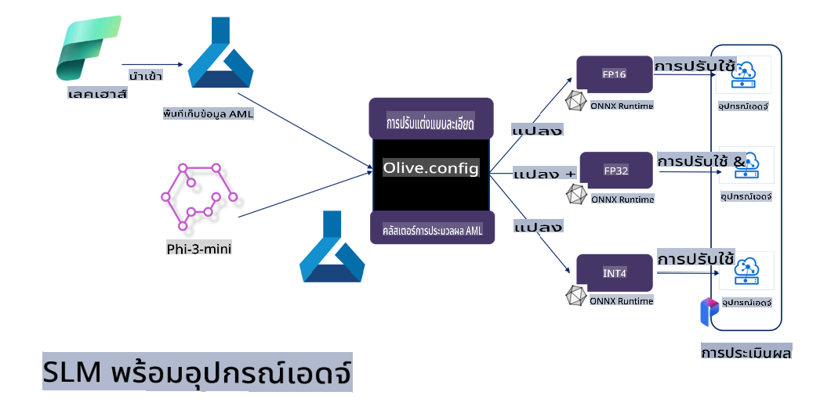

# **การปรับแต่ง Phi-3 ด้วย Microsoft Olive**

[Olive](https://github.com/microsoft/OLive?WT.mc_id=aiml-138114-kinfeylo) เป็นเครื่องมือปรับแต่งโมเดลที่ใช้งานง่าย โดยคำนึงถึงฮาร์ดแวร์ที่ใช้ ซึ่งรวบรวมเทคนิคชั้นนำในอุตสาหกรรมสำหรับการบีบอัดโมเดล การปรับแต่ง และการคอมไพล์

ถูกออกแบบมาเพื่อทำให้กระบวนการปรับแต่งโมเดลแมชชีนเลิร์นนิงง่ายขึ้น เพื่อให้มั่นใจว่าโมเดลใช้ประโยชน์จากสถาปัตยกรรมฮาร์ดแวร์ที่มีอยู่ได้อย่างมีประสิทธิภาพสูงสุด

ไม่ว่าคุณจะทำงานบนแอปพลิเคชันในระบบคลาวด์หรืออุปกรณ์เอดจ์ Olive ช่วยให้คุณปรับแต่งโมเดลของคุณได้อย่างง่ายดายและมีประสิทธิภาพ

## คุณสมบัติเด่น:
- Olive รวบรวมและทำงานอัตโนมัติด้วยเทคนิคการปรับแต่งที่เหมาะสมกับฮาร์ดแวร์เป้าหมาย
- ไม่มีเทคนิคการปรับแต่งใดที่เหมาะสมกับทุกสถานการณ์ Olive จึงเปิดโอกาสให้ผู้เชี่ยวชาญในอุตสาหกรรมสามารถเพิ่มนวัตกรรมการปรับแต่งของตนเองได้

## ลดความยุ่งยากทางวิศวกรรม:
- นักพัฒนามักต้องเรียนรู้และใช้งานเครื่องมือเฉพาะของผู้ผลิตฮาร์ดแวร์หลายตัวเพื่อเตรียมและปรับแต่งโมเดลที่ผ่านการฝึกฝนเพื่อการใช้งานจริง
- Olive ทำให้กระบวนการนี้ง่ายขึ้นด้วยการทำให้เทคนิคการปรับแต่งสำหรับฮาร์ดแวร์เป้าหมายเป็นไปโดยอัตโนมัติ

## โซลูชันการปรับแต่งแบบครบวงจรที่พร้อมใช้งาน:

ด้วยการรวมและปรับแต่งเทคนิคที่ผนวกรวม Olive นำเสนอทางออกแบบครบวงจรสำหรับการปรับแต่งตั้งแต่ต้นจนจบ โดยคำนึงถึงข้อจำกัด เช่น ความแม่นยำและความหน่วงเวลาในขณะปรับแต่งโมเดล

## การใช้ Microsoft Olive สำหรับการปรับแต่ง

Microsoft Olive เป็นเครื่องมือโอเพ่นซอร์สที่ใช้งานง่ายมากสำหรับการปรับแต่งโมเดล ซึ่งครอบคลุมทั้งการปรับแต่งและการอ้างอิงในด้านปัญญาประดิษฐ์เชิงสร้างสรรค์ เพียงตั้งค่าคอนฟิกง่าย ๆ และใช้ร่วมกับโมเดลภาษาเล็ก ๆ แบบโอเพ่นซอร์สและสภาพแวดล้อมการรันไทม์ที่เกี่ยวข้อง (AzureML / GPU ในเครื่อง, CPU, DirectML) คุณก็สามารถทำการปรับแต่งหรืออ้างอิงโมเดลผ่านการปรับแต่งอัตโนมัติ และค้นหาโมเดลที่เหมาะสมที่สุดเพื่อปรับใช้ในระบบคลาวด์หรืออุปกรณ์เอดจ์ได้ ช่วยให้องค์กรสามารถสร้างโมเดลเฉพาะด้านของตนเองในองค์กรหรือในระบบคลาวด์


## การปรับแต่ง Phi-3 ด้วย Microsoft Olive 



## ตัวอย่างโค้ดและการใช้งาน Phi-3 Olive
ในตัวอย่างนี้ คุณจะใช้ Olive เพื่อ:

- ปรับแต่ง LoRA adapter เพื่อจัดประเภทข้อความเป็น Sad, Joy, Fear, Surprise
- รวมค่าถ่วงน้ำหนักของ adapter เข้ากับโมเดลพื้นฐาน
- ปรับแต่งและแปลงโมเดลให้เป็น int4

[ตัวอย่างโค้ด](../../code/03.Finetuning/olive-ort-example/README.md)

### การติดตั้ง Microsoft Olive

การติดตั้ง Microsoft Olive ทำได้ง่ายมาก และสามารถติดตั้งสำหรับ CPU, GPU, DirectML และ Azure ML ได้

```bash
pip install olive-ai
```

หากคุณต้องการรันโมเดล ONNX ด้วย CPU คุณสามารถใช้

```bash
pip install olive-ai[cpu]
```

หากคุณต้องการรันโมเดล ONNX ด้วย GPU คุณสามารถใช้

```python
pip install olive-ai[gpu]
```

หากคุณต้องการใช้ Azure ML ให้ใช้

```python
pip install git+https://github.com/microsoft/Olive#egg=olive-ai[azureml]
```

**หมายเหตุ**
ข้อกำหนดของระบบปฏิบัติการ: Ubuntu 20.04 / 22.04 

### **Config.json ของ Microsoft Olive**

หลังการติดตั้ง คุณสามารถกำหนดค่าการตั้งค่าเฉพาะโมเดลต่าง ๆ ได้ผ่านไฟล์ Config รวมถึงข้อมูล การประมวลผล การฝึกฝน การปรับใช้ และการสร้างโมเดล

**1. ข้อมูล**

บน Microsoft Olive รองรับการฝึกฝนบนข้อมูลในเครื่องและข้อมูลในระบบคลาวด์ และสามารถกำหนดค่าได้ในส่วนการตั้งค่า

*การตั้งค่าข้อมูลในเครื่อง*

คุณสามารถตั้งค่าชุดข้อมูลที่ต้องการฝึกฝนสำหรับการปรับแต่งได้ง่าย ๆ โดยปกติจะอยู่ในรูปแบบ json และปรับให้เข้ากับแม่แบบข้อมูล ซึ่งต้องปรับตามข้อกำหนดของโมเดล (เช่น ปรับให้เข้ากับรูปแบบที่ Microsoft Phi-3-mini ต้องการ หากคุณมีโมเดลอื่น ๆ โปรดอ้างอิงรูปแบบการปรับแต่งที่โมเดลอื่น ๆ ต้องการ)

```json

    "data_configs": [
        {
            "name": "dataset_default_train",
            "type": "HuggingfaceContainer",
            "load_dataset_config": {
                "params": {
                    "data_name": "json", 
                    "data_files":"dataset/dataset-classification.json",
                    "split": "train"
                }
            },
            "pre_process_data_config": {
                "params": {
                    "dataset_type": "corpus",
                    "text_cols": [
                            "phrase",
                            "tone"
                    ],
                    "text_template": "### Text: {phrase}\n### The tone is:\n{tone}",
                    "corpus_strategy": "join",
                    "source_max_len": 2048,
                    "pad_to_max_len": false,
                    "use_attention_mask": false
                }
            }
        }
    ],
```

**การตั้งค่าข้อมูลจากระบบคลาวด์**

โดยการเชื่อมโยง datastore ของ Azure AI Studio/Azure Machine Learning Service เพื่อเชื่อมโยงข้อมูลในระบบคลาวด์ คุณสามารถเลือกแหล่งข้อมูลต่าง ๆ ผ่าน Microsoft Fabric และ Azure Data เพื่อสนับสนุนการปรับแต่งข้อมูลได้

```json

    "data_configs": [
        {
            "name": "dataset_default_train",
            "type": "HuggingfaceContainer",
            "load_dataset_config": {
                "params": {
                    "data_name": "json", 
                    "data_files": {
                        "type": "azureml_datastore",
                        "config": {
                            "azureml_client": {
                                "subscription_id": "Your Azure Subscrition ID",
                                "resource_group": "Your Azure Resource Group",
                                "workspace_name": "Your Azure ML Workspaces name"
                            },
                            "datastore_name": "workspaceblobstore",
                            "relative_path": "Your train_data.json Azure ML Location"
                        }
                    },
                    "split": "train"
                }
            },
            "pre_process_data_config": {
                "params": {
                    "dataset_type": "corpus",
                    "text_cols": [
                            "Question",
                            "Best Answer"
                    ],
                    "text_template": "<|user|>\n{Question}<|end|>\n<|assistant|>\n{Best Answer}\n<|end|>",
                    "corpus_strategy": "join",
                    "source_max_len": 2048,
                    "pad_to_max_len": false,
                    "use_attention_mask": false
                }
            }
        }
    ],
    
```

**2. การตั้งค่าการประมวลผล**

หากคุณต้องการใช้งานในเครื่อง คุณสามารถใช้ทรัพยากรข้อมูลในเครื่องได้โดยตรง หากต้องการใช้ทรัพยากรของ Azure AI Studio / Azure Machine Learning Service คุณต้องกำหนดพารามิเตอร์ Azure ที่เกี่ยวข้อง ชื่อทรัพยากรประมวลผล ฯลฯ

```json

    "systems": {
        "aml": {
            "type": "AzureML",
            "config": {
                "accelerators": ["gpu"],
                "hf_token": true,
                "aml_compute": "Your Azure AI Studio / Azure Machine Learning Service Compute Name",
                "aml_docker_config": {
                    "base_image": "Your Azure AI Studio / Azure Machine Learning Service docker",
                    "conda_file_path": "conda.yaml"
                }
            }
        },
        "azure_arc": {
            "type": "AzureML",
            "config": {
                "accelerators": ["gpu"],
                "aml_compute": "Your Azure AI Studio / Azure Machine Learning Service Compute Name",
                "aml_docker_config": {
                    "base_image": "Your Azure AI Studio / Azure Machine Learning Service docker",
                    "conda_file_path": "conda.yaml"
                }
            }
        }
    },
```

***หมายเหตุ***

เนื่องจากการรันจะดำเนินการผ่านคอนเทนเนอร์บน Azure AI Studio/Azure Machine Learning Service จึงจำเป็นต้องกำหนดค่าคอนฟิกสภาพแวดล้อมที่ต้องการ ซึ่งจะกำหนดค่าในไฟล์ conda.yaml

```yaml

name: project_environment
channels:
  - defaults
dependencies:
  - python=3.8.13
  - pip=22.3.1
  - pip:
      - einops
      - accelerate
      - azure-keyvault-secrets
      - azure-identity
      - bitsandbytes
      - datasets
      - huggingface_hub
      - peft
      - scipy
      - sentencepiece
      - torch>=2.2.0
      - transformers
      - git+https://github.com/microsoft/Olive@jiapli/mlflow_loading_fix#egg=olive-ai[gpu]
      - --extra-index-url https://aiinfra.pkgs.visualstudio.com/PublicPackages/_packaging/ORT-Nightly/pypi/simple/ 
      - ort-nightly-gpu==1.18.0.dev20240307004
      - --extra-index-url https://aiinfra.pkgs.visualstudio.com/PublicPackages/_packaging/onnxruntime-genai/pypi/simple/
      - onnxruntime-genai-cuda

    

```

**3. เลือก SLM ของคุณ**

คุณสามารถใช้โมเดลจาก Hugging Face ได้โดยตรง หรือรวมเข้ากับ Model Catalog ของ Azure AI Studio / Azure Machine Learning เพื่อเลือกโมเดลที่ต้องการใช้งาน ในตัวอย่างโค้ดด้านล่าง เราจะใช้ Microsoft Phi-3-mini เป็นตัวอย่าง

หากคุณมีโมเดลในเครื่อง คุณสามารถใช้วิธีนี้

```json

    "input_model":{
        "type": "PyTorchModel",
        "config": {
            "hf_config": {
                "model_name": "model-cache/microsoft/phi-3-mini",
                "task": "text-generation",
                "model_loading_args": {
                    "trust_remote_code": true
                }
            }
        }
    },
```

หากคุณต้องการใช้โมเดลจาก Azure AI Studio / Azure Machine Learning Service คุณสามารถใช้วิธีนี้

```json

    "input_model":{
        "type": "PyTorchModel",
        "config": {
            "model_path": {
                "type": "azureml_registry_model",
                "config": {
                    "name": "microsoft/Phi-3-mini-4k-instruct",
                    "registry_name": "azureml-msr",
                    "version": "11"
                }
            },
             "model_file_format": "PyTorch.MLflow",
             "hf_config": {
                "model_name": "microsoft/Phi-3-mini-4k-instruct",
                "task": "text-generation",
                "from_pretrained_args": {
                    "trust_remote_code": true
                }
            }
        }
    },
```

**หมายเหตุ:**
เราจำเป็นต้องรวมกับ Azure AI Studio / Azure Machine Learning Service ดังนั้นเมื่อกำหนดค่าโมเดล โปรดอ้างอิงหมายเลขเวอร์ชันและการตั้งชื่อที่เกี่ยวข้อง

โมเดลทั้งหมดบน Azure ต้องตั้งค่าเป็น PyTorch.MLflow

คุณต้องมีบัญชี Hugging Face และเชื่อมโยงคีย์กับ Key Value ของ Azure AI Studio / Azure Machine Learning

**4. อัลกอริทึม**

Microsoft Olive ได้รวมอัลกอริทึม Lora และ QLora สำหรับการปรับแต่งไว้อย่างดี สิ่งที่คุณต้องทำคือกำหนดค่าพารามิเตอร์ที่เกี่ยวข้องบางอย่าง ที่นี่เราจะยกตัวอย่าง QLora

```json
        "lora": {
            "type": "LoRA",
            "config": {
                "target_modules": [
                    "o_proj",
                    "qkv_proj"
                ],
                "double_quant": true,
                "lora_r": 64,
                "lora_alpha": 64,
                "lora_dropout": 0.1,
                "train_data_config": "dataset_default_train",
                "eval_dataset_size": 0.3,
                "training_args": {
                    "seed": 0,
                    "data_seed": 42,
                    "per_device_train_batch_size": 1,
                    "per_device_eval_batch_size": 1,
                    "gradient_accumulation_steps": 4,
                    "gradient_checkpointing": false,
                    "learning_rate": 0.0001,
                    "num_train_epochs": 3,
                    "max_steps": 10,
                    "logging_steps": 10,
                    "evaluation_strategy": "steps",
                    "eval_steps": 187,
                    "group_by_length": true,
                    "adam_beta2": 0.999,
                    "max_grad_norm": 0.3
                }
            }
        },
```

หากคุณต้องการแปลงควอนไทเซชัน สาขาหลักของ Microsoft Olive รองรับวิธี onnxruntime-genai แล้ว คุณสามารถตั้งค่าตามความต้องการของคุณได้:

1. รวมค่าถ่วงน้ำหนักของ adapter เข้ากับโมเดลพื้นฐาน
2. แปลงโมเดลให้เป็นโมเดล onnx ด้วยความละเอียดที่ต้องการโดยใช้ ModelBuilder

เช่น การแปลงเป็น quantized INT4

```json

        "merge_adapter_weights": {
            "type": "MergeAdapterWeights"
        },
        "builder": {
            "type": "ModelBuilder",
            "config": {
                "precision": "int4"
            }
        }
```

**หมายเหตุ** 
- หากคุณใช้ QLoRA การแปลงควอนไทเซชันด้วย ONNXRuntime-genai ยังไม่รองรับในขณะนี้

- ควรชี้แจงว่า คุณสามารถตั้งค่าขั้นตอนข้างต้นตามความต้องการของคุณเอง ไม่จำเป็นต้องกำหนดค่าทั้งหมดตามขั้นตอนที่กล่าวมาข้างต้น คุณสามารถเลือกใช้เฉพาะขั้นตอนที่ต้องการของอัลกอริทึมโดยไม่ต้องปรับแต่งได้ สุดท้ายคุณต้องกำหนดค่าเอนจินที่เกี่ยวข้อง

```json

    "engine": {
        "log_severity_level": 0,
        "host": "aml",
        "target": "aml",
        "search_strategy": false,
        "execution_providers": ["CUDAExecutionProvider"],
        "cache_dir": "../model-cache/models/phi3-finetuned/cache",
        "output_dir" : "../model-cache/models/phi3-finetuned"
    }
```

**5. เสร็จสิ้นการปรับแต่ง**

ในบรรทัดคำสั่ง ให้ดำเนินการในไดเรกทอรีที่มีไฟล์ olive-config.json

```bash
olive run --config olive-config.json  
```

**ข้อจำกัดความรับผิดชอบ**:  
เอกสารนี้ได้รับการแปลโดยใช้บริการแปลภาษาด้วย AI อัตโนมัติ แม้ว่าเราจะพยายามอย่างเต็มที่เพื่อความถูกต้อง แต่โปรดทราบว่าการแปลอัตโนมัติอาจมีข้อผิดพลาดหรือความไม่ถูกต้อง เอกสารต้นฉบับในภาษาต้นฉบับควรถูกพิจารณาเป็นแหล่งข้อมูลที่น่าเชื่อถือที่สุด สำหรับข้อมูลที่มีความสำคัญ แนะนำให้ใช้บริการแปลภาษามนุษย์โดยผู้เชี่ยวชาญ เราจะไม่รับผิดชอบต่อความเข้าใจผิดหรือการตีความผิดพลาดที่เกิดจากการใช้การแปลนี้