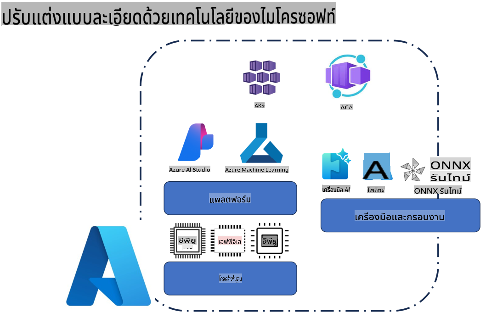
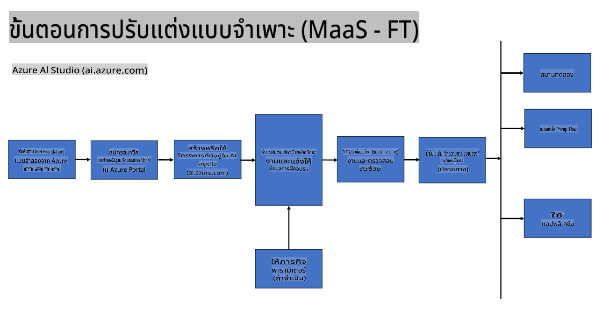
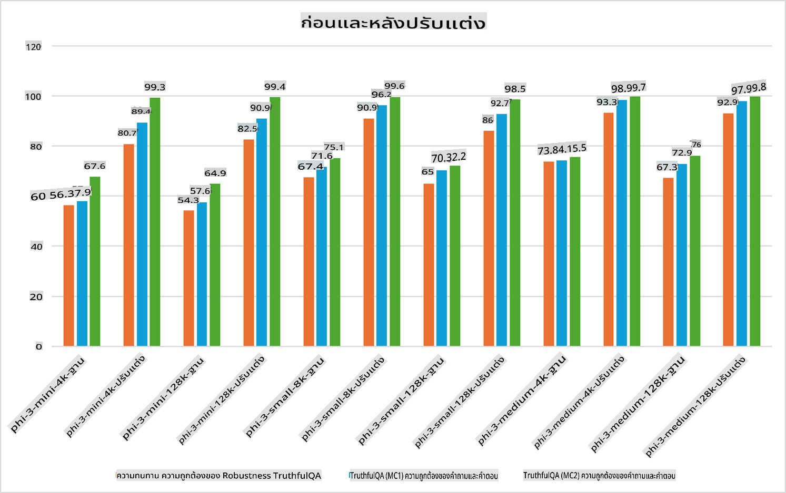

## สถานการณ์การปรับแต่ง (Fine Tuning)

**แพลตฟอร์ม** รวมถึงเทคโนโลยีต่าง ๆ เช่น Azure AI Foundry, Azure Machine Learning, AI Tools, Kaito, และ ONNX Runtime 

**โครงสร้างพื้นฐาน** รวมถึง CPU และ FPGA ซึ่งเป็นส่วนสำคัญของกระบวนการปรับแต่ง เดี๋ยวเราจะแสดงไอคอนของเทคโนโลยีเหล่านี้ให้ดู

**เครื่องมือและเฟรมเวิร์ก** รวมถึง ONNX Runtime และ ONNX Runtime เดี๋ยวเราจะแสดงไอคอนของเทคโนโลยีเหล่านี้ให้ดู  
[แทรกไอคอนสำหรับ ONNX Runtime และ ONNX Runtime]

กระบวนการปรับแต่งโดยใช้เทคโนโลยีของ Microsoft ประกอบไปด้วยส่วนประกอบและเครื่องมือต่าง ๆ การเข้าใจและใช้งานเทคโนโลยีเหล่านี้อย่างเหมาะสมจะช่วยให้เราปรับแต่งแอปพลิเคชันได้อย่างมีประสิทธิภาพและสร้างโซลูชันที่ดียิ่งขึ้น

## โมเดลในรูปแบบบริการ (Model as Service)

ปรับแต่งโมเดลโดยใช้การปรับแต่งแบบโฮสต์ โดยไม่ต้องสร้างและจัดการทรัพยากรคอมพิวต์

การปรับแต่งแบบไร้เซิร์ฟเวอร์ (Serverless) พร้อมใช้งานสำหรับโมเดล Phi-3-mini และ Phi-3-medium ช่วยให้นักพัฒนาสามารถปรับแต่งโมเดลสำหรับการใช้งานบนคลาวด์และเอดจ์ได้อย่างรวดเร็วและง่ายดายโดยไม่ต้องจัดการทรัพยากรคอมพิวต์ นอกจากนี้ เรายังประกาศว่า Phi-3-small พร้อมให้บริการผ่านข้อเสนอ Models-as-a-Service แล้ว เพื่อให้นักพัฒนาสามารถเริ่มต้นพัฒนา AI ได้อย่างรวดเร็วโดยไม่ต้องจัดการโครงสร้างพื้นฐานเบื้องหลัง

## โมเดลในรูปแบบแพลตฟอร์ม (Model as a Platform)

ผู้ใช้งานจัดการทรัพยากรคอมพิวต์ด้วยตัวเองเพื่อปรับแต่งโมเดล

[ตัวอย่างการปรับแต่ง](https://github.com/Azure/azureml-examples/blob/main/sdk/python/foundation-models/system/finetune/chat-completion/chat-completion.ipynb)

## สถานการณ์การปรับแต่ง 

| | | | | | | |
|-|-|-|-|-|-|-|
|สถานการณ์|LoRA|QLoRA|PEFT|DeepSpeed|ZeRO|DORA|
|การปรับแต่ง LLMs ที่ผ่านการฝึกมาแล้วให้เหมาะสมกับงานหรือโดเมนเฉพาะ|Yes|Yes|Yes|Yes|Yes|Yes|
|การปรับแต่งสำหรับงาน NLP เช่น การจัดประเภทข้อความ การระบุเอนทิตีที่มีชื่อ และการแปลภาษา|Yes|Yes|Yes|Yes|Yes|Yes|
|การปรับแต่งสำหรับงาน QA|Yes|Yes|Yes|Yes|Yes|Yes|
|การปรับแต่งสำหรับการสร้างคำตอบที่เหมือนมนุษย์ในแชทบอท|Yes|Yes|Yes|Yes|Yes|Yes|
|การปรับแต่งสำหรับการสร้างดนตรี ศิลปะ หรือรูปแบบความคิดสร้างสรรค์อื่น ๆ|Yes|Yes|Yes|Yes|Yes|Yes|
|การลดต้นทุนทางคอมพิวเตอร์และการเงิน|Yes|Yes|No|Yes|Yes|No|
|การลดการใช้หน่วยความจำ|No|Yes|No|Yes|Yes|Yes|
|การใช้พารามิเตอร์น้อยลงเพื่อการปรับแต่งที่มีประสิทธิภาพ|No|Yes|Yes|No|No|Yes|
|รูปแบบการประมวลผลข้อมูลแบบขนานที่ใช้หน่วยความจำ GPU รวมของอุปกรณ์ GPU ทั้งหมดที่มีอยู่|No|No|No|Yes|Yes|Yes|

## ตัวอย่างประสิทธิภาพการปรับแต่ง

**ข้อจำกัดความรับผิดชอบ**:  
เอกสารนี้ได้รับการแปลโดยใช้บริการแปลภาษาที่ใช้ AI อัตโนมัติ แม้ว่าเราจะพยายามให้การแปลมีความถูกต้องมากที่สุด แต่โปรดทราบว่าการแปลอัตโนมัติอาจมีข้อผิดพลาดหรือความไม่ถูกต้อง เอกสารต้นฉบับในภาษาต้นฉบับควรถือเป็นแหล่งข้อมูลที่เชื่อถือได้ สำหรับข้อมูลที่มีความสำคัญ แนะนำให้ใช้บริการแปลภาษาจากผู้เชี่ยวชาญ เราจะไม่รับผิดชอบต่อความเข้าใจผิดหรือการตีความที่คลาดเคลื่อนซึ่งเกิดจากการใช้การแปลนี้