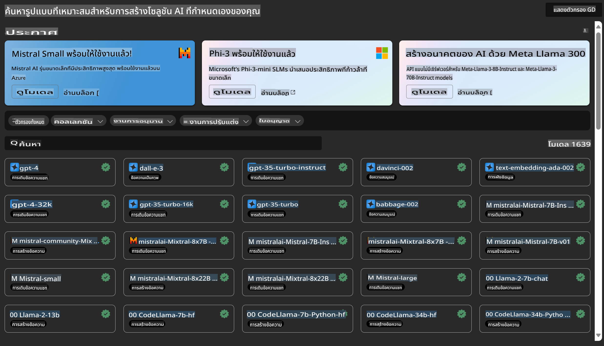

# **แนะนำบริการ Azure Machine Learning**

[Azure Machine Learning](https://ml.azure.com?WT.mc_id=aiml-138114-kinfeylo) เป็นบริการคลาวด์ที่ช่วยเร่งและจัดการวงจรชีวิตของโครงการ Machine Learning (ML)

ผู้เชี่ยวชาญด้าน ML, นักวิทยาศาสตร์ข้อมูล และวิศวกรสามารถใช้งานในกระบวนการทำงานประจำวันเพื่อ:

- ฝึกอบรมและปรับใช้โมเดล  
- จัดการการดำเนินงานด้าน Machine Learning (MLOps)  
- คุณสามารถสร้างโมเดลใน Azure Machine Learning หรือใช้โมเดลที่สร้างจากแพลตฟอร์มโอเพ่นซอร์ส เช่น PyTorch, TensorFlow หรือ scikit-learn  
- เครื่องมือ MLOps ช่วยให้คุณสามารถตรวจสอบ ฝึกอบรมซ้ำ และปรับใช้โมเดลใหม่  

## Azure Machine Learning เหมาะกับใคร?

**นักวิทยาศาสตร์ข้อมูลและวิศวกร ML**

พวกเขาสามารถใช้เครื่องมือเพื่อเร่งและทำให้กระบวนการทำงานในแต่ละวันเป็นอัตโนมัติ  
Azure ML มีฟีเจอร์สำหรับความเป็นธรรม ความสามารถในการอธิบาย การติดตาม และการตรวจสอบย้อนกลับ  

**นักพัฒนาแอปพลิเคชัน**

พวกเขาสามารถผสานรวมโมเดลเข้ากับแอปพลิเคชันหรือบริการได้อย่างไร้รอยต่อ  

**นักพัฒนาแพลตฟอร์ม**

พวกเขาสามารถเข้าถึงชุดเครื่องมือที่มีความแข็งแกร่งซึ่งสนับสนุนโดย Azure Resource Manager APIs  
เครื่องมือเหล่านี้ช่วยสร้างเครื่องมือ ML ขั้นสูงได้  

**องค์กร**

การทำงานในคลาวด์ Microsoft Azure ช่วยให้องค์กรได้รับประโยชน์จากความปลอดภัยที่คุ้นเคยและการควบคุมการเข้าถึงตามบทบาท  
สามารถตั้งค่าโครงการเพื่อควบคุมการเข้าถึงข้อมูลที่ได้รับการป้องกันและการดำเนินการเฉพาะ  

## เพิ่มประสิทธิภาพให้ทุกคนในทีม  
โครงการ ML มักต้องการทีมที่มีทักษะหลากหลายเพื่อสร้างและดูแลรักษา  

Azure ML มีเครื่องมือที่ช่วยให้คุณสามารถ:  
- ทำงานร่วมกับทีมของคุณผ่านโน้ตบุ๊กที่แชร์ ทรัพยากรคอมพิวต์ การคำนวณแบบเซิร์ฟเวอร์เลส ข้อมูล และสภาพแวดล้อม  
- พัฒนาโมเดลที่มีความเป็นธรรม ความสามารถในการอธิบาย การติดตาม และการตรวจสอบย้อนกลับ เพื่อให้เป็นไปตามข้อกำหนดการตรวจสอบและการปฏิบัติตาม  
- ปรับใช้โมเดล ML อย่างรวดเร็วและง่ายดายในขนาดใหญ่ พร้อมจัดการและควบคุมได้อย่างมีประสิทธิภาพด้วย MLOps  
- รันงาน Machine Learning ได้ทุกที่ด้วยการกำกับดูแล ความปลอดภัย และการปฏิบัติตามข้อกำหนดในตัว  

## เครื่องมือข้ามแพลตฟอร์มที่เข้ากันได้  

ทุกคนในทีม ML สามารถใช้เครื่องมือที่ตนชื่นชอบเพื่อทำงานให้สำเร็จ  
ไม่ว่าคุณจะทำการทดลองอย่างรวดเร็ว การปรับแต่งพารามิเตอร์ การสร้าง Pipeline หรือการจัดการการอนุมาน คุณสามารถใช้อินเทอร์เฟซที่คุ้นเคย เช่น:  
- Azure Machine Learning Studio  
- Python SDK (v2)  
- Azure CLI (v2)  
- Azure Resource Manager REST APIs  

เมื่อคุณปรับแต่งโมเดลและทำงานร่วมกันในระหว่างวงจรการพัฒนา คุณสามารถแชร์และค้นหาทรัพยากร ตัวชี้วัด และสินทรัพย์ต่าง ๆ ภายใน UI ของ Azure Machine Learning Studio  

## **LLM/SLM ใน Azure ML**

Azure ML ได้เพิ่มฟังก์ชันที่เกี่ยวข้องกับ LLM/SLM จำนวนมาก โดยผสานรวม LLMOps และ SLMOps เพื่อสร้างแพลตฟอร์มเทคโนโลยีปัญญาประดิษฐ์แบบสร้างสรรค์สำหรับองค์กร  

### **Model Catalog**

ผู้ใช้ในองค์กรสามารถปรับใช้โมเดลที่แตกต่างกันตามสถานการณ์ทางธุรกิจต่าง ๆ ผ่าน Model Catalog และให้บริการในรูปแบบ Model as Service เพื่อให้นักพัฒนาหรือผู้ใช้ในองค์กรเข้าถึงได้  

Model Catalog ใน Azure Machine Learning Studio เป็นศูนย์กลางในการค้นหาและใช้งานโมเดลหลากหลายรูปแบบ ซึ่งช่วยให้คุณสามารถสร้างแอปพลิเคชัน Generative AI ได้  
Model Catalog มีโมเดลหลายร้อยรายการจากผู้ให้บริการโมเดล เช่น Azure OpenAI Service, Mistral, Meta, Cohere, Nvidia, Hugging Face รวมถึงโมเดลที่ได้รับการฝึกอบรมโดย Microsoft  
โมเดลจากผู้ให้บริการที่ไม่ใช่ Microsoft ถือเป็น Non-Microsoft Products ตามที่ระบุไว้ในข้อกำหนดผลิตภัณฑ์ของ Microsoft และอยู่ภายใต้ข้อกำหนดที่มาพร้อมกับโมเดล  

### **Job Pipeline**

แกนหลักของ Pipeline สำหรับ Machine Learning คือการแบ่งงาน Machine Learning แบบสมบูรณ์ออกเป็นเวิร์กโฟลว์หลายขั้นตอน  
แต่ละขั้นตอนเป็นองค์ประกอบที่สามารถพัฒนา ปรับแต่ง กำหนดค่า และทำให้อัตโนมัติได้แยกกัน  
ขั้นตอนต่าง ๆ จะเชื่อมต่อกันผ่านอินเทอร์เฟซที่กำหนดไว้อย่างชัดเจน  
บริการ Pipeline ของ Azure Machine Learning จะจัดการการประสานงานระหว่างขั้นตอนต่าง ๆ โดยอัตโนมัติ  

ในการปรับแต่ง SLM / LLM เราสามารถจัดการข้อมูล การฝึกอบรม และกระบวนการสร้างของเราได้ผ่าน Pipeline  

### **Prompt flow**

**ประโยชน์ของการใช้ Azure Machine Learning Prompt Flow**  
Azure Machine Learning Prompt Flow มีข้อดีหลายประการที่ช่วยให้ผู้ใช้เปลี่ยนจากการสร้างแนวคิดไปสู่การทดลอง และในที่สุดก็สร้างแอปพลิเคชัน LLM ที่พร้อมใช้งานในระดับการผลิต  

**ความคล่องตัวในการออกแบบ Prompt**

- ประสบการณ์การเขียนเชิงโต้ตอบ: Azure Machine Learning Prompt Flow มีการแสดงภาพโครงสร้างของ Flow ที่ช่วยให้ผู้ใช้เข้าใจและนำทางในโครงการได้ง่าย นอกจากนี้ยังมีประสบการณ์การเขียนโค้ดแบบ Notebook เพื่อพัฒนาและดีบัก Flow ได้อย่างมีประสิทธิภาพ  
- ตัวเลือกสำหรับการปรับแต่ง Prompt: ผู้ใช้สามารถสร้างและเปรียบเทียบตัวเลือก Prompt หลายรูปแบบเพื่อกระบวนการปรับแต่งที่เป็นไปได้อย่างรวดเร็ว  
- การประเมินผล: Flow การประเมินในตัวช่วยให้ผู้ใช้สามารถประเมินคุณภาพและประสิทธิภาพของ Prompt และ Flow ได้  
- ทรัพยากรที่ครอบคลุม: Azure Machine Learning Prompt Flow มาพร้อมกับคลังเครื่องมือ ตัวอย่าง และแม่แบบที่ช่วยเริ่มต้นการพัฒนา กระตุ้นความคิดสร้างสรรค์ และเร่งกระบวนการ  

**ความพร้อมใช้งานในระดับองค์กรสำหรับแอปพลิเคชัน LLM**

- การทำงานร่วมกัน: Azure Machine Learning Prompt Flow สนับสนุนการทำงานร่วมกันในทีม ช่วยให้ผู้ใช้หลายคนทำงานในโครงการออกแบบ Prompt แบ่งปันความรู้ และรักษาการควบคุมเวอร์ชัน  
- แพลตฟอร์มครบวงจร: Azure Machine Learning Prompt Flow ช่วยให้กระบวนการออกแบบ Prompt ทั้งหมดตั้งแต่การพัฒนา การประเมินผล จนถึงการปรับใช้และการตรวจสอบเป็นไปอย่างราบรื่น  
- การปรับใช้ Flow เป็น Azure Machine Learning Endpoint ทำได้อย่างง่ายดาย และสามารถตรวจสอบประสิทธิภาพแบบเรียลไทม์เพื่อให้มั่นใจว่าการดำเนินงานเป็นไปอย่างเหมาะสมและปรับปรุงอย่างต่อเนื่อง  

Azure Machine Learning Prompt Flow ใช้ประโยชน์จากโซลูชันที่พร้อมใช้งานในระดับองค์กรของ Azure Machine Learning โดยให้รากฐานที่ปลอดภัย ขยายขนาดได้ และเชื่อถือได้สำหรับการพัฒนา การทดลอง และการปรับใช้ Flow  

ด้วย Azure Machine Learning Prompt Flow ผู้ใช้สามารถเพิ่มความคล่องตัวในการออกแบบ Prompt ทำงานร่วมกันอย่างมีประสิทธิภาพ และใช้ประโยชน์จากโซลูชันระดับองค์กรเพื่อการพัฒนาและปรับใช้แอปพลิเคชัน LLM ได้สำเร็จ  

การรวมพลังการประมวลผล ข้อมูล และองค์ประกอบต่าง ๆ ของ Azure ML ช่วยให้นักพัฒนาในองค์กรสามารถสร้างแอปพลิเคชันปัญญาประดิษฐ์ของตนเองได้อย่างง่ายดาย  

**ข้อจำกัดความรับผิดชอบ**:  
เอกสารนี้ได้รับการแปลโดยใช้บริการแปลภาษาอัตโนมัติด้วย AI แม้ว่าเราจะพยายามอย่างเต็มที่เพื่อให้การแปลถูกต้อง แต่โปรดทราบว่าการแปลอัตโนมัติอาจมีข้อผิดพลาดหรือความไม่ถูกต้อง เอกสารต้นฉบับในภาษาต้นทางควรถือเป็นแหล่งข้อมูลที่เชื่อถือได้ สำหรับข้อมูลที่สำคัญ แนะนำให้ใช้บริการแปลภาษาจากผู้เชี่ยวชาญ เราจะไม่รับผิดชอบต่อความเข้าใจผิดหรือการตีความผิดที่เกิดจากการใช้การแปลนี้