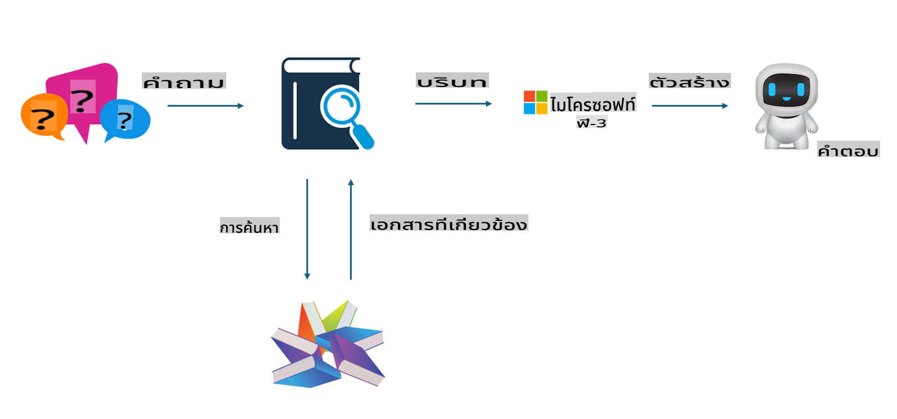
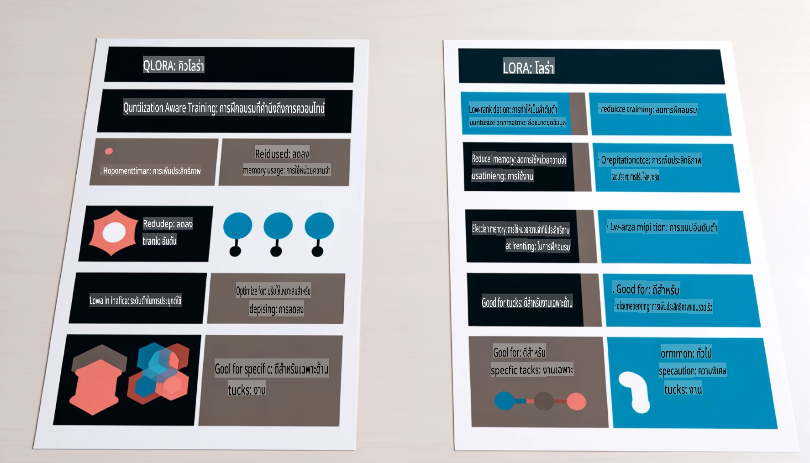

# **ให้ Phi-3 กลายเป็นผู้เชี่ยวชาญในอุตสาหกรรม**

เพื่อให้โมเดล Phi-3 สามารถนำไปใช้ในอุตสาหกรรมได้ คุณจำเป็นต้องเพิ่มข้อมูลธุรกิจเฉพาะของอุตสาหกรรมเข้าไปในโมเดล Phi-3 เรามีสองตัวเลือกที่แตกต่างกัน ได้แก่ RAG (Retrieval Augmented Generation) และ Fine-Tuning

## **RAG vs Fine-Tuning**

### **Retrieval Augmented Generation**

RAG คือการดึงข้อมูล + การสร้างข้อความ ข้อมูลที่มีโครงสร้างและไม่มีโครงสร้างขององค์กรจะถูกจัดเก็บไว้ในฐานข้อมูลเวกเตอร์ เมื่อค้นหาเนื้อหาที่เกี่ยวข้อง ระบบจะดึงสรุปและเนื้อหาที่เกี่ยวข้องมาเพื่อสร้างบริบท และรวมความสามารถในการเติมข้อความของ LLM/SLM เพื่อสร้างเนื้อหา

### **Fine-tuning**

Fine-tuning เป็นการปรับปรุงโมเดลที่มีอยู่เดิม โดยไม่จำเป็นต้องเริ่มจากอัลกอริทึมของโมเดล แต่จำเป็นต้องสะสมข้อมูลอย่างต่อเนื่อง หากคุณต้องการคำศัพท์เฉพาะและการแสดงภาษาที่แม่นยำในแอปพลิเคชันอุตสาหกรรม Fine-tuning จะเป็นตัวเลือกที่ดีกว่า แต่ถ้าข้อมูลของคุณเปลี่ยนแปลงบ่อย Fine-tuning อาจมีความซับซ้อน

### **วิธีเลือก**

1. หากคำตอบของเราจำเป็นต้องดึงข้อมูลภายนอกมาใช้ RAG คือตัวเลือกที่ดีที่สุด

2. หากคุณต้องการเนื้อหาที่เสถียรและแม่นยำในความรู้เฉพาะอุตสาหกรรม Fine-tuning จะเป็นตัวเลือกที่ดี RAG จะเน้นดึงเนื้อหาที่เกี่ยวข้องแต่บางครั้งอาจไม่ละเอียดในแง่เฉพาะทาง

3. Fine-tuning ต้องการชุดข้อมูลคุณภาพสูง และหากเป็นข้อมูลในขอบเขตเล็ก ๆ ก็อาจไม่เห็นความแตกต่างมากนัก RAG มีความยืดหยุ่นมากกว่า

4. Fine-tuning เป็นกล่องดำที่ซับซ้อนและเข้าใจกลไกภายในได้ยาก แต่ RAG ช่วยให้ค้นหาแหล่งข้อมูลได้ง่ายขึ้น ซึ่งช่วยลดข้อผิดพลาดและสร้างความโปร่งใสได้ดีกว่า

### **สถานการณ์ที่ควรใช้**

1. อุตสาหกรรมเฉพาะที่ต้องการคำศัพท์และการแสดงผลแบบมืออาชีพ ***Fine-tuning*** จะเป็นตัวเลือกที่ดีที่สุด

2. ระบบคำถาม-คำตอบ (QA) ที่เกี่ยวข้องกับการรวมความรู้จากหลายแหล่ง ***RAG*** จะเป็นตัวเลือกที่ดีที่สุด

3. การผสานรวมกระบวนการธุรกิจอัตโนมัติ ***RAG + Fine-tuning*** จะเป็นตัวเลือกที่ดีที่สุด

## **วิธีใช้ RAG**

ฐานข้อมูลเวกเตอร์คือการจัดเก็บข้อมูลในรูปแบบทางคณิตศาสตร์ ฐานข้อมูลเวกเตอร์ช่วยให้โมเดล Machine Learning สามารถจดจำข้อมูลที่เคยป้อนมาก่อน ทำให้สามารถนำ Machine Learning ไปใช้ในกรณีต่าง ๆ เช่น การค้นหา การแนะนำ และการสร้างข้อความ ข้อมูลสามารถถูกระบุโดยใช้ตัวชี้วัดความคล้ายคลึงกันแทนที่จะเป็นการจับคู่แบบตรงตัว ซึ่งช่วยให้โมเดลคอมพิวเตอร์เข้าใจบริบทของข้อมูลได้

ฐานข้อมูลเวกเตอร์เป็นกุญแจสำคัญในการทำให้ RAG ทำงานได้ เราสามารถแปลงข้อมูลให้เป็นการจัดเก็บในรูปแบบเวกเตอร์ผ่านโมเดลเวกเตอร์ เช่น text-embedding-3, jina-ai-embedding เป็นต้น

เรียนรู้เพิ่มเติมเกี่ยวกับการสร้างแอปพลิเคชัน RAG [https://github.com/microsoft/Phi-3CookBook](https://github.com/microsoft/Phi-3CookBook?WT.mc_id=aiml-138114-kinfeylo)

## **วิธีใช้ Fine-tuning**

อัลกอริทึมที่ใช้บ่อยใน Fine-tuning คือ Lora และ QLora แล้วควรเลือกใช้อย่างไร?
- [เรียนรู้เพิ่มเติมผ่านตัวอย่างโน้ตบุ๊กนี้](../../../../code/04.Finetuning/Phi_3_Inference_Finetuning.ipynb)
- [ตัวอย่างสคริปต์ Python สำหรับ Fine-tuning](../../../../code/04.Finetuning/FineTrainingScript.py)

### **Lora และ QLora**

LoRA (Low-Rank Adaptation) และ QLoRA (Quantized Low-Rank Adaptation) เป็นเทคนิคที่ใช้ปรับแต่งโมเดลภาษาใหญ่ (LLMs) โดยใช้ Parameter Efficient Fine Tuning (PEFT) เทคนิค PEFT ถูกออกแบบมาเพื่อฝึกโมเดลอย่างมีประสิทธิภาพมากกว่าวิธีดั้งเดิม 
LoRA เป็นเทคนิค Fine-tuning แบบ Standalone ที่ลดการใช้หน่วยความจำโดยการใช้การประมาณค่าเมทริกซ์น้ำหนักแบบ Low-Rank ช่วยให้ฝึกโมเดลได้รวดเร็วและยังคงประสิทธิภาพใกล้เคียงกับวิธี Fine-tuning แบบดั้งเดิม 

QLoRA เป็นเวอร์ชันขยายของ LoRA ที่รวมเทคนิคการทำ Quantization เพื่อลดการใช้หน่วยความจำลงอีก QLoRA จะปรับความแม่นยำของพารามิเตอร์น้ำหนักใน LLM ที่ถูกฝึกมาให้เป็นความแม่นยำ 4 บิต ซึ่งประหยัดหน่วยความจำได้มากกว่า LoRA อย่างไรก็ตาม การฝึกด้วย QLoRA จะช้ากว่า LoRA ประมาณ 30% เนื่องจากขั้นตอนการ Quantization และ Dequantization ที่เพิ่มเข้ามา

QLoRA ใช้ LoRA เป็นตัวเสริมเพื่อแก้ไขข้อผิดพลาดที่เกิดจากการทำ Quantization QLoRA ทำให้สามารถ Fine-tune โมเดลขนาดใหญ่ที่มีพารามิเตอร์นับพันล้านได้โดยใช้ GPU ขนาดเล็กที่มีอยู่ทั่วไป ตัวอย่างเช่น QLoRA สามารถ Fine-tune โมเดลที่มีพารามิเตอร์ 70B ซึ่งปกติจะต้องใช้ GPU 36 ตัว ได้โดยใช้เพียง 2 ตัว

**ข้อจำกัดความรับผิดชอบ**:  
เอกสารนี้ได้รับการแปลโดยใช้บริการแปลภาษาอัตโนมัติด้วย AI แม้ว่าเราจะพยายามให้การแปลมีความถูกต้อง แต่โปรดทราบว่าการแปลอัตโนมัติอาจมีข้อผิดพลาดหรือความไม่ถูกต้องเกิดขึ้น เอกสารต้นฉบับในภาษาดั้งเดิมควรถือเป็นแหล่งข้อมูลที่เชื่อถือได้ สำหรับข้อมูลที่มีความสำคัญ ขอแนะนำให้ใช้บริการแปลภาษาจากผู้เชี่ยวชาญ เราไม่รับผิดชอบต่อความเข้าใจผิดหรือการตีความที่ผิดพลาดใด ๆ ที่เกิดจากการใช้การแปลนี้