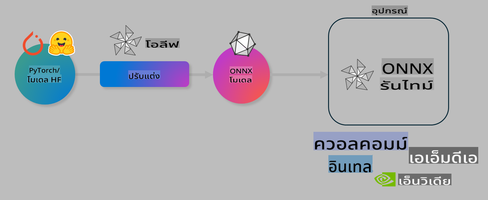

# Lab. ปรับแต่ง AI Models ให้เหมาะสมสำหรับการใช้งานในอุปกรณ์

## บทนำ

> [!IMPORTANT]  
> Lab นี้ต้องการ **Nvidia A10 หรือ A100 GPU** พร้อมไดรเวอร์และ CUDA toolkit (เวอร์ชัน 12 ขึ้นไป) ที่ติดตั้งไว้แล้ว

> [!NOTE]  
> นี่คือ Lab ความยาว **35 นาที** ที่จะช่วยให้คุณได้เรียนรู้พื้นฐานการปรับแต่งโมเดลสำหรับการใช้งานในอุปกรณ์ด้วย OLIVE

## วัตถุประสงค์การเรียนรู้

เมื่อจบ Lab นี้ คุณจะสามารถใช้ OLIVE เพื่อ:

- ทำการ Quantize โมเดล AI ด้วยวิธี AWQ quantization
- ปรับแต่งโมเดล AI ให้เหมาะกับงานเฉพาะทาง
- สร้าง LoRA adapters (โมเดลที่ผ่านการปรับแต่ง) เพื่อการใช้งานในอุปกรณ์อย่างมีประสิทธิภาพบน ONNX Runtime

### Olive คืออะไร

Olive (*O*NNX *live*) เป็นเครื่องมือปรับแต่งโมเดลที่มาพร้อม CLI เพื่อช่วยให้คุณสามารถจัดการโมเดลสำหรับ ONNX runtime +++https://onnxruntime.ai+++ ได้อย่างมีคุณภาพและประสิทธิภาพ



อินพุตของ Olive มักจะเป็นโมเดล PyTorch หรือ Hugging Face และผลลัพธ์คือโมเดล ONNX ที่ปรับแต่งแล้วสำหรับการรันบนอุปกรณ์ (เป้าหมายการใช้งาน) ที่ใช้ ONNX runtime โดย Olive จะปรับแต่งโมเดลให้เหมาะสมกับ AI accelerator (NPU, GPU, CPU) ของเป้าหมายการใช้งานที่จัดเตรียมโดยผู้ผลิตฮาร์ดแวร์ เช่น Qualcomm, AMD, Nvidia หรือ Intel

Olive ทำงานโดยใช้ *workflow* ซึ่งเป็นลำดับของงานปรับแต่งโมเดลแบบแยกส่วนที่เรียกว่า *passes* ตัวอย่างของ passes ได้แก่ การบีบอัดโมเดล, การจับภาพกราฟ, การทำ quantization และการปรับแต่งกราฟ แต่ละ pass จะมีชุดพารามิเตอร์ที่สามารถปรับแต่งเพื่อให้ได้ค่าประสิทธิภาพ เช่น ความแม่นยำและความหน่วงที่ดีที่สุด โดย Olive ใช้กลยุทธ์การค้นหาเพื่อปรับแต่งแต่ละ pass ทีละตัวหรือหลายตัวพร้อมกันโดยอัตโนมัติ

#### ข้อดีของ Olive

- **ลดความยุ่งยากและเวลา** จากการทดลองด้วยตัวเองในวิธีต่าง ๆ สำหรับการปรับแต่งกราฟ การบีบอัด และการทำ quantization เพียงกำหนดข้อจำกัดด้านคุณภาพและประสิทธิภาพ แล้ว Olive จะค้นหาโมเดลที่ดีที่สุดให้คุณโดยอัตโนมัติ
- **มีส่วนประกอบปรับแต่งโมเดลในตัวมากกว่า 40+** ครอบคลุมเทคนิคใหม่ ๆ ในการทำ quantization, การบีบอัด, การปรับแต่งกราฟ และการปรับแต่งโมเดล
- **CLI ใช้งานง่าย** สำหรับงานปรับแต่งโมเดลทั่วไป เช่น olive quantize, olive auto-opt, olive finetune
- มีการบรรจุและปรับใช้โมเดลในตัว
- รองรับการสร้างโมเดลสำหรับ **Multi LoRA serving**
- สร้าง workflows ด้วย YAML/JSON เพื่อจัดการงานปรับแต่งและการปรับใช้โมเดล
- การผสานรวมกับ **Hugging Face** และ **Azure AI**
- กลไก **caching** ในตัวเพื่อลด **ค่าใช้จ่าย**

## คำแนะนำใน Lab
> [!NOTE]  
> โปรดตรวจสอบให้แน่ใจว่าคุณได้จัดเตรียม Azure AI Hub และ Project พร้อมตั้งค่า A100 compute ตามที่ระบุใน Lab 1

### ขั้นตอนที่ 0: เชื่อมต่อกับ Azure AI Compute

คุณจะเชื่อมต่อกับ Azure AI compute โดยใช้ฟีเจอร์ remote ใน **VS Code**

1. เปิดแอปพลิเคชัน **VS Code** บนเดสก์ท็อปของคุณ:
2. เปิด **command palette** โดยใช้ **Shift+Ctrl+P**
3. ใน command palette ค้นหา **AzureML - remote: Connect to compute instance in New Window**
4. ทำตามคำแนะนำบนหน้าจอเพื่อเชื่อมต่อกับ Compute ซึ่งจะเกี่ยวข้องกับการเลือก Azure Subscription, Resource Group, Project และ Compute name ที่คุณตั้งค่าไว้ใน Lab 1
5. เมื่อเชื่อมต่อกับ Azure ML Compute node แล้ว จะมีการแสดงผลใน **มุมล่างซ้ายของ Visual Code** `><Azure ML: Compute Name`

### ขั้นตอนที่ 1: Clone repo นี้

ใน VS Code คุณสามารถเปิด terminal ใหม่ด้วย **Ctrl+J** และ clone repo นี้:

ใน terminal คุณจะเห็น prompt

```
azureuser@computername:~/cloudfiles/code$ 
```  
Clone โซลูชัน

```bash
cd ~/localfiles
git clone https://github.com/microsoft/phi-3cookbook.git
```

### ขั้นตอนที่ 2: เปิดโฟลเดอร์ใน VS Code

เพื่อเปิด VS Code ในโฟลเดอร์ที่เกี่ยวข้อง ให้รันคำสั่งต่อไปนี้ใน terminal ซึ่งจะเปิดหน้าต่างใหม่:

```bash
code phi-3cookbook/code/04.Finetuning/Olive-lab
```

หรือคุณสามารถเปิดโฟลเดอร์โดยเลือก **File** > **Open Folder**

### ขั้นตอนที่ 3: ติดตั้ง Dependencies

เปิดหน้าต่าง terminal ใน VS Code บน Azure AI Compute Instance ของคุณ (เคล็ดลับ: **Ctrl+J**) และรันคำสั่งต่อไปนี้เพื่อติดตั้ง dependencies:

```bash
conda create -n olive-ai python=3.11 -y
conda activate olive-ai
pip install -r requirements.txt
az extension remove -n azure-cli-ml
az extension add -n ml
```

> [!NOTE]  
> การติดตั้ง dependencies ทั้งหมดจะใช้เวลาประมาณ ~5 นาที

ใน Lab นี้ คุณจะดาวน์โหลดและอัปโหลดโมเดลไปยัง Azure AI Model catalog เพื่อให้เข้าถึง model catalog ได้ คุณต้องล็อกอินเข้าสู่ Azure โดยใช้คำสั่ง:

```bash
az login
```

> [!NOTE]  
> ในขณะล็อกอิน คุณจะถูกถามให้เลือก subscription ตรวจสอบให้แน่ใจว่าคุณเลือก subscription ที่กำหนดไว้สำหรับ Lab นี้

### ขั้นตอนที่ 4: รันคำสั่ง Olive

เปิดหน้าต่าง terminal ใน VS Code บน Azure AI Compute Instance ของคุณ (เคล็ดลับ: **Ctrl+J**) และตรวจสอบให้แน่ใจว่า `olive-ai` conda environment ถูกเปิดใช้งาน:

```bash
conda activate olive-ai
```

จากนั้นรันคำสั่ง Olive ต่อไปนี้ใน command line

1. **ตรวจสอบข้อมูล:** ในตัวอย่างนี้ คุณจะปรับแต่ง Phi-3.5-Mini model เพื่อให้เชี่ยวชาญในการตอบคำถามที่เกี่ยวข้องกับการเดินทาง โค้ดด้านล่างจะแสดงบันทึกข้อมูลบางส่วนในรูปแบบ JSON lines:

    ```bash
    head data/data_sample_travel.jsonl
    ```
2. **Quantize โมเดล:** ก่อนทำการเทรนโมเดล คุณต้องทำการ quantize ก่อนโดยใช้คำสั่งต่อไปนี้ ซึ่งใช้เทคนิคที่เรียกว่า Active Aware Quantization (AWQ) +++https://arxiv.org/abs/2306.00978+++ AWQ จะทำการ quantize น้ำหนักของโมเดลโดยพิจารณาจากค่า activations ที่เกิดขึ้นระหว่าง inference ซึ่งจะช่วยรักษาความแม่นยำของโมเดลได้ดีกว่าการ quantize แบบดั้งเดิม

    ```bash
    olive quantize \
       --model_name_or_path microsoft/Phi-3.5-mini-instruct \
       --trust_remote_code \
       --algorithm awq \
       --output_path models/phi/awq \
       --log_level 1
    ```
    
    การทำ AWQ quantization ใช้เวลาประมาณ **~8 นาที** และจะช่วย **ลดขนาดโมเดลจาก ~7.5GB เหลือ ~2.5GB**
   
   ใน Lab นี้ เราจะแสดงวิธีการใส่โมเดลจาก Hugging Face (เช่น `microsoft/Phi-3.5-mini-instruct`). However, Olive also allows you to input models from the Azure AI catalog by updating the `model_name_or_path` argument to an Azure AI asset ID (for example:  `azureml://registries/azureml/models/Phi-3.5-mini-instruct/versions/4`). 

1. **Train the model:** Next, the `olive finetune` คำสั่งนี้จะทำการ fine-tune โมเดลที่ผ่านการ quantize แล้ว การ quantize โมเดล *ก่อน* การ fine-tune จะให้ความแม่นยำที่ดีกว่า เนื่องจากกระบวนการ fine-tune จะช่วยกู้คืนการสูญเสียบางส่วนจากการ quantize

    ```bash
    olive finetune \
        --method lora \
        --model_name_or_path models/phi/awq \
        --data_files "data/data_sample_travel.jsonl" \
        --data_name "json" \
        --text_template "<|user|>\n{prompt}<|end|>\n<|assistant|>\n{response}<|end|>" \
        --max_steps 100 \
        --output_path ./models/phi/ft \
        --log_level 1
    ```
    
    การ fine-tune ใช้เวลาประมาณ **~6 นาที** (100 steps)

3. **ปรับแต่ง:** เมื่อโมเดลถูกเทรนแล้ว คุณสามารถปรับแต่งโมเดลได้โดยใช้คำสั่ง `auto-opt` command, which will capture the ONNX graph and automatically perform a number of optimizations to improve the model performance for CPU by compressing the model and doing fusions. It should be noted, that you can also optimize for other devices such as NPU or GPU by just updating the `--device` and `--provider` ของ Olive - แต่สำหรับ Lab นี้ เราจะใช้ CPU

    ```bash
    olive auto-opt \
       --model_name_or_path models/phi/ft/model \
       --adapter_path models/phi/ft/adapter \
       --device cpu \
       --provider CPUExecutionProvider \
       --use_ort_genai \
       --output_path models/phi/onnx-ao \
       --log_level 1
    ```
    
    การปรับแต่งใช้เวลาประมาณ **~5 นาที**

### ขั้นตอนที่ 5: ทดสอบการ inferencing โมเดล

เพื่อทดสอบการ inferencing โมเดล ให้สร้างไฟล์ Python ในโฟลเดอร์ของคุณชื่อ **app.py** และคัดลอกโค้ดต่อไปนี้:

```python
import onnxruntime_genai as og
import numpy as np

print("loading model and adapters...", end="", flush=True)
model = og.Model("models/phi/onnx-ao/model")
adapters = og.Adapters(model)
adapters.load("models/phi/onnx-ao/model/adapter_weights.onnx_adapter", "travel")
print("DONE!")

tokenizer = og.Tokenizer(model)
tokenizer_stream = tokenizer.create_stream()

params = og.GeneratorParams(model)
params.set_search_options(max_length=100, past_present_share_buffer=False)
user_input = "what is the best thing to see in chicago"
params.input_ids = tokenizer.encode(f"<|user|>\n{user_input}<|end|>\n<|assistant|>\n")

generator = og.Generator(model, params)

generator.set_active_adapter(adapters, "travel")

print(f"{user_input}")

while not generator.is_done():
    generator.compute_logits()
    generator.generate_next_token()

    new_token = generator.get_next_tokens()[0]
    print(tokenizer_stream.decode(new_token), end='', flush=True)

print("\n")
```

รันโค้ดโดยใช้:

```bash
python app.py
```

### ขั้นตอนที่ 6: อัปโหลดโมเดลไปยัง Azure AI

การอัปโหลดโมเดลไปยัง Azure AI model repository จะทำให้สามารถแชร์โมเดลกับสมาชิกทีมพัฒนาอื่น ๆ ได้ และยังช่วยจัดการเวอร์ชันของโมเดลอีกด้วย รันคำสั่งต่อไปนี้เพื่ออัปโหลดโมเดล:

> [!NOTE]  
> อัปเดต `{}`` placeholders with the name of your resource group and Azure AI Project Name. 

To find your resource group `"resourceGroup" และชื่อ Azure AI Project จากนั้นรันคำสั่งต่อไปนี้:

```
az ml workspace show
```

หรือไปที่ +++ai.azure.com+++ และเลือก **management center** > **project** > **overview**

อัปเดต `{}` placeholders ด้วยชื่อ resource group และชื่อ Azure AI Project ของคุณ

```bash
az ml model create \
    --name ft-for-travel \
    --version 1 \
    --path ./models/phi/onnx-ao \
    --resource-group {RESOURCE_GROUP_NAME} \
    --workspace-name {PROJECT_NAME}
```  
จากนั้นคุณจะเห็นโมเดลที่อัปโหลดและสามารถปรับใช้โมเดลได้ที่ https://ml.azure.com/model/list

**ข้อจำกัดความรับผิดชอบ**:  
เอกสารนี้ได้รับการแปลโดยใช้บริการแปลภาษาอัตโนมัติที่ขับเคลื่อนด้วย AI แม้ว่าเราจะพยายามอย่างเต็มที่เพื่อความถูกต้อง แต่โปรดทราบว่าการแปลอัตโนมัติอาจมีข้อผิดพลาดหรือความไม่ถูกต้อง เอกสารต้นฉบับในภาษาต้นทางควรถือเป็นแหล่งข้อมูลที่เชื่อถือได้ สำหรับข้อมูลสำคัญ แนะนำให้ใช้บริการแปลภาษามนุษย์ที่เป็นมืออาชีพ เราจะไม่รับผิดชอบต่อความเข้าใจผิดหรือการตีความที่ผิดพลาดซึ่งเกิดจากการใช้การแปลนี้