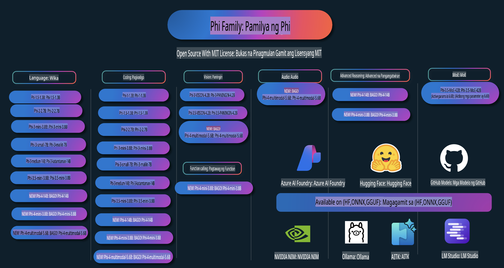

# Phi Cookbook: Mga Praktikal na Halimbawa gamit ang Phi Models ng Microsoft

  

  
  
  

  
  

Ang Phi ay isang serye ng mga open-source AI models na binuo ng Microsoft.  

Sa kasalukuyan, ang Phi ang pinaka-makapangyarihan at cost-effective na small language model (SLM), na may mahusay na performance sa multi-language, reasoning, text/chat generation, coding, mga imahe, audio, at iba pang mga senaryo.  

Maaaring i-deploy ang Phi sa cloud o sa edge devices, at madali kang makakagawa ng generative AI applications kahit limitado ang computing power.

Sundin ang mga hakbang na ito upang magsimula gamit ang mga resource na ito:  
1. **I-Fork ang Repository**: I-click ang   
2. **I-Clone ang Repository**:   `git clone https://github.com/microsoft/PhiCookBook.git`  
3. [**Sumali sa Microsoft AI Discord Community at makipag-ugnayan sa mga eksperto at kapwa developer**](https://discord.com/invite/ByRwuEEgH4?WT.mc_id=aiml-137032-kinfeylo)

## Talaan ng Nilalaman

- Panimula  
  - [Maligayang Pagdating sa Pamilya ng Phi](./md/01.Introduction/01/01.PhiFamily.md)  
  - [Pag-set up ng Iyong Kapaligiran](./md/01.Introduction/01/01.EnvironmentSetup.md)  
  - [Pag-unawa sa Mahahalagang Teknolohiya](./md/01.Introduction/01/01.Understandingtech.md)  
  - [Kaligtasan ng AI para sa Phi Models](./md/01.Introduction/01/01.AISafety.md)  
  - [Suporta ng Hardware para sa Phi](./md/01.Introduction/01/01.Hardwaresupport.md)  
  - [Mga Phi Models at Availability sa Iba't Ibang Platform](./md/01.Introduction/01/01.Edgeandcloud.md)  
  - [Paggamit ng Guidance-ai at Phi](./md/01.Introduction/01/01.Guidance.md)  
  - [Mga Modelo sa GitHub Marketplace](https://github.com/marketplace/models)  
  - [Azure AI Model Catalog](https://ai.azure.com)  

- Pag-inference ng Phi sa iba't ibang kapaligiran  
    - [Hugging Face](./md/01.Introduction/02/01.HF.md)  
    - [Mga Modelo sa GitHub](./md/01.Introduction/02/02.GitHubModel.md)  
    - [Azure AI Foundry Model Catalog](./md/01.Introduction/02/03.AzureAIFoundry.md)  
    - [Ollama](./md/01.Introduction/02/04.Ollama.md)  
    - [AI Toolkit VSCode (AITK)](./md/01.Introduction/02/05.AITK.md)  
    - [NVIDIA NIM](./md/01.Introduction/02/06.NVIDIA.md)  

- Pag-inference ng Pamilya ng Phi  
    - [Pag-inference ng Phi sa iOS](./md/01.Introduction/03/iOS_Inference.md)  
    - [Pag-inference ng Phi sa Android](./md/01.Introduction/03/Android_Inference.md)  
- [Inference Phi sa Jetson](./md/01.Introduction/03/Jetson_Inference.md)
    - [Inference Phi sa AI PC](./md/01.Introduction/03/AIPC_Inference.md)
    - [Inference Phi gamit ang Apple MLX Framework](./md/01.Introduction/03/MLX_Inference.md)
    - [Inference Phi sa Lokal na Server](./md/01.Introduction/03/Local_Server_Inference.md)
    - [Inference Phi sa Remote Server gamit ang AI Toolkit](./md/01.Introduction/03/Remote_Interence.md)
    - [Inference Phi gamit ang Rust](./md/01.Introduction/03/Rust_Inference.md)
    - [Inference Phi--Vision sa Lokal](./md/01.Introduction/03/Vision_Inference.md)
    - [Inference Phi gamit ang Kaito AKS, Azure Containers (opisyal na suporta)](./md/01.Introduction/03/Kaito_Inference.md)
- [Pagku-quantify sa Phi Family](./md/01.Introduction/04/QuantifyingPhi.md)
    - [Pagku-quantize sa Phi-3.5 / 4 gamit ang llama.cpp](./md/01.Introduction/04/UsingLlamacppQuantifyingPhi.md)
    - [Pagku-quantize sa Phi-3.5 / 4 gamit ang Generative AI extensions para sa onnxruntime](./md/01.Introduction/04/UsingORTGenAIQuantifyingPhi.md)
    - [Pagku-quantize sa Phi-3.5 / 4 gamit ang Intel OpenVINO](./md/01.Introduction/04/UsingIntelOpenVINOQuantifyingPhi.md)
    - [Pagku-quantize sa Phi-3.5 / 4 gamit ang Apple MLX Framework](./md/01.Introduction/04/UsingAppleMLXQuantifyingPhi.md)

- Pagsusuri sa Phi
    - [Responsableng AI](./md/01.Introduction/05/ResponsibleAI.md)
    - [Azure AI Foundry para sa Pagsusuri](./md/01.Introduction/05/AIFoundry.md)
    - [Paggamit ng Promptflow para sa Pagsusuri](./md/01.Introduction/05/Promptflow.md)

- RAG gamit ang Azure AI Search
    - [Paano gamitin ang Phi-4-mini at Phi-4-multimodal (RAG) gamit ang Azure AI Search](https://github.com/microsoft/PhiCookBook/blob/main/code/06.E2E/E2E_Phi-4-RAG-Azure-AI-Search.ipynb)

- Mga halimbawa ng pag-develop ng Phi application
  - Mga Aplikasyon sa Teksto at Chat
    - Mga Halimbawa ng Phi-4 🆕
      - [📓] [Chat Gamit ang Phi-4-mini ONNX Model](./md/02.Application/01.TextAndChat/Phi4/ChatWithPhi4ONNX/README.md)
      - [Chat gamit ang Phi-4 lokal ONNX Model .NET](../../md/04.HOL/dotnet/src/LabsPhi4-Chat-01OnnxRuntime)
      - [Chat .NET Console App gamit ang Phi-4 ONNX gamit ang Semantic Kernel](../../md/04.HOL/dotnet/src/LabsPhi4-Chat-02SK)
    - Mga Halimbawa ng Phi-3 / 3.5
      - [Lokal na Chatbot sa browser gamit ang Phi3, ONNX Runtime Web at WebGPU](https://github.com/microsoft/onnxruntime-inference-examples/tree/main/js/chat)
      - [OpenVino Chat](./md/02.Application/01.TextAndChat/Phi3/E2E_OpenVino_Chat.md)
      - [Multi Model - Interaktibong Phi-3-mini at OpenAI Whisper](./md/02.Application/01.TextAndChat/Phi3/E2E_Phi-3-mini_with_whisper.md)
      - [MLFlow - Paggawa ng wrapper at paggamit ng Phi-3 gamit ang MLFlow](./md//02.Application/01.TextAndChat/Phi3/E2E_Phi-3-MLflow.md)
      - [Pag-optimize ng Model - Paano i-optimize ang Phi-3-min model para sa ONNX Runtime Web gamit ang Olive](https://github.com/microsoft/Olive/tree/main/examples/phi3)
      - [WinUI3 App gamit ang Phi-3 mini-4k-instruct-onnx](https://github.com/microsoft/Phi3-Chat-WinUI3-Sample/)
      - [WinUI3 Multi Model AI Powered Notes App Sample](https://github.com/microsoft/ai-powered-notes-winui3-sample)
      - [Pag-fine-tune at Pagsasama ng custom na Phi-3 models gamit ang Prompt flow](./md/02.Application/01.TextAndChat/Phi3/E2E_Phi-3-FineTuning_PromptFlow_Integration.md)
      - [Pag-fine-tune at Pagsasama ng custom na Phi-3 models gamit ang Prompt flow sa Azure AI Foundry](./md/02.Application/01.TextAndChat/Phi3/E2E_Phi-3-FineTuning_PromptFlow_Integration_AIFoundry.md)
      - [Pagsusuri sa Fine-tuned Phi-3 / Phi-3.5 Model sa Azure AI Foundry na Nakatuon sa Prinsipyo ng Responsableng AI ng Microsoft](./md/02.Application/01.TextAndChat/Phi3/E2E_Phi-3-Evaluation_AIFoundry.md)
- [📓] [Phi-3.5-mini-instruct halimbawa ng hula ng wika (Chinese/English)](../../md/02.Application/01.TextAndChat/Phi3/phi3-instruct-demo.ipynb)  
      - [Phi-3.5-Instruct WebGPU RAG Chatbot](./md/02.Application/01.TextAndChat/Phi3/WebGPUWithPhi35Readme.md)  
      - [Paggamit ng Windows GPU upang lumikha ng Prompt flow solution gamit ang Phi-3.5-Instruct ONNX](./md/02.Application/01.TextAndChat/Phi3/UsingPromptFlowWithONNX.md)  
      - [Paggamit ng Microsoft Phi-3.5 tflite upang gumawa ng Android app](./md/02.Application/01.TextAndChat/Phi3/UsingPhi35TFLiteCreateAndroidApp.md)  
      - [Halimbawa ng Q&A .NET gamit ang lokal na ONNX Phi-3 model gamit ang Microsoft.ML.OnnxRuntime](../../md/04.HOL/dotnet/src/LabsPhi301)  
      - [Console chat .NET app gamit ang Semantic Kernel at Phi-3](../../md/04.HOL/dotnet/src/LabsPhi302)  

  - Azure AI Inference SDK Mga Halimbawa ng Code  
    - Phi-4 Mga Halimbawa 🆕  
      - [📓] [Gumawa ng project code gamit ang Phi-4-multimodal](./md/02.Application/02.Code/Phi4/GenProjectCode/README.md)  
    - Phi-3 / 3.5 Mga Halimbawa  
      - [Gumawa ng sarili mong Visual Studio Code GitHub Copilot Chat gamit ang Microsoft Phi-3 Family](./md/02.Application/02.Code/Phi3/VSCodeExt/README.md)  
      - [Gumawa ng sarili mong Visual Studio Code Chat Copilot Agent gamit ang Phi-3.5 sa pamamagitan ng GitHub Models](/md/02.Application/02.Code/Phi3/CreateVSCodeChatAgentWithGitHubModels.md)  

  - Advanced Reasoning Mga Halimbawa  
    - Phi-4 Mga Halimbawa 🆕  
      - [📓] [Phi-4-mini Advanced Reasoning Mga Halimbawa](./md/02.Application/03.AdvancedReasoning/Phi4/AdvancedResoningPhi4mini/README.md)  

  - Mga Demo  
      - [Phi-4-mini demos na naka-host sa Hugging Face Spaces](https://huggingface.co/spaces/microsoft/phi-4-mini?WT.mc_id=aiml-137032-kinfeylo)  
      - [Phi-4-multimodal demos na naka-host sa Hugging Face Spaces](https://huggingface.co/spaces/microsoft/phi-4-multimodal?WT.mc_id=aiml-137032-kinfeylo)  

  - Vision Mga Halimbawa  
    - Phi-4 Mga Halimbawa 🆕  
      - [📓] [Gamitin ang Phi-4-multimodal upang magbasa ng mga larawan at gumawa ng code](./md/02.Application/04.Vision/Phi4/CreateFrontend/README.md)  
    - Phi-3 / 3.5 Mga Halimbawa  
      - [📓][Phi-3-vision-Image text to text](../../md/02.Application/04.Vision/Phi3/E2E_Phi-3-vision-image-text-to-text-online-endpoint.ipynb)  
      - [Phi-3-vision-ONNX](https://onnxruntime.ai/docs/genai/tutorials/phi3-v.html)  
      - [📓][Phi-3-vision CLIP Embedding](../../md/02.Application/04.Vision/Phi3/E2E_Phi-3-vision-image-text-to-text-online-endpoint.ipynb)  
      - [DEMO: Phi-3 Recycling](https://github.com/jennifermarsman/PhiRecycling/)  
      - [Phi-3-vision - Visual language assistant - gamit ang Phi3-Vision at OpenVINO](https://docs.openvino.ai/nightly/notebooks/phi-3-vision-with-output.html)  
      - [Phi-3 Vision Nvidia NIM](./md/02.Application/04.Vision/Phi3/E2E_Nvidia_NIM_Vision.md)  
      - [Phi-3 Vision OpenVino](./md/02.Application/04.Vision/Phi3/E2E_OpenVino_Phi3Vision.md)  
      - [📓][Phi-3.5 Vision multi-frame o multi-image halimbawa](../../md/02.Application/04.Vision/Phi3/phi3-vision-demo.ipynb)  
      - [Phi-3 Vision Lokal na ONNX Model gamit ang Microsoft.ML.OnnxRuntime .NET](../../md/04.HOL/dotnet/src/LabsPhi303)  
      - [Menu-based Phi-3 Vision Lokal na ONNX Model gamit ang Microsoft.ML.OnnxRuntime .NET](../../md/04.HOL/dotnet/src/LabsPhi304)  

  - Audio Mga Halimbawa  
    - Phi-4 Mga Halimbawa 🆕  
      - [📓] [Pagkuha ng audio transcripts gamit ang Phi-4-multimodal](./md/02.Application/05.Audio/Phi4/Transciption/README.md)  
      - [📓] [Phi-4-multimodal Audio Halimbawa](../../md/02.Application/05.Audio/Phi4/Siri/demo.ipynb)  
      - [📓] [Phi-4-multimodal Speech Translation Halimbawa](../../md/02.Application/05.Audio/Phi4/Translate/demo.ipynb)  
      - [.NET console application gamit ang Phi-4-multimodal Audio upang suriin ang audio file at gumawa ng transcript](../../md/04.HOL/dotnet/src/LabsPhi4-MultiModal-02Audio)  

  - MOE Mga Halimbawa  
    - Phi-3 / 3.5 Mga Halimbawa  
      - [📓] [Phi-3.5 Mixture of Experts Models (MoEs) Social Media Halimbawa](../../md/02.Application/06.MoE/Phi3/phi3_moe_demo.ipynb)  
      - [📓] [Paggawa ng Retrieval-Augmented Generation (RAG) Pipeline gamit ang NVIDIA NIM Phi-3 MOE, Azure AI Search, at LlamaIndex](../../md/02.Application/06.MoE/Phi3/azure-ai-search-nvidia-rag.ipynb)  

  - Mga Halimbawa ng Function Calling  
    - Phi-4 Mga Halimbawa 🆕  
      - [📓] [Paggamit ng Function Calling Gamit ang Phi-4-mini](./md/02.Application/07.FunctionCalling/Phi4/FunctionCallingBasic/README.md)  

  - Mga Halimbawa ng Multimodal Mixing  
    - Phi-4 Mga Halimbawa 🆕  
-  [📓] [Paggamit ng Phi-4-multimodal bilang isang Technology journalist](../../md/02.Application/08.Multimodel/Phi4/TechJournalist/phi_4_mm_audio_text_publish_news.ipynb)  
      - [.NET console application gamit ang Phi-4-multimodal para suriin ang mga imahe](../../md/04.HOL/dotnet/src/LabsPhi4-MultiModal-01Images)

- Fine-tuning Phi Samples  
  - [Mga Senaryo ng Fine-tuning](./md/03.FineTuning/FineTuning_Scenarios.md)  
  - [Fine-tuning kumpara sa RAG](./md/03.FineTuning/FineTuning_vs_RAG.md)  
  - [Fine-tuning: Hayaan ang Phi-3 na maging eksperto sa industriya](./md/03.FineTuning/LetPhi3gotoIndustriy.md)  
  - [Fine-tuning Phi-3 gamit ang AI Toolkit para sa VS Code](./md/03.FineTuning/Finetuning_VSCodeaitoolkit.md)  
  - [Fine-tuning Phi-3 gamit ang Azure Machine Learning Service](./md/03.FineTuning/Introduce_AzureML.md)  
  - [Fine-tuning Phi-3 gamit ang Lora](./md/03.FineTuning/FineTuning_Lora.md)  
  - [Fine-tuning Phi-3 gamit ang QLora](./md/03.FineTuning/FineTuning_Qlora.md)  
  - [Fine-tuning Phi-3 gamit ang Azure AI Foundry](./md/03.FineTuning/FineTuning_AIFoundry.md)  
  - [Fine-tuning Phi-3 gamit ang Azure ML CLI/SDK](./md/03.FineTuning/FineTuning_MLSDK.md)  
  - [Fine-tuning gamit ang Microsoft Olive](./md/03.FineTuning/FineTuning_MicrosoftOlive.md)  
  - [Fine-tuning gamit ang Microsoft Olive Hands-On Lab](./md/03.FineTuning/olive-lab/readme.md)  
  - [Fine-tuning Phi-3-vision gamit ang Weights and Bias](./md/03.FineTuning/FineTuning_Phi-3-visionWandB.md)  
  - [Fine-tuning Phi-3 gamit ang Apple MLX Framework](./md/03.FineTuning/FineTuning_MLX.md)  
  - [Fine-tuning Phi-3-vision (opisyal na suporta)](./md/03.FineTuning/FineTuning_Vision.md)  
  - [Fine-Tuning Phi-3 gamit ang Kaito AKS, Azure Containers (opisyal na suporta)](./md/03.FineTuning/FineTuning_Kaito.md)  
  - [Fine-Tuning Phi-3 at 3.5 Vision](https://github.com/2U1/Phi3-Vision-Finetune)  

- Hands on Lab  
  - [Paggalugad sa mga pinakabagong modelo: LLMs, SLMs, lokal na pag-develop, at iba pa](https://github.com/microsoft/aitour-exploring-cutting-edge-models)  
  - [Pagbubukas ng Potensyal ng NLP: Fine-Tuning gamit ang Microsoft Olive](https://github.com/azure/Ignite_FineTuning_workshop)  

- Mga Academic Research Papers at Publikasyon  
  - [Textbooks Are All You Need II: phi-1.5 technical report](https://arxiv.org/abs/2309.05463)  
  - [Phi-3 Technical Report: Isang Highly Capable Language Model na Lokal sa Iyong Telepono](https://arxiv.org/abs/2404.14219)  
  - [Phi-4 Technical Report](https://arxiv.org/abs/2412.08905)  
  - [Pag-optimize ng Maliit na Language Models para sa In-Vehicle Function-Calling](https://arxiv.org/abs/2501.02342)  
  - [(WhyPHI) Fine-Tuning PHI-3 para sa Multiple-Choice Question Answering: Methodology, Results, at Mga Hamon](https://arxiv.org/abs/2501.01588)  

## Paggamit ng Phi Models  

### Phi sa Azure AI Foundry  

Maaari kang matuto kung paano gamitin ang Microsoft Phi at kung paano bumuo ng E2E solutions sa iba't ibang hardware devices. Para maranasan ang Phi, magsimula sa pamamagitan ng pagsubok sa mga modelo at pag-customize ng Phi para sa iyong mga senaryo gamit ang [Azure AI Foundry Azure AI Model Catalog](https://aka.ms/phi3-azure-ai). Maaari kang matuto pa sa Getting Started with [Azure AI Foundry](/md/02.QuickStart/AzureAIFoundry_QuickStart.md).  

**Playground**  
Ang bawat modelo ay may dedikadong playground para subukan ang modelo [Azure AI Playground](https://aka.ms/try-phi3).  

### Phi sa GitHub Models  

Maaari kang matuto kung paano gamitin ang Microsoft Phi at kung paano bumuo ng E2E solutions sa iba't ibang hardware devices. Para maranasan ang Phi, magsimula sa pamamagitan ng pagsubok sa modelo at pag-customize ng Phi para sa iyong mga senaryo gamit ang [GitHub Model Catalog](https://github.com/marketplace/models?WT.mc_id=aiml-137032-kinfeylo). Maaari kang matuto pa sa Getting Started with [GitHub Model Catalog](/md/02.QuickStart/GitHubModel_QuickStart.md).  

**Playground**  
Ang bawat modelo ay may nakalaang [playground para subukan ang modelo](/md/02.QuickStart/GitHubModel_QuickStart.md).

### Phi sa Hugging Face

Makikita mo rin ang modelo sa [Hugging Face](https://huggingface.co/microsoft)

**Playground**  
[Hugging Chat playground](https://huggingface.co/chat/models/microsoft/Phi-3-mini-4k-instruct)

## Responsableng AI 

Ang Microsoft ay nakatuon sa pagtulong sa aming mga customer na gamitin ang aming mga AI na produkto nang responsable, pagbabahagi ng aming mga natutunan, at pagbuo ng mga partnership na nakabatay sa tiwala gamit ang mga tool tulad ng Transparency Notes at Impact Assessments. Marami sa mga mapagkukunang ito ay makikita sa [https://aka.ms/RAI](https://aka.ms/RAI).  
Ang diskarte ng Microsoft sa responsableng AI ay nakabatay sa aming mga prinsipyo ng AI: pagiging patas, pagiging maaasahan at kaligtasan, privacy at seguridad, pagiging inklusibo, transparency, at pananagutan.

Ang mga malalaking modelo para sa natural language, imahe, at pagsasalita - tulad ng mga ginamit sa halimbawang ito - ay maaaring umasta sa mga paraang hindi patas, hindi maaasahan, o nakakasakit, na maaaring magdulot ng pinsala. Mangyaring sumangguni sa [Azure OpenAI service Transparency note](https://learn.microsoft.com/legal/cognitive-services/openai/transparency-note?tabs=text) upang maging pamilyar sa mga panganib at limitasyon.

Ang inirerekomendang paraan upang mabawasan ang mga panganib na ito ay ang pagsama ng safety system sa iyong arkitektura na maaaring makakita at pumigil sa mapanirang gawi. Ang [Azure AI Content Safety](https://learn.microsoft.com/azure/ai-services/content-safety/overview) ay nagbibigay ng isang independiyenteng layer ng proteksyon, na kayang tukuyin ang mapanirang nilalaman na gawa ng user o AI sa mga aplikasyon at serbisyo. Kasama sa Azure AI Content Safety ang mga text at image API na nagbibigay-daan sa iyong matukoy ang nakakapinsalang materyal. Sa loob ng Azure AI Foundry, ang Content Safety service ay nagbibigay-daan sa iyo na tingnan, galugarin, at subukan ang sample code para sa pagtukoy ng mapanirang nilalaman sa iba't ibang modality. Ang sumusunod na [quickstart documentation](https://learn.microsoft.com/azure/ai-services/content-safety/quickstart-text?tabs=visual-studio%2Clinux&pivots=programming-language-rest) ay gagabay sa iyo sa paggawa ng mga kahilingan sa serbisyo.

Isa pang aspeto na kailangang isaalang-alang ay ang kabuuang performance ng aplikasyon. Sa mga multi-modal at multi-model na aplikasyon, ang performance ay nangangahulugang gumagana ang sistema ayon sa inaasahan mo at ng iyong mga user, kabilang ang hindi paglikha ng mapanirang output. Mahalaga na suriin ang performance ng kabuuang aplikasyon gamit ang [Performance and Quality and Risk and Safety evaluators](https://learn.microsoft.com/azure/ai-studio/concepts/evaluation-metrics-built-in). May kakayahan ka ring lumikha at mag-evaluate gamit ang [custom evaluators](https://learn.microsoft.com/azure/ai-studio/how-to/develop/evaluate-sdk#custom-evaluators).

Maaari mong suriin ang iyong AI na aplikasyon sa iyong development environment gamit ang [Azure AI Evaluation SDK](https://microsoft.github.io/promptflow/index.html). Gamit ang test dataset o target, ang iyong generative AI application outputs ay sinusukat nang quantitatively gamit ang built-in evaluators o custom evaluators na iyong pinili. Upang makapagsimula sa Azure AI Evaluation SDK para suriin ang iyong sistema, maaari mong sundan ang [quickstart guide](https://learn.microsoft.com/azure/ai-studio/how-to/develop/flow-evaluate-sdk). Kapag naisagawa mo na ang isang evaluation run, maaari mong [i-visualize ang mga resulta sa Azure AI Foundry](https://learn.microsoft.com/azure/ai-studio/how-to/evaluate-flow-results).

## Mga Trademark

Ang proyektong ito ay maaaring naglalaman ng mga trademark o logo para sa mga proyekto, produkto, o serbisyo. Ang awtorisadong paggamit ng mga trademark o logo ng Microsoft ay dapat sumunod at nakabatay sa [Microsoft's Trademark & Brand Guidelines](https://www.microsoft.com/legal/intellectualproperty/trademarks/usage/general).  
Ang paggamit ng mga trademark o logo ng Microsoft sa mga binagong bersyon ng proyektong ito ay hindi dapat magdulot ng kalituhan o magpahiwatig ng sponsorship mula sa Microsoft. Ang anumang paggamit ng mga third-party na trademark o logo ay nakabatay sa mga patakaran ng mga third-party na iyon.

**Paunawa**:  
Ang dokumentong ito ay isinalin gamit ang mga serbisyo ng AI na nakabatay sa makina. Bagama't pinagsisikapan naming maging wasto, mangyaring tandaan na ang mga awtomatikong pagsasalin ay maaaring maglaman ng mga pagkakamali o hindi tumpak na impormasyon. Ang orihinal na dokumento sa sarili nitong wika ang dapat ituring na pangunahing sanggunian. Para sa mahahalagang impormasyon, inirerekomenda ang propesyonal na pagsasalin ng tao. Hindi kami mananagot para sa anumang hindi pagkakaunawaan o maling interpretasyon na dulot ng paggamit ng pagsasaling ito.