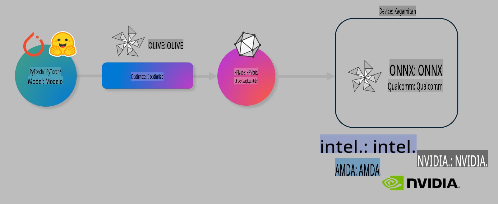

# Lab. I-optimize ang AI models para sa on-device inference

## Panimula

> [!IMPORTANT]
> Ang lab na ito ay nangangailangan ng **Nvidia A10 o A100 GPU** kasama ang mga kaugnay na drivers at CUDA toolkit (bersyon 12 pataas).

> [!NOTE]
> Ang lab na ito ay tatagal ng **35 minuto** at magbibigay sa iyo ng praktikal na pagpapakilala sa mga pangunahing konsepto ng pag-optimize ng mga modelo para sa on-device inference gamit ang OLIVE.

## Mga Layunin sa Pagkatuto

Sa pagtatapos ng lab na ito, magagamit mo ang OLIVE upang:

- I-quantize ang isang AI Model gamit ang AWQ quantization method.
- I-fine-tune ang isang AI model para sa isang partikular na gawain.
- Gumawa ng LoRA adapters (fine-tuned model) para sa mas epektibong on-device inference gamit ang ONNX Runtime.

### Ano ang Olive

Ang Olive (*O*NNX *live*) ay isang toolkit para sa model optimization na may kasamang CLI na nagbibigay-daan sa iyo upang mag-deploy ng mga modelo para sa ONNX runtime +++https://onnxruntime.ai+++ na may kalidad at performance.



Karaniwang input sa Olive ay isang PyTorch o Hugging Face model, at ang output nito ay isang optimized ONNX model na tumatakbo sa isang device (deployment target) gamit ang ONNX runtime. Ina-optimize ng Olive ang modelo para sa AI accelerator (NPU, GPU, CPU) ng deployment target na ibinigay ng hardware vendor tulad ng Qualcomm, AMD, Nvidia, o Intel.

Ang Olive ay nagpapatakbo ng isang *workflow*, isang nakaayos na sequence ng mga indibidwal na gawain sa model optimization na tinatawag na *passes*. Halimbawa ng mga passes ay: model compression, graph capture, quantization, at graph optimization. Ang bawat pass ay may mga parameter na maaaring i-tune upang makamit ang pinakamainam na metrics, tulad ng accuracy at latency, na sinusuri ng kaukulang evaluator. Ang Olive ay gumagamit ng search strategy na nag-o-auto-tune ng bawat pass isa-isa o magkakasamang set ng mga passes.

#### Mga Benepisyo ng Olive

- **Nababawasan ang pagkabahala at oras** ng trial-and-error sa manual na pag-eksperimento gamit ang iba't ibang teknolohiya para sa graph optimization, compression, at quantization. Tukuyin ang iyong quality at performance constraints at hayaan ang Olive na awtomatikong hanapin ang pinakamahusay na modelo para sa iyo.
- **40+ built-in na model optimization components** na sumasaklaw sa mga pinakabagong teknolohiya sa quantization, compression, graph optimization, at fine-tuning.
- **Madaling gamitin na CLI** para sa mga karaniwang gawain sa model optimization. Halimbawa, olive quantize, olive auto-opt, olive finetune.
- May kasamang model packaging at deployment.
- Sinusuportahan ang pagbuo ng mga modelo para sa **Multi LoRA serving**.
- Gumawa ng workflows gamit ang YAML/JSON upang mag-orchestrate ng mga gawain sa model optimization at deployment.
- **Hugging Face** at **Azure AI** Integration.
- Built-in na **caching** mechanism upang **makatipid sa gastos**.

## Mga Instruksyon sa Lab

> [!NOTE]
> Tiyakin na na-setup mo na ang iyong Azure AI Hub at Project, at na-configure ang iyong A100 compute ayon sa Lab 1.

### Hakbang 0: Kumonekta sa iyong Azure AI Compute

Ikokonekta mo ang Azure AI compute gamit ang remote feature sa **VS Code.**

1. Buksan ang iyong **VS Code** desktop application:
1. Buksan ang **command palette** gamit ang **Shift+Ctrl+P**.
1. Sa command palette, hanapin ang **AzureML - remote: Connect to compute instance in New Window**.
1. Sundin ang mga on-screen na tagubilin upang kumonekta sa Compute. Kasama dito ang pagpili ng iyong Azure Subscription, Resource Group, Project, at Compute name na na-setup mo sa Lab 1.
1. Kapag nakakonekta ka na sa iyong Azure ML Compute node, makikita ito sa **ibabang kaliwang bahagi ng Visual Code** `><Azure ML: Compute Name`.

### Hakbang 1: I-clone ang repo na ito

Sa VS Code, maaari kang magbukas ng bagong terminal gamit ang **Ctrl+J** at i-clone ang repo na ito:

Sa terminal, dapat mong makita ang prompt:

```
azureuser@computername:~/cloudfiles/code$ 
```
I-clone ang solusyon:

```bash
cd ~/localfiles
git clone https://github.com/microsoft/phi-3cookbook.git
```

### Hakbang 2: Buksan ang Folder sa VS Code

Upang buksan ang VS Code sa kaukulang folder, i-execute ang sumusunod na command sa terminal, na magbubukas ng bagong window:

```bash
code phi-3cookbook/code/04.Finetuning/Olive-lab
```

Bilang alternatibo, maaari mong buksan ang folder sa pamamagitan ng pagpili sa **File** > **Open Folder**.

### Hakbang 3: Mga Dependencies

Magbukas ng terminal window sa VS Code sa iyong Azure AI Compute Instance (tip: **Ctrl+J**) at i-execute ang sumusunod na mga command upang mai-install ang mga dependencies:

```bash
conda create -n olive-ai python=3.11 -y
conda activate olive-ai
pip install -r requirements.txt
az extension remove -n azure-cli-ml
az extension add -n ml
```

> [!NOTE]
> Tatagal ito ng humigit-kumulang **5 minuto** upang ma-install ang lahat ng dependencies.

Sa lab na ito, magda-download at mag-a-upload ka ng mga modelo sa Azure AI Model catalog. Upang ma-access ang model catalog, kailangan mong mag-login sa Azure gamit ang:

```bash
az login
```

> [!NOTE]
> Sa oras ng pag-login, hihilingin sa iyong piliin ang iyong subscription. Tiyakin na ang subscription ay nakatakda sa ibinigay para sa lab na ito.

### Hakbang 4: I-execute ang mga Olive commands

Magbukas ng terminal window sa VS Code sa iyong Azure AI Compute Instance (tip: **Ctrl+J**) at tiyaking naka-activate ang `olive-ai` conda environment:

```bash
conda activate olive-ai
```

Pagkatapos, i-execute ang mga sumusunod na Olive commands sa command line.

1. **Suriin ang data:** Sa halimbawang ito, i-fine-tune mo ang Phi-3.5-Mini model upang maging espesyalista sa pagsagot ng mga tanong tungkol sa paglalakbay. Ang code sa ibaba ay nagpapakita ng unang ilang records ng dataset, na nasa JSON lines format:

    ```bash
    head data/data_sample_travel.jsonl
    ```

1. **I-quantize ang model:** Bago i-train ang modelo, i-quantize muna gamit ang sumusunod na command na gumagamit ng teknolohiyang tinatawag na Active Aware Quantization (AWQ) +++https://arxiv.org/abs/2306.00978+++. Ang AWQ ay nagku-quantize ng weights ng isang modelo sa pamamagitan ng pagsasaalang-alang sa activations na nalilikha sa panahon ng inference. Ibig sabihin, isinasaalang-alang ng proseso ng quantization ang aktwal na data distribution sa activations, na nagreresulta sa mas mahusay na pagpapanatili ng accuracy ng modelo kumpara sa tradisyunal na weight quantization methods.

    ```bash
    olive quantize \
       --model_name_or_path microsoft/Phi-3.5-mini-instruct \
       --trust_remote_code \
       --algorithm awq \
       --output_path models/phi/awq \
       --log_level 1
    ```
    
    Tatagal ito ng **~8 minuto** upang makumpleto ang AWQ quantization, na magbabawas sa laki ng modelo mula **~7.5GB patungong ~2.5GB**.

    Sa lab na ito, ipapakita namin kung paano mag-input ng mga modelo mula sa Hugging Face (halimbawa: `microsoft/Phi-3.5-mini-instruct`). However, Olive also allows you to input models from the Azure AI catalog by updating the `model_name_or_path` argument to an Azure AI asset ID (for example:  `azureml://registries/azureml/models/Phi-3.5-mini-instruct/versions/4`). 

1. **Train the model:** Next, the `olive finetune` command na nagfi-finetune sa quantized model. Ang pag-quantize sa modelo *bago* ang fine-tuning sa halip na pagkatapos nito ay nagbibigay ng mas mahusay na accuracy dahil ang proseso ng fine-tuning ay nakakabawi sa ilang pagkawala mula sa quantization.

    ```bash
    olive finetune \
        --method lora \
        --model_name_or_path models/phi/awq \
        --data_files "data/data_sample_travel.jsonl" \
        --data_name "json" \
        --text_template "<|user|>\n{prompt}<|end|>\n<|assistant|>\n{response}<|end|>" \
        --max_steps 100 \
        --output_path ./models/phi/ft \
        --log_level 1
    ```
    
    Tatagal ito ng **~6 minuto** upang makumpleto ang Fine-tuning (gamit ang 100 steps).

1. **I-optimize:** Kapag na-train na ang modelo, i-optimize ito gamit ang Olive `auto-opt` command, which will capture the ONNX graph and automatically perform a number of optimizations to improve the model performance for CPU by compressing the model and doing fusions. It should be noted, that you can also optimize for other devices such as NPU or GPU by just updating the `--device` and `--provider` arguments - ngunit para sa layunin ng lab na ito, gagamit tayo ng CPU.

    ```bash
    olive auto-opt \
       --model_name_or_path models/phi/ft/model \
       --adapter_path models/phi/ft/adapter \
       --device cpu \
       --provider CPUExecutionProvider \
       --use_ort_genai \
       --output_path models/phi/onnx-ao \
       --log_level 1
    ```
    
    Tatagal ito ng **~5 minuto** upang makumpleto ang optimization.

### Hakbang 5: Mabilisang Pagsubok ng Model Inference

Upang masubukan ang inferencing ng modelo, gumawa ng Python file sa iyong folder na tinatawag na **app.py** at kopyahin at i-paste ang sumusunod na code:

```python
import onnxruntime_genai as og
import numpy as np

print("loading model and adapters...", end="", flush=True)
model = og.Model("models/phi/onnx-ao/model")
adapters = og.Adapters(model)
adapters.load("models/phi/onnx-ao/model/adapter_weights.onnx_adapter", "travel")
print("DONE!")

tokenizer = og.Tokenizer(model)
tokenizer_stream = tokenizer.create_stream()

params = og.GeneratorParams(model)
params.set_search_options(max_length=100, past_present_share_buffer=False)
user_input = "what is the best thing to see in chicago"
params.input_ids = tokenizer.encode(f"<|user|>\n{user_input}<|end|>\n<|assistant|>\n")

generator = og.Generator(model, params)

generator.set_active_adapter(adapters, "travel")

print(f"{user_input}")

while not generator.is_done():
    generator.compute_logits()
    generator.generate_next_token()

    new_token = generator.get_next_tokens()[0]
    print(tokenizer_stream.decode(new_token), end='', flush=True)

print("\n")
```

I-execute ang code gamit ang:

```bash
python app.py
```

### Hakbang 6: I-upload ang Model sa Azure AI

Ang pag-upload ng modelo sa Azure AI model repository ay nagbibigay-daan upang maibahagi ang modelo sa iba pang miyembro ng iyong development team at nagbibigay din ng version control para sa modelo. Upang i-upload ang modelo, i-run ang sumusunod na command:

> [!NOTE]
> I-update ang `{}` placeholders with the name of your resource group and Azure AI Project Name. 

To find your resource group `"resourceGroup" at Azure AI Project name, i-run ang sumusunod na command:

```
az ml workspace show
```

O pumunta sa +++ai.azure.com+++ at piliin ang **management center** **project** **overview**.

I-update ang `{}` placeholders gamit ang pangalan ng iyong resource group at Azure AI Project Name.

```bash
az ml model create \
    --name ft-for-travel \
    --version 1 \
    --path ./models/phi/onnx-ao \
    --resource-group {RESOURCE_GROUP_NAME} \
    --workspace-name {PROJECT_NAME}
```
Makikita mo na ngayon ang iyong na-upload na modelo at ma-deploy ito sa https://ml.azure.com/model/list

**Paunawa**:  
Ang dokumentong ito ay isinalin gamit ang mga serbisyo ng AI na batay sa makina. Habang sinisikap naming maging tumpak, pakatandaan na ang mga awtomatikong pagsasalin ay maaaring maglaman ng mga pagkakamali o hindi tumpak na impormasyon. Ang orihinal na dokumento sa wika nito ang dapat ituring na opisyal na mapagkukunan. Para sa mahalagang impormasyon, inirerekomenda ang propesyonal na pagsasalin ng tao. Kami ay hindi mananagot para sa anumang hindi pagkakaunawaan o maling interpretasyon na dulot ng paggamit ng pagsasaling ito.